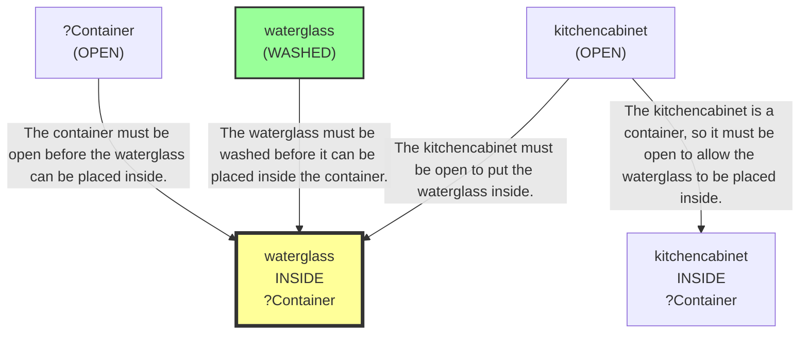
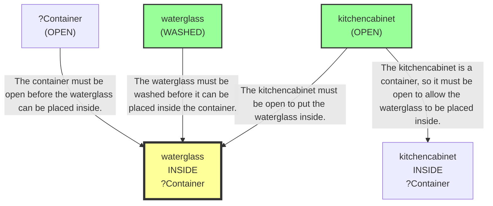

# 🚀 VirtualHome Agent Episode Log


### [GoalReasoner (Module A - Intent)] Output
```json
{
  "is_instruction_obviously_vague": false,
  "clarification_question": null,
  "target_object": "waterglass",
  "location_hint": "kitchencabinet",
  "reasoning_chain": [
    {
      "question": "Why does the user want this object?",
      "answer": "The user wants to place a waterglass inside the kitchencabinet."
    },
    {
      "question": "Why is that important?",
      "answer": "The user wants to organize or store the waterglass in a designated location."
    },
    {
      "question": "What fundamental need does this fulfill?",
      "answer": "The user wants to maintain order and accessibility of items in the kitchen."
    },
    {
      "question": "Are there any deeper psychological or physical motivations?",
      "answer": "The user may want to ensure the waterglass is in a safe and accessible place for future use."
    }
  ],
  "deep_intent": "The user wants to organize and store a waterglass in a designated location.",
  "acceptable_alternatives_properties": [
    {
      "priority": 1,
      "description": "Other glassware items like a mug or bowl that can be stored in the kitchencabinet."
    },
    {
      "priority": 2,
      "description": "Kitchen utensils or containers that are typically stored in cabinets."
    },
    {
      "priority": 3,
      "description": "Items that require storage in a kitchen cabinet, such as plates or cutlery."
    },
    {
      "priority": 4,
      "description": "Any item that needs to be placed in a storage location for organization purposes."
    }
  ]
}
```

### [PerceptionFilter] Output
```json
{
  "reasoning": "The goal is to organize and store a waterglass in a designated location, specifically the kitchencabinet. To achieve this, the kitchencabinet must be open, and the waterglass must be washed. The waterglass itself is the target object, and the kitchencabinet is the designated location. Additionally, the SDG implies that the container (kitchencabinet) must be open, so we must include it. No alternative tools are needed since the task is straightforward and does not require additional functional tools or backups.",
  "selected_classes": [
    "character",
    "plate",
    "fridge",
    "waterglass",
    "kitchencabinet"
  ],
  "raw_class_count": 50
}
```

### [LLMExecutor] Output
```json
{
  "reasoning": "The waterglass (64) is already washed and clean, so the next step is to put it inside the kitchencabinet. Since the kitchencabinet is already open, I need to grab the waterglass and then put it inside the kitchencabinet.",
  "satisfied_nodes": [
    "N2"
  ],
  "current_node_focus": "N3",
  "mapped_variables": {
    "?Container": "kitchencabinet(138)"
  },
  "action": "[grab] <waterglass> (64)"
}
```

### [RoboStateMultiTaskController] Output
```json
{
  "action": "[grab] <waterglass> (64)",
  "active_task_id": "task_1",
  "task_context": {
    "active_task_id": "task_1",
    "pending_task_ids": [],
    "satisfied_task_ids": []
  },
  "source": "llm_executor"
}
```
## Step 0
- **Action**: `[grab] <waterglass> (64)`
- **Action Success**: `True`
- **Action Message**: {'0': {'message': 'Success'}}
- **Active Task**: `task_1`
- **Decision Source**: `llm_executor`
- **Task Progress**: T4_qwen_M4_17=pending
- **SDG Status**:

- **Observed Items (32)**: waterglass(64) [CLEAN,EMPTY], plate(67), plate(68), waterglass(71) [DIRTY], waterglass(72) [DIRTY], plate(75), plate(76), waterglass(79), waterglass(80), plate(83), plate(84), waterglass(87), waterglass(88), plate(91), waterglass(100)...


### [PerceptionFilter] Output
```json
{
  "reasoning": "Reused cached class selection.",
  "selected_classes": [
    "character",
    "plate",
    "fridge",
    "waterglass",
    "kitchencabinet"
  ],
  "raw_class_count": 50
}
```

### [LLMExecutor] Output
```json
{
  "reasoning": "The waterglass (64) is already washed and clean, and I am currently holding it. The next step is to put it inside the kitchencabinet. Since the kitchencabinet is already open, I can directly [putin] the waterglass into it. I do not need to walk to the kitchencabinet again as I am already near it.",
  "satisfied_nodes": [
    "N2"
  ],
  "current_node_focus": "N3",
  "mapped_variables": {
    "?Container": "kitchencabinet(138)"
  },
  "action": "[putin] <waterglass> (64) <kitchencabinet> (138)"
}
```

### [RoboStateMultiTaskController] Output
```json
{
  "action": "[walk] <kitchencabinet> (138)",
  "active_task_id": "task_1",
  "task_context": {
    "active_task_id": "task_1",
    "pending_task_ids": [],
    "satisfied_task_ids": []
  },
  "source": "llm_executor_repaired"
}
```
## Step 1
- **Action**: `[walk] <kitchencabinet> (138)`
- **Action Success**: `True`
- **Action Message**: {'0': {'message': 'Success'}}
- **Active Task**: `task_1`
- **Decision Source**: `llm_executor_repaired`
- **Task Progress**: T4_qwen_M4_17=pending
- **SDG Status**:

- **Observed Items (32)**: waterglass(64) [CLEAN,EMPTY], plate(67), plate(68), waterglass(71) [DIRTY], waterglass(72) [DIRTY], plate(75), plate(76), waterglass(79), waterglass(80), plate(83), plate(84), waterglass(87), waterglass(88), plate(91), waterglass(100)...


### [PerceptionFilter] Output
```json
{
  "reasoning": "Reused cached class selection.",
  "selected_classes": [
    "character",
    "plate",
    "fridge",
    "waterglass",
    "kitchencabinet"
  ],
  "raw_class_count": 50
}
```

### [LLMExecutor] Output
```json
{
  "reasoning": "The waterglass (64) is already washed and clean. The kitchencabinet (138) is open, so the next step is to put the waterglass inside the kitchencabinet. Since the kitchencabinet is already open, we can directly use [putin] to place the waterglass inside it.",
  "satisfied_nodes": [
    "N1",
    "N2"
  ],
  "current_node_focus": "N3",
  "mapped_variables": {
    "?Container": "kitchencabinet(138)"
  },
  "action": "[putin] <waterglass> (64) <kitchencabinet> (138)"
}
```

### [RoboStateMultiTaskController] Output
```json
{
  "action": "[putin] <waterglass> (64) <kitchencabinet> (138)",
  "active_task_id": "task_1",
  "task_context": {
    "active_task_id": "task_1",
    "pending_task_ids": [],
    "satisfied_task_ids": []
  },
  "source": "llm_executor"
}
```
## Step 2
- **Action**: `[putin] <waterglass> (64) <kitchencabinet> (138)`
- **Action Success**: `True`
- **Action Message**: {'0': {'message': 'Success'}}
- **Active Task**: `task_1`
- **Decision Source**: `llm_executor`
- **Task Progress**: T4_qwen_M4_17=done
- **SDG Status**:

- **Observed Items (32)**: waterglass(64) [CLEAN,EMPTY], plate(67), plate(68), waterglass(71) [DIRTY], waterglass(72) [DIRTY], plate(75), plate(76), waterglass(79), waterglass(80), plate(83), plate(84), waterglass(87), waterglass(88), plate(91), waterglass(100)...

