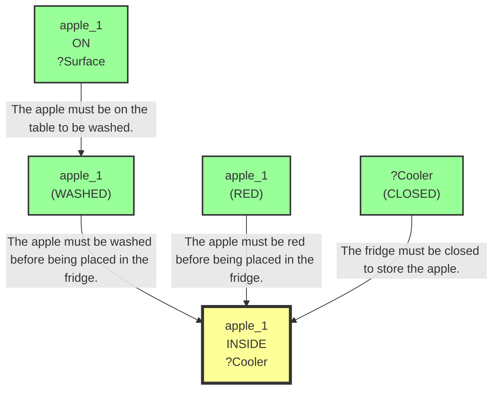
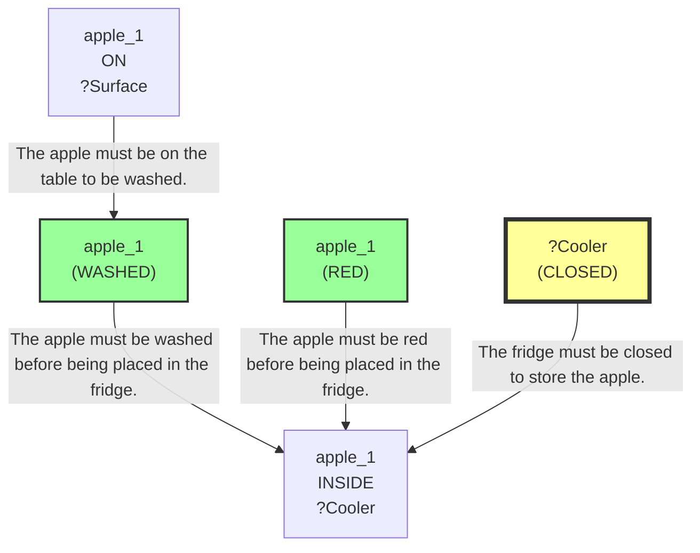
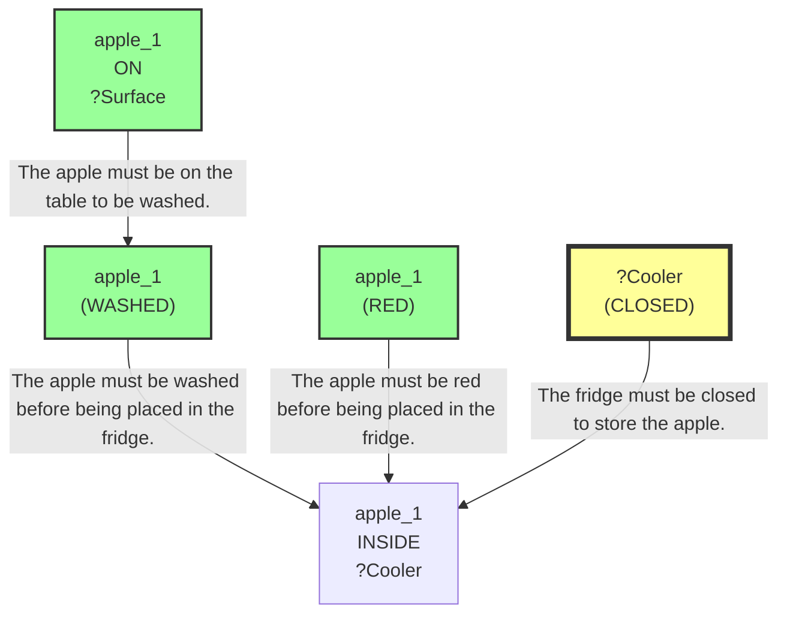
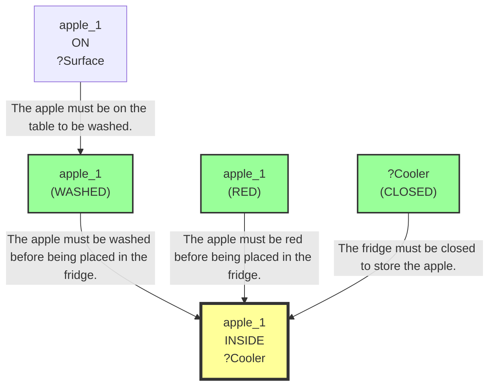
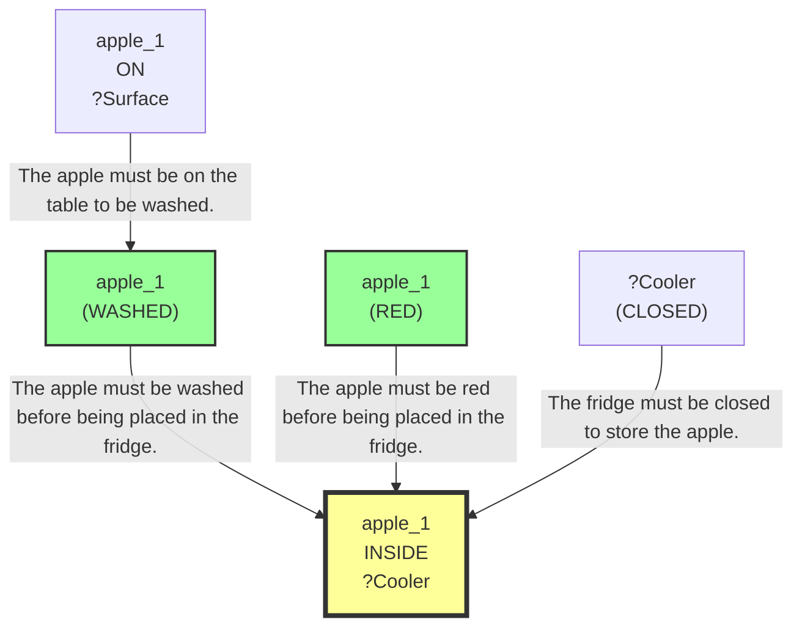
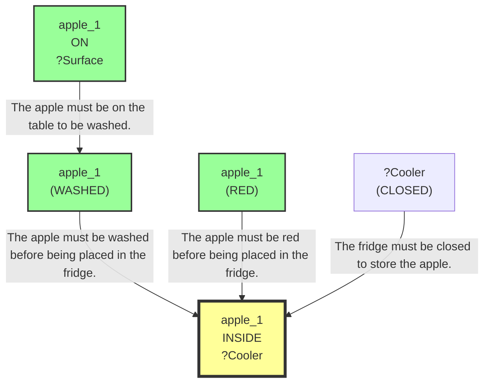
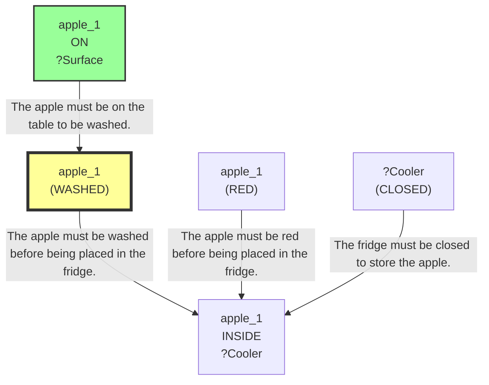
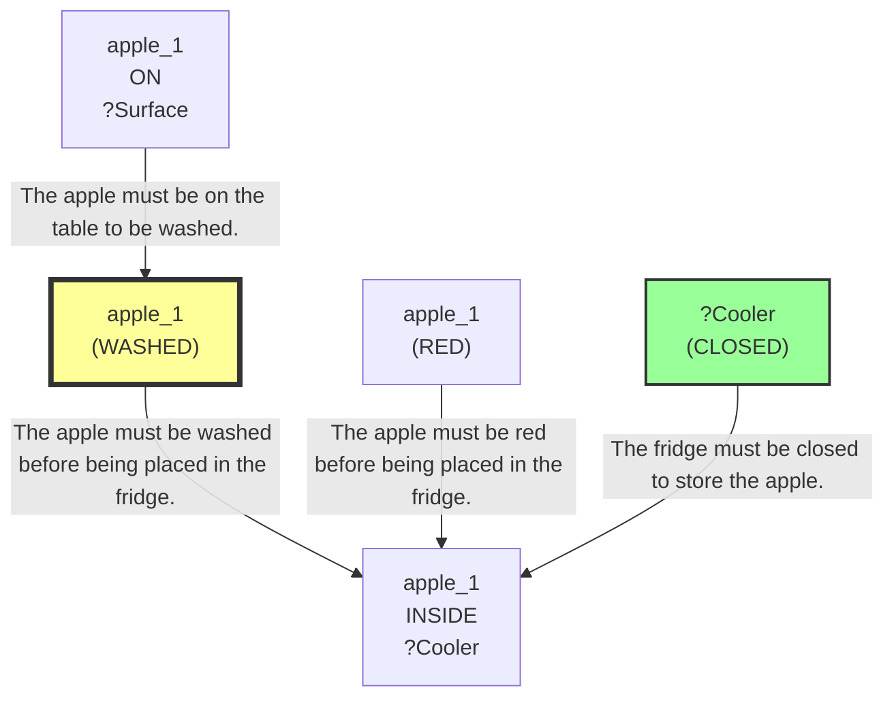

# 🚀 VirtualHome Agent Episode Log


### [GoalReasoner (Module A - Intent)] Output
```json
{
  "is_instruction_obviously_vague": false,
  "clarification_question": null,
  "target_object": "apple",
  "location_hint": "table",
  "reasoning_chain": [
    {
      "question": "Why does the user want this object?",
      "answer": "The user wants to select and place an apple in the fridge."
    },
    {
      "question": "Why is that important?",
      "answer": "The user wants to organize or preserve the apple by placing it in the fridge."
    },
    {
      "question": "What fundamental need does this fulfill?",
      "answer": "The user wants to maintain the freshness or condition of the apple."
    },
    {
      "question": "Are there any deeper psychological or physical motivations?",
      "answer": "The user may want to ensure the apple is available for later use or to prevent spoilage."
    }
  ],
  "deep_intent": "The user wants to preserve or organize an apple for later use.",
  "acceptable_alternatives_properties": [
    {
      "priority": 1,
      "description": "Other fruits like bananas or grapes that can be placed in the fridge for preservation."
    },
    {
      "priority": 2,
      "description": "Other perishable items that require refrigeration, such as vegetables or dairy products."
    },
    {
      "priority": 3,
      "description": "Items that need to be stored in a cool environment to maintain freshness, such as bread or cheese."
    },
    {
      "priority": 4,
      "description": "Non-perishable items that can be stored in the fridge for organization, such as canned goods or packaged snacks."
    }
  ]
}
```

### [PerceptionFilter] Output
```json
{
  "reasoning": "The goal is to preserve or organize an apple for later use by placing it in the fridge. The SDG requires the apple to be washed, red, and placed inside a cooler (fridge). The apple must be on a surface (table) to be washed. The fridge must be closed to store the apple. Therefore, the necessary object classes are the apple itself, the fridge, and the waterglass (for washing the apple).",
  "selected_classes": [
    "fridge",
    "waterglass",
    "apple",
    "character"
  ],
  "raw_class_count": 45
}
```

### [LLMExecutor] Output
```json
{
  "reasoning": "The apple_1 (apple(113)) is already WASHED and RED, satisfying nodes N1 and N2. The apple is currently on the table (kitchen(126)), satisfying node N3. The fridge (fridge(225)) is CLOSED, satisfying node N4. The next step is to place the apple inside the fridge, which satisfies node N5.",
  "satisfied_nodes": [
    "N1",
    "N2",
    "N3",
    "N4"
  ],
  "current_node_focus": "N5",
  "mapped_variables": {
    "?Cooler": "fridge(225)"
  },
  "action": "[putin] <apple> (113) <fridge> (225)"
}
```

### [RoboStateMultiTaskController] Output
```json
{
  "action": "[walk] <apple> (113)",
  "active_task_id": "task_1",
  "task_context": {
    "active_task_id": "task_1",
    "pending_task_ids": [],
    "satisfied_task_ids": []
  },
  "source": "llm_executor_repaired"
}
```
## Step 0
- **Action**: `[walk] <apple> (113)`
- **Action Success**: `True`
- **Action Message**: {'0': {'message': 'Success'}}
- **Active Task**: `task_1`
- **Decision Source**: `llm_executor_repaired`
- **Task Progress**: T4_qwen_M4_20=pending
- **SDG Status**:

- **Observed Items (19)**: fridge(225) [CLOSED], apple(249) [CLEAN,GREEN], apple(250) [DIRTY,GREEN], apple(251), apple(252), apple(253), apple(254), apple(255), apple(256), apple(257), apple(258), apple(259), apple(113) [CLEAN,RED], apple(114) [DIRTY,RED], character(1)...


### [PerceptionFilter] Output
```json
{
  "reasoning": "Reused cached class selection.",
  "selected_classes": [
    "fridge",
    "waterglass",
    "apple",
    "character"
  ],
  "raw_class_count": 45
}
```

### [LLMExecutor] Output
```json
{
  "reasoning": "The apple (113) is already washed and red, satisfying nodes N1 and N2. The next step is to place it in the fridge. However, the fridge is currently closed, so I need to open it first to satisfy node N4 and then place the apple inside (node N5).",
  "satisfied_nodes": [
    "N1",
    "N2"
  ],
  "current_node_focus": "N4",
  "mapped_variables": {
    "?Cooler": "fridge(225)"
  },
  "action": "[open] <fridge> (225)"
}
```

### [RoboStateMultiTaskController] Output
```json
{
  "action": "[walk] <fridge> (225)",
  "active_task_id": "task_1",
  "task_context": {
    "active_task_id": "task_1",
    "pending_task_ids": [],
    "satisfied_task_ids": []
  },
  "source": "llm_executor_repaired"
}
```
## Step 1
- **Action**: `[walk] <fridge> (225)`
- **Action Success**: `True`
- **Action Message**: {'0': {'message': 'Success'}}
- **Active Task**: `task_1`
- **Decision Source**: `llm_executor_repaired`
- **Task Progress**: T4_qwen_M4_20=pending
- **SDG Status**:

- **Observed Items (19)**: fridge(225) [CLOSED], apple(249) [CLEAN,GREEN], apple(250) [DIRTY,GREEN], apple(251), apple(252), apple(253), apple(254), apple(255), apple(256), apple(257), apple(258), apple(259), apple(113) [CLEAN,RED], apple(114) [DIRTY,RED], character(1)...


### [PerceptionFilter] Output
```json
{
  "reasoning": "Reused cached class selection.",
  "selected_classes": [
    "fridge",
    "waterglass",
    "apple",
    "character"
  ],
  "raw_class_count": 45
}
```

### [LLMExecutor] Output
```json
{
  "reasoning": "The apple (113) is already washed and red, satisfying nodes N1 and N2. It is currently on the table (kitchen(126)), satisfying node N3. The fridge (225) is closed, satisfying node N4. The final step is to place the apple inside the fridge, which requires opening the fridge first.",
  "satisfied_nodes": [
    "N1",
    "N2",
    "N3",
    "N4"
  ],
  "current_node_focus": "N5",
  "mapped_variables": {
    "?Cooler": "fridge(225)"
  },
  "action": "[open] <fridge> (225)"
}
```

### [RoboStateMultiTaskController] Output
```json
{
  "action": "[open] <fridge> (225)",
  "active_task_id": "task_1",
  "task_context": {
    "active_task_id": "task_1",
    "pending_task_ids": [],
    "satisfied_task_ids": []
  },
  "source": "llm_executor"
}
```
## Step 2
- **Action**: `[open] <fridge> (225)`
- **Action Success**: `True`
- **Action Message**: {'0': {'message': 'Success'}}
- **Active Task**: `task_1`
- **Decision Source**: `llm_executor`
- **Task Progress**: T4_qwen_M4_20=pending
- **SDG Status**:

- **Observed Items (19)**: fridge(225) [CLOSED], apple(249) [CLEAN,GREEN], apple(250) [DIRTY,GREEN], apple(251), apple(252), apple(253), apple(254), apple(255), apple(256), apple(257), apple(258), apple(259), apple(113) [CLEAN,RED], apple(114) [DIRTY,RED], character(1)...


### [PerceptionFilter] Output
```json
{
  "reasoning": "Reused cached class selection.",
  "selected_classes": [
    "fridge",
    "waterglass",
    "apple",
    "character"
  ],
  "raw_class_count": 45
}
```

### [LLMExecutor] Output
```json
{
  "reasoning": "The apple (113) is already washed and red, satisfying nodes N1 and N2. It is currently inside the kitchen (126), satisfying node N3. The fridge (225) is open, so I need to close it before placing the apple inside. This action will satisfy node N4 and allow the apple to be placed inside the fridge, satisfying node N5.",
  "satisfied_nodes": [
    "N1",
    "N2",
    "N3"
  ],
  "current_node_focus": "N4",
  "mapped_variables": {
    "?Cooler": "fridge(225)"
  },
  "action": "[close] <fridge> (225)"
}
```

### [RoboStateMultiTaskController] Output
```json
{
  "action": "[close] <fridge> (225)",
  "active_task_id": "task_1",
  "task_context": {
    "active_task_id": "task_1",
    "pending_task_ids": [],
    "satisfied_task_ids": []
  },
  "source": "llm_executor"
}
```
## Step 3
- **Action**: `[close] <fridge> (225)`
- **Action Success**: `True`
- **Action Message**: {'0': {'message': 'Success'}}
- **Active Task**: `task_1`
- **Decision Source**: `llm_executor`
- **Task Progress**: T4_qwen_M4_20=pending
- **SDG Status**:

- **Observed Items (19)**: fridge(225) [OPEN], apple(249) [CLEAN,GREEN], apple(250) [DIRTY,GREEN], apple(251), apple(252), apple(253), apple(254), apple(255), apple(256), apple(257), apple(258), apple(259), apple(113) [CLEAN,RED], apple(114) [DIRTY,RED], character(1)...


### [PerceptionFilter] Output
```json
{
  "reasoning": "Reused cached class selection.",
  "selected_classes": [
    "fridge",
    "waterglass",
    "apple",
    "character"
  ],
  "raw_class_count": 45
}
```

### [LLMExecutor] Output
```json
{
  "reasoning": "The apple (113) is already washed and red, and the fridge is closed. The next step is to place the apple inside the fridge. Since the fridge is closed, I need to open it first to put the apple inside.",
  "satisfied_nodes": [
    "N1",
    "N2",
    "N4"
  ],
  "current_node_focus": "N5",
  "mapped_variables": {
    "?Cooler": "fridge(225)"
  },
  "action": "[open] <fridge> (225)"
}
```

### [RoboStateMultiTaskController] Output
```json
{
  "action": "[open] <fridge> (225)",
  "active_task_id": "task_1",
  "task_context": {
    "active_task_id": "task_1",
    "pending_task_ids": [],
    "satisfied_task_ids": []
  },
  "source": "llm_executor"
}
```
## Step 4
- **Action**: `[open] <fridge> (225)`
- **Action Success**: `True`
- **Action Message**: {'0': {'message': 'Success'}}
- **Active Task**: `task_1`
- **Decision Source**: `llm_executor`
- **Task Progress**: T4_qwen_M4_20=pending
- **SDG Status**:

- **Observed Items (19)**: fridge(225) [CLOSED], apple(249) [CLEAN,GREEN], apple(250) [DIRTY,GREEN], apple(251), apple(252), apple(253), apple(254), apple(255), apple(256), apple(257), apple(258), apple(259), apple(113) [CLEAN,RED], apple(114) [DIRTY,RED], character(1)...


### [PerceptionFilter] Output
```json
{
  "reasoning": "Reused cached class selection.",
  "selected_classes": [
    "fridge",
    "waterglass",
    "apple",
    "character"
  ],
  "raw_class_count": 45
}
```

### [LLMExecutor] Output
```json
{
  "reasoning": "The apple (113) is already washed and red, and the fridge is open. The next step is to place the apple inside the fridge. However, the fridge must be closed to store the apple, so I need to close it first.",
  "satisfied_nodes": [
    "N1",
    "N2"
  ],
  "current_node_focus": "N5",
  "mapped_variables": {
    "?Cooler": "fridge(225)"
  },
  "action": "[close] <fridge> (225)"
}
```

### [RoboStateMultiTaskController] Output
```json
{
  "action": "[close] <fridge> (225)",
  "active_task_id": "task_1",
  "task_context": {
    "active_task_id": "task_1",
    "pending_task_ids": [],
    "satisfied_task_ids": []
  },
  "source": "llm_executor"
}
```
## Step 5
- **Action**: `[close] <fridge> (225)`
- **Action Success**: `True`
- **Action Message**: {'0': {'message': 'Success'}}
- **Active Task**: `task_1`
- **Decision Source**: `llm_executor`
- **Task Progress**: T4_qwen_M4_20=pending
- **SDG Status**:

- **Observed Items (19)**: fridge(225) [OPEN], apple(249) [CLEAN,GREEN], apple(250) [DIRTY,GREEN], apple(251), apple(252), apple(253), apple(254), apple(255), apple(256), apple(257), apple(258), apple(259), apple(113) [CLEAN,RED], apple(114) [DIRTY,RED], character(1)...


### [PerceptionFilter] Output
```json
{
  "reasoning": "Reused cached class selection.",
  "selected_classes": [
    "fridge",
    "waterglass",
    "apple",
    "character"
  ],
  "raw_class_count": 45
}
```

### [LLMExecutor] Output
```json
{
  "reasoning": "The apple_1 (apple(113)) is already washed and red, satisfying nodes N1 and N2. It is currently on the table (kitchen(126)), satisfying node N3. The fridge (fridge(225)) is closed, satisfying node N4. The final step is to place the apple inside the fridge, which is the goal node N5. Since the fridge is closed, I need to open it first to place the apple inside.",
  "satisfied_nodes": [
    "N1",
    "N2",
    "N3",
    "N4"
  ],
  "current_node_focus": "N5",
  "mapped_variables": {
    "?Cooler": "fridge(225)"
  },
  "action": "[open] <fridge> (225)"
}
```

### [RoboStateMultiTaskController] Output
```json
{
  "action": "[walk] <bathroom> (11)",
  "active_task_id": null,
  "task_context": {
    "active_task_id": null,
    "pending_task_ids": [
      "task_1"
    ],
    "satisfied_task_ids": []
  },
  "source": "loop_recovery_room_revisit"
}
```
## Step 6
- **Action**: `[walk] <bathroom> (11)`
- **Action Success**: `True`
- **Action Message**: {'0': {'message': 'Success'}}
- **Decision Source**: `loop_recovery_room_revisit`
- **Task Progress**: T4_qwen_M4_20=pending
- **SDG Status**:
No SDG active.
- **Observed Items (126)**: floor(127), floor(128), floor(129), floor(130), floor(131), floor(132), floor(133), floor(134), floor(135), ceiling(136), ceiling(137), ceiling(138), ceiling(139), ceiling(140), ceiling(141)...


### [PerceptionFilter] Output
```json
{
  "reasoning": "The goal is to preserve or organize an apple for later use by placing it in the fridge. The SDG requires the apple to be washed, red, on a surface (table), and inside a cooler (fridge). The fridge is explicitly mentioned as the target location. To ensure the apple is washed, the sink is necessary. The waterglass is needed to hold water for washing the apple. The apple itself is the target object. The fridge is the required storage location. The table is the surface where the apple is initially placed. All these objects are essential to fulfill the goal and its dependencies.",
  "selected_classes": [
    "fridge",
    "apple",
    "kitchentable",
    "character",
    "sink",
    "waterglass"
  ],
  "raw_class_count": 60
}
```

### [LLMExecutor] Output
```json
{
  "reasoning": "The apple (113) is already on the table and has been washed and is red, satisfying the conditions for placing it in the fridge. The fridge is closed, so the next step is to open it to place the apple inside.",
  "satisfied_nodes": [
    "N1",
    "N2",
    "N3"
  ],
  "current_node_focus": "N5",
  "mapped_variables": {
    "?Cooler": "fridge(225)"
  },
  "action": "[open] <fridge> (225)"
}
```

### [RoboStateMultiTaskController] Output
```json
{
  "action": "[open] <fridge> (225)",
  "active_task_id": "task_1",
  "task_context": {
    "active_task_id": "task_1",
    "pending_task_ids": [],
    "satisfied_task_ids": []
  },
  "source": "llm_executor"
}
```
## Step 7
- **Action**: `[open] <fridge> (225)`
- **Action Success**: `True`
- **Action Message**: {'0': {'message': 'Success'}}
- **Active Task**: `task_1`
- **Decision Source**: `llm_executor`
- **Task Progress**: T4_qwen_M4_20=pending
- **SDG Status**:

- **Observed Items (23)**: kitchentable(199), sink(219), fridge(225) [CLOSED], apple(249) [CLEAN,GREEN], apple(250) [DIRTY,GREEN], apple(251), apple(252), apple(253), apple(254), apple(255), apple(256), apple(257), apple(258), apple(259), apple(113) [CLEAN,RED]...


### [PerceptionFilter] Output
```json
{
  "reasoning": "Reused cached class selection.",
  "selected_classes": [
    "fridge",
    "apple",
    "kitchentable",
    "character",
    "sink",
    "waterglass"
  ],
  "raw_class_count": 60
}
```

### [LLMExecutor] Output
```json
{
  "reasoning": "The apple_1 (apple(113)) is already washed and red, satisfying nodes N1 and N2. It is currently on the kitchentable (N3). The fridge (fridge(225)) is open, so we need to open it again to place the apple inside. The next step is to open the fridge to prepare for placing the apple inside.",
  "satisfied_nodes": [
    "N1",
    "N2",
    "N3"
  ],
  "current_node_focus": "N5",
  "mapped_variables": {
    "?Cooler": "fridge(225)"
  },
  "action": "[open] <fridge> (225)"
}
```

### [RoboStateMultiTaskController] Output
```json
{
  "action": "[open] <fridge> (225)",
  "active_task_id": "task_1",
  "task_context": {
    "active_task_id": "task_1",
    "pending_task_ids": [],
    "satisfied_task_ids": []
  },
  "source": "llm_executor"
}
```
## Step 8
- **Action**: `[open] <fridge> (225)`
- **Action Success**: `True`
- **Action Message**: {'0': {'message': 'Success'}}
- **Active Task**: `task_1`
- **Decision Source**: `llm_executor`
- **Task Progress**: T4_qwen_M4_20=pending
- **SDG Status**:

- **Observed Items (23)**: kitchentable(199), sink(219), fridge(225) [OPEN], apple(249) [CLEAN,GREEN], apple(250) [DIRTY,GREEN], apple(251), apple(252), apple(253), apple(254), apple(255), apple(256), apple(257), apple(258), apple(259), apple(113) [CLEAN,RED]...


### [PerceptionFilter] Output
```json
{
  "reasoning": "Reused cached class selection.",
  "selected_classes": [
    "fridge",
    "apple",
    "kitchentable",
    "character",
    "sink",
    "waterglass"
  ],
  "raw_class_count": 60
}
```

### [LLMExecutor] Output
```json
{
  "reasoning": "The apple_1 (apple(113)) is already washed and red, and it is on the table. The next step is to place it inside the fridge. However, the fridge is currently open, so it needs to be closed before placing the apple inside. The fridge is already open, so I need to close it first to satisfy the condition that the fridge must be closed to store the apple.",
  "satisfied_nodes": [
    "N1",
    "N2",
    "N3"
  ],
  "current_node_focus": "N5",
  "mapped_variables": {
    "?Cooler": "fridge(225)"
  },
  "action": "[close] <fridge> (225)"
}
```

### [RoboStateMultiTaskController] Output
```json
{
  "action": "[close] <fridge> (225)",
  "active_task_id": "task_1",
  "task_context": {
    "active_task_id": "task_1",
    "pending_task_ids": [],
    "satisfied_task_ids": []
  },
  "source": "llm_executor"
}
```
## Step 9
- **Action**: `[close] <fridge> (225)`
- **Action Success**: `True`
- **Action Message**: {'0': {'message': 'Success'}}
- **Active Task**: `task_1`
- **Decision Source**: `llm_executor`
- **Task Progress**: T4_qwen_M4_20=pending
- **SDG Status**:

- **Observed Items (23)**: kitchentable(199), sink(219), fridge(225) [OPEN], apple(249) [CLEAN,GREEN], apple(250) [DIRTY,GREEN], apple(251), apple(252), apple(253), apple(254), apple(255), apple(256), apple(257), apple(258), apple(259), apple(113) [CLEAN,RED]...


### [PerceptionFilter] Output
```json
{
  "reasoning": "Reused cached class selection.",
  "selected_classes": [
    "fridge",
    "apple",
    "kitchentable",
    "character",
    "sink",
    "waterglass"
  ],
  "raw_class_count": 60
}
```

### [LLMExecutor] Output
```json
{
  "reasoning": "The current focus is on satisfying node N5, which requires placing the apple inside the fridge. However, the apple must first be washed (N1) and be red (N2). The apple with ID 'apple(113)' is already red and clean, so it is a suitable candidate. The next step is to wash it, which requires walking to the sink first.",
  "satisfied_nodes": [
    "N3"
  ],
  "current_node_focus": "N1",
  "mapped_variables": {
    "?Washer": "sink(219)"
  },
  "action": "[walk] <sink> (219)"
}
```

### [RoboStateMultiTaskController] Output
```json
{
  "action": "[walk] <sink> (219)",
  "active_task_id": "task_1",
  "task_context": {
    "active_task_id": "task_1",
    "pending_task_ids": [],
    "satisfied_task_ids": []
  },
  "source": "llm_executor"
}
```
## Step 10
- **Action**: `[walk] <sink> (219)`
- **Action Success**: `True`
- **Action Message**: {'0': {'message': 'Success'}}
- **Active Task**: `task_1`
- **Decision Source**: `llm_executor`
- **Task Progress**: T4_qwen_M4_20=pending
- **SDG Status**:

- **Observed Items (23)**: kitchentable(199), sink(219), fridge(225) [CLOSED], apple(249) [CLEAN,GREEN], apple(250) [DIRTY,GREEN], apple(251), apple(252), apple(253), apple(254), apple(255), apple(256), apple(257), apple(258), apple(259), apple(113) [CLEAN,RED]...


### [PerceptionFilter] Output
```json
{
  "reasoning": "Reused cached class selection.",
  "selected_classes": [
    "fridge",
    "apple",
    "kitchentable",
    "character",
    "sink",
    "waterglass"
  ],
  "raw_class_count": 60
}
```

### [LLMExecutor] Output
```json
{
  "reasoning": "The current goal is to place the apple in the fridge (N5). However, the apple must first be washed (N1) and be red (N2). The apple on the table (N3) is the target, but none of the apples are currently washed or red. The apple with ID 'apple(113)' is already red, so it is a candidate. The next step is to grab the red apple, walk to the sink, and wash it to satisfy N1. After washing, the apple will be ready to be placed in the fridge.",
  "satisfied_nodes": [
    "N4"
  ],
  "current_node_focus": "N1",
  "mapped_variables": {
    "?Washer": "sink(219)"
  },
  "action": "[grab] <apple> (113)"
}
```

### [RoboStateMultiTaskController] Output
```json
{
  "action": "[walk] <apple> (113)",
  "active_task_id": "task_1",
  "task_context": {
    "active_task_id": "task_1",
    "pending_task_ids": [],
    "satisfied_task_ids": []
  },
  "source": "llm_executor_repaired"
}
```
## Step 11
- **Action**: `[walk] <apple> (113)`
- **Action Success**: `True`
- **Action Message**: {'0': {'message': 'Success'}}
- **Active Task**: `task_1`
- **Decision Source**: `llm_executor_repaired`
- **Task Progress**: T4_qwen_M4_20=pending
- **SDG Status**:

- **Observed Items (23)**: kitchentable(199), sink(219), fridge(225) [CLOSED], apple(249) [CLEAN,GREEN], apple(250) [DIRTY,GREEN], apple(251), apple(252), apple(253), apple(254), apple(255), apple(256), apple(257), apple(258), apple(259), apple(113) [CLEAN,RED]...


### [PerceptionFilter] Output
```json
{
  "reasoning": "Reused cached class selection.",
  "selected_classes": [
    "fridge",
    "apple",
    "kitchentable",
    "character",
    "sink",
    "waterglass"
  ],
  "raw_class_count": 60
}
```

### [LLMExecutor] Output
```json
{
  "reasoning": "The apple (113) is already on the table (kitchentable(199)) and is in a CLEAN and RED state, satisfying nodes N1, N2, and N3. The next step is to place it inside the fridge (fridge(225)), which is currently CLOSED. Before placing it inside, the fridge must be opened. However, the fridge is already open in the current state, so the next action is to [putin] the apple into the fridge.",
  "satisfied_nodes": [
    "N1",
    "N2",
    "N3"
  ],
  "current_node_focus": "N5",
  "mapped_variables": {
    "?Cooler": "fridge(225)"
  },
  "action": "[putin] <apple> (113) <fridge> (225)"
}
```

### [RoboStateMultiTaskController] Output
```json
{
  "action": "[grab] <apple> (113)",
  "active_task_id": "task_1",
  "task_context": {
    "active_task_id": "task_1",
    "pending_task_ids": [],
    "satisfied_task_ids": []
  },
  "source": "llm_executor_repaired"
}
```
## Step 12
- **Action**: `[grab] <apple> (113)`
- **Action Success**: `True`
- **Action Message**: {'0': {'message': 'Success'}}
- **Active Task**: `task_1`
- **Decision Source**: `llm_executor_repaired`
- **Task Progress**: T4_qwen_M4_20=pending
- **SDG Status**:

- **Observed Items (23)**: kitchentable(199), sink(219), fridge(225) [CLOSED], apple(249) [CLEAN,GREEN], apple(250) [DIRTY,GREEN], apple(251), apple(252), apple(253), apple(254), apple(255), apple(256), apple(257), apple(258), apple(259), apple(113) [CLEAN,RED]...


### [PerceptionFilter] Output
```json
{
  "reasoning": "Reused cached class selection.",
  "selected_classes": [
    "fridge",
    "apple",
    "kitchentable",
    "character",
    "sink",
    "waterglass"
  ],
  "raw_class_count": 60
}
```

### [LLMExecutor] Output
```json
{
  "reasoning": "The current focus is on satisfying node N5, which requires placing the apple inside the fridge. However, the apple is currently held in the right hand (HOLDS_RH apple(113)), and the fridge is already closed. The next logical step is to place the apple inside the fridge using the [putin] action. This action is valid because the fridge is a container and the apple is being placed inside it. No further walking is needed since the robot is already near the fridge.",
  "satisfied_nodes": [
    "N1",
    "N2",
    "N3",
    "N4"
  ],
  "current_node_focus": "N5",
  "mapped_variables": {
    "?Cooler": "fridge(225)"
  },
  "action": "[putin] <apple> (113) <fridge> (225)"
}
```

### [RoboStateMultiTaskController] Output
```json
{
  "action": "[walk] <fridge> (225)",
  "active_task_id": "task_1",
  "task_context": {
    "active_task_id": "task_1",
    "pending_task_ids": [],
    "satisfied_task_ids": []
  },
  "source": "llm_executor_repaired"
}
```
## Step 13
- **Action**: `[walk] <fridge> (225)`
- **Action Success**: `True`
- **Action Message**: {'0': {'message': 'Success'}}
- **Active Task**: `task_1`
- **Decision Source**: `llm_executor_repaired`
- **Task Progress**: T4_qwen_M4_20=pending
- **SDG Status**:

- **Observed Items (23)**: kitchentable(199), sink(219), fridge(225) [CLOSED], apple(249) [CLEAN,GREEN], apple(250) [DIRTY,GREEN], apple(251), apple(252), apple(253), apple(254), apple(255), apple(256), apple(257), apple(258), apple(259), apple(113) [CLEAN,RED]...


### [PerceptionFilter] Output
```json
{
  "reasoning": "Reused cached class selection.",
  "selected_classes": [
    "fridge",
    "apple",
    "kitchentable",
    "character",
    "sink",
    "waterglass"
  ],
  "raw_class_count": 60
}
```

### [LLMExecutor] Output
```json
{
  "reasoning": "The current focus is on satisfying node N5, which requires placing the apple inside the fridge. The apple is already being held in the right hand (HOLDS_RH apple(113)), and the fridge is closed (CLOSED). The next logical step is to put the apple inside the fridge. Since the fridge is already closed, we can directly use [putin] to place the apple inside it.",
  "satisfied_nodes": [
    "N1",
    "N2",
    "N3",
    "N4"
  ],
  "current_node_focus": "N5",
  "mapped_variables": {
    "?Cooler": "fridge(225)"
  },
  "action": "[putin] <apple> (113) <fridge> (225)"
}
```

### [RoboStateMultiTaskController] Output
```json
{
  "action": "[open] <fridge> (225)",
  "active_task_id": "task_1",
  "task_context": {
    "active_task_id": "task_1",
    "pending_task_ids": [],
    "satisfied_task_ids": []
  },
  "source": "llm_executor_repaired"
}
```
## Step 14
- **Action**: `[open] <fridge> (225)`
- **Action Success**: `True`
- **Action Message**: {'0': {'message': 'Success'}}
- **Active Task**: `task_1`
- **Decision Source**: `llm_executor_repaired`
- **Task Progress**: T4_qwen_M4_20=pending
- **SDG Status**:

- **Observed Items (23)**: kitchentable(199), sink(219), fridge(225) [CLOSED], apple(249) [CLEAN,GREEN], apple(250) [DIRTY,GREEN], apple(251), apple(252), apple(253), apple(254), apple(255), apple(256), apple(257), apple(258), apple(259), apple(113) [CLEAN,RED]...

