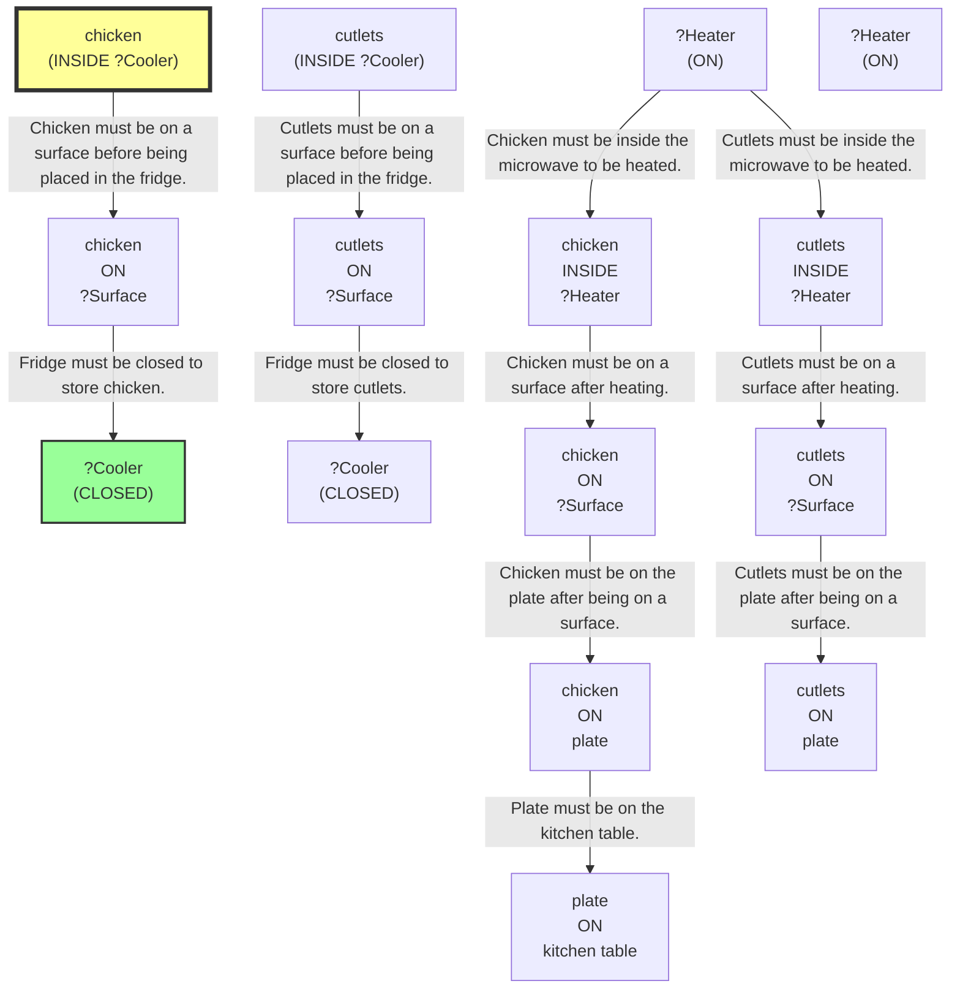
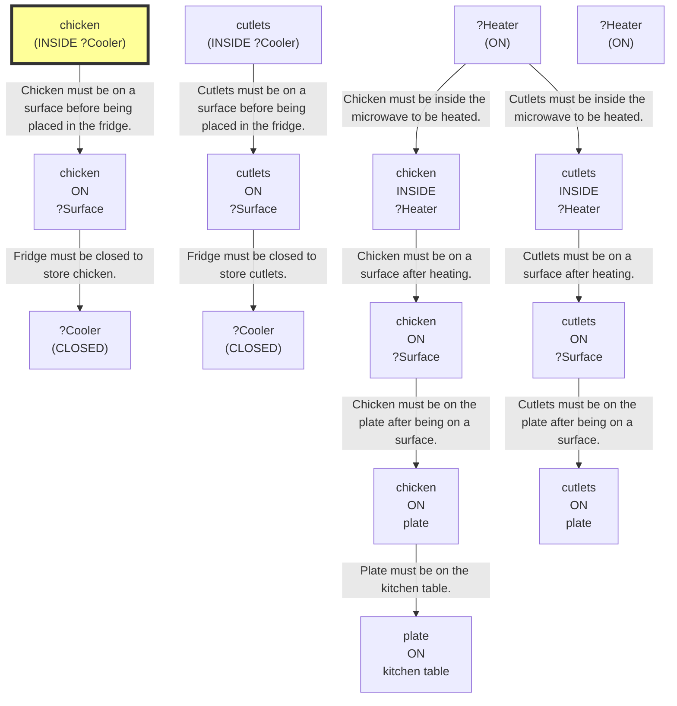
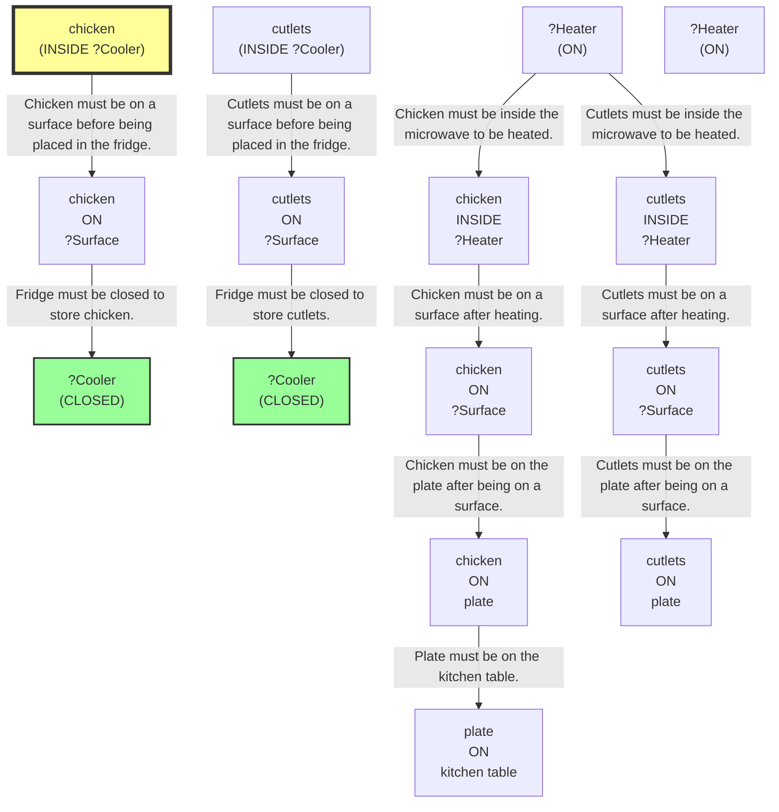
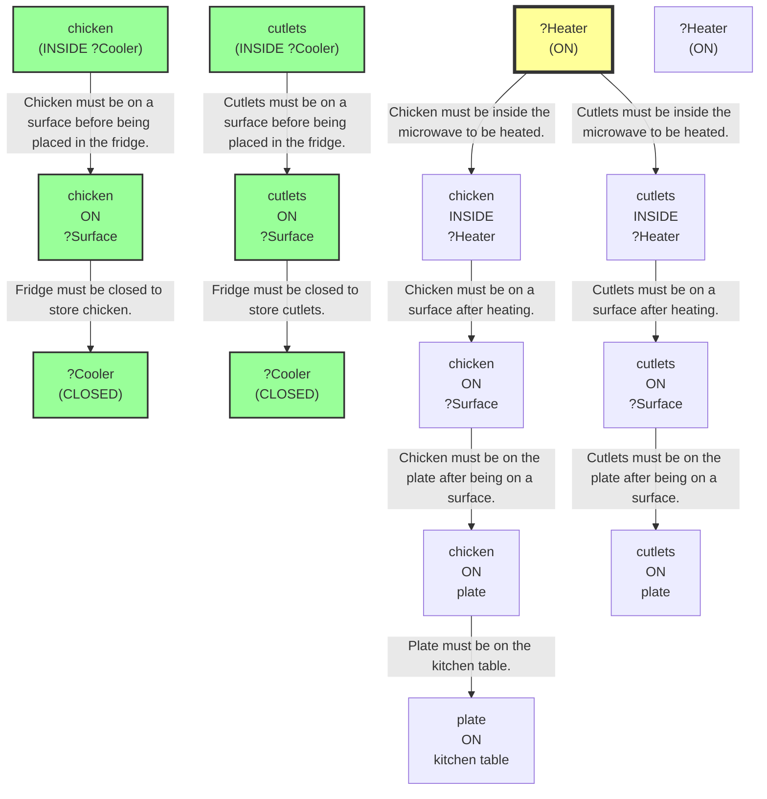
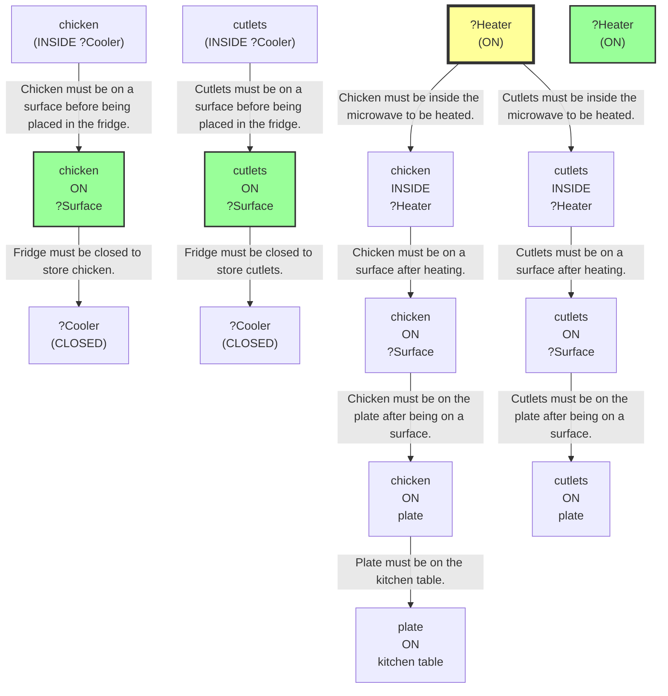
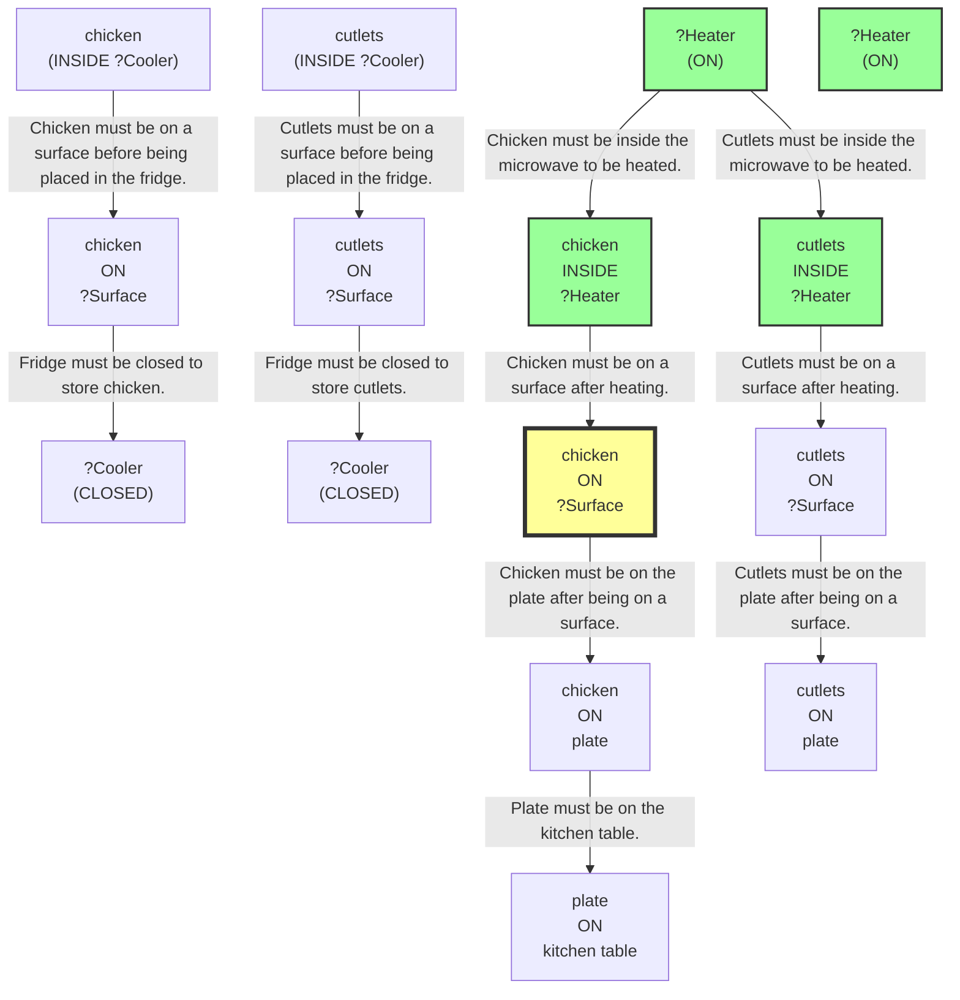
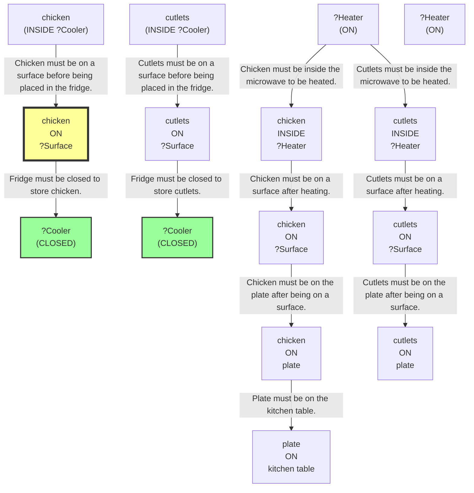
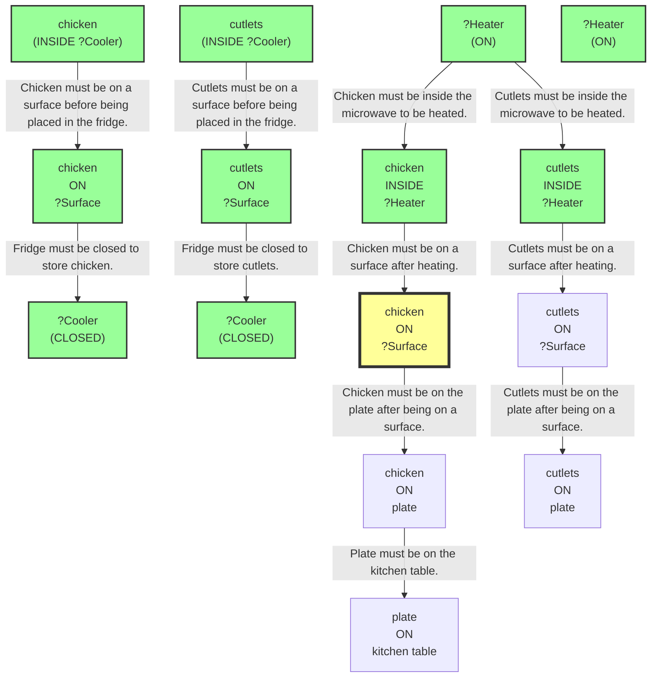
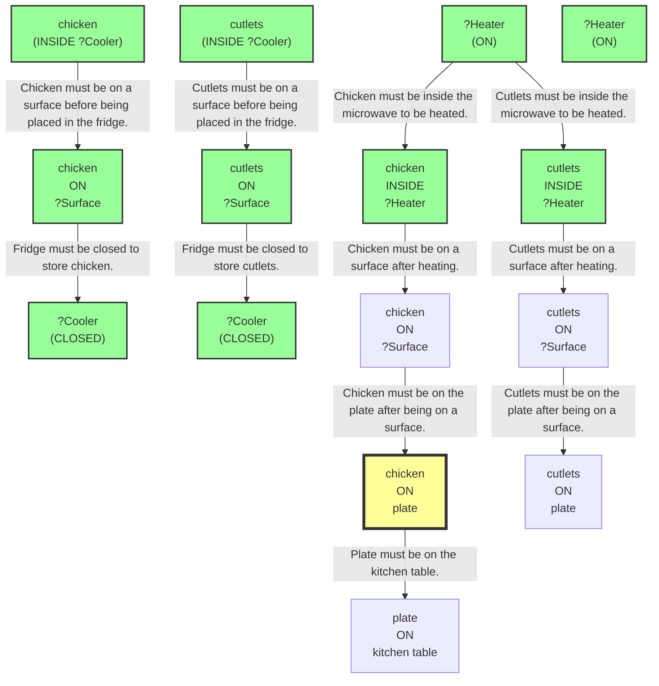
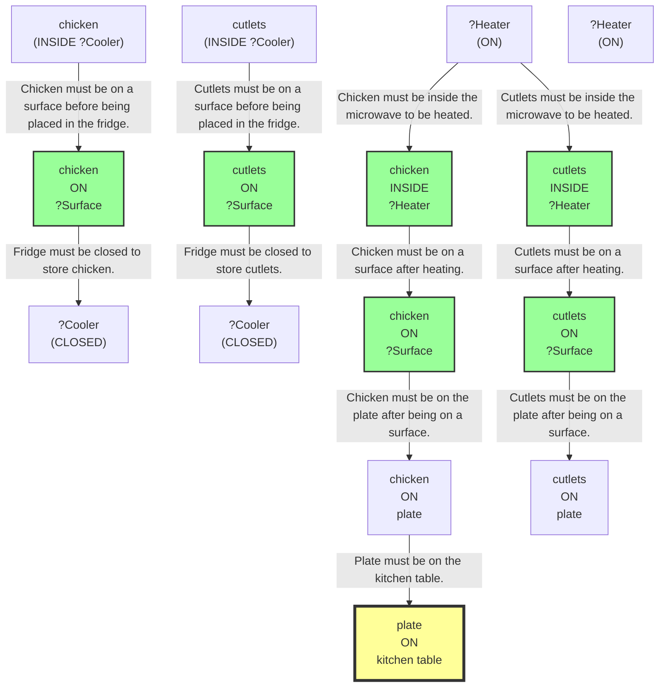

# 🚀 VirtualHome Agent Episode Log


### [GoalReasoner (Module A - Intent)] Output
```json
{
  "is_instruction_obviously_vague": false,
  "clarification_question": null,
  "target_object": "chicken",
  "location_hint": "fridge",
  "reasoning_chain": [
    {
      "question": "Why does the user want this object?",
      "answer": "The user wants to prepare and serve chicken as a meal."
    },
    {
      "question": "Why is that important?",
      "answer": "The user wants to fulfill their hunger and have a ready-to-eat meal."
    },
    {
      "question": "What fundamental need does this fulfill?",
      "answer": "The user wants to relieve hunger and have a meal ready for consumption."
    },
    {
      "question": "Are there any deeper psychological or physical motivations?",
      "answer": "The user may be seeking comfort, convenience, or a specific type of food."
    }
  ],
  "deep_intent": "Relieve hunger and have a meal ready for consumption.",
  "acceptable_alternatives_properties": [
    {
      "priority": 1,
      "description": "Other ready-to-eat cooked food items, such as a sandwich, hot dog, or pre-cooked meat."
    },
    {
      "priority": 2,
      "description": "Baked or grilled food items that can be heated, such as a baked chicken or a grilled chicken breast."
    },
    {
      "priority": 3,
      "description": "Snack foods or packaged foods that provide caloric energy, such as a ready-to-eat meal or a protein bar."
    },
    {
      "priority": 4,
      "description": "Fruits or vegetables that can be eaten raw or lightly prepared, such as an apple or a banana, which can satisfy hunger even though they are not cooked food."
    }
  ]
}
```

### [PerceptionFilter] Output
```json
{
  "reasoning": "The goal is to relieve hunger and have a meal ready for consumption, specifically involving chicken. The SDG indicates that the chicken must be stored in a cooler (fridge), heated using a heater (microwave), and placed on a plate before being served on the kitchen table. To achieve this, we need the chicken itself, the fridge to store it, the microwave to heat it, and the plate to serve it. Additionally, the kitchen table is required to place the plate. These are the minimum necessary classes to fulfill the goal.",
  "selected_classes": [
    "fridge",
    "apple",
    "plate",
    "chicken",
    "character",
    "cutlets",
    "kitchentable",
    "microwave"
  ],
  "raw_class_count": 45
}
```

### [LLMExecutor] Output
```json
{
  "reasoning": "The chicken is currently inside the fridge (N1), which is open (N2). The next step is to take the chicken out of the fridge and place it on a surface (N3). To do this, I must first walk to the chicken, then grab it, and finally place it on a surface. Since the chicken is inside the fridge, I need to walk to it first.",
  "satisfied_nodes": [
    "N2"
  ],
  "current_node_focus": "N1",
  "mapped_variables": {
    "?Cooler": "fridge(225)"
  },
  "action": "[walk] <chicken> (241)"
}
```

### [RoboStateMultiTaskController] Output
```json
{
  "action": "[walk] <chicken> (241)",
  "active_task_id": "task_1",
  "task_context": {
    "active_task_id": "task_1",
    "pending_task_ids": [],
    "satisfied_task_ids": []
  },
  "source": "llm_executor"
}
```
## Step 0
- **Action**: `[walk] <chicken> (241)`
- **Action Success**: `False`
- **Action Message**: {'0': {'message': 'ScriptExcutor 0: PROCESS WALK: Can not select object: chicken. REASON: No interaction positions\nEXECUTION_GENERAL: Script is impossible to execute\n\n'}}
- **Active Task**: `task_1`
- **Decision Source**: `llm_executor`
- **Task Progress**: T4_qwen_P1_03=pending
- **SDG Status**:

- **Observed Items (28)**: plate(170), plate(171), plate(172), plate(173), plate(177), plate(178), plate(184), kitchentable(199), fridge(225) [OPEN], microwave(234) [CLOSED,OFF], apple(249), apple(250), apple(251), apple(252), apple(253)...


### [PerceptionFilter] Output
```json
{
  "reasoning": "Reused cached class selection.",
  "selected_classes": [
    "fridge",
    "apple",
    "plate",
    "chicken",
    "character",
    "cutlets",
    "kitchentable",
    "microwave"
  ],
  "raw_class_count": 45
}
```

### [LLMExecutor] Output
```json
{
  "reasoning": "The chicken is currently inside the fridge, which is open. The next step is to grab the chicken, as it is required for the task. Since the chicken is inside the fridge, we need to first walk to it to ensure proximity before attempting to grab it.",
  "satisfied_nodes": [],
  "current_node_focus": "N1",
  "mapped_variables": {
    "?Cooler": "fridge(225)"
  },
  "action": "[walk] <chicken> (241)"
}
```

### [RoboStateMultiTaskController] Output
```json
{
  "action": "[walk] <chicken> (241)",
  "active_task_id": "task_1",
  "task_context": {
    "active_task_id": "task_1",
    "pending_task_ids": [],
    "satisfied_task_ids": []
  },
  "source": "llm_executor"
}
```
## Step 1
- **Action**: `[walk] <chicken> (241)`
- **Action Success**: `False`
- **Action Message**: {'0': {'message': 'ScriptExcutor 0: PROCESS WALK: Can not select object: chicken. REASON: No interaction positions\nEXECUTION_GENERAL: Script is impossible to execute\n\n'}}
- **Active Task**: `task_1`
- **Decision Source**: `llm_executor`
- **Task Progress**: T4_qwen_P1_03=pending
- **SDG Status**:

- **Observed Items (28)**: plate(170), plate(171), plate(172), plate(173), plate(177), plate(178), plate(184), kitchentable(199), fridge(225) [OPEN], microwave(234) [CLOSED,OFF], apple(249), apple(250), apple(251), apple(252), apple(253)...


### [RoboStateMultiTaskController] Output
```json
{
  "action": "[walk] <bathroom> (11)",
  "active_task_id": null,
  "task_context": {
    "active_task_id": null,
    "pending_task_ids": [
      "task_1"
    ],
    "satisfied_task_ids": []
  },
  "source": "loop_recovery_room_revisit"
}
```
## Step 2
- **Action**: `[walk] <bathroom> (11)`
- **Action Success**: `True`
- **Action Message**: {'0': {'message': 'Success'}}
- **Decision Source**: `loop_recovery_room_revisit`
- **Task Progress**: T4_qwen_P1_03=pending
- **SDG Status**:
No SDG active.
- **Observed Items (124)**: floor(127), floor(128), floor(129), floor(130), floor(131), floor(132), floor(133), floor(134), floor(135), ceiling(136), ceiling(137), ceiling(138), ceiling(139), ceiling(140), ceiling(141)...


### [PerceptionFilter] Output
```json
{
  "reasoning": "The goal is to relieve hunger and have a meal ready for consumption, specifically involving chicken. The SDG indicates that the chicken must be inside a cooler (fridge), heated using a heater (microwave), and placed on a plate on the kitchen table. To achieve this, we need the chicken itself, the fridge to store it, and the microwave to heat it. Additionally, the plate is required to serve the chicken. These are the minimum necessary classes to fulfill the goal.",
  "selected_classes": [
    "fridge",
    "apple",
    "plate",
    "chicken",
    "character",
    "cutlets",
    "microwave"
  ],
  "raw_class_count": 60
}
```

### [LLMExecutor] Output
```json
{
  "reasoning": "The chicken is currently inside the fridge, which is open. The next step is to grab the chicken, as it is required for the task. Since the chicken is inside the fridge, we need to first walk to the fridge to get close to it before we can grab it.",
  "satisfied_nodes": [],
  "current_node_focus": "N1",
  "mapped_variables": {
    "?Cooler": "fridge(225)"
  },
  "action": "[walk] <fridge> (225)"
}
```

### [RoboStateMultiTaskController] Output
```json
{
  "action": "[walk] <fridge> (225)",
  "active_task_id": "task_1",
  "task_context": {
    "active_task_id": "task_1",
    "pending_task_ids": [],
    "satisfied_task_ids": []
  },
  "source": "llm_executor"
}
```
## Step 3
- **Action**: `[walk] <fridge> (225)`
- **Action Success**: `True`
- **Action Message**: {'0': {'message': 'Success'}}
- **Active Task**: `task_1`
- **Decision Source**: `llm_executor`
- **Task Progress**: T4_qwen_P1_03=pending
- **SDG Status**:

- **Observed Items (27)**: plate(170), plate(171), plate(172), plate(173), plate(177), plate(178), plate(184), fridge(225) [OPEN], microwave(234) [CLOSED,OFF], apple(249), apple(250), apple(251), apple(252), apple(253), apple(254)...


### [PerceptionFilter] Output
```json
{
  "reasoning": "Reused cached class selection.",
  "selected_classes": [
    "fridge",
    "apple",
    "plate",
    "chicken",
    "character",
    "cutlets",
    "microwave"
  ],
  "raw_class_count": 60
}
```

### [LLMExecutor] Output
```json
{
  "reasoning": "The chicken is currently inside the fridge, which is open. The next step is to grab the chicken, as it is required for the task. Since the fridge is already open, we can proceed to grab the chicken directly.",
  "satisfied_nodes": [
    "N2",
    "N5"
  ],
  "current_node_focus": "N1",
  "mapped_variables": {
    "?Cooler": "fridge(225)"
  },
  "action": "[grab] <chicken> (241)"
}
```

### [RoboStateMultiTaskController] Output
```json
{
  "action": "[grab] <chicken> (241)",
  "active_task_id": "task_1",
  "task_context": {
    "active_task_id": "task_1",
    "pending_task_ids": [],
    "satisfied_task_ids": []
  },
  "source": "llm_executor"
}
```
## Step 4
- **Action**: `[grab] <chicken> (241)`
- **Action Success**: `True`
- **Action Message**: {'0': {'message': 'Success'}}
- **Active Task**: `task_1`
- **Decision Source**: `llm_executor`
- **Task Progress**: T4_qwen_P1_03=pending
- **SDG Status**:

- **Observed Items (27)**: plate(170), plate(171), plate(172), plate(173), plate(177), plate(178), plate(184), fridge(225) [OPEN], microwave(234) [CLOSED,OFF], apple(249), apple(250), apple(251), apple(252), apple(253), apple(254)...


### [PerceptionFilter] Output
```json
{
  "reasoning": "Reused cached class selection.",
  "selected_classes": [
    "fridge",
    "apple",
    "plate",
    "chicken",
    "character",
    "cutlets",
    "microwave"
  ],
  "raw_class_count": 60
}
```

### [LLMExecutor] Output
```json
{
  "reasoning": "The chicken is already being held by the robot (as indicated by 'HOLDS_RH chicken(241)' in the Filtered Graph), and the next step is to place it inside the microwave to heat it. However, the microwave is currently closed and off, so we need to open it first before proceeding to put the chicken inside.",
  "satisfied_nodes": [
    "N1",
    "N2",
    "N3",
    "N4",
    "N5",
    "N6"
  ],
  "current_node_focus": "N7",
  "mapped_variables": {
    "?Heater": "microwave(234)"
  },
  "action": "[open] <microwave> (234)"
}
```

### [RoboStateMultiTaskController] Output
```json
{
  "action": "[walk] <microwave> (234)",
  "active_task_id": "task_1",
  "task_context": {
    "active_task_id": "task_1",
    "pending_task_ids": [],
    "satisfied_task_ids": []
  },
  "source": "llm_executor_repaired"
}
```
## Step 5
- **Action**: `[walk] <microwave> (234)`
- **Action Success**: `True`
- **Action Message**: {'0': {'message': 'Success'}}
- **Active Task**: `task_1`
- **Decision Source**: `llm_executor_repaired`
- **Task Progress**: T4_qwen_P1_03=pending
- **SDG Status**:

- **Observed Items (27)**: plate(170), plate(171), plate(172), plate(173), plate(177), plate(178), plate(184), fridge(225) [OPEN], microwave(234) [CLOSED,OFF], apple(249), apple(250), apple(251), apple(252), apple(253), apple(254)...


### [PerceptionFilter] Output
```json
{
  "reasoning": "Reused cached class selection.",
  "selected_classes": [
    "fridge",
    "apple",
    "plate",
    "chicken",
    "character",
    "cutlets",
    "microwave"
  ],
  "raw_class_count": 60
}
```

### [LLMExecutor] Output
```json
{
  "reasoning": "The chicken is currently held by the robot (HOLDS_RH chicken(241)), and the next step is to heat it using the microwave. To do this, the robot must first walk to the microwave, which is already in the environment and located in the kitchen. Since the microwave is closed and the chicken is already in hand, the next logical action is to walk to the microwave to prepare for heating.",
  "satisfied_nodes": [
    "N1",
    "N2",
    "N3",
    "N4",
    "N5",
    "N6"
  ],
  "current_node_focus": "N7",
  "mapped_variables": {
    "?Heater": "microwave(234)"
  },
  "action": "[walk] <microwave> (234)"
}
```

### [RoboStateMultiTaskController] Output
```json
{
  "action": "[walk] <microwave> (234)",
  "active_task_id": "task_1",
  "task_context": {
    "active_task_id": "task_1",
    "pending_task_ids": [],
    "satisfied_task_ids": []
  },
  "source": "llm_executor"
}
```
## Step 6
- **Action**: `[walk] <microwave> (234)`
- **Action Success**: `True`
- **Action Message**: {'0': {'message': 'Success'}}
- **Active Task**: `task_1`
- **Decision Source**: `llm_executor`
- **Task Progress**: T4_qwen_P1_03=pending
- **SDG Status**:

- **Observed Items (27)**: plate(170), plate(171), plate(172), plate(173), plate(177), plate(178), plate(184), fridge(225) [OPEN], microwave(234) [CLOSED,OFF], apple(249), apple(250), apple(251), apple(252), apple(253), apple(254)...


### [PerceptionFilter] Output
```json
{
  "reasoning": "Reused cached class selection.",
  "selected_classes": [
    "fridge",
    "apple",
    "plate",
    "chicken",
    "character",
    "cutlets",
    "microwave"
  ],
  "raw_class_count": 60
}
```

### [LLMExecutor] Output
```json
{
  "reasoning": "The chicken is currently held by the robot in the right hand (HOLDS_RH chicken(241)), and the next step is to place it inside the microwave to heat it. However, the microwave is currently closed and off, so the robot must first open it before placing the chicken inside. The current focus is on satisfying node N7, which requires the microwave to be ON. Therefore, the next action is to open the microwave.",
  "satisfied_nodes": [
    "N3",
    "N6",
    "N10"
  ],
  "current_node_focus": "N7",
  "mapped_variables": {
    "?Heater": "microwave(234)"
  },
  "action": "[open] <microwave> (234)"
}
```

### [RoboStateMultiTaskController] Output
```json
{
  "action": "[open] <microwave> (234)",
  "active_task_id": "task_1",
  "task_context": {
    "active_task_id": "task_1",
    "pending_task_ids": [],
    "satisfied_task_ids": []
  },
  "source": "llm_executor"
}
```
## Step 7
- **Action**: `[open] <microwave> (234)`
- **Action Success**: `True`
- **Action Message**: {'0': {'message': 'Success'}}
- **Active Task**: `task_1`
- **Decision Source**: `llm_executor`
- **Task Progress**: T4_qwen_P1_03=pending
- **SDG Status**:

- **Observed Items (27)**: plate(170), plate(171), plate(172), plate(173), plate(177), plate(178), plate(184), fridge(225) [OPEN], microwave(234) [CLOSED,OFF], apple(249), apple(250), apple(251), apple(252), apple(253), apple(254)...


### [PerceptionFilter] Output
```json
{
  "reasoning": "Reused cached class selection.",
  "selected_classes": [
    "fridge",
    "apple",
    "plate",
    "chicken",
    "character",
    "cutlets",
    "microwave"
  ],
  "raw_class_count": 60
}
```

### [LLMExecutor] Output
```json
{
  "reasoning": "The chicken is currently held by the robot (HOLDS_RH chicken(241)), and the next step is to heat it using the microwave. Since the microwave is already open and the chicken is in hand, the next logical action is to place the chicken inside the microwave to heat it.",
  "satisfied_nodes": [
    "N1",
    "N2",
    "N3",
    "N4",
    "N5",
    "N6"
  ],
  "current_node_focus": "N7",
  "mapped_variables": {
    "?Heater": "microwave(234)"
  },
  "action": "[putin] <chicken> (241) <microwave> (234)"
}
```

### [RoboStateMultiTaskController] Output
```json
{
  "action": "[putin] <chicken> (241) <microwave> (234)",
  "active_task_id": "task_1",
  "task_context": {
    "active_task_id": "task_1",
    "pending_task_ids": [],
    "satisfied_task_ids": []
  },
  "source": "llm_executor"
}
```
## Step 8
- **Action**: `[putin] <chicken> (241) <microwave> (234)`
- **Action Success**: `True`
- **Action Message**: {'0': {'message': 'Success'}}
- **Active Task**: `task_1`
- **Decision Source**: `llm_executor`
- **Task Progress**: T4_qwen_P1_03=pending
- **SDG Status**:

- **Observed Items (28)**: plate(170), plate(171), plate(172), plate(173), plate(177), plate(178), plate(184), fridge(225) [OPEN], microwave(234) [OPEN,OFF], apple(249), apple(250), apple(251), apple(252), apple(253), apple(254)...


### [PerceptionFilter] Output
```json
{
  "reasoning": "Reused cached class selection.",
  "selected_classes": [
    "fridge",
    "apple",
    "plate",
    "chicken",
    "character",
    "cutlets",
    "microwave"
  ],
  "raw_class_count": 60
}
```

### [LLMExecutor] Output
```json
{
  "reasoning": "The chicken is currently inside the microwave, which is open and off. The next step is to heat the chicken by turning on the microwave. This action satisfies the requirement for the chicken to be inside the microwave and the microwave to be on, which is necessary for heating.",
  "satisfied_nodes": [
    "N1",
    "N2",
    "N3",
    "N4",
    "N5",
    "N6"
  ],
  "current_node_focus": "N7",
  "mapped_variables": {
    "?Heater": "microwave(234)"
  },
  "action": "[switchon] <microwave> (234)"
}
```

### [RoboStateMultiTaskController] Output
```json
{
  "action": "[switchon] <microwave> (234)",
  "active_task_id": "task_1",
  "task_context": {
    "active_task_id": "task_1",
    "pending_task_ids": [],
    "satisfied_task_ids": []
  },
  "source": "llm_executor"
}
```
## Step 9
- **Action**: `[switchon] <microwave> (234)`
- **Action Success**: `True`
- **Action Message**: Faked switch operation in Python layer (bypassed Unity failure)
- **Active Task**: `task_1`
- **Decision Source**: `llm_executor`
- **Task Progress**: T4_qwen_P1_03=pending
- **SDG Status**:

- **Observed Items (28)**: plate(170), plate(171), plate(172), plate(173), plate(177), plate(178), plate(184), fridge(225) [OPEN], microwave(234) [OPEN,OFF], apple(249), apple(250), apple(251), apple(252), apple(253), apple(254)...


### [PerceptionFilter] Output
```json
{
  "reasoning": "Reused cached class selection.",
  "selected_classes": [
    "fridge",
    "apple",
    "plate",
    "chicken",
    "character",
    "cutlets",
    "microwave"
  ],
  "raw_class_count": 60
}
```

### [LLMExecutor] Output
```json
{
  "reasoning": "The chicken is currently inside the microwave and is hot. The next step is to take the chicken out of the microwave and place it on a surface (like a plate) to satisfy the SDG node N11, which requires the chicken to be on a surface after heating. Since the chicken is already in the microwave, the robot must first [walk] to the microwave to ensure proximity, then [grab] the chicken, and finally [putback] it on a plate or surface.",
  "satisfied_nodes": [
    "N8",
    "N9",
    "N7",
    "N10"
  ],
  "current_node_focus": "N11",
  "mapped_variables": {
    "?Heater": "microwave(234)",
    "?Surface": "plate(170)"
  },
  "action": "[walk] <microwave> (234)"
}
```

### [RoboStateMultiTaskController] Output
```json
{
  "action": "[walk] <microwave> (234)",
  "active_task_id": "task_1",
  "task_context": {
    "active_task_id": "task_1",
    "pending_task_ids": [],
    "satisfied_task_ids": []
  },
  "source": "llm_executor"
}
```
## Step 10
- **Action**: `[walk] <microwave> (234)`
- **Action Success**: `True`
- **Action Message**: {'0': {'message': 'Success'}}
- **Active Task**: `task_1`
- **Decision Source**: `llm_executor`
- **Task Progress**: T4_qwen_P1_03=pending
- **SDG Status**:

- **Observed Items (28)**: plate(170), plate(171), plate(172), plate(173), plate(177), plate(178), plate(184), fridge(225) [OPEN], microwave(234) [OPEN,ON], apple(249), apple(250), apple(251), apple(252), apple(253), apple(254)...


### [PerceptionFilter] Output
```json
{
  "reasoning": "Reused cached class selection.",
  "selected_classes": [
    "fridge",
    "apple",
    "plate",
    "chicken",
    "character",
    "cutlets",
    "microwave"
  ],
  "raw_class_count": 60
}
```

### [LLMExecutor] Output
```json
{
  "reasoning": "The chicken is currently inside the microwave and is hot. The next step is to take the chicken out of the microwave and place it on a surface (like a plate) to satisfy the SDG node N3 and N11. Since the chicken is already in the microwave, the robot should first [walk] to the microwave to ensure proximity, then [grab] the chicken, and finally [putback] it on a plate. However, since the robot is already near the microwave, the next action is to [grab] the chicken.",
  "satisfied_nodes": [
    "N2",
    "N5"
  ],
  "current_node_focus": "N3",
  "mapped_variables": {
    "?Surface": "plate(170)"
  },
  "action": "[grab] <chicken> (241)"
}
```

### [RoboStateMultiTaskController] Output
```json
{
  "action": "[grab] <chicken> (241)",
  "active_task_id": "task_1",
  "task_context": {
    "active_task_id": "task_1",
    "pending_task_ids": [],
    "satisfied_task_ids": []
  },
  "source": "llm_executor"
}
```
## Step 11
- **Action**: `[grab] <chicken> (241)`
- **Action Success**: `True`
- **Action Message**: {'0': {'message': 'Success'}}
- **Active Task**: `task_1`
- **Decision Source**: `llm_executor`
- **Task Progress**: T4_qwen_P1_03=pending
- **SDG Status**:

- **Observed Items (28)**: plate(170), plate(171), plate(172), plate(173), plate(177), plate(178), plate(184), fridge(225) [OPEN], microwave(234) [OPEN,ON], apple(249), apple(250), apple(251), apple(252), apple(253), apple(254)...


### [PerceptionFilter] Output
```json
{
  "reasoning": "Reused cached class selection.",
  "selected_classes": [
    "fridge",
    "apple",
    "plate",
    "chicken",
    "character",
    "cutlets",
    "microwave"
  ],
  "raw_class_count": 60
}
```

### [LLMExecutor] Output
```json
{
  "reasoning": "The chicken is currently in the robot's right hand (HOLDS_RH) and is HOT. The next step is to place the chicken on a surface (e.g., plate) to satisfy the SDG node N11, which requires the chicken to be ON a surface. Since the chicken is already in the robot's hand, the next action is to place it on a plate (e.g., plate(170)) which is a valid surface. This action will satisfy the relation N11 and move the chicken closer to the final goal of being on the kitchen table.",
  "satisfied_nodes": [
    "N1",
    "N2",
    "N3",
    "N4",
    "N5",
    "N6",
    "N7",
    "N8",
    "N9",
    "N10"
  ],
  "current_node_focus": "N11",
  "mapped_variables": {
    "?Surface": "plate(170)"
  },
  "action": "[putback] <chicken> (241) <plate> (170)"
}
```

### [RoboStateMultiTaskController] Output
```json
{
  "action": "[walk] <plate> (170)",
  "active_task_id": "task_1",
  "task_context": {
    "active_task_id": "task_1",
    "pending_task_ids": [],
    "satisfied_task_ids": []
  },
  "source": "llm_executor_repaired"
}
```
## Step 12
- **Action**: `[walk] <plate> (170)`
- **Action Success**: `True`
- **Action Message**: {'0': {'message': 'Success'}}
- **Active Task**: `task_1`
- **Decision Source**: `llm_executor_repaired`
- **Task Progress**: T4_qwen_P1_03=pending
- **SDG Status**:

- **Observed Items (28)**: plate(170), plate(171), plate(172), plate(173), plate(177), plate(178), plate(184), fridge(225) [OPEN], microwave(234) [OPEN,ON], apple(249), apple(250), apple(251), apple(252), apple(253), apple(254)...


### [PerceptionFilter] Output
```json
{
  "reasoning": "Reused cached class selection.",
  "selected_classes": [
    "fridge",
    "apple",
    "plate",
    "chicken",
    "character",
    "cutlets",
    "microwave"
  ],
  "raw_class_count": 60
}
```

### [LLMExecutor] Output
```json
{
  "reasoning": "The chicken is currently hot and held in the robot's right hand. The next step is to place the chicken on the plate, which is a required state (N13) in the SDG. Since the robot is already near the plate (from the previous action), the next logical action is to put the chicken on the plate.",
  "satisfied_nodes": [
    "N1",
    "N2",
    "N3",
    "N4",
    "N5",
    "N6",
    "N7",
    "N8",
    "N9",
    "N10"
  ],
  "current_node_focus": "N13",
  "mapped_variables": {
    "?Surface": "plate(170)"
  },
  "action": "[putback] <chicken> (241) <plate> (170)"
}
```

### [RoboStateMultiTaskController] Output
```json
{
  "action": "[putback] <chicken> (241) <plate> (170)",
  "active_task_id": "task_1",
  "task_context": {
    "active_task_id": "task_1",
    "pending_task_ids": [],
    "satisfied_task_ids": []
  },
  "source": "llm_executor"
}
```
## Step 13
- **Action**: `[putback] <chicken> (241) <plate> (170)`
- **Action Success**: `True`
- **Action Message**: {'0': {'message': 'Success'}}
- **Active Task**: `task_1`
- **Decision Source**: `llm_executor`
- **Task Progress**: T4_qwen_P1_03=pending
- **SDG Status**:

- **Observed Items (28)**: plate(170), plate(171), plate(172), plate(173), plate(177), plate(178), plate(184), fridge(225) [OPEN], microwave(234) [OPEN,ON], apple(249), apple(250), apple(251), apple(252), apple(253), apple(254)...


### [PerceptionFilter] Output
```json
{
  "reasoning": "Reused cached class selection.",
  "selected_classes": [
    "fridge",
    "apple",
    "plate",
    "chicken",
    "character",
    "cutlets",
    "microwave"
  ],
  "raw_class_count": 60
}
```

### [LLMExecutor] Output
```json
{
  "reasoning": "The chicken is currently on the plate (170) and is HOT. The next step is to place the chicken on the kitchen table as per the SDG node N15, which requires the plate to be on the kitchen table. Since the chicken is already on the plate, we need to first ensure the plate is on the kitchen table. However, the plate is not currently on the kitchen table, so the next logical action is to move the plate to the kitchen table. This will satisfy the relation 'plate ON kitchen table' required by N15.",
  "satisfied_nodes": [
    "N3",
    "N6",
    "N8",
    "N9",
    "N11",
    "N12"
  ],
  "current_node_focus": "N15",
  "mapped_variables": {
    "?Surface": "plate(170)",
    "?Heater": "microwave(234)",
    "?Cooler": "fridge(225)"
  },
  "action": "[walk] <plate> (170)"
}
```

### [RoboStateMultiTaskController] Output
```json
{
  "action": "[walk] <plate> (170)",
  "active_task_id": "task_1",
  "task_context": {
    "active_task_id": "task_1",
    "pending_task_ids": [],
    "satisfied_task_ids": []
  },
  "source": "llm_executor"
}
```
## Step 14
- **Action**: `[walk] <plate> (170)`
- **Action Success**: `True`
- **Action Message**: {'0': {'message': 'Success'}}
- **Active Task**: `task_1`
- **Decision Source**: `llm_executor`
- **Task Progress**: T4_qwen_P1_03=pending
- **SDG Status**:

- **Observed Items (28)**: plate(170), plate(171), plate(172), plate(173), plate(177), plate(178), plate(184), fridge(225) [OPEN], microwave(234) [OPEN,ON], apple(249), apple(250), apple(251), apple(252), apple(253), apple(254)...

