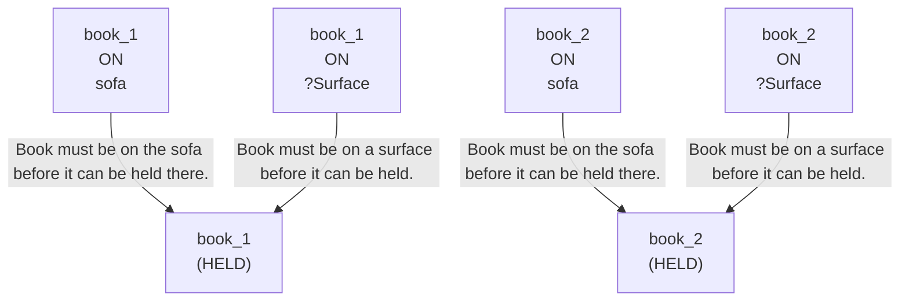
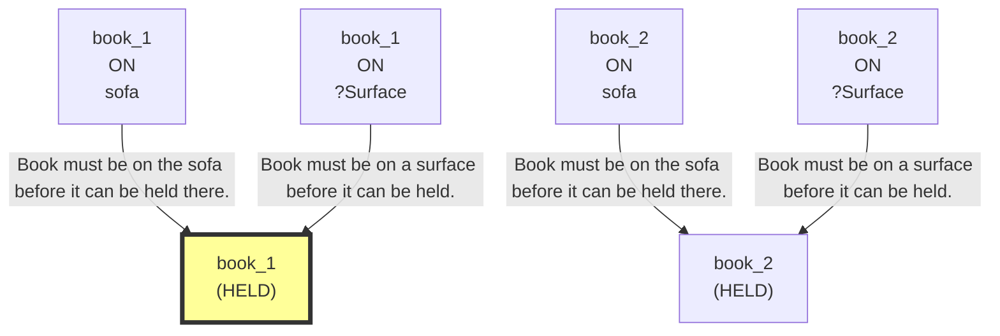
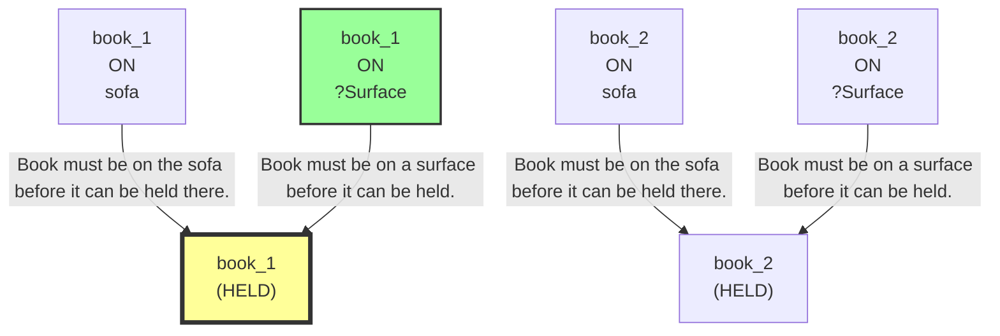
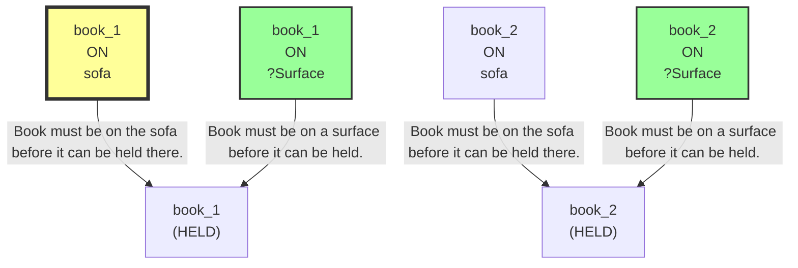
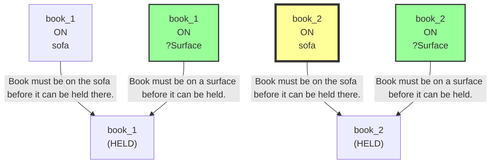

# 🚀 VirtualHome Agent Episode Log


### [GoalReasoner (Module A - Intent)] Output
```json
{
  "is_instruction_obviously_vague": false,
  "clarification_question": null,
  "target_object": "books",
  "location_hint": "coffee table",
  "reasoning_chain": [
    {
      "question": "Why does the user want this object?",
      "answer": "The user wants to move books from one location to another."
    },
    {
      "question": "Why is that important?",
      "answer": "The user may want to organize the space or make the coffee table less cluttered."
    },
    {
      "question": "What fundamental need does this fulfill?",
      "answer": "The user wants to rearrange items in their environment to improve organization or accessibility."
    },
    {
      "question": "Are there any deeper psychological or physical motivations?",
      "answer": "The user may be seeking a sense of order or control over their surroundings."
    }
  ],
  "deep_intent": "The user wants to rearrange items in their environment to improve organization or accessibility.",
  "acceptable_alternatives_properties": [
    {
      "priority": 1,
      "description": "Other physical objects on the coffee table, such as magazines or decorative items."
    },
    {
      "priority": 2,
      "description": "Items that can be moved to the sofa, such as small household objects or personal belongings."
    },
    {
      "priority": 3,
      "description": "Any objects that can be relocated within the room, such as books, electronics, or furniture accessories."
    },
    {
      "priority": 4,
      "description": "Items that serve a similar purpose, such as items used for reading or entertainment, like a remote control or a notebook."
    }
  ]
}
```

### [RoboStateMultiTaskController] Output
```json
{
  "action": "[walk] <bathroom> (11)",
  "active_task_id": "task_1",
  "task_context": {
    "active_task_id": "task_1",
    "pending_task_ids": [],
    "satisfied_task_ids": []
  },
  "source": "room_frontier"
}
```
## Step 0
- **Action**: `[walk] <bathroom> (11)`
- **Action Success**: `True`
- **Action Message**: {'0': {'message': 'Success'}}
- **Active Task**: `task_1`
- **Decision Source**: `room_frontier`
- **Task Progress**: T4_qwen_P2_10=pending
- **SDG Status**:

- **Observed Items (79)**: floor(336), floor(337), floor(338), floor(339), floor(340), floor(341), floor(342), floor(343), floor(344), wall(345), wall(346), wall(347), wall(348), wall(349), wall(350)...


### [RoboStateMultiTaskController] Output
```json
{
  "action": "[walk] <bedroom> (73)",
  "active_task_id": "task_1",
  "task_context": {
    "active_task_id": "task_1",
    "pending_task_ids": [],
    "satisfied_task_ids": []
  },
  "source": "room_frontier"
}
```
## Step 1
- **Action**: `[walk] <bedroom> (73)`
- **Action Success**: `True`
- **Action Message**: {'0': {'message': 'Success'}}
- **Active Task**: `task_1`
- **Decision Source**: `room_frontier`
- **Task Progress**: T4_qwen_P2_10=pending
- **SDG Status**:

- **Observed Items (140)**: floor(336), floor(337), floor(338), floor(339), floor(340), floor(341), floor(342), floor(343), floor(344), wall(345), wall(346), wall(347), wall(348), wall(349), wall(350)...


### [PerceptionFilter] Output
```json
{
  "reasoning": "The goal is to rearrange items in the environment to improve organization or accessibility, specifically involving books on the coffee table. The SDG indicates that books need to be on a surface (coffee table) and held. Therefore, the essential object classes are 'book' (the target object), 'coffeetable' (the location), and any tools or receptacles that may be needed to move or hold the books, such as 'sofa' (as books are being moved to it).",
  "selected_classes": [
    "book",
    "coffeetable",
    "character",
    "sofa"
  ],
  "raw_class_count": 70
}
```

### [LLMExecutor] Output
```json
{
  "reasoning": "The current goal is to move two books from the coffee table to the sofa. The books are located on the coffee table (coffeetable(111)), and the robot is currently in the bedroom (bedroom(73)). The first step is to walk to the coffee table to grab the books. Since the robot is already in the bedroom, which is close to the coffee table, the next action is to walk to the coffee table to interact with the books.",
  "satisfied_nodes": [],
  "current_node_focus": "N1",
  "mapped_variables": {
    "?Surface": "coffeetable(111)"
  },
  "action": "[walk] <coffeetable> (111)"
}
```

### [RoboStateMultiTaskController] Output
```json
{
  "action": "[walk] <coffeetable> (111)",
  "active_task_id": "task_1",
  "task_context": {
    "active_task_id": "task_1",
    "pending_task_ids": [],
    "satisfied_task_ids": []
  },
  "source": "llm_executor"
}
```
## Step 2
- **Action**: `[walk] <coffeetable> (111)`
- **Action Success**: `True`
- **Action Message**: {'0': {'message': 'Success'}}
- **Active Task**: `task_1`
- **Decision Source**: `llm_executor`
- **Task Progress**: T4_qwen_P2_10=pending
- **SDG Status**:

- **Observed Items (10)**: sofa(368), coffeetable(371), character(1), bathroom(11), bedroom(73), kitchen(205), livingroom(335), coffeetable(111), book(190) [CLOSED], book(191) [CLOSED]


### [PerceptionFilter] Output
```json
{
  "reasoning": "Reused cached class selection.",
  "selected_classes": [
    "book",
    "coffeetable",
    "character",
    "sofa"
  ],
  "raw_class_count": 70
}
```

### [LLMExecutor] Output
```json
{
  "reasoning": "The current focus is on satisfying node N1 and N2, which require the books to be held. However, the books are currently on the coffee table (coffeetable(111)), and the robot is already near the coffee table. The next logical step is to grab the books to satisfy the 'HELD' state required by the SDG.",
  "satisfied_nodes": [],
  "current_node_focus": "N1",
  "mapped_variables": {
    "?Surface": "coffeetable(111)"
  },
  "action": "[grab] <book> (190)"
}
```

### [RoboStateMultiTaskController] Output
```json
{
  "action": "[grab] <book> (190)",
  "active_task_id": "task_1",
  "task_context": {
    "active_task_id": "task_1",
    "pending_task_ids": [],
    "satisfied_task_ids": []
  },
  "source": "llm_executor"
}
```
## Step 3
- **Action**: `[grab] <book> (190)`
- **Action Success**: `True`
- **Action Message**: {'0': {'message': 'Success'}}
- **Active Task**: `task_1`
- **Decision Source**: `llm_executor`
- **Task Progress**: T4_qwen_P2_10=pending
- **SDG Status**:

- **Observed Items (10)**: sofa(368), coffeetable(371), character(1), bathroom(11), bedroom(73), kitchen(205), livingroom(335), coffeetable(111), book(190) [CLOSED], book(191) [CLOSED]


### [PerceptionFilter] Output
```json
{
  "reasoning": "Reused cached class selection.",
  "selected_classes": [
    "book",
    "coffeetable",
    "character",
    "sofa"
  ],
  "raw_class_count": 70
}
```

### [LLMExecutor] Output
```json
{
  "reasoning": "The current focus is on satisfying node N1 and N2, which require the books to be held. Book_1 is already being held by the robot (HOLDS_RH book(190)), but book_2 is on the coffee table (ON coffeetable(111)) and needs to be grabbed. The next logical step is to grab book_2 from the coffee table.",
  "satisfied_nodes": [
    "N3"
  ],
  "current_node_focus": "N1",
  "mapped_variables": {
    "?Surface": "coffeetable(111)"
  },
  "action": "[grab] <book> (191)"
}
```

### [RoboStateMultiTaskController] Output
```json
{
  "action": "[grab] <book> (191)",
  "active_task_id": "task_1",
  "task_context": {
    "active_task_id": "task_1",
    "pending_task_ids": [],
    "satisfied_task_ids": []
  },
  "source": "llm_executor"
}
```
## Step 4
- **Action**: `[grab] <book> (191)`
- **Action Success**: `True`
- **Action Message**: {'0': {'message': 'Success'}}
- **Active Task**: `task_1`
- **Decision Source**: `llm_executor`
- **Task Progress**: T4_qwen_P2_10=pending
- **SDG Status**:

- **Observed Items (10)**: sofa(368), coffeetable(371), character(1), bathroom(11), bedroom(73), kitchen(205), livingroom(335), coffeetable(111), book(190) [CLOSED], book(191) [CLOSED]


### [PerceptionFilter] Output
```json
{
  "reasoning": "Reused cached class selection.",
  "selected_classes": [
    "book",
    "coffeetable",
    "character",
    "sofa"
  ],
  "raw_class_count": 70
}
```

### [LLMExecutor] Output
```json
{
  "reasoning": "The current focus is on moving the books from the coffee table to the sofa. The books are already grabbed by the robot, and the next step is to place them on the sofa. Since the robot is already near the sofa (as indicated by the 'CLOSE' relation in the Filtered Graph), the next action is to put the books on the sofa.",
  "satisfied_nodes": [
    "N3",
    "N4"
  ],
  "current_node_focus": "N5",
  "mapped_variables": {
    "?Surface": "sofa(368)"
  },
  "action": "[putback] <book> (190) <sofa> (368)"
}
```

### [RoboStateMultiTaskController] Output
```json
{
  "action": "[putback] <book> (190) <sofa> (368)",
  "active_task_id": "task_1",
  "task_context": {
    "active_task_id": "task_1",
    "pending_task_ids": [],
    "satisfied_task_ids": []
  },
  "source": "llm_executor"
}
```
## Step 5
- **Action**: `[putback] <book> (190) <sofa> (368)`
- **Action Success**: `True`
- **Action Message**: {'0': {'message': 'Success'}}
- **Active Task**: `task_1`
- **Decision Source**: `llm_executor`
- **Task Progress**: T4_qwen_P2_10=pending
- **SDG Status**:

- **Observed Items (10)**: sofa(368), coffeetable(371), character(1), bathroom(11), bedroom(73), kitchen(205), livingroom(335), coffeetable(111), book(190) [CLOSED], book(191) [CLOSED]


### [PerceptionFilter] Output
```json
{
  "reasoning": "Reused cached class selection.",
  "selected_classes": [
    "book",
    "coffeetable",
    "character",
    "sofa"
  ],
  "raw_class_count": 70
}
```

### [LLMExecutor] Output
```json
{
  "reasoning": "The current focus is on satisfying node N5 and N6, which require the books to be on the sofa. However, book_1 (190) is already on the sofa, and book_2 (191) is being held by the robot. The next logical step is to place book_2 on the sofa to satisfy node N6. Since the robot is already holding book_2, it can directly [putback] it onto the sofa without needing to [walk] again.",
  "satisfied_nodes": [
    "N3",
    "N4"
  ],
  "current_node_focus": "N6",
  "mapped_variables": {
    "?Surface": "sofa(368)"
  },
  "action": "[putback] <book> (191) <sofa> (368)"
}
```

### [RoboStateMultiTaskController] Output
```json
{
  "action": "[putback] <book> (191) <sofa> (368)",
  "active_task_id": "task_1",
  "task_context": {
    "active_task_id": "task_1",
    "pending_task_ids": [],
    "satisfied_task_ids": []
  },
  "source": "llm_executor"
}
```
## Step 6
- **Action**: `[putback] <book> (191) <sofa> (368)`
- **Action Success**: `True`
- **Action Message**: {'0': {'message': 'Success'}}
- **Active Task**: `task_1`
- **Decision Source**: `llm_executor`
- **Task Progress**: T4_qwen_P2_10=done
- **SDG Status**:

- **Observed Items (10)**: sofa(368), coffeetable(371), character(1), bathroom(11), bedroom(73), kitchen(205), livingroom(335), coffeetable(111), book(190) [CLOSED], book(191) [CLOSED]

