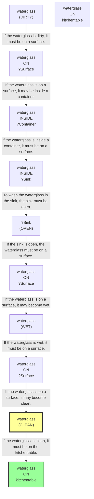
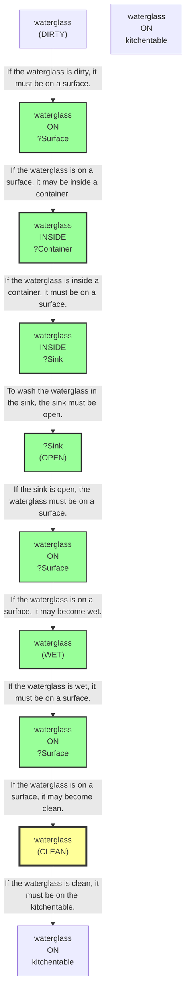
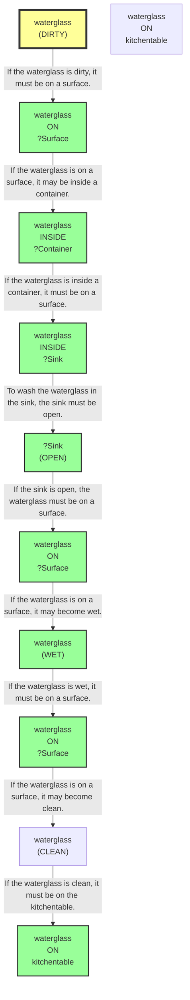
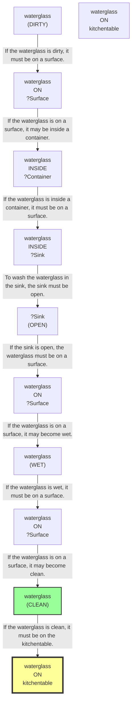

# 🚀 VirtualHome Agent Episode Log


### [GoalReasoner (Module A - Intent)] Output
```json
{
  "is_instruction_obviously_vague": false,
  "clarification_question": null,
  "target_object": "waterglass",
  "location_hint": "sink, kitchentable",
  "reasoning_chain": [
    {
      "question": "Why does the user want this object?",
      "answer": "The user wants the waterglass to be clean and placed in a specific location."
    },
    {
      "question": "Why is that important?",
      "answer": "The user wants to maintain a clean and organized kitchen environment."
    },
    {
      "question": "What fundamental need does this fulfill?",
      "answer": "The user wants to ensure hygiene and functionality in the kitchen."
    },
    {
      "question": "Are there any deeper psychological or physical motivations?",
      "answer": "The user may have a routine or habit of keeping the kitchen clean, or they may be preparing for a specific activity that requires a clean waterglass."
    }
  ],
  "deep_intent": "Maintain cleanliness and organization in the kitchen.",
  "acceptable_alternatives_properties": [
    {
      "priority": 1,
      "description": "Other clean glassware items, such as a mug or a bowl."
    },
    {
      "priority": 2,
      "description": "Kitchen utensils that require cleaning, such as a plate or a cutting board."
    },
    {
      "priority": 3,
      "description": "Items that need to be placed in a designated location, such as a utensil holder or a countertop item."
    },
    {
      "priority": 4,
      "description": "General household items that require maintenance, such as a towel or a sponge."
    }
  ]
}
```

### [PerceptionFilter] Output
```json
{
  "reasoning": "The goal is to maintain cleanliness and organization in the kitchen, specifically to ensure the waterglass is clean and placed on the kitchentable. The SDG indicates the waterglass is currently dirty and needs to be cleaned. To achieve this, the waterglass must be washed, which requires access to a sink. Additionally, the waterglass must be placed on the kitchentable, which is explicitly mentioned in the location hint. The sink is necessary for washing, and the kitchentable is the target location. No other objects are required for this task.",
  "selected_classes": [
    "character",
    "plate",
    "kitchentable",
    "waterglass",
    "sink"
  ],
  "raw_class_count": 50
}
```

### [LLMExecutor] Output
```json
{
  "reasoning": "The waterglass is currently on the kitchentable (kitchentable(135)) and is not marked as DIRTY. However, the goal is to ensure it is clean and placed on the kitchentable. Since it is not DIRTY, the next step is to verify if it is already CLEAN. If not, we need to wash it. To wash it, we must first grab it, then walk to the sink, and then wash it. However, since the waterglass is already on the kitchentable, we can directly check its state. If it is not CLEAN, we need to wash it. If it is CLEAN, we can confirm it is on the kitchentable.",
  "satisfied_nodes": [
    "N11"
  ],
  "current_node_focus": "N10",
  "mapped_variables": {
    "?Sink": "sink(155)"
  },
  "action": "[walk] <waterglass> (64)"
}
```

### [RoboStateMultiTaskController] Output
```json
{
  "action": "[walk] <waterglass> (64)",
  "active_task_id": "task_1",
  "task_context": {
    "active_task_id": "task_1",
    "pending_task_ids": [],
    "satisfied_task_ids": []
  },
  "source": "llm_executor"
}
```
## Step 0
- **Action**: `[walk] <waterglass> (64)`
- **Action Success**: `True`
- **Action Message**: {'0': {'message': 'Success'}}
- **Active Task**: `task_1`
- **Decision Source**: `llm_executor`
- **Task Progress**: T4_qwen_P3_13=pending
- **SDG Status**:

- **Observed Items (26)**: waterglass(64), plate(67), plate(68), waterglass(71), waterglass(72), plate(75), plate(76), waterglass(79), waterglass(80), plate(83), plate(84), waterglass(87), waterglass(88), plate(91), waterglass(100)...


### [PerceptionFilter] Output
```json
{
  "reasoning": "Reused cached class selection.",
  "selected_classes": [
    "character",
    "plate",
    "kitchentable",
    "waterglass",
    "sink"
  ],
  "raw_class_count": 50
}
```

### [LLMExecutor] Output
```json
{
  "reasoning": "The current Filtered Graph shows that the waterglass(64) is on the kitchentable(131), which satisfies the SDG node N11. However, the task requires the waterglass to be clean and placed on the kitchentable. Since the waterglass is not explicitly marked as DIRTY or CLEAN in the Filtered Graph, we need to verify its state. The next logical step is to check if the waterglass is DIRTY, as this is a prerequisite for cleaning it. If it is DIRTY, we can proceed to wash it.",
  "satisfied_nodes": [
    "N11"
  ],
  "current_node_focus": "N1",
  "mapped_variables": {
    "?Washer": "sink(155)"
  },
  "action": "[check] <waterglass> (64)"
}
```

### [RoboStateMultiTaskController] Output
```json
{
  "action": "[walk] <livingroom> (183)",
  "active_task_id": null,
  "task_context": {
    "active_task_id": null,
    "pending_task_ids": [
      "task_1"
    ],
    "satisfied_task_ids": []
  },
  "source": "loop_recovery_room_revisit"
}
```
## Step 1
- **Action**: `[walk] <livingroom> (183)`
- **Action Success**: `True`
- **Action Message**: {'0': {'message': 'Success'}}
- **Decision Source**: `loop_recovery_room_revisit`
- **Task Progress**: T4_qwen_P3_13=pending
- **SDG Status**:
No SDG active.
- **Observed Items (159)**: wall(12), wall(13), wall(14), wall(15), wall(16), wall(17), wall(18), wall(19), wall(20), wall(21), floor(22), floor(23), floor(24), floor(25), floor(26)...


### [PerceptionFilter] Output
```json
{
  "reasoning": "The goal is to maintain cleanliness and organization in the kitchen, specifically to ensure the waterglass is clean and placed on the kitchentable. The SDG indicates the waterglass is currently dirty and needs to be cleaned. To achieve this, the waterglass must be washed, which requires access to a sink. Additionally, the waterglass must be placed on the kitchentable, which is explicitly mentioned in the location hint. The sink is necessary for washing, and the kitchentable is the target location. No other objects are required for this task.",
  "selected_classes": [
    "character",
    "plate",
    "kitchentable",
    "waterglass",
    "sink"
  ],
  "raw_class_count": 59
}
```

### [LLMExecutor] Output
```json
{
  "reasoning": "The current Filtered Graph shows that the waterglass (64) is on the kitchentable (131), which satisfies the SDG node N11. However, the task requires the waterglass to be clean and placed on the kitchentable. Since the waterglass is not explicitly marked as 'DIRTY' or 'CLEAN' in the graph, we need to verify its state. The next logical step is to check if the waterglass is dirty and, if so, wash it. To do this, we must first grab the waterglass and then walk to the sink to wash it.",
  "satisfied_nodes": [
    "N11"
  ],
  "current_node_focus": "N10",
  "mapped_variables": {
    "?Washer": "sink(155)"
  },
  "action": "[grab] <waterglass> (64)"
}
```

### [RoboStateMultiTaskController] Output
```json
{
  "action": "[grab] <waterglass> (64)",
  "active_task_id": "task_1",
  "task_context": {
    "active_task_id": "task_1",
    "pending_task_ids": [],
    "satisfied_task_ids": []
  },
  "source": "llm_executor"
}
```
## Step 2
- **Action**: `[grab] <waterglass> (64)`
- **Action Success**: `True`
- **Action Message**: {'0': {'message': 'Success'}}
- **Active Task**: `task_1`
- **Decision Source**: `llm_executor`
- **Task Progress**: T4_qwen_P3_13=pending
- **SDG Status**:

- **Observed Items (28)**: waterglass(64), plate(67), plate(68), waterglass(71), waterglass(72), plate(75), plate(76), waterglass(79), waterglass(80), plate(83), plate(84), waterglass(87), waterglass(88), plate(91), waterglass(100)...


### [PerceptionFilter] Output
```json
{
  "reasoning": "Reused cached class selection.",
  "selected_classes": [
    "character",
    "plate",
    "kitchentable",
    "waterglass",
    "sink"
  ],
  "raw_class_count": 59
}
```

### [LLMExecutor] Output
```json
{
  "reasoning": "The current state shows that the robot is holding the waterglass(64), which is the target object. The next step is to wash the waterglass to make it clean. To do this, the robot must first walk to a sink, as washing requires being near a sink. The sink(155) is available in the environment and is the appropriate location for washing.",
  "satisfied_nodes": [
    "N2",
    "N3",
    "N5",
    "N6",
    "N7",
    "N8",
    "N9"
  ],
  "current_node_focus": "N10",
  "mapped_variables": {
    "?Sink": "sink(155)"
  },
  "action": "[walk] <sink> (155)"
}
```

### [RoboStateMultiTaskController] Output
```json
{
  "action": "[walk] <sink> (155)",
  "active_task_id": "task_1",
  "task_context": {
    "active_task_id": "task_1",
    "pending_task_ids": [],
    "satisfied_task_ids": []
  },
  "source": "llm_executor"
}
```
## Step 3
- **Action**: `[walk] <sink> (155)`
- **Action Success**: `True`
- **Action Message**: {'0': {'message': 'Success'}}
- **Active Task**: `task_1`
- **Decision Source**: `llm_executor`
- **Task Progress**: T4_qwen_P3_13=pending
- **SDG Status**:

- **Observed Items (28)**: waterglass(64), plate(67), plate(68), waterglass(71), waterglass(72), plate(75), plate(76), waterglass(79), waterglass(80), plate(83), plate(84), waterglass(87), waterglass(88), plate(91), waterglass(100)...


### [PerceptionFilter] Output
```json
{
  "reasoning": "Reused cached class selection.",
  "selected_classes": [
    "character",
    "plate",
    "kitchentable",
    "waterglass",
    "sink"
  ],
  "raw_class_count": 59
}
```

### [LLMExecutor] Output
```json
{
  "reasoning": "The current focus is on satisfying node N1, which requires the waterglass to be DIRTY. However, the waterglass(64) is already being held by the character, and the state of the waterglass is not explicitly mentioned as DIRTY in the Filtered Graph. The next logical step is to check if the waterglass is already in a state that allows it to be washed. Since the waterglass is being held, the next action should be to wash it at the sink, which is the location hinted in the Goal Intent. Before washing, we need to ensure the sink is open, which is required for the washing action.",
  "satisfied_nodes": [
    "N2",
    "N3",
    "N5",
    "N6",
    "N7",
    "N8",
    "N9",
    "N11"
  ],
  "current_node_focus": "N1",
  "mapped_variables": {
    "?Sink": "sink(155)"
  },
  "action": "[wash] <waterglass> (64)"
}
```

### [RoboStateMultiTaskController] Output
```json
{
  "action": "[wash] <waterglass> (64)",
  "active_task_id": "task_1",
  "task_context": {
    "active_task_id": "task_1",
    "pending_task_ids": [],
    "satisfied_task_ids": []
  },
  "source": "llm_executor"
}
```
## Step 4
- **Action**: `[wash] <waterglass> (64)`
- **Action Success**: `True`
- **Action Message**: Washed successfully.
- **Active Task**: `task_1`
- **Decision Source**: `llm_executor`
- **Task Progress**: T4_qwen_P3_13=pending
- **SDG Status**:

- **Observed Items (28)**: waterglass(64), plate(67), plate(68), waterglass(71), waterglass(72), plate(75), plate(76), waterglass(79), waterglass(80), plate(83), plate(84), waterglass(87), waterglass(88), plate(91), waterglass(100)...


### [PerceptionFilter] Output
```json
{
  "reasoning": "Reused cached class selection.",
  "selected_classes": [
    "character",
    "plate",
    "kitchentable",
    "waterglass",
    "sink"
  ],
  "raw_class_count": 59
}
```

### [LLMExecutor] Output
```json
{
  "reasoning": "The waterglass (64) is already clean, as indicated by the state 'CLEAN' in the Filtered Graph. The next step is to place it on the kitchentable (131) to satisfy the final goal state (N11). Since the robot is currently holding the waterglass, it needs to walk to the kitchentable and then put it back.",
  "satisfied_nodes": [
    "N10"
  ],
  "current_node_focus": "N11",
  "mapped_variables": {
    "?Surface": "kitchentable(131)"
  },
  "action": "[walk] <kitchentable> (131)"
}
```

### [RoboStateMultiTaskController] Output
```json
{
  "action": "[walk] <kitchentable> (131)",
  "active_task_id": "task_1",
  "task_context": {
    "active_task_id": "task_1",
    "pending_task_ids": [],
    "satisfied_task_ids": []
  },
  "source": "llm_executor"
}
```
## Step 5
- **Action**: `[walk] <kitchentable> (131)`
- **Action Success**: `True`
- **Action Message**: {'0': {'message': 'Success'}}
- **Active Task**: `task_1`
- **Decision Source**: `llm_executor`
- **Task Progress**: T4_qwen_P3_13=pending
- **SDG Status**:

- **Observed Items (28)**: waterglass(64) [CLEAN], plate(67), plate(68), waterglass(71), waterglass(72), plate(75), plate(76), waterglass(79), waterglass(80), plate(83), plate(84), waterglass(87), waterglass(88), plate(91), waterglass(100)...


### [PerceptionFilter] Output
```json
{
  "reasoning": "Reused cached class selection.",
  "selected_classes": [
    "character",
    "plate",
    "kitchentable",
    "waterglass",
    "sink"
  ],
  "raw_class_count": 59
}
```

### [LLMExecutor] Output
```json
{
  "reasoning": "The waterglass (64) is already clean, as indicated by its state 'CLEAN'. The next step is to place it on the kitchentable (131) to satisfy the final goal node N11, which requires the waterglass to be on the kitchentable. Since the robot is already holding the waterglass (as shown in the character's state 'HOLDS_RH waterglass(64)'), the next action is to place it on the kitchentable.",
  "satisfied_nodes": [
    "N10"
  ],
  "current_node_focus": "N11",
  "mapped_variables": {
    "?Surface": "kitchentable(131)"
  },
  "action": "[putback] <waterglass> (64) <kitchentable> (131)"
}
```

### [RoboStateMultiTaskController] Output
```json
{
  "action": "[putback] <waterglass> (64) <kitchentable> (131)",
  "active_task_id": "task_1",
  "task_context": {
    "active_task_id": "task_1",
    "pending_task_ids": [],
    "satisfied_task_ids": []
  },
  "source": "llm_executor"
}
```
## Step 6
- **Action**: `[putback] <waterglass> (64) <kitchentable> (131)`
- **Action Success**: `True`
- **Action Message**: {'0': {'message': 'Success'}}
- **Active Task**: `task_1`
- **Decision Source**: `llm_executor`
- **Task Progress**: T4_qwen_P3_13=done
- **SDG Status**:

- **Observed Items (28)**: waterglass(64) [CLEAN], plate(67), plate(68), waterglass(71), waterglass(72), plate(75), plate(76), waterglass(79), waterglass(80), plate(83), plate(84), waterglass(87), waterglass(88), plate(91), waterglass(100)...

