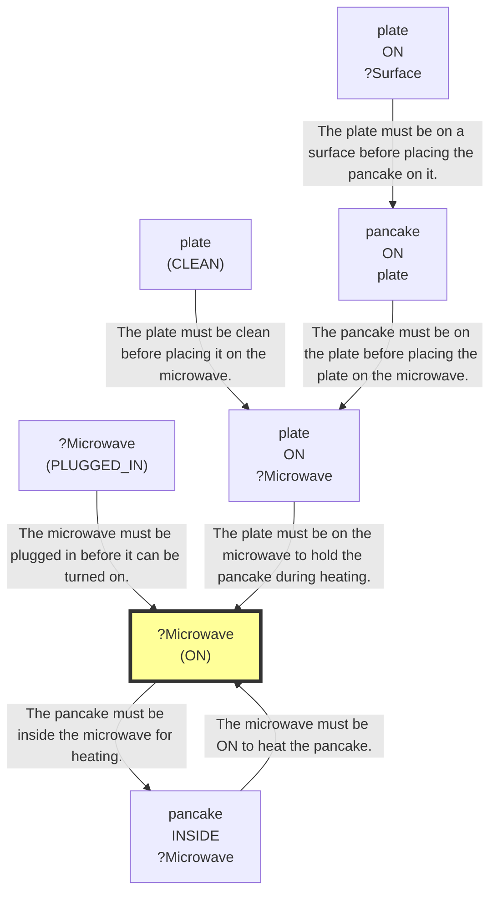
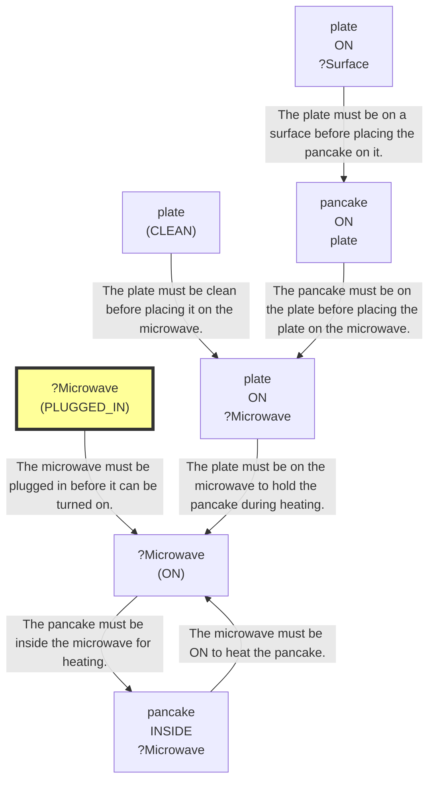
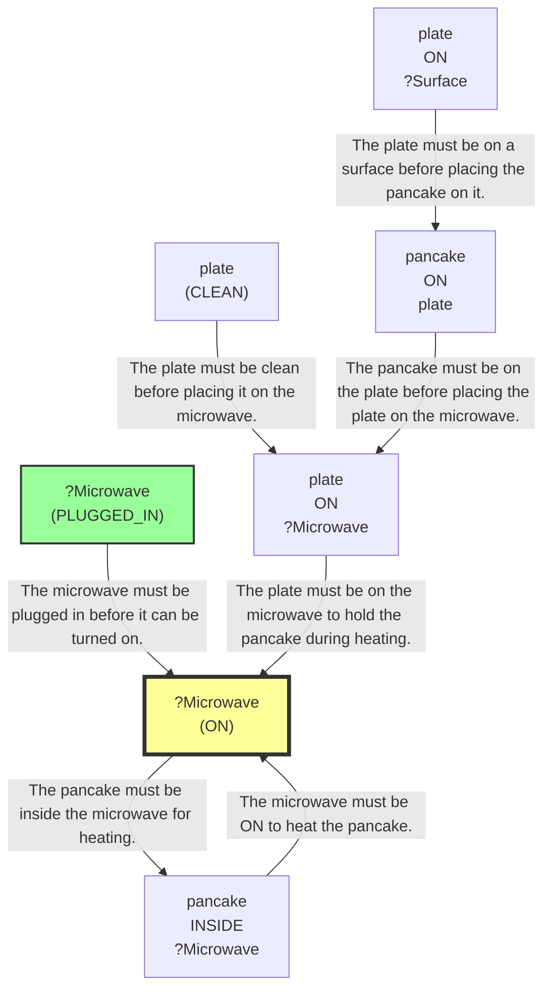
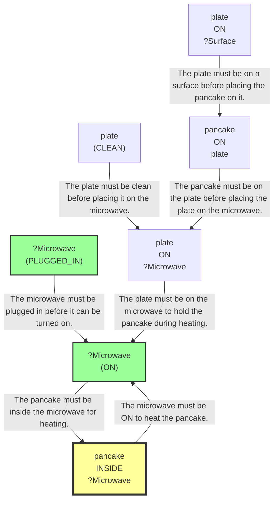

# 🚀 VirtualHome Agent Episode Log


### [GoalReasoner (Module A - Intent)] Output
```json
{
  "is_instruction_obviously_vague": false,
  "clarification_question": null,
  "target_object": "pancake",
  "location_hint": "microwave",
  "reasoning_chain": [
    {
      "question": "Why does the user want this object?",
      "answer": "The user wants to prepare a pancake for consumption."
    },
    {
      "question": "Why is that important?",
      "answer": "The user wants to have a warm, edible food item ready to eat."
    },
    {
      "question": "What fundamental need does this fulfill?",
      "answer": "The user wants to relieve hunger and satisfy their appetite."
    },
    {
      "question": "Are there any deeper psychological or physical motivations?",
      "answer": "The user may desire a quick, convenient meal or snack that is easy to prepare and consume."
    }
  ],
  "deep_intent": "Relieve hunger and satisfy appetite with a warm, edible food item.",
  "acceptable_alternatives_properties": [
    {
      "priority": 1,
      "description": "Other ready-to-eat breakfast foods, such as toast, waffles, or a muffin."
    },
    {
      "priority": 2,
      "description": "Other warm, cooked food items that can be prepared in a microwave, such as scrambled eggs or a heated oatmeal bowl."
    },
    {
      "priority": 3,
      "description": "Snack foods or packaged foods that provide caloric energy, such as a granola bar or a bagel."
    },
    {
      "priority": 4,
      "description": "Fruits or vegetables that can be warmed or eaten as a quick snack, such as a banana or a steamed vegetable."
    }
  ]
}
```

### [PerceptionFilter] Output
```json
{
  "reasoning": "The goal is to prepare a pancake for consumption, and the SDG indicates that the pancake must be placed inside the microwave, on a clean plate, and on a surface. The microwave is the primary heating appliance, and the plate is necessary to hold the pancake during heating. Since the SDG includes the plate as a required object, it must be included. Additionally, the SDG implies the need for a clean plate, so the plate must be explicitly included. The microwave is the target location, and it must be included to fulfill the heating requirement. No other objects are necessary for this task.",
  "selected_classes": [
    "plate",
    "character",
    "pancake",
    "microwave"
  ],
  "raw_class_count": 66
}
```

### [LLMExecutor] Output
```json
{
  "reasoning": "The pancake is currently inside the kitchen, and the microwave is closed and off. To heat the pancake, the microwave must be turned on and plugged in. The first step is to walk to the microwave to interact with it.",
  "satisfied_nodes": [],
  "current_node_focus": "N1",
  "mapped_variables": {
    "?Microwave": "microwave(109)"
  },
  "action": "[walk] <microwave> (109)"
}
```

### [RoboStateMultiTaskController] Output
```json
{
  "action": "[walk] <microwave> (109)",
  "active_task_id": "task_1",
  "task_context": {
    "active_task_id": "task_1",
    "pending_task_ids": [],
    "satisfied_task_ids": []
  },
  "source": "llm_executor"
}
```
## Step 0
- **Action**: `[walk] <microwave> (109)`
- **Action Success**: `True`
- **Action Message**: {'0': {'message': 'Success'}}
- **Active Task**: `task_1`
- **Decision Source**: `llm_executor`
- **Task Progress**: T4_qwen_P3_17=pending
- **SDG Status**:

- **Observed Items (12)**: pancake(62), microwave(109) [CLOSED,OFF], plate(125), plate(126), plate(127), plate(128), plate(143), character(1), kitchen(11), bathroom(172), bedroom(211), livingroom(268)


### [PerceptionFilter] Output
```json
{
  "reasoning": "Reused cached class selection.",
  "selected_classes": [
    "plate",
    "character",
    "pancake",
    "microwave"
  ],
  "raw_class_count": 66
}
```

### [LLMExecutor] Output
```json
{
  "reasoning": "The current focus is on satisfying node N2, which requires the microwave to be plugged in. The microwave is currently in the state 'OFF' and 'CLOSED', but there is no indication that it is plugged in. To proceed, we must first ensure the microwave is plugged in, which is a prerequisite for turning it on (node N1). Since the microwave is not yet plugged in, the next logical step is to plug it in.",
  "satisfied_nodes": [],
  "current_node_focus": "N2",
  "mapped_variables": {
    "?Microwave": "microwave(109)"
  },
  "action": "[plugin] <microwave> (109)"
}
```

### [RoboStateMultiTaskController] Output
```json
{
  "action": "[plugin] <microwave> (109)",
  "active_task_id": "task_1",
  "task_context": {
    "active_task_id": "task_1",
    "pending_task_ids": [],
    "satisfied_task_ids": []
  },
  "source": "llm_executor"
}
```
## Step 1
- **Action**: `[plugin] <microwave> (109)`
- **Action Success**: `True`
- **Action Message**: Faked plug operation in Python layer
- **Active Task**: `task_1`
- **Decision Source**: `llm_executor`
- **Task Progress**: T4_qwen_P3_17=pending
- **SDG Status**:

- **Observed Items (12)**: pancake(62), microwave(109) [CLOSED,OFF], plate(125), plate(126), plate(127), plate(128), plate(143), character(1), kitchen(11), bathroom(172), bedroom(211), livingroom(268)


### [PerceptionFilter] Output
```json
{
  "reasoning": "Reused cached class selection.",
  "selected_classes": [
    "plate",
    "character",
    "pancake",
    "microwave"
  ],
  "raw_class_count": 66
}
```

### [LLMExecutor] Output
```json
{
  "reasoning": "The current goal is to satisfy node N1 (microwave is ON) and N2 (microwave is PLUGGED_IN). The microwave is already PLUGGED_IN, but it is currently OFF. The next step is to turn the microwave ON to satisfy N1. This is the direct prerequisite for heating the pancake inside the microwave.",
  "satisfied_nodes": [
    "N2"
  ],
  "current_node_focus": "N1",
  "mapped_variables": {
    "?Microwave": "microwave(109)"
  },
  "action": "[switchon] <microwave> (109)"
}
```

### [RoboStateMultiTaskController] Output
```json
{
  "action": "[switchon] <microwave> (109)",
  "active_task_id": "task_1",
  "task_context": {
    "active_task_id": "task_1",
    "pending_task_ids": [],
    "satisfied_task_ids": []
  },
  "source": "llm_executor"
}
```
## Step 2
- **Action**: `[switchon] <microwave> (109)`
- **Action Success**: `True`
- **Action Message**: Faked switch operation in Python layer (bypassed Unity failure)
- **Active Task**: `task_1`
- **Decision Source**: `llm_executor`
- **Task Progress**: T4_qwen_P3_17=pending
- **SDG Status**:

- **Observed Items (12)**: pancake(62), microwave(109) [CLOSED,OFF,PLUGGED_IN], plate(125), plate(126), plate(127), plate(128), plate(143), character(1), kitchen(11), bathroom(172), bedroom(211), livingroom(268)


### [PerceptionFilter] Output
```json
{
  "reasoning": "Reused cached class selection.",
  "selected_classes": [
    "plate",
    "character",
    "pancake",
    "microwave"
  ],
  "raw_class_count": 66
}
```

### [LLMExecutor] Output
```json
{
  "reasoning": "The current goal is to satisfy node N3, which requires the pancake to be inside the microwave. However, the pancake is currently inside the kitchen, not the microwave. To achieve this, the pancake must first be grabbed, then placed inside the microwave. Since the microwave is already ON and PLUGGED_IN, the next logical step is to grab the pancake and place it inside the microwave.",
  "satisfied_nodes": [
    "N1",
    "N2"
  ],
  "current_node_focus": "N3",
  "mapped_variables": {
    "?Microwave": "microwave(109)"
  },
  "action": "[grab] <pancake> (62)"
}
```

### [RoboStateMultiTaskController] Output
```json
{
  "action": "[walk] <pancake> (62)",
  "active_task_id": "task_1",
  "task_context": {
    "active_task_id": "task_1",
    "pending_task_ids": [],
    "satisfied_task_ids": []
  },
  "source": "llm_executor_repaired"
}
```
## Step 3
- **Action**: `[walk] <pancake> (62)`
- **Action Success**: `True`
- **Action Message**: {'0': {'message': 'Success'}}
- **Active Task**: `task_1`
- **Decision Source**: `llm_executor_repaired`
- **Task Progress**: T4_qwen_P3_17=pending
- **SDG Status**:

- **Observed Items (12)**: pancake(62), microwave(109) [CLOSED,PLUGGED_IN,ON], plate(125), plate(126), plate(127), plate(128), plate(143), character(1), kitchen(11), bathroom(172), bedroom(211), livingroom(268)


### [PerceptionFilter] Output
```json
{
  "reasoning": "Reused cached class selection.",
  "selected_classes": [
    "plate",
    "character",
    "pancake",
    "microwave"
  ],
  "raw_class_count": 66
}
```

### [LLMExecutor] Output
```json
{
  "reasoning": "The current focus is on satisfying node N3, which requires the pancake to be inside the microwave. The robot has already walked to the pancake and is now holding it. The next step is to walk to the microwave to place the pancake inside it. However, the microwave is already ON and PLUGGED_IN, so the robot can now proceed to put the pancake inside.",
  "satisfied_nodes": [
    "N1",
    "N2"
  ],
  "current_node_focus": "N3",
  "mapped_variables": {
    "?Microwave": "microwave(109)"
  },
  "action": "[walk] <microwave> (109)"
}
```

### [RoboStateMultiTaskController] Output
```json
{
  "action": "[walk] <microwave> (109)",
  "active_task_id": "task_1",
  "task_context": {
    "active_task_id": "task_1",
    "pending_task_ids": [],
    "satisfied_task_ids": []
  },
  "source": "llm_executor"
}
```
## Step 4
- **Action**: `[walk] <microwave> (109)`
- **Action Success**: `True`
- **Action Message**: {'0': {'message': 'Success'}}
- **Active Task**: `task_1`
- **Decision Source**: `llm_executor`
- **Task Progress**: T4_qwen_P3_17=pending
- **SDG Status**:

- **Observed Items (12)**: pancake(62), microwave(109) [CLOSED,PLUGGED_IN,ON], plate(125), plate(126), plate(127), plate(128), plate(143), character(1), kitchen(11), bathroom(172), bedroom(211), livingroom(268)


### [PerceptionFilter] Output
```json
{
  "reasoning": "Reused cached class selection.",
  "selected_classes": [
    "plate",
    "character",
    "pancake",
    "microwave"
  ],
  "raw_class_count": 66
}
```

### [LLMExecutor] Output
```json
{
  "reasoning": "The current focus is on satisfying node N3, which requires the pancake to be inside the microwave. The microwave is already ON and PLUGGED_IN, and the pancake is in the kitchen. The next step is to grab the pancake and place it inside the microwave. Since the robot is already near the microwave, it can now grab the pancake and proceed to put it inside.",
  "satisfied_nodes": [
    "N2",
    "N1"
  ],
  "current_node_focus": "N3",
  "mapped_variables": {
    "?Microwave": "microwave(109)",
    "?Pancake": "pancake(62)"
  },
  "action": "[grab] <pancake> (62)"
}
```

### [RoboStateMultiTaskController] Output
```json
{
  "action": "[walk] <pancake> (62)",
  "active_task_id": "task_1",
  "task_context": {
    "active_task_id": "task_1",
    "pending_task_ids": [],
    "satisfied_task_ids": []
  },
  "source": "llm_executor_repaired"
}
```
## Step 5
- **Action**: `[walk] <pancake> (62)`
- **Action Success**: `True`
- **Action Message**: {'0': {'message': 'Success'}}
- **Active Task**: `task_1`
- **Decision Source**: `llm_executor_repaired`
- **Task Progress**: T4_qwen_P3_17=pending
- **SDG Status**:

- **Observed Items (12)**: pancake(62), microwave(109) [CLOSED,PLUGGED_IN,ON], plate(125), plate(126), plate(127), plate(128), plate(143), character(1), kitchen(11), bathroom(172), bedroom(211), livingroom(268)


### [PerceptionFilter] Output
```json
{
  "reasoning": "Reused cached class selection.",
  "selected_classes": [
    "plate",
    "character",
    "pancake",
    "microwave"
  ],
  "raw_class_count": 66
}
```

### [LLMExecutor] Output
```json
{
  "reasoning": "The current focus is on satisfying node N3, which requires the pancake to be inside the microwave. The microwave is already ON and PLUGGED_IN, and the pancake is in the kitchen. The next step is to grab the pancake and place it inside the microwave. Since the robot is already near the pancake, it can now [grab] the pancake and then [putin] it into the microwave.",
  "satisfied_nodes": [
    "N1",
    "N2"
  ],
  "current_node_focus": "N3",
  "mapped_variables": {
    "?Microwave": "microwave(109)",
    "?Pancake": "pancake(62)"
  },
  "action": "[grab] <pancake> (62)"
}
```

### [RoboStateMultiTaskController] Output
```json
{
  "action": "[grab] <pancake> (62)",
  "active_task_id": "task_1",
  "task_context": {
    "active_task_id": "task_1",
    "pending_task_ids": [],
    "satisfied_task_ids": []
  },
  "source": "llm_executor"
}
```
## Step 6
- **Action**: `[grab] <pancake> (62)`
- **Action Success**: `True`
- **Action Message**: {'0': {'message': 'Success'}}
- **Active Task**: `task_1`
- **Decision Source**: `llm_executor`
- **Task Progress**: T4_qwen_P3_17=pending
- **SDG Status**:

- **Observed Items (12)**: pancake(62), microwave(109) [CLOSED,PLUGGED_IN,ON], plate(125), plate(126), plate(127), plate(128), plate(143), character(1), kitchen(11), bathroom(172), bedroom(211), livingroom(268)


### [PerceptionFilter] Output
```json
{
  "reasoning": "Reused cached class selection.",
  "selected_classes": [
    "plate",
    "character",
    "pancake",
    "microwave"
  ],
  "raw_class_count": 66
}
```

### [LLMExecutor] Output
```json
{
  "reasoning": "The current focus is on satisfying node N3, which requires the pancake to be inside the microwave. The pancake is already grabbed, and the microwave is ON and PLUGGED_IN. The next step is to place the pancake inside the microwave. Since the microwave is already open (as it is ON and PLUGGED_IN), we can directly [putin] the pancake into the microwave.",
  "satisfied_nodes": [
    "N1",
    "N2"
  ],
  "current_node_focus": "N3",
  "mapped_variables": {
    "?Microwave": "microwave(109)"
  },
  "action": "[putin] <pancake> (62) <microwave> (109)"
}
```

### [RoboStateMultiTaskController] Output
```json
{
  "action": "[walk] <microwave> (109)",
  "active_task_id": "task_1",
  "task_context": {
    "active_task_id": "task_1",
    "pending_task_ids": [],
    "satisfied_task_ids": []
  },
  "source": "llm_executor_repaired"
}
```
## Step 7
- **Action**: `[walk] <microwave> (109)`
- **Action Success**: `True`
- **Action Message**: {'0': {'message': 'Success'}}
- **Active Task**: `task_1`
- **Decision Source**: `llm_executor_repaired`
- **Task Progress**: T4_qwen_P3_17=pending
- **SDG Status**:

- **Observed Items (12)**: pancake(62), microwave(109) [CLOSED,PLUGGED_IN,ON], plate(125), plate(126), plate(127), plate(128), plate(143), character(1), kitchen(11), bathroom(172), bedroom(211), livingroom(268)


### [PerceptionFilter] Output
```json
{
  "reasoning": "Reused cached class selection.",
  "selected_classes": [
    "plate",
    "character",
    "pancake",
    "microwave"
  ],
  "raw_class_count": 66
}
```

### [LLMExecutor] Output
```json
{
  "reasoning": "The current focus is on satisfying node N3, which requires the pancake to be inside the microwave. The pancake is already grabbed (HOLDS_RH pancake(62)), and the microwave is ON and PLUGGED_IN. The next step is to place the pancake inside the microwave. However, since the microwave is currently CLOSED, it must be opened first to allow the pancake to be placed inside.",
  "satisfied_nodes": [
    "N1",
    "N2"
  ],
  "current_node_focus": "N3",
  "mapped_variables": {
    "?Microwave": "microwave(109)"
  },
  "action": "[open] <microwave> (109)"
}
```

### [RoboStateMultiTaskController] Output
```json
{
  "action": "[open] <microwave> (109)",
  "active_task_id": "task_1",
  "task_context": {
    "active_task_id": "task_1",
    "pending_task_ids": [],
    "satisfied_task_ids": []
  },
  "source": "llm_executor"
}
```
## Step 8
- **Action**: `[open] <microwave> (109)`
- **Action Success**: `True`
- **Action Message**: {'0': {'message': 'Success'}}
- **Active Task**: `task_1`
- **Decision Source**: `llm_executor`
- **Task Progress**: T4_qwen_P3_17=pending
- **SDG Status**:

- **Observed Items (12)**: pancake(62), microwave(109) [CLOSED,PLUGGED_IN,ON], plate(125), plate(126), plate(127), plate(128), plate(143), character(1), kitchen(11), bathroom(172), bedroom(211), livingroom(268)


### [PerceptionFilter] Output
```json
{
  "reasoning": "Reused cached class selection.",
  "selected_classes": [
    "plate",
    "character",
    "pancake",
    "microwave"
  ],
  "raw_class_count": 66
}
```

### [LLMExecutor] Output
```json
{
  "reasoning": "The current focus is on satisfying node N3, which requires the pancake to be inside the microwave. The microwave is already ON and PLUGGED_IN, and the robot is holding the pancake. The next step is to place the pancake inside the microwave. Since the microwave is already open, the robot can directly put the pancake inside.",
  "satisfied_nodes": [
    "N1",
    "N2"
  ],
  "current_node_focus": "N3",
  "mapped_variables": {
    "?Microwave": "microwave(109)"
  },
  "action": "[putin] <pancake> (62) <microwave> (109)"
}
```

### [RoboStateMultiTaskController] Output
```json
{
  "action": "[putin] <pancake> (62) <microwave> (109)",
  "active_task_id": "task_1",
  "task_context": {
    "active_task_id": "task_1",
    "pending_task_ids": [],
    "satisfied_task_ids": []
  },
  "source": "llm_executor"
}
```
## Step 9
- **Action**: `[putin] <pancake> (62) <microwave> (109)`
- **Action Success**: `True`
- **Action Message**: {'0': {'message': 'Success'}}
- **Active Task**: `task_1`
- **Decision Source**: `llm_executor`
- **Task Progress**: T4_qwen_P3_17=done
- **SDG Status**:

- **Observed Items (13)**: pancake(62), microwave(109) [OPEN,ON,PLUGGED_IN], plate(125), plate(126), plate(127), plate(128), plate(143), character(1), kitchen(11), bathroom(172), bedroom(211), livingroom(268), plate(110) [HOT]

