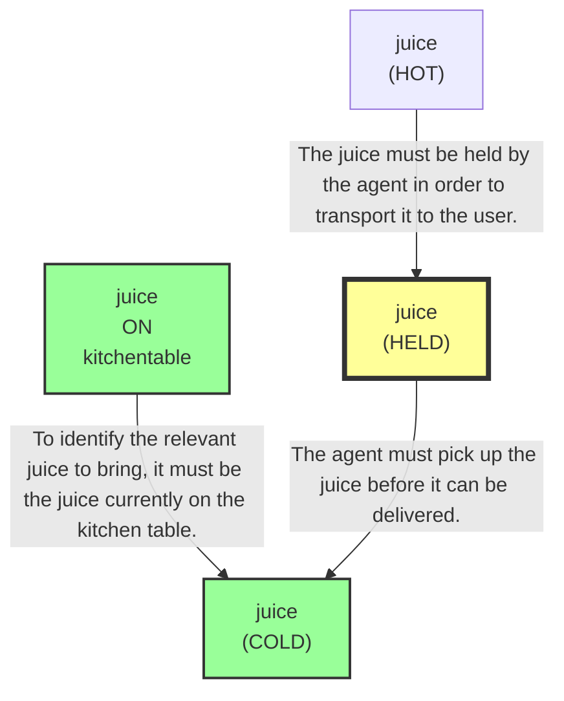

# 🚀 VirtualHome Agent Episode Log


### [GoalReasoner (Module A - Intent)] Output
```json
{
  "is_instruction_obviously_vague": true,
  "clarification_question": "Which drink should I bring?",
  "target_object": "drink",
  "location_hint": "kitchen table",
  "reasoning_chain": [
    {
      "question": "Why does the user want this object?",
      "answer": "To have a drink available."
    },
    {
      "question": "Why is that important?",
      "answer": "To satisfy thirst or obtain a beverage they want."
    },
    {
      "question": "What fundamental need does this fulfill?",
      "answer": "Relieve thirst."
    },
    {
      "question": "Are there any deeper psychological or physical motivations?",
      "answer": "The primary motivation is likely physical hydration, possibly also preference for a specific beverage."
    }
  ],
  "deep_intent": "Relieve thirst",
  "acceptable_alternatives_properties": [
    {
      "priority": 1,
      "description": "Another drink that matches the intended beverage type or preference, such as a similar cold or hot beverage already available indoors"
    },
    {
      "priority": 2,
      "description": "Any suitable beverage of the same general category, such as water, juice, tea, or coffee depending on the needed temperature"
    },
    {
      "priority": 3,
      "description": "Other ready-to-drink liquid refreshments found indoors that can hydrate or refresh"
    },
    {
      "priority": 4,
      "description": "A different hydrating beverage, such as plain water, if the exact preferred drink is unavailable"
    }
  ]
}
```

### [RoboStateMultiTaskController] Output
```json
{
  "action": "[ask] Which drink should I bring?",
  "active_task_id": "task_1",
  "task_context": {
    "active_task_id": "task_1",
    "pending_task_ids": [],
    "satisfied_task_ids": []
  },
  "source": "goal_reasoner_clarification"
}
```
## Step 0
- **Action**: `[ask] Which drink should I bring?`
- **Action Success**: `True`
- **Action Message**: The cold juice.
- **Active Task**: `task_1`
- **Decision Source**: `goal_reasoner_clarification`
- **Task Progress**: T5_G2_14_B1=pending
- **SDG Status**:
No SDG active.
- **Observed Items (159)**: wall(12), wall(13), wall(14), wall(15), wall(16), wall(17), wall(18), wall(19), wall(20), wall(21), floor(22), floor(23), floor(24), floor(25), floor(26)...


### [GoalReasoner (Module A - Intent)] Output
```json
{
  "is_instruction_obviously_vague": true,
  "clarification_question": "What exact temperature should the juice be at?",
  "target_object": "juice",
  "location_hint": "kitchen table",
  "reasoning_chain": [
    {
      "question": "Why does the user want this object?",
      "answer": "To have the juice available for use or consumption."
    },
    {
      "question": "Why is that important?",
      "answer": "Because the user wants the juice at a suitable drinking temperature."
    },
    {
      "question": "What fundamental need does this fulfill?",
      "answer": "It fulfills the need to drink a beverage at a preferred temperature."
    },
    {
      "question": "Are there any deeper psychological or physical motivations?",
      "answer": "The likely motivation is comfort and refreshment, specifically having a drink that is neither too cold nor otherwise unsuitable."
    }
  ],
  "deep_intent": "The user wants a beverage brought to them at a specific drinking temperature.",
  "acceptable_alternatives_properties": [
    {
      "priority": 1,
      "description": "Other ready-to-drink beverages that can be served at the same requested temperature"
    },
    {
      "priority": 2,
      "description": "Similar cold beverages such as water, tea, or soft drinks adjusted to the same drinking temperature"
    },
    {
      "priority": 3,
      "description": "Any drinkable household beverage that can be brought to a comparable temperature for consumption"
    },
    {
      "priority": 4,
      "description": "Another refreshing beverage that satisfies the need to drink something at a comfortable temperature"
    }
  ]
}
```

### [PerceptionFilter] Output
```json
{
  "reasoning": "The goal is to bring the juice from the kitchen table and it must be held. So the only strictly necessary classes are the target beverage, the kitchen table location, and the agent/character that will pick it up and transport it. No heating/cooling tool is needed because the SDG already specifies the juice is cold and then held.",
  "selected_classes": [
    "juice",
    "kitchentable",
    "character"
  ],
  "raw_class_count": 50
}
```

### [LLMExecutor] Output
```json
{
  "reasoning": "The task is to bring the cold juice from the kitchen table. The filtered graph shows two juice instances on kitchen tables, but only juice(173) has the required COLD state, so it is the correct binding for the goal object. The character is already CLOSE to juice(173), so the next required step in the SDG is to pick it up to satisfy the HELD prerequisite before any transport can occur.",
  "satisfied_nodes": [
    "N1",
    "N2"
  ],
  "current_node_focus": "N3",
  "mapped_variables": {},
  "action": "[grab] <juice> (173)"
}
```

### [RoboStateMultiTaskController] Output
```json
{
  "action": "[grab] <juice> (173)",
  "active_task_id": "task_1",
  "task_context": {
    "active_task_id": "task_1",
    "pending_task_ids": [],
    "satisfied_task_ids": []
  },
  "source": "llm_executor"
}
```
## Step 1
- **Action**: `[grab] <juice> (173)`
- **Action Success**: `True`
- **Action Message**: {'0': {'message': 'Success'}}
- **Active Task**: `task_1`
- **Decision Source**: `llm_executor`
- **Task Progress**: T5_G2_14_B1=done
- **SDG Status**:

- **Observed Items (10)**: kitchentable(131), kitchentable(135), juice(173) [COLD], juice(174), character(1), kitchen(11), livingroom(183), bedroom(241), bathroom(285), bedroom(346)

