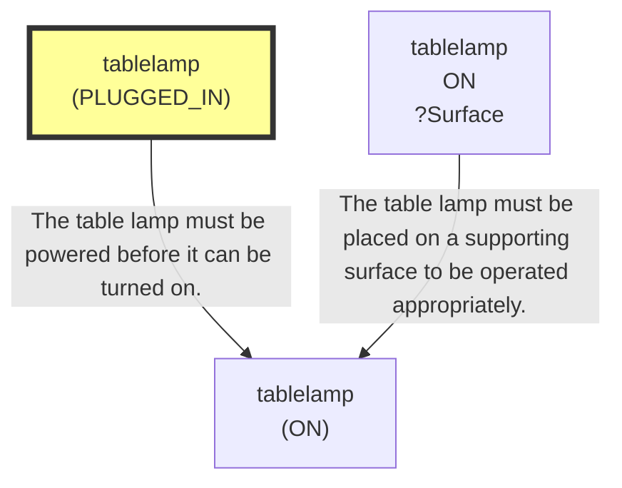
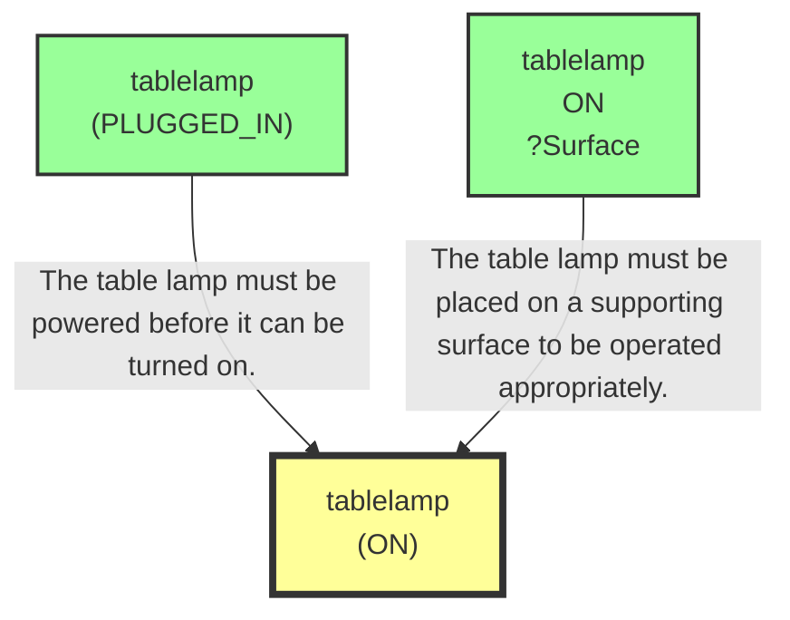

# 🚀 VirtualHome Agent Episode Log


### [GoalReasoner (Module A - Intent)] Output
```json
{
  "is_instruction_obviously_vague": true,
  "clarification_question": "What exact setting should the table lamp be adjusted to?",
  "target_object": "table lamp",
  "location_hint": null,
  "reasoning_chain": [
    {
      "question": "Why does the user want this object?",
      "answer": "To change the lamp's illumination."
    },
    {
      "question": "Why is that important?",
      "answer": "So the light level matches the desired room conditions when the TV is on."
    },
    {
      "question": "What fundamental need does this fulfill?",
      "answer": "It helps illuminate the space in a suitable way."
    },
    {
      "question": "Are there any deeper psychological or physical motivations?",
      "answer": "The user likely wants visual comfort and a balanced lighting environment."
    }
  ],
  "deep_intent": "The user wants to adjust lighting conditions for visual comfort.",
  "acceptable_alternatives_properties": [
    {
      "priority": 1,
      "description": "Other indoor light sources that can be dimmed or brightened, such as a floor lamp or ceiling light."
    },
    {
      "priority": 2,
      "description": "Alternative controllable lighting fixtures that provide similar room illumination."
    },
    {
      "priority": 3,
      "description": "Any household lighting device that can change brightness to suit the room."
    },
    {
      "priority": 4,
      "description": "A different light source that can improve visual comfort, such as turning on a nearby light if dimming is unavailable."
    }
  ]
}
```

### [RoboStateMultiTaskController] Output
```json
{
  "action": "[ask] What exact setting should the table lamp be adjusted to?",
  "active_task_id": "task_1",
  "task_context": {
    "active_task_id": "task_1",
    "pending_task_ids": [],
    "satisfied_task_ids": []
  },
  "source": "goal_reasoner_clarification"
}
```
## Step 0
- **Action**: `[ask] What exact setting should the table lamp be adjusted to?`
- **Action Success**: `True`
- **Action Message**: Turn it on.
- **Active Task**: `task_1`
- **Decision Source**: `goal_reasoner_clarification`
- **Task Progress**: T5_G2_06_B2=pending
- **SDG Status**:
No SDG active.
- **Observed Items (74)**: floor(74), floor(75), floor(76), floor(77), floor(78), floor(79), floor(80), floor(81), floor(82), wall(83), wall(84), wall(85), wall(86), wall(87), wall(88)...


### [GoalReasoner (Module A - Intent)] Output
```json
{
  "is_instruction_obviously_vague": true,
  "clarification_question": "What exact lamp setting do you want me to use?",
  "target_object": "table lamp",
  "location_hint": "TV",
  "reasoning_chain": [
    {
      "question": "Why does the user want this object?",
      "answer": "To control the lighting in the room."
    },
    {
      "question": "Why is that important?",
      "answer": "So the room is lit in a way that suits the situation when the TV is on."
    },
    {
      "question": "What fundamental need does this fulfill?",
      "answer": "Illuminate the space to support visibility and comfort."
    },
    {
      "question": "Are there any deeper psychological or physical motivations?",
      "answer": "It may be to create a more comfortable viewing or ambient lighting environment."
    }
  ],
  "deep_intent": "The user wants to illuminate the room in a suitable way.",
  "acceptable_alternatives_properties": [
    {
      "priority": 1,
      "description": "Other indoor light sources that can provide room lighting, such as a floor lamp or ceiling light"
    },
    {
      "priority": 2,
      "description": "Any nearby adjustable lamp or light fixture with similar ambient-light function"
    },
    {
      "priority": 3,
      "description": "Alternative sources of indoor illumination, such as a desk lamp or wall light"
    },
    {
      "priority": 4,
      "description": "A different light source that improves visibility and comfort in the room"
    }
  ]
}
```

### [RoboStateMultiTaskController] Output
```json
{
  "action": "[ask] What exact lamp setting do you want me to use?",
  "active_task_id": "task_1",
  "task_context": {
    "active_task_id": "task_1",
    "pending_task_ids": [],
    "satisfied_task_ids": []
  },
  "source": "goal_reasoner_clarification"
}
```
## Step 1
- **Action**: `[ask] What exact lamp setting do you want me to use?`
- **Action Success**: `True`
- **Action Message**: Turn it on.
- **Active Task**: `task_1`
- **Decision Source**: `goal_reasoner_clarification`
- **Task Progress**: T5_G2_06_B2=pending
- **SDG Status**:
No SDG active.
- **Observed Items (74)**: floor(74), floor(75), floor(76), floor(77), floor(78), floor(79), floor(80), floor(81), floor(82), wall(83), wall(84), wall(85), wall(86), wall(87), wall(88)...


### [GoalReasoner (Module A - Intent)] Output
```json
{
  "is_instruction_obviously_vague": true,
  "clarification_question": "What exact setting should the table lamp be adjusted to?",
  "target_object": "table lamp",
  "location_hint": null,
  "reasoning_chain": [
    {
      "question": "Why does the user want this object?",
      "answer": "To control lighting based on the TV being on."
    },
    {
      "question": "Why is that important?",
      "answer": "To create a desired light level or viewing environment."
    },
    {
      "question": "What fundamental need does this fulfill?",
      "answer": "Illuminating the room to support comfortable visibility."
    },
    {
      "question": "Are there any deeper psychological or physical motivations?",
      "answer": "It may be to reduce eye strain, improve ambiance, or make the space easier to use while the TV is on."
    }
  ],
  "deep_intent": "The user wants to illuminate the room to a suitable level for the current viewing situation.",
  "acceptable_alternatives_properties": [
    {
      "priority": 1,
      "description": "Other indoor light sources that can provide adjustable room lighting, such as a floor lamp, ceiling light, or desk lamp."
    },
    {
      "priority": 2,
      "description": "Any nearby lamp or lighting fixture that can be switched on to brighten the room."
    },
    {
      "priority": 3,
      "description": "Other household lighting devices that improve visibility, such as wall lights or accent lights."
    },
    {
      "priority": 4,
      "description": "A different light source that still helps illuminate the space, such as a flashlight or portable LED light."
    }
  ]
}
```

### [PerceptionFilter] Output
```json
{
  "reasoning": "The goal is to adjust the table lamp, so the target object tablelamp is required. The SDG also requires it to be plugged in and placed on a supporting surface. Since the user’s intent is room illumination and the instructions require retaining all acceptable lighting alternatives, I include other visible indoor light sources that could also serve the task: ceilinglamp, candle, and lightswitch for controlling lighting. For placement/support, coffeetable, desk, and nightstand are relevant surfaces.",
  "selected_classes": [
    "coffeetable",
    "ceiling",
    "tablelamp",
    "wall",
    "ceilinglamp",
    "character",
    "lightswitch",
    "floor",
    "nightstand",
    "desk",
    "candle"
  ],
  "raw_class_count": 33
}
```

### [LLMExecutor] Output
```json
{
  "reasoning": "The goal is to turn the table lamp on. The current graph shows two table lamps, both OFF and both with HAS_PLUG. The prior task asked for the exact setting and the human clarified 'Turn it on', so the remaining focus is to satisfy N2/N1 for one lamp. Since the lamp must be plugged in before switching on, and no lamp is currently plugged in or on, the best next step is to walk to the chosen table lamp and prepare for interaction. I will bind ?Lamp to tablelamp(102), which is on a nearby nightstand in the bedroom and is a valid target for the SDG.",
  "satisfied_nodes": [],
  "current_node_focus": "N2",
  "mapped_variables": {
    "?Lamp": "tablelamp(102)",
    "?Surface": "nightstand(104)"
  },
  "action": "[walk] <tablelamp> (102)"
}
```

### [RoboStateMultiTaskController] Output
```json
{
  "action": "[walk] <tablelamp> (102)",
  "active_task_id": "task_1",
  "task_context": {
    "active_task_id": "task_1",
    "pending_task_ids": [],
    "satisfied_task_ids": []
  },
  "source": "llm_executor"
}
```
## Step 2
- **Action**: `[walk] <tablelamp> (102)`
- **Action Success**: `True`
- **Action Message**: {'0': {'message': 'Success'}}
- **Active Task**: `task_1`
- **Decision Source**: `llm_executor`
- **Task Progress**: T5_G2_06_B2=pending
- **SDG Status**:

- **Observed Items (40)**: floor(74), floor(75), floor(76), floor(77), floor(78), floor(79), floor(80), floor(81), floor(82), wall(83), wall(84), wall(85), wall(86), wall(87), wall(88)...


### [PerceptionFilter] Output
```json
{
  "reasoning": "Reused cached class selection.",
  "selected_classes": [
    "coffeetable",
    "ceiling",
    "tablelamp",
    "wall",
    "ceilinglamp",
    "character",
    "lightswitch",
    "floor",
    "nightstand",
    "desk",
    "candle"
  ],
  "raw_class_count": 33
}
```

### [LLMExecutor] Output
```json
{
  "reasoning": "The active task is to turn the table lamp on. The current graph shows tablelamp(102) is OFF, has HAS_SWITCH and HAS_PLUG, and the character is already CLOSE to it, so no additional walk is needed. Since it is not yet plugged in, the next required step in the SDG is to satisfy the PLUGGED_IN prerequisite before switching it on.",
  "satisfied_nodes": [],
  "current_node_focus": "N2",
  "mapped_variables": {
    "?Surface": "nightstand(104)"
  },
  "action": "[plugin] <tablelamp> (102)"
}
```

### [RoboStateMultiTaskController] Output
```json
{
  "action": "[plugin] <tablelamp> (102)",
  "active_task_id": "task_1",
  "task_context": {
    "active_task_id": "task_1",
    "pending_task_ids": [],
    "satisfied_task_ids": []
  },
  "source": "llm_executor"
}
```
## Step 3
- **Action**: `[plugin] <tablelamp> (102)`
- **Action Success**: `True`
- **Action Message**: Faked plug operation in Python layer
- **Active Task**: `task_1`
- **Decision Source**: `llm_executor`
- **Task Progress**: T5_G2_06_B2=pending
- **SDG Status**:

- **Observed Items (40)**: floor(74), floor(75), floor(76), floor(77), floor(78), floor(79), floor(80), floor(81), floor(82), wall(83), wall(84), wall(85), wall(86), wall(87), wall(88)...


### [PerceptionFilter] Output
```json
{
  "reasoning": "Reused cached class selection.",
  "selected_classes": [
    "coffeetable",
    "ceiling",
    "tablelamp",
    "wall",
    "ceilinglamp",
    "character",
    "lightswitch",
    "floor",
    "nightstand",
    "desk",
    "candle"
  ],
  "raw_class_count": 33
}
```

### [LLMExecutor] Output
```json
{
  "reasoning": "The active task is to turn the table lamp on. The current graph shows tablelamp(102) is already PLUGGED_IN and is close to the character, but still OFF. The next required step to satisfy N1 is to switch it on. N2 is already satisfied, and N3 is already satisfied because the lamp is on a nightstand surface.",
  "satisfied_nodes": [
    "N2",
    "N3"
  ],
  "current_node_focus": "N1",
  "mapped_variables": {},
  "action": "[switchon] <tablelamp> (102)"
}
```

### [RoboStateMultiTaskController] Output
```json
{
  "action": "[switchon] <tablelamp> (102)",
  "active_task_id": "task_1",
  "task_context": {
    "active_task_id": "task_1",
    "pending_task_ids": [],
    "satisfied_task_ids": []
  },
  "source": "llm_executor"
}
```
## Step 4
- **Action**: `[switchon] <tablelamp> (102)`
- **Action Success**: `True`
- **Action Message**: Faked switch operation in Python layer (bypassed Unity failure)
- **Active Task**: `task_1`
- **Decision Source**: `llm_executor`
- **Task Progress**: T5_G2_06_B2=done
- **SDG Status**:

- **Observed Items (40)**: floor(74), floor(75), floor(76), floor(77), floor(78), floor(79), floor(80), floor(81), floor(82), wall(83), wall(84), wall(85), wall(86), wall(87), wall(88)...

