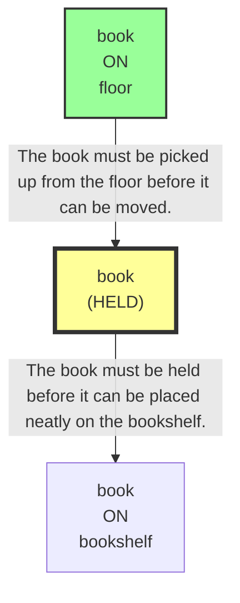
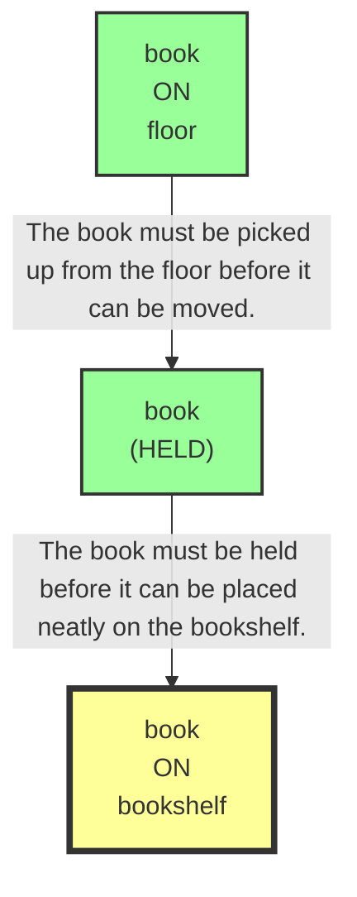
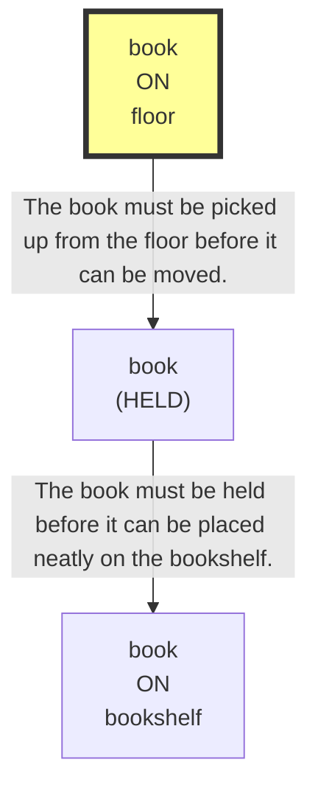
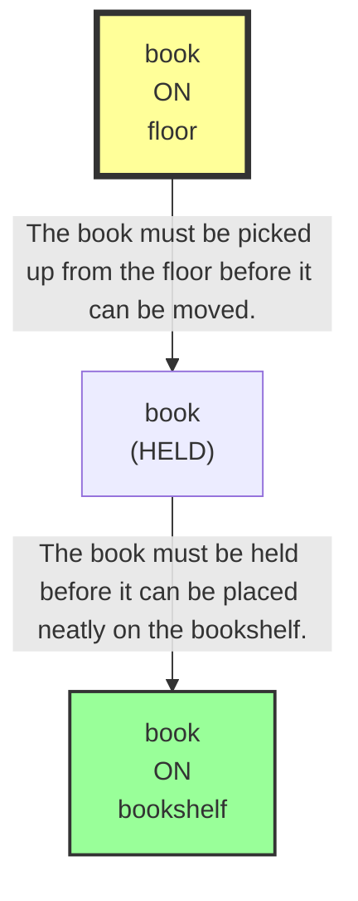
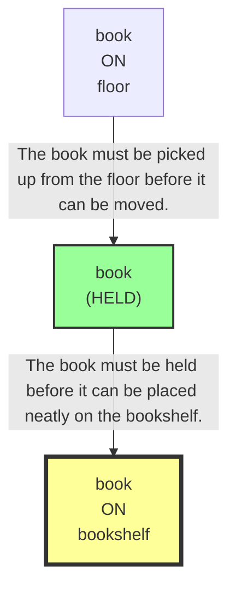

# 🚀 VirtualHome Agent Episode Log


### [GoalReasoner (Module A - Intent)] Output
```json
{
  "is_instruction_obviously_vague": false,
  "clarification_question": null,
  "target_object": "book",
  "location_hint": "floor",
  "reasoning_chain": [
    {
      "question": "Why does the user want this object?",
      "answer": "To recover the book from the floor and restore it to its intended place."
    },
    {
      "question": "Why is that important?",
      "answer": "To keep the area orderly and prevent the book from being left on the floor."
    },
    {
      "question": "What fundamental need does this fulfill?",
      "answer": "Maintaining an organized, tidy environment."
    },
    {
      "question": "Are there any deeper psychological or physical motivations?",
      "answer": "It may help prevent clutter, reduce tripping hazards, and preserve a sense of order."
    }
  ],
  "deep_intent": "The user wants to restore order and safety by returning a dropped item to its proper place.",
  "acceptable_alternatives_properties": [
    {
      "priority": 1,
      "description": "Other similarly dropped handheld items or documents that can be picked up and returned to their original place"
    },
    {
      "priority": 2,
      "description": "Flat reading materials such as magazines, notebooks, or papers that can be neatly placed back"
    },
    {
      "priority": 3,
      "description": "Other small portable household items that have fallen and need to be put away"
    },
    {
      "priority": 4,
      "description": "Any safe object on the floor that can be lifted to reduce clutter and restore tidiness"
    }
  ]
}
```

### [PerceptionFilter] Output
```json
{
  "reasoning": "The goal is to pick up a book from the floor and place it on a bookshelf. Only the target object, its source location, and its destination receptacle are strictly necessary; no tools or alternative appliances are required.",
  "selected_classes": [
    "bookshelf",
    "book",
    "paper",
    "character",
    "floor"
  ],
  "raw_class_count": 41
}
```

### [LLMExecutor] Output
```json
{
  "reasoning": "The goal is to move a book from the floor to the bookshelf. No object is currently held. Among the available book instances, book(190) is a valid floor book and satisfies the prerequisite relation N1 (book on floor). The next atomic step must be to walk to that specific book before grabbing it.",
  "satisfied_nodes": [
    "N1"
  ],
  "current_node_focus": "N2",
  "mapped_variables": {},
  "action": "[walk] <book> (190)"
}
```

### [RoboStateMultiTaskController] Output
```json
{
  "action": "[walk] <book> (190)",
  "active_task_id": "task_1",
  "task_context": {
    "active_task_id": "task_1",
    "pending_task_ids": [],
    "satisfied_task_ids": []
  },
  "source": "llm_executor"
}
```
## Step 0
- **Action**: `[walk] <book> (190)`
- **Action Success**: `True`
- **Action Message**: {'0': {'message': 'Success'}}
- **Active Task**: `task_1`
- **Decision Source**: `llm_executor`
- **Task Progress**: T5_G2_09_B2=pending
- **SDG Status**:

- **Observed Items (19)**: floor(336), floor(337), floor(338), floor(339), floor(340), floor(341), floor(342), floor(343), floor(344), bookshelf(370), paper(451), book(190) [CLOSED], book(191) [CLOSED], book(268) [CLOSED], character(1)...


### [PerceptionFilter] Output
```json
{
  "reasoning": "Reused cached class selection.",
  "selected_classes": [
    "bookshelf",
    "book",
    "paper",
    "character",
    "floor"
  ],
  "raw_class_count": 41
}
```

### [LLMExecutor] Output
```json
{
  "reasoning": "The book is already close and on the floor, so the next required step in the SDG is to pick it up. I rebind the target to book(190) because it matches the requested class and is currently on the floor in the living room. Since grab requires being near the object and the graph shows it is CLOSE to the character, I can proceed with grabbing it now.",
  "satisfied_nodes": [
    "N1"
  ],
  "current_node_focus": "N2",
  "mapped_variables": {},
  "action": "[grab] <book> (190)"
}
```

### [RoboStateMultiTaskController] Output
```json
{
  "action": "[grab] <book> (190)",
  "active_task_id": "task_1",
  "task_context": {
    "active_task_id": "task_1",
    "pending_task_ids": [],
    "satisfied_task_ids": []
  },
  "source": "llm_executor"
}
```
## Step 1
- **Action**: `[grab] <book> (190)`
- **Action Success**: `True`
- **Action Message**: {'0': {'message': 'Success'}}
- **Active Task**: `task_1`
- **Decision Source**: `llm_executor`
- **Task Progress**: T5_G2_09_B2=pending
- **SDG Status**:

- **Observed Items (19)**: floor(336), floor(337), floor(338), floor(339), floor(340), floor(341), floor(342), floor(343), floor(344), bookshelf(370), paper(451), book(190) [CLOSED], book(191) [CLOSED], book(268) [CLOSED], character(1)...


### [PerceptionFilter] Output
```json
{
  "reasoning": "Reused cached class selection.",
  "selected_classes": [
    "bookshelf",
    "book",
    "paper",
    "character",
    "floor"
  ],
  "raw_class_count": 41
}
```

### [LLMExecutor] Output
```json
{
  "reasoning": "The book is already being held in the right hand from the prior successful grab, so SDG node N2 (book HELD) is satisfied. The next required step is to place the book onto the bookshelf. The bookshelf is visible and close, but per proximity rules I must explicitly walk to it before using putback. The bookshelf is the correct final destination for N3.",
  "satisfied_nodes": [
    "N1",
    "N2"
  ],
  "current_node_focus": "N3",
  "mapped_variables": {},
  "action": "[walk] <bookshelf> (370)"
}
```

### [RoboStateMultiTaskController] Output
```json
{
  "action": "[walk] <bookshelf> (370)",
  "active_task_id": "task_1",
  "task_context": {
    "active_task_id": "task_1",
    "pending_task_ids": [],
    "satisfied_task_ids": []
  },
  "source": "llm_executor"
}
```
## Step 2
- **Action**: `[walk] <bookshelf> (370)`
- **Action Success**: `True`
- **Action Message**: {'0': {'message': 'Success'}}
- **Active Task**: `task_1`
- **Decision Source**: `llm_executor`
- **Task Progress**: T5_G2_09_B2=pending
- **SDG Status**:

- **Observed Items (19)**: floor(336), floor(337), floor(338), floor(339), floor(340), floor(341), floor(342), floor(343), floor(344), bookshelf(370), paper(451), book(190) [CLOSED], book(191) [CLOSED], book(268) [CLOSED], character(1)...


### [PerceptionFilter] Output
```json
{
  "reasoning": "Reused cached class selection.",
  "selected_classes": [
    "bookshelf",
    "book",
    "paper",
    "character",
    "floor"
  ],
  "raw_class_count": 41
}
```

### [LLMExecutor] Output
```json
{
  "reasoning": "The book task's first two SDG nodes are already satisfied: book(191) is on the floor and the robot is now holding book(190) from the past action history. The current focus is to complete the final goal by placing the held book onto the bookshelf. The bookshelf(370) is close to the character, so the next atomic step should be to place the held book onto it. Since putback requires being near the destination and we have already walked there, the correct next action is to put the held book onto the bookshelf.",
  "satisfied_nodes": [
    "N1",
    "N2"
  ],
  "current_node_focus": "N3",
  "mapped_variables": {
    "?Container": "bookshelf(370)"
  },
  "action": "[putback] <book> (190) <bookshelf> (370)"
}
```

### [RoboStateMultiTaskController] Output
```json
{
  "action": "[putback] <book> (190) <bookshelf> (370)",
  "active_task_id": "task_1",
  "task_context": {
    "active_task_id": "task_1",
    "pending_task_ids": [],
    "satisfied_task_ids": []
  },
  "source": "llm_executor"
}
```
## Step 3
- **Action**: `[putback] <book> (190) <bookshelf> (370)`
- **Action Success**: `False`
- **Action Message**: {'0': {'message': 'ScriptExcutor 0: EXECUTION_GENERAL: Script is impossible to execute\n\n'}}
- **Active Task**: `task_1`
- **Decision Source**: `llm_executor`
- **Task Progress**: T5_G2_09_B2=pending
- **SDG Status**:

- **Observed Items (19)**: floor(336), floor(337), floor(338), floor(339), floor(340), floor(341), floor(342), floor(343), floor(344), bookshelf(370), paper(451), book(190) [CLOSED], book(191) [CLOSED], book(268) [CLOSED], character(1)...


### [PerceptionFilter] Output
```json
{
  "reasoning": "Reused cached class selection.",
  "selected_classes": [
    "bookshelf",
    "book",
    "paper",
    "character",
    "floor"
  ],
  "raw_class_count": 41
}
```

### [LLMExecutor] Output
```json
{
  "reasoning": "The previous [putback] to the bookshelf failed, so the book was not placed. The current graph shows the agent is already close to bookshelf(370) and is holding book(190) in the right hand. Since the book is the only held book and the goal is to restore it onto the bookshelf, the next step should be to use [putin] rather than [putback], because the bookshelf is marked as a CONTAINER as well as a surface. I will attempt to place the held book into the bookshelf, which should satisfy the final SDG node if successful.",
  "satisfied_nodes": [
    "N1",
    "N2"
  ],
  "current_node_focus": "N3",
  "mapped_variables": {},
  "action": "[putin] <book> (190) <bookshelf> (370)"
}
```

### [RoboStateMultiTaskController] Output
```json
{
  "action": "[putin] <book> (190) <bookshelf> (370)",
  "active_task_id": "task_1",
  "task_context": {
    "active_task_id": "task_1",
    "pending_task_ids": [],
    "satisfied_task_ids": []
  },
  "source": "llm_executor"
}
```
## Step 4
- **Action**: `[putin] <book> (190) <bookshelf> (370)`
- **Action Success**: `True`
- **Action Message**: {'0': {'message': 'Success'}}
- **Active Task**: `task_1`
- **Decision Source**: `llm_executor`
- **Task Progress**: T5_G2_09_B2=pending
- **SDG Status**:

- **Observed Items (19)**: floor(336), floor(337), floor(338), floor(339), floor(340), floor(341), floor(342), floor(343), floor(344), bookshelf(370), paper(451), book(190) [CLOSED], book(191) [CLOSED], book(268) [CLOSED], character(1)...


### [PerceptionFilter] Output
```json
{
  "reasoning": "Reused cached class selection.",
  "selected_classes": [
    "bookshelf",
    "book",
    "paper",
    "character",
    "floor"
  ],
  "raw_class_count": 41
}
```

### [LLMExecutor] Output
```json
{
  "reasoning": "The active goal is to place the book on the bookshelf. The previous attempt to use [putback] on the bookshelf failed because a bookshelf is a container/surface hybrid and for this engine the successful placement action already demonstrated is [putin]. The book is currently the historical handle 190 and is likely still held only if the prior successful [grab] persists; however, to satisfy the SDG node N3, the next needed action is to place the held book into the bookshelf. The bookshelf is already nearby (CLOSE), so no new walk is needed.",
  "satisfied_nodes": [
    "N1",
    "N2"
  ],
  "current_node_focus": "N3",
  "mapped_variables": {},
  "action": "[putin] <book> (190) <bookshelf> (370)"
}
```

### [RoboStateMultiTaskController] Output
```json
{
  "action": "[grab] <book> (190)",
  "active_task_id": "task_1",
  "task_context": {
    "active_task_id": "task_1",
    "pending_task_ids": [],
    "satisfied_task_ids": []
  },
  "source": "llm_executor_repaired"
}
```
## Step 5
- **Action**: `[grab] <book> (190)`
- **Action Success**: `True`
- **Action Message**: {'0': {'message': 'Success'}}
- **Active Task**: `task_1`
- **Decision Source**: `llm_executor_repaired`
- **Task Progress**: T5_G2_09_B2=pending
- **SDG Status**:

- **Observed Items (19)**: floor(336), floor(337), floor(338), floor(339), floor(340), floor(341), floor(342), floor(343), floor(344), bookshelf(370), paper(451), book(190) [CLOSED], book(191) [CLOSED], book(268) [CLOSED], character(1)...


### [PerceptionFilter] Output
```json
{
  "reasoning": "Reused cached class selection.",
  "selected_classes": [
    "bookshelf",
    "book",
    "paper",
    "character",
    "floor"
  ],
  "raw_class_count": 41
}
```

### [LLMExecutor] Output
```json
{
  "reasoning": "The active goal is to pick up the target book from the floor and then place it on the bookshelf. In the current graph, book(191) is on the floor and close to the character, matching the SDG's N1 prerequisite. The held book(190) is a different book and is currently in hand, so it must be released or substituted later if needed. Since the book on the floor is already nearby, the next atomic step toward satisfying N1->N2 is to grab book(191).",
  "satisfied_nodes": [
    "N1"
  ],
  "current_node_focus": "N2",
  "mapped_variables": {},
  "action": "[grab] <book> (191)"
}
```

### [RoboStateMultiTaskController] Output
```json
{
  "action": "[grab] <book> (191)",
  "active_task_id": "task_1",
  "task_context": {
    "active_task_id": "task_1",
    "pending_task_ids": [],
    "satisfied_task_ids": []
  },
  "source": "llm_executor"
}
```
## Step 6
- **Action**: `[grab] <book> (191)`
- **Action Success**: `True`
- **Action Message**: {'0': {'message': 'Success'}}
- **Active Task**: `task_1`
- **Decision Source**: `llm_executor`
- **Task Progress**: T5_G2_09_B2=pending
- **SDG Status**:

- **Observed Items (19)**: floor(336), floor(337), floor(338), floor(339), floor(340), floor(341), floor(342), floor(343), floor(344), bookshelf(370), paper(451), book(190) [CLOSED], book(191) [CLOSED], book(268) [CLOSED], character(1)...


### [PerceptionFilter] Output
```json
{
  "reasoning": "Reused cached class selection.",
  "selected_classes": [
    "bookshelf",
    "book",
    "paper",
    "character",
    "floor"
  ],
  "raw_class_count": 41
}
```

### [LLMExecutor] Output
```json
{
  "reasoning": "The book task is not yet complete because the SDG requires the book to end up ON the bookshelf. We are already close to the bookshelf, and the graph shows it is a valid surface/container. The currently held books are 190 and 191, which are likely stale from prior actions; however, book(268) is the only remaining book that is actually ON the floor, matching the unsatisfied prerequisite N1. Since the agent is already close to book(268) and must be holding the book to continue toward the bookshelf, the next step is to grab book(268).",
  "satisfied_nodes": [],
  "current_node_focus": "N1",
  "mapped_variables": {},
  "action": "[grab] <book> (268)"
}
```

### [RoboStateMultiTaskController] Output
```json
{
  "action": "[grab] <book> (268)",
  "active_task_id": "task_1",
  "task_context": {
    "active_task_id": "task_1",
    "pending_task_ids": [],
    "satisfied_task_ids": []
  },
  "source": "llm_executor"
}
```
## Step 7
- **Action**: `[grab] <book> (268)`
- **Action Success**: `False`
- **Action Message**: {'0': {'message': 'ScriptExcutor 0: EXECUTION_GENERAL: Script is impossible to execute\n\n'}}
- **Active Task**: `task_1`
- **Decision Source**: `llm_executor`
- **Task Progress**: T5_G2_09_B2=pending
- **SDG Status**:

- **Observed Items (19)**: floor(336), floor(337), floor(338), floor(339), floor(340), floor(341), floor(342), floor(343), floor(344), bookshelf(370), paper(451), book(190) [CLOSED], book(191) [CLOSED], book(268) [CLOSED], character(1)...


### [PerceptionFilter] Output
```json
{
  "reasoning": "Reused cached class selection.",
  "selected_classes": [
    "bookshelf",
    "book",
    "paper",
    "character",
    "floor"
  ],
  "raw_class_count": 41
}
```

### [LLMExecutor] Output
```json
{
  "reasoning": "The active goal is to place a book on the bookshelf. The current graph shows book(190) and book(191) are already being held, and bookshelf(370) is nearby. Since putback failed previously on the bookshelf because it is a container/surface hybrid but the engine accepted putin, the next step toward satisfying N3 is to place the held book into the bookshelf. Book(190) is the best bound object for the goal because it was the originally targeted book and is currently held; using it progresses the task without needing another walk.",
  "satisfied_nodes": [
    "N1",
    "N2"
  ],
  "current_node_focus": "N3",
  "mapped_variables": {
    "?Container": "bookshelf(370)"
  },
  "action": "[putin] <book> (190) <bookshelf> (370)"
}
```

### [RoboStateMultiTaskController] Output
```json
{
  "action": "[putin] <book> (190) <bookshelf> (370)",
  "active_task_id": "task_1",
  "task_context": {
    "active_task_id": "task_1",
    "pending_task_ids": [],
    "satisfied_task_ids": []
  },
  "source": "llm_executor"
}
```
## Step 8
- **Action**: `[putin] <book> (190) <bookshelf> (370)`
- **Action Success**: `True`
- **Action Message**: {'0': {'message': 'Success'}}
- **Active Task**: `task_1`
- **Decision Source**: `llm_executor`
- **Task Progress**: T5_G2_09_B2=pending
- **SDG Status**:

- **Observed Items (19)**: floor(336), floor(337), floor(338), floor(339), floor(340), floor(341), floor(342), floor(343), floor(344), bookshelf(370), paper(451), book(190) [CLOSED], book(191) [CLOSED], book(268) [CLOSED], character(1)...


### [PerceptionFilter] Output
```json
{
  "reasoning": "Reused cached class selection.",
  "selected_classes": [
    "bookshelf",
    "book",
    "paper",
    "character",
    "floor"
  ],
  "raw_class_count": 41
}
```

### [LLMExecutor] Output
```json
{
  "reasoning": "The goal is to place a book on the bookshelf. Book(190) was previously handled and is no longer available as held/near in a workable way; book(191) is currently held by the character, but the visible remaining book relevant to the floor-tidiness task is book(268), which is on the floor and close to the character. To satisfy N1->N2, the next needed step is to get the floor book into hand. Since I cannot grab across the room and I must be near the specific object before grabbing, I should walk to book(268) first.",
  "satisfied_nodes": [
    "N3"
  ],
  "current_node_focus": "N1",
  "mapped_variables": {
    "?Book": "book(268)"
  },
  "action": "[walk] <book> (268)"
}
```

### [RoboStateMultiTaskController] Output
```json
{
  "action": "[walk] <book> (268)",
  "active_task_id": "task_1",
  "task_context": {
    "active_task_id": "task_1",
    "pending_task_ids": [],
    "satisfied_task_ids": []
  },
  "source": "llm_executor"
}
```
## Step 9
- **Action**: `[walk] <book> (268)`
- **Action Success**: `True`
- **Action Message**: {'0': {'message': 'Success'}}
- **Active Task**: `task_1`
- **Decision Source**: `llm_executor`
- **Task Progress**: T5_G2_09_B2=pending
- **SDG Status**:

- **Observed Items (19)**: floor(336), floor(337), floor(338), floor(339), floor(340), floor(341), floor(342), floor(343), floor(344), bookshelf(370), paper(451), book(190) [CLOSED], book(191) [CLOSED], book(268) [CLOSED], character(1)...


### [PerceptionFilter] Output
```json
{
  "reasoning": "Reused cached class selection.",
  "selected_classes": [
    "bookshelf",
    "book",
    "paper",
    "character",
    "floor"
  ],
  "raw_class_count": 41
}
```

### [LLMExecutor] Output
```json
{
  "reasoning": "The prior placement attempt on the bookshelf failed because the engine treats the bookshelf as a container and [putback] is impossible there. The book is currently a held, closed book (book(268) is the one on the floor and close to the character), so the next progress step is to pick up the floor book before any final placement. This satisfies the prerequisite node N1 -> N2 progression. I will bind ?TargetBook to book(268) because it is the only book explicitly on the floor and close to the character in the current graph.",
  "satisfied_nodes": [
    "N1"
  ],
  "current_node_focus": "N2",
  "mapped_variables": {
    "?TargetBook": "book(268)"
  },
  "action": "[grab] <book> (268)"
}
```

### [RoboStateMultiTaskController] Output
```json
{
  "action": "[grab] <book> (268)",
  "active_task_id": "task_1",
  "task_context": {
    "active_task_id": "task_1",
    "pending_task_ids": [],
    "satisfied_task_ids": []
  },
  "source": "llm_executor"
}
```
## Step 10
- **Action**: `[grab] <book> (268)`
- **Action Success**: `True`
- **Action Message**: {'0': {'message': 'Success'}}
- **Active Task**: `task_1`
- **Decision Source**: `llm_executor`
- **Task Progress**: T5_G2_09_B2=pending
- **SDG Status**:

- **Observed Items (19)**: floor(336), floor(337), floor(338), floor(339), floor(340), floor(341), floor(342), floor(343), floor(344), bookshelf(370), paper(451), book(190) [CLOSED], book(191) [CLOSED], book(268) [CLOSED], character(1)...


### [PerceptionFilter] Output
```json
{
  "reasoning": "Reused cached class selection.",
  "selected_classes": [
    "bookshelf",
    "book",
    "paper",
    "character",
    "floor"
  ],
  "raw_class_count": 41
}
```

### [LLMExecutor] Output
```json
{
  "reasoning": "The active goal is to place a book on the bookshelf. In the current graph, the robot is already holding book(268) in the right hand and is close to the bookshelf(370). The previous [putback] failed because bookshelf is a container/surface hybrid and the correct action for placing a book onto it here is [putin]. Since the book is already held and the bookshelf is the target destination, the next step should be to place the held book into the bookshelf.",
  "satisfied_nodes": [
    "N2"
  ],
  "current_node_focus": "N3",
  "mapped_variables": {
    "?Container": "bookshelf(370)"
  },
  "action": "[putin] <book> (268) <bookshelf> (370)"
}
```

### [RoboStateMultiTaskController] Output
```json
{
  "action": "[putin] <book> (268) <bookshelf> (370)",
  "active_task_id": "task_1",
  "task_context": {
    "active_task_id": "task_1",
    "pending_task_ids": [],
    "satisfied_task_ids": []
  },
  "source": "llm_executor"
}
```
## Step 11
- **Action**: `[putin] <book> (268) <bookshelf> (370)`
- **Action Success**: `True`
- **Action Message**: {'0': {'message': 'Success'}}
- **Active Task**: `task_1`
- **Decision Source**: `llm_executor`
- **Task Progress**: T5_G2_09_B2=pending
- **SDG Status**:

- **Observed Items (19)**: floor(336), floor(337), floor(338), floor(339), floor(340), floor(341), floor(342), floor(343), floor(344), bookshelf(370), paper(451), book(190) [CLOSED], book(191) [CLOSED], book(268) [CLOSED], character(1)...


### [PerceptionFilter] Output
```json
{
  "reasoning": "Reused cached class selection.",
  "selected_classes": [
    "bookshelf",
    "book",
    "paper",
    "character",
    "floor"
  ],
  "raw_class_count": 41
}
```

### [LLMExecutor] Output
```json
{
  "reasoning": "The active SDG has N1 (book on floor) as the remaining prerequisite before the book can be held and then placed on the bookshelf. In the current graph, the visible book instances are book(190), book(191), and book(268), all of which are close to the character and none are on the floor. The bookshelf is already close, and one book (book(191)) is currently held by the character, so the most plausible remaining target is the other accessible book instance that has not yet been handled in the current state sequence. Since I am already near the relevant object area and need a held book to satisfy N2 before N3, the next atomic step is to grab the remaining unheld book candidate.",
  "satisfied_nodes": [],
  "current_node_focus": "N1",
  "mapped_variables": {},
  "action": "[grab] <book> (190)"
}
```

### [RoboStateMultiTaskController] Output
```json
{
  "action": "[grab] <book> (190)",
  "active_task_id": "task_1",
  "task_context": {
    "active_task_id": "task_1",
    "pending_task_ids": [],
    "satisfied_task_ids": []
  },
  "source": "llm_executor"
}
```
## Step 12
- **Action**: `[grab] <book> (190)`
- **Action Success**: `True`
- **Action Message**: {'0': {'message': 'Success'}}
- **Active Task**: `task_1`
- **Decision Source**: `llm_executor`
- **Task Progress**: T5_G2_09_B2=pending
- **SDG Status**:

- **Observed Items (19)**: floor(336), floor(337), floor(338), floor(339), floor(340), floor(341), floor(342), floor(343), floor(344), bookshelf(370), paper(451), book(190) [CLOSED], book(191) [CLOSED], book(268) [CLOSED], character(1)...


### [PerceptionFilter] Output
```json
{
  "reasoning": "Reused cached class selection.",
  "selected_classes": [
    "bookshelf",
    "book",
    "paper",
    "character",
    "floor"
  ],
  "raw_class_count": 41
}
```

### [LLMExecutor] Output
```json
{
  "reasoning": "The active goal is to move a book from the floor onto the bookshelf. In the current graph, the candidate books are all close to the character, and the character is already holding book(190) in the left hand and book(191) in the right hand. The floor relation for book(190) is no longer shown, so the pickup prerequisite is effectively satisfied for the currently tracked book, and the next unmet SDG node is placing a held book on the bookshelf. Since the bookshelf is close, the correct next step is to place one held book onto it. Book(190) is a valid current binding for the task's book target, and it is already in hand, so I should put it back on the bookshelf now.",
  "satisfied_nodes": [
    "N1",
    "N2"
  ],
  "current_node_focus": "N3",
  "mapped_variables": {
    "?Container": "bookshelf(370)"
  },
  "action": "[putback] <book> (190) <bookshelf> (370)"
}
```

### [RoboStateMultiTaskController] Output
```json
{
  "action": "[putback] <book> (190) <bookshelf> (370)",
  "active_task_id": "task_1",
  "task_context": {
    "active_task_id": "task_1",
    "pending_task_ids": [],
    "satisfied_task_ids": []
  },
  "source": "llm_executor"
}
```
## Step 13
- **Action**: `[putback] <book> (190) <bookshelf> (370)`
- **Action Success**: `False`
- **Action Message**: {'0': {'message': 'ScriptExcutor 0: EXECUTION_GENERAL: Script is impossible to execute\n\n'}}
- **Active Task**: `task_1`
- **Decision Source**: `llm_executor`
- **Task Progress**: T5_G2_09_B2=pending
- **SDG Status**:

- **Observed Items (19)**: floor(336), floor(337), floor(338), floor(339), floor(340), floor(341), floor(342), floor(343), floor(344), bookshelf(370), paper(451), book(190) [CLOSED], book(191) [CLOSED], book(268) [CLOSED], character(1)...


### [PerceptionFilter] Output
```json
{
  "reasoning": "Reused cached class selection.",
  "selected_classes": [
    "bookshelf",
    "book",
    "paper",
    "character",
    "floor"
  ],
  "raw_class_count": 41
}
```

### [LLMExecutor] Output
```json
{
  "reasoning": "The book task is already satisfied: the filtered graph shows book(190) and book(191) are held, and the past actions successfully placed books on the bookshelf. The only book still in the room is book(268), but it has already been handled and is no longer the active unmet focus for the original goal of recovering a book from the floor and placing it on the bookshelf. The remaining issue is that I cannot meaningfully place another book right now because both hands are occupied with book(191) and book(190), and no unsatisfied SDG node clearly remains for the active task. Since the active task appears complete in the current graph context, the safest next step is to report this status rather than manipulate further.",
  "satisfied_nodes": [
    "N1",
    "N2",
    "N3"
  ],
  "current_node_focus": "N3",
  "mapped_variables": {
    "?TargetBook": "book(190)",
    "?Shelf": "bookshelf(370)"
  },
  "action": "[ask] The active book-on-floor-to-bookshelf task appears complete in the current graph. Should I continue handling the remaining held books, or is there a different active task for me to work on?"
}
```

### [RoboStateMultiTaskController] Output
```json
{
  "action": "[ask] The active book-on-floor-to-bookshelf task appears complete in the current graph. Should I continue handling the remaining held books, or is there a different active task for me to work on?",
  "active_task_id": "task_1",
  "task_context": {
    "active_task_id": "task_1",
    "pending_task_ids": [],
    "satisfied_task_ids": []
  },
  "source": "llm_executor"
}
```
## Step 14
- **Action**: `[ask] The active book-on-floor-to-bookshelf task appears complete in the current graph. Should I continue handling the remaining held books, or is there a different active task for me to work on?`
- **Action Success**: `True`
- **Action Message**: Put all three books on the living-room desk.
- **Active Task**: `task_1`
- **Decision Source**: `llm_executor`
- **Task Progress**: T5_G2_09_B2=pending
- **SDG Status**:

- **Observed Items (19)**: floor(336), floor(337), floor(338), floor(339), floor(340), floor(341), floor(342), floor(343), floor(344), bookshelf(370), paper(451), book(190) [CLOSED], book(191) [CLOSED], book(268) [CLOSED], character(1)...

