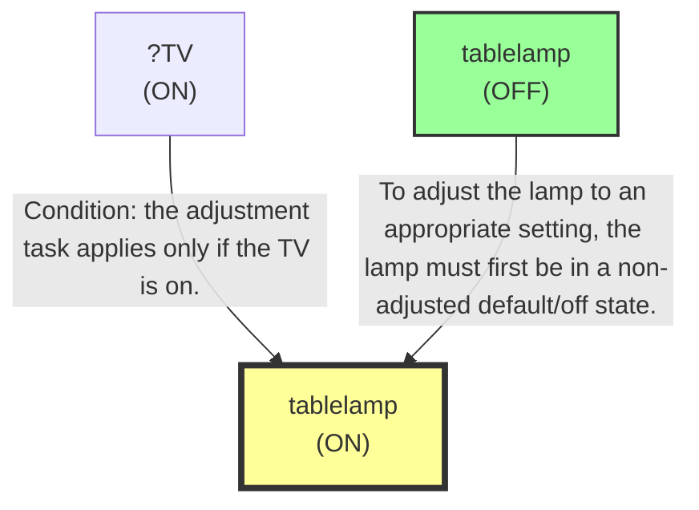

# 🚀 VirtualHome Agent Episode Log


### [GoalReasoner (Module A - Intent)] Output
```json
{
  "is_instruction_obviously_vague": true,
  "clarification_question": "What exact setting should the table lamp be adjusted to?",
  "target_object": "table lamp",
  "location_hint": null,
  "reasoning_chain": [
    {
      "question": "Why does the user want this object?",
      "answer": "To adjust the lighting in response to the TV being on."
    },
    {
      "question": "Why is that important?",
      "answer": "To create the desired viewing environment or comfort level."
    },
    {
      "question": "What fundamental need does this fulfill?",
      "answer": "The user wants to illuminate a space appropriately."
    },
    {
      "question": "Are there any deeper psychological or physical motivations?",
      "answer": "The user likely wants to reduce glare, improve ambiance, or make the room more comfortable for viewing."
    }
  ],
  "deep_intent": "The user wants to illuminate a space appropriately for comfort or viewing.",
  "acceptable_alternatives_properties": [
    {
      "priority": 1,
      "description": "Other indoor light sources that can be adjusted for brightness, such as a floor lamp or desk lamp"
    },
    {
      "priority": 2,
      "description": "Other adjustable room lighting fixtures with similar brightness control"
    },
    {
      "priority": 3,
      "description": "Any nearby dimmable light source that can provide comfortable ambient lighting"
    },
    {
      "priority": 4,
      "description": "A different indoor light source that can help make the room more comfortable, such as turning on a ceiling light at low brightness"
    }
  ]
}
```

### [PerceptionFilter] Output
```json
{
  "reasoning": "The task is to adjust lighting for comfort/viewing with the TV on. The only explicitly required target object is the table lamp, and the SDG also requires the TV state condition. Because the intent allows alternative adjustable light sources, I should retain other indoor light fixtures that could serve as backups or alternatives: ceilinglamp and lightswitch for room lighting control.",
  "selected_classes": [
    "tablelamp",
    "ceilinglamp",
    "character",
    "lightswitch",
    "floor",
    "desk",
    "ceiling"
  ],
  "raw_class_count": 33
}
```

### [LLMExecutor] Output
```json
{
  "reasoning": "The task is to adjust the table lamp while the TV is on, but the current graph does not show any TV object, so the prerequisite N1 cannot yet be verified. Because clarification is forbidden and there is no explicit TV in view, the best autonomous next step is to search the room by moving to the most relevant light fixture we do see. The table lamp is the target object for the adjustment task, and both instances are OFF; I will approach one to inspect/operate it next.",
  "satisfied_nodes": [
    "N3"
  ],
  "current_node_focus": "N2",
  "mapped_variables": {
    "?TV": "unknown",
    "tablelamp": "tablelamp(102)"
  },
  "action": "[walk] <tablelamp> (102)"
}
```

### [RoboStateMultiTaskController] Output
```json
{
  "action": "[walk] <tablelamp> (102)",
  "active_task_id": "task_1",
  "task_context": {
    "active_task_id": "task_1",
    "pending_task_ids": [],
    "satisfied_task_ids": []
  },
  "source": "llm_executor"
}
```
## Step 0
- **Action**: `[walk] <tablelamp> (102)`
- **Action Success**: `True`
- **Action Message**: {'0': {'message': 'Success'}}
- **Active Task**: `task_1`
- **Decision Source**: `llm_executor`
- **Task Progress**: T5_G2_06_B0=pending
- **SDG Status**:

- **Observed Items (28)**: floor(74), floor(75), floor(76), floor(77), floor(78), floor(79), floor(80), floor(81), floor(82), ceiling(92), ceiling(93), ceiling(94), ceiling(95), ceiling(96), ceiling(97)...


### [PerceptionFilter] Output
```json
{
  "reasoning": "Reused cached class selection.",
  "selected_classes": [
    "tablelamp",
    "ceilinglamp",
    "character",
    "lightswitch",
    "floor",
    "desk",
    "ceiling"
  ],
  "raw_class_count": 33
}
```

### [LLMExecutor] Output
```json
{
  "reasoning": "The goal is ambiguous, but clarification is forbidden. The SDG shows the lamp should transition from OFF to ON, and the current graph shows tablelamp(102) is OFF and already close to the character, so the next autonomous step is to switch it on. The TV condition is not represented in the current graph, but the closest actionable progress toward the goal is to satisfy N2 by turning the table lamp on.",
  "satisfied_nodes": [
    "N3"
  ],
  "current_node_focus": "N2",
  "mapped_variables": {
    "?TV": "unknown",
    "tablelamp": "tablelamp(102)"
  },
  "action": "[switchon] <tablelamp> (102)"
}
```

### [RoboStateMultiTaskController] Output
```json
{
  "action": "[switchon] <tablelamp> (102)",
  "active_task_id": "task_1",
  "task_context": {
    "active_task_id": "task_1",
    "pending_task_ids": [],
    "satisfied_task_ids": []
  },
  "source": "llm_executor"
}
```
## Step 1
- **Action**: `[switchon] <tablelamp> (102)`
- **Action Success**: `True`
- **Action Message**: Faked switch operation in Python layer (bypassed Unity failure)
- **Active Task**: `task_1`
- **Decision Source**: `llm_executor`
- **Task Progress**: T5_G2_06_B0=done
- **SDG Status**:

- **Observed Items (28)**: floor(74), floor(75), floor(76), floor(77), floor(78), floor(79), floor(80), floor(81), floor(82), ceiling(92), ceiling(93), ceiling(94), ceiling(95), ceiling(96), ceiling(97)...

