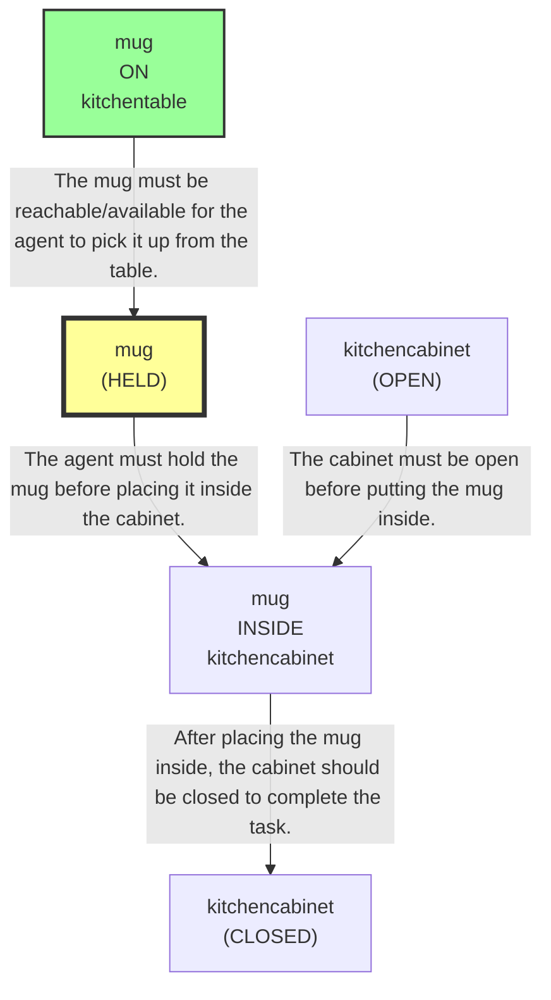
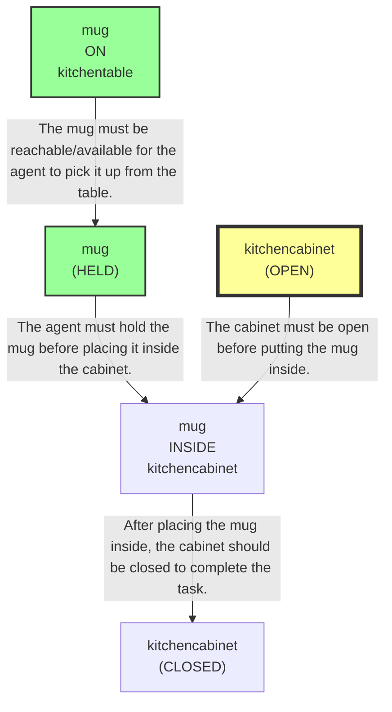
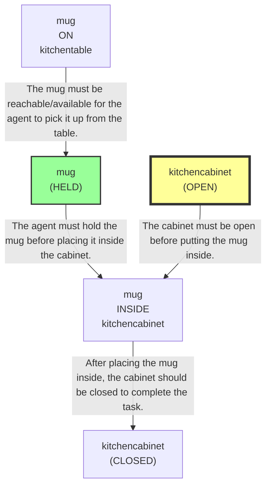
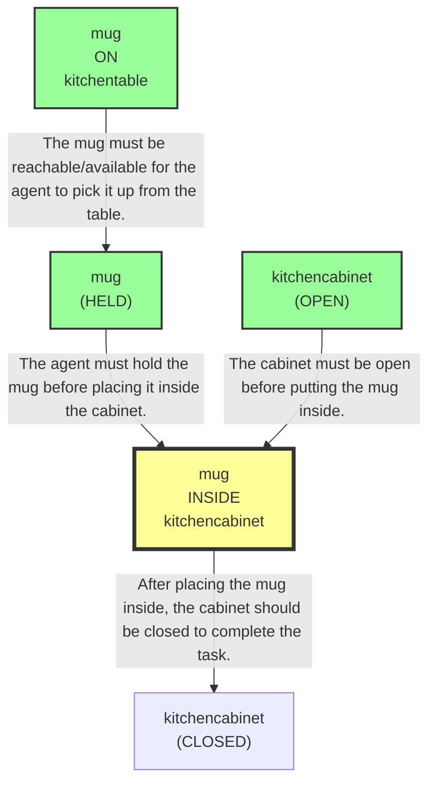

# 🚀 VirtualHome Agent Episode Log


### [GoalReasoner (Module A - Intent)] Output
```json
{
  "is_instruction_obviously_vague": true,
  "clarification_question": "Where should I put the mug?",
  "target_object": "mug",
  "location_hint": "table",
  "reasoning_chain": [
    {
      "question": "Why does the user want this object?",
      "answer": "To have the mug moved from the table."
    },
    {
      "question": "Why is that important?",
      "answer": "The user wants it returned to its intended place."
    },
    {
      "question": "What fundamental need does this fulfill?",
      "answer": "It fulfills the need to restore order by placing an item in a designated storage location."
    },
    {
      "question": "Are there any deeper psychological or physical motivations?",
      "answer": "The motivation is likely to keep the space tidy and organized."
    }
  ],
  "deep_intent": "Restore organization by returning an item to its designated place",
  "acceptable_alternatives_properties": [
    {
      "priority": 1,
      "description": "Other drinkware or similar table items that are currently out of place and need to be put back in their designated storage location"
    },
    {
      "priority": 2,
      "description": "Other small kitchen or household items that belong on a shelf, in a cabinet, or in a sink area"
    },
    {
      "priority": 3,
      "description": "Loose household objects that can be tidied away to reduce clutter"
    },
    {
      "priority": 4,
      "description": "Any small portable item that is currently misplaced and needs to be returned to its proper storage spot"
    }
  ]
}
```

### [RoboStateMultiTaskController] Output
```json
{
  "action": "[ask] Where should I put the mug?",
  "active_task_id": "task_1",
  "task_context": {
    "active_task_id": "task_1",
    "pending_task_ids": [],
    "satisfied_task_ids": []
  },
  "source": "goal_reasoner_clarification"
}
```
## Step 0
- **Action**: `[ask] Where should I put the mug?`
- **Action Success**: `True`
- **Action Message**: Inside a kitchen cabinet.
- **Active Task**: `task_1`
- **Decision Source**: `goal_reasoner_clarification`
- **Task Progress**: T5_G2_07_B1=pending
- **SDG Status**:
No SDG active.
- **Observed Items (113)**: floor(206), floor(207), floor(208), floor(209), floor(210), floor(211), wall(212), wall(213), wall(214), wall(215), wall(216), wall(217), ceiling(218), ceiling(219), ceiling(220)...


### [GoalReasoner (Module A - Intent)] Output
```json
{
  "is_instruction_obviously_vague": false,
  "clarification_question": null,
  "target_object": "mug",
  "location_hint": "on the table",
  "reasoning_chain": [
    {
      "question": "Why does the user want this object?",
      "answer": "To have the mug moved from the table into storage."
    },
    {
      "question": "Why is that important?",
      "answer": "To clear the mug from the table and place it in a kitchen storage location."
    },
    {
      "question": "What fundamental need does this fulfill?",
      "answer": "The user wants to organize or store an item in a designated household place."
    },
    {
      "question": "Are there any deeper psychological or physical motivations?",
      "answer": "Likely to reduce clutter, keep the mug accessible for later use, or maintain an orderly kitchen space."
    }
  ],
  "deep_intent": "The user wants to organize and store a household item in a kitchen storage area.",
  "acceptable_alternatives_properties": [
    {
      "priority": 1,
      "description": "Other drinkware or small kitchen items that can be stored in the same cabinet, such as a cup or glass"
    },
    {
      "priority": 2,
      "description": "Other small kitchen containers or utensils that belong in cabinet storage, such as bowls or plates"
    },
    {
      "priority": 3,
      "description": "Other household items that can be neatly stored away in indoor storage spaces"
    },
    {
      "priority": 4,
      "description": "Any small portable item that can be put away to reduce clutter, if the specific kitchen item is unavailable"
    }
  ]
}
```

### [PerceptionFilter] Output
```json
{
  "reasoning": "Needed objects are the target mug, the table it is on, and the kitchen cabinet for storage. The cabinet must be retained because it is the destination and must be opened/closed. No additional tools are required by the SDG.",
  "selected_classes": [
    "kitchencabinet",
    "door",
    "character",
    "plate",
    "kitchentable",
    "mug"
  ],
  "raw_class_count": 55
}
```

### [LLMExecutor] Output
```json
{
  "reasoning": "The mug is currently on the kitchentable and already reachable: character(1) is CLOSE to kitchentable(231), and mug(194) is ON that table. The next required SDG node is to hold the mug (N2), which is the prerequisite for placing it into the cabinet. The cabinet is closed, but opening it should come after the mug is in hand. I will grab the mug now.",
  "satisfied_nodes": [
    "N1"
  ],
  "current_node_focus": "N2",
  "mapped_variables": {
    "?Container": "kitchencabinet(234)"
  },
  "action": "[grab] <mug> (194)"
}
```

### [RoboStateMultiTaskController] Output
```json
{
  "action": "[walk] <mug> (194)",
  "active_task_id": "task_1",
  "task_context": {
    "active_task_id": "task_1",
    "pending_task_ids": [],
    "satisfied_task_ids": []
  },
  "source": "llm_executor_repaired"
}
```
## Step 1
- **Action**: `[walk] <mug> (194)`
- **Action Success**: `True`
- **Action Message**: {'0': {'message': 'Success'}}
- **Active Task**: `task_1`
- **Decision Source**: `llm_executor_repaired`
- **Task Progress**: T5_G2_07_B1=pending
- **SDG Status**:

- **Observed Items (16)**: door(224) [OPEN], kitchentable(231), kitchencabinet(234) [CLOSED], kitchencabinet(235) [CLOSED], kitchencabinet(236) [CLOSED], kitchencabinet(237) [CLOSED], plate(273), plate(277), plate(278), plate(285), mug(194), character(1), bathroom(11), bedroom(73), kitchen(205)...


### [PerceptionFilter] Output
```json
{
  "reasoning": "Reused cached class selection.",
  "selected_classes": [
    "kitchencabinet",
    "door",
    "character",
    "plate",
    "kitchentable",
    "mug"
  ],
  "raw_class_count": 55
}
```

### [LLMExecutor] Output
```json
{
  "reasoning": "The mug goal is partially progressed: the mug is currently on the kitchen table and close to the character, so N1 is satisfied. The next required step is to hold the mug before it can be placed into an open cabinet. Since the historical mug ID 194 is still present and matches the target object, I should grab it now.",
  "satisfied_nodes": [
    "N1"
  ],
  "current_node_focus": "N2",
  "mapped_variables": {
    "?Container": "kitchencabinet(234)"
  },
  "action": "[grab] <mug> (194)"
}
```

### [RoboStateMultiTaskController] Output
```json
{
  "action": "[grab] <mug> (194)",
  "active_task_id": "task_1",
  "task_context": {
    "active_task_id": "task_1",
    "pending_task_ids": [],
    "satisfied_task_ids": []
  },
  "source": "llm_executor"
}
```
## Step 2
- **Action**: `[grab] <mug> (194)`
- **Action Success**: `True`
- **Action Message**: {'0': {'message': 'Success'}}
- **Active Task**: `task_1`
- **Decision Source**: `llm_executor`
- **Task Progress**: T5_G2_07_B1=pending
- **SDG Status**:

- **Observed Items (16)**: door(224) [OPEN], kitchentable(231), kitchencabinet(234) [CLOSED], kitchencabinet(235) [CLOSED], kitchencabinet(236) [CLOSED], kitchencabinet(237) [CLOSED], plate(273), plate(277), plate(278), plate(285), mug(194), character(1), bathroom(11), bedroom(73), kitchen(205)...


### [PerceptionFilter] Output
```json
{
  "reasoning": "Reused cached class selection.",
  "selected_classes": [
    "kitchencabinet",
    "door",
    "character",
    "plate",
    "kitchentable",
    "mug"
  ],
  "raw_class_count": 55
}
```

### [LLMExecutor] Output
```json
{
  "reasoning": "The mug is already held, satisfying N2. The cabinet that is closest and relevant is kitchencabinet(234), which is currently CLOSED, so the next required step toward placing the mug inside is to open that cabinet. I should not put the mug in yet because N4 must be satisfied first.",
  "satisfied_nodes": [
    "N1",
    "N2"
  ],
  "current_node_focus": "N4",
  "mapped_variables": {
    "?Container": "kitchencabinet(234)"
  },
  "action": "[open] <kitchencabinet> (234)"
}
```

### [RoboStateMultiTaskController] Output
```json
{
  "action": "[walk] <kitchencabinet> (234)",
  "active_task_id": "task_1",
  "task_context": {
    "active_task_id": "task_1",
    "pending_task_ids": [],
    "satisfied_task_ids": []
  },
  "source": "llm_executor_repaired"
}
```
## Step 3
- **Action**: `[walk] <kitchencabinet> (234)`
- **Action Success**: `True`
- **Action Message**: {'0': {'message': 'Success'}}
- **Active Task**: `task_1`
- **Decision Source**: `llm_executor_repaired`
- **Task Progress**: T5_G2_07_B1=pending
- **SDG Status**:

- **Observed Items (16)**: door(224) [OPEN], kitchentable(231), kitchencabinet(234) [CLOSED], kitchencabinet(235) [CLOSED], kitchencabinet(236) [CLOSED], kitchencabinet(237) [CLOSED], plate(273), plate(277), plate(278), plate(285), mug(194), character(1), bathroom(11), bedroom(73), kitchen(205)...


### [PerceptionFilter] Output
```json
{
  "reasoning": "Reused cached class selection.",
  "selected_classes": [
    "kitchencabinet",
    "door",
    "character",
    "plate",
    "kitchentable",
    "mug"
  ],
  "raw_class_count": 55
}
```

### [LLMExecutor] Output
```json
{
  "reasoning": "The mug is already held in the right hand, and I am currently close to the kitchen cabinet. The cabinet is identified as kitchencabinet(234) and is closed, so the next required step toward placing the mug inside is to open this cabinet. This advances from N2 toward N4/N3; the mug is not yet inside the cabinet and the final close step must wait until after placement.",
  "satisfied_nodes": [
    "N2"
  ],
  "current_node_focus": "N4",
  "mapped_variables": {
    "?Container": "kitchencabinet(234)"
  },
  "action": "[open] <kitchencabinet> (234)"
}
```

### [RoboStateMultiTaskController] Output
```json
{
  "action": "[open] <kitchencabinet> (234)",
  "active_task_id": "task_1",
  "task_context": {
    "active_task_id": "task_1",
    "pending_task_ids": [],
    "satisfied_task_ids": []
  },
  "source": "llm_executor"
}
```
## Step 4
- **Action**: `[open] <kitchencabinet> (234)`
- **Action Success**: `True`
- **Action Message**: {'0': {'message': 'Success'}}
- **Active Task**: `task_1`
- **Decision Source**: `llm_executor`
- **Task Progress**: T5_G2_07_B1=pending
- **SDG Status**:

- **Observed Items (16)**: door(224) [OPEN], kitchentable(231), kitchencabinet(234) [CLOSED], kitchencabinet(235) [CLOSED], kitchencabinet(236) [CLOSED], kitchencabinet(237) [CLOSED], plate(273), plate(277), plate(278), plate(285), mug(194), character(1), bathroom(11), bedroom(73), kitchen(205)...


### [PerceptionFilter] Output
```json
{
  "reasoning": "Reused cached class selection.",
  "selected_classes": [
    "kitchencabinet",
    "door",
    "character",
    "plate",
    "kitchentable",
    "mug"
  ],
  "raw_class_count": 55
}
```

### [LLMExecutor] Output
```json
{
  "reasoning": "The mug is already held in the right hand, and the target cabinet is currently open. The remaining gap toward the final goal is to place the held mug inside the open kitchen cabinet. Since put-in actions require being near the destination, and we are already close to the cabinet per the current graph, the next atomic step is to put the mug into the cabinet.",
  "satisfied_nodes": [
    "N1",
    "N2",
    "N4"
  ],
  "current_node_focus": "N3",
  "mapped_variables": {
    "?Container": "kitchencabinet(234)"
  },
  "action": "[putin] <mug> (194) <kitchencabinet> (234)"
}
```

### [RoboStateMultiTaskController] Output
```json
{
  "action": "[putin] <mug> (194) <kitchencabinet> (234)",
  "active_task_id": "task_1",
  "task_context": {
    "active_task_id": "task_1",
    "pending_task_ids": [],
    "satisfied_task_ids": []
  },
  "source": "llm_executor"
}
```
## Step 5
- **Action**: `[putin] <mug> (194) <kitchencabinet> (234)`
- **Action Success**: `True`
- **Action Message**: {'0': {'message': 'Success'}}
- **Active Task**: `task_1`
- **Decision Source**: `llm_executor`
- **Task Progress**: T5_G2_07_B1=done
- **SDG Status**:

- **Observed Items (16)**: door(224) [OPEN], kitchentable(231), kitchencabinet(234) [OPEN], kitchencabinet(235) [CLOSED], kitchencabinet(236) [CLOSED], kitchencabinet(237) [CLOSED], plate(273), plate(277), plate(278), plate(285), mug(194), character(1), bathroom(11), bedroom(73), kitchen(205)...

