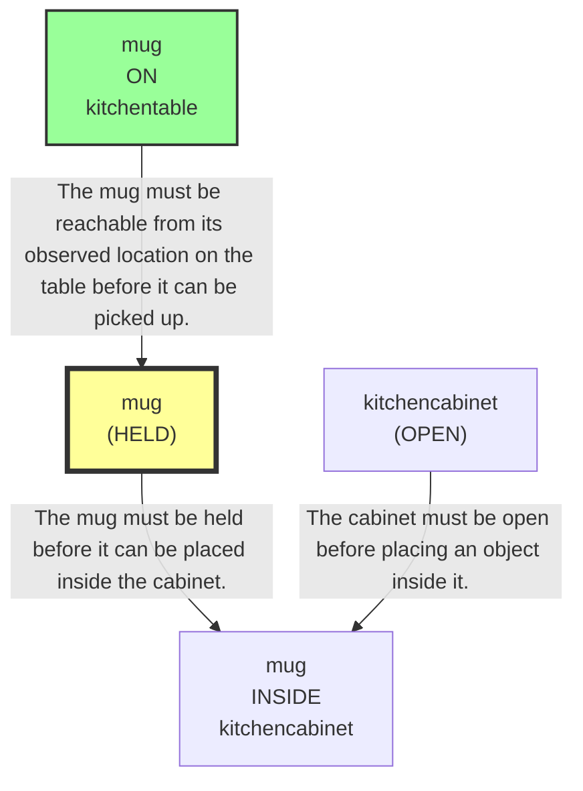
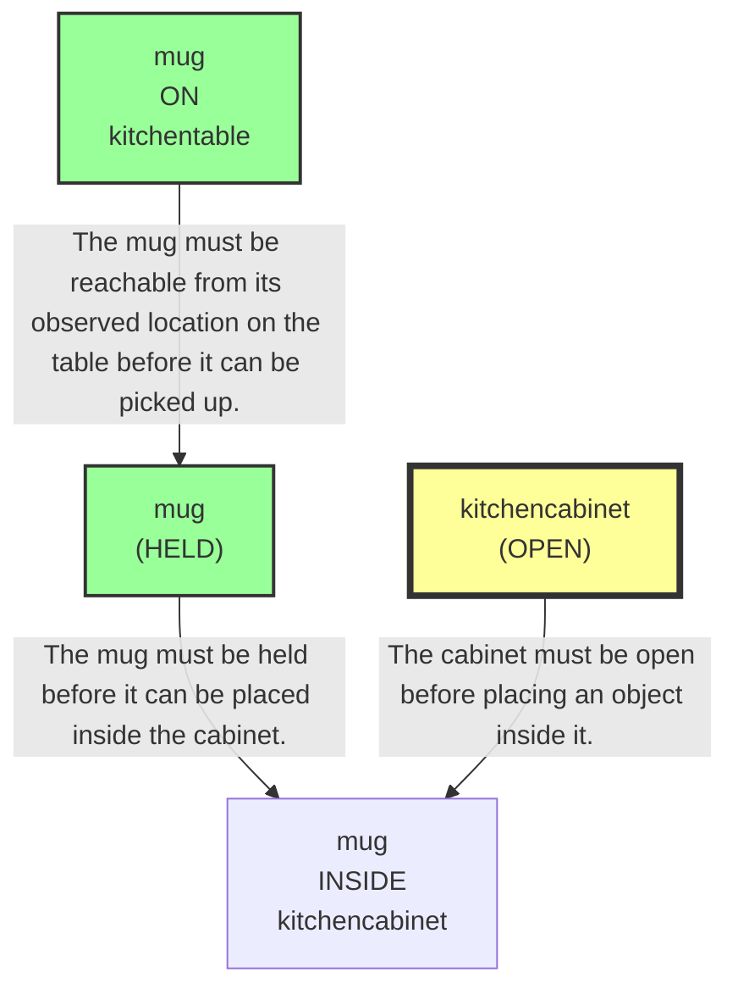
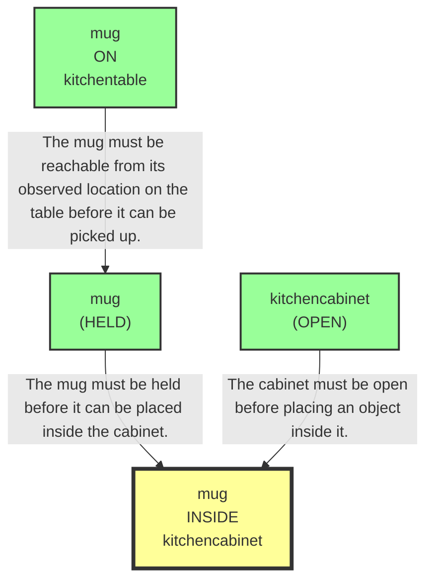

# 🚀 VirtualHome Agent Episode Log


### [GoalReasoner (Module A - Intent)] Output
```json
{
  "is_instruction_obviously_vague": true,
  "clarification_question": "Where should I put the mug?",
  "target_object": "mug",
  "location_hint": "on the table",
  "reasoning_chain": [
    {
      "question": "Why does the user want this object?",
      "answer": "To have the mug moved from the table to its intended place."
    },
    {
      "question": "Why is that important?",
      "answer": "Because they want the mug relocated to a correct destination rather than left on the table."
    },
    {
      "question": "What fundamental need does this fulfill?",
      "answer": "It fulfills the need to organize or restore the mug to its designated location."
    },
    {
      "question": "Are there any deeper psychological or physical motivations?",
      "answer": "Possibly to reduce clutter, keep the space tidy, or ensure the mug is stored or used correctly."
    }
  ],
  "deep_intent": "The user wants an item moved to its intended storage or use location.",
  "acceptable_alternatives_properties": [
    {
      "priority": 1,
      "description": "Other small household items that can be returned to their designated place, such as a cup, bowl, or utensil"
    },
    {
      "priority": 2,
      "description": "Similar tabletop items that are commonly put away, such as dishes or drinkware"
    },
    {
      "priority": 3,
      "description": "Clutter items that are normally organized or stored in indoor spaces"
    },
    {
      "priority": 4,
      "description": "Any household object that can be tidied by moving it from a surface to its proper location"
    }
  ]
}
```

### [RoboStateMultiTaskController] Output
```json
{
  "action": "[ask] Where should I put the mug?",
  "active_task_id": "task_1",
  "task_context": {
    "active_task_id": "task_1",
    "pending_task_ids": [],
    "satisfied_task_ids": []
  },
  "source": "goal_reasoner_clarification"
}
```
## Step 0
- **Action**: `[ask] Where should I put the mug?`
- **Action Success**: `True`
- **Action Message**: Inside a kitchen cabinet.
- **Active Task**: `task_1`
- **Decision Source**: `goal_reasoner_clarification`
- **Task Progress**: T5_G2_07_B2=pending
- **SDG Status**:
No SDG active.
- **Observed Items (113)**: floor(206), floor(207), floor(208), floor(209), floor(210), floor(211), wall(212), wall(213), wall(214), wall(215), wall(216), wall(217), ceiling(218), ceiling(219), ceiling(220)...


### [GoalReasoner (Module A - Intent)] Output
```json
{
  "is_instruction_obviously_vague": false,
  "clarification_question": null,
  "target_object": "mug",
  "location_hint": "table",
  "reasoning_chain": [
    {
      "question": "Why does the user want this object?",
      "answer": "To move the mug from the table into storage."
    },
    {
      "question": "Why is that important?",
      "answer": "To place the mug in a designated indoor storage location."
    },
    {
      "question": "What fundamental need does this fulfill?",
      "answer": "To organize and store household items."
    },
    {
      "question": "Are there any deeper psychological or physical motivations?",
      "answer": "To reduce clutter and keep the space tidy and orderly."
    }
  ],
  "deep_intent": "The user wants to organize household items by storing a found object in an indoor cabinet.",
  "acceptable_alternatives_properties": [
    {
      "priority": 1,
      "description": "Other small drinkware or kitchen items that can be stored in a cabinet, such as a cup or glass."
    },
    {
      "priority": 2,
      "description": "Similar kitchenware or dining items that belong in cabinet storage, such as a bowl or plate."
    },
    {
      "priority": 3,
      "description": "Other small household items that can be neatly stored in an indoor cabinet or shelf."
    },
    {
      "priority": 4,
      "description": "Any comparable clutter item that can be put away to improve organization, such as a utensil or container."
    }
  ]
}
```

### [PerceptionFilter] Output
```json
{
  "reasoning": "The goal is to move the target mug from the kitchen table into an indoor kitchen cabinet, so we need the mug itself, the table it is on, and the cabinet that must be opened and used for storage. No other tools are required by the SDG.",
  "selected_classes": [
    "kitchencabinet",
    "kitchentable",
    "character",
    "mug",
    "plate",
    "door"
  ],
  "raw_class_count": 55
}
```

### [LLMExecutor] Output
```json
{
  "reasoning": "The mug is already on the kitchentable and is the target object. To eventually place it in the cabinet, the next prerequisite is to get close enough to pick it up. The cabinet is currently closed, but opening it can wait until after the mug is held. Since the table is the object's current location and I am already close to the table, the next atomic step is to walk to the mug/table to prepare for grabbing it.",
  "satisfied_nodes": [
    "N1"
  ],
  "current_node_focus": "N2",
  "mapped_variables": {
    "?Container": "kitchencabinet(234)"
  },
  "action": "[walk] <mug> (194)"
}
```

### [RoboStateMultiTaskController] Output
```json
{
  "action": "[walk] <mug> (194)",
  "active_task_id": "task_1",
  "task_context": {
    "active_task_id": "task_1",
    "pending_task_ids": [],
    "satisfied_task_ids": []
  },
  "source": "llm_executor"
}
```
## Step 1
- **Action**: `[walk] <mug> (194)`
- **Action Success**: `True`
- **Action Message**: {'0': {'message': 'Success'}}
- **Active Task**: `task_1`
- **Decision Source**: `llm_executor`
- **Task Progress**: T5_G2_07_B2=pending
- **SDG Status**:

- **Observed Items (16)**: door(224) [OPEN], kitchentable(231), kitchencabinet(234) [CLOSED], kitchencabinet(235) [CLOSED], kitchencabinet(236) [CLOSED], kitchencabinet(237) [CLOSED], plate(273), plate(277), plate(278), plate(285), mug(194), character(1), bathroom(11), bedroom(73), kitchen(205)...


### [PerceptionFilter] Output
```json
{
  "reasoning": "Reused cached class selection.",
  "selected_classes": [
    "kitchencabinet",
    "kitchentable",
    "character",
    "mug",
    "plate",
    "door"
  ],
  "raw_class_count": 55
}
```

### [LLMExecutor] Output
```json
{
  "reasoning": "The mug is already confirmed close and on the kitchen table, so the next unmet prerequisite is to pick it up. The cabinet is currently closed, but I cannot place the mug inside until it is held and the cabinet is opened. Current focus is therefore satisfying the HELD state for mug(194).",
  "satisfied_nodes": [
    "N1"
  ],
  "current_node_focus": "N2",
  "mapped_variables": {
    "?Container": "kitchencabinet(234)"
  },
  "action": "[grab] <mug> (194)"
}
```

### [RoboStateMultiTaskController] Output
```json
{
  "action": "[grab] <mug> (194)",
  "active_task_id": "task_1",
  "task_context": {
    "active_task_id": "task_1",
    "pending_task_ids": [],
    "satisfied_task_ids": []
  },
  "source": "llm_executor"
}
```
## Step 2
- **Action**: `[grab] <mug> (194)`
- **Action Success**: `True`
- **Action Message**: {'0': {'message': 'Success'}}
- **Active Task**: `task_1`
- **Decision Source**: `llm_executor`
- **Task Progress**: T5_G2_07_B2=pending
- **SDG Status**:

- **Observed Items (16)**: door(224) [OPEN], kitchentable(231), kitchencabinet(234) [CLOSED], kitchencabinet(235) [CLOSED], kitchencabinet(236) [CLOSED], kitchencabinet(237) [CLOSED], plate(273), plate(277), plate(278), plate(285), mug(194), character(1), bathroom(11), bedroom(73), kitchen(205)...


### [PerceptionFilter] Output
```json
{
  "reasoning": "Reused cached class selection.",
  "selected_classes": [
    "kitchencabinet",
    "kitchentable",
    "character",
    "mug",
    "plate",
    "door"
  ],
  "raw_class_count": 55
}
```

### [LLMExecutor] Output
```json
{
  "reasoning": "The mug is already held in the right hand, satisfying N2. The cabinet intended for storage is currently CLOSED, and placing the mug inside requires the cabinet to be open first. Since I cannot open a cabinet from across the room, the next step is to walk to the selected kitchen cabinet instance before opening it. Among the visible cabinets, kitchencabinet(234) is a valid closed cabinet target.",
  "satisfied_nodes": [
    "N1",
    "N2"
  ],
  "current_node_focus": "N3",
  "mapped_variables": {
    "?Cabinet": "kitchencabinet(234)"
  },
  "action": "[walk] <kitchencabinet> (234)"
}
```

### [RoboStateMultiTaskController] Output
```json
{
  "action": "[walk] <kitchencabinet> (234)",
  "active_task_id": "task_1",
  "task_context": {
    "active_task_id": "task_1",
    "pending_task_ids": [],
    "satisfied_task_ids": []
  },
  "source": "llm_executor"
}
```
## Step 3
- **Action**: `[walk] <kitchencabinet> (234)`
- **Action Success**: `True`
- **Action Message**: {'0': {'message': 'Success'}}
- **Active Task**: `task_1`
- **Decision Source**: `llm_executor`
- **Task Progress**: T5_G2_07_B2=pending
- **SDG Status**:

- **Observed Items (16)**: door(224) [OPEN], kitchentable(231), kitchencabinet(234) [CLOSED], kitchencabinet(235) [CLOSED], kitchencabinet(236) [CLOSED], kitchencabinet(237) [CLOSED], plate(273), plate(277), plate(278), plate(285), mug(194), character(1), bathroom(11), bedroom(73), kitchen(205)...


### [PerceptionFilter] Output
```json
{
  "reasoning": "Reused cached class selection.",
  "selected_classes": [
    "kitchencabinet",
    "kitchentable",
    "character",
    "mug",
    "plate",
    "door"
  ],
  "raw_class_count": 55
}
```

### [LLMExecutor] Output
```json
{
  "reasoning": "The mug is already held (N2 satisfied implicitly by character holding mug(194)), and we are already near the kitchencabinet. The remaining prerequisite for placing the mug inside is that the cabinet must be open; the current graph shows kitchencabinet(234) is CLOSED. I should open the nearby cabinet before attempting to put the mug inside. I will focus on satisfying N3 next.",
  "satisfied_nodes": [
    "N1",
    "N2"
  ],
  "current_node_focus": "N3",
  "mapped_variables": {
    "?Container": "kitchencabinet(234)"
  },
  "action": "[open] <kitchencabinet> (234)"
}
```

### [RoboStateMultiTaskController] Output
```json
{
  "action": "[open] <kitchencabinet> (234)",
  "active_task_id": "task_1",
  "task_context": {
    "active_task_id": "task_1",
    "pending_task_ids": [],
    "satisfied_task_ids": []
  },
  "source": "llm_executor"
}
```
## Step 4
- **Action**: `[open] <kitchencabinet> (234)`
- **Action Success**: `True`
- **Action Message**: {'0': {'message': 'Success'}}
- **Active Task**: `task_1`
- **Decision Source**: `llm_executor`
- **Task Progress**: T5_G2_07_B2=pending
- **SDG Status**:

- **Observed Items (16)**: door(224) [OPEN], kitchentable(231), kitchencabinet(234) [CLOSED], kitchencabinet(235) [CLOSED], kitchencabinet(236) [CLOSED], kitchencabinet(237) [CLOSED], plate(273), plate(277), plate(278), plate(285), mug(194), character(1), bathroom(11), bedroom(73), kitchen(205)...


### [PerceptionFilter] Output
```json
{
  "reasoning": "Reused cached class selection.",
  "selected_classes": [
    "kitchencabinet",
    "kitchentable",
    "character",
    "mug",
    "plate",
    "door"
  ],
  "raw_class_count": 55
}
```

### [LLMExecutor] Output
```json
{
  "reasoning": "The mug is already held and the intended kitchencabinet is open, so the remaining gap is to place the held mug into the cabinet. Per proximity and container rules, I must walk to the cabinet before putting it inside. The cabinet is already selected and open, so no further state change is needed before the placement step.",
  "satisfied_nodes": [
    "N1",
    "N2",
    "N3"
  ],
  "current_node_focus": "N4",
  "mapped_variables": {
    "?Container": "kitchencabinet(234)"
  },
  "action": "[walk] <kitchencabinet> (234)"
}
```

### [RoboStateMultiTaskController] Output
```json
{
  "action": "[walk] <kitchencabinet> (234)",
  "active_task_id": "task_1",
  "task_context": {
    "active_task_id": "task_1",
    "pending_task_ids": [],
    "satisfied_task_ids": []
  },
  "source": "llm_executor"
}
```
## Step 5
- **Action**: `[walk] <kitchencabinet> (234)`
- **Action Success**: `True`
- **Action Message**: {'0': {'message': 'Success'}}
- **Active Task**: `task_1`
- **Decision Source**: `llm_executor`
- **Task Progress**: T5_G2_07_B2=pending
- **SDG Status**:

- **Observed Items (16)**: door(224) [OPEN], kitchentable(231), kitchencabinet(234) [OPEN], kitchencabinet(235) [CLOSED], kitchencabinet(236) [CLOSED], kitchencabinet(237) [CLOSED], plate(273), plate(277), plate(278), plate(285), mug(194), character(1), bathroom(11), bedroom(73), kitchen(205)...


### [PerceptionFilter] Output
```json
{
  "reasoning": "Reused cached class selection.",
  "selected_classes": [
    "kitchencabinet",
    "kitchentable",
    "character",
    "mug",
    "plate",
    "door"
  ],
  "raw_class_count": 55
}
```

### [LLMExecutor] Output
```json
{
  "reasoning": "The mug is already held in the right hand, and the target cabinet kitchencabinet(234) is already open and we are close to it. The only remaining SDG node is to place the mug inside the open cabinet. Since putin requires holding the mug and being near the destination, the next atomic action is to put the mug into the open cabinet.",
  "satisfied_nodes": [
    "N1",
    "N2",
    "N3"
  ],
  "current_node_focus": "N4",
  "mapped_variables": {
    "?Container": "kitchencabinet(234)"
  },
  "action": "[putin] <mug> (194) <kitchencabinet> (234)"
}
```

### [RoboStateMultiTaskController] Output
```json
{
  "action": "[putin] <mug> (194) <kitchencabinet> (234)",
  "active_task_id": "task_1",
  "task_context": {
    "active_task_id": "task_1",
    "pending_task_ids": [],
    "satisfied_task_ids": []
  },
  "source": "llm_executor"
}
```
## Step 6
- **Action**: `[putin] <mug> (194) <kitchencabinet> (234)`
- **Action Success**: `True`
- **Action Message**: {'0': {'message': 'Success'}}
- **Active Task**: `task_1`
- **Decision Source**: `llm_executor`
- **Task Progress**: T5_G2_07_B2=done
- **SDG Status**:

- **Observed Items (16)**: door(224) [OPEN], kitchentable(231), kitchencabinet(234) [OPEN], kitchencabinet(235) [CLOSED], kitchencabinet(236) [CLOSED], kitchencabinet(237) [CLOSED], plate(273), plate(277), plate(278), plate(285), mug(194), character(1), bathroom(11), bedroom(73), kitchen(205)...

