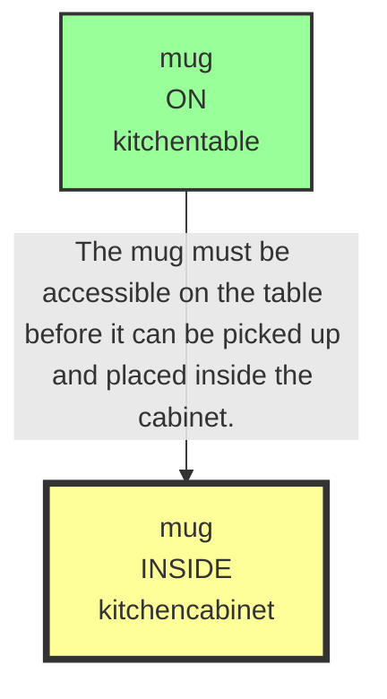
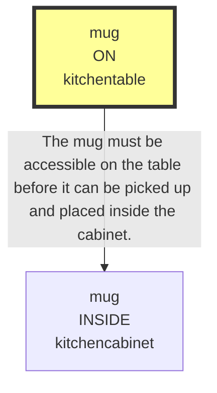

# 🚀 VirtualHome Agent Episode Log


### [GoalReasoner (Module A - Intent)] Output
```json
{
  "is_instruction_obviously_vague": true,
  "clarification_question": "Where exactly should I put the mug?",
  "target_object": "mug",
  "location_hint": "table",
  "reasoning_chain": [
    {
      "question": "Why does the user want this object?",
      "answer": "To relocate the mug from the table."
    },
    {
      "question": "Why is that important?",
      "answer": "Because the mug should be placed in its intended destination."
    },
    {
      "question": "What fundamental need does this fulfill?",
      "answer": "The user wants to organize the mug by putting it in the correct place."
    },
    {
      "question": "Are there any deeper psychological or physical motivations?",
      "answer": "The likely motivation is to restore order or clear the table, but the exact destination is not specified."
    }
  ],
  "deep_intent": "The user wants to organize an item by moving it to its correct location.",
  "acceptable_alternatives_properties": [
    {
      "priority": 1,
      "description": "Other similar drinking vessels or tabletop items that can be returned to the same destination"
    },
    {
      "priority": 2,
      "description": "Other small household items that belong in the same storage or use area"
    },
    {
      "priority": 3,
      "description": "General tabletop clutter that can be tidied by placing items in their designated spots"
    },
    {
      "priority": 4,
      "description": "Other objects that can help satisfy the broader need to clear and organize the surface"
    }
  ]
}
```

### [RoboStateMultiTaskController] Output
```json
{
  "action": "[ask] Where exactly should I put the mug?",
  "active_task_id": "task_1",
  "task_context": {
    "active_task_id": "task_1",
    "pending_task_ids": [],
    "satisfied_task_ids": []
  },
  "source": "goal_reasoner_clarification"
}
```
## Step 0
- **Action**: `[ask] Where exactly should I put the mug?`
- **Action Success**: `True`
- **Action Message**: Inside a kitchen cabinet.
- **Active Task**: `task_1`
- **Decision Source**: `goal_reasoner_clarification`
- **Task Progress**: T5_G2_07_B3=pending
- **SDG Status**:
No SDG active.
- **Observed Items (113)**: floor(206), floor(207), floor(208), floor(209), floor(210), floor(211), wall(212), wall(213), wall(214), wall(215), wall(216), wall(217), ceiling(218), ceiling(219), ceiling(220)...


### [GoalReasoner (Module A - Intent)] Output
```json
{
  "is_instruction_obviously_vague": false,
  "clarification_question": null,
  "target_object": "mug",
  "location_hint": "table",
  "reasoning_chain": [
    {
      "question": "Why does the user want this object?",
      "answer": "To have the mug moved from the table into storage."
    },
    {
      "question": "Why is that important?",
      "answer": "So the mug is no longer left out on the table and is kept in a cabinet."
    },
    {
      "question": "What fundamental need does this fulfill?",
      "answer": "The user wants the mug organized and stored in an indoor kitchen space."
    },
    {
      "question": "Are there any deeper psychological or physical motivations?",
      "answer": "This likely supports tidiness, clutter reduction, and keeping kitchen items put away."
    }
  ],
  "deep_intent": "The user wants an item organized and stored in an indoor kitchen cabinet.",
  "acceptable_alternatives_properties": [
    {
      "priority": 1,
      "description": "Other similar kitchen drinkware or small handled cups that can be stored in the same cabinet"
    },
    {
      "priority": 2,
      "description": "Other small kitchen items commonly stored in a cabinet, such as glasses or bowls"
    },
    {
      "priority": 3,
      "description": "Comparable household items that can be put away to reduce clutter, if the exact item is unavailable"
    },
    {
      "priority": 4,
      "description": "Any small indoor household object that can be safely stored in a cabinet as part of tidying up"
    }
  ]
}
```

### [PerceptionFilter] Output
```json
{
  "reasoning": "The goal is to move the mug from the kitchen table into the kitchen cabinet. So the minimum required classes are the target object itself plus the source and destination locations. No tools are needed for simply picking up and storing the mug.",
  "selected_classes": [
    "kitchencabinet",
    "kitchentable",
    "character",
    "mug",
    "door"
  ],
  "raw_class_count": 55
}
```

### [LLMExecutor] Output
```json
{
  "reasoning": "The mug is already on the kitchen table, satisfying N1. The next required step toward storing it in the cabinet is to move to the target cabinet before opening it and eventually placing the mug inside. Among the available cabinets, kitchencabinet(234) is a valid closed cabinet in the kitchen; I will walk to it first because proximity is required before open/putin actions.",
  "satisfied_nodes": [
    "N1"
  ],
  "current_node_focus": "N2",
  "mapped_variables": {
    "?Container": "kitchencabinet(234)"
  },
  "action": "[walk] <kitchencabinet> (234)"
}
```

### [RoboStateMultiTaskController] Output
```json
{
  "action": "[walk] <kitchencabinet> (234)",
  "active_task_id": "task_1",
  "task_context": {
    "active_task_id": "task_1",
    "pending_task_ids": [],
    "satisfied_task_ids": []
  },
  "source": "llm_executor"
}
```
## Step 1
- **Action**: `[walk] <kitchencabinet> (234)`
- **Action Success**: `True`
- **Action Message**: {'0': {'message': 'Success'}}
- **Active Task**: `task_1`
- **Decision Source**: `llm_executor`
- **Task Progress**: T5_G2_07_B3=pending
- **SDG Status**:

- **Observed Items (12)**: door(224) [OPEN], kitchentable(231), kitchencabinet(234) [CLOSED], kitchencabinet(235) [CLOSED], kitchencabinet(236) [CLOSED], kitchencabinet(237) [CLOSED], mug(194), character(1), bathroom(11), bedroom(73), kitchen(205), livingroom(335)


### [PerceptionFilter] Output
```json
{
  "reasoning": "Reused cached class selection.",
  "selected_classes": [
    "kitchencabinet",
    "kitchentable",
    "character",
    "mug",
    "door"
  ],
  "raw_class_count": 55
}
```

### [LLMExecutor] Output
```json
{
  "reasoning": "The mug required by N1 is already on the kitchen table, so the prerequisite accessibility condition is satisfied. The next unmet SDG node is N2: the mug must be inside a kitchen cabinet. Cabinet 234 is a valid nearby cabinet and is currently CLOSED, so I need to open it before I can place the mug inside. Since I already walked to cabinet 234 in the previous step, the single next atomic action is to open that cabinet.",
  "satisfied_nodes": [
    "N1"
  ],
  "current_node_focus": "N2",
  "mapped_variables": {
    "?Container": "kitchencabinet(234)"
  },
  "action": "[open] <kitchencabinet> (234)"
}
```

### [RoboStateMultiTaskController] Output
```json
{
  "action": "[open] <kitchencabinet> (234)",
  "active_task_id": "task_1",
  "task_context": {
    "active_task_id": "task_1",
    "pending_task_ids": [],
    "satisfied_task_ids": []
  },
  "source": "llm_executor"
}
```
## Step 2
- **Action**: `[open] <kitchencabinet> (234)`
- **Action Success**: `True`
- **Action Message**: {'0': {'message': 'Success'}}
- **Active Task**: `task_1`
- **Decision Source**: `llm_executor`
- **Task Progress**: T5_G2_07_B3=pending
- **SDG Status**:

- **Observed Items (12)**: door(224) [OPEN], kitchentable(231), kitchencabinet(234) [CLOSED], kitchencabinet(235) [CLOSED], kitchencabinet(236) [CLOSED], kitchencabinet(237) [CLOSED], mug(194), character(1), bathroom(11), bedroom(73), kitchen(205), livingroom(335)


### [PerceptionFilter] Output
```json
{
  "reasoning": "Reused cached class selection.",
  "selected_classes": [
    "kitchencabinet",
    "kitchentable",
    "character",
    "mug",
    "door"
  ],
  "raw_class_count": 55
}
```

### [LLMExecutor] Output
```json
{
  "reasoning": "The target mug is already satisfied for N1 because mug(194) is on the kitchentable(231), which matches the prerequisite. The next unsatisfied goal node is N2: the mug must be moved inside an open kitchencabinet. I am already close to the open cabinet kitchencabinet(234) from the previous step, but I am not holding the mug yet. Per the required sequence, the next atomic action is to walk to the mug so I can grab it next.",
  "satisfied_nodes": [
    "N1"
  ],
  "current_node_focus": "N2",
  "mapped_variables": {
    "?Container": "kitchencabinet(234)"
  },
  "action": "[walk] <mug> (194)"
}
```

### [RoboStateMultiTaskController] Output
```json
{
  "action": "[walk] <mug> (194)",
  "active_task_id": "task_1",
  "task_context": {
    "active_task_id": "task_1",
    "pending_task_ids": [],
    "satisfied_task_ids": []
  },
  "source": "llm_executor"
}
```
## Step 3
- **Action**: `[walk] <mug> (194)`
- **Action Success**: `True`
- **Action Message**: {'0': {'message': 'Success'}}
- **Active Task**: `task_1`
- **Decision Source**: `llm_executor`
- **Task Progress**: T5_G2_07_B3=pending
- **SDG Status**:

- **Observed Items (12)**: door(224) [OPEN], kitchentable(231), kitchencabinet(234) [OPEN], kitchencabinet(235) [CLOSED], kitchencabinet(236) [CLOSED], kitchencabinet(237) [CLOSED], mug(194), character(1), bathroom(11), bedroom(73), kitchen(205), livingroom(335)


### [PerceptionFilter] Output
```json
{
  "reasoning": "Reused cached class selection.",
  "selected_classes": [
    "kitchencabinet",
    "kitchentable",
    "character",
    "mug",
    "door"
  ],
  "raw_class_count": 55
}
```

### [LLMExecutor] Output
```json
{
  "reasoning": "The mug is currently accessible and already on the kitchen table, satisfying N1. The cabinet I opened is kitchencabinet(234), which is open and suitable for storing the mug. I am already close to both the mug and the table, but to place an item into a container I must first walk to the container destination explicitly. Next I should move to the open cabinet so I can put the mug inside it.",
  "satisfied_nodes": [
    "N1"
  ],
  "current_node_focus": "N2",
  "mapped_variables": {
    "?Container": "kitchencabinet(234)"
  },
  "action": "[walk] <kitchencabinet> (234)"
}
```

### [RoboStateMultiTaskController] Output
```json
{
  "action": "[walk] <kitchencabinet> (234)",
  "active_task_id": "task_1",
  "task_context": {
    "active_task_id": "task_1",
    "pending_task_ids": [],
    "satisfied_task_ids": []
  },
  "source": "llm_executor"
}
```
## Step 4
- **Action**: `[walk] <kitchencabinet> (234)`
- **Action Success**: `True`
- **Action Message**: {'0': {'message': 'Success'}}
- **Active Task**: `task_1`
- **Decision Source**: `llm_executor`
- **Task Progress**: T5_G2_07_B3=pending
- **SDG Status**:

- **Observed Items (12)**: door(224) [OPEN], kitchentable(231), kitchencabinet(234) [OPEN], kitchencabinet(235) [CLOSED], kitchencabinet(236) [CLOSED], kitchencabinet(237) [CLOSED], mug(194), character(1), bathroom(11), bedroom(73), kitchen(205), livingroom(335)


### [PerceptionFilter] Output
```json
{
  "reasoning": "Reused cached class selection.",
  "selected_classes": [
    "kitchencabinet",
    "kitchentable",
    "character",
    "mug",
    "door"
  ],
  "raw_class_count": 55
}
```

### [LLMExecutor] Output
```json
{
  "reasoning": "The mug is already satisfied on the kitchentable (N1). The cabinet target is open and the robot is close to cabinet 234, but the mug is on the table, so the next required step is to move to the mug before grabbing it. This follows the SDG progression: access mug on table first, then later place it in the open cabinet.",
  "satisfied_nodes": [
    "N1"
  ],
  "current_node_focus": "N1",
  "mapped_variables": {},
  "action": "[walk] <mug> (194)"
}
```

### [RoboStateMultiTaskController] Output
```json
{
  "action": "[walk] <mug> (194)",
  "active_task_id": "task_1",
  "task_context": {
    "active_task_id": "task_1",
    "pending_task_ids": [],
    "satisfied_task_ids": []
  },
  "source": "llm_executor"
}
```
## Step 5
- **Action**: `[walk] <mug> (194)`
- **Action Success**: `True`
- **Action Message**: {'0': {'message': 'Success'}}
- **Active Task**: `task_1`
- **Decision Source**: `llm_executor`
- **Task Progress**: T5_G2_07_B3=pending
- **SDG Status**:

- **Observed Items (12)**: door(224) [OPEN], kitchentable(231), kitchencabinet(234) [OPEN], kitchencabinet(235) [CLOSED], kitchencabinet(236) [CLOSED], kitchencabinet(237) [CLOSED], mug(194), character(1), bathroom(11), bedroom(73), kitchen(205), livingroom(335)


### [PerceptionFilter] Output
```json
{
  "reasoning": "Reused cached class selection.",
  "selected_classes": [
    "kitchencabinet",
    "kitchentable",
    "character",
    "mug",
    "door"
  ],
  "raw_class_count": 55
}
```

### [LLMExecutor] Output
```json
{
  "reasoning": "The mug is already accessible on the kitchen table and is close to the character, so the next step toward storing it in the cabinet is to pick it up. The target cabinet is already open, so after this grab the next logical action will be to walk to the cabinet and put it inside.",
  "satisfied_nodes": [
    "N1"
  ],
  "current_node_focus": "N2",
  "mapped_variables": {},
  "action": "[grab] <mug> (194)"
}
```

### [RoboStateMultiTaskController] Output
```json
{
  "action": "[grab] <mug> (194)",
  "active_task_id": "task_1",
  "task_context": {
    "active_task_id": "task_1",
    "pending_task_ids": [],
    "satisfied_task_ids": []
  },
  "source": "llm_executor"
}
```
## Step 6
- **Action**: `[grab] <mug> (194)`
- **Action Success**: `True`
- **Action Message**: {'0': {'message': 'Success'}}
- **Active Task**: `task_1`
- **Decision Source**: `llm_executor`
- **Task Progress**: T5_G2_07_B3=pending
- **SDG Status**:

- **Observed Items (12)**: door(224) [OPEN], kitchentable(231), kitchencabinet(234) [OPEN], kitchencabinet(235) [CLOSED], kitchencabinet(236) [CLOSED], kitchencabinet(237) [CLOSED], mug(194), character(1), bathroom(11), bedroom(73), kitchen(205), livingroom(335)


### [PerceptionFilter] Output
```json
{
  "reasoning": "Reused cached class selection.",
  "selected_classes": [
    "kitchencabinet",
    "kitchentable",
    "character",
    "mug",
    "door"
  ],
  "raw_class_count": 55
}
```

### [LLMExecutor] Output
```json
{
  "reasoning": "The mug is already picked up and the kitchen cabinet intended for storage is open and nearby. The remaining SDG goal is to place the held mug inside the kitchencabinet. Since putin requires being near the destination and holding the object, the next step is to walk to the open cabinet before putting the mug inside on the following action.",
  "satisfied_nodes": [
    "N1"
  ],
  "current_node_focus": "N2",
  "mapped_variables": {
    "?Container": "kitchencabinet(234)"
  },
  "action": "[walk] <kitchencabinet> (234)"
}
```

### [RoboStateMultiTaskController] Output
```json
{
  "action": "[walk] <kitchencabinet> (234)",
  "active_task_id": "task_1",
  "task_context": {
    "active_task_id": "task_1",
    "pending_task_ids": [],
    "satisfied_task_ids": []
  },
  "source": "llm_executor"
}
```
## Step 7
- **Action**: `[walk] <kitchencabinet> (234)`
- **Action Success**: `True`
- **Action Message**: {'0': {'message': 'Success'}}
- **Active Task**: `task_1`
- **Decision Source**: `llm_executor`
- **Task Progress**: T5_G2_07_B3=pending
- **SDG Status**:

- **Observed Items (12)**: door(224) [OPEN], kitchentable(231), kitchencabinet(234) [OPEN], kitchencabinet(235) [CLOSED], kitchencabinet(236) [CLOSED], kitchencabinet(237) [CLOSED], mug(194), character(1), bathroom(11), bedroom(73), kitchen(205), livingroom(335)


### [PerceptionFilter] Output
```json
{
  "reasoning": "Reused cached class selection.",
  "selected_classes": [
    "kitchencabinet",
    "kitchentable",
    "character",
    "mug",
    "door"
  ],
  "raw_class_count": 55
}
```

### [LLMExecutor] Output
```json
{
  "reasoning": "The mug is already grabbed and I am currently close to the open kitchen cabinet, which satisfies the proximity and container-open requirements for placing it inside. The final goal node N2 (mug inside kitchencabinet) is the remaining unsatisfied sink node, and this action directly progresses toward it.",
  "satisfied_nodes": [
    "N1"
  ],
  "current_node_focus": "N2",
  "mapped_variables": {
    "?Container": "kitchencabinet(234)"
  },
  "action": "[putin] <mug> (194) <kitchencabinet> (234)"
}
```

### [RoboStateMultiTaskController] Output
```json
{
  "action": "[putin] <mug> (194) <kitchencabinet> (234)",
  "active_task_id": "task_1",
  "task_context": {
    "active_task_id": "task_1",
    "pending_task_ids": [],
    "satisfied_task_ids": []
  },
  "source": "llm_executor"
}
```
## Step 8
- **Action**: `[putin] <mug> (194) <kitchencabinet> (234)`
- **Action Success**: `True`
- **Action Message**: {'0': {'message': 'Success'}}
- **Active Task**: `task_1`
- **Decision Source**: `llm_executor`
- **Task Progress**: T5_G2_07_B3=done
- **SDG Status**:

- **Observed Items (12)**: door(224) [OPEN], kitchentable(231), kitchencabinet(234) [OPEN], kitchencabinet(235) [CLOSED], kitchencabinet(236) [CLOSED], kitchencabinet(237) [CLOSED], mug(194), character(1), bathroom(11), bedroom(73), kitchen(205), livingroom(335)

