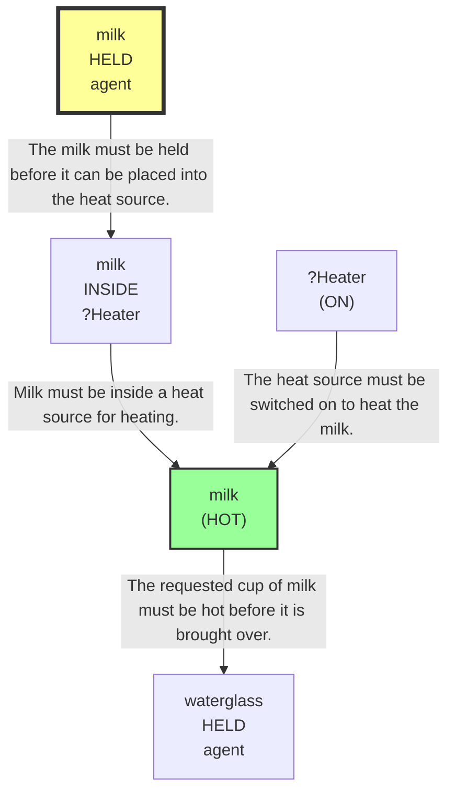

# 🚀 VirtualHome Agent Episode Log


### [GoalReasoner (Module A - Intent)] Output
```json
{
  "is_instruction_obviously_vague": true,
  "clarification_question": "What temperature should the milk be?",
  "target_object": "milk",
  "location_hint": null,
  "reasoning_chain": [
    {
      "question": "Why does the user want this object?",
      "answer": "To have a cup of milk to drink or use."
    },
    {
      "question": "Why is that important?",
      "answer": "They likely want to consume it in a way that is comfortable and suitable for immediate use."
    },
    {
      "question": "What fundamental need does this fulfill?",
      "answer": "It fulfills a drinking or nourishment need."
    },
    {
      "question": "Are there any deeper psychological or physical motivations?",
      "answer": "The user may be seeking refreshment, nutrition, or comfort through a drink at a preferred temperature."
    }
  ],
  "deep_intent": "The user wants to obtain a drink for nourishment or refreshment at a preferred temperature.",
  "acceptable_alternatives_properties": [
    {
      "priority": 1,
      "description": "Other drinkable dairy or non-dairy beverages that can be served at the same temperature preference"
    },
    {
      "priority": 2,
      "description": "Similar ready-to-drink beverages such as cream-based drinks or plant-based milk alternatives"
    },
    {
      "priority": 3,
      "description": "Any beverage that can be served warm or cold to match the requested drinking comfort"
    },
    {
      "priority": 4,
      "description": "Other fluids suitable for drinking, such as water or juice, if the main goal is refreshment"
    }
  ]
}
```

### [RoboStateMultiTaskController] Output
```json
{
  "action": "[ask] What temperature should the milk be?",
  "active_task_id": "task_1",
  "task_context": {
    "active_task_id": "task_1",
    "pending_task_ids": [],
    "satisfied_task_ids": []
  },
  "source": "goal_reasoner_clarification"
}
```
## Step 0
- **Action**: `[ask] What temperature should the milk be?`
- **Action Success**: `True`
- **Action Message**: Hot.
- **Active Task**: `task_1`
- **Decision Source**: `goal_reasoner_clarification`
- **Task Progress**: T5_G2_08_B1=pending
- **SDG Status**:
No SDG active.
- **Observed Items (159)**: wall(12), wall(13), wall(14), wall(15), wall(16), wall(17), wall(18), wall(19), wall(20), wall(21), floor(22), floor(23), floor(24), floor(25), floor(26)...


### [GoalReasoner (Module A - Intent)] Output
```json
{
  "is_instruction_obviously_vague": false,
  "clarification_question": null,
  "target_object": "milk",
  "location_hint": null,
  "reasoning_chain": [
    {
      "question": "Why does the user want this object?",
      "answer": "To obtain a drink they can consume."
    },
    {
      "question": "Why is that important?",
      "answer": "Because they likely want to ingest something to drink."
    },
    {
      "question": "What fundamental need does this fulfill?",
      "answer": "It fulfills the need to hydrate or consume a warm beverage."
    },
    {
      "question": "Are there any deeper psychological or physical motivations?",
      "answer": "The user may want comfort, nourishment, or to address thirst."
    }
  ],
  "deep_intent": "The user wants a warm beverage to drink.",
  "acceptable_alternatives_properties": [
    {
      "priority": 1,
      "description": "Other hot drinkable dairy or beverage options, such as warm milk, cocoa, or tea."
    },
    {
      "priority": 2,
      "description": "Other warm beverages that can be consumed from a cup, such as coffee or broth."
    },
    {
      "priority": 3,
      "description": "Any drinkable heated liquid that provides warmth and hydration."
    },
    {
      "priority": 4,
      "description": "Cold or room-temperature beverages if no hot drink is available and the goal is still to get a drink."
    }
  ]
}
```

### [PerceptionFilter] Output
```json
{
  "reasoning": "The goal is to obtain hot milk to drink. Required classes are the target milk, a heat source for warming it, and the held drinking vessel. To preserve functional backups, I keep all viable heating appliances visible: microwave, stove, coffeemaker, and candle. I also keep the drinking glass explicitly mentioned in the SDG.",
  "selected_classes": [
    "coffeemaker",
    "candle",
    "character",
    "microwave",
    "stove",
    "milk",
    "waterglass"
  ],
  "raw_class_count": 50
}
```

### [LLMExecutor] Output
```json
{
  "reasoning": "The goal is to end with hot milk held by the agent, and the filtered graph already contains a suitable hot milk instance: milk(177) with state HOT. The next unsatisfied prerequisite is N1 (milk held by agent). Since the milk is inside the kitchen and not currently held, I should first move adjacent to milk(177) before attempting to grab it. No heater interaction is needed yet because the milk is already hot, and the active graph does not show the heater object explicitly.",
  "satisfied_nodes": [
    "N4"
  ],
  "current_node_focus": "N1",
  "mapped_variables": {},
  "action": "[walk] <milk> (177)"
}
```

### [RoboStateMultiTaskController] Output
```json
{
  "action": "[walk] <milk> (177)",
  "active_task_id": "task_1",
  "task_context": {
    "active_task_id": "task_1",
    "pending_task_ids": [],
    "satisfied_task_ids": []
  },
  "source": "llm_executor"
}
```
## Step 1
- **Action**: `[walk] <milk> (177)`
- **Action Success**: `True`
- **Action Message**: {'0': {'message': 'Success'}}
- **Active Task**: `task_1`
- **Decision Source**: `llm_executor`
- **Task Progress**: T5_G2_08_B1=pending
- **SDG Status**:

- **Observed Items (20)**: waterglass(64), waterglass(71), waterglass(72), waterglass(79), waterglass(80), waterglass(87), waterglass(88), waterglass(100), candle(124) [OFF], stove(163) [OFF,CLOSED], coffeemaker(169) [OFF], microwave(171) [CLOSED,OFF], milk(176) [CLOSED,COLD], milk(177) [CLOSED,HOT], character(1)...


### [PerceptionFilter] Output
```json
{
  "reasoning": "Reused cached class selection.",
  "selected_classes": [
    "coffeemaker",
    "candle",
    "character",
    "microwave",
    "stove",
    "milk",
    "waterglass"
  ],
  "raw_class_count": 50
}
```

### [LLMExecutor] Output
```json
{
  "reasoning": "The active goal requires milk to be HELD, then placed into a heater and heated. In the current graph, milk(177) is already CLOSE to the character and is HOT, matching the target milk state. The next unmet prerequisite is holding the milk. Since I am already near it, the correct next atomic action is to grab milk(177). This also preserves the later goal of eventually obtaining the waterglass(64/79/80/100 close options are available) after the milk is hot.",
  "satisfied_nodes": [
    "N4"
  ],
  "current_node_focus": "N1",
  "mapped_variables": {},
  "action": "[grab] <milk> (177)"
}
```

### [RoboStateMultiTaskController] Output
```json
{
  "action": "[grab] <milk> (177)",
  "active_task_id": "task_1",
  "task_context": {
    "active_task_id": "task_1",
    "pending_task_ids": [],
    "satisfied_task_ids": []
  },
  "source": "llm_executor"
}
```
## Step 2
- **Action**: `[grab] <milk> (177)`
- **Action Success**: `True`
- **Action Message**: {'0': {'message': 'Success'}}
- **Active Task**: `task_1`
- **Decision Source**: `llm_executor`
- **Task Progress**: T5_G2_08_B1=done
- **SDG Status**:

- **Observed Items (20)**: waterglass(64), waterglass(71), waterglass(72), waterglass(79), waterglass(80), waterglass(87), waterglass(88), waterglass(100), candle(124) [OFF], stove(163) [OFF,CLOSED], coffeemaker(169) [OFF], microwave(171) [CLOSED,OFF], milk(176) [CLOSED,COLD], milk(177) [CLOSED,HOT], character(1)...

