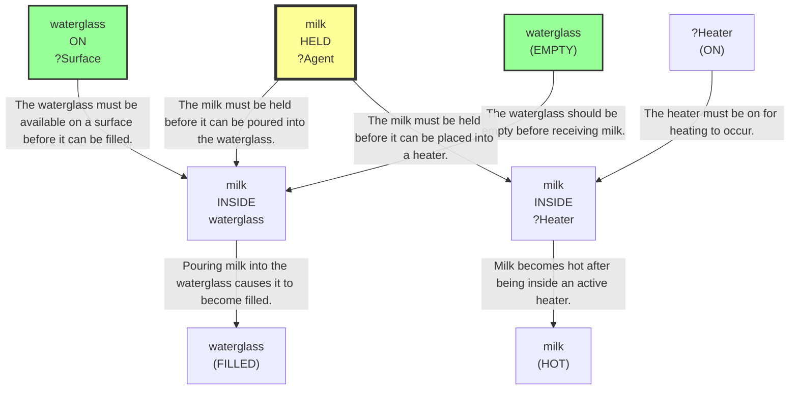
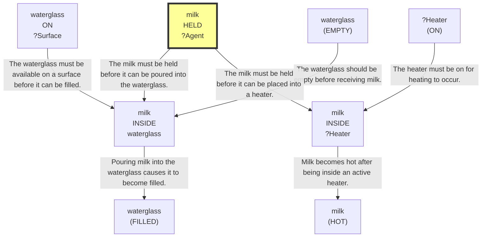

# 🚀 VirtualHome Agent Episode Log


### [GoalReasoner (Module A - Intent)] Output
```json
{
  "is_instruction_obviously_vague": true,
  "clarification_question": "What temperature should the cup of milk be brought at?",
  "target_object": "milk",
  "location_hint": null,
  "reasoning_chain": [
    {
      "question": "Why does the user want this object?",
      "answer": "To have milk in a cup available to them."
    },
    {
      "question": "Why is that important?",
      "answer": "They likely want to drink or use it as a beverage."
    },
    {
      "question": "What fundamental need does this fulfill?",
      "answer": "It fulfills a need for hydration or nourishment."
    },
    {
      "question": "Are there any deeper psychological or physical motivations?",
      "answer": "The user may be seeking comfort, refreshment, or routine consumption of a drink."
    }
  ],
  "deep_intent": "The user wants to obtain a drink at a specific temperature.",
  "acceptable_alternatives_properties": [
    {
      "priority": 1,
      "description": "Another drinkable dairy or non-dairy beverage that can be served in a cup at the same requested temperature."
    },
    {
      "priority": 2,
      "description": "A similar beverage such as water, juice, or tea that can be provided at the same temperature."
    },
    {
      "priority": 3,
      "description": "Any ready-to-drink beverage available indoors that can satisfy thirst."
    },
    {
      "priority": 4,
      "description": "Another comforting or hydrating beverage, even if it is not dairy-based."
    }
  ]
}
```

### [RoboStateMultiTaskController] Output
```json
{
  "action": "[ask] What temperature should the cup of milk be brought at?",
  "active_task_id": "task_1",
  "task_context": {
    "active_task_id": "task_1",
    "pending_task_ids": [],
    "satisfied_task_ids": []
  },
  "source": "goal_reasoner_clarification"
}
```
## Step 0
- **Action**: `[ask] What temperature should the cup of milk be brought at?`
- **Action Success**: `True`
- **Action Message**: Hot.
- **Active Task**: `task_1`
- **Decision Source**: `goal_reasoner_clarification`
- **Task Progress**: T5_G2_08_B2=pending
- **SDG Status**:
No SDG active.
- **Observed Items (159)**: wall(12), wall(13), wall(14), wall(15), wall(16), wall(17), wall(18), wall(19), wall(20), wall(21), floor(22), floor(23), floor(24), floor(25), floor(26)...


### [GoalReasoner (Module A - Intent)] Output
```json
{
  "is_instruction_obviously_vague": false,
  "clarification_question": null,
  "target_object": "milk",
  "location_hint": null,
  "reasoning_chain": [
    {
      "question": "Why does the user want this object?",
      "answer": "To obtain a cup of milk."
    },
    {
      "question": "Why is that important?",
      "answer": "The user likely wants to drink it or use it as a beverage ingredient."
    },
    {
      "question": "What fundamental need does this fulfill?",
      "answer": "It helps provide hydration and nourishment."
    },
    {
      "question": "Are there any deeper psychological or physical motivations?",
      "answer": "It may be for comfort, taste preference, or to meet a dietary need such as hunger relief or a warm drink desire."
    }
  ],
  "deep_intent": "The user wants to consume a warm beverage for comfort, hydration, or nourishment.",
  "acceptable_alternatives_properties": [
    {
      "priority": 1,
      "description": "Other ready-to-drink warm beverages, such as tea, hot cocoa, or warm milk substitutes."
    },
    {
      "priority": 2,
      "description": "Milk-based or dairy-like warm drinks with similar taste and texture."
    },
    {
      "priority": 3,
      "description": "Other warm beverages that can provide comfort and hydration, such as broth or coffee with milk."
    },
    {
      "priority": 4,
      "description": "Any warm drink that can satisfy the desire for a hot beverage, even if it is not milk-based."
    }
  ]
}
```

### [PerceptionFilter] Output
```json
{
  "reasoning": "Needed objects are the target milk, the waterglass required by the SDG, and the possible heating appliances that can serve as ?Heater. To satisfy the warm beverage goal while keeping backups, I retain all plausible heating tools visible: microwave, stove, coffeemaker, and fridge as the likely source/storage for milk.",
  "selected_classes": [
    "milk",
    "waterglass",
    "coffeemaker",
    "microwave",
    "character",
    "stove",
    "fridge"
  ],
  "raw_class_count": 50
}
```

### [LLMExecutor] Output
```json
{
  "reasoning": "The current goal requires holding milk, but no milk is currently held. In the graph, milk(177) is already HOT and closed, making it the best match for the target milk and the final hot-beverage requirement. Since it is inside the kitchen and no proximity to the specific milk is guaranteed yet, the next atomic step should be to walk to that milk before grabbing it.",
  "satisfied_nodes": [
    "N2",
    "N3"
  ],
  "current_node_focus": "N1",
  "mapped_variables": {
    "?Heater": "microwave(171)"
  },
  "action": "[walk] <milk> (177)"
}
```

### [RoboStateMultiTaskController] Output
```json
{
  "action": "[walk] <milk> (177)",
  "active_task_id": "task_1",
  "task_context": {
    "active_task_id": "task_1",
    "pending_task_ids": [],
    "satisfied_task_ids": []
  },
  "source": "llm_executor"
}
```
## Step 1
- **Action**: `[walk] <milk> (177)`
- **Action Success**: `True`
- **Action Message**: {'0': {'message': 'Success'}}
- **Active Task**: `task_1`
- **Decision Source**: `llm_executor`
- **Task Progress**: T5_G2_08_B2=pending
- **SDG Status**:

- **Observed Items (20)**: waterglass(64), waterglass(71), waterglass(72), waterglass(79), waterglass(80), waterglass(87), waterglass(88), waterglass(100), fridge(162) [CLOSED], stove(163) [OFF,CLOSED], coffeemaker(169) [OFF], microwave(171) [CLOSED,OFF], milk(176) [CLOSED,COLD], milk(177) [HOT,CLOSED], character(1)...


### [PerceptionFilter] Output
```json
{
  "reasoning": "Reused cached class selection.",
  "selected_classes": [
    "milk",
    "waterglass",
    "coffeemaker",
    "microwave",
    "character",
    "stove",
    "fridge"
  ],
  "raw_class_count": 50
}
```

### [LLMExecutor] Output
```json
{
  "reasoning": "The milk is already rebound to a current object matching the goal state for warmth: milk(177) is HOT, CLOSE to the agent, and the prior walk to it succeeded. The remaining SDG gap is to hold the milk before it can be poured into a waterglass and later heated if needed. Since the user clarified they want it hot, keeping the already-hot milk aligns with the intent and allows progression toward the final held/poured state. I will grab the hot milk next.",
  "satisfied_nodes": [],
  "current_node_focus": "N1",
  "mapped_variables": {
    "?Heater": "stove(163)",
    "?Surface": "character-near surface / kitchen surface context",
    "?Washer": "sink(unknown)"
  },
  "action": "[grab] <milk> (177)"
}
```

### [RoboStateMultiTaskController] Output
```json
{
  "action": "[grab] <milk> (177)",
  "active_task_id": "task_1",
  "task_context": {
    "active_task_id": "task_1",
    "pending_task_ids": [],
    "satisfied_task_ids": []
  },
  "source": "llm_executor"
}
```
## Step 2
- **Action**: `[grab] <milk> (177)`
- **Action Success**: `True`
- **Action Message**: {'0': {'message': 'Success'}}
- **Active Task**: `task_1`
- **Decision Source**: `llm_executor`
- **Task Progress**: T5_G2_08_B2=done
- **SDG Status**:

- **Observed Items (20)**: waterglass(64), waterglass(71), waterglass(72), waterglass(79), waterglass(80), waterglass(87), waterglass(88), waterglass(100), fridge(162) [CLOSED], stove(163) [OFF,CLOSED], coffeemaker(169) [OFF], microwave(171) [CLOSED,OFF], milk(176) [CLOSED,COLD], milk(177) [HOT,CLOSED], character(1)...

