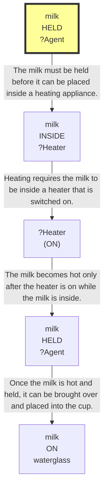

# 🚀 VirtualHome Agent Episode Log


### [GoalReasoner (Module A - Intent)] Output
```json
{
  "is_instruction_obviously_vague": true,
  "clarification_question": "What temperature should the cup of milk be?",
  "target_object": "milk",
  "location_hint": null,
  "reasoning_chain": [
    {
      "question": "Why does the user want this object?",
      "answer": "To have a cup of milk."
    },
    {
      "question": "Why is that important?",
      "answer": "To be able to drink or use the milk."
    },
    {
      "question": "What fundamental need does this fulfill?",
      "answer": "It fulfills a need for a beverage or food intake."
    },
    {
      "question": "Are there any deeper psychological or physical motivations?",
      "answer": "The primary motivation appears to be satisfying thirst, hunger, or a preference for milk at a specific temperature."
    }
  ],
  "deep_intent": "The user wants to obtain a drink at a specific temperature.",
  "acceptable_alternatives_properties": [
    {
      "priority": 1,
      "description": "Another cup of the same drink at the requested temperature"
    },
    {
      "priority": 2,
      "description": "A similar dairy or plant-based drink served at the requested temperature"
    },
    {
      "priority": 3,
      "description": "Other ready-to-drink beverages that can be served at the requested temperature"
    },
    {
      "priority": 4,
      "description": "A warm or cold household beverage that satisfies the same drinking need"
    }
  ]
}
```

### [RoboStateMultiTaskController] Output
```json
{
  "action": "[ask] What temperature should the cup of milk be?",
  "active_task_id": "task_1",
  "task_context": {
    "active_task_id": "task_1",
    "pending_task_ids": [],
    "satisfied_task_ids": []
  },
  "source": "goal_reasoner_clarification"
}
```
## Step 0
- **Action**: `[ask] What temperature should the cup of milk be?`
- **Action Success**: `True`
- **Action Message**: Hot.
- **Active Task**: `task_1`
- **Decision Source**: `goal_reasoner_clarification`
- **Task Progress**: T5_G2_08_B3=pending
- **SDG Status**:
No SDG active.
- **Observed Items (159)**: wall(12), wall(13), wall(14), wall(15), wall(16), wall(17), wall(18), wall(19), wall(20), wall(21), floor(22), floor(23), floor(24), floor(25), floor(26)...


### [GoalReasoner (Module A - Intent)] Output
```json
{
  "is_instruction_obviously_vague": false,
  "clarification_question": null,
  "target_object": "milk",
  "location_hint": null,
  "reasoning_chain": [
    {
      "question": "Why does the user want this object?",
      "answer": "To drink milk."
    },
    {
      "question": "Why is that important?",
      "answer": "To consume a warm beverage."
    },
    {
      "question": "What fundamental need does this fulfill?",
      "answer": "It fulfills the need to get a drink and potentially relieve thirst or provide comfort."
    },
    {
      "question": "Are there any deeper psychological or physical motivations?",
      "answer": "The user may want warmth, comfort, or a simple source of hydration and nourishment."
    }
  ],
  "deep_intent": "The user wants a warm drink to satisfy thirst and provide comfort.",
  "acceptable_alternatives_properties": [
    {
      "priority": 1,
      "description": "Other warm, ready-to-drink beverages such as tea, coffee, or hot chocolate"
    },
    {
      "priority": 2,
      "description": "Warm dairy-based drinks or similar milky beverages"
    },
    {
      "priority": 3,
      "description": "Other hot beverages that can provide comfort and hydration"
    },
    {
      "priority": 4,
      "description": "Warm liquids in general, such as broth or soup, if a beverage is acceptable"
    }
  ]
}
```

### [PerceptionFilter] Output
```json
{
  "reasoning": "The goal is to obtain hot milk and place it in a waterglass. The SDG requires the target object milk, a heater to warm it, and the receptacle waterglass. To satisfy the heating requirement while retaining functional alternatives, I keep both microwave and stove, and also the other visible heating appliance coffeemaker as a possible warm beverage tool aligned with the warm-drink intent.",
  "selected_classes": [
    "milk",
    "waterglass",
    "coffeemaker",
    "microwave",
    "character",
    "stove"
  ],
  "raw_class_count": 50
}
```

### [LLMExecutor] Output
```json
{
  "reasoning": "The goal requires the milk to be held first, then heated, then placed in the waterglass. In the current graph there are two milk instances: milk(176) is cold, while milk(177) is already HOT and still closed. Since the final task is to end with hot milk, milk(177) is the best binding for the target milk. It is inside the kitchen, and no proximity to the milk itself is explicitly shown, so the next step is to walk to the hot milk before grabbing it. This advances toward N1.",
  "satisfied_nodes": [],
  "current_node_focus": "N1",
  "mapped_variables": {
    "?Heater": "stove(163)",
    "?Agent": "character(1)",
    "milk": "milk(177)"
  },
  "action": "[walk] <milk> (177)"
}
```

### [RoboStateMultiTaskController] Output
```json
{
  "action": "[walk] <milk> (177)",
  "active_task_id": "task_1",
  "task_context": {
    "active_task_id": "task_1",
    "pending_task_ids": [],
    "satisfied_task_ids": []
  },
  "source": "llm_executor"
}
```
## Step 1
- **Action**: `[walk] <milk> (177)`
- **Action Success**: `True`
- **Action Message**: {'0': {'message': 'Success'}}
- **Active Task**: `task_1`
- **Decision Source**: `llm_executor`
- **Task Progress**: T5_G2_08_B3=pending
- **SDG Status**:

- **Observed Items (19)**: waterglass(64), waterglass(71), waterglass(72), waterglass(79), waterglass(80), waterglass(87), waterglass(88), waterglass(100), stove(163) [OFF,CLOSED], coffeemaker(169) [OFF], microwave(171) [CLOSED,OFF], milk(176) [CLOSED,COLD], milk(177) [HOT,CLOSED], character(1), kitchen(11)...


### [PerceptionFilter] Output
```json
{
  "reasoning": "Reused cached class selection.",
  "selected_classes": [
    "milk",
    "waterglass",
    "coffeemaker",
    "microwave",
    "character",
    "stove"
  ],
  "raw_class_count": 50
}
```

### [LLMExecutor] Output
```json
{
  "reasoning": "The milk target is the hot instance milk(177), which is currently close to the agent and has the needed CLOSED/HOT states. To satisfy N1, the next step is to grab it. I am not yet at the heating or placement stages.",
  "satisfied_nodes": [],
  "current_node_focus": "N1",
  "mapped_variables": {},
  "action": "[grab] <milk> (177)"
}
```

### [RoboStateMultiTaskController] Output
```json
{
  "action": "[grab] <milk> (177)",
  "active_task_id": "task_1",
  "task_context": {
    "active_task_id": "task_1",
    "pending_task_ids": [],
    "satisfied_task_ids": []
  },
  "source": "llm_executor"
}
```
## Step 2
- **Action**: `[grab] <milk> (177)`
- **Action Success**: `True`
- **Action Message**: {'0': {'message': 'Success'}}
- **Active Task**: `task_1`
- **Decision Source**: `llm_executor`
- **Task Progress**: T5_G2_08_B3=done
- **SDG Status**:

- **Observed Items (19)**: waterglass(64), waterglass(71), waterglass(72), waterglass(79), waterglass(80), waterglass(87), waterglass(88), waterglass(100), stove(163) [OFF,CLOSED], coffeemaker(169) [OFF], microwave(171) [CLOSED,OFF], milk(176) [CLOSED,COLD], milk(177) [HOT,CLOSED], character(1), kitchen(11)...

