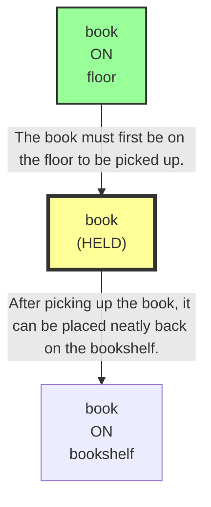
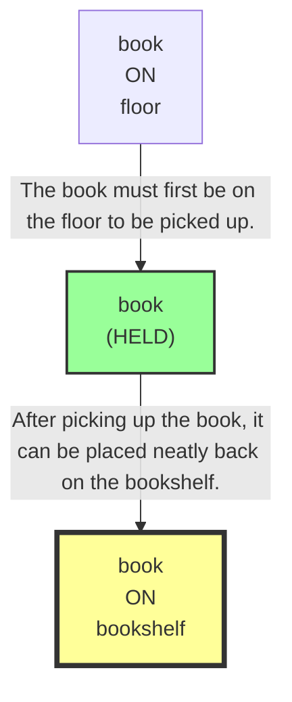
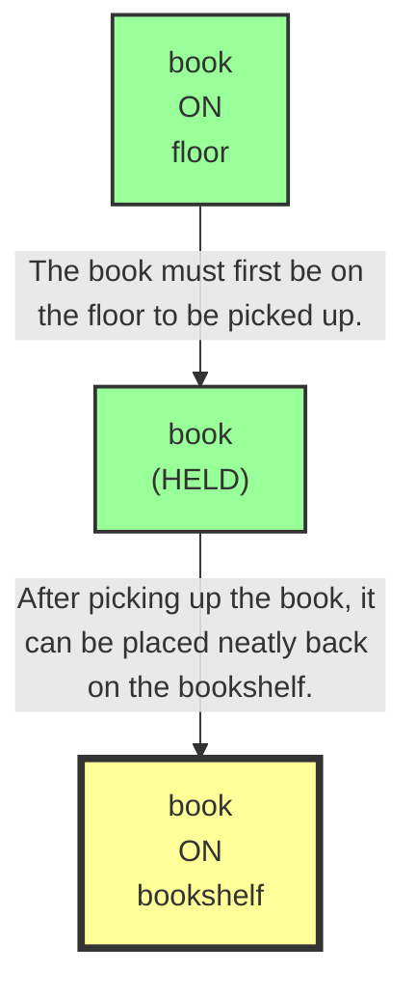
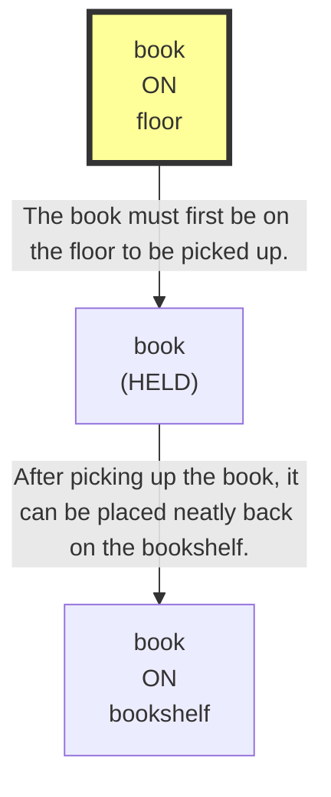

# 🚀 VirtualHome Agent Episode Log


### [GoalReasoner (Module A - Intent)] Output
```json
{
  "is_instruction_obviously_vague": false,
  "clarification_question": null,
  "target_object": "book",
  "location_hint": "floor",
  "reasoning_chain": [
    {
      "question": "Why does the user want this object?",
      "answer": "To recover the book after it has fallen and restore it to an orderly state."
    },
    {
      "question": "Why is that important?",
      "answer": "So the book is not left on the floor and the area stays neat."
    },
    {
      "question": "What fundamental need does this fulfill?",
      "answer": "It fulfills the need to maintain organization and prevent clutter."
    },
    {
      "question": "Are there any deeper psychological or physical motivations?",
      "answer": "Likely a desire to keep the environment tidy and ensure the book is handled properly."
    }
  ],
  "deep_intent": "The user wants to restore order by retrieving a fallen item and placing it neatly in its proper position.",
  "acceptable_alternatives_properties": [
    {
      "priority": 1,
      "description": "Other small household items or books that have fallen onto the floor and need to be picked up and returned neatly."
    },
    {
      "priority": 2,
      "description": "Other portable objects that belong on a nearby surface or shelf and can be tidied back into place."
    },
    {
      "priority": 3,
      "description": "Loose items causing minor clutter that can be gathered and organized."
    },
    {
      "priority": 4,
      "description": "Any fallen object that needs to be removed from the floor to maintain a tidy environment."
    }
  ]
}
```

### [PerceptionFilter] Output
```json
{
  "reasoning": "The goal is to pick up a fallen book from the floor and put it back on a bookshelf. The only necessary classes are the target object, the source location it is on, and the destination furniture where it should be placed.",
  "selected_classes": [
    "bookshelf",
    "book",
    "floor",
    "character"
  ],
  "raw_class_count": 41
}
```

### [LLMExecutor] Output
```json
{
  "reasoning": "The active SDG requires the book to be on the floor, then held, then placed on the bookshelf. The current graph shows three books on the floor; the best autonomous binding is book(190) as a valid floor book to pick up. To satisfy N2 next, I must first move adjacent to that book before grabbing it.",
  "satisfied_nodes": [
    "N1"
  ],
  "current_node_focus": "N2",
  "mapped_variables": {},
  "action": "[walk] <book> (190)"
}
```

### [RoboStateMultiTaskController] Output
```json
{
  "action": "[walk] <book> (190)",
  "active_task_id": "task_1",
  "task_context": {
    "active_task_id": "task_1",
    "pending_task_ids": [],
    "satisfied_task_ids": []
  },
  "source": "llm_executor"
}
```
## Step 0
- **Action**: `[walk] <book> (190)`
- **Action Success**: `True`
- **Action Message**: {'0': {'message': 'Success'}}
- **Active Task**: `task_1`
- **Decision Source**: `llm_executor`
- **Task Progress**: T5_G2_09_B0=pending
- **SDG Status**:

- **Observed Items (18)**: floor(336), floor(337), floor(338), floor(339), floor(340), floor(341), floor(342), floor(343), floor(344), bookshelf(370), book(190) [CLOSED], book(191) [CLOSED], book(268) [CLOSED], character(1), bathroom(11)...


### [PerceptionFilter] Output
```json
{
  "reasoning": "Reused cached class selection.",
  "selected_classes": [
    "bookshelf",
    "book",
    "floor",
    "character"
  ],
  "raw_class_count": 41
}
```

### [LLMExecutor] Output
```json
{
  "reasoning": "The book is already confirmed on the floor and close to the character, satisfying N1 and making it eligible to be picked up. The next required step in the SDG is to hold the book (N2), so I should grab one of the nearby book instances. I will use book(190) because it matches the floor location and proximity; the prior walk to book(190) was successful, so no repeat walk is needed.",
  "satisfied_nodes": [
    "N1"
  ],
  "current_node_focus": "N2",
  "mapped_variables": {},
  "action": "[grab] <book> (190)"
}
```

### [RoboStateMultiTaskController] Output
```json
{
  "action": "[grab] <book> (190)",
  "active_task_id": "task_1",
  "task_context": {
    "active_task_id": "task_1",
    "pending_task_ids": [],
    "satisfied_task_ids": []
  },
  "source": "llm_executor"
}
```
## Step 1
- **Action**: `[grab] <book> (190)`
- **Action Success**: `True`
- **Action Message**: {'0': {'message': 'Success'}}
- **Active Task**: `task_1`
- **Decision Source**: `llm_executor`
- **Task Progress**: T5_G2_09_B0=pending
- **SDG Status**:

- **Observed Items (18)**: floor(336), floor(337), floor(338), floor(339), floor(340), floor(341), floor(342), floor(343), floor(344), bookshelf(370), book(190) [CLOSED], book(191) [CLOSED], book(268) [CLOSED], character(1), bathroom(11)...


### [PerceptionFilter] Output
```json
{
  "reasoning": "Reused cached class selection.",
  "selected_classes": [
    "bookshelf",
    "book",
    "floor",
    "character"
  ],
  "raw_class_count": 41
}
```

### [LLMExecutor] Output
```json
{
  "reasoning": "The book task is partially progressed: the target book has already been picked up and is now held in the right hand, so N2 (HELD) is satisfied. The next required state is to place the book on the bookshelf. The bookshelf is currently close, but per the proximity rule I must explicitly walk to it before putting the book back. I will target the visible bookshelf(370) as the correct shelf destination.",
  "satisfied_nodes": [
    "N2"
  ],
  "current_node_focus": "N3",
  "mapped_variables": {
    "?Container": "bookshelf(370)"
  },
  "action": "[walk] <bookshelf> (370)"
}
```

### [RoboStateMultiTaskController] Output
```json
{
  "action": "[walk] <bookshelf> (370)",
  "active_task_id": "task_1",
  "task_context": {
    "active_task_id": "task_1",
    "pending_task_ids": [],
    "satisfied_task_ids": []
  },
  "source": "llm_executor"
}
```
## Step 2
- **Action**: `[walk] <bookshelf> (370)`
- **Action Success**: `True`
- **Action Message**: {'0': {'message': 'Success'}}
- **Active Task**: `task_1`
- **Decision Source**: `llm_executor`
- **Task Progress**: T5_G2_09_B0=pending
- **SDG Status**:

- **Observed Items (18)**: floor(336), floor(337), floor(338), floor(339), floor(340), floor(341), floor(342), floor(343), floor(344), bookshelf(370), book(190) [CLOSED], book(191) [CLOSED], book(268) [CLOSED], character(1), bathroom(11)...


### [PerceptionFilter] Output
```json
{
  "reasoning": "Reused cached class selection.",
  "selected_classes": [
    "bookshelf",
    "book",
    "floor",
    "character"
  ],
  "raw_class_count": 41
}
```

### [LLMExecutor] Output
```json
{
  "reasoning": "The book task is partially complete: the book is already held and the bookshelf is already nearby. The remaining SDG goal is to place the held book onto the bookshelf. Because putback requires being near the destination, and the previous action already walked to the bookshelf, the next atomic step is to place the book on it.",
  "satisfied_nodes": [
    "N1",
    "N2"
  ],
  "current_node_focus": "N3",
  "mapped_variables": {},
  "action": "[putback] <book> (190) <bookshelf> (370)"
}
```

### [RoboStateMultiTaskController] Output
```json
{
  "action": "[putback] <book> (190) <bookshelf> (370)",
  "active_task_id": "task_1",
  "task_context": {
    "active_task_id": "task_1",
    "pending_task_ids": [],
    "satisfied_task_ids": []
  },
  "source": "llm_executor"
}
```
## Step 3
- **Action**: `[putback] <book> (190) <bookshelf> (370)`
- **Action Success**: `False`
- **Action Message**: {'0': {'message': 'ScriptExcutor 0: EXECUTION_GENERAL: Script is impossible to execute\n\n'}}
- **Active Task**: `task_1`
- **Decision Source**: `llm_executor`
- **Task Progress**: T5_G2_09_B0=pending
- **SDG Status**:

- **Observed Items (18)**: floor(336), floor(337), floor(338), floor(339), floor(340), floor(341), floor(342), floor(343), floor(344), bookshelf(370), book(190) [CLOSED], book(191) [CLOSED], book(268) [CLOSED], character(1), bathroom(11)...


### [PerceptionFilter] Output
```json
{
  "reasoning": "Reused cached class selection.",
  "selected_classes": [
    "bookshelf",
    "book",
    "floor",
    "character"
  ],
  "raw_class_count": 41
}
```

### [LLMExecutor] Output
```json
{
  "reasoning": "The prior [putback] onto the bookshelf failed, likely because the book is not currently in a valid state for placement or the engine requires a different handling of this object class. The active goal is to place a book on the bookshelf, and the current graph shows book(190) is already held and the bookshelf(370) is close. Since the bookshelf is a valid surface/container and we are already adjacent to it, the most appropriate next step is to attempt placing the held book onto it again using the correct physical action.",
  "satisfied_nodes": [
    "N1",
    "N2"
  ],
  "current_node_focus": "N3",
  "mapped_variables": {
    "?Container": "bookshelf(370)"
  },
  "action": "[putback] <book> (190) <bookshelf> (370)"
}
```

### [RoboStateMultiTaskController] Output
```json
{
  "action": "[putback] <book> (190) <bookshelf> (370)",
  "active_task_id": "task_1",
  "task_context": {
    "active_task_id": "task_1",
    "pending_task_ids": [],
    "satisfied_task_ids": []
  },
  "source": "llm_executor"
}
```
## Step 4
- **Action**: `[putback] <book> (190) <bookshelf> (370)`
- **Action Success**: `False`
- **Action Message**: {'0': {'message': 'ScriptExcutor 0: EXECUTION_GENERAL: Script is impossible to execute\n\n'}}
- **Active Task**: `task_1`
- **Decision Source**: `llm_executor`
- **Task Progress**: T5_G2_09_B0=pending
- **SDG Status**:

- **Observed Items (18)**: floor(336), floor(337), floor(338), floor(339), floor(340), floor(341), floor(342), floor(343), floor(344), bookshelf(370), book(190) [CLOSED], book(191) [CLOSED], book(268) [CLOSED], character(1), bathroom(11)...


### [RoboStateMultiTaskController] Output
```json
{
  "action": "[walk] <bathroom> (11)",
  "active_task_id": null,
  "task_context": {
    "active_task_id": null,
    "pending_task_ids": [
      "task_1"
    ],
    "satisfied_task_ids": []
  },
  "source": "loop_recovery_room_revisit"
}
```
## Step 5
- **Action**: `[walk] <bathroom> (11)`
- **Action Success**: `True`
- **Action Message**: {'0': {'message': 'Success'}}
- **Decision Source**: `loop_recovery_room_revisit`
- **Task Progress**: T5_G2_09_B0=pending
- **SDG Status**:
No SDG active.
- **Observed Items (82)**: floor(336), floor(337), floor(338), floor(339), floor(340), floor(341), floor(342), floor(343), floor(344), wall(345), wall(346), wall(347), wall(348), wall(349), wall(350)...


### [PerceptionFilter] Output
```json
{
  "reasoning": "The goal is to pick up a fallen book from the floor and return it to the bookshelf. The only strictly necessary classes are the target object, the source location, and the destination receptacle.",
  "selected_classes": [
    "bookshelf",
    "book",
    "floor",
    "character"
  ],
  "raw_class_count": 63
}
```

### [LLMExecutor] Output
```json
{
  "reasoning": "The previous attempt to place book(190) on the bookshelf failed, and current graph shows book(190) is still held by the character in the bathroom. Since historical IDs may be stale and the task is to restore a fallen book to the bookshelf, the best autonomous continuation is to carry the held book to the bookshelf again, but first we must ensure proximity to the destination before any putback. The current focus is to progress toward placing the held book onto the bookshelf after the failed placement attempt.",
  "satisfied_nodes": [
    "N1",
    "N2"
  ],
  "current_node_focus": "N3",
  "mapped_variables": {
    "?Container": "bookshelf(370)"
  },
  "action": "[walk] <bookshelf> (370)"
}
```

### [RoboStateMultiTaskController] Output
```json
{
  "action": "[walk] <bookshelf> (370)",
  "active_task_id": "task_1",
  "task_context": {
    "active_task_id": "task_1",
    "pending_task_ids": [],
    "satisfied_task_ids": []
  },
  "source": "llm_executor"
}
```
## Step 6
- **Action**: `[walk] <bookshelf> (370)`
- **Action Success**: `True`
- **Action Message**: {'0': {'message': 'Success'}}
- **Active Task**: `task_1`
- **Decision Source**: `llm_executor`
- **Task Progress**: T5_G2_09_B0=pending
- **SDG Status**:

- **Observed Items (24)**: floor(336), floor(337), floor(338), floor(339), floor(340), floor(341), floor(342), floor(343), floor(344), bookshelf(370), book(190) [CLOSED], book(191) [CLOSED], book(268) [CLOSED], character(1), bathroom(11)...


### [PerceptionFilter] Output
```json
{
  "reasoning": "Reused cached class selection.",
  "selected_classes": [
    "bookshelf",
    "book",
    "floor",
    "character"
  ],
  "raw_class_count": 63
}
```

### [LLMExecutor] Output
```json
{
  "reasoning": "The book is already held, so N1 (book on floor) and N2 (book held) are satisfied. The previous putback to the bookshelf failed, likely because the book may be a closedable object and this engine may not allow putting it back as a surface placement in the current state, or because the robot needs a different valid receptacle behavior. Since the book is close to the character and the bookshelf is close too, the next best autonomous step is to retry placing the held book onto the bookshelf to satisfy N3. No clarification is allowed, so continue physically.",
  "satisfied_nodes": [
    "N1",
    "N2"
  ],
  "current_node_focus": "N3",
  "mapped_variables": {},
  "action": "[putback] <book> (190) <bookshelf> (370)"
}
```

### [RoboStateMultiTaskController] Output
```json
{
  "action": "[putback] <book> (190) <bookshelf> (370)",
  "active_task_id": "task_1",
  "task_context": {
    "active_task_id": "task_1",
    "pending_task_ids": [],
    "satisfied_task_ids": []
  },
  "source": "llm_executor"
}
```
## Step 7
- **Action**: `[putback] <book> (190) <bookshelf> (370)`
- **Action Success**: `False`
- **Action Message**: {'0': {'message': 'ScriptExcutor 0: EXECUTION_GENERAL: Script is impossible to execute\n\n'}}
- **Active Task**: `task_1`
- **Decision Source**: `llm_executor`
- **Task Progress**: T5_G2_09_B0=pending
- **SDG Status**:

- **Observed Items (24)**: floor(336), floor(337), floor(338), floor(339), floor(340), floor(341), floor(342), floor(343), floor(344), bookshelf(370), book(190) [CLOSED], book(191) [CLOSED], book(268) [CLOSED], character(1), bathroom(11)...


### [PerceptionFilter] Output
```json
{
  "reasoning": "Reused cached class selection.",
  "selected_classes": [
    "bookshelf",
    "book",
    "floor",
    "character"
  ],
  "raw_class_count": 63
}
```

### [LLMExecutor] Output
```json
{
  "reasoning": "The book task is already partially satisfied in that the target book is held. The last placement attempts on the bookshelf failed as impossible, likely because the exact bookshelf interaction is blocked or the held book is not the correct current binding. To progress autonomously without repeating a failed putback, I should rebind the target by using the currently visible floor book that matches the goal better. Book(191) is on the floor and close to the character, so the next valid step toward N2 is to pick up a floor book. This also aligns with the goal of recovering a fallen book from the floor.",
  "satisfied_nodes": [
    "N1"
  ],
  "current_node_focus": "N2",
  "mapped_variables": {
    "?TargetBook": "book(191)"
  },
  "action": "[walk] <book> (191)"
}
```

### [RoboStateMultiTaskController] Output
```json
{
  "action": "[walk] <book> (191)",
  "active_task_id": "task_1",
  "task_context": {
    "active_task_id": "task_1",
    "pending_task_ids": [],
    "satisfied_task_ids": []
  },
  "source": "llm_executor"
}
```
## Step 8
- **Action**: `[walk] <book> (191)`
- **Action Success**: `True`
- **Action Message**: {'0': {'message': 'Success'}}
- **Active Task**: `task_1`
- **Decision Source**: `llm_executor`
- **Task Progress**: T5_G2_09_B0=pending
- **SDG Status**:

- **Observed Items (24)**: floor(336), floor(337), floor(338), floor(339), floor(340), floor(341), floor(342), floor(343), floor(344), bookshelf(370), book(190) [CLOSED], book(191) [CLOSED], book(268) [CLOSED], character(1), bathroom(11)...


### [PerceptionFilter] Output
```json
{
  "reasoning": "Reused cached class selection.",
  "selected_classes": [
    "bookshelf",
    "book",
    "floor",
    "character"
  ],
  "raw_class_count": 63
}
```

### [LLMExecutor] Output
```json
{
  "reasoning": "The current SDG requires the book to end up on the bookshelf. The prior putback attempts failed because the book is a container-capable object marked CLOSED, so it likely cannot be placed on the bookshelf in its current state. I already hold book(190), and I am close to the bookshelf. The next logical step is to open the book before trying to place it on the bookshelf again.",
  "satisfied_nodes": [
    "N2"
  ],
  "current_node_focus": "N3",
  "mapped_variables": {
    "?Container": "bookshelf(370)"
  },
  "action": "[open] <book> (190)"
}
```

### [RoboStateMultiTaskController] Output
```json
{
  "action": "[open] <book> (190)",
  "active_task_id": "task_1",
  "task_context": {
    "active_task_id": "task_1",
    "pending_task_ids": [],
    "satisfied_task_ids": []
  },
  "source": "llm_executor"
}
```
## Step 9
- **Action**: `[open] <book> (190)`
- **Action Success**: `False`
- **Action Message**: {'0': {'message': 'ScriptExcutor 0: EXECUTION_GENERAL: Script is impossible to execute\n\n'}}
- **Active Task**: `task_1`
- **Decision Source**: `llm_executor`
- **Task Progress**: T5_G2_09_B0=pending
- **SDG Status**:

- **Observed Items (24)**: floor(336), floor(337), floor(338), floor(339), floor(340), floor(341), floor(342), floor(343), floor(344), bookshelf(370), book(190) [CLOSED], book(191) [CLOSED], book(268) [CLOSED], character(1), bathroom(11)...


### [PerceptionFilter] Output
```json
{
  "reasoning": "Reused cached class selection.",
  "selected_classes": [
    "bookshelf",
    "book",
    "floor",
    "character"
  ],
  "raw_class_count": 63
}
```

### [LLMExecutor] Output
```json
{
  "reasoning": "The active task is to place a book onto the bookshelf. The current graph shows I am already holding book(190), and the bookshelf(370) is close. The previous putback attempts likely failed because the bookshelf may not be the correct reachable surface target for placement in the engine state, so the next best autonomous step is to re-confirm proximity by walking directly to the bookshelf before trying placement again. This keeps progress toward N3 and does not violate any rule.",
  "satisfied_nodes": [
    "N2"
  ],
  "current_node_focus": "N3",
  "mapped_variables": {},
  "action": "[walk] <bookshelf> (370)"
}
```

### [RoboStateMultiTaskController] Output
```json
{
  "action": "[walk] <bookshelf> (370)",
  "active_task_id": "task_1",
  "task_context": {
    "active_task_id": "task_1",
    "pending_task_ids": [],
    "satisfied_task_ids": []
  },
  "source": "llm_executor"
}
```
## Step 10
- **Action**: `[walk] <bookshelf> (370)`
- **Action Success**: `True`
- **Action Message**: {'0': {'message': 'Success'}}
- **Active Task**: `task_1`
- **Decision Source**: `llm_executor`
- **Task Progress**: T5_G2_09_B0=pending
- **SDG Status**:

- **Observed Items (24)**: floor(336), floor(337), floor(338), floor(339), floor(340), floor(341), floor(342), floor(343), floor(344), bookshelf(370), book(190) [CLOSED], book(191) [CLOSED], book(268) [CLOSED], character(1), bathroom(11)...


### [PerceptionFilter] Output
```json
{
  "reasoning": "Reused cached class selection.",
  "selected_classes": [
    "bookshelf",
    "book",
    "floor",
    "character"
  ],
  "raw_class_count": 63
}
```

### [LLMExecutor] Output
```json
{
  "reasoning": "The current held book(190) cannot be put back onto the bookshelf because repeated putback attempts failed with 'impossible to execute', likely due to a mismatch with the historical handle or an invalid destination interaction. The active goal is to place a book on the bookshelf, and there are other candidate books on the floor in the current graph that satisfy the prerequisite state N1. Since the historical ID may be stale and the instruction says to rebind objects using current graph evidence, the best autonomous next step is to pick up another floor book that matches the task intent and can be used for the final putback flow. Book(191) is on the floor, close to the character, and is a valid rebinding for the task.",
  "satisfied_nodes": [
    "N1"
  ],
  "current_node_focus": "N2",
  "mapped_variables": {},
  "action": "[grab] <book> (191)"
}
```

### [RoboStateMultiTaskController] Output
```json
{
  "action": "[grab] <book> (191)",
  "active_task_id": "task_1",
  "task_context": {
    "active_task_id": "task_1",
    "pending_task_ids": [],
    "satisfied_task_ids": []
  },
  "source": "llm_executor"
}
```
## Step 11
- **Action**: `[grab] <book> (191)`
- **Action Success**: `True`
- **Action Message**: {'0': {'message': 'Success'}}
- **Active Task**: `task_1`
- **Decision Source**: `llm_executor`
- **Task Progress**: T5_G2_09_B0=pending
- **SDG Status**:

- **Observed Items (24)**: floor(336), floor(337), floor(338), floor(339), floor(340), floor(341), floor(342), floor(343), floor(344), bookshelf(370), book(190) [CLOSED], book(191) [CLOSED], book(268) [CLOSED], character(1), bathroom(11)...


### [PerceptionFilter] Output
```json
{
  "reasoning": "Reused cached class selection.",
  "selected_classes": [
    "bookshelf",
    "book",
    "floor",
    "character"
  ],
  "raw_class_count": 63
}
```

### [LLMExecutor] Output
```json
{
  "reasoning": "The active goal is to move a fallen book from the floor onto the bookshelf. In the current graph, book(268) is the only book explicitly ON a floor, while book(190) and book(191) are already held and book(190) is a historical handle that may be stale. Since the task requires a book on the floor to be picked up, the best current focus is the floor book(268). I must first move close to it before I can grab it.",
  "satisfied_nodes": [],
  "current_node_focus": "N1",
  "mapped_variables": {
    "?Book": "book(268)",
    "?Destination": "bookshelf(370)"
  },
  "action": "[walk] <book> (268)"
}
```

### [RoboStateMultiTaskController] Output
```json
{
  "action": "[walk] <book> (268)",
  "active_task_id": "task_1",
  "task_context": {
    "active_task_id": "task_1",
    "pending_task_ids": [],
    "satisfied_task_ids": []
  },
  "source": "llm_executor"
}
```
## Step 12
- **Action**: `[walk] <book> (268)`
- **Action Success**: `True`
- **Action Message**: {'0': {'message': 'Success'}}
- **Active Task**: `task_1`
- **Decision Source**: `llm_executor`
- **Task Progress**: T5_G2_09_B0=pending
- **SDG Status**:

- **Observed Items (24)**: floor(336), floor(337), floor(338), floor(339), floor(340), floor(341), floor(342), floor(343), floor(344), bookshelf(370), book(190) [CLOSED], book(191) [CLOSED], book(268) [CLOSED], character(1), bathroom(11)...


### [PerceptionFilter] Output
```json
{
  "reasoning": "Reused cached class selection.",
  "selected_classes": [
    "bookshelf",
    "book",
    "floor",
    "character"
  ],
  "raw_class_count": 63
}
```

### [LLMExecutor] Output
```json
{
  "reasoning": "The current task is to retrieve the fallen book and place it on the bookshelf. In the current graph, the only book that is clearly on the floor is book(268), while book(190) and book(191) are already being held and are not relevant to satisfying the floor prerequisite. Since I am already close to book(268), the next atomic step is to pick it up to satisfy N2 after N1 is already true.",
  "satisfied_nodes": [
    "N1"
  ],
  "current_node_focus": "N2",
  "mapped_variables": {},
  "action": "[grab] <book> (268)"
}
```

### [RoboStateMultiTaskController] Output
```json
{
  "action": "[grab] <book> (268)",
  "active_task_id": "task_1",
  "task_context": {
    "active_task_id": "task_1",
    "pending_task_ids": [],
    "satisfied_task_ids": []
  },
  "source": "llm_executor"
}
```
## Step 13
- **Action**: `[grab] <book> (268)`
- **Action Success**: `False`
- **Action Message**: {'0': {'message': 'ScriptExcutor 0: EXECUTION_GENERAL: Script is impossible to execute\n\n'}}
- **Active Task**: `task_1`
- **Decision Source**: `llm_executor`
- **Task Progress**: T5_G2_09_B0=pending
- **SDG Status**:

- **Observed Items (24)**: floor(336), floor(337), floor(338), floor(339), floor(340), floor(341), floor(342), floor(343), floor(344), bookshelf(370), book(190) [CLOSED], book(191) [CLOSED], book(268) [CLOSED], character(1), bathroom(11)...


### [PerceptionFilter] Output
```json
{
  "reasoning": "Reused cached class selection.",
  "selected_classes": [
    "bookshelf",
    "book",
    "floor",
    "character"
  ],
  "raw_class_count": 63
}
```

### [LLMExecutor] Output
```json
{
  "reasoning": "The active goal is to retrieve the book that is on the floor and place it on the bookshelf. In the current graph, book(268) is the only book explicitly on the floor, so it best matches N1. It is close to the character and not yet held, so the next required step is to pick it up. I will not use book(190) or book(191) because they are already in hand and are not the floor book, and the historical IDs are stale handles. This action works toward satisfying N2 after acquisition.",
  "satisfied_nodes": [],
  "current_node_focus": "N1",
  "mapped_variables": {},
  "action": "[grab] <book> (268)"
}
```

### [RoboStateMultiTaskController] Output
```json
{
  "action": "[grab] <book> (268)",
  "active_task_id": "task_1",
  "task_context": {
    "active_task_id": "task_1",
    "pending_task_ids": [],
    "satisfied_task_ids": []
  },
  "source": "llm_executor"
}
```
## Step 14
- **Action**: `[grab] <book> (268)`
- **Action Success**: `False`
- **Action Message**: {'0': {'message': 'ScriptExcutor 0: EXECUTION_GENERAL: Script is impossible to execute\n\n'}}
- **Active Task**: `task_1`
- **Decision Source**: `llm_executor`
- **Task Progress**: T5_G2_09_B0=pending
- **SDG Status**:

- **Observed Items (24)**: floor(336), floor(337), floor(338), floor(339), floor(340), floor(341), floor(342), floor(343), floor(344), bookshelf(370), book(190) [CLOSED], book(191) [CLOSED], book(268) [CLOSED], character(1), bathroom(11)...

