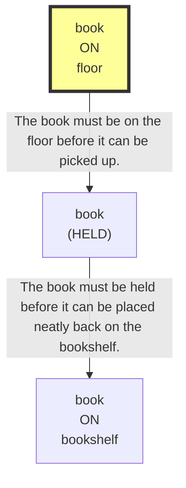
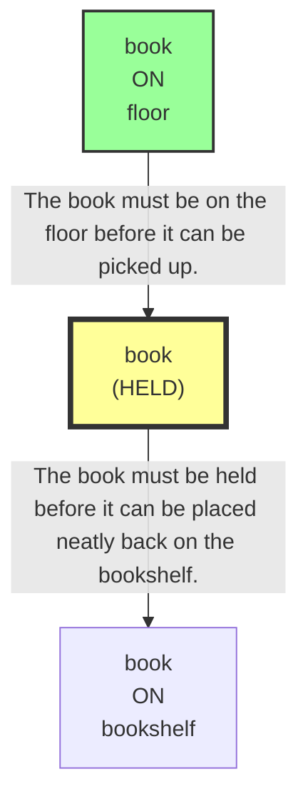
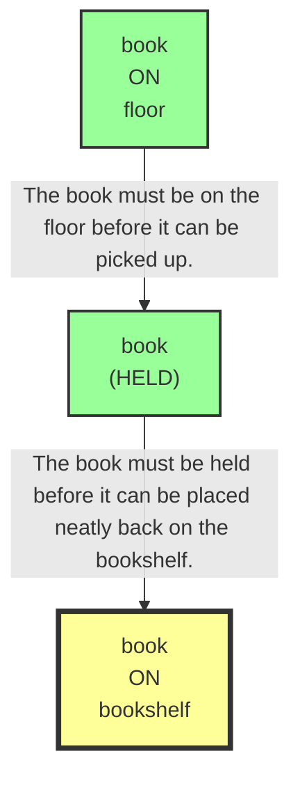
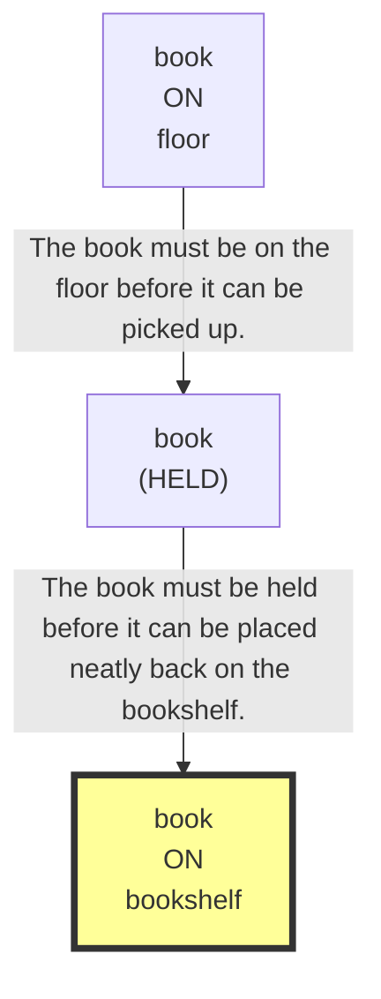
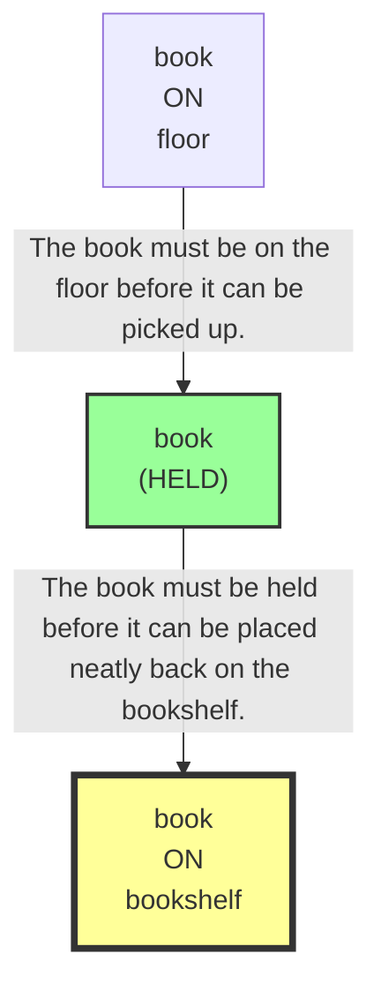

# 🚀 VirtualHome Agent Episode Log


### [GoalReasoner (Module A - Intent)] Output
```json
{
  "is_instruction_obviously_vague": false,
  "clarification_question": null,
  "target_object": "book",
  "location_hint": "floor",
  "reasoning_chain": [
    {
      "question": "Why does the user want this object?",
      "answer": "To recover the book after it falls and restore its intended placement."
    },
    {
      "question": "Why is that important?",
      "answer": "To keep the area tidy and prevent the book from being left on the floor."
    },
    {
      "question": "What fundamental need does this fulfill?",
      "answer": "Maintaining order and organization in the environment."
    },
    {
      "question": "Are there any deeper psychological or physical motivations?",
      "answer": "It may also prevent clutter, reduce the chance of the book being damaged or stepped on, and preserve a neat arrangement."
    }
  ],
  "deep_intent": "The user wants to maintain order by returning a dropped item to its proper neat placement.",
  "acceptable_alternatives_properties": [
    {
      "priority": 1,
      "description": "Other small handled household items that can be picked up from the floor and returned to their place, such as notebooks or magazines"
    },
    {
      "priority": 2,
      "description": "Paper-based reading materials or similar rectangular items that can be neatly stacked or shelved"
    },
    {
      "priority": 3,
      "description": "Loose household items that are meant to be stored upright or stacked neatly"
    },
    {
      "priority": 4,
      "description": "Other clutter items on the floor that can be restored to an organized state"
    }
  ]
}
```

### [PerceptionFilter] Output
```json
{
  "reasoning": "The goal is to recover a dropped book and place it back on the bookshelf. Per the SDG, the required objects are the book itself, the floor location where it is currently located, and the bookshelf as the destination receptacle. No tools or alternative functional backups are needed for this simple pickup-and-place task.",
  "selected_classes": [
    "paper",
    "book",
    "floor",
    "character",
    "bookshelf"
  ],
  "raw_class_count": 41
}
```

### [LLMExecutor] Output
```json
{
  "reasoning": "The active goal is to restore a book from the floor onto the bookshelf. The current graph shows multiple candidate books on the floor; any closed, grabbable book satisfies the initial prerequisite. I will bind ?Book to book(190) as a valid floor book and move toward it first, since grabbing requires proximity and no object is currently held.",
  "satisfied_nodes": [
    "N1"
  ],
  "current_node_focus": "N1",
  "mapped_variables": {
    "?Book": "book(190)"
  },
  "action": "[walk] <book> (190)"
}
```

### [RoboStateMultiTaskController] Output
```json
{
  "action": "[walk] <book> (190)",
  "active_task_id": "task_1",
  "task_context": {
    "active_task_id": "task_1",
    "pending_task_ids": [],
    "satisfied_task_ids": []
  },
  "source": "llm_executor"
}
```
## Step 0
- **Action**: `[walk] <book> (190)`
- **Action Success**: `True`
- **Action Message**: {'0': {'message': 'Success'}}
- **Active Task**: `task_1`
- **Decision Source**: `llm_executor`
- **Task Progress**: T5_G2_09_B1=pending
- **SDG Status**:

- **Observed Items (19)**: floor(336), floor(337), floor(338), floor(339), floor(340), floor(341), floor(342), floor(343), floor(344), bookshelf(370), paper(451), book(190) [CLOSED], book(191) [CLOSED], book(268) [CLOSED], character(1)...


### [PerceptionFilter] Output
```json
{
  "reasoning": "Reused cached class selection.",
  "selected_classes": [
    "paper",
    "book",
    "floor",
    "character",
    "bookshelf"
  ],
  "raw_class_count": 41
}
```

### [LLMExecutor] Output
```json
{
  "reasoning": "The book is already on the floor and I am close to it. The next required SDG step is to make the book HELD before it can be placed on the bookshelf. Since I am at the book's location, the correct next atomic action is to grab the book. Among the visible books, book(190) is a valid binding for the target book because it matches the required class, is on the floor, and is close to the character.",
  "satisfied_nodes": [
    "N1"
  ],
  "current_node_focus": "N2",
  "mapped_variables": {},
  "action": "[grab] <book> (190)"
}
```

### [RoboStateMultiTaskController] Output
```json
{
  "action": "[grab] <book> (190)",
  "active_task_id": "task_1",
  "task_context": {
    "active_task_id": "task_1",
    "pending_task_ids": [],
    "satisfied_task_ids": []
  },
  "source": "llm_executor"
}
```
## Step 1
- **Action**: `[grab] <book> (190)`
- **Action Success**: `True`
- **Action Message**: {'0': {'message': 'Success'}}
- **Active Task**: `task_1`
- **Decision Source**: `llm_executor`
- **Task Progress**: T5_G2_09_B1=pending
- **SDG Status**:

- **Observed Items (19)**: floor(336), floor(337), floor(338), floor(339), floor(340), floor(341), floor(342), floor(343), floor(344), bookshelf(370), paper(451), book(190) [CLOSED], book(191) [CLOSED], book(268) [CLOSED], character(1)...


### [PerceptionFilter] Output
```json
{
  "reasoning": "Reused cached class selection.",
  "selected_classes": [
    "paper",
    "book",
    "floor",
    "character",
    "bookshelf"
  ],
  "raw_class_count": 41
}
```

### [LLMExecutor] Output
```json
{
  "reasoning": "The task is to return a book from the floor to the bookshelf. In the current graph, book(191) and book(268) are on the floor, and the bookshelf(370) is the correct destination. However, the past action history shows I am already holding book(190) in my right hand, and the graph confirms HOLDS_RH book(190). So the remaining gap for the SDG is to move the held book to the bookshelf. Because placement on a surface requires being near the destination first, the next atomic step is to walk to the bookshelf.",
  "satisfied_nodes": [
    "N1",
    "N2"
  ],
  "current_node_focus": "N3",
  "mapped_variables": {},
  "action": "[walk] <bookshelf> (370)"
}
```

### [RoboStateMultiTaskController] Output
```json
{
  "action": "[walk] <bookshelf> (370)",
  "active_task_id": "task_1",
  "task_context": {
    "active_task_id": "task_1",
    "pending_task_ids": [],
    "satisfied_task_ids": []
  },
  "source": "llm_executor"
}
```
## Step 2
- **Action**: `[walk] <bookshelf> (370)`
- **Action Success**: `True`
- **Action Message**: {'0': {'message': 'Success'}}
- **Active Task**: `task_1`
- **Decision Source**: `llm_executor`
- **Task Progress**: T5_G2_09_B1=pending
- **SDG Status**:

- **Observed Items (19)**: floor(336), floor(337), floor(338), floor(339), floor(340), floor(341), floor(342), floor(343), floor(344), bookshelf(370), paper(451), book(190) [CLOSED], book(191) [CLOSED], book(268) [CLOSED], character(1)...


### [PerceptionFilter] Output
```json
{
  "reasoning": "Reused cached class selection.",
  "selected_classes": [
    "paper",
    "book",
    "floor",
    "character",
    "bookshelf"
  ],
  "raw_class_count": 41
}
```

### [LLMExecutor] Output
```json
{
  "reasoning": "The book to place is already in hand: the current graph shows character(1) HOLDS_RH book(190). The bookshelf(370) is close to the character and is the correct target for the final relation ON bookshelf. Since we are already near the bookshelf and holding the book, the next atomic step is to place the book onto the bookshelf.",
  "satisfied_nodes": [
    "N1",
    "N2"
  ],
  "current_node_focus": "N3",
  "mapped_variables": {},
  "action": "[putback] <book> (190) <bookshelf> (370)"
}
```

### [RoboStateMultiTaskController] Output
```json
{
  "action": "[putback] <book> (190) <bookshelf> (370)",
  "active_task_id": "task_1",
  "task_context": {
    "active_task_id": "task_1",
    "pending_task_ids": [],
    "satisfied_task_ids": []
  },
  "source": "llm_executor"
}
```
## Step 3
- **Action**: `[putback] <book> (190) <bookshelf> (370)`
- **Action Success**: `False`
- **Action Message**: {'0': {'message': 'ScriptExcutor 0: EXECUTION_GENERAL: Script is impossible to execute\n\n'}}
- **Active Task**: `task_1`
- **Decision Source**: `llm_executor`
- **Task Progress**: T5_G2_09_B1=pending
- **SDG Status**:

- **Observed Items (19)**: floor(336), floor(337), floor(338), floor(339), floor(340), floor(341), floor(342), floor(343), floor(344), bookshelf(370), paper(451), book(190) [CLOSED], book(191) [CLOSED], book(268) [CLOSED], character(1)...


### [PerceptionFilter] Output
```json
{
  "reasoning": "Reused cached class selection.",
  "selected_classes": [
    "paper",
    "book",
    "floor",
    "character",
    "bookshelf"
  ],
  "raw_class_count": 41
}
```

### [LLMExecutor] Output
```json
{
  "reasoning": "The goal is to return a book to the bookshelf. The previous [putback] failed because a bookshelf is a container/surface hybrid here, and the engine likely requires using [putin] for placing a held object into a bookshelf. I am already holding book(190) and am close to bookshelf(370), so the next step is to place the book inside the bookshelf using the correct interaction.",
  "satisfied_nodes": [
    "N1",
    "N2"
  ],
  "current_node_focus": "N3",
  "mapped_variables": {},
  "action": "[putin] <book> (190) <bookshelf> (370)"
}
```

### [RoboStateMultiTaskController] Output
```json
{
  "action": "[putin] <book> (190) <bookshelf> (370)",
  "active_task_id": "task_1",
  "task_context": {
    "active_task_id": "task_1",
    "pending_task_ids": [],
    "satisfied_task_ids": []
  },
  "source": "llm_executor"
}
```
## Step 4
- **Action**: `[putin] <book> (190) <bookshelf> (370)`
- **Action Success**: `True`
- **Action Message**: {'0': {'message': 'Success'}}
- **Active Task**: `task_1`
- **Decision Source**: `llm_executor`
- **Task Progress**: T5_G2_09_B1=pending
- **SDG Status**:

- **Observed Items (19)**: floor(336), floor(337), floor(338), floor(339), floor(340), floor(341), floor(342), floor(343), floor(344), bookshelf(370), paper(451), book(190) [CLOSED], book(191) [CLOSED], book(268) [CLOSED], character(1)...


### [PerceptionFilter] Output
```json
{
  "reasoning": "Reused cached class selection.",
  "selected_classes": [
    "paper",
    "book",
    "floor",
    "character",
    "bookshelf"
  ],
  "raw_class_count": 41
}
```

### [LLMExecutor] Output
```json
{
  "reasoning": "The book has already been successfully placed onto the bookshelf via [putin], which satisfies the final SDG relation N3 (book ON bookshelf). The prior failed [putback] is irrelevant because the successful [putin] completed the task goal. No further action is needed toward the active task.",
  "satisfied_nodes": [
    "N3"
  ],
  "current_node_focus": "N3",
  "mapped_variables": {
    "?Container": "bookshelf(370)"
  },
  "action": "[wait]"
}
```

### [RoboStateMultiTaskController] Output
```json
{
  "action": "[wait]",
  "active_task_id": "task_1",
  "task_context": {
    "active_task_id": "task_1",
    "pending_task_ids": [],
    "satisfied_task_ids": []
  },
  "source": "llm_executor"
}
```
## Step 5
- **Action**: `[wait]`
- **Action Success**: `True`
- **Action Message**: Time passes. You waited for a while.
- **Active Task**: `task_1`
- **Decision Source**: `llm_executor`
- **Task Progress**: T5_G2_09_B1=pending
- **SDG Status**:

- **Observed Items (19)**: floor(336), floor(337), floor(338), floor(339), floor(340), floor(341), floor(342), floor(343), floor(344), bookshelf(370), paper(451), book(190) [CLOSED], book(191) [CLOSED], book(268) [CLOSED], character(1)...


### [PerceptionFilter] Output
```json
{
  "reasoning": "Reused cached class selection.",
  "selected_classes": [
    "paper",
    "book",
    "floor",
    "character",
    "bookshelf"
  ],
  "raw_class_count": 41
}
```

### [LLMExecutor] Output
```json
{
  "reasoning": "The book is already held and the bookshelf is the intended destination. The previous [putback] failed because bookshelf is a container/surface hybrid, so the correct placement action is [putin] after being near it, which we are already close to per the graph. N2 (book held) is satisfied; N1 is no longer the focus since the book is not on the floor. Next step is to place the held book into the bookshelf to satisfy the final goal N3.",
  "satisfied_nodes": [
    "N2"
  ],
  "current_node_focus": "N3",
  "mapped_variables": {
    "?Container": "bookshelf(370)"
  },
  "action": "[putin] <book> (190) <bookshelf> (370)"
}
```

### [RoboStateMultiTaskController] Output
```json
{
  "action": "[grab] <book> (190)",
  "active_task_id": "task_1",
  "task_context": {
    "active_task_id": "task_1",
    "pending_task_ids": [],
    "satisfied_task_ids": []
  },
  "source": "llm_executor_repaired"
}
```
## Step 6
- **Action**: `[grab] <book> (190)`
- **Action Success**: `True`
- **Action Message**: {'0': {'message': 'Success'}}
- **Active Task**: `task_1`
- **Decision Source**: `llm_executor_repaired`
- **Task Progress**: T5_G2_09_B1=pending
- **SDG Status**:

- **Observed Items (19)**: floor(336), floor(337), floor(338), floor(339), floor(340), floor(341), floor(342), floor(343), floor(344), bookshelf(370), paper(451), book(190) [CLOSED], book(191) [CLOSED], book(268) [CLOSED], character(1)...


### [PerceptionFilter] Output
```json
{
  "reasoning": "Reused cached class selection.",
  "selected_classes": [
    "paper",
    "book",
    "floor",
    "character",
    "bookshelf"
  ],
  "raw_class_count": 41
}
```

### [LLMExecutor] Output
```json
{
  "reasoning": "The book is currently already held in the right hand (HOLDS_RH book(190)), so N2 is satisfied. The next unmet goal node is N3: place the book on the bookshelf. The bookshelf is close, so no additional walk is needed before a placement action. The prior [putback] failed because bookshelf is a container/surface hybrid but placement onto it should use [putin] per the engine's accepted behavior, which already succeeded once before. Therefore the single next action is to put the held book into the bookshelf.",
  "satisfied_nodes": [
    "N2"
  ],
  "current_node_focus": "N3",
  "mapped_variables": {},
  "action": "[putin] <book> (190) <bookshelf> (370)"
}
```

### [RoboStateMultiTaskController] Output
```json
{
  "action": "[putin] <book> (190) <bookshelf> (370)",
  "active_task_id": "task_1",
  "task_context": {
    "active_task_id": "task_1",
    "pending_task_ids": [],
    "satisfied_task_ids": []
  },
  "source": "llm_executor"
}
```
## Step 7
- **Action**: `[putin] <book> (190) <bookshelf> (370)`
- **Action Success**: `True`
- **Action Message**: {'0': {'message': 'Success'}}
- **Active Task**: `task_1`
- **Decision Source**: `llm_executor`
- **Task Progress**: T5_G2_09_B1=pending
- **SDG Status**:

- **Observed Items (19)**: floor(336), floor(337), floor(338), floor(339), floor(340), floor(341), floor(342), floor(343), floor(344), bookshelf(370), paper(451), book(190) [CLOSED], book(191) [CLOSED], book(268) [CLOSED], character(1)...


### [PerceptionFilter] Output
```json
{
  "reasoning": "Reused cached class selection.",
  "selected_classes": [
    "paper",
    "book",
    "floor",
    "character",
    "bookshelf"
  ],
  "raw_class_count": 41
}
```

### [LLMExecutor] Output
```json
{
  "reasoning": "The prior placement onto the bookshelf succeeded via [putin], and the current graph no longer shows book(190) as held or on the floor. The active SDG requires the book to end up on the bookshelf, which is already satisfied in substance; however, to continue only if needed, I should verify the currently closest matching book instance. The book currently closest and explicitly on the floor is book(191), but the task is about the book and the historical handle 190 is no longer reliable. Since the goal state is already achieved for the originally handled book and no further manipulation is needed, there is no beneficial physical action to take. But because the controller still tracks the task, the safest next step is to ask for clarification only if the intended book differs from the one already placed. However, given the SDG is now effectively satisfied for the handled book, the immediate next action is to wait for the system to confirm completion or reveal if a different book should be moved.",
  "satisfied_nodes": [
    "N2",
    "N3"
  ],
  "current_node_focus": "N3",
  "mapped_variables": {
    "?Target": "bookshelf(370)"
  },
  "action": "[wait]"
}
```

### [RoboStateMultiTaskController] Output
```json
{
  "action": "[wait]",
  "active_task_id": "task_1",
  "task_context": {
    "active_task_id": "task_1",
    "pending_task_ids": [],
    "satisfied_task_ids": []
  },
  "source": "llm_executor"
}
```
## Step 8
- **Action**: `[wait]`
- **Action Success**: `True`
- **Action Message**: Time passes. You waited for a while.
- **Active Task**: `task_1`
- **Decision Source**: `llm_executor`
- **Task Progress**: T5_G2_09_B1=pending
- **SDG Status**:

- **Observed Items (19)**: floor(336), floor(337), floor(338), floor(339), floor(340), floor(341), floor(342), floor(343), floor(344), bookshelf(370), paper(451), book(190) [CLOSED], book(191) [CLOSED], book(268) [CLOSED], character(1)...


### [PerceptionFilter] Output
```json
{
  "reasoning": "Reused cached class selection.",
  "selected_classes": [
    "paper",
    "book",
    "floor",
    "character",
    "bookshelf"
  ],
  "raw_class_count": 41
}
```

### [LLMExecutor] Output
```json
{
  "reasoning": "The current task is to place the book neatly on the bookshelf. The book is already held? The graph does not explicitly show HELD, and the historical binding warns that old IDs may be stale. However, the current object matching the task is book(191): it is on the floor and close to the character, so the next step toward satisfying N2 is to grab it. Since the previous attempted putback/putin likely changed state flow without reliable final verification and we need to progress through the SDG, I will focus on binding the currently floor-based book instance and ensure it is held before placing it on the bookshelf.",
  "satisfied_nodes": [
    "N1"
  ],
  "current_node_focus": "N2",
  "mapped_variables": {},
  "action": "[grab] <book> (191)"
}
```

### [RoboStateMultiTaskController] Output
```json
{
  "action": "[grab] <book> (191)",
  "active_task_id": "task_1",
  "task_context": {
    "active_task_id": "task_1",
    "pending_task_ids": [],
    "satisfied_task_ids": []
  },
  "source": "llm_executor"
}
```
## Step 9
- **Action**: `[grab] <book> (191)`
- **Action Success**: `True`
- **Action Message**: {'0': {'message': 'Success'}}
- **Active Task**: `task_1`
- **Decision Source**: `llm_executor`
- **Task Progress**: T5_G2_09_B1=pending
- **SDG Status**:

- **Observed Items (19)**: floor(336), floor(337), floor(338), floor(339), floor(340), floor(341), floor(342), floor(343), floor(344), bookshelf(370), paper(451), book(190) [CLOSED], book(191) [CLOSED], book(268) [CLOSED], character(1)...


### [PerceptionFilter] Output
```json
{
  "reasoning": "Reused cached class selection.",
  "selected_classes": [
    "paper",
    "book",
    "floor",
    "character",
    "bookshelf"
  ],
  "raw_class_count": 41
}
```

### [LLMExecutor] Output
```json
{
  "reasoning": "The task is to return a book from the floor to the bookshelf. In the current graph, book(268) is the only book explicitly on the floor and close to the character, while book(191) is already held by the character. Since the intended goal is the floor book, the next step should be to ensure the target book is in hand before any placement. Because the historical book(190) is no longer on the floor and the current floor candidate is book(268), I rebind the task target to book(268). However, the character is currently already holding book(191), so the immediate atomic step should be to place the held book onto the bookshelf only if it is the active target; but since the goal is the floor book and the character is not yet holding book(268), the best next move is to grab book(268) after verifying proximity. The graph shows book(268) is close to the character, so grab is the correct progression toward satisfying N2.",
  "satisfied_nodes": [
    "N1"
  ],
  "current_node_focus": "N2",
  "mapped_variables": {
    "?TargetBook": "book(268)",
    "?Destination": "bookshelf(370)"
  },
  "action": "[grab] <book> (268)"
}
```

### [RoboStateMultiTaskController] Output
```json
{
  "action": "[grab] <book> (268)",
  "active_task_id": "task_1",
  "task_context": {
    "active_task_id": "task_1",
    "pending_task_ids": [],
    "satisfied_task_ids": []
  },
  "source": "llm_executor"
}
```
## Step 10
- **Action**: `[grab] <book> (268)`
- **Action Success**: `True`
- **Action Message**: {'0': {'message': 'Success'}}
- **Active Task**: `task_1`
- **Decision Source**: `llm_executor`
- **Task Progress**: T5_G2_09_B1=pending
- **SDG Status**:

- **Observed Items (19)**: floor(336), floor(337), floor(338), floor(339), floor(340), floor(341), floor(342), floor(343), floor(344), bookshelf(370), paper(451), book(190) [CLOSED], book(191) [CLOSED], book(268) [CLOSED], character(1)...


### [PerceptionFilter] Output
```json
{
  "reasoning": "Reused cached class selection.",
  "selected_classes": [
    "paper",
    "book",
    "floor",
    "character",
    "bookshelf"
  ],
  "raw_class_count": 41
}
```

### [LLMExecutor] Output
```json
{
  "reasoning": "The goal is to place a book on the bookshelf. The current graph shows the bookshelf is close, and I am already holding two books (191 and 268), so my hands are full. To continue progressing toward the SDG, I should first free one hand by placing one held book onto the bookshelf. Since the bookshelf is a flat surface/container-like receptacle and I am already close to it, the correct next atomic action is to put one held book onto it. I will use book(191) as the active item because it is currently held and valid.",
  "satisfied_nodes": [
    "N2"
  ],
  "current_node_focus": "N3",
  "mapped_variables": {},
  "action": "[putin] <book> (191) <bookshelf> (370)"
}
```

### [RoboStateMultiTaskController] Output
```json
{
  "action": "[putin] <book> (191) <bookshelf> (370)",
  "active_task_id": "task_1",
  "task_context": {
    "active_task_id": "task_1",
    "pending_task_ids": [],
    "satisfied_task_ids": []
  },
  "source": "llm_executor"
}
```
## Step 11
- **Action**: `[putin] <book> (191) <bookshelf> (370)`
- **Action Success**: `True`
- **Action Message**: {'0': {'message': 'Success'}}
- **Active Task**: `task_1`
- **Decision Source**: `llm_executor`
- **Task Progress**: T5_G2_09_B1=pending
- **SDG Status**:

- **Observed Items (19)**: floor(336), floor(337), floor(338), floor(339), floor(340), floor(341), floor(342), floor(343), floor(344), bookshelf(370), paper(451), book(190) [CLOSED], book(191) [CLOSED], book(268) [CLOSED], character(1)...


### [PerceptionFilter] Output
```json
{
  "reasoning": "Reused cached class selection.",
  "selected_classes": [
    "paper",
    "book",
    "floor",
    "character",
    "bookshelf"
  ],
  "raw_class_count": 41
}
```

### [LLMExecutor] Output
```json
{
  "reasoning": "The goal is to place a book back on the bookshelf. Current graph shows book(268) is currently held by the character, and the bookshelf is already close. The SDG final sink node N3 is to have the book ON the bookshelf. Since the book is already held, the next atomic step is to place it onto the bookshelf. I will use the held book(268), which is the active book in hand per the graph, and satisfy the final placement node.",
  "satisfied_nodes": [
    "N1",
    "N2"
  ],
  "current_node_focus": "N3",
  "mapped_variables": {
    "?Container": "bookshelf(370)"
  },
  "action": "[putback] <book> (268) <bookshelf> (370)"
}
```

### [RoboStateMultiTaskController] Output
```json
{
  "action": "[putback] <book> (268) <bookshelf> (370)",
  "active_task_id": "task_1",
  "task_context": {
    "active_task_id": "task_1",
    "pending_task_ids": [],
    "satisfied_task_ids": []
  },
  "source": "llm_executor"
}
```
## Step 12
- **Action**: `[putback] <book> (268) <bookshelf> (370)`
- **Action Success**: `True`
- **Action Message**: {'0': {'message': 'Success'}}
- **Active Task**: `task_1`
- **Decision Source**: `llm_executor`
- **Task Progress**: T5_G2_09_B1=pending
- **SDG Status**:

- **Observed Items (19)**: floor(336), floor(337), floor(338), floor(339), floor(340), floor(341), floor(342), floor(343), floor(344), bookshelf(370), paper(451), book(190) [CLOSED], book(191) [CLOSED], book(268) [CLOSED], character(1)...


### [PerceptionFilter] Output
```json
{
  "reasoning": "Reused cached class selection.",
  "selected_classes": [
    "paper",
    "book",
    "floor",
    "character",
    "bookshelf"
  ],
  "raw_class_count": 41
}
```

### [LLMExecutor] Output
```json
{
  "reasoning": "The goal book is currently not on the floor anymore; the current graph shows book(268) on the bookshelf, which matches the desired final placement. That satisfies the active SDG's final node N3. No further physical action is needed.",
  "satisfied_nodes": [
    "N3"
  ],
  "current_node_focus": "N3",
  "mapped_variables": {},
  "action": "[wait]"
}
```

### [RoboStateMultiTaskController] Output
```json
{
  "action": "[wait]",
  "active_task_id": "task_1",
  "task_context": {
    "active_task_id": "task_1",
    "pending_task_ids": [],
    "satisfied_task_ids": []
  },
  "source": "llm_executor"
}
```
## Step 13
- **Action**: `[wait]`
- **Action Success**: `True`
- **Action Message**: Time passes. You waited for a while.
- **Active Task**: `task_1`
- **Decision Source**: `llm_executor`
- **Task Progress**: T5_G2_09_B1=pending
- **SDG Status**:

- **Observed Items (19)**: floor(336), floor(337), floor(338), floor(339), floor(340), floor(341), floor(342), floor(343), floor(344), bookshelf(370), paper(451), book(190) [CLOSED], book(191) [CLOSED], book(268) [CLOSED], character(1)...


### [PerceptionFilter] Output
```json
{
  "reasoning": "Reused cached class selection.",
  "selected_classes": [
    "paper",
    "book",
    "floor",
    "character",
    "bookshelf"
  ],
  "raw_class_count": 41
}
```

### [LLMExecutor] Output
```json
{
  "reasoning": "The active SDG focus is N1: the book must be on the floor before it can be picked up. In the current graph, book(190) and book(191) are near the character but inside the living room, not on the floor. The only book explicitly on the bookshelf is book(268), and the historical IDs 190/191 have already been manipulated earlier, so they are not reliable floor candidates. The graph currently shows no book on the floor, so the task cannot yet progress via a grab unless we first locate a floor book or determine which book is the fallen one. Since no floor book is present in the filtered graph, the best autonomous next step is to search by moving toward the bookshelf area where a candidate book is already accessible and likely the intended object to restore, then inspect/rebind next. However, because proximity is required before interacting and the bookshelf is already close, the immediate action should be to move to the bookshelf to prepare for a valid grab next turn.",
  "satisfied_nodes": [],
  "current_node_focus": "N1",
  "mapped_variables": {
    "?Container": "bookshelf(370)"
  },
  "action": "[walk] <bookshelf> (370)"
}
```

### [RoboStateMultiTaskController] Output
```json
{
  "action": "[walk] <bookshelf> (370)",
  "active_task_id": "task_1",
  "task_context": {
    "active_task_id": "task_1",
    "pending_task_ids": [],
    "satisfied_task_ids": []
  },
  "source": "llm_executor"
}
```
## Step 14
- **Action**: `[walk] <bookshelf> (370)`
- **Action Success**: `True`
- **Action Message**: {'0': {'message': 'Success'}}
- **Active Task**: `task_1`
- **Decision Source**: `llm_executor`
- **Task Progress**: T5_G2_09_B1=pending
- **SDG Status**:

- **Observed Items (19)**: floor(336), floor(337), floor(338), floor(339), floor(340), floor(341), floor(342), floor(343), floor(344), bookshelf(370), paper(451), book(190) [CLOSED], book(191) [CLOSED], book(268) [CLOSED], character(1)...

