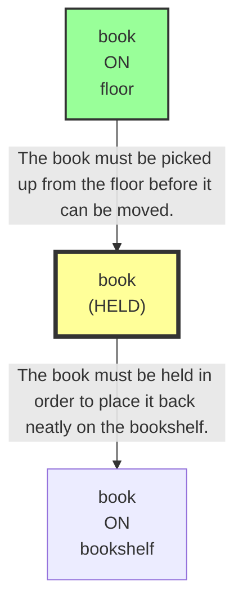
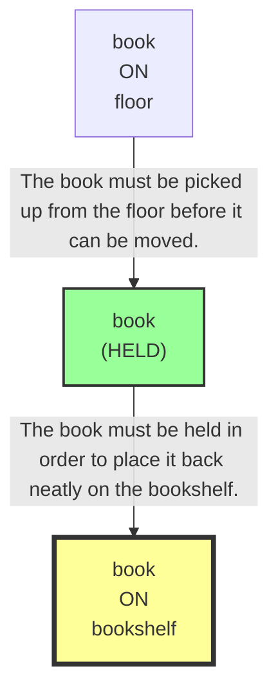
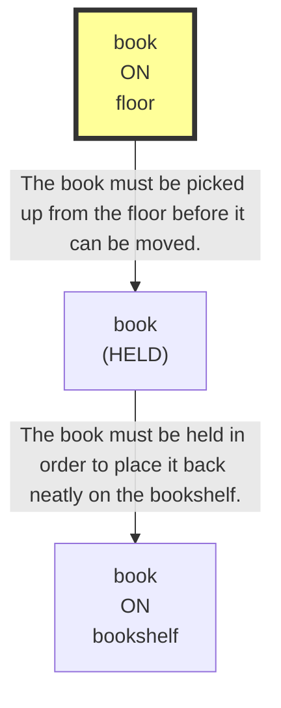
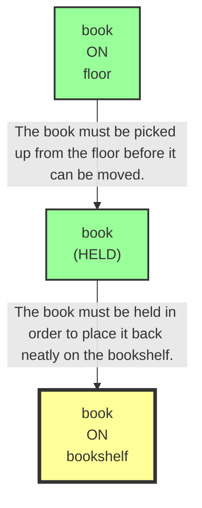

# 🚀 VirtualHome Agent Episode Log


### [GoalReasoner (Module A - Intent)] Output
```json
{
  "is_instruction_obviously_vague": false,
  "clarification_question": null,
  "target_object": "book",
  "location_hint": "floor",
  "reasoning_chain": [
    {
      "question": "Why does the user want this object?",
      "answer": "To restore the book after it has fallen and is out of place."
    },
    {
      "question": "Why is that important?",
      "answer": "To keep the area tidy and the book returned to its intended position."
    },
    {
      "question": "What fundamental need does this fulfill?",
      "answer": "The need to maintain order and organize items in the environment."
    },
    {
      "question": "Are there any deeper psychological or physical motivations?",
      "answer": "It may reduce clutter, prevent the book from being damaged or walked on, and preserve a neat appearance."
    }
  ],
  "deep_intent": "Maintain order by restoring an item to its proper place and keeping the area neat",
  "acceptable_alternatives_properties": [
    {
      "priority": 1,
      "description": "Other similarly displaced household items that can be picked up and returned to a tidy position"
    },
    {
      "priority": 2,
      "description": "Other flat or portable reading materials or paper items that are out of place and need organizing"
    },
    {
      "priority": 3,
      "description": "Small loose items in the room that can be collected and arranged neatly"
    },
    {
      "priority": 4,
      "description": "Other clutter that can be tidied to improve order in the space"
    }
  ]
}
```

### [PerceptionFilter] Output
```json
{
  "reasoning": "The goal is to pick up a book from the floor and return it to its proper place on a bookshelf. The only necessary classes are the target object, the source location, and the destination receptacle.",
  "selected_classes": [
    "book",
    "paper",
    "bookshelf",
    "floor",
    "character"
  ],
  "raw_class_count": 41
}
```

### [LLMExecutor] Output
```json
{
  "reasoning": "The active goal is to restore a book from the floor to the bookshelf. The SDG requires first satisfying N1 (book on floor), then N2 (book held), then N3 (book on bookshelf). There are multiple book candidates on the floor, and all match the needed properties; choose one to begin by moving close to it before grabbing. I will target book(190) as a valid floor book. Since grabbing requires proximity and we are not yet near it, the next atomic action must be to walk to the book.",
  "satisfied_nodes": [
    "N1"
  ],
  "current_node_focus": "N2",
  "mapped_variables": {},
  "action": "[walk] <book> (190)"
}
```

### [RoboStateMultiTaskController] Output
```json
{
  "action": "[walk] <book> (190)",
  "active_task_id": "task_1",
  "task_context": {
    "active_task_id": "task_1",
    "pending_task_ids": [],
    "satisfied_task_ids": []
  },
  "source": "llm_executor"
}
```
## Step 0
- **Action**: `[walk] <book> (190)`
- **Action Success**: `True`
- **Action Message**: {'0': {'message': 'Success'}}
- **Active Task**: `task_1`
- **Decision Source**: `llm_executor`
- **Task Progress**: T5_G2_09_B2=pending
- **SDG Status**:

- **Observed Items (19)**: floor(336), floor(337), floor(338), floor(339), floor(340), floor(341), floor(342), floor(343), floor(344), bookshelf(370), paper(451), book(190) [CLOSED], book(191) [CLOSED], book(268) [CLOSED], character(1)...


### [PerceptionFilter] Output
```json
{
  "reasoning": "Reused cached class selection.",
  "selected_classes": [
    "book",
    "paper",
    "bookshelf",
    "floor",
    "character"
  ],
  "raw_class_count": 41
}
```

### [LLMExecutor] Output
```json
{
  "reasoning": "The goal is to move a book from the floor onto the bookshelf. The current graph shows book(190) is on the floor and close to the character, so the next required SDG step is to pick it up. This satisfies N1 and moves toward N2 (HELD).",
  "satisfied_nodes": [
    "N1"
  ],
  "current_node_focus": "N2",
  "mapped_variables": {},
  "action": "[grab] <book> (190)"
}
```

### [RoboStateMultiTaskController] Output
```json
{
  "action": "[grab] <book> (190)",
  "active_task_id": "task_1",
  "task_context": {
    "active_task_id": "task_1",
    "pending_task_ids": [],
    "satisfied_task_ids": []
  },
  "source": "llm_executor"
}
```
## Step 1
- **Action**: `[grab] <book> (190)`
- **Action Success**: `True`
- **Action Message**: {'0': {'message': 'Success'}}
- **Active Task**: `task_1`
- **Decision Source**: `llm_executor`
- **Task Progress**: T5_G2_09_B2=pending
- **SDG Status**:

- **Observed Items (19)**: floor(336), floor(337), floor(338), floor(339), floor(340), floor(341), floor(342), floor(343), floor(344), bookshelf(370), paper(451), book(190) [CLOSED], book(191) [CLOSED], book(268) [CLOSED], character(1)...


### [PerceptionFilter] Output
```json
{
  "reasoning": "Reused cached class selection.",
  "selected_classes": [
    "book",
    "paper",
    "bookshelf",
    "floor",
    "character"
  ],
  "raw_class_count": 41
}
```

### [LLMExecutor] Output
```json
{
  "reasoning": "The book target is already being held in the right hand (book(190) is HOLDS_RH), so N1 (book on floor) is no longer satisfied, and N2 (book held) is satisfied. The next required step is to place the held book onto the bookshelf. Because putting down requires being near the destination, I must first walk to the bookshelf before any putback action can be taken.",
  "satisfied_nodes": [
    "N2"
  ],
  "current_node_focus": "N3",
  "mapped_variables": {
    "?Destination": "bookshelf(370)"
  },
  "action": "[walk] <bookshelf> (370)"
}
```

### [RoboStateMultiTaskController] Output
```json
{
  "action": "[walk] <bookshelf> (370)",
  "active_task_id": "task_1",
  "task_context": {
    "active_task_id": "task_1",
    "pending_task_ids": [],
    "satisfied_task_ids": []
  },
  "source": "llm_executor"
}
```
## Step 2
- **Action**: `[walk] <bookshelf> (370)`
- **Action Success**: `True`
- **Action Message**: {'0': {'message': 'Success'}}
- **Active Task**: `task_1`
- **Decision Source**: `llm_executor`
- **Task Progress**: T5_G2_09_B2=pending
- **SDG Status**:

- **Observed Items (19)**: floor(336), floor(337), floor(338), floor(339), floor(340), floor(341), floor(342), floor(343), floor(344), bookshelf(370), paper(451), book(190) [CLOSED], book(191) [CLOSED], book(268) [CLOSED], character(1)...


### [PerceptionFilter] Output
```json
{
  "reasoning": "Reused cached class selection.",
  "selected_classes": [
    "book",
    "paper",
    "bookshelf",
    "floor",
    "character"
  ],
  "raw_class_count": 41
}
```

### [LLMExecutor] Output
```json
{
  "reasoning": "The book is already held in the right hand (book(190) satisfies N2), and we are already close to the bookshelf(370). The remaining goal is to place the held book onto the bookshelf, which will satisfy the final SDG node N3. A putback onto the bookshelf is the correct action because the bookshelf is a flat surface in the graph and not a container that needs opening.",
  "satisfied_nodes": [
    "N2"
  ],
  "current_node_focus": "N3",
  "mapped_variables": {},
  "action": "[putback] <book> (190) <bookshelf> (370)"
}
```

### [RoboStateMultiTaskController] Output
```json
{
  "action": "[putback] <book> (190) <bookshelf> (370)",
  "active_task_id": "task_1",
  "task_context": {
    "active_task_id": "task_1",
    "pending_task_ids": [],
    "satisfied_task_ids": []
  },
  "source": "llm_executor"
}
```
## Step 3
- **Action**: `[putback] <book> (190) <bookshelf> (370)`
- **Action Success**: `False`
- **Action Message**: {'0': {'message': 'ScriptExcutor 0: EXECUTION_GENERAL: Script is impossible to execute\n\n'}}
- **Active Task**: `task_1`
- **Decision Source**: `llm_executor`
- **Task Progress**: T5_G2_09_B2=pending
- **SDG Status**:

- **Observed Items (19)**: floor(336), floor(337), floor(338), floor(339), floor(340), floor(341), floor(342), floor(343), floor(344), bookshelf(370), paper(451), book(190) [CLOSED], book(191) [CLOSED], book(268) [CLOSED], character(1)...


### [PerceptionFilter] Output
```json
{
  "reasoning": "Reused cached class selection.",
  "selected_classes": [
    "book",
    "paper",
    "bookshelf",
    "floor",
    "character"
  ],
  "raw_class_count": 41
}
```

### [LLMExecutor] Output
```json
{
  "reasoning": "The previous [putback] failed because a bookshelf is a container/surface but the engine rejected the direct placement attempt from the current state. The current graph shows the robot is already close to bookshelf(370) and is holding book(190) in the right hand. To satisfy the final SDG node N3, the next best step is to attempt placing the held book onto the bookshelf again, now that proximity and holding requirements are met. N1 is no longer the focus because the book is already picked up; N2 is satisfied by HOLDS_RH book(190).",
  "satisfied_nodes": [
    "N2"
  ],
  "current_node_focus": "N3",
  "mapped_variables": {},
  "action": "[putback] <book> (190) <bookshelf> (370)"
}
```

### [RoboStateMultiTaskController] Output
```json
{
  "action": "[putback] <book> (190) <bookshelf> (370)",
  "active_task_id": "task_1",
  "task_context": {
    "active_task_id": "task_1",
    "pending_task_ids": [],
    "satisfied_task_ids": []
  },
  "source": "llm_executor"
}
```
## Step 4
- **Action**: `[putback] <book> (190) <bookshelf> (370)`
- **Action Success**: `False`
- **Action Message**: {'0': {'message': 'ScriptExcutor 0: EXECUTION_GENERAL: Script is impossible to execute\n\n'}}
- **Active Task**: `task_1`
- **Decision Source**: `llm_executor`
- **Task Progress**: T5_G2_09_B2=pending
- **SDG Status**:

- **Observed Items (19)**: floor(336), floor(337), floor(338), floor(339), floor(340), floor(341), floor(342), floor(343), floor(344), bookshelf(370), paper(451), book(190) [CLOSED], book(191) [CLOSED], book(268) [CLOSED], character(1)...


### [RoboStateMultiTaskController] Output
```json
{
  "action": "[walk] <bathroom> (11)",
  "active_task_id": null,
  "task_context": {
    "active_task_id": null,
    "pending_task_ids": [
      "task_1"
    ],
    "satisfied_task_ids": []
  },
  "source": "loop_recovery_room_revisit"
}
```
## Step 5
- **Action**: `[walk] <bathroom> (11)`
- **Action Success**: `True`
- **Action Message**: {'0': {'message': 'Success'}}
- **Decision Source**: `loop_recovery_room_revisit`
- **Task Progress**: T5_G2_09_B2=pending
- **SDG Status**:
No SDG active.
- **Observed Items (82)**: floor(336), floor(337), floor(338), floor(339), floor(340), floor(341), floor(342), floor(343), floor(344), wall(345), wall(346), wall(347), wall(348), wall(349), wall(350)...


### [PerceptionFilter] Output
```json
{
  "reasoning": "The task is to pick up a book from the floor and return it to a bookshelf. So the only necessary classes are the target object, the source location, and the destination receptacle/furniture. No tools or alternatives are required beyond these exact classes.",
  "selected_classes": [
    "book",
    "paper",
    "bookshelf",
    "floor",
    "character"
  ],
  "raw_class_count": 63
}
```

### [LLMExecutor] Output
```json
{
  "reasoning": "The previous attempt to put the book on the bookshelf failed, and the current graph shows book(190) is now held by the character in the bathroom, while the intended floor book in the living room is book(191) or book(268). Since the goal requires the book to be moved from the floor to the bookshelf, I need to rebind to the actual floor book nearest the bookshelf. The next required step is to walk to a specific floor book so it can be grabbed before any placement attempt.",
  "satisfied_nodes": [],
  "current_node_focus": "N1",
  "mapped_variables": {
    "?Book": "book(191)"
  },
  "action": "[walk] <book> (191)"
}
```

### [RoboStateMultiTaskController] Output
```json
{
  "action": "[walk] <book> (191)",
  "active_task_id": "task_1",
  "task_context": {
    "active_task_id": "task_1",
    "pending_task_ids": [],
    "satisfied_task_ids": []
  },
  "source": "llm_executor"
}
```
## Step 6
- **Action**: `[walk] <book> (191)`
- **Action Success**: `True`
- **Action Message**: {'0': {'message': 'Success'}}
- **Active Task**: `task_1`
- **Decision Source**: `llm_executor`
- **Task Progress**: T5_G2_09_B2=pending
- **SDG Status**:

- **Observed Items (25)**: floor(336), floor(337), floor(338), floor(339), floor(340), floor(341), floor(342), floor(343), floor(344), bookshelf(370), paper(451), book(190) [CLOSED], book(191) [CLOSED], book(268) [CLOSED], character(1)...


### [PerceptionFilter] Output
```json
{
  "reasoning": "Reused cached class selection.",
  "selected_classes": [
    "book",
    "paper",
    "bookshelf",
    "floor",
    "character"
  ],
  "raw_class_count": 63
}
```

### [LLMExecutor] Output
```json
{
  "reasoning": "The previous attempt to put book(190) on the bookshelf failed, and the current graph shows book(190) is already held in the right hand. To complete the SDG, the next required step is to place the held book onto the bookshelf, which is currently close to the character. Because putback requires being near the destination and we have just moved to the relevant area, the best next atomic action is to try placing the held book on the bookshelf again.",
  "satisfied_nodes": [
    "N2"
  ],
  "current_node_focus": "N3",
  "mapped_variables": {},
  "action": "[putback] <book> (190) <bookshelf> (370)"
}
```

### [RoboStateMultiTaskController] Output
```json
{
  "action": "[putback] <book> (190) <bookshelf> (370)",
  "active_task_id": "task_1",
  "task_context": {
    "active_task_id": "task_1",
    "pending_task_ids": [],
    "satisfied_task_ids": []
  },
  "source": "llm_executor"
}
```
## Step 7
- **Action**: `[putback] <book> (190) <bookshelf> (370)`
- **Action Success**: `False`
- **Action Message**: {'0': {'message': 'ScriptExcutor 0: EXECUTION_GENERAL: Script is impossible to execute\n\n'}}
- **Active Task**: `task_1`
- **Decision Source**: `llm_executor`
- **Task Progress**: T5_G2_09_B2=pending
- **SDG Status**:

- **Observed Items (25)**: floor(336), floor(337), floor(338), floor(339), floor(340), floor(341), floor(342), floor(343), floor(344), bookshelf(370), paper(451), book(190) [CLOSED], book(191) [CLOSED], book(268) [CLOSED], character(1)...


### [PerceptionFilter] Output
```json
{
  "reasoning": "Reused cached class selection.",
  "selected_classes": [
    "book",
    "paper",
    "bookshelf",
    "floor",
    "character"
  ],
  "raw_class_count": 63
}
```

### [LLMExecutor] Output
```json
{
  "reasoning": "The previous attempts to put the book onto bookshelf(370) failed, likely because I am not actually in the correct position or the object binding is stale. The current graph shows book(190) is already held, but historical IDs may be stale and the current graph also contains two other books. Since the task is to restore the book to the bookshelf and the bookshelf is the correct destination, the next safe step is to re-approach the bookshelf before attempting placement again.",
  "satisfied_nodes": [
    "N1",
    "N2"
  ],
  "current_node_focus": "N3",
  "mapped_variables": {
    "?Container": "bookshelf(370)"
  },
  "action": "[walk] <bookshelf> (370)"
}
```

### [RoboStateMultiTaskController] Output
```json
{
  "action": "[walk] <bookshelf> (370)",
  "active_task_id": "task_1",
  "task_context": {
    "active_task_id": "task_1",
    "pending_task_ids": [],
    "satisfied_task_ids": []
  },
  "source": "llm_executor"
}
```
## Step 8
- **Action**: `[walk] <bookshelf> (370)`
- **Action Success**: `True`
- **Action Message**: {'0': {'message': 'Success'}}
- **Active Task**: `task_1`
- **Decision Source**: `llm_executor`
- **Task Progress**: T5_G2_09_B2=pending
- **SDG Status**:

- **Observed Items (25)**: floor(336), floor(337), floor(338), floor(339), floor(340), floor(341), floor(342), floor(343), floor(344), bookshelf(370), paper(451), book(190) [CLOSED], book(191) [CLOSED], book(268) [CLOSED], character(1)...


### [PerceptionFilter] Output
```json
{
  "reasoning": "Reused cached class selection.",
  "selected_classes": [
    "book",
    "paper",
    "bookshelf",
    "floor",
    "character"
  ],
  "raw_class_count": 63
}
```

### [LLMExecutor] Output
```json
{
  "reasoning": "The book is already held, so N1 and N2 are satisfied. The previous putback attempts on the bookshelf failed, and the current graph shows the bookshelf is close and likely usable as the destination. I will try the placement again to satisfy the final goal node N3 by putting the held book onto the bookshelf.",
  "satisfied_nodes": [
    "N1",
    "N2"
  ],
  "current_node_focus": "N3",
  "mapped_variables": {
    "?Container": "bookshelf(370)"
  },
  "action": "[putback] <book> (190) <bookshelf> (370)"
}
```

### [RoboStateMultiTaskController] Output
```json
{
  "action": "[putback] <book> (190) <bookshelf> (370)",
  "active_task_id": "task_1",
  "task_context": {
    "active_task_id": "task_1",
    "pending_task_ids": [],
    "satisfied_task_ids": []
  },
  "source": "llm_executor"
}
```
## Step 9
- **Action**: `[putback] <book> (190) <bookshelf> (370)`
- **Action Success**: `False`
- **Action Message**: {'0': {'message': 'ScriptExcutor 0: EXECUTION_GENERAL: Script is impossible to execute\n\n'}}
- **Active Task**: `task_1`
- **Decision Source**: `llm_executor`
- **Task Progress**: T5_G2_09_B2=pending
- **SDG Status**:

- **Observed Items (25)**: floor(336), floor(337), floor(338), floor(339), floor(340), floor(341), floor(342), floor(343), floor(344), bookshelf(370), paper(451), book(190) [CLOSED], book(191) [CLOSED], book(268) [CLOSED], character(1)...


### [PerceptionFilter] Output
```json
{
  "reasoning": "Reused cached class selection.",
  "selected_classes": [
    "book",
    "paper",
    "bookshelf",
    "floor",
    "character"
  ],
  "raw_class_count": 63
}
```

### [LLMExecutor] Output
```json
{
  "reasoning": "The book to restore should be the one currently held from the floor task. The previous [putback] attempts to the bookshelf failed, and the current graph shows the bookshelf is nearby and the book(190) is still held in the right hand. Since [putback] requires being near the destination and we have already walked to the bookshelf, the next atomic step is to attempt placing the held book onto the bookshelf again. This directly advances N2 toward N3.",
  "satisfied_nodes": [
    "N1",
    "N2"
  ],
  "current_node_focus": "N3",
  "mapped_variables": {},
  "action": "[putback] <book> (190) <bookshelf> (370)"
}
```

### [RoboStateMultiTaskController] Output
```json
{
  "action": "[walk] <bedroom> (73)",
  "active_task_id": null,
  "task_context": {
    "active_task_id": null,
    "pending_task_ids": [
      "task_1"
    ],
    "satisfied_task_ids": []
  },
  "source": "loop_recovery_room_revisit"
}
```
## Step 10
- **Action**: `[walk] <bedroom> (73)`
- **Action Success**: `True`
- **Action Message**: {'0': {'message': 'Success'}}
- **Decision Source**: `loop_recovery_room_revisit`
- **Task Progress**: T5_G2_09_B2=pending
- **SDG Status**:
No SDG active.
- **Observed Items (143)**: floor(336), floor(337), floor(338), floor(339), floor(340), floor(341), floor(342), floor(343), floor(344), wall(345), wall(346), wall(347), wall(348), wall(349), wall(350)...


### [PerceptionFilter] Output
```json
{
  "reasoning": "The goal is to pick up a book from the floor and return it to the bookshelf. The minimum required classes are the target object (book), the source location (floor), and the destination receptacle/furniture (bookshelf).",
  "selected_classes": [
    "book",
    "paper",
    "bookshelf",
    "floor",
    "character"
  ],
  "raw_class_count": 70
}
```

### [LLMExecutor] Output
```json
{
  "reasoning": "The previous putback attempts on bookshelf(370) were impossible, and the historical book(190) ID is stale: current graph shows book(190) is now in the bedroom and held by the character, so it is not the floor book to restore. The actual floor book candidates in the current graph are book(191) and book(268), both on the floor and close to the character. To progress the SDG, the next step must be to pick up one of the floor books; I choose the closer/currently valid floor book instance book(191) by rebinding the target to the currently observed object on the floor. This satisfies the prerequisite relation N1 and advances toward holding the book.",
  "satisfied_nodes": [
    "N1"
  ],
  "current_node_focus": "N2",
  "mapped_variables": {
    "?TargetBook": "book(191)"
  },
  "action": "[grab] <book> (191)"
}
```

### [RoboStateMultiTaskController] Output
```json
{
  "action": "[grab] <book> (191)",
  "active_task_id": "task_1",
  "task_context": {
    "active_task_id": "task_1",
    "pending_task_ids": [],
    "satisfied_task_ids": []
  },
  "source": "llm_executor"
}
```
## Step 11
- **Action**: `[grab] <book> (191)`
- **Action Success**: `True`
- **Action Message**: {'0': {'message': 'Success'}}
- **Active Task**: `task_1`
- **Decision Source**: `llm_executor`
- **Task Progress**: T5_G2_09_B2=pending
- **SDG Status**:

- **Observed Items (35)**: floor(336), floor(337), floor(338), floor(339), floor(340), floor(341), floor(342), floor(343), floor(344), bookshelf(370), paper(451), book(190) [CLOSED], book(191) [CLOSED], book(268) [CLOSED], character(1)...


### [PerceptionFilter] Output
```json
{
  "reasoning": "Reused cached class selection.",
  "selected_classes": [
    "book",
    "paper",
    "bookshelf",
    "floor",
    "character"
  ],
  "raw_class_count": 70
}
```

### [LLMExecutor] Output
```json
{
  "reasoning": "The target book on the floor is not currently visible in the filtered graph, but there is a likely substitute book(268) on the floor in the living room. We are already holding two books (190 and 191), so we cannot grab another object until we free a hand. Since the SDG only requires one book to be held and then placed on the bookshelf, the best next step is to put one currently held book onto the nearby bookshelf to free a hand and continue progressing. The bookshelf(370) is already known and close, so placing a held book there is valid and should reduce clutter while preserving task progress.",
  "satisfied_nodes": [
    "N1"
  ],
  "current_node_focus": "N2",
  "mapped_variables": {
    "?Container": "bookshelf(370)"
  },
  "action": "[putback] <book> (190) <bookshelf> (370)"
}
```

### [RoboStateMultiTaskController] Output
```json
{
  "action": "[putback] <book> (190) <bookshelf> (370)",
  "active_task_id": "task_1",
  "task_context": {
    "active_task_id": "task_1",
    "pending_task_ids": [],
    "satisfied_task_ids": []
  },
  "source": "llm_executor"
}
```
## Step 12
- **Action**: `[putback] <book> (190) <bookshelf> (370)`
- **Action Success**: `False`
- **Action Message**: {'0': {'message': 'ScriptExcutor 0: EXECUTION_GENERAL: Script is impossible to execute\n\n'}}
- **Active Task**: `task_1`
- **Decision Source**: `llm_executor`
- **Task Progress**: T5_G2_09_B2=pending
- **SDG Status**:

- **Observed Items (35)**: floor(336), floor(337), floor(338), floor(339), floor(340), floor(341), floor(342), floor(343), floor(344), bookshelf(370), paper(451), book(190) [CLOSED], book(191) [CLOSED], book(268) [CLOSED], character(1)...


### [PerceptionFilter] Output
```json
{
  "reasoning": "Reused cached class selection.",
  "selected_classes": [
    "book",
    "paper",
    "bookshelf",
    "floor",
    "character"
  ],
  "raw_class_count": 70
}
```

### [LLMExecutor] Output
```json
{
  "reasoning": "The current held objects are book(190) and book(191), but the target task is to restore a book that is on the floor. In the current graph, book(268) is the only book explicitly on the floor, so it best matches N1 and should be the active focus. To satisfy N2 next, I must first be near that book before I can grab it. Since I am in the living room and book(268) is already close to the character, the appropriate next atomic action is to walk directly to it.",
  "satisfied_nodes": [],
  "current_node_focus": "N1",
  "mapped_variables": {},
  "action": "[walk] <book> (268)"
}
```

### [RoboStateMultiTaskController] Output
```json
{
  "action": "[walk] <book> (268)",
  "active_task_id": "task_1",
  "task_context": {
    "active_task_id": "task_1",
    "pending_task_ids": [],
    "satisfied_task_ids": []
  },
  "source": "llm_executor"
}
```
## Step 13
- **Action**: `[walk] <book> (268)`
- **Action Success**: `True`
- **Action Message**: {'0': {'message': 'Success'}}
- **Active Task**: `task_1`
- **Decision Source**: `llm_executor`
- **Task Progress**: T5_G2_09_B2=pending
- **SDG Status**:

- **Observed Items (35)**: floor(336), floor(337), floor(338), floor(339), floor(340), floor(341), floor(342), floor(343), floor(344), bookshelf(370), paper(451), book(190) [CLOSED], book(191) [CLOSED], book(268) [CLOSED], character(1)...


### [PerceptionFilter] Output
```json
{
  "reasoning": "Reused cached class selection.",
  "selected_classes": [
    "book",
    "paper",
    "bookshelf",
    "floor",
    "character"
  ],
  "raw_class_count": 70
}
```

### [LLMExecutor] Output
```json
{
  "reasoning": "The current goal is to restore a book from the floor onto a bookshelf. In the current graph, book(268) is the only book explicitly on the floor and close to the character, so it best matches the target object on the floor. The character is already close to book(268), and the next required SDG step is to satisfy N2 by holding the book. I should not repeat a walk since I already just walked to book(268).",
  "satisfied_nodes": [
    "N1"
  ],
  "current_node_focus": "N2",
  "mapped_variables": {},
  "action": "[grab] <book> (268)"
}
```

### [RoboStateMultiTaskController] Output
```json
{
  "action": "[grab] <book> (268)",
  "active_task_id": "task_1",
  "task_context": {
    "active_task_id": "task_1",
    "pending_task_ids": [],
    "satisfied_task_ids": []
  },
  "source": "llm_executor"
}
```
## Step 14
- **Action**: `[grab] <book> (268)`
- **Action Success**: `False`
- **Action Message**: {'0': {'message': 'ScriptExcutor 0: EXECUTION_GENERAL: Script is impossible to execute\n\n'}}
- **Active Task**: `task_1`
- **Decision Source**: `llm_executor`
- **Task Progress**: T5_G2_09_B2=pending
- **SDG Status**:

- **Observed Items (35)**: floor(336), floor(337), floor(338), floor(339), floor(340), floor(341), floor(342), floor(343), floor(344), bookshelf(370), paper(451), book(190) [CLOSED], book(191) [CLOSED], book(268) [CLOSED], character(1)...

