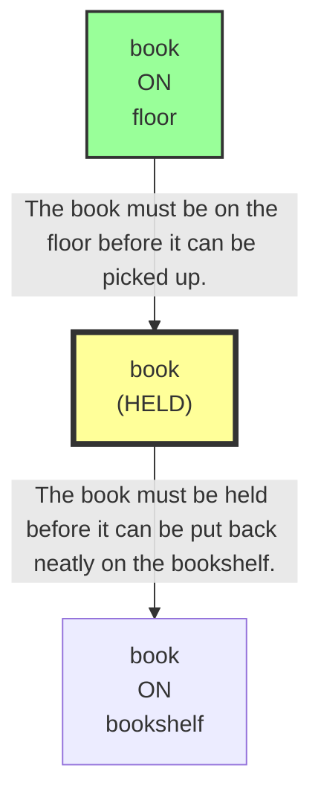
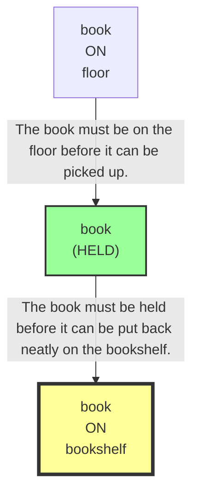
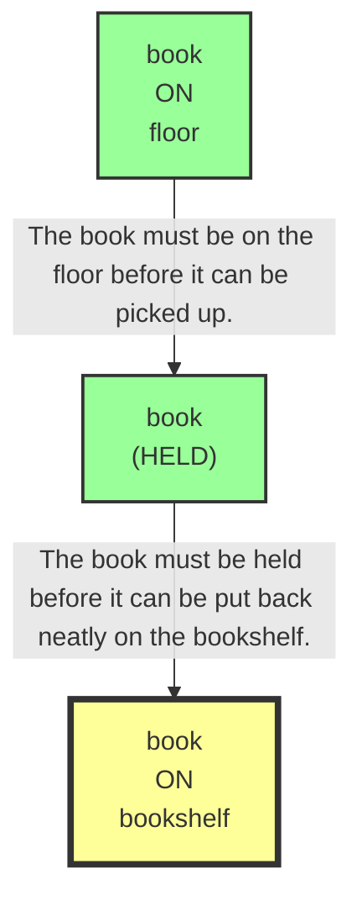
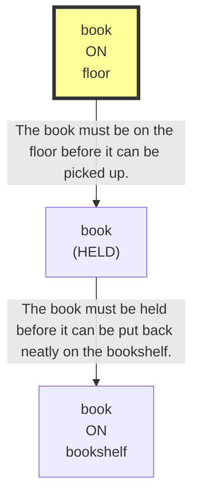

# 🚀 VirtualHome Agent Episode Log


### [GoalReasoner (Module A - Intent)] Output
```json
{
  "is_instruction_obviously_vague": false,
  "clarification_question": null,
  "target_object": "book",
  "location_hint": "floor",
  "reasoning_chain": [
    {
      "question": "Why does the user want this object?",
      "answer": "To recover the book after it has fallen."
    },
    {
      "question": "Why is that important?",
      "answer": "To restore it to an organized, tidy state."
    },
    {
      "question": "What fundamental need does this fulfill?",
      "answer": "The need to keep the environment orderly and prevent the book from remaining out of place."
    },
    {
      "question": "Are there any deeper psychological or physical motivations?",
      "answer": "It may reduce clutter, maintain neatness, and avoid the book being damaged or obstructing the floor."
    }
  ],
  "deep_intent": "The user wants to restore an item to an orderly and tidy state after it has fallen.",
  "acceptable_alternatives_properties": [
    {
      "priority": 1,
      "description": "Other loose lightweight items that have fallen, such as papers, notebooks, or magazines, which can be picked up and returned neatly."
    },
    {
      "priority": 2,
      "description": "Similar reading materials or flat household items that can be straightened or stacked neatly."
    },
    {
      "priority": 3,
      "description": "General small objects or clutter that can be gathered and organized."
    },
    {
      "priority": 4,
      "description": "Any household item that needs to be restored to a tidy, organized state."
    }
  ]
}
```

### [PerceptionFilter] Output
```json
{
  "reasoning": "Needed objects are the target book, the floor where it is currently located, and the bookshelf where it should be returned. No tools or alternate receptacles are required beyond these explicitly stated locations.",
  "selected_classes": [
    "bookshelf",
    "book",
    "paper",
    "character",
    "floor"
  ],
  "raw_class_count": 41
}
```

### [LLMExecutor] Output
```json
{
  "reasoning": "The SDG requires the book to be on the floor before it can be picked up. In the current graph, book(190), book(191), and book(268) are all on the floor in the living room. Since the task is to recover a book after it has fallen, the immediate next step is to approach one of the valid book instances. I will use book(190) as the physical binding for the target book and move toward it first, since grab requires proximity.",
  "satisfied_nodes": [
    "N1"
  ],
  "current_node_focus": "N2",
  "mapped_variables": {},
  "action": "[walk] <book> (190)"
}
```

### [RoboStateMultiTaskController] Output
```json
{
  "action": "[walk] <book> (190)",
  "active_task_id": "task_1",
  "task_context": {
    "active_task_id": "task_1",
    "pending_task_ids": [],
    "satisfied_task_ids": []
  },
  "source": "llm_executor"
}
```
## Step 0
- **Action**: `[walk] <book> (190)`
- **Action Success**: `True`
- **Action Message**: {'0': {'message': 'Success'}}
- **Active Task**: `task_1`
- **Decision Source**: `llm_executor`
- **Task Progress**: T5_G2_09_B3=pending
- **SDG Status**:

- **Observed Items (19)**: floor(336), floor(337), floor(338), floor(339), floor(340), floor(341), floor(342), floor(343), floor(344), bookshelf(370), paper(451), book(190) [CLOSED], book(191) [CLOSED], book(268) [CLOSED], character(1)...


### [PerceptionFilter] Output
```json
{
  "reasoning": "Reused cached class selection.",
  "selected_classes": [
    "bookshelf",
    "book",
    "paper",
    "character",
    "floor"
  ],
  "raw_class_count": 41
}
```

### [LLMExecutor] Output
```json
{
  "reasoning": "The target book is currently on the floor and we are already close to it. The next step in the SDG is to satisfy N2 by grabbing the book. Book(190) is a valid rebinding candidate because it matches the required class and is on the floor and close to the character.",
  "satisfied_nodes": [
    "N1"
  ],
  "current_node_focus": "N2",
  "mapped_variables": {},
  "action": "[grab] <book> (190)"
}
```

### [RoboStateMultiTaskController] Output
```json
{
  "action": "[grab] <book> (190)",
  "active_task_id": "task_1",
  "task_context": {
    "active_task_id": "task_1",
    "pending_task_ids": [],
    "satisfied_task_ids": []
  },
  "source": "llm_executor"
}
```
## Step 1
- **Action**: `[grab] <book> (190)`
- **Action Success**: `True`
- **Action Message**: {'0': {'message': 'Success'}}
- **Active Task**: `task_1`
- **Decision Source**: `llm_executor`
- **Task Progress**: T5_G2_09_B3=pending
- **SDG Status**:

- **Observed Items (19)**: floor(336), floor(337), floor(338), floor(339), floor(340), floor(341), floor(342), floor(343), floor(344), bookshelf(370), paper(451), book(190) [CLOSED], book(191) [CLOSED], book(268) [CLOSED], character(1)...


### [PerceptionFilter] Output
```json
{
  "reasoning": "Reused cached class selection.",
  "selected_classes": [
    "bookshelf",
    "book",
    "paper",
    "character",
    "floor"
  ],
  "raw_class_count": 41
}
```

### [LLMExecutor] Output
```json
{
  "reasoning": "The active task is to restore a book from the floor to the bookshelf. The SDG shows N1 (book on floor) -> N2 (book held) -> N3 (book on bookshelf). In the current graph, book(191) and book(268) are on the floor, but the robot is already holding book(190) in the right hand. Since N2 is the immediate prerequisite for placing the book on the bookshelf, the current focus is to satisfy the held state with the already held book, then the next step will be to walk to the bookshelf and put it back. No additional movement is needed before updating the held-state focus because the book is already in hand.",
  "satisfied_nodes": [
    "N2"
  ],
  "current_node_focus": "N3",
  "mapped_variables": {},
  "action": "[walk] <bookshelf> (370)"
}
```

### [RoboStateMultiTaskController] Output
```json
{
  "action": "[walk] <bookshelf> (370)",
  "active_task_id": "task_1",
  "task_context": {
    "active_task_id": "task_1",
    "pending_task_ids": [],
    "satisfied_task_ids": []
  },
  "source": "llm_executor"
}
```
## Step 2
- **Action**: `[walk] <bookshelf> (370)`
- **Action Success**: `True`
- **Action Message**: {'0': {'message': 'Success'}}
- **Active Task**: `task_1`
- **Decision Source**: `llm_executor`
- **Task Progress**: T5_G2_09_B3=pending
- **SDG Status**:

- **Observed Items (19)**: floor(336), floor(337), floor(338), floor(339), floor(340), floor(341), floor(342), floor(343), floor(344), bookshelf(370), paper(451), book(190) [CLOSED], book(191) [CLOSED], book(268) [CLOSED], character(1)...


### [PerceptionFilter] Output
```json
{
  "reasoning": "Reused cached class selection.",
  "selected_classes": [
    "bookshelf",
    "book",
    "paper",
    "character",
    "floor"
  ],
  "raw_class_count": 41
}
```

### [LLMExecutor] Output
```json
{
  "reasoning": "The book is already held in the right hand (N2 satisfied via current graph: HOLDS_RH book(190)), and we are already close to the bookshelf(370). The next step toward placing the book neatly on the bookshelf is to put it onto the bookshelf surface. Since putback requires being near the destination and the robot is already close, the correct next atomic action is to place the held book on the bookshelf, which will satisfy the final goal node N3.",
  "satisfied_nodes": [
    "N2"
  ],
  "current_node_focus": "N3",
  "mapped_variables": {
    "?Shelf": "bookshelf(370)"
  },
  "action": "[putback] <book> (190) <bookshelf> (370)"
}
```

### [RoboStateMultiTaskController] Output
```json
{
  "action": "[putback] <book> (190) <bookshelf> (370)",
  "active_task_id": "task_1",
  "task_context": {
    "active_task_id": "task_1",
    "pending_task_ids": [],
    "satisfied_task_ids": []
  },
  "source": "llm_executor"
}
```
## Step 3
- **Action**: `[putback] <book> (190) <bookshelf> (370)`
- **Action Success**: `False`
- **Action Message**: {'0': {'message': 'ScriptExcutor 0: EXECUTION_GENERAL: Script is impossible to execute\n\n'}}
- **Active Task**: `task_1`
- **Decision Source**: `llm_executor`
- **Task Progress**: T5_G2_09_B3=pending
- **SDG Status**:

- **Observed Items (19)**: floor(336), floor(337), floor(338), floor(339), floor(340), floor(341), floor(342), floor(343), floor(344), bookshelf(370), paper(451), book(190) [CLOSED], book(191) [CLOSED], book(268) [CLOSED], character(1)...


### [PerceptionFilter] Output
```json
{
  "reasoning": "Reused cached class selection.",
  "selected_classes": [
    "bookshelf",
    "book",
    "paper",
    "character",
    "floor"
  ],
  "raw_class_count": 41
}
```

### [LLMExecutor] Output
```json
{
  "reasoning": "The previous putback failed because the bookshelf is a container/surface but the engine rejected the exact placement; however the book is still held, and the SDG goal is to place the book on the bookshelf. Since the book is currently held in the right hand and the bookshelf is close, the next atomic step is to retry the placement onto the bookshelf. The book remains the correct target object and the bookshelf remains the correct destination.",
  "satisfied_nodes": [
    "N1",
    "N2"
  ],
  "current_node_focus": "N3",
  "mapped_variables": {
    "?Container": "bookshelf(370)"
  },
  "action": "[putback] <book> (190) <bookshelf> (370)"
}
```

### [RoboStateMultiTaskController] Output
```json
{
  "action": "[putback] <book> (190) <bookshelf> (370)",
  "active_task_id": "task_1",
  "task_context": {
    "active_task_id": "task_1",
    "pending_task_ids": [],
    "satisfied_task_ids": []
  },
  "source": "llm_executor"
}
```
## Step 4
- **Action**: `[putback] <book> (190) <bookshelf> (370)`
- **Action Success**: `False`
- **Action Message**: {'0': {'message': 'ScriptExcutor 0: EXECUTION_GENERAL: Script is impossible to execute\n\n'}}
- **Active Task**: `task_1`
- **Decision Source**: `llm_executor`
- **Task Progress**: T5_G2_09_B3=pending
- **SDG Status**:

- **Observed Items (19)**: floor(336), floor(337), floor(338), floor(339), floor(340), floor(341), floor(342), floor(343), floor(344), bookshelf(370), paper(451), book(190) [CLOSED], book(191) [CLOSED], book(268) [CLOSED], character(1)...


### [RoboStateMultiTaskController] Output
```json
{
  "action": "[walk] <bathroom> (11)",
  "active_task_id": null,
  "task_context": {
    "active_task_id": null,
    "pending_task_ids": [
      "task_1"
    ],
    "satisfied_task_ids": []
  },
  "source": "loop_recovery_room_revisit"
}
```
## Step 5
- **Action**: `[walk] <bathroom> (11)`
- **Action Success**: `True`
- **Action Message**: {'0': {'message': 'Success'}}
- **Decision Source**: `loop_recovery_room_revisit`
- **Task Progress**: T5_G2_09_B3=pending
- **SDG Status**:
No SDG active.
- **Observed Items (82)**: floor(336), floor(337), floor(338), floor(339), floor(340), floor(341), floor(342), floor(343), floor(344), wall(345), wall(346), wall(347), wall(348), wall(349), wall(350)...


### [PerceptionFilter] Output
```json
{
  "reasoning": "The goal is to recover a fallen book from the floor and place it back on a bookshelf. Per the SDG, the necessary classes are the target book, the floor where it is currently located, and the bookshelf where it should be returned.",
  "selected_classes": [
    "bookshelf",
    "book",
    "paper",
    "character",
    "floor"
  ],
  "raw_class_count": 63
}
```

### [LLMExecutor] Output
```json
{
  "reasoning": "The original book(190) is currently held by the character in the bathroom, so it is not on the floor and is unavailable for the floor-to-bookshelf path. In the current graph, book(191) is the best match for the desired fallen book: it is a grabbable closed book, on the floor, and close to the character in the living room. To progress toward N2, the next atomic step is to walk to that book so it can be grabbed next.",
  "satisfied_nodes": [],
  "current_node_focus": "N1",
  "mapped_variables": {
    "?TargetBook": "book(191)"
  },
  "action": "[walk] <book> (191)"
}
```

### [RoboStateMultiTaskController] Output
```json
{
  "action": "[walk] <book> (191)",
  "active_task_id": "task_1",
  "task_context": {
    "active_task_id": "task_1",
    "pending_task_ids": [],
    "satisfied_task_ids": []
  },
  "source": "llm_executor"
}
```
## Step 6
- **Action**: `[walk] <book> (191)`
- **Action Success**: `True`
- **Action Message**: {'0': {'message': 'Success'}}
- **Active Task**: `task_1`
- **Decision Source**: `llm_executor`
- **Task Progress**: T5_G2_09_B3=pending
- **SDG Status**:

- **Observed Items (25)**: floor(336), floor(337), floor(338), floor(339), floor(340), floor(341), floor(342), floor(343), floor(344), bookshelf(370), paper(451), book(190) [CLOSED], book(191) [CLOSED], book(268) [CLOSED], character(1)...


### [PerceptionFilter] Output
```json
{
  "reasoning": "Reused cached class selection.",
  "selected_classes": [
    "bookshelf",
    "book",
    "paper",
    "character",
    "floor"
  ],
  "raw_class_count": 63
}
```

### [LLMExecutor] Output
```json
{
  "reasoning": "The goal is to satisfy the book task by getting a book from the floor into the bookshelf. The previously tried book(190) is currently held by the character, so the best next step is to place it on the bookshelf. The bookshelf is already close, and the prior putback failed likely due to a transient execution issue rather than a planning issue. I will retry the required placement action to progress toward N3.",
  "satisfied_nodes": [
    "N1",
    "N2"
  ],
  "current_node_focus": "N3",
  "mapped_variables": {},
  "action": "[putback] <book> (190) <bookshelf> (370)"
}
```

### [RoboStateMultiTaskController] Output
```json
{
  "action": "[putback] <book> (190) <bookshelf> (370)",
  "active_task_id": "task_1",
  "task_context": {
    "active_task_id": "task_1",
    "pending_task_ids": [],
    "satisfied_task_ids": []
  },
  "source": "llm_executor"
}
```
## Step 7
- **Action**: `[putback] <book> (190) <bookshelf> (370)`
- **Action Success**: `False`
- **Action Message**: {'0': {'message': 'ScriptExcutor 0: EXECUTION_GENERAL: Script is impossible to execute\n\n'}}
- **Active Task**: `task_1`
- **Decision Source**: `llm_executor`
- **Task Progress**: T5_G2_09_B3=pending
- **SDG Status**:

- **Observed Items (25)**: floor(336), floor(337), floor(338), floor(339), floor(340), floor(341), floor(342), floor(343), floor(344), bookshelf(370), paper(451), book(190) [CLOSED], book(191) [CLOSED], book(268) [CLOSED], character(1)...


### [PerceptionFilter] Output
```json
{
  "reasoning": "Reused cached class selection.",
  "selected_classes": [
    "bookshelf",
    "book",
    "paper",
    "character",
    "floor"
  ],
  "raw_class_count": 63
}
```

### [LLMExecutor] Output
```json
{
  "reasoning": "The SDG requires the book to be held, then placed on the bookshelf. We already hold book(190) in the right hand, and the bookshelf is a valid surface/container and is close to the character. The previous putback attempts were impossible, likely because the book is currently closed and may need to be treated as an item to place rather than opened. Since placing onto a bookshelf requires being near it and we are already close, the next step is to attempt the correct placement action onto the bookshelf.",
  "satisfied_nodes": [
    "N2"
  ],
  "current_node_focus": "N3",
  "mapped_variables": {},
  "action": "[putback] <book> (190) <bookshelf> (370)"
}
```

### [RoboStateMultiTaskController] Output
```json
{
  "action": "[putback] <book> (190) <bookshelf> (370)",
  "active_task_id": "task_1",
  "task_context": {
    "active_task_id": "task_1",
    "pending_task_ids": [],
    "satisfied_task_ids": []
  },
  "source": "llm_executor"
}
```
## Step 8
- **Action**: `[putback] <book> (190) <bookshelf> (370)`
- **Action Success**: `False`
- **Action Message**: {'0': {'message': 'ScriptExcutor 0: EXECUTION_GENERAL: Script is impossible to execute\n\n'}}
- **Active Task**: `task_1`
- **Decision Source**: `llm_executor`
- **Task Progress**: T5_G2_09_B3=pending
- **SDG Status**:

- **Observed Items (25)**: floor(336), floor(337), floor(338), floor(339), floor(340), floor(341), floor(342), floor(343), floor(344), bookshelf(370), paper(451), book(190) [CLOSED], book(191) [CLOSED], book(268) [CLOSED], character(1)...


### [RoboStateMultiTaskController] Output
```json
{
  "action": "[walk] <bedroom> (73)",
  "active_task_id": null,
  "task_context": {
    "active_task_id": null,
    "pending_task_ids": [
      "task_1"
    ],
    "satisfied_task_ids": []
  },
  "source": "loop_recovery_room_revisit"
}
```
## Step 9
- **Action**: `[walk] <bedroom> (73)`
- **Action Success**: `True`
- **Action Message**: {'0': {'message': 'Success'}}
- **Decision Source**: `loop_recovery_room_revisit`
- **Task Progress**: T5_G2_09_B3=pending
- **SDG Status**:
No SDG active.
- **Observed Items (143)**: floor(336), floor(337), floor(338), floor(339), floor(340), floor(341), floor(342), floor(343), floor(344), wall(345), wall(346), wall(347), wall(348), wall(349), wall(350)...


### [PerceptionFilter] Output
```json
{
  "reasoning": "The goal is to recover a fallen book from the floor and return it to the bookshelf. So the only necessary classes are the target object, its source location on the floor, and the destination bookshelf.",
  "selected_classes": [
    "bookshelf",
    "book",
    "paper",
    "character",
    "floor"
  ],
  "raw_class_count": 70
}
```

### [LLMExecutor] Output
```json
{
  "reasoning": "The previous putback attempts failed because the book currently held is book(190), but the only reachable bookshelf in the current graph is bookshelf(105) in the bedroom, which is a valid surface/container. Since the book is already held and we are in the bedroom, the next required step is to move near the correct bookshelf before attempting placement again. N1 is no longer satisfied because the task progressed past the floor pickup stage; N2 is satisfied because book(190) is held. The next action should therefore prepare for N3 by walking to bookshelf(105).",
  "satisfied_nodes": [
    "N2"
  ],
  "current_node_focus": "N3",
  "mapped_variables": {
    "?Container": "bookshelf(105)"
  },
  "action": "[walk] <bookshelf> (105)"
}
```

### [RoboStateMultiTaskController] Output
```json
{
  "action": "[walk] <bookshelf> (105)",
  "active_task_id": "task_1",
  "task_context": {
    "active_task_id": "task_1",
    "pending_task_ids": [],
    "satisfied_task_ids": []
  },
  "source": "llm_executor"
}
```
## Step 10
- **Action**: `[walk] <bookshelf> (105)`
- **Action Success**: `True`
- **Action Message**: {'0': {'message': 'Success'}}
- **Active Task**: `task_1`
- **Decision Source**: `llm_executor`
- **Task Progress**: T5_G2_09_B3=pending
- **SDG Status**:

- **Observed Items (35)**: floor(336), floor(337), floor(338), floor(339), floor(340), floor(341), floor(342), floor(343), floor(344), bookshelf(370), paper(451), book(190) [CLOSED], book(191) [CLOSED], book(268) [CLOSED], character(1)...


### [PerceptionFilter] Output
```json
{
  "reasoning": "Reused cached class selection.",
  "selected_classes": [
    "bookshelf",
    "book",
    "paper",
    "character",
    "floor"
  ],
  "raw_class_count": 70
}
```

### [LLMExecutor] Output
```json
{
  "reasoning": "The prior book(190) is no longer the correct current binding for the task because the current graph shows book(190) is held by the character, while the SDG requires a book that is ON the floor before it can be picked up. The best matching target is book(191), which is currently ON floor(336) in the living room and close to the character. Since the next unsatisfied node is N2 (book held), I should now grab the floor book to satisfy that prerequisite and progress toward placing it on the bookshelf.",
  "satisfied_nodes": [
    "N1"
  ],
  "current_node_focus": "N2",
  "mapped_variables": {},
  "action": "[grab] <book> (191)"
}
```

### [RoboStateMultiTaskController] Output
```json
{
  "action": "[grab] <book> (191)",
  "active_task_id": "task_1",
  "task_context": {
    "active_task_id": "task_1",
    "pending_task_ids": [],
    "satisfied_task_ids": []
  },
  "source": "llm_executor"
}
```
## Step 11
- **Action**: `[grab] <book> (191)`
- **Action Success**: `True`
- **Action Message**: {'0': {'message': 'Success'}}
- **Active Task**: `task_1`
- **Decision Source**: `llm_executor`
- **Task Progress**: T5_G2_09_B3=pending
- **SDG Status**:

- **Observed Items (35)**: floor(336), floor(337), floor(338), floor(339), floor(340), floor(341), floor(342), floor(343), floor(344), bookshelf(370), paper(451), book(190) [CLOSED], book(191) [CLOSED], book(268) [CLOSED], character(1)...


### [PerceptionFilter] Output
```json
{
  "reasoning": "Reused cached class selection.",
  "selected_classes": [
    "bookshelf",
    "book",
    "paper",
    "character",
    "floor"
  ],
  "raw_class_count": 70
}
```

### [LLMExecutor] Output
```json
{
  "reasoning": "The current SDG requires the book to be held before it can be put on the bookshelf. In the current graph, I am already holding book(191) in the right hand and the bedroom bookshelf(105) is close. The previous failures were due to using stale book ID 190 on the wrong bookshelf; the correct currently visible target shelf is bookshelf(105) in the bedroom. The next atomic step is to move to that bookshelf so the held book can be placed there on the following action.",
  "satisfied_nodes": [
    "N2"
  ],
  "current_node_focus": "N3",
  "mapped_variables": {
    "?Container": "bookshelf(105)"
  },
  "action": "[walk] <bookshelf> (105)"
}
```

### [RoboStateMultiTaskController] Output
```json
{
  "action": "[walk] <bookshelf> (105)",
  "active_task_id": "task_1",
  "task_context": {
    "active_task_id": "task_1",
    "pending_task_ids": [],
    "satisfied_task_ids": []
  },
  "source": "llm_executor"
}
```
## Step 12
- **Action**: `[walk] <bookshelf> (105)`
- **Action Success**: `True`
- **Action Message**: {'0': {'message': 'Success'}}
- **Active Task**: `task_1`
- **Decision Source**: `llm_executor`
- **Task Progress**: T5_G2_09_B3=pending
- **SDG Status**:

- **Observed Items (35)**: floor(336), floor(337), floor(338), floor(339), floor(340), floor(341), floor(342), floor(343), floor(344), bookshelf(370), paper(451), book(190) [CLOSED], book(191) [CLOSED], book(268) [CLOSED], character(1)...


### [PerceptionFilter] Output
```json
{
  "reasoning": "Reused cached class selection.",
  "selected_classes": [
    "bookshelf",
    "book",
    "paper",
    "character",
    "floor"
  ],
  "raw_class_count": 70
}
```

### [LLMExecutor] Output
```json
{
  "reasoning": "The target book should be the one currently on the floor in the living room, which is book(268). The previous book IDs 190/191 are now held by the character and are not the floor book needed for N1. To satisfy the first SDG node, the next step is to grab the floor book. We are already close to book(268), so no additional walk is needed.",
  "satisfied_nodes": [],
  "current_node_focus": "N1",
  "mapped_variables": {},
  "action": "[grab] <book> (268)"
}
```

### [RoboStateMultiTaskController] Output
```json
{
  "action": "[grab] <book> (268)",
  "active_task_id": "task_1",
  "task_context": {
    "active_task_id": "task_1",
    "pending_task_ids": [],
    "satisfied_task_ids": []
  },
  "source": "llm_executor"
}
```
## Step 13
- **Action**: `[grab] <book> (268)`
- **Action Success**: `False`
- **Action Message**: {'0': {'message': 'ScriptExcutor 0: EXECUTION_GENERAL: Script is impossible to execute\n\n'}}
- **Active Task**: `task_1`
- **Decision Source**: `llm_executor`
- **Task Progress**: T5_G2_09_B3=pending
- **SDG Status**:

- **Observed Items (35)**: floor(336), floor(337), floor(338), floor(339), floor(340), floor(341), floor(342), floor(343), floor(344), bookshelf(370), paper(451), book(190) [CLOSED], book(191) [CLOSED], book(268) [CLOSED], character(1)...


### [PerceptionFilter] Output
```json
{
  "reasoning": "Reused cached class selection.",
  "selected_classes": [
    "bookshelf",
    "book",
    "paper",
    "character",
    "floor"
  ],
  "raw_class_count": 70
}
```

### [LLMExecutor] Output
```json
{
  "reasoning": "The current goal is to place a book that is on the floor back onto the bookshelf. The Filtered Graph shows book(268) is the only book currently ON floor(336) in the livingroom and CLOSE to the character, while the bookshelf(370) is also CLOSE and is the best valid destination. Since the SDG requires the book to be HELD before it can be put on the bookshelf, and the character is already near book(268), the next atomic step should be to grab that book. The prior failed putback attempts were impossible because the book was not yet held, so we now rebind to the currently floor-located book(268).",
  "satisfied_nodes": [
    "N1"
  ],
  "current_node_focus": "N2",
  "mapped_variables": {
    "?Book": "book(268)",
    "?Bookshelf": "bookshelf(370)"
  },
  "action": "[grab] <book> (268)"
}
```

### [RoboStateMultiTaskController] Output
```json
{
  "action": "[grab] <book> (268)",
  "active_task_id": "task_1",
  "task_context": {
    "active_task_id": "task_1",
    "pending_task_ids": [],
    "satisfied_task_ids": []
  },
  "source": "llm_executor"
}
```
## Step 14
- **Action**: `[grab] <book> (268)`
- **Action Success**: `False`
- **Action Message**: {'0': {'message': 'ScriptExcutor 0: EXECUTION_GENERAL: Script is impossible to execute\n\n'}}
- **Active Task**: `task_1`
- **Decision Source**: `llm_executor`
- **Task Progress**: T5_G2_09_B3=pending
- **SDG Status**:

- **Observed Items (35)**: floor(336), floor(337), floor(338), floor(339), floor(340), floor(341), floor(342), floor(343), floor(344), bookshelf(370), paper(451), book(190) [CLOSED], book(191) [CLOSED], book(268) [CLOSED], character(1)...

