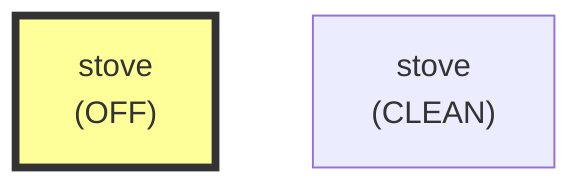

# 🚀 VirtualHome Agent Episode Log


### [GoalReasoner (Module A - Intent)] Output
```json
{
  "is_instruction_obviously_vague": false,
  "clarification_question": null,
  "target_object": "stove",
  "location_hint": "kitchen",
  "reasoning_chain": [
    {
      "question": "Why does the user want this object?",
      "answer": "To ensure the stove is safe when no one is in the kitchen."
    },
    {
      "question": "Why is that important?",
      "answer": "To prevent hazardous conditions such as accidental heating or fire risk."
    },
    {
      "question": "What fundamental need does this fulfill?",
      "answer": "To maintain household safety and reduce the risk of accidents."
    },
    {
      "question": "Are there any deeper psychological or physical motivations?",
      "answer": "The user likely wants peace of mind and physical protection for people and property."
    }
  ],
  "deep_intent": "The user wants to ensure household safety and prevent hazards.",
  "acceptable_alternatives_properties": [
    {
      "priority": 1,
      "description": "Other household appliances or heat sources that could pose a safety risk, such as an oven, toaster, or space heater, if the stove is unavailable."
    },
    {
      "priority": 2,
      "description": "Kitchen safety checks for other potentially hazardous devices or surfaces in the same area."
    },
    {
      "priority": 3,
      "description": "General home safety actions that reduce fire or injury risk."
    },
    {
      "priority": 4,
      "description": "Any action that helps protect people and property from accidental heat-related hazards."
    }
  ]
}
```

### [PerceptionFilter] Output
```json
{
  "reasoning": "The goal is to ensure the stove is OFF and CLEAN in the kitchen, so the target stove must be kept. To clean it safely, the relevant tools and nearby kitchen washing resources are sink, faucet, dishwashingliquid, washingsponge, and cloth-equivalent cleaning support if present; here washingsponge and dishwashingliquid are the needed cleaning tools, with sink/faucet as the washing location. Because the intent mentions household safety and alternative heat sources that could pose risk, retain other heat-producing kitchen appliances that can also be safety hazards: microwave, toaster, coffeemaker, and fryingpan as a hot cooking item. Location/furniture explicitly relevant to the kitchen context are kept minimally only where needed for the task.",
  "selected_classes": [
    "toaster",
    "dishwashingliquid",
    "coffeemaker",
    "washingsponge",
    "faucet",
    "character",
    "stove",
    "microwave",
    "fryingpan",
    "sink"
  ],
  "raw_class_count": 54
}
```

### [LLMExecutor] Output
```json
{
  "reasoning": "The active goal is to make the stove OFF and CLEAN. In the current graph, stove(311) is in the kitchen and currently ON and CLOSED, so the immediate missing requirement is to turn it OFF. Since no prior actions have been taken, the next atomic step is to move near the stove before interacting with its switch.",
  "satisfied_nodes": [],
  "current_node_focus": "N1",
  "mapped_variables": {},
  "action": "[walk] <stove> (311)"
}
```

### [RoboStateMultiTaskController] Output
```json
{
  "action": "[walk] <stove> (311)",
  "active_task_id": "task_1",
  "task_context": {
    "active_task_id": "task_1",
    "pending_task_ids": [],
    "satisfied_task_ids": []
  },
  "source": "llm_executor"
}
```
## Step 0
- **Action**: `[walk] <stove> (311)`
- **Action Success**: `True`
- **Action Message**: {'0': {'message': 'Success'}}
- **Active Task**: `task_1`
- **Decision Source**: `llm_executor`
- **Task Progress**: T5_G2_10_B0=pending
- **SDG Status**:

- **Observed Items (14)**: sink(247), faucet(248) [OFF], washingsponge(266), dishwashingliquid(267), fryingpan(269), coffeemaker(306) [OFF], toaster(308) [OFF], stove(311) [CLOSED,ON], microwave(313) [CLOSED,OFF], character(1), bathroom(11), bedroom(73), kitchen(205), livingroom(335)


### [PerceptionFilter] Output
```json
{
  "reasoning": "Reused cached class selection.",
  "selected_classes": [
    "toaster",
    "dishwashingliquid",
    "coffeemaker",
    "washingsponge",
    "faucet",
    "character",
    "stove",
    "microwave",
    "fryingpan",
    "sink"
  ],
  "raw_class_count": 54
}
```

### [LLMExecutor] Output
```json
{
  "reasoning": "The stove is already in the kitchen and currently CLOSE to the character. Its state is ON and CLOSED, while the goal requires it to be OFF and CLEAN. Since it is already nearby, the next unmet prerequisite toward safety is to turn it off before any cleaning-related step. The stove has a switch property, so switching it off is the correct immediate action.",
  "satisfied_nodes": [],
  "current_node_focus": "N1",
  "mapped_variables": {
    "?Target": "stove(311)"
  },
  "action": "[switchoff] <stove> (311)"
}
```

### [RoboStateMultiTaskController] Output
```json
{
  "action": "[switchoff] <stove> (311)",
  "active_task_id": "task_1",
  "task_context": {
    "active_task_id": "task_1",
    "pending_task_ids": [],
    "satisfied_task_ids": []
  },
  "source": "llm_executor"
}
```
## Step 1
- **Action**: `[switchoff] <stove> (311)`
- **Action Success**: `True`
- **Action Message**: Faked switch operation in Python layer (bypassed Unity failure)
- **Active Task**: `task_1`
- **Decision Source**: `llm_executor`
- **Task Progress**: T5_G2_10_B0=done
- **SDG Status**:

- **Observed Items (14)**: sink(247), faucet(248) [OFF], washingsponge(266), dishwashingliquid(267), fryingpan(269), coffeemaker(306) [OFF], toaster(308) [OFF], stove(311) [CLOSED,ON], microwave(313) [CLOSED,OFF], character(1), bathroom(11), bedroom(73), kitchen(205), livingroom(335)

