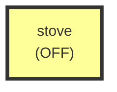

# 🚀 VirtualHome Agent Episode Log


### [GoalReasoner (Module A - Intent)] Output
```json
{
  "is_instruction_obviously_vague": true,
  "clarification_question": "What exact safe state should I set the stove to?",
  "target_object": "stove",
  "location_hint": "kitchen",
  "reasoning_chain": [
    {
      "question": "Why does the user want this object?",
      "answer": "To ensure the stove is safe when no one is in the kitchen."
    },
    {
      "question": "Why is that important?",
      "answer": "To prevent hazards associated with an unattended stove."
    },
    {
      "question": "What fundamental need does this fulfill?",
      "answer": "The user wants to maintain safety in the kitchen."
    },
    {
      "question": "Are there any deeper psychological or physical motivations?",
      "answer": "A likely motivation is to reduce risk of fire, heat exposure, or accidental operation."
    }
  ],
  "deep_intent": "The user wants to maintain kitchen safety by ensuring a cooking appliance is left in a non-hazardous state.",
  "acceptable_alternatives_properties": [
    {
      "priority": 1,
      "description": "Other kitchen appliances or heat sources that should be turned off or left in a safe state, such as an oven or hot plate"
    },
    {
      "priority": 2,
      "description": "Nearby cooking equipment that can be secured to reduce hazard, such as burner controls or appliance switches"
    },
    {
      "priority": 3,
      "description": "Household safety-related checks in the kitchen, such as confirming heat sources are off and clear of flammables"
    },
    {
      "priority": 4,
      "description": "General home safety actions that reduce the risk of unattended hazards in an indoor space"
    }
  ]
}
```

### [RoboStateMultiTaskController] Output
```json
{
  "action": "[ask] What exact safe state should I set the stove to?",
  "active_task_id": "task_1",
  "task_context": {
    "active_task_id": "task_1",
    "pending_task_ids": [],
    "satisfied_task_ids": []
  },
  "source": "goal_reasoner_clarification"
}
```
## Step 0
- **Action**: `[ask] What exact safe state should I set the stove to?`
- **Action Success**: `True`
- **Action Message**: Turn it off.
- **Active Task**: `task_1`
- **Decision Source**: `goal_reasoner_clarification`
- **Task Progress**: T5_G2_10_B2=pending
- **SDG Status**:
No SDG active.
- **Observed Items (112)**: floor(206), floor(207), floor(208), floor(209), floor(210), floor(211), wall(212), wall(213), wall(214), wall(215), wall(216), wall(217), ceiling(218), ceiling(219), ceiling(220)...


### [GoalReasoner (Module A - Intent)] Output
```json
{
  "is_instruction_obviously_vague": false,
  "clarification_question": null,
  "target_object": "stove",
  "location_hint": "kitchen",
  "reasoning_chain": [
    {
      "question": "Why does the user want this object?",
      "answer": "To ensure the stove is not actively heating when the kitchen is empty."
    },
    {
      "question": "Why is that important?",
      "answer": "To reduce the risk of fire, burns, or wasted energy."
    },
    {
      "question": "What fundamental need does this fulfill?",
      "answer": "The user wants to maintain safety in the kitchen."
    },
    {
      "question": "Are there any deeper psychological or physical motivations?",
      "answer": "Likely to prevent accidents and create peace of mind by confirming the stove is in a safe state."
    }
  ],
  "deep_intent": "The user wants to ensure kitchen safety by stopping an active heat source when unattended.",
  "acceptable_alternatives_properties": [
    {
      "priority": 1,
      "description": "Other ways to make an active cooking heat source safe, such as turning off burners or an oven if those are the relevant appliances."
    },
    {
      "priority": 2,
      "description": "Other household actions that prevent kitchen hazards, such as unplugging a nearby risky appliance if it is the source of danger."
    },
    {
      "priority": 3,
      "description": "General safety checks for cooking areas, such as confirming heat-producing devices are no longer active."
    },
    {
      "priority": 4,
      "description": "Any action that prevents accidental heating-related harm in the kitchen, such as ensuring the area is unattended only after the heat source is off."
    }
  ]
}
```

### [PerceptionFilter] Output
```json
{
  "reasoning": "The goal is to ensure the stove is OFF in the kitchen. The only required target object is the stove itself; no additional tools or alternative appliances are needed because the SDG only requires checking/changing the stove’s state to OFF.",
  "selected_classes": [
    "character",
    "stove"
  ],
  "raw_class_count": 54
}
```

### [LLMExecutor] Output
```json
{
  "reasoning": "The active task is to set the stove to OFF. The filtered graph shows stove(311) is in the kitchen and currently ON. Because switching requires proximity, and we are already inside the kitchen, the correct next step is to turn the stove off.",
  "satisfied_nodes": [],
  "current_node_focus": "N1",
  "mapped_variables": {},
  "action": "[switchoff] <stove> (311)"
}
```

### [RoboStateMultiTaskController] Output
```json
{
  "action": "[walk] <stove> (311)",
  "active_task_id": "task_1",
  "task_context": {
    "active_task_id": "task_1",
    "pending_task_ids": [],
    "satisfied_task_ids": []
  },
  "source": "llm_executor_repaired"
}
```
## Step 1
- **Action**: `[walk] <stove> (311)`
- **Action Success**: `True`
- **Action Message**: {'0': {'message': 'Success'}}
- **Active Task**: `task_1`
- **Decision Source**: `llm_executor_repaired`
- **Task Progress**: T5_G2_10_B2=pending
- **SDG Status**:

- **Observed Items (6)**: stove(311) [ON,CLOSED], character(1), bathroom(11), bedroom(73), kitchen(205), livingroom(335)


### [PerceptionFilter] Output
```json
{
  "reasoning": "Reused cached class selection.",
  "selected_classes": [
    "character",
    "stove"
  ],
  "raw_class_count": 54
}
```

### [LLMExecutor] Output
```json
{
  "reasoning": "The active goal is to make the stove OFF. The current graph shows stove(311) is CLOSE to the character, has a switch, and is currently ON. Since I am already near it and the task is simply to turn it off, the next atomic action should directly switch it off.",
  "satisfied_nodes": [],
  "current_node_focus": "N1",
  "mapped_variables": {},
  "action": "[switchoff] <stove> (311)"
}
```

### [RoboStateMultiTaskController] Output
```json
{
  "action": "[switchoff] <stove> (311)",
  "active_task_id": "task_1",
  "task_context": {
    "active_task_id": "task_1",
    "pending_task_ids": [],
    "satisfied_task_ids": []
  },
  "source": "llm_executor"
}
```
## Step 2
- **Action**: `[switchoff] <stove> (311)`
- **Action Success**: `True`
- **Action Message**: Faked switch operation in Python layer (bypassed Unity failure)
- **Active Task**: `task_1`
- **Decision Source**: `llm_executor`
- **Task Progress**: T5_G2_10_B2=done
- **SDG Status**:

- **Observed Items (6)**: stove(311) [ON,CLOSED], character(1), bathroom(11), bedroom(73), kitchen(205), livingroom(335)

