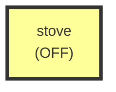

# 🚀 VirtualHome Agent Episode Log


### [GoalReasoner (Module A - Intent)] Output
```json
{
  "is_instruction_obviously_vague": true,
  "clarification_question": "What specific safe state should the stove be set to?",
  "target_object": "stove",
  "location_hint": "kitchen",
  "reasoning_chain": [
    {
      "question": "Why does the user want this object?",
      "answer": "To make the stove safe when the kitchen is empty."
    },
    {
      "question": "Why is that important?",
      "answer": "To prevent hazards such as accidental heating, fire, or energy use."
    },
    {
      "question": "What fundamental need does this fulfill?",
      "answer": "It fulfills the need to maintain household safety."
    },
    {
      "question": "Are there any deeper psychological or physical motivations?",
      "answer": "The user likely wants peace of mind and to reduce the risk of injury or property damage."
    }
  ],
  "deep_intent": "maintain household safety",
  "acceptable_alternatives_properties": [
    {
      "priority": 1,
      "description": "Other kitchen appliances or heat sources that can be placed in a safe off state, such as an oven or hot plate"
    },
    {
      "priority": 2,
      "description": "Nearby cooking equipment that can be checked for a safe, inactive state"
    },
    {
      "priority": 3,
      "description": "Any household hazard source that can be verified as turned off and safe"
    },
    {
      "priority": 4,
      "description": "Actions that reduce risk in the home, such as ensuring appliances are off and no active heat source remains"
    }
  ]
}
```

### [RoboStateMultiTaskController] Output
```json
{
  "action": "[ask] What specific safe state should the stove be set to?",
  "active_task_id": "task_1",
  "task_context": {
    "active_task_id": "task_1",
    "pending_task_ids": [],
    "satisfied_task_ids": []
  },
  "source": "goal_reasoner_clarification"
}
```
## Step 0
- **Action**: `[ask] What specific safe state should the stove be set to?`
- **Action Success**: `True`
- **Action Message**: Turn it off.
- **Active Task**: `task_1`
- **Decision Source**: `goal_reasoner_clarification`
- **Task Progress**: T5_G2_10_B3=pending
- **SDG Status**:
No SDG active.
- **Observed Items (112)**: floor(206), floor(207), floor(208), floor(209), floor(210), floor(211), wall(212), wall(213), wall(214), wall(215), wall(216), wall(217), ceiling(218), ceiling(219), ceiling(220)...


### [GoalReasoner (Module A - Intent)] Output
```json
{
  "is_instruction_obviously_vague": false,
  "clarification_question": null,
  "target_object": "stove",
  "location_hint": "kitchen",
  "reasoning_chain": [
    {
      "question": "Why does the user want this object?",
      "answer": "To turn it off if the kitchen is empty."
    },
    {
      "question": "Why is that important?",
      "answer": "To make sure the environment is safe."
    },
    {
      "question": "What fundamental need does this fulfill?",
      "answer": "The user wants to reduce hazard and prevent accidental harm."
    },
    {
      "question": "Are there any deeper psychological or physical motivations?",
      "answer": "The instruction reflects concern for safety and prevention of fire or injury."
    }
  ],
  "deep_intent": "The user wants to ensure safety by shutting off an unattended heat source.",
  "acceptable_alternatives_properties": [
    {
      "priority": 1,
      "description": "Other ways to eliminate the same hazard in the kitchen, such as turning off nearby active heat-producing appliances if they are unattended"
    },
    {
      "priority": 2,
      "description": "Methods to reduce fire risk, such as removing combustible items from the heat source or verifying all cooking equipment is off"
    },
    {
      "priority": 3,
      "description": "General household safety actions that prevent accidents, such as checking appliances and leaving the area secure"
    },
    {
      "priority": 4,
      "description": "Other safety-related actions that protect people from injury or property damage in an indoor environment"
    }
  ]
}
```

### [PerceptionFilter] Output
```json
{
  "reasoning": "The goal is to ensure the stove is OFF for kitchen safety. The SDG targets the stove state directly, so the stove must be kept. No additional tools or locations are required beyond the kitchen-relevant appliance itself for this state check.",
  "selected_classes": [
    "door",
    "character",
    "stove"
  ],
  "raw_class_count": 54
}
```

### [LLMExecutor] Output
```json
{
  "reasoning": "The active SDG has a single sink node: stove(311) must be OFF. The stove is currently in the kitchen and marked ON, and it has HAS_SWITCH, so the correct next step is to switch it off. No prior walk action was issued in the current step sequence, but switching an appliance requires being near it; since the character is already inside the kitchen with the stove, the next atomic action can target the stove directly.",
  "satisfied_nodes": [],
  "current_node_focus": "N1",
  "mapped_variables": {},
  "action": "[switchoff] <stove> (311)"
}
```

### [RoboStateMultiTaskController] Output
```json
{
  "action": "[walk] <stove> (311)",
  "active_task_id": "task_1",
  "task_context": {
    "active_task_id": "task_1",
    "pending_task_ids": [],
    "satisfied_task_ids": []
  },
  "source": "llm_executor_repaired"
}
```
## Step 1
- **Action**: `[walk] <stove> (311)`
- **Action Success**: `True`
- **Action Message**: {'0': {'message': 'Success'}}
- **Active Task**: `task_1`
- **Decision Source**: `llm_executor_repaired`
- **Task Progress**: T5_G2_10_B3=pending
- **SDG Status**:

- **Observed Items (7)**: door(224) [OPEN], stove(311) [ON,CLOSED], character(1), bathroom(11), bedroom(73), kitchen(205), livingroom(335)


### [PerceptionFilter] Output
```json
{
  "reasoning": "Reused cached class selection.",
  "selected_classes": [
    "door",
    "character",
    "stove"
  ],
  "raw_class_count": 54
}
```

### [LLMExecutor] Output
```json
{
  "reasoning": "The goal is to make the stove OFF. The current graph shows stove(311) is ON and the character is already CLOSE to it, so no additional walk is needed. The stove has HAS_SWITCH, so the correct next step is to switch it off.",
  "satisfied_nodes": [],
  "current_node_focus": "N1",
  "mapped_variables": {},
  "action": "[switchoff] <stove> (311)"
}
```

### [RoboStateMultiTaskController] Output
```json
{
  "action": "[switchoff] <stove> (311)",
  "active_task_id": "task_1",
  "task_context": {
    "active_task_id": "task_1",
    "pending_task_ids": [],
    "satisfied_task_ids": []
  },
  "source": "llm_executor"
}
```
## Step 2
- **Action**: `[switchoff] <stove> (311)`
- **Action Success**: `True`
- **Action Message**: Faked switch operation in Python layer (bypassed Unity failure)
- **Active Task**: `task_1`
- **Decision Source**: `llm_executor`
- **Task Progress**: T5_G2_10_B3=done
- **SDG Status**:

- **Observed Items (7)**: door(224) [OPEN], stove(311) [ON,CLOSED], character(1), bathroom(11), bedroom(73), kitchen(205), livingroom(335)

