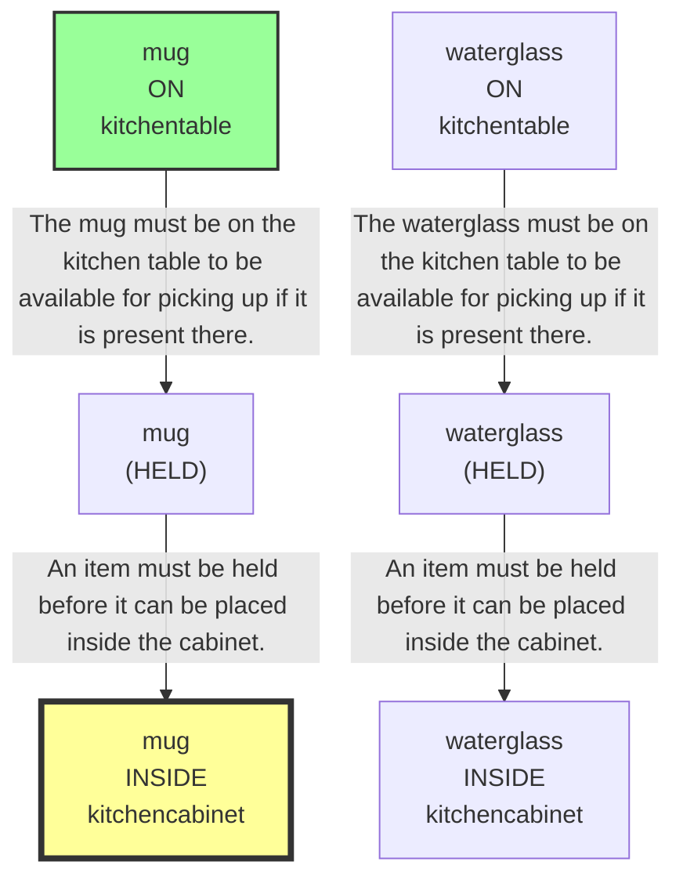
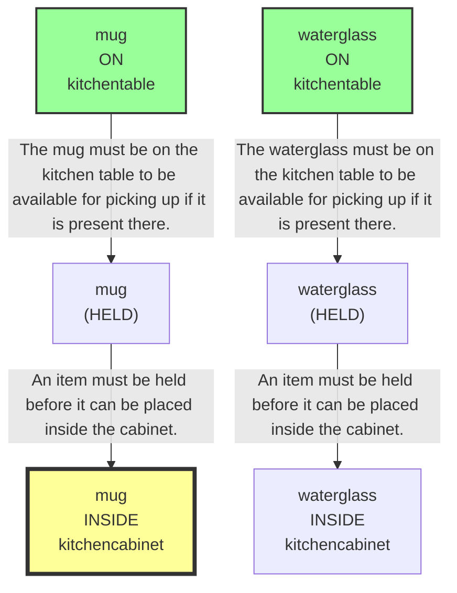
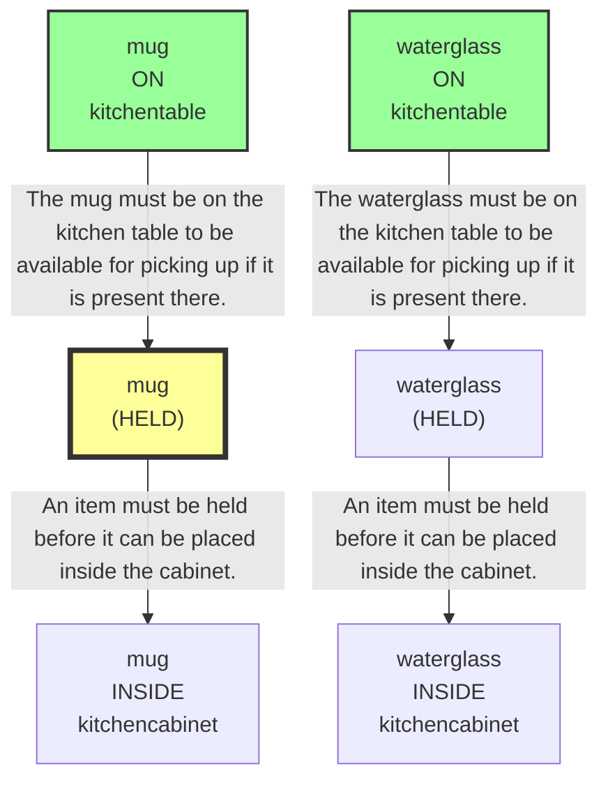
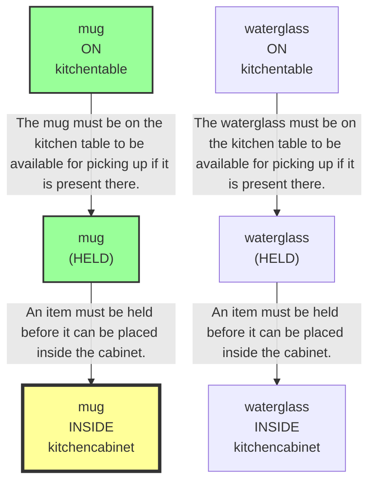

# 🚀 VirtualHome Agent Episode Log


### [GoalReasoner (Module A - Intent)] Output
```json
{
  "is_instruction_obviously_vague": true,
  "clarification_question": "Which specific place should I put the drinkware?",
  "target_object": "drinkware",
  "location_hint": "kitchen table",
  "reasoning_chain": [
    {
      "question": "Why does the user want this object?",
      "answer": "To have the drinkware put away from the kitchen table."
    },
    {
      "question": "Why is that important?",
      "answer": "To move it to its intended storage location and clear the table."
    },
    {
      "question": "What fundamental need does this fulfill?",
      "answer": "To organize household items and restore order in the kitchen."
    },
    {
      "question": "Are there any deeper psychological or physical motivations?",
      "answer": "The user may want a tidier space and easier access to items stored in their proper place."
    }
  ],
  "deep_intent": "The user wants to organize household items by returning them to their proper storage location.",
  "acceptable_alternatives_properties": [
    {
      "priority": 1,
      "description": "Other tabletop drinking vessels or cups that can be returned to storage"
    },
    {
      "priority": 2,
      "description": "Similar kitchen vessels or serving drink containers that belong in the same storage area"
    },
    {
      "priority": 3,
      "description": "Other small household items from the table that are meant to be stored away"
    },
    {
      "priority": 4,
      "description": "Any nearby household container or organizer that serves to restore the table to a clear state"
    }
  ]
}
```

### [RoboStateMultiTaskController] Output
```json
{
  "action": "[ask] Which specific place should I put the drinkware?",
  "active_task_id": "task_1",
  "task_context": {
    "active_task_id": "task_1",
    "pending_task_ids": [],
    "satisfied_task_ids": []
  },
  "source": "goal_reasoner_clarification"
}
```
## Step 0
- **Action**: `[ask] Which specific place should I put the drinkware?`
- **Action Success**: `True`
- **Action Message**: Inside a kitchen cabinet.
- **Active Task**: `task_1`
- **Decision Source**: `goal_reasoner_clarification`
- **Task Progress**: T5_G2_11_B1=pending
- **SDG Status**:
No SDG active.
- **Observed Items (159)**: floor(12), floor(13), floor(14), floor(15), floor(16), floor(17), floor(18), floor(19), floor(20), ceiling(21), ceiling(22), ceiling(23), ceiling(24), ceiling(25), ceiling(26)...


### [GoalReasoner (Module A - Intent)] Output
```json
{
  "is_instruction_obviously_vague": true,
  "clarification_question": "Which specific item should be put inside the kitchen cabinet?",
  "target_object": null,
  "location_hint": "kitchen table",
  "reasoning_chain": [
    {
      "question": "Why does the user want this object?",
      "answer": "To have the drinkware stored away in a cabinet."
    },
    {
      "question": "Why is that important?",
      "answer": "To tidy the kitchen table by putting away the item."
    },
    {
      "question": "What fundamental need does this fulfill?",
      "answer": "It fulfills the need to organize and clear the kitchen area."
    },
    {
      "question": "Are there any deeper psychological or physical motivations?",
      "answer": "It may reduce clutter and keep items in their proper storage location."
    }
  ],
  "deep_intent": "The user wants to organize and clear the kitchen area by storing a drinkware item away properly.",
  "acceptable_alternatives_properties": [
    {
      "priority": 1,
      "description": "Other drinkware items that could be stored in the cabinet, such as a cup, mug, or glass"
    },
    {
      "priority": 2,
      "description": "Similar kitchen drinking containers that belong in a cabinet"
    },
    {
      "priority": 3,
      "description": "Other small kitchen items that are typically stored with drinkware in a cabinet"
    },
    {
      "priority": 4,
      "description": "A nearby kitchen storage solution if the cabinet is unavailable, such as a shelf or cupboard"
    }
  ]
}
```

### [PerceptionFilter] Output
```json
{
  "reasoning": "The goal is to store a drinkware item away in the kitchen cabinet. The SDG explicitly requires the drinkware targets mug and waterglass, plus the location objects kitchentable and kitchencabinet. To support the holding/placing action, only those exact classes are needed; no additional tools are required beyond the cabinet and table already referenced.",
  "selected_classes": [
    "kitchencabinet",
    "character",
    "kitchentable",
    "waterglass",
    "mug"
  ],
  "raw_class_count": 66
}
```

### [LLMExecutor] Output
```json
{
  "reasoning": "The task is ambiguous, but clarification is forbidden now. The goal requires storing drinkware from the kitchen table into a kitchen cabinet. The current graph shows multiple valid drinkware candidates on the table, and the character is already close to the table. To make autonomous progress, I will bind the focus to one available mug on the table and begin by opening a cabinet so it can later be placed inside. I choose mug(118) as a valid drinkware item on the kitchen table and target one of the available closed kitchen cabinets, selecting kitchencabinet(73) as the destination container.",
  "satisfied_nodes": [
    "N1"
  ],
  "current_node_focus": "N5",
  "mapped_variables": {
    "?Container": "kitchencabinet(73)",
    "?Drinkware": "mug(118)"
  },
  "action": "[walk] <kitchencabinet> (73)"
}
```

### [RoboStateMultiTaskController] Output
```json
{
  "action": "[walk] <kitchencabinet> (73)",
  "active_task_id": "task_1",
  "task_context": {
    "active_task_id": "task_1",
    "pending_task_ids": [],
    "satisfied_task_ids": []
  },
  "source": "llm_executor"
}
```
## Step 1
- **Action**: `[walk] <kitchencabinet> (73)`
- **Action Success**: `True`
- **Action Message**: {'0': {'message': 'Success'}}
- **Active Task**: `task_1`
- **Decision Source**: `llm_executor`
- **Task Progress**: T5_G2_11_B1=pending
- **SDG Status**:

- **Observed Items (21)**: kitchentable(72), kitchencabinet(73) [CLOSED], kitchencabinet(74) [CLOSED], kitchencabinet(75) [CLOSED], kitchencabinet(76) [CLOSED], kitchencabinet(77) [CLOSED], kitchencabinet(78) [CLOSED], kitchencabinet(79) [CLOSED], kitchencabinet(80) [CLOSED], waterglass(123), waterglass(140), waterglass(141), waterglass(142), mug(118), mug(119)...


### [PerceptionFilter] Output
```json
{
  "reasoning": "Reused cached class selection.",
  "selected_classes": [
    "kitchencabinet",
    "character",
    "kitchentable",
    "waterglass",
    "mug"
  ],
  "raw_class_count": 66
}
```

### [LLMExecutor] Output
```json
{
  "reasoning": "The goal is to store a drinkware item in a kitchen cabinet. The active SDG includes both a mug and a waterglass on the kitchen table, and the episode says clarification is no longer allowed, so I must autonomously choose a reasonable drinkware item. The character is already close to kitchencabinet(73), but the cabinet is closed, and to put items inside it must be open first. Since I am not yet holding any item, the immediate prerequisite is to open the cabinet before grabbing and storing one of the drinkware objects.",
  "satisfied_nodes": [
    "N1",
    "N2"
  ],
  "current_node_focus": "N5",
  "mapped_variables": {
    "?Container": "kitchencabinet(73)"
  },
  "action": "[open] <kitchencabinet> (73)"
}
```

### [RoboStateMultiTaskController] Output
```json
{
  "action": "[open] <kitchencabinet> (73)",
  "active_task_id": "task_1",
  "task_context": {
    "active_task_id": "task_1",
    "pending_task_ids": [],
    "satisfied_task_ids": []
  },
  "source": "llm_executor"
}
```
## Step 2
- **Action**: `[open] <kitchencabinet> (73)`
- **Action Success**: `True`
- **Action Message**: {'0': {'message': 'Success'}}
- **Active Task**: `task_1`
- **Decision Source**: `llm_executor`
- **Task Progress**: T5_G2_11_B1=pending
- **SDG Status**:

- **Observed Items (21)**: kitchentable(72), kitchencabinet(73) [CLOSED], kitchencabinet(74) [CLOSED], kitchencabinet(75) [CLOSED], kitchencabinet(76) [CLOSED], kitchencabinet(77) [CLOSED], kitchencabinet(78) [CLOSED], kitchencabinet(79) [CLOSED], kitchencabinet(80) [CLOSED], waterglass(123), waterglass(140), waterglass(141), waterglass(142), mug(118), mug(119)...


### [PerceptionFilter] Output
```json
{
  "reasoning": "Reused cached class selection.",
  "selected_classes": [
    "kitchencabinet",
    "character",
    "kitchentable",
    "waterglass",
    "mug"
  ],
  "raw_class_count": 66
}
```

### [LLMExecutor] Output
```json
{
  "reasoning": "The cabinet is already open and the task is to store a drinkware item from the kitchen table inside it. The SDG requires both a mug and a waterglass to be moved into the kitchencabinet, and both are currently on the kitchen table. I should start by grabbing one available target item. The mug is a valid drinkware item and matches the goal intent, so I will pick up a mug first. Since I am already close to the cabinet but not explicitly shown close to the mug, the next needed step is to walk to the mug before grabbing it; however, the instruction says not to repeat a walk action if I just did it, and the most recent actions were walking to and opening the cabinet. Still, proximity to the mug is not guaranteed, so the safe next step is to walk to the mug.",
  "satisfied_nodes": [
    "N1",
    "N2"
  ],
  "current_node_focus": "N3",
  "mapped_variables": {
    "?Container": "kitchencabinet(73)"
  },
  "action": "[walk] <mug> (118)"
}
```

### [RoboStateMultiTaskController] Output
```json
{
  "action": "[walk] <mug> (118)",
  "active_task_id": "task_1",
  "task_context": {
    "active_task_id": "task_1",
    "pending_task_ids": [],
    "satisfied_task_ids": []
  },
  "source": "llm_executor"
}
```
## Step 3
- **Action**: `[walk] <mug> (118)`
- **Action Success**: `True`
- **Action Message**: {'0': {'message': 'Success'}}
- **Active Task**: `task_1`
- **Decision Source**: `llm_executor`
- **Task Progress**: T5_G2_11_B1=pending
- **SDG Status**:

- **Observed Items (21)**: kitchentable(72), kitchencabinet(73) [OPEN], kitchencabinet(74) [CLOSED], kitchencabinet(75) [CLOSED], kitchencabinet(76) [CLOSED], kitchencabinet(77) [CLOSED], kitchencabinet(78) [CLOSED], kitchencabinet(79) [CLOSED], kitchencabinet(80) [CLOSED], waterglass(123), waterglass(140), waterglass(141), waterglass(142), mug(118), mug(119)...


### [PerceptionFilter] Output
```json
{
  "reasoning": "Reused cached class selection.",
  "selected_classes": [
    "kitchencabinet",
    "character",
    "kitchentable",
    "waterglass",
    "mug"
  ],
  "raw_class_count": 66
}
```

### [LLMExecutor] Output
```json
{
  "reasoning": "The instruction is ambiguous, but clarification is forbidden, so I must autonomously choose a plausible drinkware item from the kitchen table. The SDG requires a mug and a waterglass to end up inside the open kitchen cabinet. I am already near the kitchen cabinet from the prior step, and the mug on the table is a valid candidate to progress the task. The next required atomic step is to pick up the mug before it can be placed in the cabinet.",
  "satisfied_nodes": [
    "N1",
    "N2"
  ],
  "current_node_focus": "N3",
  "mapped_variables": {
    "?Container": "kitchencabinet(73)",
    "?Drinkware": "mug(118)"
  },
  "action": "[grab] <mug> (118)"
}
```

### [RoboStateMultiTaskController] Output
```json
{
  "action": "[grab] <mug> (118)",
  "active_task_id": "task_1",
  "task_context": {
    "active_task_id": "task_1",
    "pending_task_ids": [],
    "satisfied_task_ids": []
  },
  "source": "llm_executor"
}
```
## Step 4
- **Action**: `[grab] <mug> (118)`
- **Action Success**: `True`
- **Action Message**: {'0': {'message': 'Success'}}
- **Active Task**: `task_1`
- **Decision Source**: `llm_executor`
- **Task Progress**: T5_G2_11_B1=pending
- **SDG Status**:

- **Observed Items (21)**: kitchentable(72), kitchencabinet(73) [OPEN], kitchencabinet(74) [CLOSED], kitchencabinet(75) [CLOSED], kitchencabinet(76) [CLOSED], kitchencabinet(77) [CLOSED], kitchencabinet(78) [CLOSED], kitchencabinet(79) [CLOSED], kitchencabinet(80) [CLOSED], waterglass(123), waterglass(140), waterglass(141), waterglass(142), mug(118), mug(119)...


### [PerceptionFilter] Output
```json
{
  "reasoning": "Reused cached class selection.",
  "selected_classes": [
    "kitchencabinet",
    "character",
    "kitchentable",
    "waterglass",
    "mug"
  ],
  "raw_class_count": 66
}
```

### [LLMExecutor] Output
```json
{
  "reasoning": "The active goal is to store drinkware from the kitchen table into an open kitchen cabinet. The mug is already held in the right hand, and the cabinet 73 is already open and nearby. The next unsatisfied prerequisite for the mug is to place it inside the cabinet. Since I must be explicitly near the destination before putting it in, and I am already at the cabinet from the recent walk, the next atomic action is to put the held mug into the open cabinet. The waterglass goal remains pending afterward.",
  "satisfied_nodes": [
    "N1",
    "N3"
  ],
  "current_node_focus": "N5",
  "mapped_variables": {
    "?Container": "kitchencabinet(73)"
  },
  "action": "[putin] <mug> (118) <kitchencabinet> (73)"
}
```

### [RoboStateMultiTaskController] Output
```json
{
  "action": "[walk] <kitchencabinet> (73)",
  "active_task_id": "task_1",
  "task_context": {
    "active_task_id": "task_1",
    "pending_task_ids": [],
    "satisfied_task_ids": []
  },
  "source": "llm_executor_repaired"
}
```
## Step 5
- **Action**: `[walk] <kitchencabinet> (73)`
- **Action Success**: `True`
- **Action Message**: {'0': {'message': 'Success'}}
- **Active Task**: `task_1`
- **Decision Source**: `llm_executor_repaired`
- **Task Progress**: T5_G2_11_B1=pending
- **SDG Status**:

- **Observed Items (21)**: kitchentable(72), kitchencabinet(73) [OPEN], kitchencabinet(74) [CLOSED], kitchencabinet(75) [CLOSED], kitchencabinet(76) [CLOSED], kitchencabinet(77) [CLOSED], kitchencabinet(78) [CLOSED], kitchencabinet(79) [CLOSED], kitchencabinet(80) [CLOSED], waterglass(123), waterglass(140), waterglass(141), waterglass(142), mug(118), mug(119)...


### [PerceptionFilter] Output
```json
{
  "reasoning": "Reused cached class selection.",
  "selected_classes": [
    "kitchencabinet",
    "character",
    "kitchentable",
    "waterglass",
    "mug"
  ],
  "raw_class_count": 66
}
```

### [LLMExecutor] Output
```json
{
  "reasoning": "The cabinet is already open and I am already close to it. I am holding the mug(118), which matches the SDG path toward placing a drinkware item inside the kitchen cabinet. The next required atomic step is to put the held mug into the open cabinet. The waterglass remains available on the table as the secondary item, but the immediate focused node is to satisfy the mug-inside-cabinet relation.",
  "satisfied_nodes": [
    "N1",
    "N3"
  ],
  "current_node_focus": "N5",
  "mapped_variables": {
    "?Container": "kitchencabinet(73)",
    "?HeldItem": "mug(118)"
  },
  "action": "[putin] <mug> (118) <kitchencabinet> (73)"
}
```

### [RoboStateMultiTaskController] Output
```json
{
  "action": "[putin] <mug> (118) <kitchencabinet> (73)",
  "active_task_id": "task_1",
  "task_context": {
    "active_task_id": "task_1",
    "pending_task_ids": [],
    "satisfied_task_ids": []
  },
  "source": "llm_executor"
}
```
## Step 6
- **Action**: `[putin] <mug> (118) <kitchencabinet> (73)`
- **Action Success**: `True`
- **Action Message**: {'0': {'message': 'Success'}}
- **Active Task**: `task_1`
- **Decision Source**: `llm_executor`
- **Task Progress**: T5_G2_11_B1=done
- **SDG Status**:

- **Observed Items (21)**: kitchentable(72), kitchencabinet(73) [OPEN], kitchencabinet(74) [CLOSED], kitchencabinet(75) [CLOSED], kitchencabinet(76) [CLOSED], kitchencabinet(77) [CLOSED], kitchencabinet(78) [CLOSED], kitchencabinet(79) [CLOSED], kitchencabinet(80) [CLOSED], waterglass(123), waterglass(140), waterglass(141), waterglass(142), mug(118), mug(119)...

