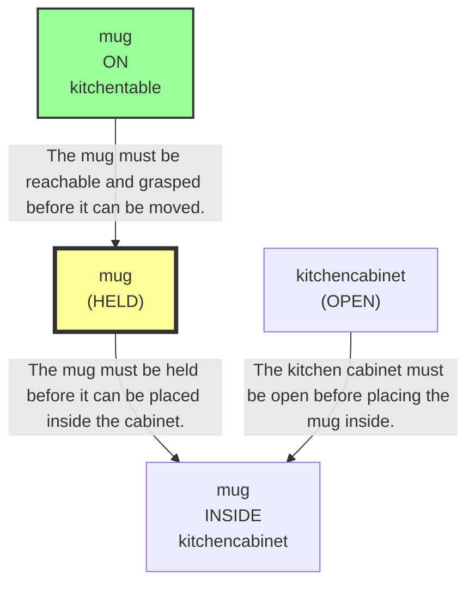
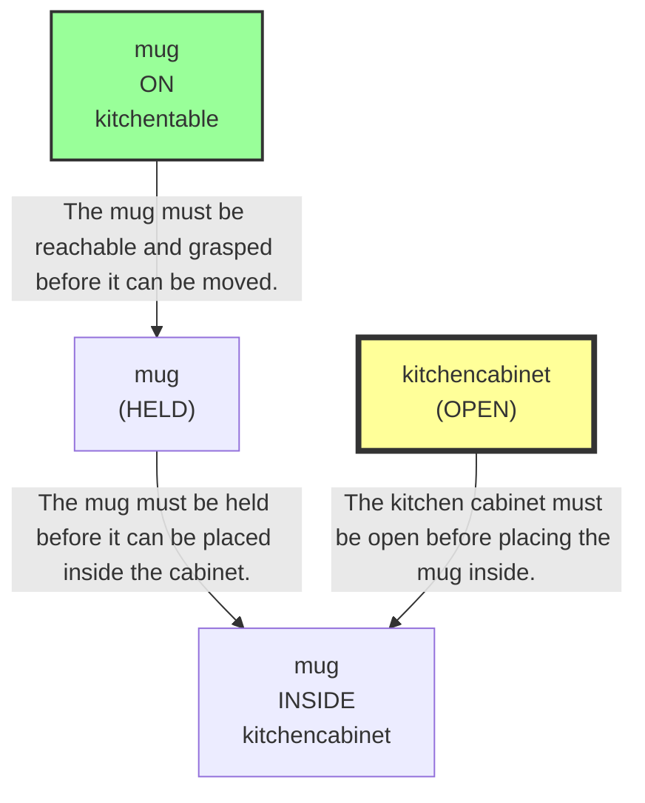
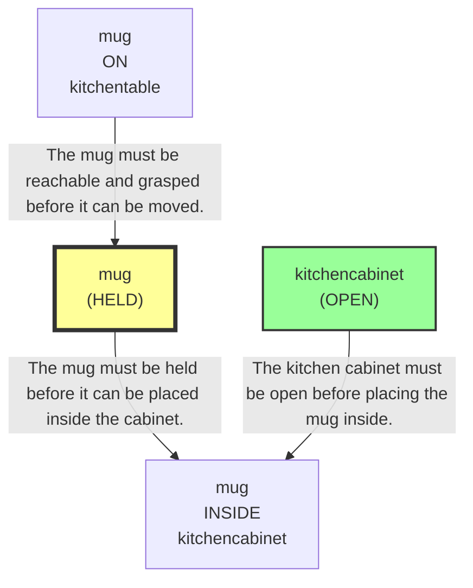
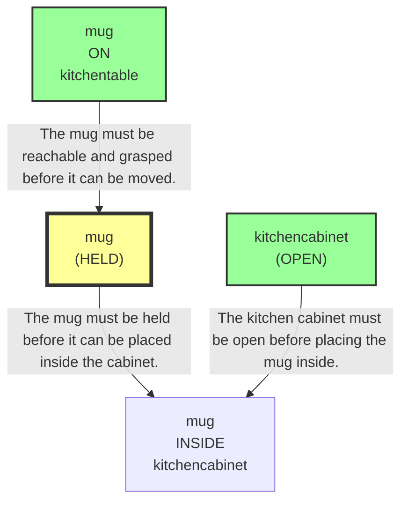
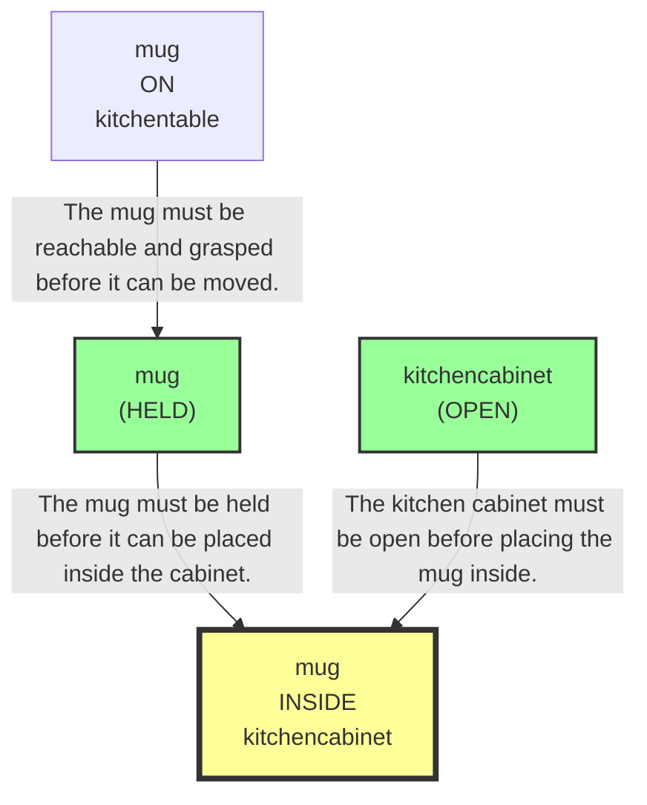
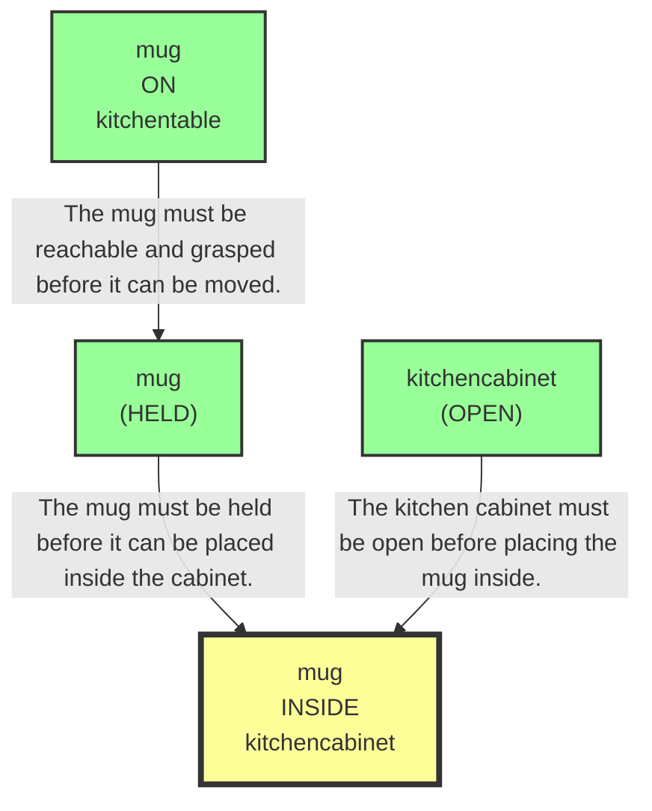

# 🚀 VirtualHome Agent Episode Log


### [GoalReasoner (Module A - Intent)] Output
```json
{
  "is_instruction_obviously_vague": true,
  "clarification_question": "Which specific storage location should I use for the drinkware?",
  "target_object": "drinkware",
  "location_hint": "kitchen table",
  "reasoning_chain": [
    {
      "question": "Why does the user want this object?",
      "answer": "To have the drinkware moved off the kitchen table and returned to its proper place."
    },
    {
      "question": "Why is that important?",
      "answer": "To keep the table clear and the item stored where it should be."
    },
    {
      "question": "What fundamental need does this fulfill?",
      "answer": "It supports household organization and tidiness."
    },
    {
      "question": "Are there any deeper psychological or physical motivations?",
      "answer": "Likely to reduce clutter and maintain an orderly kitchen environment."
    }
  ],
  "deep_intent": "The user wants to organize household items and clear clutter from the kitchen table.",
  "acceptable_alternatives_properties": [
    {
      "priority": 1,
      "description": "Other similar tableware or drinkware items that belong in the same storage area, such as cups, glasses, mugs, or tumblers"
    },
    {
      "priority": 2,
      "description": "Other small kitchen items that are currently out of place and can be stored with similar household items"
    },
    {
      "priority": 3,
      "description": "Nearby everyday items that serve a similar organizing purpose by clearing the table surface"
    },
    {
      "priority": 4,
      "description": "Any household item that needs to be returned to its designated storage location to reduce clutter"
    }
  ]
}
```

### [RoboStateMultiTaskController] Output
```json
{
  "action": "[ask] Which specific storage location should I use for the drinkware?",
  "active_task_id": "task_1",
  "task_context": {
    "active_task_id": "task_1",
    "pending_task_ids": [],
    "satisfied_task_ids": []
  },
  "source": "goal_reasoner_clarification"
}
```
## Step 0
- **Action**: `[ask] Which specific storage location should I use for the drinkware?`
- **Action Success**: `True`
- **Action Message**: Inside a kitchen cabinet.
- **Active Task**: `task_1`
- **Decision Source**: `goal_reasoner_clarification`
- **Task Progress**: T5_G2_11_B2=pending
- **SDG Status**:
No SDG active.
- **Observed Items (159)**: floor(12), floor(13), floor(14), floor(15), floor(16), floor(17), floor(18), floor(19), floor(20), ceiling(21), ceiling(22), ceiling(23), ceiling(24), ceiling(25), ceiling(26)...


### [GoalReasoner (Module A - Intent)] Output
```json
{
  "is_instruction_obviously_vague": true,
  "clarification_question": "Which specific drinkware item should I put in the kitchen cabinet?",
  "target_object": "drinkware",
  "location_hint": "kitchen table",
  "reasoning_chain": [
    {
      "question": "Why does the user want this object?",
      "answer": "To remove drinkware from the kitchen table and place it in storage."
    },
    {
      "question": "Why is that important?",
      "answer": "To clear the table and organize the item in a cabinet."
    },
    {
      "question": "What fundamental need does this fulfill?",
      "answer": "It fulfills the need to organize household items and keep the surface uncluttered."
    },
    {
      "question": "Are there any deeper psychological or physical motivations?",
      "answer": "The action likely supports a tidier kitchen and easier access to stored items."
    }
  ],
  "deep_intent": "Organize household items by storing one of them away from a surface into cabinet storage.",
  "acceptable_alternatives_properties": [
    {
      "priority": 1,
      "description": "Other drinkware items of the same general type, such as a cup, mug, glass, or tumbler"
    },
    {
      "priority": 2,
      "description": "Other kitchen table items intended for storage, if the identified drinkware item is unavailable"
    },
    {
      "priority": 3,
      "description": "Similar small household items that can be put away in a cabinet"
    },
    {
      "priority": 4,
      "description": "Other indoor objects that can be relocated from a surface into enclosed storage"
    }
  ]
}
```

### [RoboStateMultiTaskController] Output
```json
{
  "action": "[ask] Which specific drinkware item should I put in the kitchen cabinet?",
  "active_task_id": "task_1",
  "task_context": {
    "active_task_id": "task_1",
    "pending_task_ids": [],
    "satisfied_task_ids": []
  },
  "source": "goal_reasoner_clarification"
}
```
## Step 1
- **Action**: `[ask] Which specific drinkware item should I put in the kitchen cabinet?`
- **Action Success**: `True`
- **Action Message**: The mug.
- **Active Task**: `task_1`
- **Decision Source**: `goal_reasoner_clarification`
- **Task Progress**: T5_G2_11_B2=pending
- **SDG Status**:
No SDG active.
- **Observed Items (159)**: floor(12), floor(13), floor(14), floor(15), floor(16), floor(17), floor(18), floor(19), floor(20), ceiling(21), ceiling(22), ceiling(23), ceiling(24), ceiling(25), ceiling(26)...


### [GoalReasoner (Module A - Intent)] Output
```json
{
  "is_instruction_obviously_vague": false,
  "clarification_question": null,
  "target_object": "mug",
  "location_hint": "kitchen table",
  "reasoning_chain": [
    {
      "question": "Why does the user want this object?",
      "answer": "To have the mug moved from the kitchen table."
    },
    {
      "question": "Why is that important?",
      "answer": "To place it in a storage location instead of leaving it on the table."
    },
    {
      "question": "What fundamental need does this fulfill?",
      "answer": "To organize the kitchen by storing the mug away."
    },
    {
      "question": "Are there any deeper psychological or physical motivations?",
      "answer": "It likely helps keep the surface clear and maintains a tidier, more orderly space."
    }
  ],
  "deep_intent": "The user wants to organize a kitchen by storing an item away in a cabinet.",
  "acceptable_alternatives_properties": [
    {
      "priority": 1,
      "description": "Other small kitchen drinkware or cups that can be stored in a cabinet"
    },
    {
      "priority": 2,
      "description": "Other kitchen tabletop items that belong in cabinet storage"
    },
    {
      "priority": 3,
      "description": "Small household items that can be put away to clear the table"
    },
    {
      "priority": 4,
      "description": "Any comparable item that can be removed from the table to reduce clutter"
    }
  ]
}
```

### [PerceptionFilter] Output
```json
{
  "reasoning": "The goal is to move the mug from the kitchen table into the kitchen cabinet, so the minimum needed classes are the target mug, its current location kitchentable, and the destination kitchencabinet. The SDG also requires the cabinet to be open before placing the mug inside, but that is a state of the cabinet rather than a separate object class.",
  "selected_classes": [
    "kitchencabinet",
    "kitchentable",
    "mug",
    "character"
  ],
  "raw_class_count": 66
}
```

### [LLMExecutor] Output
```json
{
  "reasoning": "The active goal is to move a mug from the kitchen table into an open kitchen cabinet. The mug is currently on the kitchen table and the cabinet is closed. Since I am already close to the kitchen table, the first required step is to pick a matching mug. I will bind ?Mug to mug(118), a grabbable mug on the table. After this, the next steps will be opening a cabinet and placing the mug inside.",
  "satisfied_nodes": [
    "N1"
  ],
  "current_node_focus": "N2",
  "mapped_variables": {
    "?Mug": "mug(118)",
    "?Cabinet": "kitchencabinet(73)"
  },
  "action": "[grab] <mug> (118)"
}
```

### [RoboStateMultiTaskController] Output
```json
{
  "action": "[walk] <mug> (118)",
  "active_task_id": "task_1",
  "task_context": {
    "active_task_id": "task_1",
    "pending_task_ids": [],
    "satisfied_task_ids": []
  },
  "source": "llm_executor_repaired"
}
```
## Step 2
- **Action**: `[walk] <mug> (118)`
- **Action Success**: `True`
- **Action Message**: {'0': {'message': 'Success'}}
- **Active Task**: `task_1`
- **Decision Source**: `llm_executor_repaired`
- **Task Progress**: T5_G2_11_B2=pending
- **SDG Status**:

- **Observed Items (17)**: kitchentable(72), kitchencabinet(73) [CLOSED], kitchencabinet(74) [CLOSED], kitchencabinet(75) [CLOSED], kitchencabinet(76) [CLOSED], kitchencabinet(77) [CLOSED], kitchencabinet(78) [CLOSED], kitchencabinet(79) [CLOSED], kitchencabinet(80) [CLOSED], mug(118), mug(119), mug(155), character(1), kitchen(11), bathroom(172)...


### [PerceptionFilter] Output
```json
{
  "reasoning": "Reused cached class selection.",
  "selected_classes": [
    "kitchencabinet",
    "kitchentable",
    "mug",
    "character"
  ],
  "raw_class_count": 66
}
```

### [LLMExecutor] Output
```json
{
  "reasoning": "The mug is already reachable and the character is close to the kitchen table, so the next unmet prerequisite is to open a kitchen cabinet before placing the mug inside. Among the cabinet instances, all are closed; any one can serve as the storage location. I will open one cabinet first to satisfy N3 and enable the later put-in action.",
  "satisfied_nodes": [
    "N1"
  ],
  "current_node_focus": "N3",
  "mapped_variables": {
    "?Container": "kitchencabinet(73)"
  },
  "action": "[open] <kitchencabinet> (73)"
}
```

### [RoboStateMultiTaskController] Output
```json
{
  "action": "[walk] <kitchencabinet> (73)",
  "active_task_id": "task_1",
  "task_context": {
    "active_task_id": "task_1",
    "pending_task_ids": [],
    "satisfied_task_ids": []
  },
  "source": "llm_executor_repaired"
}
```
## Step 3
- **Action**: `[walk] <kitchencabinet> (73)`
- **Action Success**: `True`
- **Action Message**: {'0': {'message': 'Success'}}
- **Active Task**: `task_1`
- **Decision Source**: `llm_executor_repaired`
- **Task Progress**: T5_G2_11_B2=pending
- **SDG Status**:

- **Observed Items (17)**: kitchentable(72), kitchencabinet(73) [CLOSED], kitchencabinet(74) [CLOSED], kitchencabinet(75) [CLOSED], kitchencabinet(76) [CLOSED], kitchencabinet(77) [CLOSED], kitchencabinet(78) [CLOSED], kitchencabinet(79) [CLOSED], kitchencabinet(80) [CLOSED], mug(118), mug(119), mug(155), character(1), kitchen(11), bathroom(172)...


### [PerceptionFilter] Output
```json
{
  "reasoning": "Reused cached class selection.",
  "selected_classes": [
    "kitchencabinet",
    "kitchentable",
    "mug",
    "character"
  ],
  "raw_class_count": 66
}
```

### [LLMExecutor] Output
```json
{
  "reasoning": "The mug is already identified on the kitchen table and the cabinet has been located, but the currently relevant cabinet instance is still CLOSED. To progress toward placing the mug inside the cabinet, the next required atomic step is to open the cabinet before any grab/put action. I rebind the cabinet target to kitchencabinet(73) because it is close to the character and matches the required storage location.",
  "satisfied_nodes": [
    "N1"
  ],
  "current_node_focus": "N3",
  "mapped_variables": {
    "?Container": "kitchencabinet(73)"
  },
  "action": "[open] <kitchencabinet> (73)"
}
```

### [RoboStateMultiTaskController] Output
```json
{
  "action": "[open] <kitchencabinet> (73)",
  "active_task_id": "task_1",
  "task_context": {
    "active_task_id": "task_1",
    "pending_task_ids": [],
    "satisfied_task_ids": []
  },
  "source": "llm_executor"
}
```
## Step 4
- **Action**: `[open] <kitchencabinet> (73)`
- **Action Success**: `True`
- **Action Message**: {'0': {'message': 'Success'}}
- **Active Task**: `task_1`
- **Decision Source**: `llm_executor`
- **Task Progress**: T5_G2_11_B2=pending
- **SDG Status**:

- **Observed Items (17)**: kitchentable(72), kitchencabinet(73) [CLOSED], kitchencabinet(74) [CLOSED], kitchencabinet(75) [CLOSED], kitchencabinet(76) [CLOSED], kitchencabinet(77) [CLOSED], kitchencabinet(78) [CLOSED], kitchencabinet(79) [CLOSED], kitchencabinet(80) [CLOSED], mug(118), mug(119), mug(155), character(1), kitchen(11), bathroom(172)...


### [PerceptionFilter] Output
```json
{
  "reasoning": "Reused cached class selection.",
  "selected_classes": [
    "kitchencabinet",
    "kitchentable",
    "mug",
    "character"
  ],
  "raw_class_count": 66
}
```

### [LLMExecutor] Output
```json
{
  "reasoning": "The SDG indicates the cabinet is already open (N3 satisfied), and the mug is currently on the kitchen table but not yet held. The next required progression is to grasp a mug that matches the task. Since mug(118) is on the kitchen table and is the most direct binding to the target, I will grab it now to satisfy the HELD prerequisite before placing it in the cabinet.",
  "satisfied_nodes": [
    "N3"
  ],
  "current_node_focus": "N2",
  "mapped_variables": {
    "?Container": "kitchencabinet(73)"
  },
  "action": "[grab] <mug> (118)"
}
```

### [RoboStateMultiTaskController] Output
```json
{
  "action": "[walk] <mug> (118)",
  "active_task_id": "task_1",
  "task_context": {
    "active_task_id": "task_1",
    "pending_task_ids": [],
    "satisfied_task_ids": []
  },
  "source": "llm_executor_repaired"
}
```
## Step 5
- **Action**: `[walk] <mug> (118)`
- **Action Success**: `True`
- **Action Message**: {'0': {'message': 'Success'}}
- **Active Task**: `task_1`
- **Decision Source**: `llm_executor_repaired`
- **Task Progress**: T5_G2_11_B2=pending
- **SDG Status**:

- **Observed Items (17)**: kitchentable(72), kitchencabinet(73) [OPEN], kitchencabinet(74) [CLOSED], kitchencabinet(75) [CLOSED], kitchencabinet(76) [CLOSED], kitchencabinet(77) [CLOSED], kitchencabinet(78) [CLOSED], kitchencabinet(79) [CLOSED], kitchencabinet(80) [CLOSED], mug(118), mug(119), mug(155), character(1), kitchen(11), bathroom(172)...


### [PerceptionFilter] Output
```json
{
  "reasoning": "Reused cached class selection.",
  "selected_classes": [
    "kitchencabinet",
    "kitchentable",
    "mug",
    "character"
  ],
  "raw_class_count": 66
}
```

### [LLMExecutor] Output
```json
{
  "reasoning": "The mug is still on the kitchen table and is currently close/reachable, but it is not yet held. The cabinet selected by the SDG is already open. To progress toward placing the mug inside the cabinet, the next required atomic step is to grab the mug. I will rebind to a valid current mug instance on the table; mug(118) is a valid match and was the one already approached previously.",
  "satisfied_nodes": [
    "N1",
    "N3"
  ],
  "current_node_focus": "N2",
  "mapped_variables": {
    "?Container": "kitchencabinet(73)"
  },
  "action": "[grab] <mug> (118)"
}
```

### [RoboStateMultiTaskController] Output
```json
{
  "action": "[grab] <mug> (118)",
  "active_task_id": "task_1",
  "task_context": {
    "active_task_id": "task_1",
    "pending_task_ids": [],
    "satisfied_task_ids": []
  },
  "source": "llm_executor"
}
```
## Step 6
- **Action**: `[grab] <mug> (118)`
- **Action Success**: `True`
- **Action Message**: {'0': {'message': 'Success'}}
- **Active Task**: `task_1`
- **Decision Source**: `llm_executor`
- **Task Progress**: T5_G2_11_B2=pending
- **SDG Status**:

- **Observed Items (17)**: kitchentable(72), kitchencabinet(73) [OPEN], kitchencabinet(74) [CLOSED], kitchencabinet(75) [CLOSED], kitchencabinet(76) [CLOSED], kitchencabinet(77) [CLOSED], kitchencabinet(78) [CLOSED], kitchencabinet(79) [CLOSED], kitchencabinet(80) [CLOSED], mug(118), mug(119), mug(155), character(1), kitchen(11), bathroom(172)...


### [PerceptionFilter] Output
```json
{
  "reasoning": "Reused cached class selection.",
  "selected_classes": [
    "kitchencabinet",
    "kitchentable",
    "mug",
    "character"
  ],
  "raw_class_count": 66
}
```

### [LLMExecutor] Output
```json
{
  "reasoning": "The goal is to store a mug in the open kitchen cabinet. The current held mug is mug(118), and kitchencabinet(73) is already OPEN, satisfying N2 and N3. The remaining gap is to place the held mug into the cabinet, which requires being near the cabinet first. We are currently near the mug/table area, but proximity to the cabinet is not guaranteed, so the next atomic step must be to walk to the open cabinet before putting the mug inside.",
  "satisfied_nodes": [
    "N2",
    "N3"
  ],
  "current_node_focus": "N4",
  "mapped_variables": {
    "?Container": "kitchencabinet(73)"
  },
  "action": "[walk] <kitchencabinet> (73)"
}
```

### [RoboStateMultiTaskController] Output
```json
{
  "action": "[walk] <kitchencabinet> (73)",
  "active_task_id": "task_1",
  "task_context": {
    "active_task_id": "task_1",
    "pending_task_ids": [],
    "satisfied_task_ids": []
  },
  "source": "llm_executor"
}
```
## Step 7
- **Action**: `[walk] <kitchencabinet> (73)`
- **Action Success**: `True`
- **Action Message**: {'0': {'message': 'Success'}}
- **Active Task**: `task_1`
- **Decision Source**: `llm_executor`
- **Task Progress**: T5_G2_11_B2=pending
- **SDG Status**:

- **Observed Items (17)**: kitchentable(72), kitchencabinet(73) [OPEN], kitchencabinet(74) [CLOSED], kitchencabinet(75) [CLOSED], kitchencabinet(76) [CLOSED], kitchencabinet(77) [CLOSED], kitchencabinet(78) [CLOSED], kitchencabinet(79) [CLOSED], kitchencabinet(80) [CLOSED], mug(118), mug(119), mug(155), character(1), kitchen(11), bathroom(172)...


### [PerceptionFilter] Output
```json
{
  "reasoning": "Reused cached class selection.",
  "selected_classes": [
    "kitchencabinet",
    "kitchentable",
    "mug",
    "character"
  ],
  "raw_class_count": 66
}
```

### [LLMExecutor] Output
```json
{
  "reasoning": "The mug is already held in the right hand and the character is currently close to the open kitchen cabinet (73). The remaining prerequisite for the final placement node is to put the held mug inside the open cabinet. The target cabinet is already selected and open, so the next atomic action should be the placement action into that cabinet.",
  "satisfied_nodes": [
    "N1",
    "N2",
    "N3"
  ],
  "current_node_focus": "N4",
  "mapped_variables": {
    "?Container": "kitchencabinet(73)"
  },
  "action": "[putin] <mug> (118) <kitchencabinet> (73)"
}
```

### [RoboStateMultiTaskController] Output
```json
{
  "action": "[putin] <mug> (118) <kitchencabinet> (73)",
  "active_task_id": "task_1",
  "task_context": {
    "active_task_id": "task_1",
    "pending_task_ids": [],
    "satisfied_task_ids": []
  },
  "source": "llm_executor"
}
```
## Step 8
- **Action**: `[putin] <mug> (118) <kitchencabinet> (73)`
- **Action Success**: `True`
- **Action Message**: {'0': {'message': 'Success'}}
- **Active Task**: `task_1`
- **Decision Source**: `llm_executor`
- **Task Progress**: T5_G2_11_B2=done
- **SDG Status**:

- **Observed Items (17)**: kitchentable(72), kitchencabinet(73) [OPEN], kitchencabinet(74) [CLOSED], kitchencabinet(75) [CLOSED], kitchencabinet(76) [CLOSED], kitchencabinet(77) [CLOSED], kitchencabinet(78) [CLOSED], kitchencabinet(79) [CLOSED], kitchencabinet(80) [CLOSED], mug(118), mug(119), mug(155), character(1), kitchen(11), bathroom(172)...

