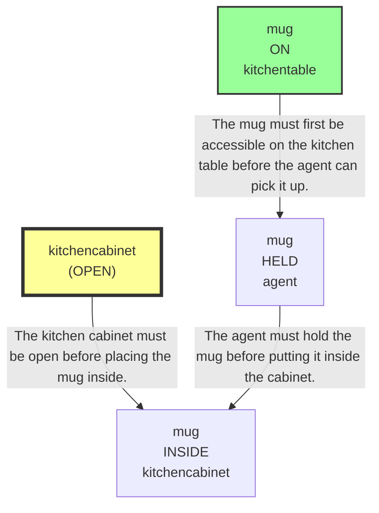
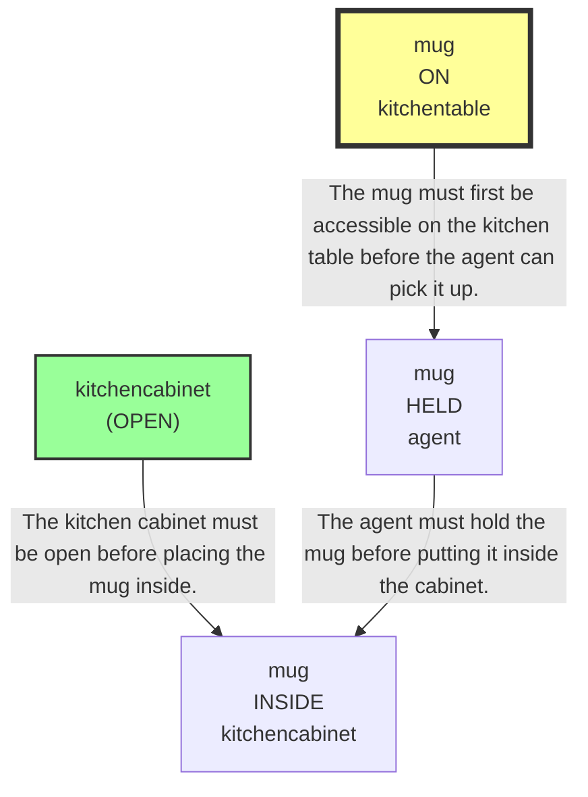
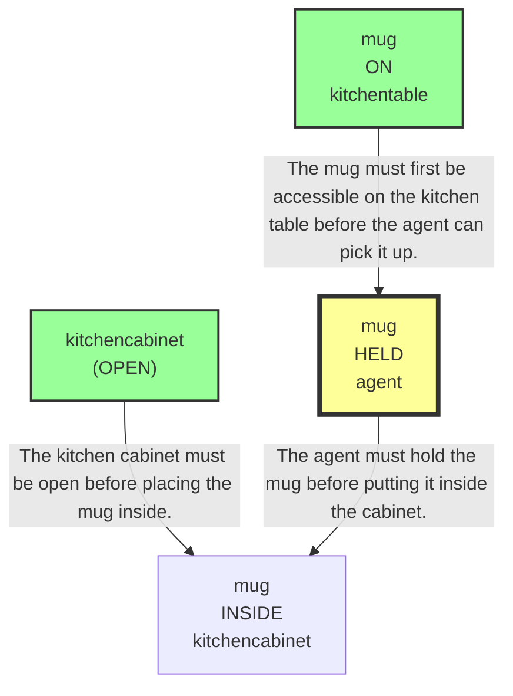
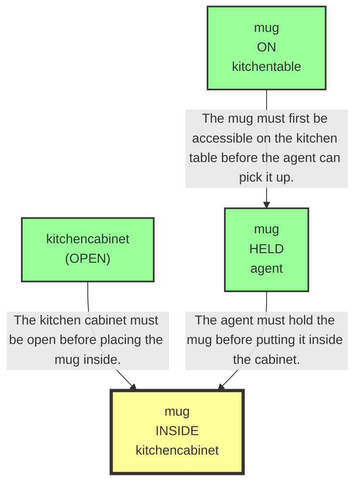

# 🚀 VirtualHome Agent Episode Log


### [GoalReasoner (Module A - Intent)] Output
```json
{
  "is_instruction_obviously_vague": true,
  "clarification_question": "Which exact destination should I put the drinkware in?",
  "target_object": "drinkware",
  "location_hint": "kitchen table",
  "reasoning_chain": [
    {
      "question": "Why does the user want this object?",
      "answer": "To remove drinkware from the kitchen table and place it in its intended storage location."
    },
    {
      "question": "Why is that important?",
      "answer": "To restore order and clear the table."
    },
    {
      "question": "What fundamental need does this fulfill?",
      "answer": "It fulfills the need to organize items and keep the kitchen surface uncluttered."
    },
    {
      "question": "Are there any deeper psychological or physical motivations?",
      "answer": "The motivation may be to maintain cleanliness, reduce mess, or make the space ready for use."
    }
  ],
  "deep_intent": "The user wants to organize household items and clear a surface.",
  "acceptable_alternatives_properties": [
    {
      "priority": 1,
      "description": "Other similar tableware or drinkware items that belong in the same storage area"
    },
    {
      "priority": 2,
      "description": "Comparable kitchen items used for serving drinks, such as cups, glasses, or mugs"
    },
    {
      "priority": 3,
      "description": "Other small tabletop items that are meant to be put away in the kitchen"
    },
    {
      "priority": 4,
      "description": "Any nearby household item that helps clear and organize the kitchen table if the exact drinkware is unavailable"
    }
  ]
}
```

### [RoboStateMultiTaskController] Output
```json
{
  "action": "[ask] Which exact destination should I put the drinkware in?",
  "active_task_id": "task_1",
  "task_context": {
    "active_task_id": "task_1",
    "pending_task_ids": [],
    "satisfied_task_ids": []
  },
  "source": "goal_reasoner_clarification"
}
```
## Step 0
- **Action**: `[ask] Which exact destination should I put the drinkware in?`
- **Action Success**: `True`
- **Action Message**: Inside a kitchen cabinet.
- **Active Task**: `task_1`
- **Decision Source**: `goal_reasoner_clarification`
- **Task Progress**: T5_G2_11_B3=pending
- **SDG Status**:
No SDG active.
- **Observed Items (159)**: floor(12), floor(13), floor(14), floor(15), floor(16), floor(17), floor(18), floor(19), floor(20), ceiling(21), ceiling(22), ceiling(23), ceiling(24), ceiling(25), ceiling(26)...


### [GoalReasoner (Module A - Intent)] Output
```json
{
  "is_instruction_obviously_vague": true,
  "clarification_question": "Which specific item should be put inside the kitchen cabinet?",
  "target_object": "drinkware",
  "location_hint": "kitchen table",
  "reasoning_chain": [
    {
      "question": "Why does the user want this object?",
      "answer": "To be moved from the kitchen table into storage."
    },
    {
      "question": "Why is that important?",
      "answer": "To clear or organize the tabletop by placing the item away."
    },
    {
      "question": "What fundamental need does this fulfill?",
      "answer": "The user wants household organization and tidiness."
    },
    {
      "question": "Are there any deeper psychological or physical motivations?",
      "answer": "Likely to reduce clutter and keep the kitchen in order."
    }
  ],
  "deep_intent": "The user wants to organize household items by storing them properly.",
  "acceptable_alternatives_properties": [
    {
      "priority": 1,
      "description": "Other kitchen items that can be stored in a cabinet, such as cups, mugs, bowls, or glasses"
    },
    {
      "priority": 2,
      "description": "Similar small dining or serving items that belong in kitchen storage, such as plates, saucers, or utensils"
    },
    {
      "priority": 3,
      "description": "Other small household items that can be tidied away into an indoor cabinet or cupboard"
    },
    {
      "priority": 4,
      "description": "Any clutter item from a tabletop that can be put away to improve organization"
    }
  ]
}
```

### [RoboStateMultiTaskController] Output
```json
{
  "action": "[ask] Which specific item should be put inside the kitchen cabinet?",
  "active_task_id": "task_1",
  "task_context": {
    "active_task_id": "task_1",
    "pending_task_ids": [],
    "satisfied_task_ids": []
  },
  "source": "goal_reasoner_clarification"
}
```
## Step 1
- **Action**: `[ask] Which specific item should be put inside the kitchen cabinet?`
- **Action Success**: `True`
- **Action Message**: The mug.
- **Active Task**: `task_1`
- **Decision Source**: `goal_reasoner_clarification`
- **Task Progress**: T5_G2_11_B3=pending
- **SDG Status**:
No SDG active.
- **Observed Items (159)**: floor(12), floor(13), floor(14), floor(15), floor(16), floor(17), floor(18), floor(19), floor(20), ceiling(21), ceiling(22), ceiling(23), ceiling(24), ceiling(25), ceiling(26)...


### [GoalReasoner (Module A - Intent)] Output
```json
{
  "is_instruction_obviously_vague": false,
  "clarification_question": null,
  "target_object": "mug",
  "location_hint": "kitchen table",
  "reasoning_chain": [
    {
      "question": "Why does the user want this object?",
      "answer": "To relocate the mug from the kitchen table into a kitchen cabinet."
    },
    {
      "question": "Why is that important?",
      "answer": "To clear the kitchen table by storing the mug away in a cabinet."
    },
    {
      "question": "What fundamental need does this fulfill?",
      "answer": "It helps organize the kitchen and keep the table surface uncluttered."
    },
    {
      "question": "Are there any deeper psychological or physical motivations?",
      "answer": "It likely supports a preference for tidiness, orderly storage, and easier use of the table surface."
    }
  ],
  "deep_intent": "The user wants to organize a kitchen surface by storing an item away in a cabinet.",
  "acceptable_alternatives_properties": [
    {
      "priority": 1,
      "description": "Other similar drinkware or small kitchen items that can be stored in a cabinet, such as a cup or glass"
    },
    {
      "priority": 2,
      "description": "Other small kitchen items that belong in enclosed storage, such as bowls or plates"
    },
    {
      "priority": 3,
      "description": "Any small household items on the kitchen table that can be put away to reduce clutter"
    },
    {
      "priority": 4,
      "description": "Other room-organization actions that clear the surface and improve tidiness"
    }
  ]
}
```

### [PerceptionFilter] Output
```json
{
  "reasoning": "The goal is to move the target mug from the kitchen table into the kitchen cabinet. So the only necessary classes are the target mug, its source location kitchentable, its destination kitchencabinet, and the cabinet must be open. No extra tools are required beyond the agent holding the mug as part of the action sequence.",
  "selected_classes": [
    "kitchencabinet",
    "kitchentable",
    "character",
    "mug",
    "plate"
  ],
  "raw_class_count": 66
}
```

### [LLMExecutor] Output
```json
{
  "reasoning": "The mug is already on the kitchen table and the cabinet that should receive it is identified, but the cabinet is currently closed. Per the SDG, opening the cabinet is the next prerequisite before I can later grab the mug and put it inside. I should act on one cabinet; any of the closed kitchen cabinets could be a valid destination, and the closest relevant one in the current graph is kitchencabinet(73) not yet opened.",
  "satisfied_nodes": [
    "N1"
  ],
  "current_node_focus": "N3",
  "mapped_variables": {
    "?Container": "kitchencabinet(73)"
  },
  "action": "[open] <kitchencabinet> (73)"
}
```

### [RoboStateMultiTaskController] Output
```json
{
  "action": "[walk] <kitchencabinet> (73)",
  "active_task_id": "task_1",
  "task_context": {
    "active_task_id": "task_1",
    "pending_task_ids": [],
    "satisfied_task_ids": []
  },
  "source": "llm_executor_repaired"
}
```
## Step 2
- **Action**: `[walk] <kitchencabinet> (73)`
- **Action Success**: `True`
- **Action Message**: {'0': {'message': 'Success'}}
- **Active Task**: `task_1`
- **Decision Source**: `llm_executor_repaired`
- **Task Progress**: T5_G2_11_B3=pending
- **SDG Status**:

- **Observed Items (22)**: kitchentable(72), kitchencabinet(73) [CLOSED], kitchencabinet(74) [CLOSED], kitchencabinet(75) [CLOSED], kitchencabinet(76) [CLOSED], kitchencabinet(77) [CLOSED], kitchencabinet(78) [CLOSED], kitchencabinet(79) [CLOSED], kitchencabinet(80) [CLOSED], plate(125), plate(126), plate(127), plate(128), plate(143), mug(118)...


### [PerceptionFilter] Output
```json
{
  "reasoning": "Reused cached class selection.",
  "selected_classes": [
    "kitchencabinet",
    "kitchentable",
    "character",
    "mug",
    "plate"
  ],
  "raw_class_count": 66
}
```

### [LLMExecutor] Output
```json
{
  "reasoning": "The cabinet selected from the graph can be rebound to kitchencabinet(73), which is currently CLOSED and the agent is already close to it from the previous successful walk. To progress toward putting the mug inside, the cabinet must be opened first. The mug is already on the kitchen table, so no other prerequisite action is more urgent than opening the cabinet.",
  "satisfied_nodes": [
    "N1"
  ],
  "current_node_focus": "N3",
  "mapped_variables": {
    "?Container": "kitchencabinet(73)"
  },
  "action": "[open] <kitchencabinet> (73)"
}
```

### [RoboStateMultiTaskController] Output
```json
{
  "action": "[open] <kitchencabinet> (73)",
  "active_task_id": "task_1",
  "task_context": {
    "active_task_id": "task_1",
    "pending_task_ids": [],
    "satisfied_task_ids": []
  },
  "source": "llm_executor"
}
```
## Step 3
- **Action**: `[open] <kitchencabinet> (73)`
- **Action Success**: `True`
- **Action Message**: {'0': {'message': 'Success'}}
- **Active Task**: `task_1`
- **Decision Source**: `llm_executor`
- **Task Progress**: T5_G2_11_B3=pending
- **SDG Status**:

- **Observed Items (22)**: kitchentable(72), kitchencabinet(73) [CLOSED], kitchencabinet(74) [CLOSED], kitchencabinet(75) [CLOSED], kitchencabinet(76) [CLOSED], kitchencabinet(77) [CLOSED], kitchencabinet(78) [CLOSED], kitchencabinet(79) [CLOSED], kitchencabinet(80) [CLOSED], plate(125), plate(126), plate(127), plate(128), plate(143), mug(118)...


### [PerceptionFilter] Output
```json
{
  "reasoning": "Reused cached class selection.",
  "selected_classes": [
    "kitchencabinet",
    "kitchentable",
    "character",
    "mug",
    "plate"
  ],
  "raw_class_count": 66
}
```

### [LLMExecutor] Output
```json
{
  "reasoning": "The cabinet target is already open and the mug is visible on the kitchen table, but it is not yet held. To progress toward putting the mug inside the cabinet, the next required step is to walk to a specific mug on the table so it can be grabbed in the following action. Among the available mugs, mug(118) is a valid instance on kitchentable(72).",
  "satisfied_nodes": [
    "N3"
  ],
  "current_node_focus": "N1",
  "mapped_variables": {
    "?Container": "kitchencabinet(73)"
  },
  "action": "[walk] <mug> (118)"
}
```

### [RoboStateMultiTaskController] Output
```json
{
  "action": "[walk] <mug> (118)",
  "active_task_id": "task_1",
  "task_context": {
    "active_task_id": "task_1",
    "pending_task_ids": [],
    "satisfied_task_ids": []
  },
  "source": "llm_executor"
}
```
## Step 4
- **Action**: `[walk] <mug> (118)`
- **Action Success**: `True`
- **Action Message**: {'0': {'message': 'Success'}}
- **Active Task**: `task_1`
- **Decision Source**: `llm_executor`
- **Task Progress**: T5_G2_11_B3=pending
- **SDG Status**:

- **Observed Items (22)**: kitchentable(72), kitchencabinet(73) [OPEN], kitchencabinet(74) [CLOSED], kitchencabinet(75) [CLOSED], kitchencabinet(76) [CLOSED], kitchencabinet(77) [CLOSED], kitchencabinet(78) [CLOSED], kitchencabinet(79) [CLOSED], kitchencabinet(80) [CLOSED], plate(125), plate(126), plate(127), plate(128), plate(143), mug(118)...


### [PerceptionFilter] Output
```json
{
  "reasoning": "Reused cached class selection.",
  "selected_classes": [
    "kitchencabinet",
    "kitchentable",
    "character",
    "mug",
    "plate"
  ],
  "raw_class_count": 66
}
```

### [LLMExecutor] Output
```json
{
  "reasoning": "The mug is already on the kitchen table and I am close to it. The cabinet required by the SDG is open. The next prerequisite to satisfy before putting the mug inside the cabinet is to pick it up.",
  "satisfied_nodes": [
    "N1",
    "N3"
  ],
  "current_node_focus": "N4",
  "mapped_variables": {
    "?Container": "kitchencabinet(73)"
  },
  "action": "[grab] <mug> (118)"
}
```

### [RoboStateMultiTaskController] Output
```json
{
  "action": "[grab] <mug> (118)",
  "active_task_id": "task_1",
  "task_context": {
    "active_task_id": "task_1",
    "pending_task_ids": [],
    "satisfied_task_ids": []
  },
  "source": "llm_executor"
}
```
## Step 5
- **Action**: `[grab] <mug> (118)`
- **Action Success**: `True`
- **Action Message**: {'0': {'message': 'Success'}}
- **Active Task**: `task_1`
- **Decision Source**: `llm_executor`
- **Task Progress**: T5_G2_11_B3=pending
- **SDG Status**:

- **Observed Items (22)**: kitchentable(72), kitchencabinet(73) [OPEN], kitchencabinet(74) [CLOSED], kitchencabinet(75) [CLOSED], kitchencabinet(76) [CLOSED], kitchencabinet(77) [CLOSED], kitchencabinet(78) [CLOSED], kitchencabinet(79) [CLOSED], kitchencabinet(80) [CLOSED], plate(125), plate(126), plate(127), plate(128), plate(143), mug(118)...


### [PerceptionFilter] Output
```json
{
  "reasoning": "Reused cached class selection.",
  "selected_classes": [
    "kitchencabinet",
    "kitchentable",
    "character",
    "mug",
    "plate"
  ],
  "raw_class_count": 66
}
```

### [LLMExecutor] Output
```json
{
  "reasoning": "The mug is already being held in the right hand (mug(118)), and the target kitchen cabinet is open (kitchencabinet(73)). The only remaining required step toward placing the mug into the cabinet is to move to the cabinet before putting it inside.",
  "satisfied_nodes": [
    "N1",
    "N3",
    "N4"
  ],
  "current_node_focus": "N2",
  "mapped_variables": {
    "?Container": "kitchencabinet(73)"
  },
  "action": "[walk] <kitchencabinet> (73)"
}
```

### [RoboStateMultiTaskController] Output
```json
{
  "action": "[walk] <kitchencabinet> (73)",
  "active_task_id": "task_1",
  "task_context": {
    "active_task_id": "task_1",
    "pending_task_ids": [],
    "satisfied_task_ids": []
  },
  "source": "llm_executor"
}
```
## Step 6
- **Action**: `[walk] <kitchencabinet> (73)`
- **Action Success**: `True`
- **Action Message**: {'0': {'message': 'Success'}}
- **Active Task**: `task_1`
- **Decision Source**: `llm_executor`
- **Task Progress**: T5_G2_11_B3=pending
- **SDG Status**:

- **Observed Items (22)**: kitchentable(72), kitchencabinet(73) [OPEN], kitchencabinet(74) [CLOSED], kitchencabinet(75) [CLOSED], kitchencabinet(76) [CLOSED], kitchencabinet(77) [CLOSED], kitchencabinet(78) [CLOSED], kitchencabinet(79) [CLOSED], kitchencabinet(80) [CLOSED], plate(125), plate(126), plate(127), plate(128), plate(143), mug(118)...


### [PerceptionFilter] Output
```json
{
  "reasoning": "Reused cached class selection.",
  "selected_classes": [
    "kitchencabinet",
    "kitchentable",
    "character",
    "mug",
    "plate"
  ],
  "raw_class_count": 66
}
```

### [LLMExecutor] Output
```json
{
  "reasoning": "The target mug is already held in the right hand (mug(118)), and the chosen kitchen cabinet (73) is open. The next SDG node to satisfy is placing the mug inside that cabinet. Because put-in actions require being near the destination and we just walked to the cabinet, the correct next step is to put the held mug into cabinet 73.",
  "satisfied_nodes": [
    "N1",
    "N3",
    "N4"
  ],
  "current_node_focus": "N2",
  "mapped_variables": {
    "?Container": "kitchencabinet(73)"
  },
  "action": "[putin] <mug> (118) <kitchencabinet> (73)"
}
```

### [RoboStateMultiTaskController] Output
```json
{
  "action": "[putin] <mug> (118) <kitchencabinet> (73)",
  "active_task_id": "task_1",
  "task_context": {
    "active_task_id": "task_1",
    "pending_task_ids": [],
    "satisfied_task_ids": []
  },
  "source": "llm_executor"
}
```
## Step 7
- **Action**: `[putin] <mug> (118) <kitchencabinet> (73)`
- **Action Success**: `True`
- **Action Message**: {'0': {'message': 'Success'}}
- **Active Task**: `task_1`
- **Decision Source**: `llm_executor`
- **Task Progress**: T5_G2_11_B3=done
- **SDG Status**:

- **Observed Items (22)**: kitchentable(72), kitchencabinet(73) [OPEN], kitchencabinet(74) [CLOSED], kitchencabinet(75) [CLOSED], kitchencabinet(76) [CLOSED], kitchencabinet(77) [CLOSED], kitchencabinet(78) [CLOSED], kitchencabinet(79) [CLOSED], kitchencabinet(80) [CLOSED], plate(125), plate(126), plate(127), plate(128), plate(143), mug(118)...

