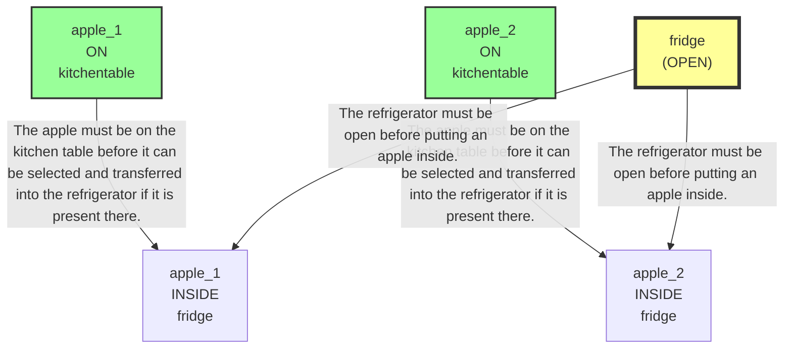
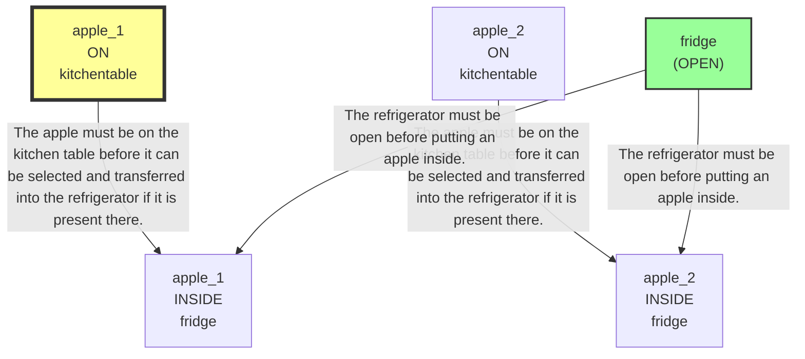
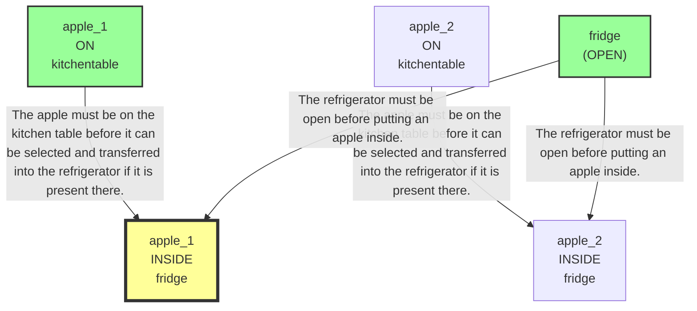
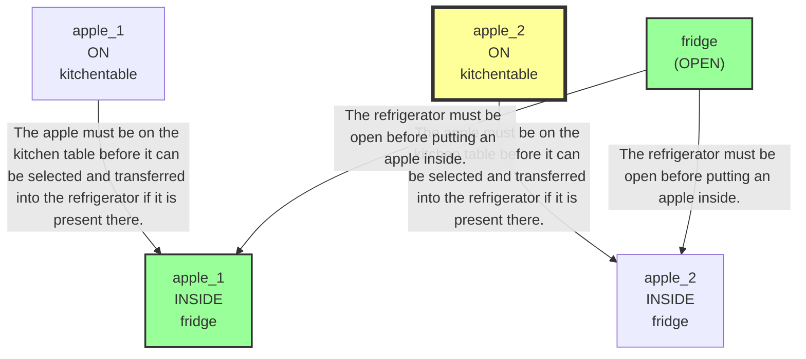
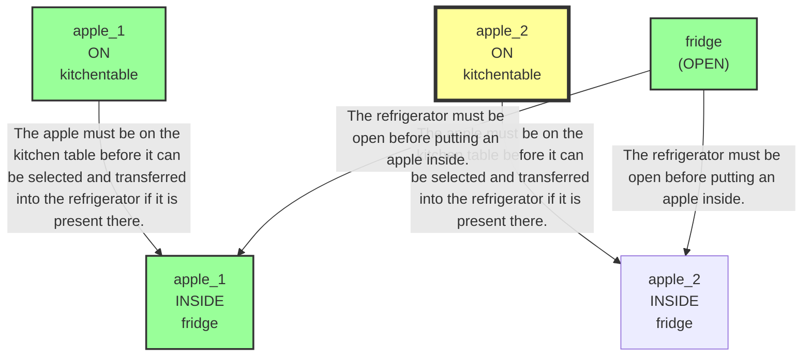
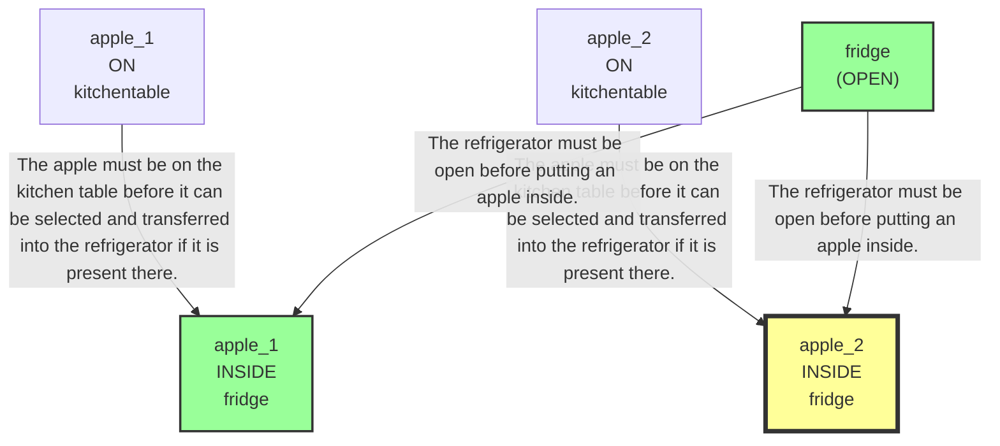
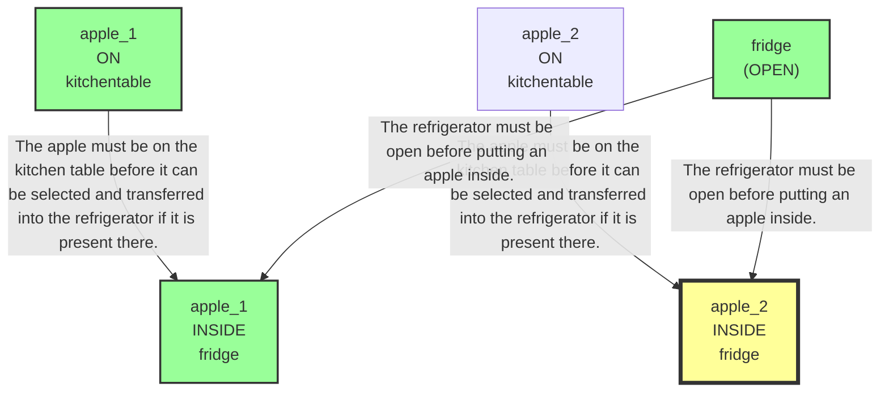

# 🚀 VirtualHome Agent Episode Log


### [GoalReasoner (Module A - Intent)] Output
```json
{
  "is_instruction_obviously_vague": true,
  "clarification_question": "What exact place should the apples be stored in?",
  "target_object": "apples",
  "location_hint": "kitchen table",
  "reasoning_chain": [
    {
      "question": "Why does the user want this object?",
      "answer": "To have the apples moved from the kitchen table into storage."
    },
    {
      "question": "Why is that important?",
      "answer": "To organize or clear the surface by putting the apples away."
    },
    {
      "question": "What fundamental need does this fulfill?",
      "answer": "The need to manage and store food items in a specific location."
    },
    {
      "question": "Are there any deeper psychological or physical motivations?",
      "answer": "Possibly to keep the kitchen tidy, preserve the apples, or make the space easier to use."
    }
  ],
  "deep_intent": "The user wants to store food items in a specific location.",
  "acceptable_alternatives_properties": [
    {
      "priority": 1,
      "description": "Other similar fresh fruits that can be stored in the same kind of container or storage area."
    },
    {
      "priority": 2,
      "description": "Other produce items that are typically kept together for short-term household storage."
    },
    {
      "priority": 3,
      "description": "Other household food items suitable for organized storage."
    },
    {
      "priority": 4,
      "description": "Any comparable edible items that can be placed into a designated storage location."
    }
  ]
}
```

### [RoboStateMultiTaskController] Output
```json
{
  "action": "[ask] What exact place should the apples be stored in?",
  "active_task_id": "task_1",
  "task_context": {
    "active_task_id": "task_1",
    "pending_task_ids": [],
    "satisfied_task_ids": []
  },
  "source": "goal_reasoner_clarification"
}
```
## Step 0
- **Action**: `[ask] What exact place should the apples be stored in?`
- **Action Success**: `True`
- **Action Message**: Inside the refrigerator.
- **Active Task**: `task_1`
- **Decision Source**: `goal_reasoner_clarification`
- **Task Progress**: T5_G2_12_B1=pending
- **SDG Status**:
No SDG active.
- **Observed Items (159)**: floor(12), floor(13), floor(14), floor(15), floor(16), floor(17), floor(18), floor(19), floor(20), ceiling(21), ceiling(22), ceiling(23), ceiling(24), ceiling(25), ceiling(26)...


### [GoalReasoner (Module A - Intent)] Output
```json
{
  "is_instruction_obviously_vague": true,
  "clarification_question": "What is the required number of apples to store?",
  "target_object": "apples",
  "location_hint": "kitchen table",
  "reasoning_chain": [
    {
      "question": "Why does the user want this object?",
      "answer": "To move apples from the kitchen table into cold storage."
    },
    {
      "question": "Why is that important?",
      "answer": "Likely to preserve the apples or make them available in the refrigerator."
    },
    {
      "question": "What fundamental need does this fulfill?",
      "answer": "To keep food stored in a suitable place for later use."
    },
    {
      "question": "Are there any deeper psychological or physical motivations?",
      "answer": "The immediate motivation is practical food organization and preservation."
    }
  ],
  "deep_intent": "The user wants to preserve food by storing a specified quantity in cold storage.",
  "acceptable_alternatives_properties": [
    {
      "priority": 1,
      "description": "Other fresh produce or perishable foods that are typically kept refrigerated, such as pears, grapes, or berries"
    },
    {
      "priority": 2,
      "description": "Other refrigerated food items that need cold storage, such as dairy products or cut fruit"
    },
    {
      "priority": 3,
      "description": "Any perishable household food that can be safely stored in a refrigerator"
    },
    {
      "priority": 4,
      "description": "Foods that can be kept fresh by cool indoor storage, even if not exact produce"
    }
  ]
}
```

### [PerceptionFilter] Output
```json
{
  "reasoning": "The goal is to move apples from the kitchen table into cold storage. The SDG explicitly requires apples, the kitchen table as the source location, and an open fridge as the destination/receptacle. No additional tools are needed because the task is just storing items in the refrigerator.",
  "selected_classes": [
    "fridge",
    "door",
    "character",
    "apple",
    "pear",
    "kitchentable"
  ],
  "raw_class_count": 66
}
```

### [LLMExecutor] Output
```json
{
  "reasoning": "The task is to store apples in the refrigerator. The fridge is currently closed, and the apples are on the kitchen table. The next required subgoal is to open the fridge before any putting-in action. I will bind ?Container to fridge(103) because it matches the required target and currently exists in the graph.",
  "satisfied_nodes": [
    "N1",
    "N2"
  ],
  "current_node_focus": "N3",
  "mapped_variables": {
    "?Container": "fridge(103)"
  },
  "action": "[open] <fridge> (103)"
}
```

### [RoboStateMultiTaskController] Output
```json
{
  "action": "[walk] <fridge> (103)",
  "active_task_id": "task_1",
  "task_context": {
    "active_task_id": "task_1",
    "pending_task_ids": [],
    "satisfied_task_ids": []
  },
  "source": "llm_executor_repaired"
}
```
## Step 1
- **Action**: `[walk] <fridge> (103)`
- **Action Success**: `True`
- **Action Message**: {'0': {'message': 'Success'}}
- **Active Task**: `task_1`
- **Decision Source**: `llm_executor_repaired`
- **Task Progress**: T5_G2_12_B1=pending
- **SDG Status**:

- **Observed Items (11)**: door(40) [OPEN], pear(64), kitchentable(72), fridge(103) [CLOSED], apple(47), apple(48), character(1), kitchen(11), bathroom(172), bedroom(211), livingroom(268)


### [PerceptionFilter] Output
```json
{
  "reasoning": "Reused cached class selection.",
  "selected_classes": [
    "fridge",
    "door",
    "character",
    "apple",
    "pear",
    "kitchentable"
  ],
  "raw_class_count": 66
}
```

### [LLMExecutor] Output
```json
{
  "reasoning": "The refrigerator is already reached and currently CLOSED, while the goal requires apples to be stored inside it. Since the task is to move two apples from the kitchen table into the fridge, the next necessary step is to open the fridge before any grabbing or transferring. Rebinding the apples from the current graph, the two matching apples are apple(47) and apple(48) on the kitchen table.",
  "satisfied_nodes": [
    "N1",
    "N2"
  ],
  "current_node_focus": "N3",
  "mapped_variables": {
    "?Fridge": "fridge(103)",
    "?Apple1": "apple(47)",
    "?Apple2": "apple(48)"
  },
  "action": "[open] <fridge> (103)"
}
```

### [RoboStateMultiTaskController] Output
```json
{
  "action": "[open] <fridge> (103)",
  "active_task_id": "task_1",
  "task_context": {
    "active_task_id": "task_1",
    "pending_task_ids": [],
    "satisfied_task_ids": []
  },
  "source": "llm_executor"
}
```
## Step 2
- **Action**: `[open] <fridge> (103)`
- **Action Success**: `True`
- **Action Message**: {'0': {'message': 'Success'}}
- **Active Task**: `task_1`
- **Decision Source**: `llm_executor`
- **Task Progress**: T5_G2_12_B1=pending
- **SDG Status**:

- **Observed Items (11)**: door(40) [OPEN], pear(64), kitchentable(72), fridge(103) [CLOSED], apple(47), apple(48), character(1), kitchen(11), bathroom(172), bedroom(211), livingroom(268)


### [PerceptionFilter] Output
```json
{
  "reasoning": "Reused cached class selection.",
  "selected_classes": [
    "fridge",
    "door",
    "character",
    "apple",
    "pear",
    "kitchentable"
  ],
  "raw_class_count": 66
}
```

### [LLMExecutor] Output
```json
{
  "reasoning": "The refrigerator is already open and we are close to it. The remaining gap is to move one of the apples from the kitchen table into the fridge. Based on the current graph, apple(47) and apple(48) are both valid candidates on the kitchen table; I will start with apple(47). Since the next required operation after being near the apple is to pick it up, the single next atomic action is to grab it.",
  "satisfied_nodes": [
    "N3"
  ],
  "current_node_focus": "N1",
  "mapped_variables": {
    "?Container": "fridge(103)"
  },
  "action": "[grab] <apple> (47)"
}
```

### [RoboStateMultiTaskController] Output
```json
{
  "action": "[walk] <apple> (47)",
  "active_task_id": "task_1",
  "task_context": {
    "active_task_id": "task_1",
    "pending_task_ids": [],
    "satisfied_task_ids": []
  },
  "source": "llm_executor_repaired"
}
```
## Step 3
- **Action**: `[walk] <apple> (47)`
- **Action Success**: `True`
- **Action Message**: {'0': {'message': 'Success'}}
- **Active Task**: `task_1`
- **Decision Source**: `llm_executor_repaired`
- **Task Progress**: T5_G2_12_B1=pending
- **SDG Status**:

- **Observed Items (11)**: door(40) [OPEN], pear(64), kitchentable(72), fridge(103) [OPEN], apple(47), apple(48), character(1), kitchen(11), bathroom(172), bedroom(211), livingroom(268)


### [PerceptionFilter] Output
```json
{
  "reasoning": "Reused cached class selection.",
  "selected_classes": [
    "fridge",
    "door",
    "character",
    "apple",
    "pear",
    "kitchentable"
  ],
  "raw_class_count": 66
}
```

### [LLMExecutor] Output
```json
{
  "reasoning": "The fridge is already open, satisfying N3. The task is ambiguous about quantity, but clarification is forbidden and the SDG explicitly requires two apples on the kitchen table and then inside the fridge. The current graph shows two candidate apples on the kitchentable: apple(47) and apple(48). We are already close to the apples and the table, so the next logical step is to grab one apple before transporting it into the open fridge.",
  "satisfied_nodes": [
    "N3"
  ],
  "current_node_focus": "N1",
  "mapped_variables": {
    "?Container": "fridge(103)"
  },
  "action": "[grab] <apple> (47)"
}
```

### [RoboStateMultiTaskController] Output
```json
{
  "action": "[grab] <apple> (47)",
  "active_task_id": "task_1",
  "task_context": {
    "active_task_id": "task_1",
    "pending_task_ids": [],
    "satisfied_task_ids": []
  },
  "source": "llm_executor"
}
```
## Step 4
- **Action**: `[grab] <apple> (47)`
- **Action Success**: `True`
- **Action Message**: {'0': {'message': 'Success'}}
- **Active Task**: `task_1`
- **Decision Source**: `llm_executor`
- **Task Progress**: T5_G2_12_B1=pending
- **SDG Status**:

- **Observed Items (11)**: door(40) [OPEN], pear(64), kitchentable(72), fridge(103) [OPEN], apple(47), apple(48), character(1), kitchen(11), bathroom(172), bedroom(211), livingroom(268)


### [PerceptionFilter] Output
```json
{
  "reasoning": "Reused cached class selection.",
  "selected_classes": [
    "fridge",
    "door",
    "character",
    "apple",
    "pear",
    "kitchentable"
  ],
  "raw_class_count": 66
}
```

### [LLMExecutor] Output
```json
{
  "reasoning": "The fridge is already open and one apple is already held in the right hand (apple 47), satisfying the prerequisite for transferring it into cold storage. The remaining unresolved goal nodes are to place apples into the fridge. Since the task is ambiguous about quantity and clarification is forbidden, I will proceed autonomously by storing the currently held apple first. To do that, I must be near the fridge destination, which was already approached previously, so the next atomic step is to put the held apple inside the open fridge.",
  "satisfied_nodes": [
    "N3",
    "N1"
  ],
  "current_node_focus": "N4",
  "mapped_variables": {
    "?Container": "fridge(103)"
  },
  "action": "[putin] <apple> (47) <fridge> (103)"
}
```

### [RoboStateMultiTaskController] Output
```json
{
  "action": "[walk] <fridge> (103)",
  "active_task_id": "task_1",
  "task_context": {
    "active_task_id": "task_1",
    "pending_task_ids": [],
    "satisfied_task_ids": []
  },
  "source": "llm_executor_repaired"
}
```
## Step 5
- **Action**: `[walk] <fridge> (103)`
- **Action Success**: `True`
- **Action Message**: {'0': {'message': 'Success'}}
- **Active Task**: `task_1`
- **Decision Source**: `llm_executor_repaired`
- **Task Progress**: T5_G2_12_B1=pending
- **SDG Status**:

- **Observed Items (11)**: door(40) [OPEN], pear(64), kitchentable(72), fridge(103) [OPEN], apple(47), apple(48), character(1), kitchen(11), bathroom(172), bedroom(211), livingroom(268)


### [PerceptionFilter] Output
```json
{
  "reasoning": "Reused cached class selection.",
  "selected_classes": [
    "fridge",
    "door",
    "character",
    "apple",
    "pear",
    "kitchentable"
  ],
  "raw_class_count": 66
}
```

### [LLMExecutor] Output
```json
{
  "reasoning": "We already have one apple (apple_47) in hand and are close to the open fridge. The remaining goal is to place this apple inside the fridge; the SDG also indicates a second apple is on the kitchen table and still needs transferring later. Since I just walked to the fridge, the next atomic step is to put the held apple into the open fridge.",
  "satisfied_nodes": [
    "N1",
    "N3"
  ],
  "current_node_focus": "N4",
  "mapped_variables": {
    "?Container": "fridge(103)"
  },
  "action": "[putin] <apple> (47) <fridge> (103)"
}
```

### [RoboStateMultiTaskController] Output
```json
{
  "action": "[putin] <apple> (47) <fridge> (103)",
  "active_task_id": "task_1",
  "task_context": {
    "active_task_id": "task_1",
    "pending_task_ids": [],
    "satisfied_task_ids": []
  },
  "source": "llm_executor"
}
```
## Step 6
- **Action**: `[putin] <apple> (47) <fridge> (103)`
- **Action Success**: `True`
- **Action Message**: {'0': {'message': 'Success'}}
- **Active Task**: `task_1`
- **Decision Source**: `llm_executor`
- **Task Progress**: T5_G2_12_B1=pending
- **SDG Status**:

- **Observed Items (11)**: door(40) [OPEN], pear(64), kitchentable(72), fridge(103) [OPEN], apple(47), apple(48), character(1), kitchen(11), bathroom(172), bedroom(211), livingroom(268)


### [PerceptionFilter] Output
```json
{
  "reasoning": "Reused cached class selection.",
  "selected_classes": [
    "fridge",
    "door",
    "character",
    "apple",
    "pear",
    "kitchentable"
  ],
  "raw_class_count": 66
}
```

### [LLMExecutor] Output
```json
{
  "reasoning": "The fridge is already open and one apple candidate (apple 47) has been moved inside, satisfying one of the two required apples. The remaining apple on the kitchen table is apple 48, which matches the task's need to store apples in the fridge. To continue toward the final goal, I should grab the remaining apple next. Since I am currently close to the fridge and the apple is on the table in the same kitchen, the next atomic action is to walk to apple 48 before grabbing it, but the instruction says not to repeat a walk action if I just did it; however the last action was a putin, not a walk to apple 48. The immediate next step toward transferring the second apple is therefore to approach apple 48.",
  "satisfied_nodes": [
    "N3",
    "N4"
  ],
  "current_node_focus": "N2",
  "mapped_variables": {
    "?Container": "fridge(103)"
  },
  "action": "[walk] <apple> (48)"
}
```

### [RoboStateMultiTaskController] Output
```json
{
  "action": "[walk] <apple> (48)",
  "active_task_id": "task_1",
  "task_context": {
    "active_task_id": "task_1",
    "pending_task_ids": [],
    "satisfied_task_ids": []
  },
  "source": "llm_executor"
}
```
## Step 7
- **Action**: `[walk] <apple> (48)`
- **Action Success**: `True`
- **Action Message**: {'0': {'message': 'Success'}}
- **Active Task**: `task_1`
- **Decision Source**: `llm_executor`
- **Task Progress**: T5_G2_12_B1=pending
- **SDG Status**:

- **Observed Items (11)**: door(40) [OPEN], pear(64), kitchentable(72), fridge(103) [OPEN], apple(47) [COLD], apple(48), character(1), kitchen(11), bathroom(172), bedroom(211), livingroom(268)


### [PerceptionFilter] Output
```json
{
  "reasoning": "Reused cached class selection.",
  "selected_classes": [
    "fridge",
    "door",
    "character",
    "apple",
    "pear",
    "kitchentable"
  ],
  "raw_class_count": 66
}
```

### [LLMExecutor] Output
```json
{
  "reasoning": "The task is to store apples in the refrigerator, but the instruction was vague about quantity. The clarification budget is exhausted, so I must proceed autonomously. One apple is already inside the open fridge (apple 47), satisfying one target item. The remaining apple available on the kitchen table is apple 48, which matches the required class and is currently close to the character. To continue progressing toward the remaining sink node N5, I should pick up apple 48 next.",
  "satisfied_nodes": [
    "N1",
    "N3",
    "N4"
  ],
  "current_node_focus": "N2",
  "mapped_variables": {
    "?Container": "fridge(103)"
  },
  "action": "[grab] <apple> (48)"
}
```

### [RoboStateMultiTaskController] Output
```json
{
  "action": "[grab] <apple> (48)",
  "active_task_id": "task_1",
  "task_context": {
    "active_task_id": "task_1",
    "pending_task_ids": [],
    "satisfied_task_ids": []
  },
  "source": "llm_executor"
}
```
## Step 8
- **Action**: `[grab] <apple> (48)`
- **Action Success**: `True`
- **Action Message**: {'0': {'message': 'Success'}}
- **Active Task**: `task_1`
- **Decision Source**: `llm_executor`
- **Task Progress**: T5_G2_12_B1=pending
- **SDG Status**:

- **Observed Items (11)**: door(40) [OPEN], pear(64), kitchentable(72), fridge(103) [OPEN], apple(47) [COLD], apple(48), character(1), kitchen(11), bathroom(172), bedroom(211), livingroom(268)


### [PerceptionFilter] Output
```json
{
  "reasoning": "Reused cached class selection.",
  "selected_classes": [
    "fridge",
    "door",
    "character",
    "apple",
    "pear",
    "kitchentable"
  ],
  "raw_class_count": 66
}
```

### [LLMExecutor] Output
```json
{
  "reasoning": "The fridge is already open, and one apple has already been stored inside it. The active graph shows a second apple currently held in the right hand (apple 48), so the next step toward satisfying the remaining goal node is to place this held apple into the already-open fridge. I should not walk again because I am already close to both the apple and the fridge, and the task instructions explicitly say not to repeat a walk action if just did it.",
  "satisfied_nodes": [
    "N3",
    "N4"
  ],
  "current_node_focus": "N5",
  "mapped_variables": {
    "?Container": "fridge(103)"
  },
  "action": "[putin] <apple> (48) <fridge> (103)"
}
```

### [RoboStateMultiTaskController] Output
```json
{
  "action": "[walk] <fridge> (103)",
  "active_task_id": "task_1",
  "task_context": {
    "active_task_id": "task_1",
    "pending_task_ids": [],
    "satisfied_task_ids": []
  },
  "source": "llm_executor_repaired"
}
```
## Step 9
- **Action**: `[walk] <fridge> (103)`
- **Action Success**: `True`
- **Action Message**: {'0': {'message': 'Success'}}
- **Active Task**: `task_1`
- **Decision Source**: `llm_executor_repaired`
- **Task Progress**: T5_G2_12_B1=pending
- **SDG Status**:

- **Observed Items (11)**: door(40) [OPEN], pear(64), kitchentable(72), fridge(103) [OPEN], apple(47) [COLD], apple(48), character(1), kitchen(11), bathroom(172), bedroom(211), livingroom(268)


### [PerceptionFilter] Output
```json
{
  "reasoning": "Reused cached class selection.",
  "selected_classes": [
    "fridge",
    "door",
    "character",
    "apple",
    "pear",
    "kitchentable"
  ],
  "raw_class_count": 66
}
```

### [LLMExecutor] Output
```json
{
  "reasoning": "We have already opened the fridge and successfully stored apple(47). The current unresolved goal is to move the second apple currently held in the right hand, apple(48), into the open fridge. We are already close to the fridge according to the graph, so the next atomic action can be putting it inside. This should satisfy N5 once executed.",
  "satisfied_nodes": [
    "N1",
    "N3",
    "N4"
  ],
  "current_node_focus": "N5",
  "mapped_variables": {
    "?Container": "fridge(103)"
  },
  "action": "[putin] <apple> (48) <fridge> (103)"
}
```

### [RoboStateMultiTaskController] Output
```json
{
  "action": "[putin] <apple> (48) <fridge> (103)",
  "active_task_id": "task_1",
  "task_context": {
    "active_task_id": "task_1",
    "pending_task_ids": [],
    "satisfied_task_ids": []
  },
  "source": "llm_executor"
}
```
## Step 10
- **Action**: `[putin] <apple> (48) <fridge> (103)`
- **Action Success**: `True`
- **Action Message**: {'0': {'message': 'Success'}}
- **Active Task**: `task_1`
- **Decision Source**: `llm_executor`
- **Task Progress**: T5_G2_12_B1=done
- **SDG Status**:

- **Observed Items (11)**: door(40) [OPEN], pear(64), kitchentable(72), fridge(103) [OPEN], apple(47) [COLD], apple(48), character(1), kitchen(11), bathroom(172), bedroom(211), livingroom(268)

