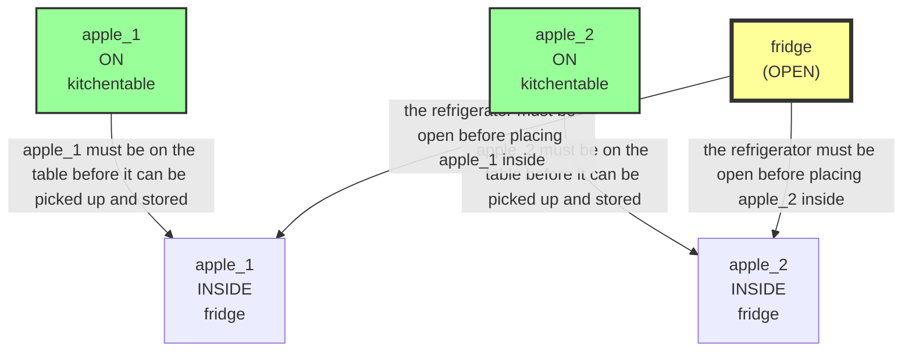
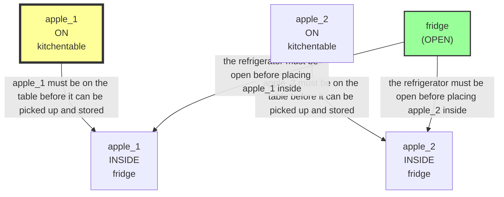
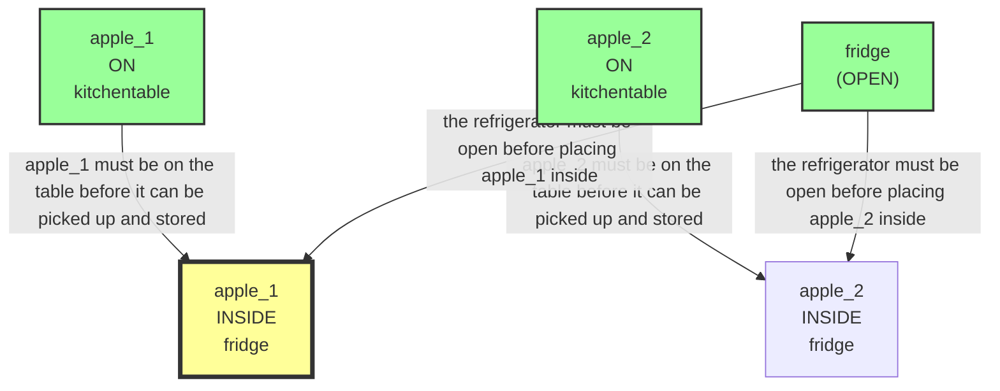
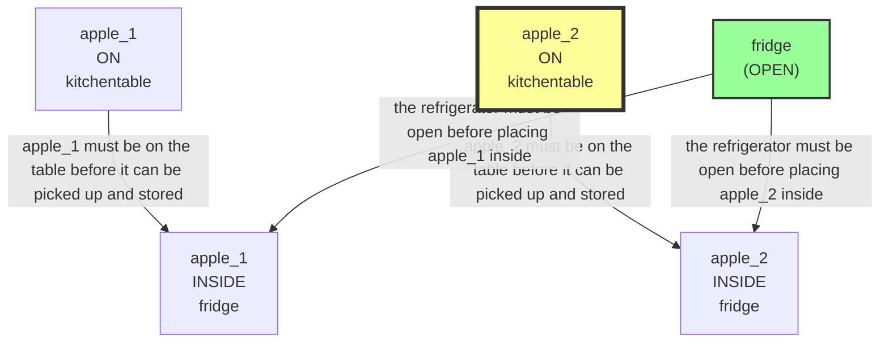
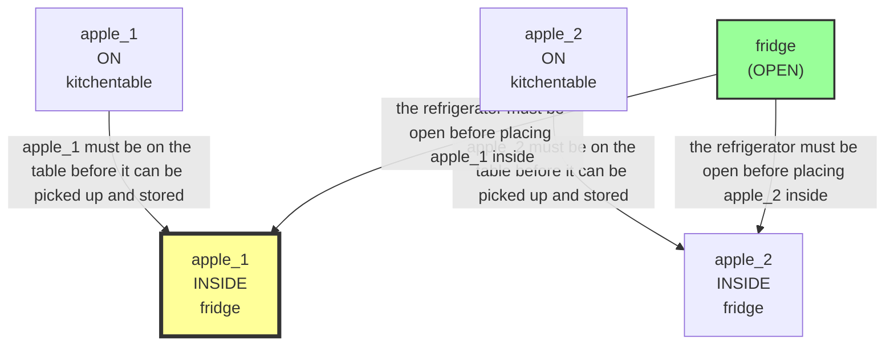
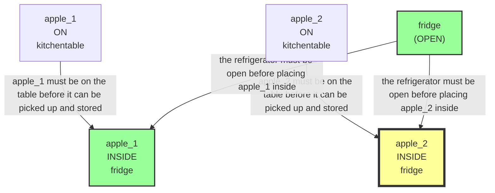

# 🚀 VirtualHome Agent Episode Log


### [GoalReasoner (Module A - Intent)] Output
```json
{
  "is_instruction_obviously_vague": true,
  "clarification_question": "What exact number of apples should be stored?",
  "target_object": "apples",
  "location_hint": "kitchen table",
  "reasoning_chain": [
    {
      "question": "Why does the user want this object?",
      "answer": "To have apples stored instead of left on the kitchen table."
    },
    {
      "question": "Why is that important?",
      "answer": "The user wants the apples put away into a suitable storage location."
    },
    {
      "question": "What fundamental need does this fulfill?",
      "answer": "Organizing and preserving food items in a storage place."
    },
    {
      "question": "Are there any deeper psychological or physical motivations?",
      "answer": "It may help keep the kitchen tidy and keep the apples properly stored."
    }
  ],
  "deep_intent": "The user wants to organize and store food items properly.",
  "acceptable_alternatives_properties": [
    {
      "priority": 1,
      "description": "Other fresh fruits that can be stored in the same kind of kitchen storage area, such as pears or oranges"
    },
    {
      "priority": 2,
      "description": "Other fruit items that are typically kept together in a fruit bowl, drawer, or pantry area"
    },
    {
      "priority": 3,
      "description": "Other shelf-stable snack foods or produce items that can be put away for later use"
    },
    {
      "priority": 4,
      "description": "Other edible household items that can satisfy the goal of putting food into storage rather than leaving it out"
    }
  ]
}
```

### [RoboStateMultiTaskController] Output
```json
{
  "action": "[ask] What exact number of apples should be stored?",
  "active_task_id": "task_1",
  "task_context": {
    "active_task_id": "task_1",
    "pending_task_ids": [],
    "satisfied_task_ids": []
  },
  "source": "goal_reasoner_clarification"
}
```
## Step 0
- **Action**: `[ask] What exact number of apples should be stored?`
- **Action Success**: `True`
- **Action Message**: Both apples.
- **Active Task**: `task_1`
- **Decision Source**: `goal_reasoner_clarification`
- **Task Progress**: T5_G2_12_B2=pending
- **SDG Status**:
No SDG active.
- **Observed Items (159)**: floor(12), floor(13), floor(14), floor(15), floor(16), floor(17), floor(18), floor(19), floor(20), ceiling(21), ceiling(22), ceiling(23), ceiling(24), ceiling(25), ceiling(26)...


### [GoalReasoner (Module A - Intent)] Output
```json
{
  "is_instruction_obviously_vague": true,
  "clarification_question": "What exact place should the apples be stored in?",
  "target_object": "apples",
  "location_hint": "kitchen table",
  "reasoning_chain": [
    {
      "question": "Why does the user want this object?",
      "answer": "To move the apples from the kitchen table to a storage location."
    },
    {
      "question": "Why is that important?",
      "answer": "To put them away instead of leaving them out on the table."
    },
    {
      "question": "What fundamental need does this fulfill?",
      "answer": "To organize and store the apples in a designated place."
    },
    {
      "question": "Are there any deeper psychological or physical motivations?",
      "answer": "Likely to keep the kitchen tidy and preserve the apples appropriately."
    }
  ],
  "deep_intent": "The user wants to store food items in a designated place and keep the kitchen organized.",
  "acceptable_alternatives_properties": [
    {
      "priority": 1,
      "description": "Other similar fruit items that can be stored in the same kind of place, such as pears or oranges"
    },
    {
      "priority": 2,
      "description": "Other whole produce items that are normally kept in a kitchen storage area"
    },
    {
      "priority": 3,
      "description": "Other perishable food items suitable for indoor storage"
    },
    {
      "priority": 4,
      "description": "Any household item that needs to be put into a designated storage location"
    }
  ]
}
```

### [RoboStateMultiTaskController] Output
```json
{
  "action": "[ask] What exact place should the apples be stored in?",
  "active_task_id": "task_1",
  "task_context": {
    "active_task_id": "task_1",
    "pending_task_ids": [],
    "satisfied_task_ids": []
  },
  "source": "goal_reasoner_clarification"
}
```
## Step 1
- **Action**: `[ask] What exact place should the apples be stored in?`
- **Action Success**: `True`
- **Action Message**: Inside the refrigerator.
- **Active Task**: `task_1`
- **Decision Source**: `goal_reasoner_clarification`
- **Task Progress**: T5_G2_12_B2=pending
- **SDG Status**:
No SDG active.
- **Observed Items (159)**: floor(12), floor(13), floor(14), floor(15), floor(16), floor(17), floor(18), floor(19), floor(20), ceiling(21), ceiling(22), ceiling(23), ceiling(24), ceiling(25), ceiling(26)...


### [GoalReasoner (Module A - Intent)] Output
```json
{
  "is_instruction_obviously_vague": false,
  "clarification_question": null,
  "target_object": "apples",
  "location_hint": "kitchen table",
  "reasoning_chain": [
    {
      "question": "Why does the user want this object?",
      "answer": "To preserve the apples by moving them to a colder storage location."
    },
    {
      "question": "Why is that important?",
      "answer": "Refrigeration can help keep them fresh for longer."
    },
    {
      "question": "What fundamental need does this fulfill?",
      "answer": "It fulfills the need to preserve food and reduce spoilage."
    },
    {
      "question": "Are there any deeper psychological or physical motivations?",
      "answer": "The user likely wants to maintain food quality and availability for later use."
    }
  ],
  "deep_intent": "The user wants to preserve food and reduce spoilage.",
  "acceptable_alternatives_properties": [
    {
      "priority": 1,
      "description": "Other fresh produce or perishable foods that can be refrigerated to slow spoilage, such as pears, grapes, or berries"
    },
    {
      "priority": 2,
      "description": "Similar fresh fruit items that benefit from cold storage"
    },
    {
      "priority": 3,
      "description": "Other perishable household foods that are typically kept chilled"
    },
    {
      "priority": 4,
      "description": "Any food item that can be safely stored cold to maintain freshness"
    }
  ]
}
```

### [PerceptionFilter] Output
```json
{
  "reasoning": "The goal is to preserve apples by moving them from the kitchen table into cold storage. The SDG explicitly requires the apples, the kitchen table they are on, and an open fridge to store them. No other tools are needed beyond the fridge and the target apples.",
  "selected_classes": [
    "apple",
    "kitchentable",
    "pear",
    "character",
    "fridge"
  ],
  "raw_class_count": 66
}
```

### [LLMExecutor] Output
```json
{
  "reasoning": "The task is to store both apples in the refrigerator. In the current graph, two apples are present on the kitchen table, and the fridge exists but is closed. The next required prerequisite in the SDG is to open the fridge before either apple can be placed inside. Since I am already close to the kitchen table, and the fridge is a distinct object that can be interacted with only after walking to it, the immediate step is to walk to the fridge.",
  "satisfied_nodes": [
    "N1",
    "N2"
  ],
  "current_node_focus": "N3",
  "mapped_variables": {
    "?Container": "fridge(103)"
  },
  "action": "[walk] <fridge> (103)"
}
```

### [RoboStateMultiTaskController] Output
```json
{
  "action": "[walk] <fridge> (103)",
  "active_task_id": "task_1",
  "task_context": {
    "active_task_id": "task_1",
    "pending_task_ids": [],
    "satisfied_task_ids": []
  },
  "source": "llm_executor"
}
```
## Step 2
- **Action**: `[walk] <fridge> (103)`
- **Action Success**: `True`
- **Action Message**: {'0': {'message': 'Success'}}
- **Active Task**: `task_1`
- **Decision Source**: `llm_executor`
- **Task Progress**: T5_G2_12_B2=pending
- **SDG Status**:

- **Observed Items (10)**: pear(64), kitchentable(72), fridge(103) [CLOSED], apple(47), apple(48), character(1), kitchen(11), bathroom(172), bedroom(211), livingroom(268)


### [PerceptionFilter] Output
```json
{
  "reasoning": "Reused cached class selection.",
  "selected_classes": [
    "apple",
    "kitchentable",
    "pear",
    "character",
    "fridge"
  ],
  "raw_class_count": 66
}
```

### [LLMExecutor] Output
```json
{
  "reasoning": "The fridge is currently CLOSED, but the SDG requires it to be OPEN before either apple can be stored inside. We are already close to the fridge from the previous successful walk, so the next prerequisite action is to open it. The apples are visible on the kitchen table and can be handled after the fridge is open.",
  "satisfied_nodes": [
    "N1",
    "N2"
  ],
  "current_node_focus": "N3",
  "mapped_variables": {
    "?Container": "fridge(103)"
  },
  "action": "[open] <fridge> (103)"
}
```

### [RoboStateMultiTaskController] Output
```json
{
  "action": "[open] <fridge> (103)",
  "active_task_id": "task_1",
  "task_context": {
    "active_task_id": "task_1",
    "pending_task_ids": [],
    "satisfied_task_ids": []
  },
  "source": "llm_executor"
}
```
## Step 3
- **Action**: `[open] <fridge> (103)`
- **Action Success**: `True`
- **Action Message**: {'0': {'message': 'Success'}}
- **Active Task**: `task_1`
- **Decision Source**: `llm_executor`
- **Task Progress**: T5_G2_12_B2=pending
- **SDG Status**:

- **Observed Items (10)**: pear(64), kitchentable(72), fridge(103) [CLOSED], apple(47), apple(48), character(1), kitchen(11), bathroom(172), bedroom(211), livingroom(268)


### [PerceptionFilter] Output
```json
{
  "reasoning": "Reused cached class selection.",
  "selected_classes": [
    "apple",
    "kitchentable",
    "pear",
    "character",
    "fridge"
  ],
  "raw_class_count": 66
}
```

### [LLMExecutor] Output
```json
{
  "reasoning": "The fridge is already open, satisfying N3. Two apples are visible on the kitchen table as apple(47) and apple(48), matching the task goal and SDG prerequisites N1/N2. I need to start storing them in the refrigerator, but I cannot put them in until I have at least one apple in hand. Since I am currently close to the fridge and the apples are on the same kitchen table, the next atomic step is to walk to one apple before grabbing it. I will target apple(47) first as a valid physical instance of an apple on the table.",
  "satisfied_nodes": [
    "N3"
  ],
  "current_node_focus": "N1",
  "mapped_variables": {
    "?Fridge": "fridge(103)",
    "?Apple1": "apple(47)",
    "?Apple2": "apple(48)"
  },
  "action": "[walk] <apple> (47)"
}
```

### [RoboStateMultiTaskController] Output
```json
{
  "action": "[walk] <apple> (47)",
  "active_task_id": "task_1",
  "task_context": {
    "active_task_id": "task_1",
    "pending_task_ids": [],
    "satisfied_task_ids": []
  },
  "source": "llm_executor"
}
```
## Step 4
- **Action**: `[walk] <apple> (47)`
- **Action Success**: `True`
- **Action Message**: {'0': {'message': 'Success'}}
- **Active Task**: `task_1`
- **Decision Source**: `llm_executor`
- **Task Progress**: T5_G2_12_B2=pending
- **SDG Status**:

- **Observed Items (10)**: pear(64), kitchentable(72), fridge(103) [OPEN], apple(47), apple(48), character(1), kitchen(11), bathroom(172), bedroom(211), livingroom(268)


### [PerceptionFilter] Output
```json
{
  "reasoning": "Reused cached class selection.",
  "selected_classes": [
    "apple",
    "kitchentable",
    "pear",
    "character",
    "fridge"
  ],
  "raw_class_count": 66
}
```

### [LLMExecutor] Output
```json
{
  "reasoning": "The fridge is already open and the apples are on the kitchen table. I am currently near the table and the apple objects. To store both apples, the next required step is to pick up one apple before walking back to the fridge for insertion. I will bind the target apple to apple(47) because it is on the kitchen table and close to the character.",
  "satisfied_nodes": [
    "N1",
    "N2",
    "N3"
  ],
  "current_node_focus": "N4",
  "mapped_variables": {
    "?Container": "fridge(103)"
  },
  "action": "[grab] <apple> (47)"
}
```

### [RoboStateMultiTaskController] Output
```json
{
  "action": "[grab] <apple> (47)",
  "active_task_id": "task_1",
  "task_context": {
    "active_task_id": "task_1",
    "pending_task_ids": [],
    "satisfied_task_ids": []
  },
  "source": "llm_executor"
}
```
## Step 5
- **Action**: `[grab] <apple> (47)`
- **Action Success**: `True`
- **Action Message**: {'0': {'message': 'Success'}}
- **Active Task**: `task_1`
- **Decision Source**: `llm_executor`
- **Task Progress**: T5_G2_12_B2=pending
- **SDG Status**:

- **Observed Items (10)**: pear(64), kitchentable(72), fridge(103) [OPEN], apple(47), apple(48), character(1), kitchen(11), bathroom(172), bedroom(211), livingroom(268)


### [PerceptionFilter] Output
```json
{
  "reasoning": "Reused cached class selection.",
  "selected_classes": [
    "apple",
    "kitchentable",
    "pear",
    "character",
    "fridge"
  ],
  "raw_class_count": 66
}
```

### [LLMExecutor] Output
```json
{
  "reasoning": "The fridge is already open and one apple is already in hand from the previous successful grab. The SDG requires both apples from the kitchen table to end up inside the fridge. The current held apple is apple(47); the remaining apple on the table is apple(48). To progress toward the final goal, the next atomic action should be to grab the second apple while it is still close and on the table. This uses the currently free hand and sets up a later walk back to the fridge for storage.",
  "satisfied_nodes": [
    "N3"
  ],
  "current_node_focus": "N2",
  "mapped_variables": {
    "?Container": "fridge(103)"
  },
  "action": "[grab] <apple> (48)"
}
```

### [RoboStateMultiTaskController] Output
```json
{
  "action": "[grab] <apple> (48)",
  "active_task_id": "task_1",
  "task_context": {
    "active_task_id": "task_1",
    "pending_task_ids": [],
    "satisfied_task_ids": []
  },
  "source": "llm_executor"
}
```
## Step 6
- **Action**: `[grab] <apple> (48)`
- **Action Success**: `True`
- **Action Message**: {'0': {'message': 'Success'}}
- **Active Task**: `task_1`
- **Decision Source**: `llm_executor`
- **Task Progress**: T5_G2_12_B2=pending
- **SDG Status**:

- **Observed Items (10)**: pear(64), kitchentable(72), fridge(103) [OPEN], apple(47), apple(48), character(1), kitchen(11), bathroom(172), bedroom(211), livingroom(268)


### [PerceptionFilter] Output
```json
{
  "reasoning": "Reused cached class selection.",
  "selected_classes": [
    "apple",
    "kitchentable",
    "pear",
    "character",
    "fridge"
  ],
  "raw_class_count": 66
}
```

### [LLMExecutor] Output
```json
{
  "reasoning": "We already hold both apples and the refrigerator is open. The next unmet SDG node is to place one apple into the fridge. The current graph shows apple(47) and apple(48) are both held and close, while fridge(103) is open. Since putting into a container requires being near the destination and the last action was grabbing apple(48), the immediate next step should be to walk to the fridge before attempting any put-in action.",
  "satisfied_nodes": [
    "N3"
  ],
  "current_node_focus": "N4",
  "mapped_variables": {
    "?Container": "fridge(103)"
  },
  "action": "[walk] <fridge> (103)"
}
```

### [RoboStateMultiTaskController] Output
```json
{
  "action": "[walk] <fridge> (103)",
  "active_task_id": "task_1",
  "task_context": {
    "active_task_id": "task_1",
    "pending_task_ids": [],
    "satisfied_task_ids": []
  },
  "source": "llm_executor"
}
```
## Step 7
- **Action**: `[walk] <fridge> (103)`
- **Action Success**: `True`
- **Action Message**: {'0': {'message': 'Success'}}
- **Active Task**: `task_1`
- **Decision Source**: `llm_executor`
- **Task Progress**: T5_G2_12_B2=pending
- **SDG Status**:

- **Observed Items (10)**: pear(64), kitchentable(72), fridge(103) [OPEN], apple(47), apple(48), character(1), kitchen(11), bathroom(172), bedroom(211), livingroom(268)


### [PerceptionFilter] Output
```json
{
  "reasoning": "Reused cached class selection.",
  "selected_classes": [
    "apple",
    "kitchentable",
    "pear",
    "character",
    "fridge"
  ],
  "raw_class_count": 66
}
```

### [LLMExecutor] Output
```json
{
  "reasoning": "We already have both apples in hand and are close to the open fridge, so the next needed step toward satisfying the remaining sink nodes is to place one apple inside the fridge. Since only one atomic action is allowed, I will store the right-hand apple first. The fridge is already OPEN, satisfying N3.",
  "satisfied_nodes": [
    "N3",
    "N1",
    "N2"
  ],
  "current_node_focus": "N4",
  "mapped_variables": {
    "?Container": "fridge(103)"
  },
  "action": "[putin] <apple> (47) <fridge> (103)"
}
```

### [RoboStateMultiTaskController] Output
```json
{
  "action": "[putin] <apple> (47) <fridge> (103)",
  "active_task_id": "task_1",
  "task_context": {
    "active_task_id": "task_1",
    "pending_task_ids": [],
    "satisfied_task_ids": []
  },
  "source": "llm_executor"
}
```
## Step 8
- **Action**: `[putin] <apple> (47) <fridge> (103)`
- **Action Success**: `True`
- **Action Message**: {'0': {'message': 'Success'}}
- **Active Task**: `task_1`
- **Decision Source**: `llm_executor`
- **Task Progress**: T5_G2_12_B2=pending
- **SDG Status**:

- **Observed Items (10)**: pear(64), kitchentable(72), fridge(103) [OPEN], apple(47), apple(48), character(1), kitchen(11), bathroom(172), bedroom(211), livingroom(268)


### [PerceptionFilter] Output
```json
{
  "reasoning": "Reused cached class selection.",
  "selected_classes": [
    "apple",
    "kitchentable",
    "pear",
    "character",
    "fridge"
  ],
  "raw_class_count": 66
}
```

### [LLMExecutor] Output
```json
{
  "reasoning": "We have already satisfied the fridge-open prerequisite and stored apple(47) inside the fridge. The remaining unsatisfied goal node is to move apple(48) into the open fridge. Since apple(48) is currently held in the left hand and the character is already close to the fridge, the next required step is to place it into the refrigerator. The fridge is open, so no additional open action is needed.",
  "satisfied_nodes": [
    "N3",
    "N4"
  ],
  "current_node_focus": "N5",
  "mapped_variables": {
    "?Container": "fridge(103)"
  },
  "action": "[putin] <apple> (48) <fridge> (103)"
}
```

### [RoboStateMultiTaskController] Output
```json
{
  "action": "[putin] <apple> (48) <fridge> (103)",
  "active_task_id": "task_1",
  "task_context": {
    "active_task_id": "task_1",
    "pending_task_ids": [],
    "satisfied_task_ids": []
  },
  "source": "llm_executor"
}
```
## Step 9
- **Action**: `[putin] <apple> (48) <fridge> (103)`
- **Action Success**: `True`
- **Action Message**: {'0': {'message': 'Success'}}
- **Active Task**: `task_1`
- **Decision Source**: `llm_executor`
- **Task Progress**: T5_G2_12_B2=done
- **SDG Status**:

- **Observed Items (10)**: pear(64), kitchentable(72), fridge(103) [OPEN], apple(47) [COLD], apple(48), character(1), kitchen(11), bathroom(172), bedroom(211), livingroom(268)

