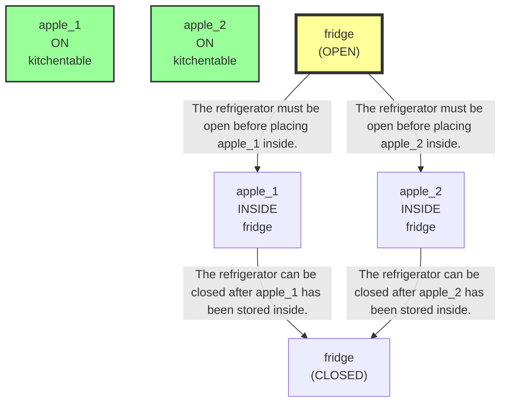
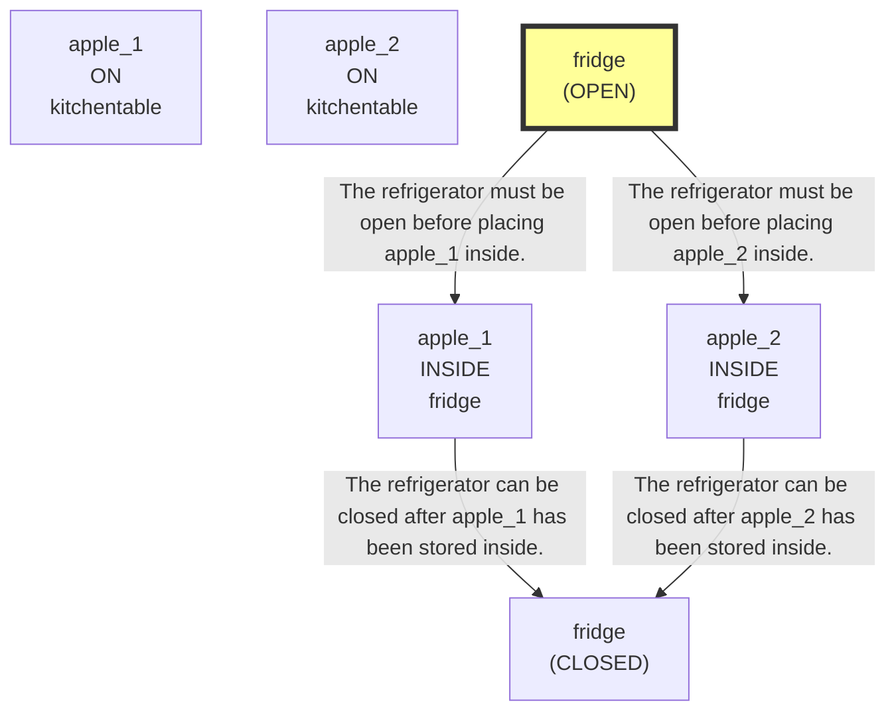
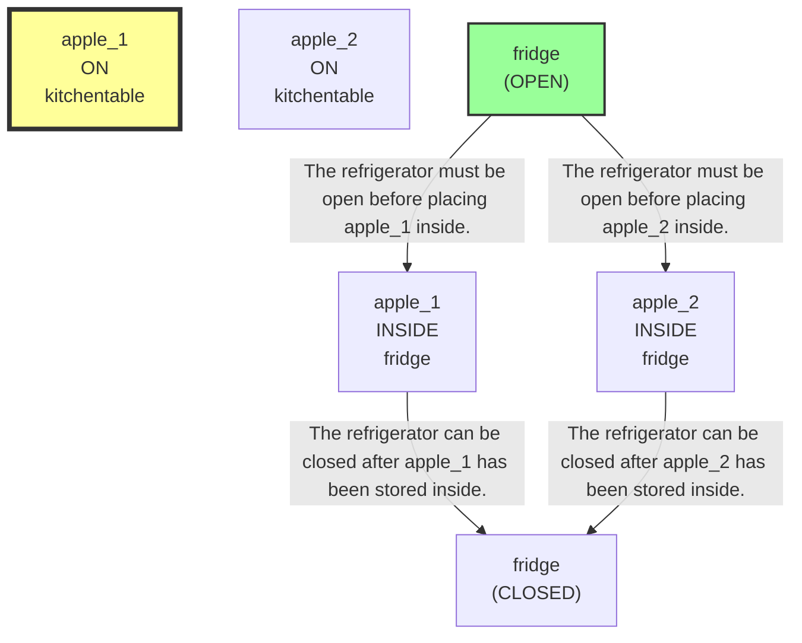
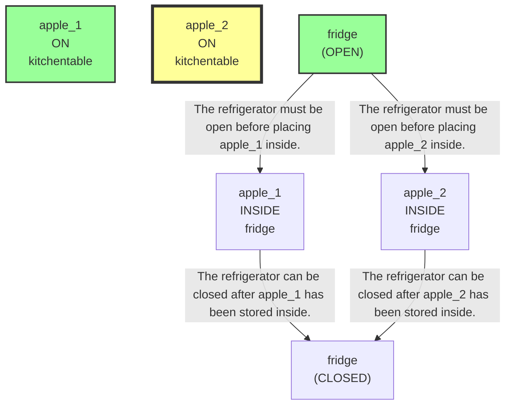
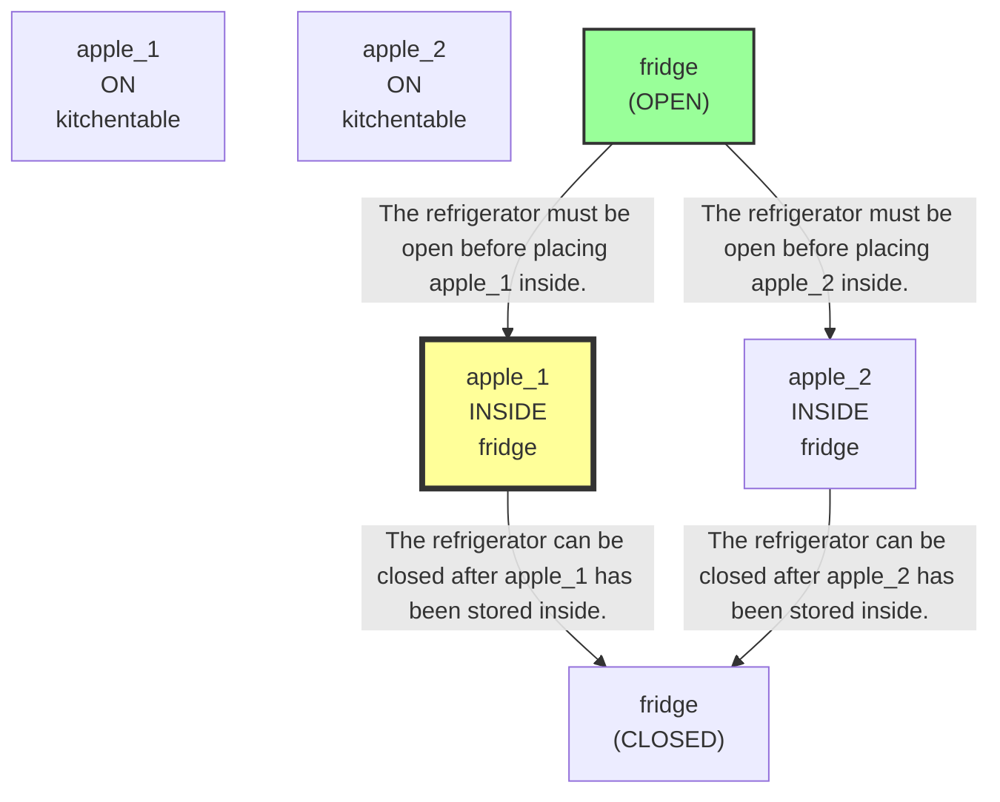
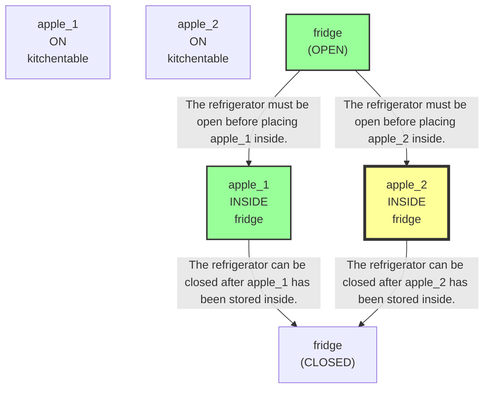

# 🚀 VirtualHome Agent Episode Log


### [GoalReasoner (Module A - Intent)] Output
```json
{
  "is_instruction_obviously_vague": true,
  "clarification_question": "What is the proper place to store the apples?",
  "target_object": "apples",
  "location_hint": "kitchen table",
  "reasoning_chain": [
    {
      "question": "Why does the user want this object?",
      "answer": "To move the apples from the kitchen table into storage."
    },
    {
      "question": "Why is that important?",
      "answer": "To keep the apples in the intended storage location instead of leaving them on the table."
    },
    {
      "question": "What fundamental need does this fulfill?",
      "answer": "To organize and store food items in a designated place."
    },
    {
      "question": "Are there any deeper psychological or physical motivations?",
      "answer": "It may help maintain order, reduce clutter, and preserve the apples for later use."
    }
  ],
  "deep_intent": "The user wants to store food items in their designated place.",
  "acceptable_alternatives_properties": [
    {
      "priority": 1,
      "description": "Other similar fruit items that can be moved into the same storage location"
    },
    {
      "priority": 2,
      "description": "Other fresh produce items typically stored together in a kitchen storage area"
    },
    {
      "priority": 3,
      "description": "Other food items that are intended to be put away for later use"
    },
    {
      "priority": 4,
      "description": "Other household items that need to be organized and stored in a designated place"
    }
  ]
}
```

### [RoboStateMultiTaskController] Output
```json
{
  "action": "[ask] What is the proper place to store the apples?",
  "active_task_id": "task_1",
  "task_context": {
    "active_task_id": "task_1",
    "pending_task_ids": [],
    "satisfied_task_ids": []
  },
  "source": "goal_reasoner_clarification"
}
```
## Step 0
- **Action**: `[ask] What is the proper place to store the apples?`
- **Action Success**: `True`
- **Action Message**: Inside the refrigerator.
- **Active Task**: `task_1`
- **Decision Source**: `goal_reasoner_clarification`
- **Task Progress**: T5_G2_12_B3=pending
- **SDG Status**:
No SDG active.
- **Observed Items (159)**: floor(12), floor(13), floor(14), floor(15), floor(16), floor(17), floor(18), floor(19), floor(20), ceiling(21), ceiling(22), ceiling(23), ceiling(24), ceiling(25), ceiling(26)...


### [GoalReasoner (Module A - Intent)] Output
```json
{
  "is_instruction_obviously_vague": true,
  "clarification_question": "How many apples should be stored inside the refrigerator?",
  "target_object": "apples",
  "location_hint": "kitchen table",
  "reasoning_chain": [
    {
      "question": "Why does the user want this object?",
      "answer": "To have the apples stored away from the kitchen table."
    },
    {
      "question": "Why is that important?",
      "answer": "To place the apples in the refrigerator for storage."
    },
    {
      "question": "What fundamental need does this fulfill?",
      "answer": "It fulfills the need to preserve food by storing it in a cooler place."
    },
    {
      "question": "Are there any deeper psychological or physical motivations?",
      "answer": "The likely motivation is practical food preservation and organization, not a deeper psychological need."
    }
  ],
  "deep_intent": "The user wants to preserve food by storing it in a cooler environment.",
  "acceptable_alternatives_properties": [
    {
      "priority": 1,
      "description": "Other fresh fruits that can be refrigerated, such as pears or berries"
    },
    {
      "priority": 2,
      "description": "Other perishable produce items that benefit from cold storage"
    },
    {
      "priority": 3,
      "description": "Other ready-to-store refrigerated foods or ingredients"
    },
    {
      "priority": 4,
      "description": "Non-fresh foods that still need cool storage to maintain quality"
    }
  ]
}
```

### [RoboStateMultiTaskController] Output
```json
{
  "action": "[ask] How many apples should be stored inside the refrigerator?",
  "active_task_id": "task_1",
  "task_context": {
    "active_task_id": "task_1",
    "pending_task_ids": [],
    "satisfied_task_ids": []
  },
  "source": "goal_reasoner_clarification"
}
```
## Step 1
- **Action**: `[ask] How many apples should be stored inside the refrigerator?`
- **Action Success**: `True`
- **Action Message**: Both apples.
- **Active Task**: `task_1`
- **Decision Source**: `goal_reasoner_clarification`
- **Task Progress**: T5_G2_12_B3=pending
- **SDG Status**:
No SDG active.
- **Observed Items (159)**: floor(12), floor(13), floor(14), floor(15), floor(16), floor(17), floor(18), floor(19), floor(20), ceiling(21), ceiling(22), ceiling(23), ceiling(24), ceiling(25), ceiling(26)...


### [GoalReasoner (Module A - Intent)] Output
```json
{
  "is_instruction_obviously_vague": false,
  "clarification_question": null,
  "target_object": "apples",
  "location_hint": "kitchen table",
  "reasoning_chain": [
    {
      "question": "Why does the user want this object?",
      "answer": "To move the apples from the kitchen table into cold storage."
    },
    {
      "question": "Why is that important?",
      "answer": "To preserve the apples by keeping them refrigerated."
    },
    {
      "question": "What fundamental need does this fulfill?",
      "answer": "To keep food fresh and suitable for later use."
    },
    {
      "question": "Are there any deeper psychological or physical motivations?",
      "answer": "The user likely wants to prevent spoilage and maintain the condition of the food."
    }
  ],
  "deep_intent": "The user wants to preserve food freshness and prevent spoilage.",
  "acceptable_alternatives_properties": [
    {
      "priority": 1,
      "description": "Other fresh fruits that can be refrigerated, such as pears or grapes"
    },
    {
      "priority": 2,
      "description": "Other perishable produce items that are typically stored cold, such as berries or cut fruit"
    },
    {
      "priority": 3,
      "description": "Any refrigerated food items that benefit from cold storage to stay fresh"
    },
    {
      "priority": 4,
      "description": "Cold-storage-friendly edible items that help maintain freshness, even if they are not fruit"
    }
  ]
}
```

### [PerceptionFilter] Output
```json
{
  "reasoning": "The goal is to move apples from the kitchen table into cold storage. The SDG requires the apples, the fridge, and the kitchen table as the source location. Because the fridge must be open before storing and then closed afterward, the fridge is essential. No other tools are required for this task.",
  "selected_classes": [
    "apple",
    "kitchentable",
    "pear",
    "character",
    "fridge"
  ],
  "raw_class_count": 66
}
```

### [LLMExecutor] Output
```json
{
  "reasoning": "The task is to store both apples in the refrigerator. The fridge is currently closed, and the apples are on the kitchen table. Since opening a container requires being near it, and the fridge is the next prerequisite before putting the apples inside, the best immediate step is to walk to the fridge. The closest matching refrigerator is fridge(103), which is closed and has CAN_OPEN/HAS_PLUG properties as expected.",
  "satisfied_nodes": [
    "N1",
    "N2"
  ],
  "current_node_focus": "N3",
  "mapped_variables": {
    "?Washer": "sink(unknown)",
    "?Container": "fridge(103)"
  },
  "action": "[walk] <fridge> (103)"
}
```

### [RoboStateMultiTaskController] Output
```json
{
  "action": "[walk] <fridge> (103)",
  "active_task_id": "task_1",
  "task_context": {
    "active_task_id": "task_1",
    "pending_task_ids": [],
    "satisfied_task_ids": []
  },
  "source": "llm_executor"
}
```
## Step 2
- **Action**: `[walk] <fridge> (103)`
- **Action Success**: `True`
- **Action Message**: {'0': {'message': 'Success'}}
- **Active Task**: `task_1`
- **Decision Source**: `llm_executor`
- **Task Progress**: T5_G2_12_B3=pending
- **SDG Status**:

- **Observed Items (10)**: pear(64), kitchentable(72), fridge(103) [CLOSED], apple(47), apple(48), character(1), kitchen(11), bathroom(172), bedroom(211), livingroom(268)


### [PerceptionFilter] Output
```json
{
  "reasoning": "Reused cached class selection.",
  "selected_classes": [
    "apple",
    "kitchentable",
    "pear",
    "character",
    "fridge"
  ],
  "raw_class_count": 66
}
```

### [LLMExecutor] Output
```json
{
  "reasoning": "The fridge is already reached and currently CLOSED, which blocks storing the apples. To satisfy the prerequisite for placing both apples inside, the next atomic step is to open the refrigerator. The current graph shows the fridge is the correct container and it has CAN_OPEN, so opening it is valid.",
  "satisfied_nodes": [],
  "current_node_focus": "N3",
  "mapped_variables": {},
  "action": "[open] <fridge> (103)"
}
```

### [RoboStateMultiTaskController] Output
```json
{
  "action": "[open] <fridge> (103)",
  "active_task_id": "task_1",
  "task_context": {
    "active_task_id": "task_1",
    "pending_task_ids": [],
    "satisfied_task_ids": []
  },
  "source": "llm_executor"
}
```
## Step 3
- **Action**: `[open] <fridge> (103)`
- **Action Success**: `True`
- **Action Message**: {'0': {'message': 'Success'}}
- **Active Task**: `task_1`
- **Decision Source**: `llm_executor`
- **Task Progress**: T5_G2_12_B3=pending
- **SDG Status**:

- **Observed Items (10)**: pear(64), kitchentable(72), fridge(103) [CLOSED], apple(47), apple(48), character(1), kitchen(11), bathroom(172), bedroom(211), livingroom(268)


### [PerceptionFilter] Output
```json
{
  "reasoning": "Reused cached class selection.",
  "selected_classes": [
    "apple",
    "kitchentable",
    "pear",
    "character",
    "fridge"
  ],
  "raw_class_count": 66
}
```

### [LLMExecutor] Output
```json
{
  "reasoning": "The fridge is already open, and the goal is to move both apples from the kitchen table into it. The current graph shows two apples on the kitchen table: apple(47) and apple(48). The next required progress is to pick up one apple before walking back to the fridge for storage. Since the refrigerator is already open and we are close to it, I should first grab one apple that matches the task (apples on the kitchen table). I will start with apple(47) as one of the two required apples.",
  "satisfied_nodes": [
    "N3"
  ],
  "current_node_focus": "N1",
  "mapped_variables": {},
  "action": "[grab] <apple> (47)"
}
```

### [RoboStateMultiTaskController] Output
```json
{
  "action": "[walk] <apple> (47)",
  "active_task_id": "task_1",
  "task_context": {
    "active_task_id": "task_1",
    "pending_task_ids": [],
    "satisfied_task_ids": []
  },
  "source": "llm_executor_repaired"
}
```
## Step 4
- **Action**: `[walk] <apple> (47)`
- **Action Success**: `True`
- **Action Message**: {'0': {'message': 'Success'}}
- **Active Task**: `task_1`
- **Decision Source**: `llm_executor_repaired`
- **Task Progress**: T5_G2_12_B3=pending
- **SDG Status**:

- **Observed Items (10)**: pear(64), kitchentable(72), fridge(103) [OPEN], apple(47), apple(48), character(1), kitchen(11), bathroom(172), bedroom(211), livingroom(268)


### [PerceptionFilter] Output
```json
{
  "reasoning": "Reused cached class selection.",
  "selected_classes": [
    "apple",
    "kitchentable",
    "pear",
    "character",
    "fridge"
  ],
  "raw_class_count": 66
}
```

### [LLMExecutor] Output
```json
{
  "reasoning": "The fridge is already open, and the task requires moving both apples from the kitchen table into it. One apple is currently visible and close to the character: apple(47) on the kitchentable. Since the next required progress toward the final goal is to pick up an apple before placing it in the fridge, I will grab apple(47) now. This matches the SDG prerequisite chain toward storing both apples and later closing the fridge.",
  "satisfied_nodes": [
    "N3"
  ],
  "current_node_focus": "N1",
  "mapped_variables": {
    "?Container": "fridge(103)"
  },
  "action": "[grab] <apple> (47)"
}
```

### [RoboStateMultiTaskController] Output
```json
{
  "action": "[grab] <apple> (47)",
  "active_task_id": "task_1",
  "task_context": {
    "active_task_id": "task_1",
    "pending_task_ids": [],
    "satisfied_task_ids": []
  },
  "source": "llm_executor"
}
```
## Step 5
- **Action**: `[grab] <apple> (47)`
- **Action Success**: `True`
- **Action Message**: {'0': {'message': 'Success'}}
- **Active Task**: `task_1`
- **Decision Source**: `llm_executor`
- **Task Progress**: T5_G2_12_B3=pending
- **SDG Status**:

- **Observed Items (10)**: pear(64), kitchentable(72), fridge(103) [OPEN], apple(47), apple(48), character(1), kitchen(11), bathroom(172), bedroom(211), livingroom(268)


### [PerceptionFilter] Output
```json
{
  "reasoning": "Reused cached class selection.",
  "selected_classes": [
    "apple",
    "kitchentable",
    "pear",
    "character",
    "fridge"
  ],
  "raw_class_count": 66
}
```

### [LLMExecutor] Output
```json
{
  "reasoning": "The fridge is already open, and the graph shows the target apple that is on the kitchen table as apple(48). We are currently holding apple(47) in the right hand, so the next needed step toward the goal is to pick up the second apple before transporting both to the fridge. I will grab apple(48) now; afterwards I can walk back to the fridge and store both apples.",
  "satisfied_nodes": [
    "N3",
    "N1"
  ],
  "current_node_focus": "N2",
  "mapped_variables": {
    "?Container": "fridge(103)"
  },
  "action": "[grab] <apple> (48)"
}
```

### [RoboStateMultiTaskController] Output
```json
{
  "action": "[grab] <apple> (48)",
  "active_task_id": "task_1",
  "task_context": {
    "active_task_id": "task_1",
    "pending_task_ids": [],
    "satisfied_task_ids": []
  },
  "source": "llm_executor"
}
```
## Step 6
- **Action**: `[grab] <apple> (48)`
- **Action Success**: `True`
- **Action Message**: {'0': {'message': 'Success'}}
- **Active Task**: `task_1`
- **Decision Source**: `llm_executor`
- **Task Progress**: T5_G2_12_B3=pending
- **SDG Status**:

- **Observed Items (10)**: pear(64), kitchentable(72), fridge(103) [OPEN], apple(47), apple(48), character(1), kitchen(11), bathroom(172), bedroom(211), livingroom(268)


### [PerceptionFilter] Output
```json
{
  "reasoning": "Reused cached class selection.",
  "selected_classes": [
    "apple",
    "kitchentable",
    "pear",
    "character",
    "fridge"
  ],
  "raw_class_count": 66
}
```

### [LLMExecutor] Output
```json
{
  "reasoning": "The fridge is already open, and both apples have been successfully grabbed and are currently held. The next required step toward satisfying N4 and N5 is to place one apple into the fridge. Since put-in actions require being near the destination and we are currently not explicitly shown as near the fridge, but the fridge was the last destination interacted with and remains open, the safest progress action is to walk back to the fridge before putting an apple inside. I will focus on storing apple_1 first, which is the next unsatisfied sink node before closing the fridge.",
  "satisfied_nodes": [
    "N3"
  ],
  "current_node_focus": "N4",
  "mapped_variables": {},
  "action": "[walk] <fridge> (103)"
}
```

### [RoboStateMultiTaskController] Output
```json
{
  "action": "[walk] <fridge> (103)",
  "active_task_id": "task_1",
  "task_context": {
    "active_task_id": "task_1",
    "pending_task_ids": [],
    "satisfied_task_ids": []
  },
  "source": "llm_executor"
}
```
## Step 7
- **Action**: `[walk] <fridge> (103)`
- **Action Success**: `True`
- **Action Message**: {'0': {'message': 'Success'}}
- **Active Task**: `task_1`
- **Decision Source**: `llm_executor`
- **Task Progress**: T5_G2_12_B3=pending
- **SDG Status**:

- **Observed Items (10)**: pear(64), kitchentable(72), fridge(103) [OPEN], apple(47), apple(48), character(1), kitchen(11), bathroom(172), bedroom(211), livingroom(268)


### [PerceptionFilter] Output
```json
{
  "reasoning": "Reused cached class selection.",
  "selected_classes": [
    "apple",
    "kitchentable",
    "pear",
    "character",
    "fridge"
  ],
  "raw_class_count": 66
}
```

### [LLMExecutor] Output
```json
{
  "reasoning": "We are already holding both apples and are close to the open fridge. The next required step in the SDG is to place apple_1 and apple_2 inside the fridge before closing it. Since a [putin] requires the destination to be explicitly walked to first and we just walked to the fridge, the best next atomic action is to put one held apple into the open fridge. I will place apple(47) first.",
  "satisfied_nodes": [
    "N3"
  ],
  "current_node_focus": "N4",
  "mapped_variables": {
    "?Container": "fridge(103)"
  },
  "action": "[putin] <apple> (47) <fridge> (103)"
}
```

### [RoboStateMultiTaskController] Output
```json
{
  "action": "[putin] <apple> (47) <fridge> (103)",
  "active_task_id": "task_1",
  "task_context": {
    "active_task_id": "task_1",
    "pending_task_ids": [],
    "satisfied_task_ids": []
  },
  "source": "llm_executor"
}
```
## Step 8
- **Action**: `[putin] <apple> (47) <fridge> (103)`
- **Action Success**: `True`
- **Action Message**: {'0': {'message': 'Success'}}
- **Active Task**: `task_1`
- **Decision Source**: `llm_executor`
- **Task Progress**: T5_G2_12_B3=pending
- **SDG Status**:

- **Observed Items (10)**: pear(64), kitchentable(72), fridge(103) [OPEN], apple(47), apple(48), character(1), kitchen(11), bathroom(172), bedroom(211), livingroom(268)


### [PerceptionFilter] Output
```json
{
  "reasoning": "Reused cached class selection.",
  "selected_classes": [
    "apple",
    "kitchentable",
    "pear",
    "character",
    "fridge"
  ],
  "raw_class_count": 66
}
```

### [LLMExecutor] Output
```json
{
  "reasoning": "Apple_1 has already been stored inside the fridge, and the fridge is currently open. Apple_2 is the remaining apple and is currently held in the left hand, so the next required step is to move to the fridge and place apple_2 inside it. I am not closing the fridge yet because N6 depends on both apples being inside first.",
  "satisfied_nodes": [
    "N3",
    "N4"
  ],
  "current_node_focus": "N5",
  "mapped_variables": {
    "?Container": "fridge(103)"
  },
  "action": "[putin] <apple> (48) <fridge> (103)"
}
```

### [RoboStateMultiTaskController] Output
```json
{
  "action": "[putin] <apple> (48) <fridge> (103)",
  "active_task_id": "task_1",
  "task_context": {
    "active_task_id": "task_1",
    "pending_task_ids": [],
    "satisfied_task_ids": []
  },
  "source": "llm_executor"
}
```
## Step 9
- **Action**: `[putin] <apple> (48) <fridge> (103)`
- **Action Success**: `True`
- **Action Message**: {'0': {'message': 'Success'}}
- **Active Task**: `task_1`
- **Decision Source**: `llm_executor`
- **Task Progress**: T5_G2_12_B3=done
- **SDG Status**:

- **Observed Items (10)**: pear(64), kitchentable(72), fridge(103) [OPEN], apple(47) [COLD], apple(48), character(1), kitchen(11), bathroom(172), bedroom(211), livingroom(268)

