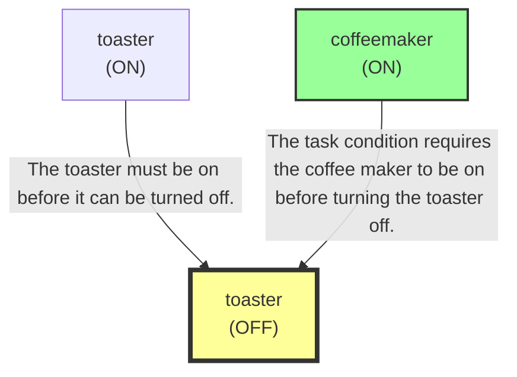
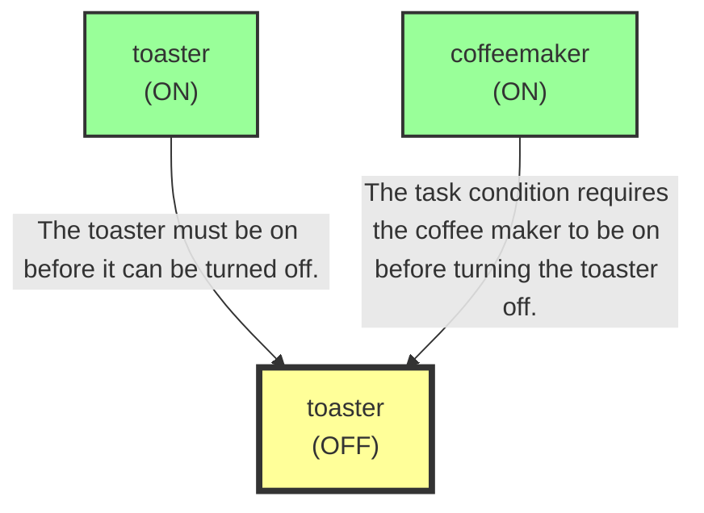

# 🚀 VirtualHome Agent Episode Log


### [GoalReasoner (Module A - Intent)] Output
```json
{
  "is_instruction_obviously_vague": true,
  "clarification_question": "Which appliance should be adjusted?",
  "target_object": null,
  "location_hint": null,
  "reasoning_chain": [
    {
      "question": "Why does the user want this object?",
      "answer": "To change an appliance to a requested state."
    },
    {
      "question": "Why is that important?",
      "answer": "So the correct appliance ends up in the desired condition."
    },
    {
      "question": "What fundamental need does this fulfill?",
      "answer": "It fulfills the need to control or modify the operation of a household appliance."
    },
    {
      "question": "Are there any deeper psychological or physical motivations?",
      "answer": "The user likely wants to carry out a specific preparation or usage task that depends on one appliance being set correctly."
    }
  ],
  "deep_intent": "The user wants to control a household appliance so it reaches a desired state.",
  "acceptable_alternatives_properties": [
    {
      "priority": 1,
      "description": "Other indoor household appliances that can be switched or adjusted to a specific operating state"
    },
    {
      "priority": 2,
      "description": "Small kitchen appliances with a selectable setting or on/off state"
    },
    {
      "priority": 3,
      "description": "Any similar device that can be configured to a requested operational condition"
    },
    {
      "priority": 4,
      "description": "Other controllable household equipment that serves the same practical purpose of preparation or convenience"
    }
  ]
}
```

### [RoboStateMultiTaskController] Output
```json
{
  "action": "[ask] Which appliance should be adjusted?",
  "active_task_id": "task_1",
  "task_context": {
    "active_task_id": "task_1",
    "pending_task_ids": [],
    "satisfied_task_ids": []
  },
  "source": "goal_reasoner_clarification"
}
```
## Step 0
- **Action**: `[ask] Which appliance should be adjusted?`
- **Action Success**: `True`
- **Action Message**: The toaster.
- **Active Task**: `task_1`
- **Decision Source**: `goal_reasoner_clarification`
- **Task Progress**: T5_G2_13_B2=pending
- **SDG Status**:
No SDG active.
- **Observed Items (96)**: floor(112), floor(113), floor(114), floor(115), floor(116), floor(117), wall(118), wall(119), wall(120), wall(121), wall(122), wall(123), ceiling(124), ceiling(125), ceiling(126)...


### [GoalReasoner (Module A - Intent)] Output
```json
{
  "is_instruction_obviously_vague": true,
  "clarification_question": "What specific state should the toaster be adjusted to?",
  "target_object": "toaster",
  "location_hint": null,
  "reasoning_chain": [
    {
      "question": "Why does the user want this object?",
      "answer": "To change the toaster to a requested state."
    },
    {
      "question": "Why is that important?",
      "answer": "So the toaster matches the desired setting for use."
    },
    {
      "question": "What fundamental need does this fulfill?",
      "answer": "It fulfills the need to control or prepare the toaster for an intended task."
    },
    {
      "question": "Are there any deeper psychological or physical motivations?",
      "answer": "The likely motivation is to ensure the appliance is set correctly and safely for the user’s intended use."
    }
  ],
  "deep_intent": "The user wants an appliance adjusted to a specified operating state.",
  "acceptable_alternatives_properties": [
    {
      "priority": 1,
      "description": "Other countertop appliances that can be set to a specific operating state, such as a microwave, kettle, or coffee maker."
    },
    {
      "priority": 2,
      "description": "Other kitchen devices with adjustable controls or modes, such as an oven or air fryer."
    },
    {
      "priority": 3,
      "description": "Any indoor appliance that can be configured to a user-specified setting."
    },
    {
      "priority": 4,
      "description": "A different device that serves the same practical purpose of preparing food or drink to a desired state."
    }
  ]
}
```

### [RoboStateMultiTaskController] Output
```json
{
  "action": "[ask] What specific state should the toaster be adjusted to?",
  "active_task_id": "task_1",
  "task_context": {
    "active_task_id": "task_1",
    "pending_task_ids": [],
    "satisfied_task_ids": []
  },
  "source": "goal_reasoner_clarification"
}
```
## Step 1
- **Action**: `[ask] What specific state should the toaster be adjusted to?`
- **Action Success**: `True`
- **Action Message**: Turn it off.
- **Active Task**: `task_1`
- **Decision Source**: `goal_reasoner_clarification`
- **Task Progress**: T5_G2_13_B2=pending
- **SDG Status**:
No SDG active.
- **Observed Items (96)**: floor(112), floor(113), floor(114), floor(115), floor(116), floor(117), wall(118), wall(119), wall(120), wall(121), wall(122), wall(123), ceiling(124), ceiling(125), ceiling(126)...


### [GoalReasoner (Module A - Intent)] Output
```json
{
  "is_instruction_obviously_vague": false,
  "clarification_question": null,
  "target_object": "toaster",
  "location_hint": null,
  "reasoning_chain": [
    {
      "question": "Why does the user want this object?",
      "answer": "To change the toaster's power state from on to off."
    },
    {
      "question": "Why is that important?",
      "answer": "To ensure the toaster is not actively running when it should be off."
    },
    {
      "question": "What fundamental need does this fulfill?",
      "answer": "To manage appliance operation and reduce unnecessary energy use or potential hazard."
    },
    {
      "question": "Are there any deeper psychological or physical motivations?",
      "answer": "The user likely wants the kitchen appliances in a safe, controlled state."
    }
  ],
  "deep_intent": "To ensure an appliance is turned off for safe and controlled operation.",
  "acceptable_alternatives_properties": [
    {
      "priority": 1,
      "description": "Any other kitchen appliance or device that is currently on and should be turned off for safety or energy conservation."
    },
    {
      "priority": 2,
      "description": "Other household electrical appliances that can be switched off to reduce power usage."
    },
    {
      "priority": 3,
      "description": "Powered devices in the indoor environment that are safe to deactivate."
    },
    {
      "priority": 4,
      "description": "A different on/off controllable device whose shutdown would satisfy the same safety or energy-saving goal."
    }
  ]
}
```

### [PerceptionFilter] Output
```json
{
  "reasoning": "The goal is to turn the toaster off, and the SDG also requires the coffeemaker to be on as a prerequisite. So the only necessary object classes are the target appliance and the dependent appliance.",
  "selected_classes": [
    "character",
    "coffeemaker",
    "toaster",
    "door"
  ],
  "raw_class_count": 56
}
```

### [LLMExecutor] Output
```json
{
  "reasoning": "The SDG indicates the toaster must transition from ON to OFF, and the current graph shows the toaster(158) is ON, so the task is not yet satisfied. The toaster has HAS_SWITCH and is in the same kitchen as the character, so the next required step is to operate its switch. No walk is necessary because the graph already places both in the kitchen and the instruction says not to repeat a walk action if just done; there was no recent walk in the past actions. The coffeemaker being ON is an SDG prerequisite already satisfied, so we can proceed with the toaster shutdown. ",
  "satisfied_nodes": [
    "N3"
  ],
  "current_node_focus": "N1",
  "mapped_variables": {},
  "action": "[switchoff] <toaster> (158)"
}
```

### [RoboStateMultiTaskController] Output
```json
{
  "action": "[walk] <toaster> (158)",
  "active_task_id": "task_1",
  "task_context": {
    "active_task_id": "task_1",
    "pending_task_ids": [],
    "satisfied_task_ids": []
  },
  "source": "llm_executor_repaired"
}
```
## Step 2
- **Action**: `[walk] <toaster> (158)`
- **Action Success**: `True`
- **Action Message**: {'0': {'message': 'Success'}}
- **Active Task**: `task_1`
- **Decision Source**: `llm_executor_repaired`
- **Task Progress**: T5_G2_13_B2=pending
- **SDG Status**:

- **Observed Items (8)**: door(130) [OPEN], toaster(158) [ON], coffeemaker(161) [ON,CLOSED], character(1), livingroom(11), kitchen(111), bedroom(214), bathroom(276)


### [PerceptionFilter] Output
```json
{
  "reasoning": "Reused cached class selection.",
  "selected_classes": [
    "character",
    "coffeemaker",
    "toaster",
    "door"
  ],
  "raw_class_count": 56
}
```

### [LLMExecutor] Output
```json
{
  "reasoning": "The SDG requires the toaster to end OFF, but its prerequisite state is ON, which is already satisfied in the current graph. The toaster is currently close to the character, so the next atomic step is to switch it off. The coffeemaker ON prerequisite is also already satisfied. No further movement is needed.",
  "satisfied_nodes": [
    "N2",
    "N3"
  ],
  "current_node_focus": "N1",
  "mapped_variables": {
    "?Appliance": "toaster(158)"
  },
  "action": "[switchoff] <toaster> (158)"
}
```

### [RoboStateMultiTaskController] Output
```json
{
  "action": "[switchoff] <toaster> (158)",
  "active_task_id": "task_1",
  "task_context": {
    "active_task_id": "task_1",
    "pending_task_ids": [],
    "satisfied_task_ids": []
  },
  "source": "llm_executor"
}
```
## Step 3
- **Action**: `[switchoff] <toaster> (158)`
- **Action Success**: `True`
- **Action Message**: Faked switch operation in Python layer (bypassed Unity failure)
- **Active Task**: `task_1`
- **Decision Source**: `llm_executor`
- **Task Progress**: T5_G2_13_B2=done
- **SDG Status**:

- **Observed Items (8)**: door(130) [OPEN], toaster(158) [ON], coffeemaker(161) [ON,CLOSED], character(1), livingroom(11), kitchen(111), bedroom(214), bathroom(276)

