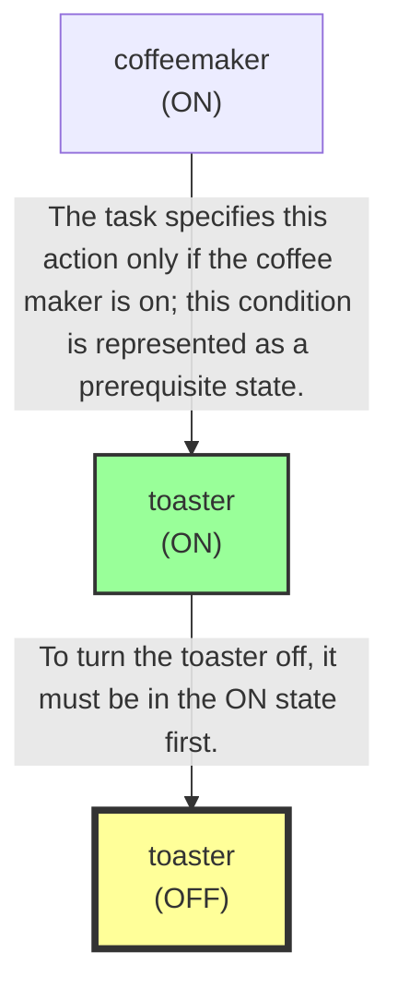
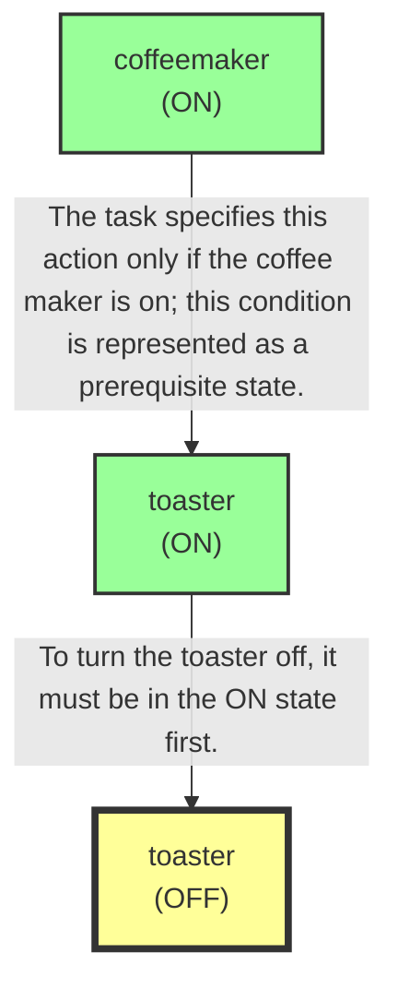

# 🚀 VirtualHome Agent Episode Log


### [GoalReasoner (Module A - Intent)] Output
```json
{
  "is_instruction_obviously_vague": true,
  "clarification_question": "Which appliance should be adjusted: the toaster or the coffee maker?",
  "target_object": null,
  "location_hint": null,
  "reasoning_chain": [
    {
      "question": "Why does the user want this object?",
      "answer": "The instruction does not identify a single object; it refers to one of two appliances."
    },
    {
      "question": "Why is that important?",
      "answer": "A robot needs a specific physical target to act on deterministically."
    },
    {
      "question": "What fundamental need does this fulfill?",
      "answer": "To change the state of the intended appliance to the desired setting."
    },
    {
      "question": "Are there any deeper psychological or physical motivations?",
      "answer": "Likely to prepare the appliance for use in a preferred operating state."
    }
  ],
  "deep_intent": "The user wants an appliance adjusted to a requested operating state.",
  "acceptable_alternatives_properties": [
    {
      "priority": 1,
      "description": "Other countertop kitchen appliances that can be set to a specific operating state, such as a microwave or kettle"
    },
    {
      "priority": 2,
      "description": "Similar household appliances with adjustable settings, such as a blender or air fryer"
    },
    {
      "priority": 3,
      "description": "Any appliance or device with controllable on/off or setting states"
    },
    {
      "priority": 4,
      "description": "A different household device that can be adjusted to match the requested functional state"
    }
  ]
}
```

### [RoboStateMultiTaskController] Output
```json
{
  "action": "[ask] Which appliance should be adjusted: the toaster or the coffee maker?",
  "active_task_id": "task_1",
  "task_context": {
    "active_task_id": "task_1",
    "pending_task_ids": [],
    "satisfied_task_ids": []
  },
  "source": "goal_reasoner_clarification"
}
```
## Step 0
- **Action**: `[ask] Which appliance should be adjusted: the toaster or the coffee maker?`
- **Action Success**: `True`
- **Action Message**: The toaster.
- **Active Task**: `task_1`
- **Decision Source**: `goal_reasoner_clarification`
- **Task Progress**: T5_G2_13_B3=pending
- **SDG Status**:
No SDG active.
- **Observed Items (96)**: floor(112), floor(113), floor(114), floor(115), floor(116), floor(117), wall(118), wall(119), wall(120), wall(121), wall(122), wall(123), ceiling(124), ceiling(125), ceiling(126)...


### [GoalReasoner (Module A - Intent)] Output
```json
{
  "is_instruction_obviously_vague": true,
  "clarification_question": "What is the requested state for the toaster?",
  "target_object": "toaster",
  "location_hint": null,
  "reasoning_chain": [
    {
      "question": "Why does the user want this object?",
      "answer": "To change the toaster from its current state to a specific desired state."
    },
    {
      "question": "Why is that important?",
      "answer": "So the toaster matches the user's intended setup or operation."
    },
    {
      "question": "What fundamental need does this fulfill?",
      "answer": "It fulfills the need to control or configure a household appliance to a desired condition."
    },
    {
      "question": "Are there any deeper psychological or physical motivations?",
      "answer": "The motivation is likely to achieve a specific appliance state for use, convenience, or coordination with another device."
    }
  ],
  "deep_intent": "The user wants to configure a household appliance to a desired state.",
  "acceptable_alternatives_properties": [
    {
      "priority": 1,
      "description": "Other controllable household appliances that can be set to a specific operating state, such as an oven, microwave, or lamp."
    },
    {
      "priority": 2,
      "description": "Similar kitchen appliances with adjustable settings or modes, such as a blender, rice cooker, or kettle."
    },
    {
      "priority": 3,
      "description": "Other indoor devices that can be switched or adjusted into a desired on/off or mode state."
    },
    {
      "priority": 4,
      "description": "Any household device that serves the same practical need of being set up correctly for use."
    }
  ]
}
```

### [RoboStateMultiTaskController] Output
```json
{
  "action": "[ask] What is the requested state for the toaster?",
  "active_task_id": "task_1",
  "task_context": {
    "active_task_id": "task_1",
    "pending_task_ids": [],
    "satisfied_task_ids": []
  },
  "source": "goal_reasoner_clarification"
}
```
## Step 1
- **Action**: `[ask] What is the requested state for the toaster?`
- **Action Success**: `True`
- **Action Message**: Turn it off.
- **Active Task**: `task_1`
- **Decision Source**: `goal_reasoner_clarification`
- **Task Progress**: T5_G2_13_B3=pending
- **SDG Status**:
No SDG active.
- **Observed Items (96)**: floor(112), floor(113), floor(114), floor(115), floor(116), floor(117), wall(118), wall(119), wall(120), wall(121), wall(122), wall(123), ceiling(124), ceiling(125), ceiling(126)...


### [GoalReasoner (Module A - Intent)] Output
```json
{
  "is_instruction_obviously_vague": false,
  "clarification_question": null,
  "target_object": "toaster",
  "location_hint": null,
  "reasoning_chain": [
    {
      "question": "Why does the user want this object?",
      "answer": "To change the toaster's state from on to off."
    },
    {
      "question": "Why is that important?",
      "answer": "To ensure the toaster is not left running when the specified condition is met."
    },
    {
      "question": "What fundamental need does this fulfill?",
      "answer": "The user wants to control appliance power state to maintain safety or conserve energy."
    },
    {
      "question": "Are there any deeper psychological or physical motivations?",
      "answer": "The likely motivations are preventing unnecessary operation, reducing risk, and maintaining control over household devices."
    }
  ],
  "deep_intent": "The user wants to control the power state of a household appliance to prevent unnecessary operation.",
  "acceptable_alternatives_properties": [
    {
      "priority": 1,
      "description": "Other household appliances that can be safely switched off, such as a lamp, fan, or microwave."
    },
    {
      "priority": 2,
      "description": "Other electrical devices with simple on/off controls that are currently running."
    },
    {
      "priority": 3,
      "description": "Any nearby powered household device that can be turned off to reduce active operation."
    },
    {
      "priority": 4,
      "description": "A different way to stop energy use or active operation, such as unplugging a device if appropriate and safe."
    }
  ]
}
```

### [PerceptionFilter] Output
```json
{
  "reasoning": "The goal is to turn off the toaster, and the SDG also includes a prerequisite involving the coffeemaker being on. So the minimum needed classes are the target appliance toaster and the coffeemaker condition object. No locations or extra tools are required beyond these.",
  "selected_classes": [
    "character",
    "coffeemaker",
    "toaster",
    "microwave"
  ],
  "raw_class_count": 56
}
```

### [LLMExecutor] Output
```json
{
  "reasoning": "The toaster is already in the required target prerequisite state N2 (ON), so the next step to satisfy the final goal N1 is to turn it OFF. The toaster is present in the current kitchen graph and has a switch, so a switch-off action is appropriate. Since the current graph does not explicitly show my proximity to the toaster, I should first move to it before interacting, but the instruction asks for the single next atomic action and prohibits repeating a walk if just done; no prior walk to the toaster exists, so I will begin with walking to the toaster.",
  "satisfied_nodes": [
    "N2"
  ],
  "current_node_focus": "N1",
  "mapped_variables": {
    "?Appliance": "toaster(158)"
  },
  "action": "[walk] <toaster> (158)"
}
```

### [RoboStateMultiTaskController] Output
```json
{
  "action": "[walk] <toaster> (158)",
  "active_task_id": "task_1",
  "task_context": {
    "active_task_id": "task_1",
    "pending_task_ids": [],
    "satisfied_task_ids": []
  },
  "source": "llm_executor"
}
```
## Step 2
- **Action**: `[walk] <toaster> (158)`
- **Action Success**: `True`
- **Action Message**: {'0': {'message': 'Success'}}
- **Active Task**: `task_1`
- **Decision Source**: `llm_executor`
- **Task Progress**: T5_G2_13_B3=pending
- **SDG Status**:

- **Observed Items (8)**: toaster(158) [ON], coffeemaker(161) [ON,CLOSED], microwave(162) [CLOSED,OFF], character(1), livingroom(11), kitchen(111), bedroom(214), bathroom(276)


### [PerceptionFilter] Output
```json
{
  "reasoning": "Reused cached class selection.",
  "selected_classes": [
    "character",
    "coffeemaker",
    "toaster",
    "microwave"
  ],
  "raw_class_count": 56
}
```

### [LLMExecutor] Output
```json
{
  "reasoning": "The toaster is already in the required ON state and I am currently close to it, so the next step toward satisfying the final goal node N1 (toaster OFF) is to switch it off. The coffee maker being ON is a prerequisite in the SDG chain, and it is also currently ON, so no extra setup is needed.",
  "satisfied_nodes": [
    "N2",
    "N3"
  ],
  "current_node_focus": "N1",
  "mapped_variables": {},
  "action": "[switchoff] <toaster> (158)"
}
```

### [RoboStateMultiTaskController] Output
```json
{
  "action": "[switchoff] <toaster> (158)",
  "active_task_id": "task_1",
  "task_context": {
    "active_task_id": "task_1",
    "pending_task_ids": [],
    "satisfied_task_ids": []
  },
  "source": "llm_executor"
}
```
## Step 3
- **Action**: `[switchoff] <toaster> (158)`
- **Action Success**: `True`
- **Action Message**: Faked switch operation in Python layer (bypassed Unity failure)
- **Active Task**: `task_1`
- **Decision Source**: `llm_executor`
- **Task Progress**: T5_G2_13_B3=done
- **SDG Status**:

- **Observed Items (8)**: toaster(158) [ON], coffeemaker(161) [ON,CLOSED], microwave(162) [CLOSED,OFF], character(1), livingroom(11), kitchen(111), bedroom(214), bathroom(276)

