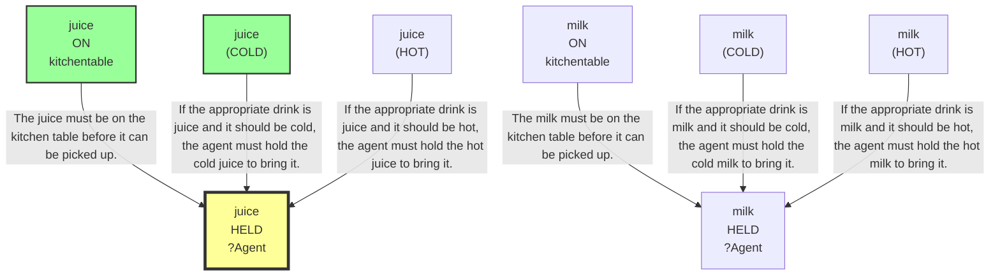

# 🚀 VirtualHome Agent Episode Log


### [GoalReasoner (Module A - Intent)] Output
```json
{
  "is_instruction_obviously_vague": true,
  "clarification_question": "Which drink on the kitchen table should I bring you?",
  "target_object": null,
  "location_hint": "kitchen table",
  "reasoning_chain": [
    {
      "question": "Why does the user want this object?",
      "answer": "To get a drink they can consume."
    },
    {
      "question": "Why is that important?",
      "answer": "To satisfy thirst or enjoy a beverage."
    },
    {
      "question": "What fundamental need does this fulfill?",
      "answer": "Relieving thirst and providing hydration."
    },
    {
      "question": "Are there any deeper psychological or physical motivations?",
      "answer": "The user likely wants a suitable beverage at the preferred temperature for immediate consumption."
    }
  ],
  "deep_intent": "The user wants to relieve thirst with a suitable beverage at an acceptable temperature.",
  "acceptable_alternatives_properties": [
    {
      "priority": 1,
      "description": "A similar ready-to-drink beverage of the same general type that is at the requested temperature"
    },
    {
      "priority": 2,
      "description": "Another drinkable beverage available indoors that matches the intended hot or cold state"
    },
    {
      "priority": 3,
      "description": "Any safe, consumable beverage that can satisfy thirst if the specific drink is unavailable"
    },
    {
      "priority": 4,
      "description": "A different beverage form factor that still provides hydration, such as water, juice, tea, or milk at the appropriate temperature"
    }
  ]
}
```

### [PerceptionFilter] Output
```json
{
  "reasoning": "The goal is to bring one drink from the kitchen table, and the SDG indicates the possible target drinks are juice or milk, with cold/hot variants implied. I must keep the exact target drink classes and the kitchen table location, plus all viable alternative drink options and any heating/cooling-related appliances needed to satisfy temperature requirements.",
  "selected_classes": [
    "juice",
    "fridge",
    "door",
    "character",
    "stove",
    "microwave",
    "milk",
    "kitchentable",
    "waterglass"
  ],
  "raw_class_count": 50
}
```

### [LLMExecutor] Output
```json
{
  "reasoning": "The instruction is ambiguous, but clarification is forbidden. I must autonomously choose a plausible drink from the kitchen table. The SDG permits either juice or milk; the filtered graph shows a cold juice (173) on the kitchen table and close to the character, which is the best match for a ready-to-bring beverage. To satisfy the first prerequisite toward holding it, I should grab it now since it is already nearby.",
  "satisfied_nodes": [
    "N1",
    "N3"
  ],
  "current_node_focus": "N7",
  "mapped_variables": {},
  "action": "[grab] <juice> (173)"
}
```

### [RoboStateMultiTaskController] Output
```json
{
  "action": "[grab] <juice> (173)",
  "active_task_id": "task_1",
  "task_context": {
    "active_task_id": "task_1",
    "pending_task_ids": [],
    "satisfied_task_ids": []
  },
  "source": "llm_executor"
}
```
## Step 0
- **Action**: `[grab] <juice> (173)`
- **Action Success**: `True`
- **Action Message**: {'0': {'message': 'Success'}}
- **Active Task**: `task_1`
- **Decision Source**: `llm_executor`
- **Task Progress**: T5_G2_14_B0=done
- **SDG Status**:

- **Observed Items (24)**: door(47) [OPEN], waterglass(64), waterglass(71), waterglass(72), waterglass(79), waterglass(80), waterglass(87), waterglass(88), waterglass(100), kitchentable(131), kitchentable(135), fridge(162) [CLOSED], stove(163) [OFF,CLOSED], microwave(171) [CLOSED,OFF], juice(173) [COLD]...

