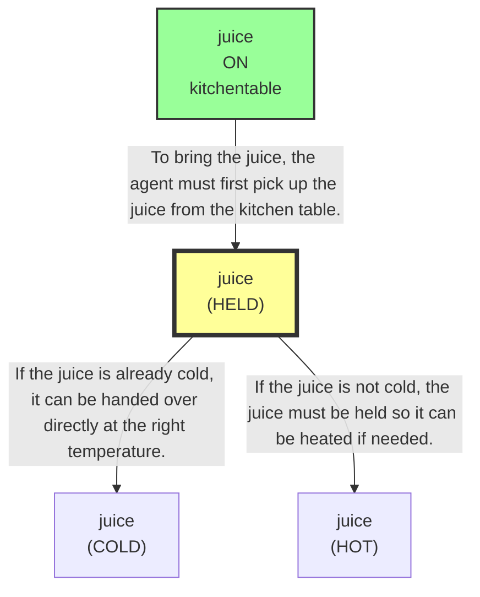

# 🚀 VirtualHome Agent Episode Log


### [GoalReasoner (Module A - Intent)] Output
```json
{
  "is_instruction_obviously_vague": true,
  "clarification_question": "Which drink should I bring?",
  "target_object": "drink",
  "location_hint": "kitchen table",
  "reasoning_chain": [
    {
      "question": "Why does the user want this object?",
      "answer": "To have a drink available to them."
    },
    {
      "question": "Why is that important?",
      "answer": "To satisfy thirst or improve comfort."
    },
    {
      "question": "What fundamental need does this fulfill?",
      "answer": "It helps relieve thirst and provides hydration."
    },
    {
      "question": "Are there any deeper psychological or physical motivations?",
      "answer": "The user may want convenience and immediate access to a suitable beverage at a preferred temperature."
    }
  ],
  "deep_intent": "The user wants to relieve thirst and gain hydration with a suitable beverage at the preferred temperature.",
  "acceptable_alternatives_properties": [
    {
      "priority": 1,
      "description": "Other beverages on the kitchen table that are similar in type and can be served at the requested temperature."
    },
    {
      "priority": 2,
      "description": "Other ready-to-drink household beverages that match the intended hot or cold temperature."
    },
    {
      "priority": 3,
      "description": "Any common drinkable liquid in the home that can satisfy hydration needs."
    },
    {
      "priority": 4,
      "description": "A glass or cup of water at the preferred temperature if the exact beverage is unavailable."
    }
  ]
}
```

### [RoboStateMultiTaskController] Output
```json
{
  "action": "[ask] Which drink should I bring?",
  "active_task_id": "task_1",
  "task_context": {
    "active_task_id": "task_1",
    "pending_task_ids": [],
    "satisfied_task_ids": []
  },
  "source": "goal_reasoner_clarification"
}
```
## Step 0
- **Action**: `[ask] Which drink should I bring?`
- **Action Success**: `True`
- **Action Message**: The juice.
- **Active Task**: `task_1`
- **Decision Source**: `goal_reasoner_clarification`
- **Task Progress**: T5_G2_14_B1=pending
- **SDG Status**:
No SDG active.
- **Observed Items (159)**: wall(12), wall(13), wall(14), wall(15), wall(16), wall(17), wall(18), wall(19), wall(20), wall(21), floor(22), floor(23), floor(24), floor(25), floor(26)...


### [GoalReasoner (Module A - Intent)] Output
```json
{
  "is_instruction_obviously_vague": true,
  "clarification_question": "What temperature should the juice be brought to?",
  "target_object": "juice",
  "location_hint": "kitchen table",
  "reasoning_chain": [
    {
      "question": "Why does the user want this object?",
      "answer": "To have juice available for drinking."
    },
    {
      "question": "Why is that important?",
      "answer": "To satisfy a desire to drink it in a preferred condition."
    },
    {
      "question": "What fundamental need does this fulfill?",
      "answer": "It fulfills the need to hydrate or enjoy a beverage."
    },
    {
      "question": "Are there any deeper psychological or physical motivations?",
      "answer": "The user may want comfort, refreshment, or convenience in having a drink at the desired temperature."
    }
  ],
  "deep_intent": "The user wants to obtain a beverage in a desired temperature state for drinking.",
  "acceptable_alternatives_properties": [
    {
      "priority": 1,
      "description": "Other ready-to-drink beverages that can be served at the desired temperature, such as water, milk, or tea"
    },
    {
      "priority": 2,
      "description": "Other fruit-based drinks or chilled/warmed beverages with a similar refreshment function"
    },
    {
      "priority": 3,
      "description": "Any drinkable liquid suitable for hydration or refreshment"
    },
    {
      "priority": 4,
      "description": "A different beverage that satisfies the same need for refreshment, even if it is not juice"
    }
  ]
}
```

### [PerceptionFilter] Output
```json
{
  "reasoning": "The goal is to get juice from the kitchen table and bring it to the desired temperature. Minimum required objects are the target beverage and the location it is on, plus all plausible temperature-control alternatives from the environment: fridge/microwave for cooling or warming, and stove/sink as additional heating/cooling-related appliances if needed. A waterglass is also retained as an alternative drink vessel in case a different ready-to-drink beverage is used to satisfy the same refreshment need.",
  "selected_classes": [
    "milk",
    "waterglass",
    "kitchentable",
    "microwave",
    "juice",
    "character",
    "stove",
    "sink",
    "fridge"
  ],
  "raw_class_count": 50
}
```

### [LLMExecutor] Output
```json
{
  "reasoning": "The task is ambiguous about temperature, but asking is forbidden now. The SDG shows the juice must be on the kitchen table, and the currently closest matching beverage is juice(173), which is already COLD and close to the character on kitchentable(135). The next required progress is to satisfy the HOLD state by picking up this cold juice. Since I can interact with nearby objects directly only after walking, and the juice is already marked CLOSE, the best immediate action is to grab the cold juice to move toward the held-state branch.",
  "satisfied_nodes": [
    "N1"
  ],
  "current_node_focus": "N2",
  "mapped_variables": {},
  "action": "[grab] <juice> (173)"
}
```

### [RoboStateMultiTaskController] Output
```json
{
  "action": "[grab] <juice> (173)",
  "active_task_id": "task_1",
  "task_context": {
    "active_task_id": "task_1",
    "pending_task_ids": [],
    "satisfied_task_ids": []
  },
  "source": "llm_executor"
}
```
## Step 1
- **Action**: `[grab] <juice> (173)`
- **Action Success**: `True`
- **Action Message**: {'0': {'message': 'Success'}}
- **Active Task**: `task_1`
- **Decision Source**: `llm_executor`
- **Task Progress**: T5_G2_14_B1=done
- **SDG Status**:

- **Observed Items (24)**: waterglass(64), waterglass(71), waterglass(72), waterglass(79), waterglass(80), waterglass(87), waterglass(88), waterglass(100), kitchentable(131), kitchentable(135), sink(155), fridge(162) [CLOSED], stove(163) [OFF,CLOSED], microwave(171) [CLOSED,OFF], juice(173) [COLD]...

