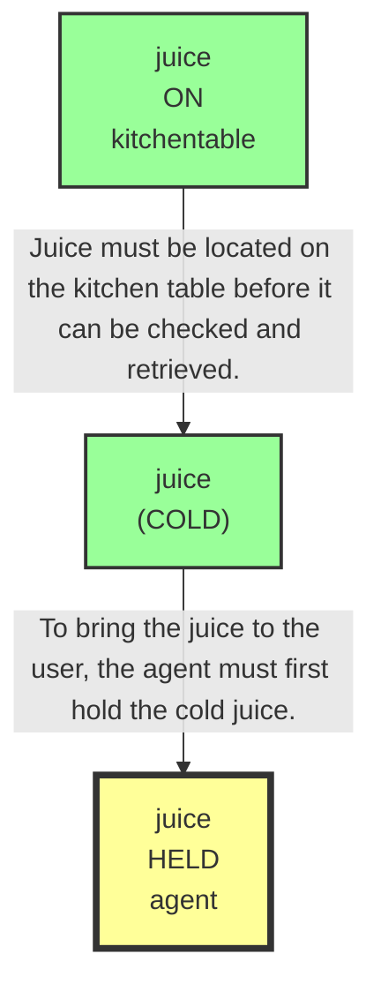

# 🚀 VirtualHome Agent Episode Log


### [GoalReasoner (Module A - Intent)] Output
```json
{
  "is_instruction_obviously_vague": true,
  "clarification_question": "Which drink should I bring?",
  "target_object": "drink",
  "location_hint": "kitchen table",
  "reasoning_chain": [
    {
      "question": "Why does the user want this object?",
      "answer": "To have a drink available to them."
    },
    {
      "question": "Why is that important?",
      "answer": "It helps satisfy a need for hydration or refreshment."
    },
    {
      "question": "What fundamental need does this fulfill?",
      "answer": "Relieve thirst or provide refreshment."
    },
    {
      "question": "Are there any deeper psychological or physical motivations?",
      "answer": "The user likely wants a beverage that matches their desired drink choice and temperature."
    }
  ],
  "deep_intent": "Relieve thirst or provide refreshment",
  "acceptable_alternatives_properties": [
    {
      "priority": 1,
      "description": "Other beverages on the kitchen table that match the intended drink type and temperature as closely as possible"
    },
    {
      "priority": 2,
      "description": "Similar ready-to-drink beverages such as water, juice, tea, coffee, or soda, depending on what is available"
    },
    {
      "priority": 3,
      "description": "Any typical indoor beverage that can provide hydration or refreshment"
    },
    {
      "priority": 4,
      "description": "A different hydrating drink of the appropriate temperature, such as a cool water or warm tea, if the specific drink is unavailable"
    }
  ]
}
```

### [RoboStateMultiTaskController] Output
```json
{
  "action": "[ask] Which drink should I bring?",
  "active_task_id": "task_1",
  "task_context": {
    "active_task_id": "task_1",
    "pending_task_ids": [],
    "satisfied_task_ids": []
  },
  "source": "goal_reasoner_clarification"
}
```
## Step 0
- **Action**: `[ask] Which drink should I bring?`
- **Action Success**: `True`
- **Action Message**: The juice.
- **Active Task**: `task_1`
- **Decision Source**: `goal_reasoner_clarification`
- **Task Progress**: T5_G2_14_B2=pending
- **SDG Status**:
No SDG active.
- **Observed Items (159)**: wall(12), wall(13), wall(14), wall(15), wall(16), wall(17), wall(18), wall(19), wall(20), wall(21), floor(22), floor(23), floor(24), floor(25), floor(26)...


### [GoalReasoner (Module A - Intent)] Output
```json
{
  "is_instruction_obviously_vague": true,
  "clarification_question": "What temperature should the juice be?",
  "target_object": "juice",
  "location_hint": "kitchen table",
  "reasoning_chain": [
    {
      "question": "Why does the user want this object?",
      "answer": "To have the juice available to them."
    },
    {
      "question": "Why is that important?",
      "answer": "Because they want to drink it."
    },
    {
      "question": "What fundamental need does this fulfill?",
      "answer": "It helps relieve thirst and provide hydration."
    },
    {
      "question": "Are there any deeper psychological or physical motivations?",
      "answer": "The primary motivation appears to be satisfying a physical need for a drink in the preferred condition."
    }
  ],
  "deep_intent": "The user wants to relieve thirst with a drink at a specific temperature.",
  "acceptable_alternatives_properties": [
    {
      "priority": 1,
      "description": "Other drinkable beverages of the same general type that can be served at the specified temperature"
    },
    {
      "priority": 2,
      "description": "Similar ready-to-drink cold or warm beverages, such as water, tea, or another juice"
    },
    {
      "priority": 3,
      "description": "Other hydrating beverages that can satisfy thirst at the requested temperature"
    },
    {
      "priority": 4,
      "description": "Any beverage available indoors that can provide hydration, if the exact drink is unavailable"
    }
  ]
}
```

### [RoboStateMultiTaskController] Output
```json
{
  "action": "[ask] What temperature should the juice be?",
  "active_task_id": "task_1",
  "task_context": {
    "active_task_id": "task_1",
    "pending_task_ids": [],
    "satisfied_task_ids": []
  },
  "source": "goal_reasoner_clarification"
}
```
## Step 1
- **Action**: `[ask] What temperature should the juice be?`
- **Action Success**: `True`
- **Action Message**: Cold.
- **Active Task**: `task_1`
- **Decision Source**: `goal_reasoner_clarification`
- **Task Progress**: T5_G2_14_B2=pending
- **SDG Status**:
No SDG active.
- **Observed Items (159)**: wall(12), wall(13), wall(14), wall(15), wall(16), wall(17), wall(18), wall(19), wall(20), wall(21), floor(22), floor(23), floor(24), floor(25), floor(26)...


### [GoalReasoner (Module A - Intent)] Output
```json
{
  "is_instruction_obviously_vague": false,
  "clarification_question": null,
  "target_object": "juice",
  "location_hint": "kitchen table",
  "reasoning_chain": [
    {
      "question": "Why does the user want this object?",
      "answer": "To drink it."
    },
    {
      "question": "Why is that important?",
      "answer": "To quench thirst or enjoy a refreshing beverage."
    },
    {
      "question": "What fundamental need does this fulfill?",
      "answer": "Relieving thirst."
    },
    {
      "question": "Are there any deeper psychological or physical motivations?",
      "answer": "It may also be for comfort, refreshment, or hydration."
    }
  ],
  "deep_intent": "The user wants to relieve thirst and obtain a refreshing drink at a suitable cold temperature.",
  "acceptable_alternatives_properties": [
    {
      "priority": 1,
      "description": "Other cold ready-to-drink beverages, such as chilled water, milk, or iced tea"
    },
    {
      "priority": 2,
      "description": "Other chilled fruit-based drinks or beverage items with a similar refreshing function"
    },
    {
      "priority": 3,
      "description": "Any safe, drinkable cold beverage available indoors that can hydrate and refresh"
    },
    {
      "priority": 4,
      "description": "Water or another non-alcoholic drink that can satisfy thirst even if it is not fruit juice"
    }
  ]
}
```

### [PerceptionFilter] Output
```json
{
  "reasoning": "The goal is to retrieve juice from the kitchen table and have it held by the agent, with the juice needing to be cold. So the necessary classes are the target beverage itself, its required location, and the cold-storage/retrieval alternatives that could provide or preserve a cold drink. I also include the acceptable alternative drinks that can satisfy thirst if juice is unavailable, plus a basic drink container as a functional backup for holding a beverage.",
  "selected_classes": [
    "milk",
    "waterglass",
    "kitchentable",
    "juice",
    "character",
    "door",
    "fridge"
  ],
  "raw_class_count": 50
}
```

### [LLMExecutor] Output
```json
{
  "reasoning": "The goal is to obtain the cold juice and ultimately hold it. The current graph shows a cold juice object, juice(173), already on the kitchen table and close to the agent, matching N1 and N2. Since it is close and grabbable, the next step is to pick it up to satisfy the HOLD state. No other prerequisite is needed before grabbing.",
  "satisfied_nodes": [
    "N1",
    "N2"
  ],
  "current_node_focus": "N3",
  "mapped_variables": {},
  "action": "[grab] <juice> (173)"
}
```

### [RoboStateMultiTaskController] Output
```json
{
  "action": "[grab] <juice> (173)",
  "active_task_id": "task_1",
  "task_context": {
    "active_task_id": "task_1",
    "pending_task_ids": [],
    "satisfied_task_ids": []
  },
  "source": "llm_executor"
}
```
## Step 2
- **Action**: `[grab] <juice> (173)`
- **Action Success**: `True`
- **Action Message**: {'0': {'message': 'Success'}}
- **Active Task**: `task_1`
- **Decision Source**: `llm_executor`
- **Task Progress**: T5_G2_14_B2=done
- **SDG Status**:

- **Observed Items (22)**: door(47) [OPEN], waterglass(64), waterglass(71), waterglass(72), waterglass(79), waterglass(80), waterglass(87), waterglass(88), waterglass(100), kitchentable(131), kitchentable(135), fridge(162) [CLOSED], juice(173) [COLD], juice(174), milk(177) [CLOSED]...

