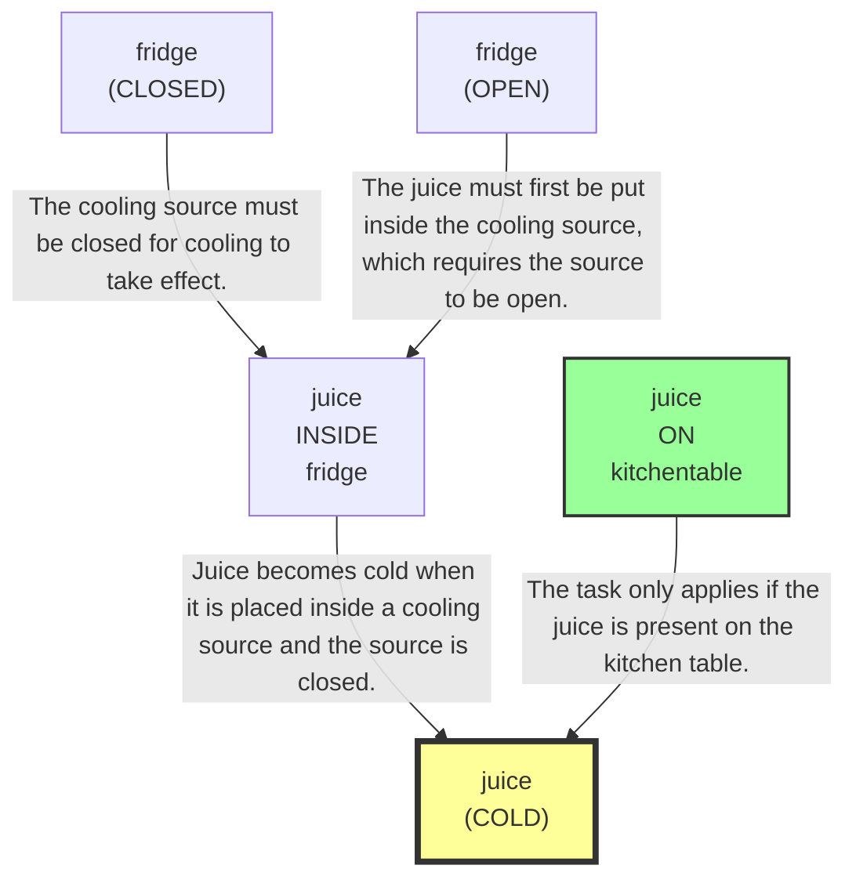
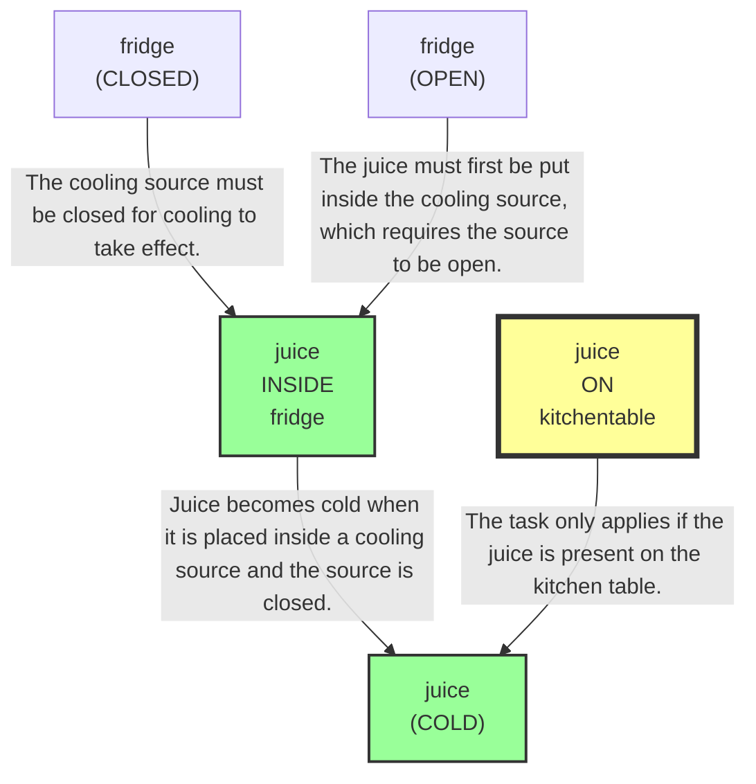
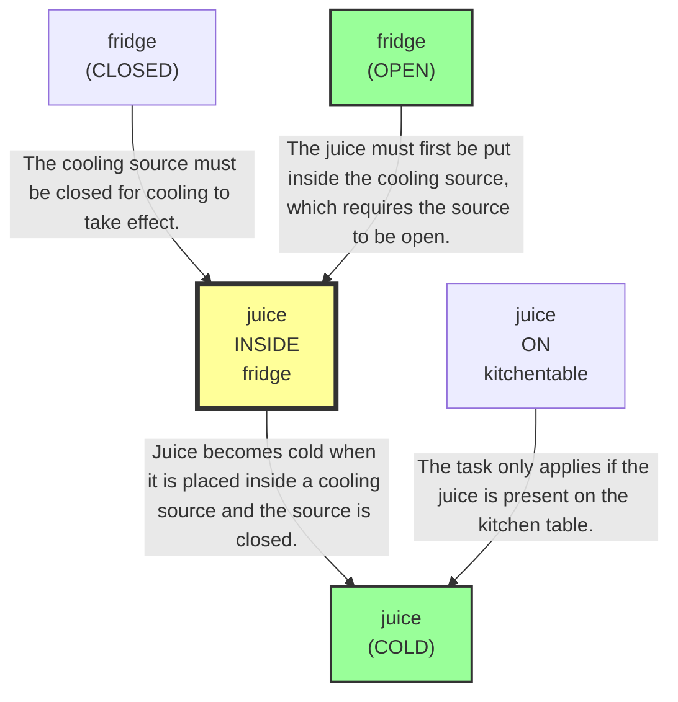

# 🚀 VirtualHome Agent Episode Log


### [GoalReasoner (Module A - Intent)] Output
```json
{
  "is_instruction_obviously_vague": true,
  "clarification_question": "Which drink on the kitchen table should I bring?",
  "target_object": "drink",
  "location_hint": "kitchen table",
  "reasoning_chain": [
    {
      "question": "Why does the user want this object?",
      "answer": "To have a drink brought to them."
    },
    {
      "question": "Why is that important?",
      "answer": "To satisfy a beverage need or preference."
    },
    {
      "question": "What fundamental need does this fulfill?",
      "answer": "Hydration or refreshment."
    },
    {
      "question": "Are there any deeper psychological or physical motivations?",
      "answer": "The user likely wants the most suitable available beverage in the preferred state, but the exact selection and temperature are unspecified."
    }
  ],
  "deep_intent": "The user wants to satisfy thirst or obtain refreshment.",
  "acceptable_alternatives_properties": [
    {
      "priority": 1,
      "description": "Another suitable beverage with a similar purpose, such as water, juice, or tea, if the specific drink is unavailable"
    },
    {
      "priority": 2,
      "description": "A different ready-to-drink beverage that matches the user's likely preference and can provide hydration"
    },
    {
      "priority": 3,
      "description": "Any drinkable liquid that serves a refreshment or hydration purpose"
    },
    {
      "priority": 4,
      "description": "A hydrating food or beverage substitute, such as soup or a fruit with high water content, if no suitable drink is available"
    }
  ]
}
```

### [RoboStateMultiTaskController] Output
```json
{
  "action": "[ask] Which drink on the kitchen table should I bring?",
  "active_task_id": "task_1",
  "task_context": {
    "active_task_id": "task_1",
    "pending_task_ids": [],
    "satisfied_task_ids": []
  },
  "source": "goal_reasoner_clarification"
}
```
## Step 0
- **Action**: `[ask] Which drink on the kitchen table should I bring?`
- **Action Success**: `True`
- **Action Message**: The juice.
- **Active Task**: `task_1`
- **Decision Source**: `goal_reasoner_clarification`
- **Task Progress**: T5_G2_14_B3=pending
- **SDG Status**:
No SDG active.
- **Observed Items (159)**: wall(12), wall(13), wall(14), wall(15), wall(16), wall(17), wall(18), wall(19), wall(20), wall(21), floor(22), floor(23), floor(24), floor(25), floor(26)...


### [GoalReasoner (Module A - Intent)] Output
```json
{
  "is_instruction_obviously_vague": true,
  "clarification_question": "What temperature should the juice be?",
  "target_object": "juice",
  "location_hint": "kitchen table",
  "reasoning_chain": [
    {
      "question": "Why does the user want this object?",
      "answer": "To drink the juice."
    },
    {
      "question": "Why is that important?",
      "answer": "To satisfy a beverage need, likely hydration or refreshment."
    },
    {
      "question": "What fundamental need does this fulfill?",
      "answer": "Relieving thirst and providing refreshment."
    },
    {
      "question": "Are there any deeper psychological or physical motivations?",
      "answer": "The user may want comfort, enjoyment, or hydration, but the concrete physical requirement is a drink at a specific temperature."
    }
  ],
  "deep_intent": "The user wants to relieve thirst with a drink at a specified temperature.",
  "acceptable_alternatives_properties": [
    {
      "priority": 1,
      "description": "Other drinkable beverages of the same general type, such as another juice or a similar ready-to-drink beverage at the requested temperature"
    },
    {
      "priority": 2,
      "description": "Nearby beverage options that serve the same refreshment function, such as water, iced tea, or soda at the requested temperature"
    },
    {
      "priority": 3,
      "description": "Any chilled or warm drink that matches the user's intended temperature and can satisfy thirst"
    },
    {
      "priority": 4,
      "description": "Other household beverages, such as milk or flavored drinks, if they meet the same hydration and refreshment need"
    }
  ]
}
```

### [RoboStateMultiTaskController] Output
```json
{
  "action": "[ask] What temperature should the juice be?",
  "active_task_id": "task_1",
  "task_context": {
    "active_task_id": "task_1",
    "pending_task_ids": [],
    "satisfied_task_ids": []
  },
  "source": "goal_reasoner_clarification"
}
```
## Step 1
- **Action**: `[ask] What temperature should the juice be?`
- **Action Success**: `True`
- **Action Message**: Cold.
- **Active Task**: `task_1`
- **Decision Source**: `goal_reasoner_clarification`
- **Task Progress**: T5_G2_14_B3=pending
- **SDG Status**:
No SDG active.
- **Observed Items (159)**: wall(12), wall(13), wall(14), wall(15), wall(16), wall(17), wall(18), wall(19), wall(20), wall(21), floor(22), floor(23), floor(24), floor(25), floor(26)...


### [GoalReasoner (Module A - Intent)] Output
```json
{
  "is_instruction_obviously_vague": false,
  "clarification_question": null,
  "target_object": "juice",
  "location_hint": "kitchen table",
  "reasoning_chain": [
    {
      "question": "Why does the user want this object?",
      "answer": "To have juice available to them."
    },
    {
      "question": "Why is that important?",
      "answer": "They likely want to drink it."
    },
    {
      "question": "What fundamental need does this fulfill?",
      "answer": "It helps relieve thirst or provide refreshment."
    },
    {
      "question": "Are there any deeper psychological or physical motivations?",
      "answer": "The user may want a satisfying cold drink for comfort, hydration, or preference."
    }
  ],
  "deep_intent": "The user wants to relieve thirst with a cold beverage.",
  "acceptable_alternatives_properties": [
    {
      "priority": 1,
      "description": "Other cold ready-to-drink beverages, such as water, iced tea, or another chilled juice."
    },
    {
      "priority": 2,
      "description": "Other chilled fruit drinks or flavored drinks that serve the same refreshing function."
    },
    {
      "priority": 3,
      "description": "Any cold hydrating beverage available indoors, such as milk or sports drink if appropriate."
    },
    {
      "priority": 4,
      "description": "A cool, refreshing drink in another form that still satisfies thirst, such as chilled sparkling water."
    }
  ]
}
```

### [PerceptionFilter] Output
```json
{
  "reasoning": "The goal is to obtain cold juice on the kitchen table. The SDG explicitly requires the juice, the kitchen table, and the fridge, including the fridge being open/closed to chill the juice. To preserve alternatives for a cold ready-to-drink beverage, I also retain other viable drink items visible in the scene that could satisfy the thirst intent if needed: milk and waterglass (as a container/drink option).",
  "selected_classes": [
    "milk",
    "waterglass",
    "kitchentable",
    "juice",
    "character",
    "door",
    "fridge"
  ],
  "raw_class_count": 50
}
```

### [LLMExecutor] Output
```json
{
  "reasoning": "The target juice has already been identified as juice(173), and it is currently COLD and on the kitchen table, which satisfies the final goal state. No further action is needed to complete the active task.",
  "satisfied_nodes": [
    "N1",
    "N2"
  ],
  "current_node_focus": "N2",
  "mapped_variables": {},
  "action": "[wait]"
}
```

### [RoboStateMultiTaskController] Output
```json
{
  "action": "[wait]",
  "active_task_id": "task_1",
  "task_context": {
    "active_task_id": "task_1",
    "pending_task_ids": [],
    "satisfied_task_ids": []
  },
  "source": "llm_executor"
}
```
## Step 2
- **Action**: `[wait]`
- **Action Success**: `True`
- **Action Message**: Time passes. You waited for a while.
- **Active Task**: `task_1`
- **Decision Source**: `llm_executor`
- **Task Progress**: T5_G2_14_B3=pending
- **SDG Status**:

- **Observed Items (22)**: door(47) [OPEN], waterglass(64), waterglass(71), waterglass(72), waterglass(79), waterglass(80), waterglass(87), waterglass(88), waterglass(100), kitchentable(131), kitchentable(135), fridge(162) [CLOSED], juice(173) [COLD], juice(174), milk(177) [CLOSED]...


### [PerceptionFilter] Output
```json
{
  "reasoning": "Reused cached class selection.",
  "selected_classes": [
    "milk",
    "waterglass",
    "kitchentable",
    "juice",
    "character",
    "door",
    "fridge"
  ],
  "raw_class_count": 50
}
```

### [LLMExecutor] Output
```json
{
  "reasoning": "The goal requires the juice to end up cold and on the kitchen table. In the current graph, juice(173) is already COLD and is on kitchentable(135), which is close to the character and appears to satisfy the core target state. However, the SDG specifically requires juice on the kitchentable and cold, and we have not yet verified whether the intended final placement is the kitchen table instance that is already close. Since the juice is already accessible and the next logical step toward ensuring the correct final relation is to move it onto the nearby kitchen table if needed, I should first walk to the target table before any putback action. I am binding ?TargetTable to the nearby kitchentable(135) because it is explicitly close and already associated with the target juice.",
  "satisfied_nodes": [
    "N2",
    "N3"
  ],
  "current_node_focus": "N1",
  "mapped_variables": {
    "?TargetTable": "kitchentable(135)"
  },
  "action": "[walk] <kitchentable> (135)"
}
```

### [RoboStateMultiTaskController] Output
```json
{
  "action": "[walk] <kitchentable> (135)",
  "active_task_id": "task_1",
  "task_context": {
    "active_task_id": "task_1",
    "pending_task_ids": [],
    "satisfied_task_ids": []
  },
  "source": "llm_executor"
}
```
## Step 3
- **Action**: `[walk] <kitchentable> (135)`
- **Action Success**: `True`
- **Action Message**: {'0': {'message': 'Success'}}
- **Active Task**: `task_1`
- **Decision Source**: `llm_executor`
- **Task Progress**: T5_G2_14_B3=pending
- **SDG Status**:

- **Observed Items (22)**: door(47) [OPEN], waterglass(64), waterglass(71), waterglass(72), waterglass(79), waterglass(80), waterglass(87), waterglass(88), waterglass(100), kitchentable(131), kitchentable(135), fridge(162) [CLOSED], juice(173) [COLD], juice(174), milk(177) [CLOSED]...


### [PerceptionFilter] Output
```json
{
  "reasoning": "Reused cached class selection.",
  "selected_classes": [
    "milk",
    "waterglass",
    "kitchentable",
    "juice",
    "character",
    "door",
    "fridge"
  ],
  "raw_class_count": 50
}
```

### [LLMExecutor] Output
```json
{
  "reasoning": "The target juice is already identified in the current graph as juice(173), and it already satisfies the COLD state. The remaining SDG requirement is to place it ON the kitchen table; we are already close to juice(173), so the next step is to pick it up before moving it onto the table. Since no table-side placement can happen without holding the juice first, the immediate focus is to grab the cold juice.",
  "satisfied_nodes": [
    "N2",
    "N5"
  ],
  "current_node_focus": "N3",
  "mapped_variables": {},
  "action": "[grab] <juice> (173)"
}
```

### [RoboStateMultiTaskController] Output
```json
{
  "action": "[grab] <juice> (173)",
  "active_task_id": "task_1",
  "task_context": {
    "active_task_id": "task_1",
    "pending_task_ids": [],
    "satisfied_task_ids": []
  },
  "source": "llm_executor"
}
```
## Step 4
- **Action**: `[grab] <juice> (173)`
- **Action Success**: `True`
- **Action Message**: {'0': {'message': 'Success'}}
- **Active Task**: `task_1`
- **Decision Source**: `llm_executor`
- **Task Progress**: T5_G2_14_B3=done
- **SDG Status**:

- **Observed Items (22)**: door(47) [OPEN], waterglass(64), waterglass(71), waterglass(72), waterglass(79), waterglass(80), waterglass(87), waterglass(88), waterglass(100), kitchentable(131), kitchentable(135), fridge(162) [CLOSED], juice(173) [COLD], juice(174), milk(177) [CLOSED]...

