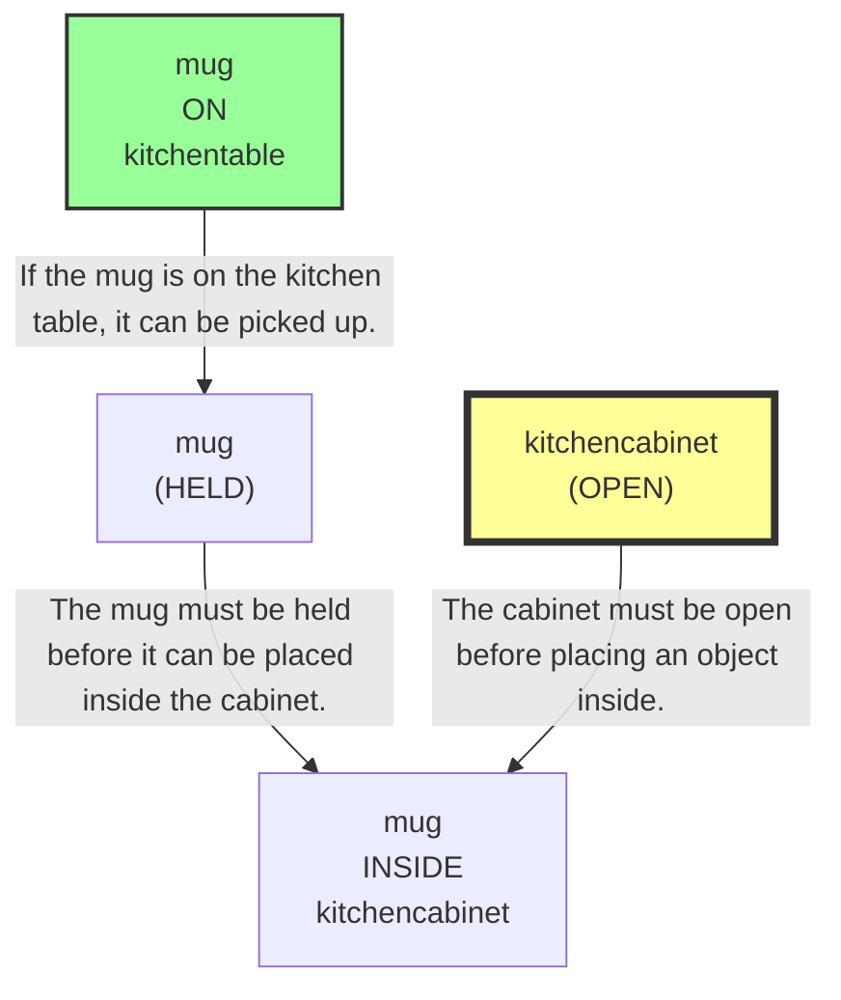
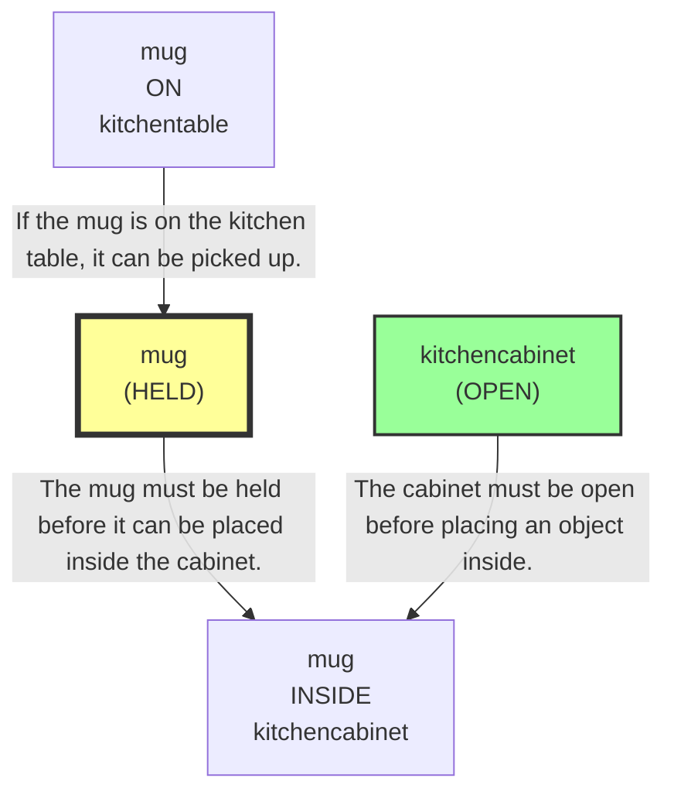
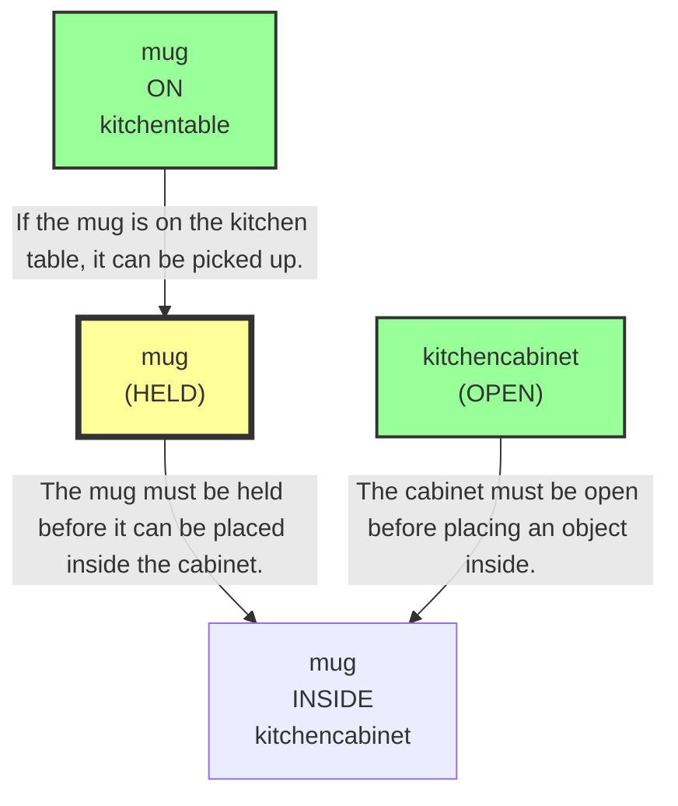
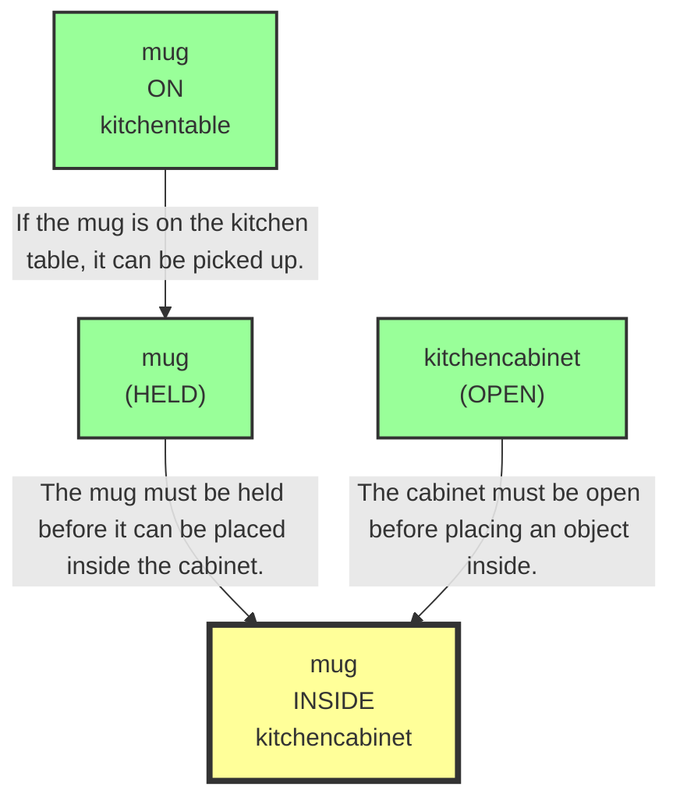

# 🚀 VirtualHome Agent Episode Log


### [GoalReasoner (Module A - Intent)] Output
```json
{
  "is_instruction_obviously_vague": true,
  "clarification_question": "Where should the drinkware be placed?",
  "target_object": "drinkware",
  "location_hint": "kitchen table",
  "reasoning_chain": [
    {
      "question": "Why does the user want this object?",
      "answer": "To relocate drinkware from the kitchen table."
    },
    {
      "question": "Why is that important?",
      "answer": "To put the item in its intended destination and clear the table."
    },
    {
      "question": "What fundamental need does this fulfill?",
      "answer": "It fulfills the need to organize household items and remove clutter from the table."
    },
    {
      "question": "Are there any deeper psychological or physical motivations?",
      "answer": "The user likely wants the space restored to its proper state, with the drinkware stored in a specific location."
    }
  ],
  "deep_intent": "The user wants to organize household items by removing clutter from the kitchen table.",
  "acceptable_alternatives_properties": [
    {
      "priority": 1,
      "description": "Other drinkware items, such as cups, mugs, or glasses, that can be moved to the same destination"
    },
    {
      "priority": 2,
      "description": "Other tabletop drink containers used for beverages, such as tumblers or travel mugs"
    },
    {
      "priority": 3,
      "description": "Similar kitchenware items that belong in the same storage area, if the exact drinkware is unavailable"
    },
    {
      "priority": 4,
      "description": "Other small household items cluttering the table that can be organized into their proper place"
    }
  ]
}
```

### [RoboStateMultiTaskController] Output
```json
{
  "action": "[ask] Where should the drinkware be placed?",
  "active_task_id": "task_1",
  "task_context": {
    "active_task_id": "task_1",
    "pending_task_ids": [],
    "satisfied_task_ids": []
  },
  "source": "goal_reasoner_clarification"
}
```
## Step 0
- **Action**: `[ask] Where should the drinkware be placed?`
- **Action Success**: `True`
- **Action Message**: Put the mug inside a kitchen cabinet.
- **Active Task**: `task_1`
- **Decision Source**: `goal_reasoner_clarification`
- **Task Progress**: T5_G2_11_B2=pending
- **SDG Status**:
No SDG active.
- **Observed Items (159)**: floor(12), floor(13), floor(14), floor(15), floor(16), floor(17), floor(18), floor(19), floor(20), ceiling(21), ceiling(22), ceiling(23), ceiling(24), ceiling(25), ceiling(26)...


### [GoalReasoner (Module A - Intent)] Output
```json
{
  "is_instruction_obviously_vague": false,
  "clarification_question": null,
  "target_object": "mug",
  "location_hint": "kitchen table",
  "reasoning_chain": [
    {
      "question": "Why does the user want this object?",
      "answer": "To have the mug stored in a kitchen cabinet instead of left on the kitchen table."
    },
    {
      "question": "Why is that important?",
      "answer": "To put the item away and reduce clutter on the table."
    },
    {
      "question": "What fundamental need does this fulfill?",
      "answer": "It fulfills the need to organize and tidy the kitchen space."
    },
    {
      "question": "Are there any deeper psychological or physical motivations?",
      "answer": "The user likely wants the environment to feel orderly and the object to be kept in a designated storage area."
    }
  ],
  "deep_intent": "The user wants to organize and tidy the kitchen space by storing a drink container away.",
  "acceptable_alternatives_properties": [
    {
      "priority": 1,
      "description": "Other drinkware items, such as a cup, glass, or tumbler, that can be stored in the kitchen cabinet."
    },
    {
      "priority": 2,
      "description": "Other kitchen items typically kept in a cabinet, such as small bowls or dishes, if the exact drinkware is unavailable."
    },
    {
      "priority": 3,
      "description": "Similar tabletop kitchen containers that can be put away for organization."
    },
    {
      "priority": 4,
      "description": "Other household items from the table that can be stored in a cabinet to reduce clutter."
    }
  ]
}
```

### [PerceptionFilter] Output
```json
{
  "reasoning": "The goal is to move the mug from the kitchen table into the kitchen cabinet. Per the SDG, the needed classes are the target object (mug), the source location (kitchentable), the destination and required receptacle (kitchencabinet), and any object needed to open/place into it. No extra tools are required beyond holding the mug, and no alternative storage containers are needed because the cabinet is explicitly specified.",
  "selected_classes": [
    "character",
    "kitchencabinet",
    "mug",
    "kitchentable"
  ],
  "raw_class_count": 66
}
```

### [LLMExecutor] Output
```json
{
  "reasoning": "The target mug is currently on the kitchen table and the cabinet is the needed destination, but the cabinet is closed. To progress toward placing the mug inside the cabinet, the immediate prerequisite is to open a suitable kitchen cabinet. I will use one of the visible closed kitchen cabinets; cabinet(73) is a valid container matching the SDG target.",
  "satisfied_nodes": [
    "N1"
  ],
  "current_node_focus": "N4",
  "mapped_variables": {
    "?Container": "kitchencabinet(73)"
  },
  "action": "[open] <kitchencabinet> (73)"
}
```

### [RoboStateMultiTaskController] Output
```json
{
  "action": "[walk] <kitchencabinet> (73)",
  "active_task_id": "task_1",
  "task_context": {
    "active_task_id": "task_1",
    "pending_task_ids": [],
    "satisfied_task_ids": []
  },
  "source": "llm_executor_repaired"
}
```
## Step 1
- **Action**: `[walk] <kitchencabinet> (73)`
- **Action Success**: `True`
- **Action Message**: {'0': {'message': 'Success'}}
- **Active Task**: `task_1`
- **Decision Source**: `llm_executor_repaired`
- **Task Progress**: T5_G2_11_B2=pending
- **SDG Status**:

- **Observed Items (17)**: kitchentable(72), kitchencabinet(73) [CLOSED], kitchencabinet(74) [CLOSED], kitchencabinet(75) [CLOSED], kitchencabinet(76) [CLOSED], kitchencabinet(77) [CLOSED], kitchencabinet(78) [CLOSED], kitchencabinet(79) [CLOSED], kitchencabinet(80) [CLOSED], mug(118), mug(119), mug(155), character(1), kitchen(11), bathroom(172)...


### [PerceptionFilter] Output
```json
{
  "reasoning": "Reused cached class selection.",
  "selected_classes": [
    "character",
    "kitchencabinet",
    "mug",
    "kitchentable"
  ],
  "raw_class_count": 66
}
```

### [LLMExecutor] Output
```json
{
  "reasoning": "The mug is already identified on the kitchen table and the cabinet is the storage destination. We are now close to the cabinet from the previous successful walk, but the cabinet is still closed. Since the mug must eventually be placed inside the cabinet, the next necessary step is to open the cabinet before grabbing or putting anything inside it. The best matching cabinet is kitchencabinet(73) because it is the one we are already close to.",
  "satisfied_nodes": [
    "N1"
  ],
  "current_node_focus": "N4",
  "mapped_variables": {
    "?Container": "kitchencabinet(73)"
  },
  "action": "[open] <kitchencabinet> (73)"
}
```

### [RoboStateMultiTaskController] Output
```json
{
  "action": "[open] <kitchencabinet> (73)",
  "active_task_id": "task_1",
  "task_context": {
    "active_task_id": "task_1",
    "pending_task_ids": [],
    "satisfied_task_ids": []
  },
  "source": "llm_executor"
}
```
## Step 2
- **Action**: `[open] <kitchencabinet> (73)`
- **Action Success**: `True`
- **Action Message**: {'0': {'message': 'Success'}}
- **Active Task**: `task_1`
- **Decision Source**: `llm_executor`
- **Task Progress**: T5_G2_11_B2=pending
- **SDG Status**:

- **Observed Items (17)**: kitchentable(72), kitchencabinet(73) [CLOSED], kitchencabinet(74) [CLOSED], kitchencabinet(75) [CLOSED], kitchencabinet(76) [CLOSED], kitchencabinet(77) [CLOSED], kitchencabinet(78) [CLOSED], kitchencabinet(79) [CLOSED], kitchencabinet(80) [CLOSED], mug(118), mug(119), mug(155), character(1), kitchen(11), bathroom(172)...


### [PerceptionFilter] Output
```json
{
  "reasoning": "Reused cached class selection.",
  "selected_classes": [
    "character",
    "kitchencabinet",
    "mug",
    "kitchentable"
  ],
  "raw_class_count": 66
}
```

### [LLMExecutor] Output
```json
{
  "reasoning": "The cabinet target for the goal is already open (kitchencabinet(73)), satisfying N4. The remaining gap is to place a mug currently on the kitchen table into this cabinet. Among the available mugs on the table, mug(118) is a valid graspable drinkware item and matches the task. Since the previous action already walked to the cabinet, the next atomic step should be to grab the mug from the table before putting it inside the open cabinet.",
  "satisfied_nodes": [
    "N4"
  ],
  "current_node_focus": "N2",
  "mapped_variables": {
    "?Container": "kitchencabinet(73)"
  },
  "action": "[grab] <mug> (118)"
}
```

### [RoboStateMultiTaskController] Output
```json
{
  "action": "[walk] <mug> (118)",
  "active_task_id": "task_1",
  "task_context": {
    "active_task_id": "task_1",
    "pending_task_ids": [],
    "satisfied_task_ids": []
  },
  "source": "llm_executor_repaired"
}
```
## Step 3
- **Action**: `[walk] <mug> (118)`
- **Action Success**: `True`
- **Action Message**: {'0': {'message': 'Success'}}
- **Active Task**: `task_1`
- **Decision Source**: `llm_executor_repaired`
- **Task Progress**: T5_G2_11_B2=pending
- **SDG Status**:

- **Observed Items (17)**: kitchentable(72), kitchencabinet(73) [OPEN], kitchencabinet(74) [CLOSED], kitchencabinet(75) [CLOSED], kitchencabinet(76) [CLOSED], kitchencabinet(77) [CLOSED], kitchencabinet(78) [CLOSED], kitchencabinet(79) [CLOSED], kitchencabinet(80) [CLOSED], mug(118), mug(119), mug(155), character(1), kitchen(11), bathroom(172)...


### [PerceptionFilter] Output
```json
{
  "reasoning": "Reused cached class selection.",
  "selected_classes": [
    "character",
    "kitchencabinet",
    "mug",
    "kitchentable"
  ],
  "raw_class_count": 66
}
```

### [LLMExecutor] Output
```json
{
  "reasoning": "The cabinet (73) is already open and the mug is confirmed on the kitchen table and close to the character. The next required SDG step is to hold the mug before placing it inside the cabinet. Since we are already near the table and the mug is reachable, the correct next atomic action is to grab one of the matching mugs; mug(118) is a valid binding for the target mug.",
  "satisfied_nodes": [
    "N1",
    "N4"
  ],
  "current_node_focus": "N2",
  "mapped_variables": {
    "?Container": "kitchencabinet(73)",
    "?Target": "mug(118)"
  },
  "action": "[grab] <mug> (118)"
}
```

### [RoboStateMultiTaskController] Output
```json
{
  "action": "[grab] <mug> (118)",
  "active_task_id": "task_1",
  "task_context": {
    "active_task_id": "task_1",
    "pending_task_ids": [],
    "satisfied_task_ids": []
  },
  "source": "llm_executor"
}
```
## Step 4
- **Action**: `[grab] <mug> (118)`
- **Action Success**: `True`
- **Action Message**: {'0': {'message': 'Success'}}
- **Active Task**: `task_1`
- **Decision Source**: `llm_executor`
- **Task Progress**: T5_G2_11_B2=pending
- **SDG Status**:

- **Observed Items (17)**: kitchentable(72), kitchencabinet(73) [OPEN], kitchencabinet(74) [CLOSED], kitchencabinet(75) [CLOSED], kitchencabinet(76) [CLOSED], kitchencabinet(77) [CLOSED], kitchencabinet(78) [CLOSED], kitchencabinet(79) [CLOSED], kitchencabinet(80) [CLOSED], mug(118), mug(119), mug(155), character(1), kitchen(11), bathroom(172)...


### [PerceptionFilter] Output
```json
{
  "reasoning": "Reused cached class selection.",
  "selected_classes": [
    "character",
    "kitchencabinet",
    "mug",
    "kitchentable"
  ],
  "raw_class_count": 66
}
```

### [LLMExecutor] Output
```json
{
  "reasoning": "The mug is already successfully grabbed and the kitchen cabinet target is already open. The remaining SDG requirement is to place the held mug inside the open kitchen cabinet. To do that, I must first be near the cabinet again before a putin action, so the next atomic step is to walk back to the open cabinet we intend to use. I will bind ?Container to the currently open kitchencabinet(73).",
  "satisfied_nodes": [
    "N1",
    "N2",
    "N4"
  ],
  "current_node_focus": "N3",
  "mapped_variables": {
    "?Container": "kitchencabinet(73)"
  },
  "action": "[walk] <kitchencabinet> (73)"
}
```

### [RoboStateMultiTaskController] Output
```json
{
  "action": "[walk] <kitchencabinet> (73)",
  "active_task_id": "task_1",
  "task_context": {
    "active_task_id": "task_1",
    "pending_task_ids": [],
    "satisfied_task_ids": []
  },
  "source": "llm_executor"
}
```
## Step 5
- **Action**: `[walk] <kitchencabinet> (73)`
- **Action Success**: `True`
- **Action Message**: {'0': {'message': 'Success'}}
- **Active Task**: `task_1`
- **Decision Source**: `llm_executor`
- **Task Progress**: T5_G2_11_B2=pending
- **SDG Status**:

- **Observed Items (17)**: kitchentable(72), kitchencabinet(73) [OPEN], kitchencabinet(74) [CLOSED], kitchencabinet(75) [CLOSED], kitchencabinet(76) [CLOSED], kitchencabinet(77) [CLOSED], kitchencabinet(78) [CLOSED], kitchencabinet(79) [CLOSED], kitchencabinet(80) [CLOSED], mug(118), mug(119), mug(155), character(1), kitchen(11), bathroom(172)...


### [PerceptionFilter] Output
```json
{
  "reasoning": "Reused cached class selection.",
  "selected_classes": [
    "character",
    "kitchencabinet",
    "mug",
    "kitchentable"
  ],
  "raw_class_count": 66
}
```

### [LLMExecutor] Output
```json
{
  "reasoning": "The mug is already held in the right hand, and the target kitchen cabinet (73) is open. The next required step in the SDG is to place the held mug inside that open cabinet. I must first be near the destination, which I am, so I can now put it in.",
  "satisfied_nodes": [
    "N1",
    "N2",
    "N4"
  ],
  "current_node_focus": "N3",
  "mapped_variables": {
    "?Container": "kitchencabinet(73)"
  },
  "action": "[putin] <mug> (118) <kitchencabinet> (73)"
}
```

### [RoboStateMultiTaskController] Output
```json
{
  "action": "[putin] <mug> (118) <kitchencabinet> (73)",
  "active_task_id": "task_1",
  "task_context": {
    "active_task_id": "task_1",
    "pending_task_ids": [],
    "satisfied_task_ids": []
  },
  "source": "llm_executor"
}
```
## Step 6
- **Action**: `[putin] <mug> (118) <kitchencabinet> (73)`
- **Action Success**: `True`
- **Action Message**: {'0': {'message': 'Success'}}
- **Active Task**: `task_1`
- **Decision Source**: `llm_executor`
- **Task Progress**: T5_G2_11_B2=done
- **SDG Status**:

- **Observed Items (17)**: kitchentable(72), kitchencabinet(73) [OPEN], kitchencabinet(74) [CLOSED], kitchencabinet(75) [CLOSED], kitchencabinet(76) [CLOSED], kitchencabinet(77) [CLOSED], kitchencabinet(78) [CLOSED], kitchencabinet(79) [CLOSED], kitchencabinet(80) [CLOSED], mug(118), mug(119), mug(155), character(1), kitchen(11), bathroom(172)...

