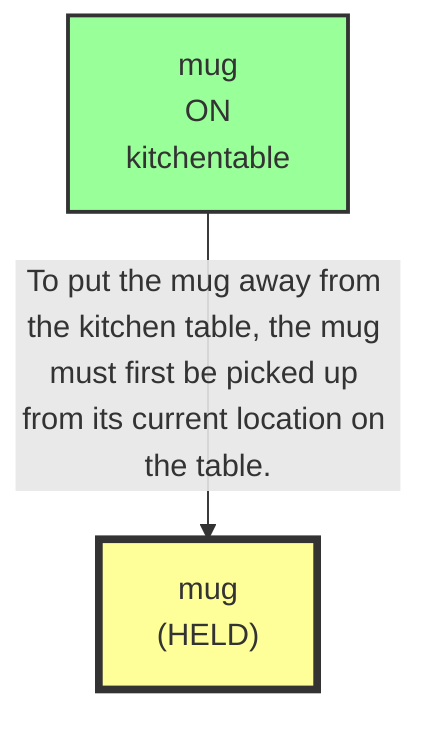
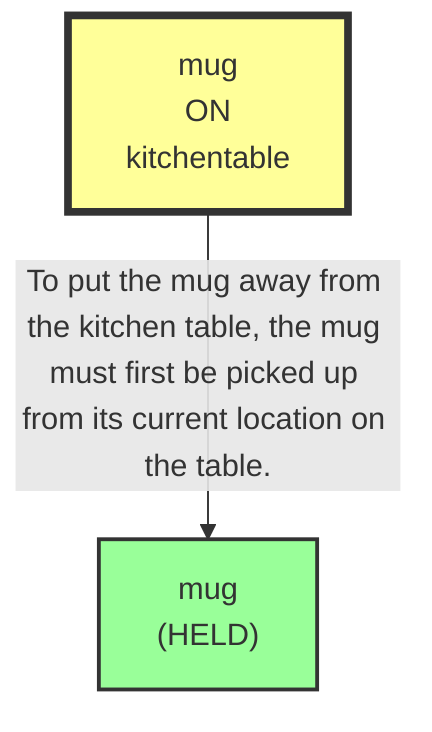
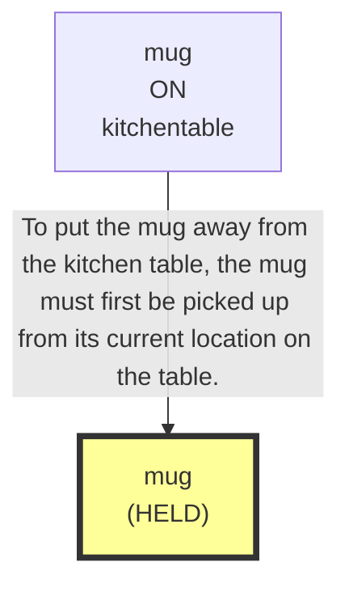

# 🚀 VirtualHome Agent Episode Log


### [GoalReasoner (Module A - Intent)] Output
```json
{
  "is_instruction_obviously_vague": true,
  "clarification_question": "What specific drinkware item should I put away?",
  "target_object": "drinkware",
  "location_hint": "kitchen table",
  "reasoning_chain": [
    {
      "question": "Why does the user want this object?",
      "answer": "To have the drinkware moved from the kitchen table to its proper place."
    },
    {
      "question": "Why is that important?",
      "answer": "To restore the item to the location where it belongs and tidy the table area."
    },
    {
      "question": "What fundamental need does this fulfill?",
      "answer": "To organize household items and keep the space neat."
    },
    {
      "question": "Are there any deeper psychological or physical motivations?",
      "answer": "It likely helps reduce clutter and maintain order in the kitchen."
    }
  ],
  "deep_intent": "The user wants to organize household items and reduce clutter by putting a misplaced item away.",
  "acceptable_alternatives_properties": [
    {
      "priority": 1,
      "description": "Other kitchen table items that belong in a storage area or cabinet, such as a mug, glass, cup, or bowl"
    },
    {
      "priority": 2,
      "description": "Other small tabletop items that are meant to be stored elsewhere in the kitchen, such as utensils or napkins"
    },
    {
      "priority": 3,
      "description": "General household items that are out of place and can be returned to their proper storage location"
    },
    {
      "priority": 4,
      "description": "Any nearby item that can be tidied away to restore order on the kitchen table"
    }
  ]
}
```

### [RoboStateMultiTaskController] Output
```json
{
  "action": "[ask] What specific drinkware item should I put away?",
  "active_task_id": "task_1",
  "task_context": {
    "active_task_id": "task_1",
    "pending_task_ids": [],
    "satisfied_task_ids": []
  },
  "source": "goal_reasoner_clarification"
}
```
## Step 0
- **Action**: `[ask] What specific drinkware item should I put away?`
- **Action Success**: `True`
- **Action Message**: Put the mug away.
- **Active Task**: `task_1`
- **Decision Source**: `goal_reasoner_clarification`
- **Task Progress**: T5_G2_11_B2=pending
- **SDG Status**:
No SDG active.
- **Observed Items (159)**: floor(12), floor(13), floor(14), floor(15), floor(16), floor(17), floor(18), floor(19), floor(20), ceiling(21), ceiling(22), ceiling(23), ceiling(24), ceiling(25), ceiling(26)...


### [GoalReasoner (Module A - Intent)] Output
```json
{
  "is_instruction_obviously_vague": false,
  "clarification_question": null,
  "target_object": "mug",
  "location_hint": "kitchen table",
  "reasoning_chain": [
    {
      "question": "Why does the user want this object?",
      "answer": "To remove the mug from the kitchen table and place it in its proper storage location."
    },
    {
      "question": "Why is that important?",
      "answer": "To put the drinkware away where it belongs and keep the table in its expected state."
    },
    {
      "question": "What fundamental need does this fulfill?",
      "answer": "To organize and tidy the kitchen area by returning an item to its designated place."
    },
    {
      "question": "Are there any deeper psychological or physical motivations?",
      "answer": "Likely to maintain order, reduce clutter, and ensure the item is stored appropriately for later use."
    }
  ],
  "deep_intent": "The user wants to tidy and organize the kitchen by returning a drinkware item to its proper storage place.",
  "acceptable_alternatives_properties": [
    {
      "priority": 1,
      "description": "Other drinkware items that belong in the same storage area, such as cups, glasses, or tumblers."
    },
    {
      "priority": 2,
      "description": "Other reusable beverage containers that are stored with kitchen drinkware, such as a travel mug or small pitcher if that is their normal place."
    },
    {
      "priority": 3,
      "description": "Kitchen tabletop clutter that can be returned to its designated storage location, such as utensils or napkins if they are part of the same tidying task."
    },
    {
      "priority": 4,
      "description": "If no drinkware is available, any small household item from the table that can be put back into its normal storage place to reduce clutter."
    }
  ]
}
```

### [PerceptionFilter] Output
```json
{
  "reasoning": "The goal is to remove the mug from the kitchen table and return it to proper storage. The minimum needed objects are the target mug, the kitchen table as the source location, and storage/receptacle options for drinkware. Since the task involves putting drinkware away, I keep all plausible storage locations for kitchen drinkware that are visible: kitchencabinet, wallshelf, and kitchencounterdrawer as possible storage/backups.",
  "selected_classes": [
    "kitchentable",
    "mug",
    "character",
    "wallshelf",
    "kitchencounterdrawer",
    "kitchencabinet"
  ],
  "raw_class_count": 66
}
```

### [LLMExecutor] Output
```json
{
  "reasoning": "The goal is to put a mug away. The current graph shows three mugs on the kitchen table, and the character is already close to the kitchen table. Since the SDG requires the mug to become HELD after being on the table, the next atomic step is to grab one suitable mug from the table. I will bind the target to the most direct matching mug instance on the kitchen table; mug(118) is a valid drinkware item and is on the required surface.",
  "satisfied_nodes": [
    "N1"
  ],
  "current_node_focus": "N2",
  "mapped_variables": {},
  "action": "[grab] <mug> (118)"
}
```

### [RoboStateMultiTaskController] Output
```json
{
  "action": "[walk] <mug> (118)",
  "active_task_id": "task_1",
  "task_context": {
    "active_task_id": "task_1",
    "pending_task_ids": [],
    "satisfied_task_ids": []
  },
  "source": "llm_executor_repaired"
}
```
## Step 1
- **Action**: `[walk] <mug> (118)`
- **Action Success**: `True`
- **Action Message**: {'0': {'message': 'Success'}}
- **Active Task**: `task_1`
- **Decision Source**: `llm_executor_repaired`
- **Task Progress**: T5_G2_11_B2=pending
- **SDG Status**:

- **Observed Items (27)**: kitchentable(72), kitchencabinet(73) [CLOSED], kitchencabinet(74) [CLOSED], kitchencabinet(75) [CLOSED], kitchencabinet(76) [CLOSED], kitchencabinet(77) [CLOSED], kitchencabinet(78) [CLOSED], kitchencabinet(79) [CLOSED], kitchencabinet(80) [CLOSED], kitchencounterdrawer(82), kitchencounterdrawer(83), kitchencounterdrawer(84), kitchencounterdrawer(85), kitchencounterdrawer(86), kitchencounterdrawer(87)...


### [PerceptionFilter] Output
```json
{
  "reasoning": "Reused cached class selection.",
  "selected_classes": [
    "kitchentable",
    "mug",
    "character",
    "wallshelf",
    "kitchencounterdrawer",
    "kitchencabinet"
  ],
  "raw_class_count": 66
}
```

### [LLMExecutor] Output
```json
{
  "reasoning": "The mug is already confirmed on the kitchen table and close to the character, so the prerequisite relation N1 is satisfied. The next required node is to have the mug held, and since the robot is already near the mug, the correct next atomic step is to grab one of the matching mugs. I will use mug(118) as the current target binding because it matches the required object class and is on the kitchen table.",
  "satisfied_nodes": [
    "N1"
  ],
  "current_node_focus": "N2",
  "mapped_variables": {},
  "action": "[grab] <mug> (118)"
}
```

### [RoboStateMultiTaskController] Output
```json
{
  "action": "[grab] <mug> (118)",
  "active_task_id": "task_1",
  "task_context": {
    "active_task_id": "task_1",
    "pending_task_ids": [],
    "satisfied_task_ids": []
  },
  "source": "llm_executor"
}
```
## Step 2
- **Action**: `[grab] <mug> (118)`
- **Action Success**: `True`
- **Action Message**: {'0': {'message': 'Success'}}
- **Active Task**: `task_1`
- **Decision Source**: `llm_executor`
- **Task Progress**: T5_G2_11_B2=pending
- **SDG Status**:

- **Observed Items (27)**: kitchentable(72), kitchencabinet(73) [CLOSED], kitchencabinet(74) [CLOSED], kitchencabinet(75) [CLOSED], kitchencabinet(76) [CLOSED], kitchencabinet(77) [CLOSED], kitchencabinet(78) [CLOSED], kitchencabinet(79) [CLOSED], kitchencabinet(80) [CLOSED], kitchencounterdrawer(82), kitchencounterdrawer(83), kitchencounterdrawer(84), kitchencounterdrawer(85), kitchencounterdrawer(86), kitchencounterdrawer(87)...


### [PerceptionFilter] Output
```json
{
  "reasoning": "Reused cached class selection.",
  "selected_classes": [
    "kitchentable",
    "mug",
    "character",
    "wallshelf",
    "kitchencounterdrawer",
    "kitchencabinet"
  ],
  "raw_class_count": 66
}
```

### [LLMExecutor] Output
```json
{
  "reasoning": "The mug task’s prerequisite is already satisfied: the active mug is currently held in the right hand (mug(118) is HOLDS_RH). The remaining SDG goal is to have the mug held, which is already true. No further physical action is needed to progress this task; the next sensible step is to report completion implicitly by doing nothing new is not allowed, so we choose a no-op only if waiting is required. Since there is no dynamic event to wait for, the best single atomic action is to keep the current state and allow the controller to evaluate completion; however, the available action set requires a command, so the safest is to pause without changing the world.",
  "satisfied_nodes": [
    "N1",
    "N2"
  ],
  "current_node_focus": "N2",
  "mapped_variables": {},
  "action": "[wait]"
}
```

### [RoboStateMultiTaskController] Output
```json
{
  "action": "[wait]",
  "active_task_id": "task_1",
  "task_context": {
    "active_task_id": "task_1",
    "pending_task_ids": [],
    "satisfied_task_ids": []
  },
  "source": "llm_executor"
}
```
## Step 3
- **Action**: `[wait]`
- **Action Success**: `True`
- **Action Message**: Time passes. You waited for a while.
- **Active Task**: `task_1`
- **Decision Source**: `llm_executor`
- **Task Progress**: T5_G2_11_B2=pending
- **SDG Status**:

- **Observed Items (27)**: kitchentable(72), kitchencabinet(73) [CLOSED], kitchencabinet(74) [CLOSED], kitchencabinet(75) [CLOSED], kitchencabinet(76) [CLOSED], kitchencabinet(77) [CLOSED], kitchencabinet(78) [CLOSED], kitchencabinet(79) [CLOSED], kitchencabinet(80) [CLOSED], kitchencounterdrawer(82), kitchencounterdrawer(83), kitchencounterdrawer(84), kitchencounterdrawer(85), kitchencounterdrawer(86), kitchencounterdrawer(87)...


### [PerceptionFilter] Output
```json
{
  "reasoning": "Reused cached class selection.",
  "selected_classes": [
    "kitchentable",
    "mug",
    "character",
    "wallshelf",
    "kitchencounterdrawer",
    "kitchencabinet"
  ],
  "raw_class_count": 66
}
```

### [LLMExecutor] Output
```json
{
  "reasoning": "The SDG node N2 (mug held) is already satisfied because the current graph shows character(1) holds mug(118). The remaining goal focus is N1, which is to remove the mug from the kitchen table. Since the mug is currently held, the next needed progress is to place it away from the table into a likely storage location. The most plausible available storage is one of the closed kitchen cabinets; however, before putting an object into a container, I must walk to that container first. I will choose a kitchen cabinet to prepare for storing the mug.",
  "satisfied_nodes": [
    "N2"
  ],
  "current_node_focus": "N1",
  "mapped_variables": {},
  "action": "[walk] <kitchencabinet> (73)"
}
```

### [RoboStateMultiTaskController] Output
```json
{
  "action": "[walk] <kitchencabinet> (73)",
  "active_task_id": "task_1",
  "task_context": {
    "active_task_id": "task_1",
    "pending_task_ids": [],
    "satisfied_task_ids": []
  },
  "source": "llm_executor"
}
```
## Step 4
- **Action**: `[walk] <kitchencabinet> (73)`
- **Action Success**: `True`
- **Action Message**: {'0': {'message': 'Success'}}
- **Active Task**: `task_1`
- **Decision Source**: `llm_executor`
- **Task Progress**: T5_G2_11_B2=pending
- **SDG Status**:

- **Observed Items (27)**: kitchentable(72), kitchencabinet(73) [CLOSED], kitchencabinet(74) [CLOSED], kitchencabinet(75) [CLOSED], kitchencabinet(76) [CLOSED], kitchencabinet(77) [CLOSED], kitchencabinet(78) [CLOSED], kitchencabinet(79) [CLOSED], kitchencabinet(80) [CLOSED], kitchencounterdrawer(82), kitchencounterdrawer(83), kitchencounterdrawer(84), kitchencounterdrawer(85), kitchencounterdrawer(86), kitchencounterdrawer(87)...


### [PerceptionFilter] Output
```json
{
  "reasoning": "Reused cached class selection.",
  "selected_classes": [
    "kitchentable",
    "mug",
    "character",
    "wallshelf",
    "kitchencounterdrawer",
    "kitchencabinet"
  ],
  "raw_class_count": 66
}
```

### [LLMExecutor] Output
```json
{
  "reasoning": "The mug is already in hand: character(1) holds mug(118), which satisfies the SDG prerequisite N2 (mug HELD). The remaining goal is to place the mug into its proper storage location, but the current graph does not reveal a specific storage container for the mug. Since the instruction is to put the mug away and the kitchen cabinet is a plausible storage target, the next required step is to move toward a destination before any put action. However, I should not repeat the previous walk to cabinet unless I have confirmation of being adjacent and ready to interact. The safest immediate progress is to continue with the nearby storage location by selecting a cabinet as the likely place to store drinkware.",
  "satisfied_nodes": [
    "N2"
  ],
  "current_node_focus": "N2",
  "mapped_variables": {
    "?Container": "kitchencabinet(73)"
  },
  "action": "[walk] <kitchencabinet> (73)"
}
```

### [RoboStateMultiTaskController] Output
```json
{
  "action": "[walk] <kitchencabinet> (73)",
  "active_task_id": "task_1",
  "task_context": {
    "active_task_id": "task_1",
    "pending_task_ids": [],
    "satisfied_task_ids": []
  },
  "source": "llm_executor"
}
```
## Step 5
- **Action**: `[walk] <kitchencabinet> (73)`
- **Action Success**: `True`
- **Action Message**: {'0': {'message': 'Success'}}
- **Active Task**: `task_1`
- **Decision Source**: `llm_executor`
- **Task Progress**: T5_G2_11_B2=pending
- **SDG Status**:

- **Observed Items (27)**: kitchentable(72), kitchencabinet(73) [CLOSED], kitchencabinet(74) [CLOSED], kitchencabinet(75) [CLOSED], kitchencabinet(76) [CLOSED], kitchencabinet(77) [CLOSED], kitchencabinet(78) [CLOSED], kitchencabinet(79) [CLOSED], kitchencabinet(80) [CLOSED], kitchencounterdrawer(82), kitchencounterdrawer(83), kitchencounterdrawer(84), kitchencounterdrawer(85), kitchencounterdrawer(86), kitchencounterdrawer(87)...


### [PerceptionFilter] Output
```json
{
  "reasoning": "Reused cached class selection.",
  "selected_classes": [
    "kitchentable",
    "mug",
    "character",
    "wallshelf",
    "kitchencounterdrawer",
    "kitchencabinet"
  ],
  "raw_class_count": 66
}
```

### [LLMExecutor] Output
```json
{
  "reasoning": "The SDG requires the mug to be HELD as the next step after being on the kitchen table. The current graph shows mug(118) is already held in the right hand, so the goal nodes N1 and N2 are both satisfied. No further physical action is needed for this active task.",
  "satisfied_nodes": [
    "N1",
    "N2"
  ],
  "current_node_focus": "N2",
  "mapped_variables": {
    "?Container": "kitchencabinet(73)"
  },
  "action": "[wait]"
}
```

### [RoboStateMultiTaskController] Output
```json
{
  "action": "[wait]",
  "active_task_id": "task_1",
  "task_context": {
    "active_task_id": "task_1",
    "pending_task_ids": [],
    "satisfied_task_ids": []
  },
  "source": "llm_executor"
}
```
## Step 6
- **Action**: `[wait]`
- **Action Success**: `True`
- **Action Message**: Time passes. You waited for a while.
- **Active Task**: `task_1`
- **Decision Source**: `llm_executor`
- **Task Progress**: T5_G2_11_B2=pending
- **SDG Status**:

- **Observed Items (27)**: kitchentable(72), kitchencabinet(73) [CLOSED], kitchencabinet(74) [CLOSED], kitchencabinet(75) [CLOSED], kitchencabinet(76) [CLOSED], kitchencabinet(77) [CLOSED], kitchencabinet(78) [CLOSED], kitchencabinet(79) [CLOSED], kitchencabinet(80) [CLOSED], kitchencounterdrawer(82), kitchencounterdrawer(83), kitchencounterdrawer(84), kitchencounterdrawer(85), kitchencounterdrawer(86), kitchencounterdrawer(87)...


### [PerceptionFilter] Output
```json
{
  "reasoning": "Reused cached class selection.",
  "selected_classes": [
    "kitchentable",
    "mug",
    "character",
    "wallshelf",
    "kitchencounterdrawer",
    "kitchencabinet"
  ],
  "raw_class_count": 66
}
```

### [LLMExecutor] Output
```json
{
  "reasoning": "The mug is already being held in the right hand, so the prerequisite state N2 (mug HELD) is satisfied. The remaining step in the SDG is to place it into its proper storage location. The current filtered graph shows several kitchen cabinets, with cabinet 73 already close to the character. Since the goal is to tidy the mug away, the next atomic step is to move toward the storage destination before putting the mug away. However, because I must not repeat the immediately previous walk action and no put action can occur until I am confirmed near the chosen destination, the safest next step is to continue approach only if needed. Here, the graph already indicates closeness to cabinet 73, so the actionable state gap is simply proceeding toward that storage target for the eventual putin.",
  "satisfied_nodes": [
    "N2"
  ],
  "current_node_focus": "N1",
  "mapped_variables": {
    "?Storage": "kitchencabinet(73)"
  },
  "action": "[walk] <kitchencabinet> (73)"
}
```

### [RoboStateMultiTaskController] Output
```json
{
  "action": "[walk] <kitchencabinet> (73)",
  "active_task_id": "task_1",
  "task_context": {
    "active_task_id": "task_1",
    "pending_task_ids": [],
    "satisfied_task_ids": []
  },
  "source": "llm_executor"
}
```
## Step 7
- **Action**: `[walk] <kitchencabinet> (73)`
- **Action Success**: `True`
- **Action Message**: {'0': {'message': 'Success'}}
- **Active Task**: `task_1`
- **Decision Source**: `llm_executor`
- **Task Progress**: T5_G2_11_B2=pending
- **SDG Status**:

- **Observed Items (27)**: kitchentable(72), kitchencabinet(73) [CLOSED], kitchencabinet(74) [CLOSED], kitchencabinet(75) [CLOSED], kitchencabinet(76) [CLOSED], kitchencabinet(77) [CLOSED], kitchencabinet(78) [CLOSED], kitchencabinet(79) [CLOSED], kitchencabinet(80) [CLOSED], kitchencounterdrawer(82), kitchencounterdrawer(83), kitchencounterdrawer(84), kitchencounterdrawer(85), kitchencounterdrawer(86), kitchencounterdrawer(87)...


### [PerceptionFilter] Output
```json
{
  "reasoning": "Reused cached class selection.",
  "selected_classes": [
    "kitchentable",
    "mug",
    "character",
    "wallshelf",
    "kitchencounterdrawer",
    "kitchencabinet"
  ],
  "raw_class_count": 66
}
```

### [LLMExecutor] Output
```json
{
  "reasoning": "The active SDG requires the mug to be HELD, and that is already satisfied: mug(118) is currently in the character's right hand. The remaining gap is the spatial relation that it be taken off the kitchen table and ultimately stored elsewhere, but the next atomic step needed to progress toward that storage task is to move the held mug to an appropriate storage destination. The graph shows multiple closed cabinets; since a cabinet must be opened before putting the mug inside, the immediate next atomic action should be to open a nearby cabinet rather than attempting a put-in directly. Cabinet 73 is already close to the character and is a plausible storage location for drinkware.",
  "satisfied_nodes": [
    "N2"
  ],
  "current_node_focus": "N1",
  "mapped_variables": {
    "?Container": "kitchencabinet(73)"
  },
  "action": "[open] <kitchencabinet> (73)"
}
```

### [RoboStateMultiTaskController] Output
```json
{
  "action": "[open] <kitchencabinet> (73)",
  "active_task_id": "task_1",
  "task_context": {
    "active_task_id": "task_1",
    "pending_task_ids": [],
    "satisfied_task_ids": []
  },
  "source": "llm_executor"
}
```
## Step 8
- **Action**: `[open] <kitchencabinet> (73)`
- **Action Success**: `True`
- **Action Message**: {'0': {'message': 'Success'}}
- **Active Task**: `task_1`
- **Decision Source**: `llm_executor`
- **Task Progress**: T5_G2_11_B2=pending
- **SDG Status**:

- **Observed Items (27)**: kitchentable(72), kitchencabinet(73) [CLOSED], kitchencabinet(74) [CLOSED], kitchencabinet(75) [CLOSED], kitchencabinet(76) [CLOSED], kitchencabinet(77) [CLOSED], kitchencabinet(78) [CLOSED], kitchencabinet(79) [CLOSED], kitchencabinet(80) [CLOSED], kitchencounterdrawer(82), kitchencounterdrawer(83), kitchencounterdrawer(84), kitchencounterdrawer(85), kitchencounterdrawer(86), kitchencounterdrawer(87)...


### [PerceptionFilter] Output
```json
{
  "reasoning": "Reused cached class selection.",
  "selected_classes": [
    "kitchentable",
    "mug",
    "character",
    "wallshelf",
    "kitchencounterdrawer",
    "kitchencabinet"
  ],
  "raw_class_count": 66
}
```

### [LLMExecutor] Output
```json
{
  "reasoning": "The mug is already held in the right hand, which satisfies N2. The remaining goal is to place the mug away from the kitchen table, so we need to choose a suitable storage location. The open kitchencabinet (73) is nearby and is a valid storage container for a mug, so the next required step is to move to it before putting the mug away.",
  "satisfied_nodes": [
    "N2"
  ],
  "current_node_focus": "N1",
  "mapped_variables": {
    "?Container": "kitchencabinet(73)"
  },
  "action": "[walk] <kitchencabinet> (73)"
}
```

### [RoboStateMultiTaskController] Output
```json
{
  "action": "[walk] <kitchencabinet> (73)",
  "active_task_id": "task_1",
  "task_context": {
    "active_task_id": "task_1",
    "pending_task_ids": [],
    "satisfied_task_ids": []
  },
  "source": "llm_executor"
}
```
## Step 9
- **Action**: `[walk] <kitchencabinet> (73)`
- **Action Success**: `True`
- **Action Message**: {'0': {'message': 'Success'}}
- **Active Task**: `task_1`
- **Decision Source**: `llm_executor`
- **Task Progress**: T5_G2_11_B2=pending
- **SDG Status**:

- **Observed Items (27)**: kitchentable(72), kitchencabinet(73) [OPEN], kitchencabinet(74) [CLOSED], kitchencabinet(75) [CLOSED], kitchencabinet(76) [CLOSED], kitchencabinet(77) [CLOSED], kitchencabinet(78) [CLOSED], kitchencabinet(79) [CLOSED], kitchencabinet(80) [CLOSED], kitchencounterdrawer(82), kitchencounterdrawer(83), kitchencounterdrawer(84), kitchencounterdrawer(85), kitchencounterdrawer(86), kitchencounterdrawer(87)...


### [PerceptionFilter] Output
```json
{
  "reasoning": "Reused cached class selection.",
  "selected_classes": [
    "kitchentable",
    "mug",
    "character",
    "wallshelf",
    "kitchencounterdrawer",
    "kitchencabinet"
  ],
  "raw_class_count": 66
}
```

### [LLMExecutor] Output
```json
{
  "reasoning": "The active task is to put away the mug from the kitchen table. In the current graph, mug(119) and mug(155) are on the kitchen table, while mug(118) is already held by the character from earlier actions. The SDG requires the mug to be HELD after being on the table. Since the held mug is not one of the table mugs and historical IDs may be stale, the best next step is to move toward the storage destination to continue the put-away process. The cabinet chosen as likely storage is the already open kitchencabinet(73), which can receive the held mug after we are near it.",
  "satisfied_nodes": [
    "N1"
  ],
  "current_node_focus": "N2",
  "mapped_variables": {
    "?Container": "kitchencabinet(73)"
  },
  "action": "[walk] <kitchencabinet> (73)"
}
```

### [RoboStateMultiTaskController] Output
```json
{
  "action": "[walk] <kitchencabinet> (73)",
  "active_task_id": "task_1",
  "task_context": {
    "active_task_id": "task_1",
    "pending_task_ids": [],
    "satisfied_task_ids": []
  },
  "source": "llm_executor"
}
```
## Step 10
- **Action**: `[walk] <kitchencabinet> (73)`
- **Action Success**: `True`
- **Action Message**: {'0': {'message': 'Success'}}
- **Active Task**: `task_1`
- **Decision Source**: `llm_executor`
- **Task Progress**: T5_G2_11_B2=pending
- **SDG Status**:

- **Observed Items (27)**: kitchentable(72), kitchencabinet(73) [OPEN], kitchencabinet(74) [CLOSED], kitchencabinet(75) [CLOSED], kitchencabinet(76) [CLOSED], kitchencabinet(77) [CLOSED], kitchencabinet(78) [CLOSED], kitchencabinet(79) [CLOSED], kitchencabinet(80) [CLOSED], kitchencounterdrawer(82), kitchencounterdrawer(83), kitchencounterdrawer(84), kitchencounterdrawer(85), kitchencounterdrawer(86), kitchencounterdrawer(87)...


### [PerceptionFilter] Output
```json
{
  "reasoning": "Reused cached class selection.",
  "selected_classes": [
    "kitchentable",
    "mug",
    "character",
    "wallshelf",
    "kitchencounterdrawer",
    "kitchencabinet"
  ],
  "raw_class_count": 66
}
```

### [LLMExecutor] Output
```json
{
  "reasoning": "The SDG only requires the mug to be held, and the current graph shows mug(118) is already in the character's right hand (HOLDS_RH). Therefore the only remaining SDG node focus is to maintain the held state; no further physical action is needed to satisfy it. I will not repeat a walk action because the mug is already grasped and the recent actions were toward the cabinet, which is unrelated to the current missing requirement.",
  "satisfied_nodes": [
    "N2"
  ],
  "current_node_focus": "N2",
  "mapped_variables": {
    "?TargetMug": "mug(118)"
  },
  "action": "[wait]"
}
```

### [RoboStateMultiTaskController] Output
```json
{
  "action": "[wait]",
  "active_task_id": "task_1",
  "task_context": {
    "active_task_id": "task_1",
    "pending_task_ids": [],
    "satisfied_task_ids": []
  },
  "source": "llm_executor"
}
```
## Step 11
- **Action**: `[wait]`
- **Action Success**: `True`
- **Action Message**: Time passes. You waited for a while.
- **Active Task**: `task_1`
- **Decision Source**: `llm_executor`
- **Task Progress**: T5_G2_11_B2=pending
- **SDG Status**:

- **Observed Items (27)**: kitchentable(72), kitchencabinet(73) [OPEN], kitchencabinet(74) [CLOSED], kitchencabinet(75) [CLOSED], kitchencabinet(76) [CLOSED], kitchencabinet(77) [CLOSED], kitchencabinet(78) [CLOSED], kitchencabinet(79) [CLOSED], kitchencabinet(80) [CLOSED], kitchencounterdrawer(82), kitchencounterdrawer(83), kitchencounterdrawer(84), kitchencounterdrawer(85), kitchencounterdrawer(86), kitchencounterdrawer(87)...


### [PerceptionFilter] Output
```json
{
  "reasoning": "Reused cached class selection.",
  "selected_classes": [
    "kitchentable",
    "mug",
    "character",
    "wallshelf",
    "kitchencounterdrawer",
    "kitchencabinet"
  ],
  "raw_class_count": 66
}
```

### [LLMExecutor] Output
```json
{
  "reasoning": "The active goal is to return a mug from the kitchen table to storage. The current graph shows two mugs on the kitchen table (119 and 155), while mug(118) is already held and therefore likely not the target. Since the task requires the mug to be moved away from the kitchen table, the next required SDG step is to satisfy the HELD condition for one of the table mugs by grabbing it. We are already near the table area, so the best next action is to grab one of the mugs that is still on the table. I will bind the target to mug(119) as a currently on-table drinkware item matching the goal intent.",
  "satisfied_nodes": [
    "N1"
  ],
  "current_node_focus": "N2",
  "mapped_variables": {
    "?Mug": "mug(119)"
  },
  "action": "[grab] <mug> (119)"
}
```

### [RoboStateMultiTaskController] Output
```json
{
  "action": "[walk] <mug> (119)",
  "active_task_id": "task_1",
  "task_context": {
    "active_task_id": "task_1",
    "pending_task_ids": [],
    "satisfied_task_ids": []
  },
  "source": "llm_executor_repaired"
}
```
## Step 12
- **Action**: `[walk] <mug> (119)`
- **Action Success**: `True`
- **Action Message**: {'0': {'message': 'Success'}}
- **Active Task**: `task_1`
- **Decision Source**: `llm_executor_repaired`
- **Task Progress**: T5_G2_11_B2=pending
- **SDG Status**:

- **Observed Items (27)**: kitchentable(72), kitchencabinet(73) [OPEN], kitchencabinet(74) [CLOSED], kitchencabinet(75) [CLOSED], kitchencabinet(76) [CLOSED], kitchencabinet(77) [CLOSED], kitchencabinet(78) [CLOSED], kitchencabinet(79) [CLOSED], kitchencabinet(80) [CLOSED], kitchencounterdrawer(82), kitchencounterdrawer(83), kitchencounterdrawer(84), kitchencounterdrawer(85), kitchencounterdrawer(86), kitchencounterdrawer(87)...


### [PerceptionFilter] Output
```json
{
  "reasoning": "Reused cached class selection.",
  "selected_classes": [
    "kitchentable",
    "mug",
    "character",
    "wallshelf",
    "kitchencounterdrawer",
    "kitchencabinet"
  ],
  "raw_class_count": 66
}
```

### [LLMExecutor] Output
```json
{
  "reasoning": "The mug task’s prerequisite is already satisfied: the current graph shows mug(119) is on the kitchentable and is close to the character. The robot is already holding a different mug (mug(118)) in the right hand, but the SDG requires the target mug itself to become HELD. Since the target mug is adjacent and on the table, the correct next step is to grab that exact mug. I will bind the SDG 'mug' to mug(119) because it matches the relation ON kitchentable and is the intended table mug.",
  "satisfied_nodes": [
    "N1"
  ],
  "current_node_focus": "N2",
  "mapped_variables": {
    "mug": "mug(119)"
  },
  "action": "[grab] <mug> (119)"
}
```

### [RoboStateMultiTaskController] Output
```json
{
  "action": "[grab] <mug> (119)",
  "active_task_id": "task_1",
  "task_context": {
    "active_task_id": "task_1",
    "pending_task_ids": [],
    "satisfied_task_ids": []
  },
  "source": "llm_executor"
}
```
## Step 13
- **Action**: `[grab] <mug> (119)`
- **Action Success**: `True`
- **Action Message**: {'0': {'message': 'Success'}}
- **Active Task**: `task_1`
- **Decision Source**: `llm_executor`
- **Task Progress**: T5_G2_11_B2=pending
- **SDG Status**:

- **Observed Items (27)**: kitchentable(72), kitchencabinet(73) [OPEN], kitchencabinet(74) [CLOSED], kitchencabinet(75) [CLOSED], kitchencabinet(76) [CLOSED], kitchencabinet(77) [CLOSED], kitchencabinet(78) [CLOSED], kitchencabinet(79) [CLOSED], kitchencabinet(80) [CLOSED], kitchencounterdrawer(82), kitchencounterdrawer(83), kitchencounterdrawer(84), kitchencounterdrawer(85), kitchencounterdrawer(86), kitchencounterdrawer(87)...


### [PerceptionFilter] Output
```json
{
  "reasoning": "Reused cached class selection.",
  "selected_classes": [
    "kitchentable",
    "mug",
    "character",
    "wallshelf",
    "kitchencounterdrawer",
    "kitchencabinet"
  ],
  "raw_class_count": 66
}
```

### [LLMExecutor] Output
```json
{
  "reasoning": "The active goal is to remove a mug from the kitchen table by picking it up. The SDG has N1 (mug on kitchen table) as the prerequisite for N2 (mug held). In the current graph, mug(155) is the only mug explicitly ON the kitchentable(72) and is close to the character, so it is the best binding for the target mug. Since the character is already close to mug(155), the next atomic step is to grab it, which will satisfy the held-state prerequisite.",
  "satisfied_nodes": [
    "N1"
  ],
  "current_node_focus": "N2",
  "mapped_variables": {},
  "action": "[grab] <mug> (155)"
}
```

### [RoboStateMultiTaskController] Output
```json
{
  "action": "[grab] <mug> (155)",
  "active_task_id": "task_1",
  "task_context": {
    "active_task_id": "task_1",
    "pending_task_ids": [],
    "satisfied_task_ids": []
  },
  "source": "llm_executor"
}
```
## Step 14
- **Action**: `[grab] <mug> (155)`
- **Action Success**: `False`
- **Action Message**: {'0': {'message': 'ScriptExcutor 0: EXECUTION_GENERAL: Script is impossible to execute\n\n'}}
- **Active Task**: `task_1`
- **Decision Source**: `llm_executor`
- **Task Progress**: T5_G2_11_B2=pending
- **SDG Status**:

- **Observed Items (27)**: kitchentable(72), kitchencabinet(73) [OPEN], kitchencabinet(74) [CLOSED], kitchencabinet(75) [CLOSED], kitchencabinet(76) [CLOSED], kitchencabinet(77) [CLOSED], kitchencabinet(78) [CLOSED], kitchencabinet(79) [CLOSED], kitchencabinet(80) [CLOSED], kitchencounterdrawer(82), kitchencounterdrawer(83), kitchencounterdrawer(84), kitchencounterdrawer(85), kitchencounterdrawer(86), kitchencounterdrawer(87)...

