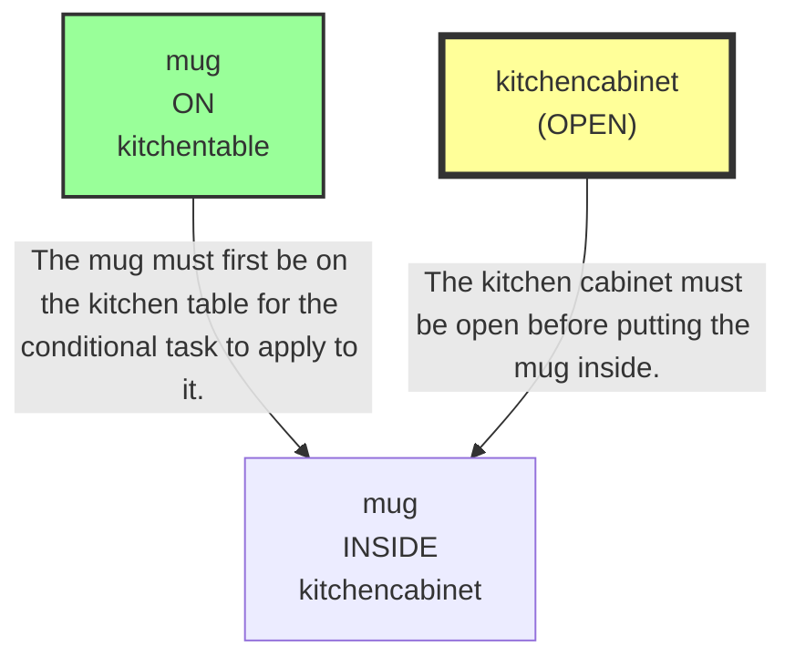
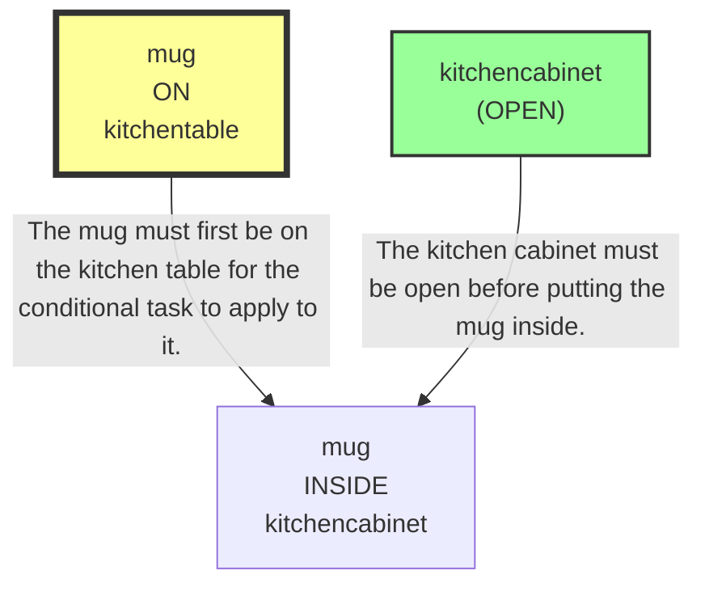
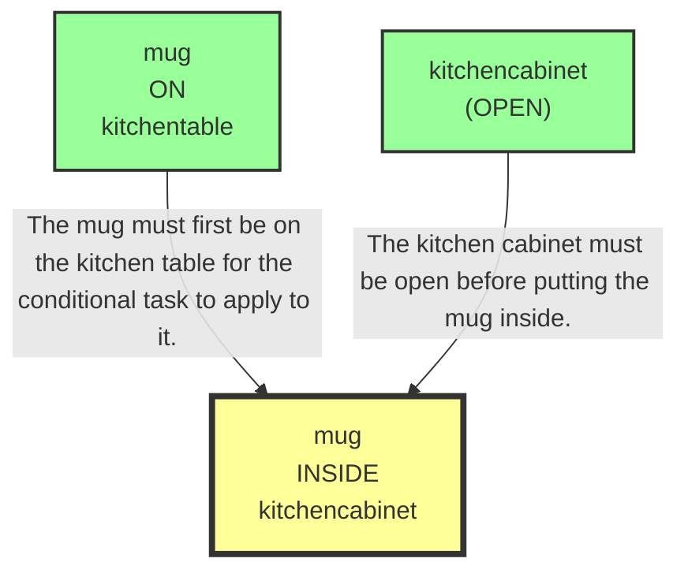

# 🚀 VirtualHome Agent Episode Log


### [GoalReasoner (Module A - Intent)] Output
```json
{
  "is_instruction_obviously_vague": true,
  "clarification_question": "Which specific drinkware item should I move?",
  "target_object": "drinkware",
  "location_hint": "kitchen table",
  "reasoning_chain": [
    {
      "question": "Why does the user want this object?",
      "answer": "To have the drinkware moved from the kitchen table."
    },
    {
      "question": "Why is that important?",
      "answer": "To remove it from the table and place it in its intended location."
    },
    {
      "question": "What fundamental need does this fulfill?",
      "answer": "It fulfills the need to tidy or organize household items."
    },
    {
      "question": "Are there any deeper psychological or physical motivations?",
      "answer": "The user likely wants the space to be orderly and the item stored in the correct place."
    }
  ],
  "deep_intent": "The user wants to organize household items by putting an item in its proper place.",
  "acceptable_alternatives_properties": [
    {
      "priority": 1,
      "description": "Another similar household item that belongs with drinkware, such as a cup, mug, glass, or bottle"
    },
    {
      "priority": 2,
      "description": "Other tabletop kitchen items that are stored together in the same area"
    },
    {
      "priority": 3,
      "description": "A comparable household item that can be tidied away into a storage area"
    },
    {
      "priority": 4,
      "description": "Any small portable household object that can be put away to reduce clutter"
    }
  ]
}
```

### [RoboStateMultiTaskController] Output
```json
{
  "action": "[ask] Which specific drinkware item should I move?",
  "active_task_id": "task_1",
  "task_context": {
    "active_task_id": "task_1",
    "pending_task_ids": [],
    "satisfied_task_ids": []
  },
  "source": "goal_reasoner_clarification"
}
```
## Step 0
- **Action**: `[ask] Which specific drinkware item should I move?`
- **Action Success**: `True`
- **Action Message**: The mug.
- **Active Task**: `task_1`
- **Decision Source**: `goal_reasoner_clarification`
- **Task Progress**: T5_G2_11_B2=pending
- **SDG Status**:
No SDG active.
- **Observed Items (159)**: floor(12), floor(13), floor(14), floor(15), floor(16), floor(17), floor(18), floor(19), floor(20), ceiling(21), ceiling(22), ceiling(23), ceiling(24), ceiling(25), ceiling(26)...


### [GoalReasoner (Module A - Intent)] Output
```json
{
  "is_instruction_obviously_vague": true,
  "clarification_question": "Where exactly should I put the mug?",
  "target_object": "mug",
  "location_hint": "kitchen table",
  "reasoning_chain": [
    {
      "question": "Why does the user want this object?",
      "answer": "They want the mug to be moved from the kitchen table to another place."
    },
    {
      "question": "Why is that important?",
      "answer": "Because the mug should end up in its correct final location."
    },
    {
      "question": "What fundamental need does this fulfill?",
      "answer": "To restore order by storing an item in its designated place."
    },
    {
      "question": "Are there any deeper psychological or physical motivations?",
      "answer": "The user likely wants the area tidied and the mug put away appropriately."
    }
  ],
  "deep_intent": "The user wants to restore order by returning an item to its designated place.",
  "acceptable_alternatives_properties": [
    {
      "priority": 1,
      "description": "Other drinkware items that should be returned to their usual storage location, such as cups or glasses"
    },
    {
      "priority": 2,
      "description": "Other kitchen items that belong in a cabinet, drawer, or dish rack"
    },
    {
      "priority": 3,
      "description": "Small household items that are out of place and need to be put away"
    },
    {
      "priority": 4,
      "description": "Any loose tabletop clutter that can be organized and removed from the surface"
    }
  ]
}
```

### [RoboStateMultiTaskController] Output
```json
{
  "action": "[ask] Where exactly should I put the mug?",
  "active_task_id": "task_1",
  "task_context": {
    "active_task_id": "task_1",
    "pending_task_ids": [],
    "satisfied_task_ids": []
  },
  "source": "goal_reasoner_clarification"
}
```
## Step 1
- **Action**: `[ask] Where exactly should I put the mug?`
- **Action Success**: `True`
- **Action Message**: Inside a kitchen cabinet.
- **Active Task**: `task_1`
- **Decision Source**: `goal_reasoner_clarification`
- **Task Progress**: T5_G2_11_B2=pending
- **SDG Status**:
No SDG active.
- **Observed Items (159)**: floor(12), floor(13), floor(14), floor(15), floor(16), floor(17), floor(18), floor(19), floor(20), ceiling(21), ceiling(22), ceiling(23), ceiling(24), ceiling(25), ceiling(26)...


### [GoalReasoner (Module A - Intent)] Output
```json
{
  "is_instruction_obviously_vague": false,
  "clarification_question": null,
  "target_object": "mug",
  "location_hint": "kitchen table",
  "reasoning_chain": [
    {
      "question": "Why does the user want this object?",
      "answer": "To have the mug moved from the kitchen table into storage."
    },
    {
      "question": "Why is that important?",
      "answer": "To clear the table and keep the mug out of the way."
    },
    {
      "question": "What fundamental need does this fulfill?",
      "answer": "It helps organize the kitchen and store the mug in an indoor cabinet."
    },
    {
      "question": "Are there any deeper psychological or physical motivations?",
      "answer": "The user likely wants a tidier, less cluttered kitchen and to place the mug in a more appropriate storage location."
    }
  ],
  "deep_intent": "The user wants to organize kitchen items by moving a mug from a table into storage.",
  "acceptable_alternatives_properties": [
    {
      "priority": 1,
      "description": "Other similar drinkware items that can be stored in a kitchen cabinet, such as a cup or tumbler"
    },
    {
      "priority": 2,
      "description": "Other kitchen tabletop items that belong in cabinet storage, such as a bowl or small dish"
    },
    {
      "priority": 3,
      "description": "Other small household items that can be put away to reduce clutter in the kitchen"
    },
    {
      "priority": 4,
      "description": "Other indoor storage actions that achieve the same organizing goal, such as placing a portable kitchen item in a cupboard or shelf"
    }
  ]
}
```

### [PerceptionFilter] Output
```json
{
  "reasoning": "The task is to move the mug from the kitchen table into storage, so the minimum required classes are the target object, its source location, its destination storage, and the cabinet state needed to place it inside. No extra tools are required.",
  "selected_classes": [
    "kitchentable",
    "door",
    "character",
    "mug",
    "kitchencabinet"
  ],
  "raw_class_count": 66
}
```

### [LLMExecutor] Output
```json
{
  "reasoning": "The mug goal is partially satisfied: a mug is already on the kitchen table, matching N1. The kitchen cabinet that should receive it is present but currently CLOSED, so N3 is not satisfied and must be addressed before the mug can be put inside. Since placing into the cabinet requires being near the cabinet and the cabinet must be open first, the next atomic step is to walk to the best matching cabinet instance. I choose kitchencabinet(73) as an arbitrary valid cabinet binding from the available closed cabinets, to prepare for opening it next.",
  "satisfied_nodes": [
    "N1"
  ],
  "current_node_focus": "N3",
  "mapped_variables": {
    "?Cabinet": "kitchencabinet(73)"
  },
  "action": "[walk] <kitchencabinet> (73)"
}
```

### [RoboStateMultiTaskController] Output
```json
{
  "action": "[walk] <kitchencabinet> (73)",
  "active_task_id": "task_1",
  "task_context": {
    "active_task_id": "task_1",
    "pending_task_ids": [],
    "satisfied_task_ids": []
  },
  "source": "llm_executor"
}
```
## Step 2
- **Action**: `[walk] <kitchencabinet> (73)`
- **Action Success**: `True`
- **Action Message**: {'0': {'message': 'Success'}}
- **Active Task**: `task_1`
- **Decision Source**: `llm_executor`
- **Task Progress**: T5_G2_11_B2=pending
- **SDG Status**:

- **Observed Items (18)**: door(40) [OPEN], kitchentable(72), kitchencabinet(73) [CLOSED], kitchencabinet(74) [CLOSED], kitchencabinet(75) [CLOSED], kitchencabinet(76) [CLOSED], kitchencabinet(77) [CLOSED], kitchencabinet(78) [CLOSED], kitchencabinet(79) [CLOSED], kitchencabinet(80) [CLOSED], mug(118), mug(119), mug(155), character(1), kitchen(11)...


### [PerceptionFilter] Output
```json
{
  "reasoning": "Reused cached class selection.",
  "selected_classes": [
    "kitchentable",
    "door",
    "character",
    "mug",
    "kitchencabinet"
  ],
  "raw_class_count": 66
}
```

### [LLMExecutor] Output
```json
{
  "reasoning": "The mug is already on the kitchen table, satisfying N1. The next prerequisite for putting it into storage is to open a kitchen cabinet. I am currently close to cabinet 73 from the last successful walk, and it is a closed cabinet with CAN_OPEN, so opening it is the correct next step toward N2.",
  "satisfied_nodes": [
    "N1"
  ],
  "current_node_focus": "N3",
  "mapped_variables": {
    "?Container": "kitchencabinet(73)"
  },
  "action": "[open] <kitchencabinet> (73)"
}
```

### [RoboStateMultiTaskController] Output
```json
{
  "action": "[open] <kitchencabinet> (73)",
  "active_task_id": "task_1",
  "task_context": {
    "active_task_id": "task_1",
    "pending_task_ids": [],
    "satisfied_task_ids": []
  },
  "source": "llm_executor"
}
```
## Step 3
- **Action**: `[open] <kitchencabinet> (73)`
- **Action Success**: `True`
- **Action Message**: {'0': {'message': 'Success'}}
- **Active Task**: `task_1`
- **Decision Source**: `llm_executor`
- **Task Progress**: T5_G2_11_B2=pending
- **SDG Status**:

- **Observed Items (18)**: door(40) [OPEN], kitchentable(72), kitchencabinet(73) [CLOSED], kitchencabinet(74) [CLOSED], kitchencabinet(75) [CLOSED], kitchencabinet(76) [CLOSED], kitchencabinet(77) [CLOSED], kitchencabinet(78) [CLOSED], kitchencabinet(79) [CLOSED], kitchencabinet(80) [CLOSED], mug(118), mug(119), mug(155), character(1), kitchen(11)...


### [PerceptionFilter] Output
```json
{
  "reasoning": "Reused cached class selection.",
  "selected_classes": [
    "kitchentable",
    "door",
    "character",
    "mug",
    "kitchencabinet"
  ],
  "raw_class_count": 66
}
```

### [LLMExecutor] Output
```json
{
  "reasoning": "The goal requires moving a mug from the kitchen table into the open kitchen cabinet. The cabinet is already open and I am close to it, so the remaining gap is to access the mug on the table. Among the visible mugs, mug(118) is a valid match for the target object on the kitchen table; no cleanliness or other prerequisite blocks applying here. The next needed step is to go to the mug so it can be grabbed before transporting it into the cabinet.",
  "satisfied_nodes": [
    "N3"
  ],
  "current_node_focus": "N1",
  "mapped_variables": {
    "?Container": "kitchencabinet(73)"
  },
  "action": "[walk] <mug> (118)"
}
```

### [RoboStateMultiTaskController] Output
```json
{
  "action": "[walk] <mug> (118)",
  "active_task_id": "task_1",
  "task_context": {
    "active_task_id": "task_1",
    "pending_task_ids": [],
    "satisfied_task_ids": []
  },
  "source": "llm_executor"
}
```
## Step 4
- **Action**: `[walk] <mug> (118)`
- **Action Success**: `True`
- **Action Message**: {'0': {'message': 'Success'}}
- **Active Task**: `task_1`
- **Decision Source**: `llm_executor`
- **Task Progress**: T5_G2_11_B2=pending
- **SDG Status**:

- **Observed Items (18)**: door(40) [OPEN], kitchentable(72), kitchencabinet(73) [OPEN], kitchencabinet(74) [CLOSED], kitchencabinet(75) [CLOSED], kitchencabinet(76) [CLOSED], kitchencabinet(77) [CLOSED], kitchencabinet(78) [CLOSED], kitchencabinet(79) [CLOSED], kitchencabinet(80) [CLOSED], mug(118), mug(119), mug(155), character(1), kitchen(11)...


### [PerceptionFilter] Output
```json
{
  "reasoning": "Reused cached class selection.",
  "selected_classes": [
    "kitchentable",
    "door",
    "character",
    "mug",
    "kitchencabinet"
  ],
  "raw_class_count": 66
}
```

### [LLMExecutor] Output
```json
{
  "reasoning": "The cabinet goal node N3 is already satisfied because kitchencabinet(73) is open. The remaining task is to move a mug that is on the kitchen table into the open cabinet. I have already walked to the mug, and the current graph shows mug(118) is close and on the kitchen table, making it a valid target for pickup. The next atomic step toward placing it in the cabinet is to grab the mug before walking back to the cabinet for insertion.",
  "satisfied_nodes": [
    "N1",
    "N3"
  ],
  "current_node_focus": "N2",
  "mapped_variables": {
    "?Container": "kitchencabinet(73)"
  },
  "action": "[grab] <mug> (118)"
}
```

### [RoboStateMultiTaskController] Output
```json
{
  "action": "[grab] <mug> (118)",
  "active_task_id": "task_1",
  "task_context": {
    "active_task_id": "task_1",
    "pending_task_ids": [],
    "satisfied_task_ids": []
  },
  "source": "llm_executor"
}
```
## Step 5
- **Action**: `[grab] <mug> (118)`
- **Action Success**: `True`
- **Action Message**: {'0': {'message': 'Success'}}
- **Active Task**: `task_1`
- **Decision Source**: `llm_executor`
- **Task Progress**: T5_G2_11_B2=pending
- **SDG Status**:

- **Observed Items (18)**: door(40) [OPEN], kitchentable(72), kitchencabinet(73) [OPEN], kitchencabinet(74) [CLOSED], kitchencabinet(75) [CLOSED], kitchencabinet(76) [CLOSED], kitchencabinet(77) [CLOSED], kitchencabinet(78) [CLOSED], kitchencabinet(79) [CLOSED], kitchencabinet(80) [CLOSED], mug(118), mug(119), mug(155), character(1), kitchen(11)...


### [PerceptionFilter] Output
```json
{
  "reasoning": "Reused cached class selection.",
  "selected_classes": [
    "kitchentable",
    "door",
    "character",
    "mug",
    "kitchencabinet"
  ],
  "raw_class_count": 66
}
```

### [LLMExecutor] Output
```json
{
  "reasoning": "The target mug is already in hand, and the kitchen cabinet to store it in is already open. The next required step to satisfy N2 is to move near the open cabinet and place the mug inside. I should bind the cabinet variable to the open kitchencabinet(73), which is the best match in the current graph.",
  "satisfied_nodes": [
    "N1",
    "N3"
  ],
  "current_node_focus": "N2",
  "mapped_variables": {
    "?Container": "kitchencabinet(73)"
  },
  "action": "[walk] <kitchencabinet> (73)"
}
```

### [RoboStateMultiTaskController] Output
```json
{
  "action": "[walk] <kitchencabinet> (73)",
  "active_task_id": "task_1",
  "task_context": {
    "active_task_id": "task_1",
    "pending_task_ids": [],
    "satisfied_task_ids": []
  },
  "source": "llm_executor"
}
```
## Step 6
- **Action**: `[walk] <kitchencabinet> (73)`
- **Action Success**: `True`
- **Action Message**: {'0': {'message': 'Success'}}
- **Active Task**: `task_1`
- **Decision Source**: `llm_executor`
- **Task Progress**: T5_G2_11_B2=pending
- **SDG Status**:

- **Observed Items (18)**: door(40) [OPEN], kitchentable(72), kitchencabinet(73) [OPEN], kitchencabinet(74) [CLOSED], kitchencabinet(75) [CLOSED], kitchencabinet(76) [CLOSED], kitchencabinet(77) [CLOSED], kitchencabinet(78) [CLOSED], kitchencabinet(79) [CLOSED], kitchencabinet(80) [CLOSED], mug(118), mug(119), mug(155), character(1), kitchen(11)...


### [PerceptionFilter] Output
```json
{
  "reasoning": "Reused cached class selection.",
  "selected_classes": [
    "kitchentable",
    "door",
    "character",
    "mug",
    "kitchencabinet"
  ],
  "raw_class_count": 66
}
```

### [LLMExecutor] Output
```json
{
  "reasoning": "The active goal is to move a mug from the kitchen table into the kitchen cabinet. N1 is satisfied because a mug is on the kitchen table: mug(119) and mug(155) are both on kitchentable(72), so the prerequisite relation exists. N3 is already satisfied because kitchencabinet(73) is open. The currently held mug(118) is not the target because it is not on the kitchen table; it was already picked up earlier. The next required step is to place the held mug into the open cabinet, and since I just walked to the cabinet, I can now put it in.",
  "satisfied_nodes": [
    "N1",
    "N3"
  ],
  "current_node_focus": "N2",
  "mapped_variables": {
    "?Container": "kitchencabinet(73)"
  },
  "action": "[putin] <mug> (118) <kitchencabinet> (73)"
}
```

### [RoboStateMultiTaskController] Output
```json
{
  "action": "[putin] <mug> (118) <kitchencabinet> (73)",
  "active_task_id": "task_1",
  "task_context": {
    "active_task_id": "task_1",
    "pending_task_ids": [],
    "satisfied_task_ids": []
  },
  "source": "llm_executor"
}
```
## Step 7
- **Action**: `[putin] <mug> (118) <kitchencabinet> (73)`
- **Action Success**: `True`
- **Action Message**: {'0': {'message': 'Success'}}
- **Active Task**: `task_1`
- **Decision Source**: `llm_executor`
- **Task Progress**: T5_G2_11_B2=done
- **SDG Status**:

- **Observed Items (18)**: door(40) [OPEN], kitchentable(72), kitchencabinet(73) [OPEN], kitchencabinet(74) [CLOSED], kitchencabinet(75) [CLOSED], kitchencabinet(76) [CLOSED], kitchencabinet(77) [CLOSED], kitchencabinet(78) [CLOSED], kitchencabinet(79) [CLOSED], kitchencabinet(80) [CLOSED], mug(118), mug(119), mug(155), character(1), kitchen(11)...

