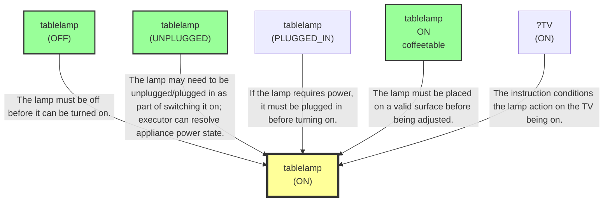

# 🚀 VirtualHome Agent Episode Log


### [GoalReasoner (Module A - Intent)] Output
```json
{
  "is_instruction_obviously_vague": true,
  "clarification_question": "What exact lamp state should I set it to?",
  "target_object": "table lamp",
  "location_hint": null,
  "reasoning_chain": [
    {
      "question": "Why does the user want this object?",
      "answer": "To change the lamp's setting based on the TV being on."
    },
    {
      "question": "Why is that important?",
      "answer": "Because the current lighting may need adjustment relative to the TV condition."
    },
    {
      "question": "What fundamental need does this fulfill?",
      "answer": "To achieve suitable room lighting."
    },
    {
      "question": "Are there any deeper psychological or physical motivations?",
      "answer": "Likely to improve visual comfort or maintain an appropriate lighting environment while the TV is on."
    }
  ],
  "deep_intent": "To adjust room lighting to a suitable state.",
  "acceptable_alternatives_properties": [
    {
      "priority": 1,
      "description": "Other indoor light sources that can be set to a similar brightness or state, such as a floor lamp or ceiling light."
    },
    {
      "priority": 2,
      "description": "Nearby lamps or lighting fixtures that provide comparable room illumination."
    },
    {
      "priority": 3,
      "description": "Dimmable indoor lighting options that can be set to a comfortable level."
    },
    {
      "priority": 4,
      "description": "Any available light source that helps achieve visual comfort in the room."
    }
  ]
}
```

### [RoboStateMultiTaskController] Output
```json
{
  "action": "[ask] What exact lamp state should I set it to?",
  "active_task_id": "task_1",
  "task_context": {
    "active_task_id": "task_1",
    "pending_task_ids": [],
    "satisfied_task_ids": []
  },
  "source": "goal_reasoner_clarification"
}
```
## Step 0
- **Action**: `[ask] What exact lamp state should I set it to?`
- **Action Success**: `True`
- **Action Message**: Turn it on.
- **Active Task**: `task_1`
- **Decision Source**: `goal_reasoner_clarification`
- **Task Progress**: T5_G2_06_B1=pending
- **SDG Status**:
No SDG active.
- **Observed Items (74)**: floor(74), floor(75), floor(76), floor(77), floor(78), floor(79), floor(80), floor(81), floor(82), wall(83), wall(84), wall(85), wall(86), wall(87), wall(88)...


### [GoalReasoner (Module A - Intent)] Output
```json
{
  "is_instruction_obviously_vague": true,
  "clarification_question": "What exact setting should the table lamp be adjusted to?",
  "target_object": "table lamp",
  "location_hint": null,
  "reasoning_chain": [
    {
      "question": "Why does the user want this object?",
      "answer": "To provide light in the room when the TV is on."
    },
    {
      "question": "Why is that important?",
      "answer": "To make the viewing environment more comfortable and visible."
    },
    {
      "question": "What fundamental need does this fulfill?",
      "answer": "It fulfills the need to illuminate the space."
    },
    {
      "question": "Are there any deeper psychological or physical motivations?",
      "answer": "The user likely wants improved visual comfort and a more suitable ambient lighting level."
    }
  ],
  "deep_intent": "The user wants to illuminate the room at a suitable brightness level.",
  "acceptable_alternatives_properties": [
    {
      "priority": 1,
      "description": "Other indoor light sources that can provide a similar ambient lighting level, such as a floor lamp or desk lamp"
    },
    {
      "priority": 2,
      "description": "Any nearby adjustable household lamp that can be turned on and set to a similar brightness"
    },
    {
      "priority": 3,
      "description": "Other room lighting fixtures that can improve visibility, such as ceiling lights or wall lights"
    },
    {
      "priority": 4,
      "description": "A portable light source like a flashlight or reading light if fixed lamps are unavailable"
    }
  ]
}
```

### [PerceptionFilter] Output
```json
{
  "reasoning": "The goal is to adjust the table lamp for room lighting, so the target object must be kept. The SDG also requires the lamp’s placement surface, the coffee table. Since the user wants ambient illumination and acceptable alternatives include other room light sources, I must retain the other applicable lighting fixtures and controls that could fulfill the same function: ceiling lamp, candle, and lightswitch. The TV state is referenced in the SDG, so TV-related visible class is not present, but no extra non-lighting objects are needed.",
  "selected_classes": [
    "ceilinglamp",
    "lightswitch",
    "character",
    "floor",
    "wall",
    "candle",
    "ceiling",
    "coffeetable",
    "desk",
    "tablelamp"
  ],
  "raw_class_count": 33
}
```

### [LLMExecutor] Output
```json
{
  "reasoning": "The active goal is to turn the table lamp on. The current graph shows two candidate table lamps, both OFF and both with HAS_SWITCH and HAS_PLUG. Since the instruction is to illuminate the room and the task is about the table lamp specifically, I bind ?TV only as a prerequisite state check in the SDG, but the graph does not explicitly show the TV. However, the lamp itself is present and OFF. To progress toward N1, the lamp must be reached before any interaction. The best next step is to walk to one of the table lamps; I choose tablelamp(102) as a valid instance matching the required properties.",
  "satisfied_nodes": [
    "N2",
    "N4",
    "N5"
  ],
  "current_node_focus": "N1",
  "mapped_variables": {
    "?TV": "lightswitch(173)"
  },
  "action": "[walk] <tablelamp> (102)"
}
```

### [RoboStateMultiTaskController] Output
```json
{
  "action": "[walk] <tablelamp> (102)",
  "active_task_id": "task_1",
  "task_context": {
    "active_task_id": "task_1",
    "pending_task_ids": [],
    "satisfied_task_ids": []
  },
  "source": "llm_executor"
}
```
## Step 1
- **Action**: `[walk] <tablelamp> (102)`
- **Action Success**: `True`
- **Action Message**: {'0': {'message': 'Success'}}
- **Active Task**: `task_1`
- **Decision Source**: `llm_executor`
- **Task Progress**: T5_G2_06_B1=pending
- **SDG Status**:

- **Observed Items (38)**: floor(74), floor(75), floor(76), floor(77), floor(78), floor(79), floor(80), floor(81), floor(82), wall(83), wall(84), wall(85), wall(86), wall(87), wall(88)...


### [PerceptionFilter] Output
```json
{
  "reasoning": "Reused cached class selection.",
  "selected_classes": [
    "ceilinglamp",
    "lightswitch",
    "character",
    "floor",
    "wall",
    "candle",
    "ceiling",
    "coffeetable",
    "desk",
    "tablelamp"
  ],
  "raw_class_count": 33
}
```

### [LLMExecutor] Output
```json
{
  "reasoning": "The task has been clarified previously: the table lamp should be turned on. The current graph shows tablelamp(102) is OFF, has a switch and plug, and I am already CLOSE to it. The next required step toward satisfying N1 is to switch it on. The TV condition is not represented in the graph, so I proceed with the lamp action autonomously.",
  "satisfied_nodes": [
    "N2",
    "N4",
    "N5"
  ],
  "current_node_focus": "N1",
  "mapped_variables": {},
  "action": "[switchon] <tablelamp> (102)"
}
```

### [RoboStateMultiTaskController] Output
```json
{
  "action": "[switchon] <tablelamp> (102)",
  "active_task_id": "task_1",
  "task_context": {
    "active_task_id": "task_1",
    "pending_task_ids": [],
    "satisfied_task_ids": []
  },
  "source": "llm_executor"
}
```
## Step 2
- **Action**: `[switchon] <tablelamp> (102)`
- **Action Success**: `True`
- **Action Message**: Faked switch operation in Python layer (bypassed Unity failure)
- **Active Task**: `task_1`
- **Decision Source**: `llm_executor`
- **Task Progress**: T5_G2_06_B1=done
- **SDG Status**:

- **Observed Items (38)**: floor(74), floor(75), floor(76), floor(77), floor(78), floor(79), floor(80), floor(81), floor(82), wall(83), wall(84), wall(85), wall(86), wall(87), wall(88)...

