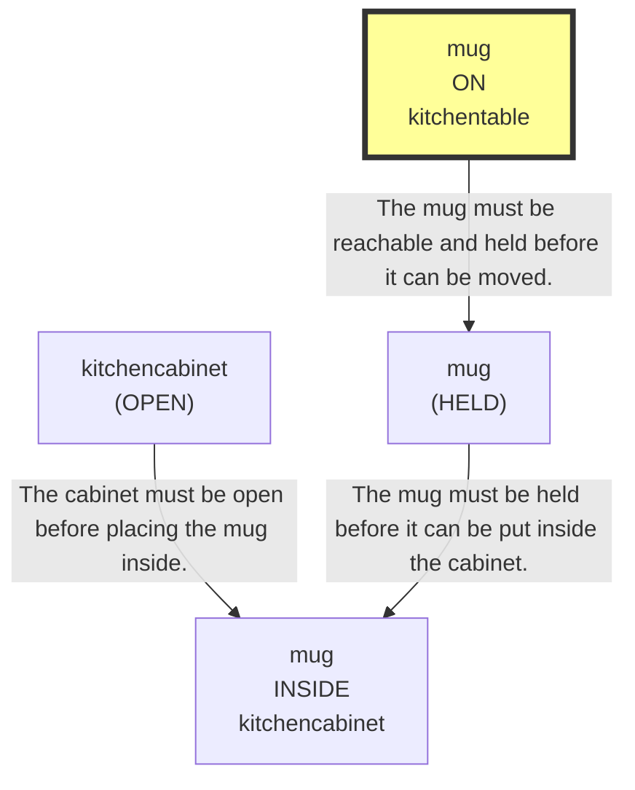
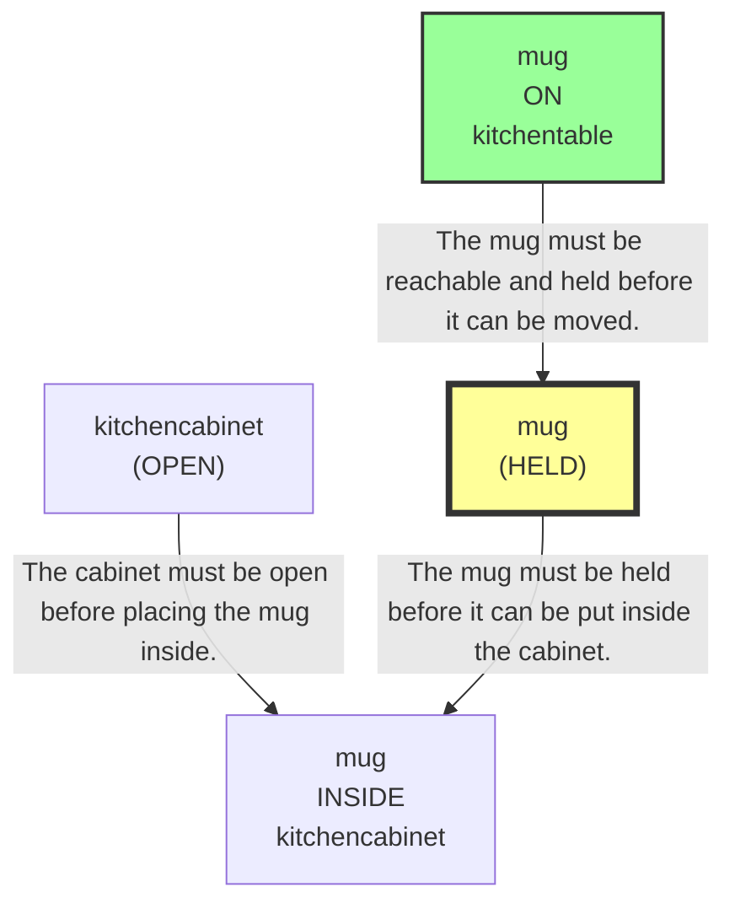
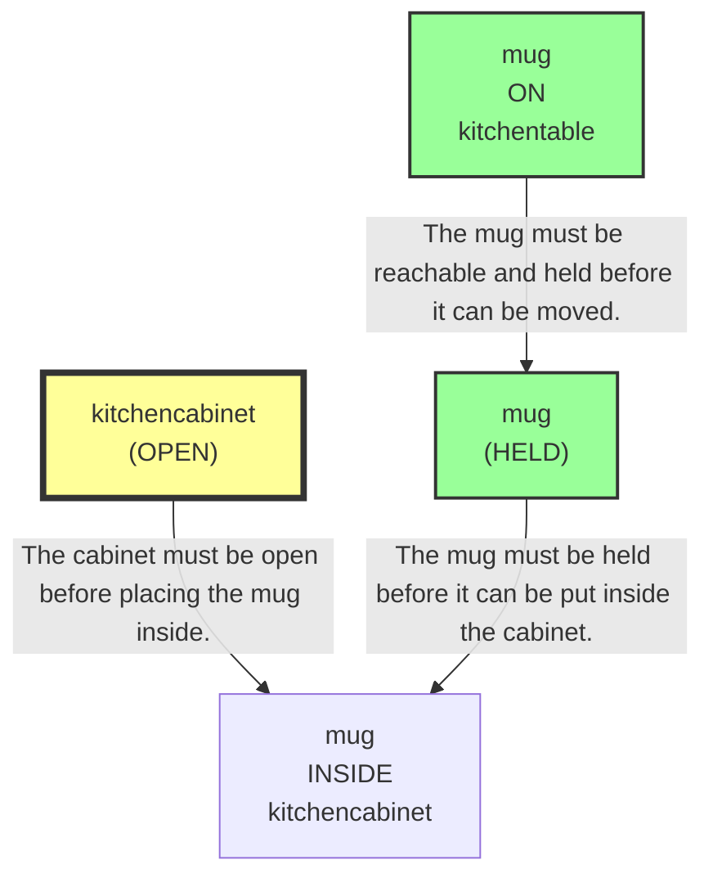
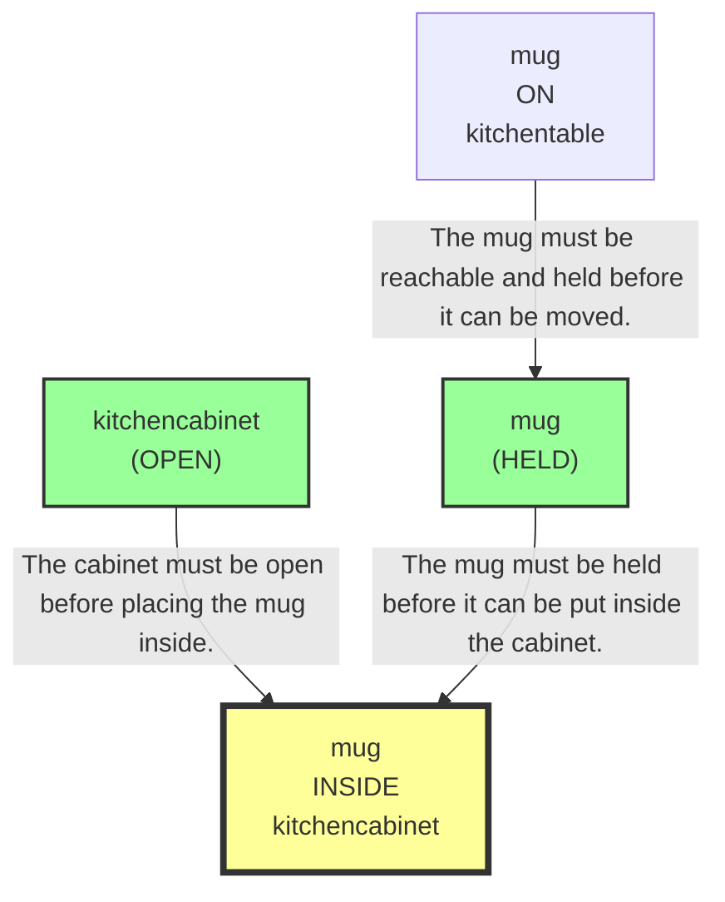

# 🚀 VirtualHome Agent Episode Log


### [GoalReasoner (Module A - Intent)] Output
```json
{
  "is_instruction_obviously_vague": true,
  "clarification_question": "Where should I put the mug?",
  "target_object": "mug",
  "location_hint": "table",
  "reasoning_chain": [
    {
      "question": "Why does the user want this object?",
      "answer": "To relocate the mug from the table."
    },
    {
      "question": "Why is that important?",
      "answer": "To place it in its intended destination."
    },
    {
      "question": "What fundamental need does this fulfill?",
      "answer": "The user wants the object stored or organized in a specific place."
    },
    {
      "question": "Are there any deeper psychological or physical motivations?",
      "answer": "Likely to reduce clutter or keep the environment tidy, but the exact destination is not specified."
    }
  ],
  "deep_intent": "The user wants an item moved to its designated storage or resting place.",
  "acceptable_alternatives_properties": [
    {
      "priority": 1,
      "description": "Other drinkware or small kitchen items that can be put into the same designated storage place if the mug is unavailable."
    },
    {
      "priority": 2,
      "description": "Similar household items that belong in the same storage area, such as cups, glasses, or small dishes."
    },
    {
      "priority": 3,
      "description": "Common tabletop items that can be organized or returned to storage in the same room."
    },
    {
      "priority": 4,
      "description": "Other small household objects that can be tidied away into an appropriate container or shelf once the destination is clarified."
    }
  ]
}
```

### [RoboStateMultiTaskController] Output
```json
{
  "action": "[ask] Where should I put the mug?",
  "active_task_id": "task_1",
  "task_context": {
    "active_task_id": "task_1",
    "pending_task_ids": [],
    "satisfied_task_ids": []
  },
  "source": "goal_reasoner_clarification"
}
```
## Step 0
- **Action**: `[ask] Where should I put the mug?`
- **Action Success**: `True`
- **Action Message**: Inside a kitchen cabinet.
- **Active Task**: `task_1`
- **Decision Source**: `goal_reasoner_clarification`
- **Task Progress**: T5_G2_07_B1=pending
- **SDG Status**:
No SDG active.
- **Observed Items (113)**: floor(206), floor(207), floor(208), floor(209), floor(210), floor(211), wall(212), wall(213), wall(214), wall(215), wall(216), wall(217), ceiling(218), ceiling(219), ceiling(220)...


### [GoalReasoner (Module A - Intent)] Output
```json
{
  "is_instruction_obviously_vague": true,
  "clarification_question": "Which kitchen cabinet should I put the mug inside?",
  "target_object": "mug",
  "location_hint": "table",
  "reasoning_chain": [
    {
      "question": "Why does the user want this object?",
      "answer": "To have the mug stored away from the table."
    },
    {
      "question": "Why is that important?",
      "answer": "To restore order by moving the mug to a storage location."
    },
    {
      "question": "What fundamental need does this fulfill?",
      "answer": "It fulfills the need to organize and clear the tabletop."
    },
    {
      "question": "Are there any deeper psychological or physical motivations?",
      "answer": "The user likely wants the space tidied and the mug placed in a proper storage location."
    }
  ],
  "deep_intent": "The user wants to organize and clear the tabletop by storing a mug in a designated cabinet.",
  "acceptable_alternatives_properties": [
    {
      "priority": 1,
      "description": "Other drinkware or small kitchen items that can be stored in the same cabinet, such as cups or glasses"
    },
    {
      "priority": 2,
      "description": "Similar kitchen storage items, such as bowls or small plates, if the exact mug cannot be placed there"
    },
    {
      "priority": 3,
      "description": "Other small household items suitable for cabinet storage and tabletop clearing"
    },
    {
      "priority": 4,
      "description": "Any item that helps keep the tabletop clear by being put away into indoor storage"
    }
  ]
}
```

### [PerceptionFilter] Output
```json
{
  "reasoning": "The goal is to move the mug from the kitchen table into a kitchen cabinet, so the required classes are the target object, the source location, the destination storage, and the tool/location needed to open and place it. No extra alternatives are needed beyond the exact cabinet and mug referenced by the SDG.",
  "selected_classes": [
    "character",
    "kitchencabinet",
    "mug",
    "plate",
    "door",
    "kitchentable"
  ],
  "raw_class_count": 55
}
```

### [LLMExecutor] Output
```json
{
  "reasoning": "The task is to store the mug in a kitchen cabinet. The mug is already on the kitchentable and can be grabbed. The cabinet options are all currently closed; I need to choose one autonomously since clarification is forbidden. I will target the closest/available cabinet instance and start by moving to the mug so it can be picked up, satisfying the reachability prerequisite for later cabinet storage.",
  "satisfied_nodes": [],
  "current_node_focus": "N1",
  "mapped_variables": {
    "?Container": "kitchencabinet(234)"
  },
  "action": "[walk] <mug> (194)"
}
```

### [RoboStateMultiTaskController] Output
```json
{
  "action": "[walk] <mug> (194)",
  "active_task_id": "task_1",
  "task_context": {
    "active_task_id": "task_1",
    "pending_task_ids": [],
    "satisfied_task_ids": []
  },
  "source": "llm_executor"
}
```
## Step 1
- **Action**: `[walk] <mug> (194)`
- **Action Success**: `True`
- **Action Message**: {'0': {'message': 'Success'}}
- **Active Task**: `task_1`
- **Decision Source**: `llm_executor`
- **Task Progress**: T5_G2_07_B1=pending
- **SDG Status**:

- **Observed Items (16)**: door(224) [OPEN], kitchentable(231), kitchencabinet(234) [CLOSED], kitchencabinet(235) [CLOSED], kitchencabinet(236) [CLOSED], kitchencabinet(237) [CLOSED], plate(273), plate(277), plate(278), plate(285), mug(194), character(1), bathroom(11), bedroom(73), kitchen(205)...


### [PerceptionFilter] Output
```json
{
  "reasoning": "Reused cached class selection.",
  "selected_classes": [
    "character",
    "kitchencabinet",
    "mug",
    "plate",
    "door",
    "kitchentable"
  ],
  "raw_class_count": 55
}
```

### [LLMExecutor] Output
```json
{
  "reasoning": "The mug is already reachable and the robot is close to it, satisfying N1's prerequisite toward holding it. The cabinet must eventually be opened before putting the mug inside, but the immediate next step in the SDG is to get the mug held first (N2). The mug is not held yet, so the best next atomic action is to grab it.",
  "satisfied_nodes": [
    "N1"
  ],
  "current_node_focus": "N2",
  "mapped_variables": {
    "?Container": "kitchencabinet(234)"
  },
  "action": "[grab] <mug> (194)"
}
```

### [RoboStateMultiTaskController] Output
```json
{
  "action": "[grab] <mug> (194)",
  "active_task_id": "task_1",
  "task_context": {
    "active_task_id": "task_1",
    "pending_task_ids": [],
    "satisfied_task_ids": []
  },
  "source": "llm_executor"
}
```
## Step 2
- **Action**: `[grab] <mug> (194)`
- **Action Success**: `True`
- **Action Message**: {'0': {'message': 'Success'}}
- **Active Task**: `task_1`
- **Decision Source**: `llm_executor`
- **Task Progress**: T5_G2_07_B1=pending
- **SDG Status**:

- **Observed Items (16)**: door(224) [OPEN], kitchentable(231), kitchencabinet(234) [CLOSED], kitchencabinet(235) [CLOSED], kitchencabinet(236) [CLOSED], kitchencabinet(237) [CLOSED], plate(273), plate(277), plate(278), plate(285), mug(194), character(1), bathroom(11), bedroom(73), kitchen(205)...


### [PerceptionFilter] Output
```json
{
  "reasoning": "Reused cached class selection.",
  "selected_classes": [
    "character",
    "kitchencabinet",
    "mug",
    "plate",
    "door",
    "kitchentable"
  ],
  "raw_class_count": 55
}
```

### [LLMExecutor] Output
```json
{
  "reasoning": "The mug is already held in the right hand, satisfying N2. The cabinet to use must be one of the available kitchen cabinets; since the instruction resolves to a kitchen cabinet and no further disambiguation is allowed, I should choose a cabinet and proceed. However, to put the mug inside, I must first be near the cabinet and the cabinet is currently CLOSED, so the next required step is to walk to a cabinet before opening it. I select kitchencabinet(234) as the target cabinet to begin satisfying the open-and-store sequence.",
  "satisfied_nodes": [
    "N1",
    "N2"
  ],
  "current_node_focus": "N3",
  "mapped_variables": {
    "?Container": "kitchencabinet(234)"
  },
  "action": "[walk] <kitchencabinet> (234)"
}
```

### [RoboStateMultiTaskController] Output
```json
{
  "action": "[walk] <kitchencabinet> (234)",
  "active_task_id": "task_1",
  "task_context": {
    "active_task_id": "task_1",
    "pending_task_ids": [],
    "satisfied_task_ids": []
  },
  "source": "llm_executor"
}
```
## Step 3
- **Action**: `[walk] <kitchencabinet> (234)`
- **Action Success**: `True`
- **Action Message**: {'0': {'message': 'Success'}}
- **Active Task**: `task_1`
- **Decision Source**: `llm_executor`
- **Task Progress**: T5_G2_07_B1=pending
- **SDG Status**:

- **Observed Items (16)**: door(224) [OPEN], kitchentable(231), kitchencabinet(234) [CLOSED], kitchencabinet(235) [CLOSED], kitchencabinet(236) [CLOSED], kitchencabinet(237) [CLOSED], plate(273), plate(277), plate(278), plate(285), mug(194), character(1), bathroom(11), bedroom(73), kitchen(205)...


### [PerceptionFilter] Output
```json
{
  "reasoning": "Reused cached class selection.",
  "selected_classes": [
    "character",
    "kitchencabinet",
    "mug",
    "plate",
    "door",
    "kitchentable"
  ],
  "raw_class_count": 55
}
```

### [LLMExecutor] Output
```json
{
  "reasoning": "The mug is already held in the right hand, satisfying N2. The next unmet prerequisite for placing it away is to open a kitchen cabinet. There are multiple closed cabinets visible; cabinets 234 and 235 are both close to the character, but 234 is already selected by proximity/previous alignment and is a valid openable storage container. Since we are already at the cabinet, the next atomic step is to open it before putting the mug inside.",
  "satisfied_nodes": [
    "N1",
    "N2"
  ],
  "current_node_focus": "N3",
  "mapped_variables": {
    "?Container": "kitchencabinet(234)"
  },
  "action": "[open] <kitchencabinet> (234)"
}
```

### [RoboStateMultiTaskController] Output
```json
{
  "action": "[open] <kitchencabinet> (234)",
  "active_task_id": "task_1",
  "task_context": {
    "active_task_id": "task_1",
    "pending_task_ids": [],
    "satisfied_task_ids": []
  },
  "source": "llm_executor"
}
```
## Step 4
- **Action**: `[open] <kitchencabinet> (234)`
- **Action Success**: `True`
- **Action Message**: {'0': {'message': 'Success'}}
- **Active Task**: `task_1`
- **Decision Source**: `llm_executor`
- **Task Progress**: T5_G2_07_B1=pending
- **SDG Status**:

- **Observed Items (16)**: door(224) [OPEN], kitchentable(231), kitchencabinet(234) [CLOSED], kitchencabinet(235) [CLOSED], kitchencabinet(236) [CLOSED], kitchencabinet(237) [CLOSED], plate(273), plate(277), plate(278), plate(285), mug(194), character(1), bathroom(11), bedroom(73), kitchen(205)...


### [PerceptionFilter] Output
```json
{
  "reasoning": "Reused cached class selection.",
  "selected_classes": [
    "character",
    "kitchencabinet",
    "mug",
    "plate",
    "door",
    "kitchentable"
  ],
  "raw_class_count": 55
}
```

### [LLMExecutor] Output
```json
{
  "reasoning": "The mug is already held (N2 satisfied), and the chosen kitchen cabinet is open (N3 satisfied). The remaining goal is to place the held mug into the open cabinet. I am already close to cabinet 234 per the graph, so the next atomic step is to put the mug inside it.",
  "satisfied_nodes": [
    "N2",
    "N3"
  ],
  "current_node_focus": "N4",
  "mapped_variables": {
    "?Container": "kitchencabinet(234)"
  },
  "action": "[putin] <mug> (194) <kitchencabinet> (234)"
}
```

### [RoboStateMultiTaskController] Output
```json
{
  "action": "[putin] <mug> (194) <kitchencabinet> (234)",
  "active_task_id": "task_1",
  "task_context": {
    "active_task_id": "task_1",
    "pending_task_ids": [],
    "satisfied_task_ids": []
  },
  "source": "llm_executor"
}
```
## Step 5
- **Action**: `[putin] <mug> (194) <kitchencabinet> (234)`
- **Action Success**: `True`
- **Action Message**: {'0': {'message': 'Success'}}
- **Active Task**: `task_1`
- **Decision Source**: `llm_executor`
- **Task Progress**: T5_G2_07_B1=done
- **SDG Status**:

- **Observed Items (16)**: door(224) [OPEN], kitchentable(231), kitchencabinet(234) [OPEN], kitchencabinet(235) [CLOSED], kitchencabinet(236) [CLOSED], kitchencabinet(237) [CLOSED], plate(273), plate(277), plate(278), plate(285), mug(194), character(1), bathroom(11), bedroom(73), kitchen(205)...

