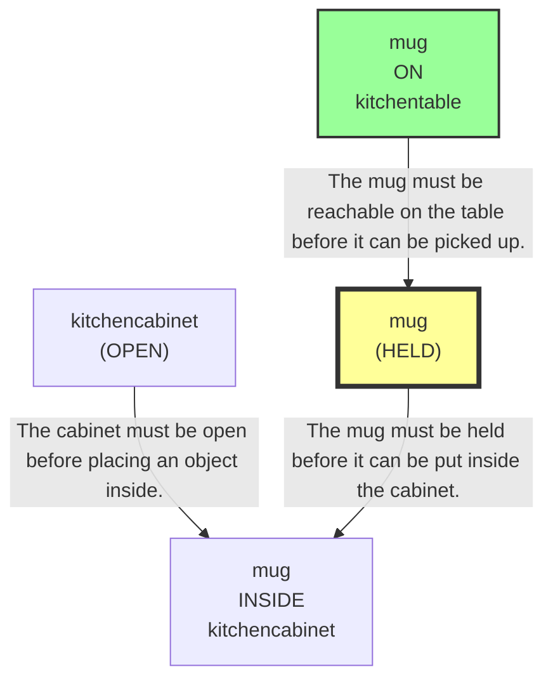
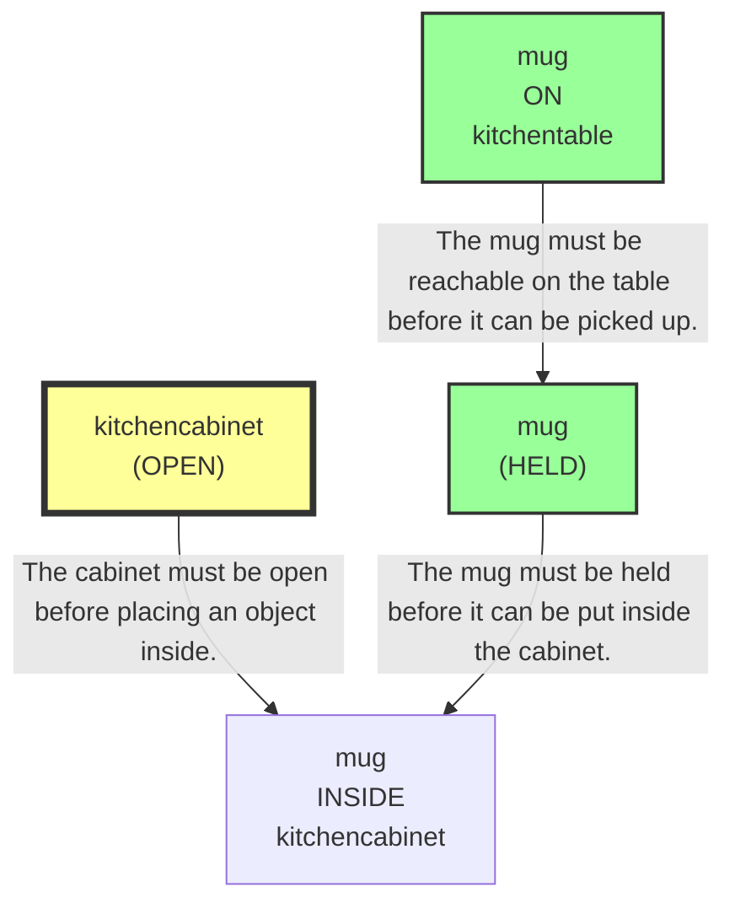
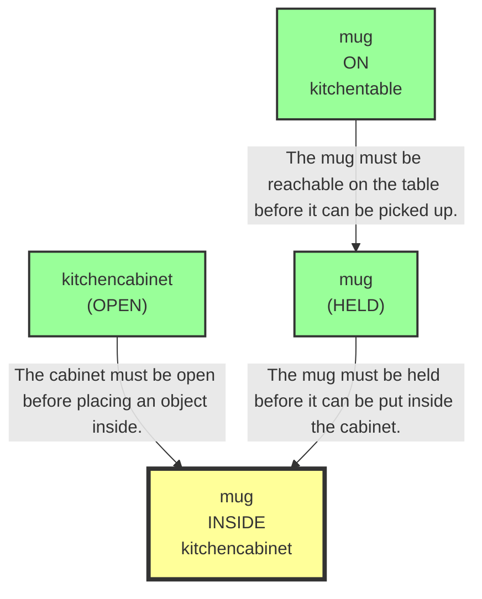

# 🚀 VirtualHome Agent Episode Log


### [GoalReasoner (Module A - Intent)] Output
```json
{
  "is_instruction_obviously_vague": true,
  "clarification_question": "Where exactly should I put the mug?",
  "target_object": "mug",
  "location_hint": "table",
  "reasoning_chain": [
    {
      "question": "Why does the user want this object?",
      "answer": "To have the mug moved from the table to its intended place."
    },
    {
      "question": "Why is that important?",
      "answer": "Because the mug should not remain on the table in its current location."
    },
    {
      "question": "What fundamental need does this fulfill?",
      "answer": "It fulfills the need to relocate an object to a specific destination."
    },
    {
      "question": "Are there any deeper psychological or physical motivations?",
      "answer": "The user likely wants the space organized or the mug returned to its proper storage or use location, but the exact destination is not specified."
    }
  ],
  "deep_intent": "Relocate an object to its correct destination",
  "acceptable_alternatives_properties": [
    {
      "priority": 1,
      "description": "Other small household drinkware items that can be moved to their designated place"
    },
    {
      "priority": 2,
      "description": "Similar tabletop items that belong in a kitchen cabinet, sink, or drying area"
    },
    {
      "priority": 3,
      "description": "Loose household objects that need to be put away in an assigned storage spot"
    },
    {
      "priority": 4,
      "description": "Any small portable item that can be organized or returned to a proper location"
    }
  ]
}
```

### [RoboStateMultiTaskController] Output
```json
{
  "action": "[ask] Where exactly should I put the mug?",
  "active_task_id": "task_1",
  "task_context": {
    "active_task_id": "task_1",
    "pending_task_ids": [],
    "satisfied_task_ids": []
  },
  "source": "goal_reasoner_clarification"
}
```
## Step 0
- **Action**: `[ask] Where exactly should I put the mug?`
- **Action Success**: `True`
- **Action Message**: Inside a kitchen cabinet.
- **Active Task**: `task_1`
- **Decision Source**: `goal_reasoner_clarification`
- **Task Progress**: T5_G2_07_B2=pending
- **SDG Status**:
No SDG active.
- **Observed Items (113)**: floor(206), floor(207), floor(208), floor(209), floor(210), floor(211), wall(212), wall(213), wall(214), wall(215), wall(216), wall(217), ceiling(218), ceiling(219), ceiling(220)...


### [GoalReasoner (Module A - Intent)] Output
```json
{
  "is_instruction_obviously_vague": false,
  "clarification_question": null,
  "target_object": "mug",
  "location_hint": "table",
  "reasoning_chain": [
    {
      "question": "Why does the user want this object?",
      "answer": "To relocate the mug from the table to a kitchen cabinet."
    },
    {
      "question": "Why is that important?",
      "answer": "To clear the mug from the table and place it in storage."
    },
    {
      "question": "What fundamental need does this fulfill?",
      "answer": "The user wants the mug organized and stored in an indoor kitchen location."
    },
    {
      "question": "Are there any deeper psychological or physical motivations?",
      "answer": "Likely to tidy the space, reduce clutter, and keep the mug accessible in the kitchen."
    }
  ],
  "deep_intent": "The user wants to organize and store an item in a kitchen cabinet.",
  "acceptable_alternatives_properties": [
    {
      "priority": 1,
      "description": "Other small kitchen drinkware or similar items that can be stored in a cabinet, such as a cup or glass."
    },
    {
      "priority": 2,
      "description": "Other household items typically kept in kitchen cabinets, such as bowls or plates."
    },
    {
      "priority": 3,
      "description": "Comparable lightweight kitchenware that serves storage and organization purposes."
    },
    {
      "priority": 4,
      "description": "Other small indoor items that can be put away to reduce clutter, though these are less direct substitutes."
    }
  ]
}
```

### [PerceptionFilter] Output
```json
{
  "reasoning": "The goal is to move the mug from the kitchen table into the kitchen cabinet. The SDG explicitly requires the mug, the kitchentable as its current location, and the kitchencabinet as the destination. The cabinet must be open, so that state is needed conceptually but not as an object class. No extra tools are required for simply picking up and storing the mug.",
  "selected_classes": [
    "character",
    "kitchencabinet",
    "mug",
    "plate",
    "door",
    "kitchentable"
  ],
  "raw_class_count": 55
}
```

### [LLMExecutor] Output
```json
{
  "reasoning": "The mug is already on the kitchentable and matches N1. The next unmet prerequisite is to reach the mug so it can be grabbed; the cabinet is currently closed, so opening it will come after holding the mug and moving to the cabinet. I will first walk to the mug on the table.",
  "satisfied_nodes": [
    "N1"
  ],
  "current_node_focus": "N4",
  "mapped_variables": {
    "?Container": "kitchencabinet(234)"
  },
  "action": "[walk] <mug> (194)"
}
```

### [RoboStateMultiTaskController] Output
```json
{
  "action": "[walk] <mug> (194)",
  "active_task_id": "task_1",
  "task_context": {
    "active_task_id": "task_1",
    "pending_task_ids": [],
    "satisfied_task_ids": []
  },
  "source": "llm_executor"
}
```
## Step 1
- **Action**: `[walk] <mug> (194)`
- **Action Success**: `True`
- **Action Message**: {'0': {'message': 'Success'}}
- **Active Task**: `task_1`
- **Decision Source**: `llm_executor`
- **Task Progress**: T5_G2_07_B2=pending
- **SDG Status**:

- **Observed Items (16)**: door(224) [OPEN], kitchentable(231), kitchencabinet(234) [CLOSED], kitchencabinet(235) [CLOSED], kitchencabinet(236) [CLOSED], kitchencabinet(237) [CLOSED], plate(273), plate(277), plate(278), plate(285), mug(194), character(1), bathroom(11), bedroom(73), kitchen(205)...


### [PerceptionFilter] Output
```json
{
  "reasoning": "Reused cached class selection.",
  "selected_classes": [
    "character",
    "kitchencabinet",
    "mug",
    "plate",
    "door",
    "kitchentable"
  ],
  "raw_class_count": 55
}
```

### [LLMExecutor] Output
```json
{
  "reasoning": "The mug is already reachable and the current graph shows mug(194) on the kitchentable and close to the character, satisfying N1 and the precondition for holding it. The cabinet target for storage is not yet open, but the next required step in the SDG progression is to pick up the mug so it can later be placed inside the cabinet.",
  "satisfied_nodes": [
    "N1"
  ],
  "current_node_focus": "N4",
  "mapped_variables": {
    "?Container": "kitchencabinet(234)"
  },
  "action": "[grab] <mug> (194)"
}
```

### [RoboStateMultiTaskController] Output
```json
{
  "action": "[grab] <mug> (194)",
  "active_task_id": "task_1",
  "task_context": {
    "active_task_id": "task_1",
    "pending_task_ids": [],
    "satisfied_task_ids": []
  },
  "source": "llm_executor"
}
```
## Step 2
- **Action**: `[grab] <mug> (194)`
- **Action Success**: `True`
- **Action Message**: {'0': {'message': 'Success'}}
- **Active Task**: `task_1`
- **Decision Source**: `llm_executor`
- **Task Progress**: T5_G2_07_B2=pending
- **SDG Status**:

- **Observed Items (16)**: door(224) [OPEN], kitchentable(231), kitchencabinet(234) [CLOSED], kitchencabinet(235) [CLOSED], kitchencabinet(236) [CLOSED], kitchencabinet(237) [CLOSED], plate(273), plate(277), plate(278), plate(285), mug(194), character(1), bathroom(11), bedroom(73), kitchen(205)...


### [PerceptionFilter] Output
```json
{
  "reasoning": "Reused cached class selection.",
  "selected_classes": [
    "character",
    "kitchencabinet",
    "mug",
    "plate",
    "door",
    "kitchentable"
  ],
  "raw_class_count": 55
}
```

### [LLMExecutor] Output
```json
{
  "reasoning": "The mug is already held, satisfying N4. The cabinet intended for storage is currently CLOSED, so the next required step toward putting the mug inside is to open a kitchencabinet. There are multiple cabinets; any one that is closed and in the kitchen can serve as the target container. I will open one now, starting with kitchencabinet(234).",
  "satisfied_nodes": [
    "N1",
    "N4"
  ],
  "current_node_focus": "N3",
  "mapped_variables": {
    "?Container": "kitchencabinet(234)"
  },
  "action": "[open] <kitchencabinet> (234)"
}
```

### [RoboStateMultiTaskController] Output
```json
{
  "action": "[walk] <kitchencabinet> (234)",
  "active_task_id": "task_1",
  "task_context": {
    "active_task_id": "task_1",
    "pending_task_ids": [],
    "satisfied_task_ids": []
  },
  "source": "llm_executor_repaired"
}
```
## Step 3
- **Action**: `[walk] <kitchencabinet> (234)`
- **Action Success**: `True`
- **Action Message**: {'0': {'message': 'Success'}}
- **Active Task**: `task_1`
- **Decision Source**: `llm_executor_repaired`
- **Task Progress**: T5_G2_07_B2=pending
- **SDG Status**:

- **Observed Items (16)**: door(224) [OPEN], kitchentable(231), kitchencabinet(234) [CLOSED], kitchencabinet(235) [CLOSED], kitchencabinet(236) [CLOSED], kitchencabinet(237) [CLOSED], plate(273), plate(277), plate(278), plate(285), mug(194), character(1), bathroom(11), bedroom(73), kitchen(205)...


### [PerceptionFilter] Output
```json
{
  "reasoning": "Reused cached class selection.",
  "selected_classes": [
    "character",
    "kitchencabinet",
    "mug",
    "plate",
    "door",
    "kitchentable"
  ],
  "raw_class_count": 55
}
```

### [LLMExecutor] Output
```json
{
  "reasoning": "The mug is already held, satisfying N4. The destination should be one of the kitchen cabinets, and the nearest cabinet the character is close to is kitchencabinet(234), but it is currently CLOSED, so N3 is not satisfied yet. Since putting the mug inside requires the cabinet to be open and we are already near it, the next atomic step is to open that cabinet.",
  "satisfied_nodes": [
    "N1",
    "N4"
  ],
  "current_node_focus": "N3",
  "mapped_variables": {
    "?Container": "kitchencabinet(234)"
  },
  "action": "[open] <kitchencabinet> (234)"
}
```

### [RoboStateMultiTaskController] Output
```json
{
  "action": "[open] <kitchencabinet> (234)",
  "active_task_id": "task_1",
  "task_context": {
    "active_task_id": "task_1",
    "pending_task_ids": [],
    "satisfied_task_ids": []
  },
  "source": "llm_executor"
}
```
## Step 4
- **Action**: `[open] <kitchencabinet> (234)`
- **Action Success**: `True`
- **Action Message**: {'0': {'message': 'Success'}}
- **Active Task**: `task_1`
- **Decision Source**: `llm_executor`
- **Task Progress**: T5_G2_07_B2=pending
- **SDG Status**:

- **Observed Items (16)**: door(224) [OPEN], kitchentable(231), kitchencabinet(234) [CLOSED], kitchencabinet(235) [CLOSED], kitchencabinet(236) [CLOSED], kitchencabinet(237) [CLOSED], plate(273), plate(277), plate(278), plate(285), mug(194), character(1), bathroom(11), bedroom(73), kitchen(205)...


### [PerceptionFilter] Output
```json
{
  "reasoning": "Reused cached class selection.",
  "selected_classes": [
    "character",
    "kitchencabinet",
    "mug",
    "plate",
    "door",
    "kitchentable"
  ],
  "raw_class_count": 55
}
```

### [LLMExecutor] Output
```json
{
  "reasoning": "The mug is already held in the right hand, and the target kitchen cabinet is open. The next required step toward placing the mug inside the cabinet is to move it into the cabinet. Since putin requires being near the destination and I am already close per the graph, the correct next atomic action is to put the held mug into the open cabinet.",
  "satisfied_nodes": [
    "N1",
    "N3",
    "N4"
  ],
  "current_node_focus": "N2",
  "mapped_variables": {
    "?Container": "kitchencabinet(234)"
  },
  "action": "[putin] <mug> (194) <kitchencabinet> (234)"
}
```

### [RoboStateMultiTaskController] Output
```json
{
  "action": "[putin] <mug> (194) <kitchencabinet> (234)",
  "active_task_id": "task_1",
  "task_context": {
    "active_task_id": "task_1",
    "pending_task_ids": [],
    "satisfied_task_ids": []
  },
  "source": "llm_executor"
}
```
## Step 5
- **Action**: `[putin] <mug> (194) <kitchencabinet> (234)`
- **Action Success**: `True`
- **Action Message**: {'0': {'message': 'Success'}}
- **Active Task**: `task_1`
- **Decision Source**: `llm_executor`
- **Task Progress**: T5_G2_07_B2=done
- **SDG Status**:

- **Observed Items (16)**: door(224) [OPEN], kitchentable(231), kitchencabinet(234) [OPEN], kitchencabinet(235) [CLOSED], kitchencabinet(236) [CLOSED], kitchencabinet(237) [CLOSED], plate(273), plate(277), plate(278), plate(285), mug(194), character(1), bathroom(11), bedroom(73), kitchen(205)...

