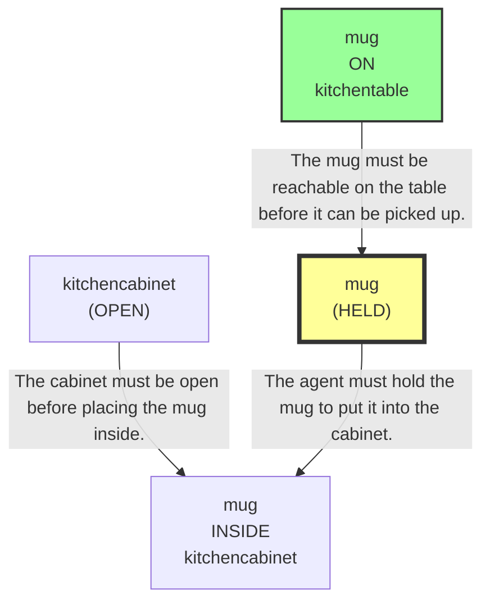
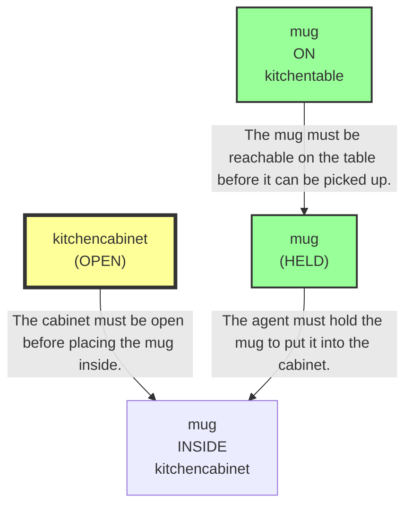
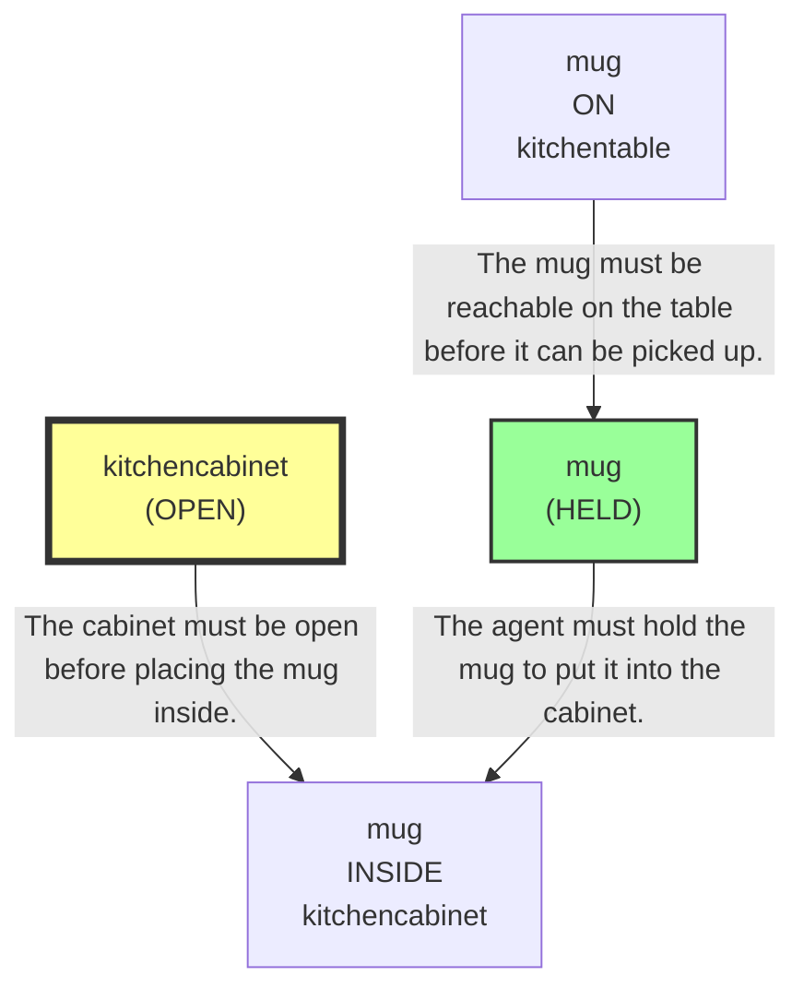
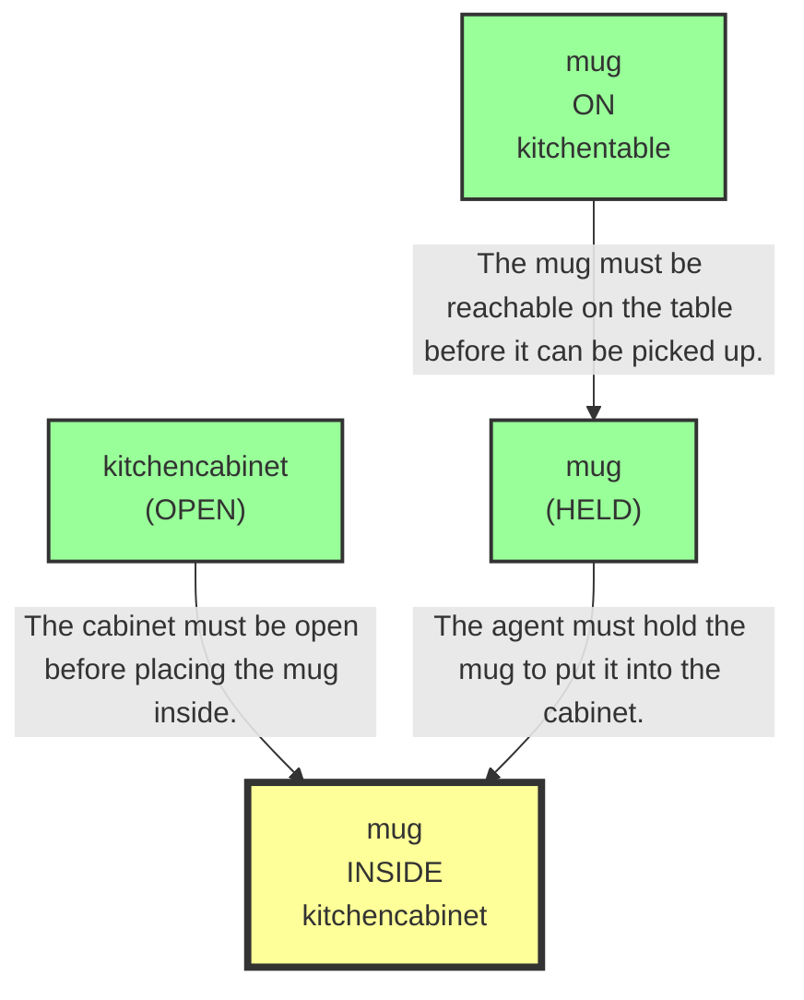

# 🚀 VirtualHome Agent Episode Log


### [GoalReasoner (Module A - Intent)] Output
```json
{
  "is_instruction_obviously_vague": true,
  "clarification_question": "Where should I put the mug?",
  "target_object": "mug",
  "location_hint": "the table",
  "reasoning_chain": [
    {
      "question": "Why does the user want this object?",
      "answer": "To relocate the mug from the table."
    },
    {
      "question": "Why is that important?",
      "answer": "Because the mug should be placed in its intended destination."
    },
    {
      "question": "What fundamental need does this fulfill?",
      "answer": "It fulfills the need to organize or tidy the environment by returning an item to the correct place."
    },
    {
      "question": "Are there any deeper psychological or physical motivations?",
      "answer": "The user likely wants a clutter-free space and proper item placement."
    }
  ],
  "deep_intent": "The user wants to organize an item by returning it to its correct place.",
  "acceptable_alternatives_properties": [
    {
      "priority": 1,
      "description": "The item's usual storage location or a nearby designated container or surface for mugs"
    },
    {
      "priority": 2,
      "description": "Other cup-like drink containers that belong in the same storage area"
    },
    {
      "priority": 3,
      "description": "Related kitchenware items that can be tidied into their proper storage area"
    },
    {
      "priority": 4,
      "description": "Other household items that can be returned to their designated place to reduce clutter"
    }
  ]
}
```

### [RoboStateMultiTaskController] Output
```json
{
  "action": "[ask] Where should I put the mug?",
  "active_task_id": "task_1",
  "task_context": {
    "active_task_id": "task_1",
    "pending_task_ids": [],
    "satisfied_task_ids": []
  },
  "source": "goal_reasoner_clarification"
}
```
## Step 0
- **Action**: `[ask] Where should I put the mug?`
- **Action Success**: `True`
- **Action Message**: Inside a kitchen cabinet.
- **Active Task**: `task_1`
- **Decision Source**: `goal_reasoner_clarification`
- **Task Progress**: T5_G2_07_B3=pending
- **SDG Status**:
No SDG active.
- **Observed Items (113)**: floor(206), floor(207), floor(208), floor(209), floor(210), floor(211), wall(212), wall(213), wall(214), wall(215), wall(216), wall(217), ceiling(218), ceiling(219), ceiling(220)...


### [GoalReasoner (Module A - Intent)] Output
```json
{
  "is_instruction_obviously_vague": false,
  "clarification_question": null,
  "target_object": "mug",
  "location_hint": "table",
  "reasoning_chain": [
    {
      "question": "Why does the user want this object?",
      "answer": "To move the mug from the table into a kitchen cabinet."
    },
    {
      "question": "Why is that important?",
      "answer": "Likely to clear the table or store the mug away in a designated storage area."
    },
    {
      "question": "What fundamental need does this fulfill?",
      "answer": "It supports organization and tidying by putting an item into storage."
    },
    {
      "question": "Are there any deeper psychological or physical motivations?",
      "answer": "The user may want a less cluttered surface, easier access to the mug later, or a more orderly kitchen environment."
    }
  ],
  "deep_intent": "The user wants to organize and store an item away in a kitchen storage area.",
  "acceptable_alternatives_properties": [
    {
      "priority": 1,
      "description": "Other similar drinkware items that can be stored in a kitchen cabinet, such as cups, glasses, or tumblers."
    },
    {
      "priority": 2,
      "description": "Other small kitchen items typically kept in cabinets, such as bowls or plates."
    },
    {
      "priority": 3,
      "description": "Other household items that can be neatly put away in enclosed storage, such as containers or utensils."
    },
    {
      "priority": 4,
      "description": "Any similar item that helps reduce clutter by being placed into indoor storage rather than left on the table."
    }
  ]
}
```

### [PerceptionFilter] Output
```json
{
  "reasoning": "The goal is to move the target mug from the kitchentable into the kitchencabinet, so we must keep the target object, its source location, its destination storage, and the implied tools/appliances needed to complete the placement if needed. Since the SDG requires the cabinet to be open, the cabinet must be included.",
  "selected_classes": [
    "character",
    "kitchencabinet",
    "mug",
    "plate",
    "door",
    "kitchentable"
  ],
  "raw_class_count": 55
}
```

### [LLMExecutor] Output
```json
{
  "reasoning": "The mug is already on the kitchentable and reachable. To satisfy the SDG, the next prerequisite is to hold the mug before opening the cabinet and placing it inside. The current graph shows mug(194) as the matching reachable mug, and it is not dirty or otherwise constrained.",
  "satisfied_nodes": [
    "N1"
  ],
  "current_node_focus": "N2",
  "mapped_variables": {
    "?Mug": "mug(194)",
    "?Container": "kitchencabinet(234)"
  },
  "action": "[grab] <mug> (194)"
}
```

### [RoboStateMultiTaskController] Output
```json
{
  "action": "[walk] <mug> (194)",
  "active_task_id": "task_1",
  "task_context": {
    "active_task_id": "task_1",
    "pending_task_ids": [],
    "satisfied_task_ids": []
  },
  "source": "llm_executor_repaired"
}
```
## Step 1
- **Action**: `[walk] <mug> (194)`
- **Action Success**: `True`
- **Action Message**: {'0': {'message': 'Success'}}
- **Active Task**: `task_1`
- **Decision Source**: `llm_executor_repaired`
- **Task Progress**: T5_G2_07_B3=pending
- **SDG Status**:

- **Observed Items (16)**: door(224) [OPEN], kitchentable(231), kitchencabinet(234) [CLOSED], kitchencabinet(235) [CLOSED], kitchencabinet(236) [CLOSED], kitchencabinet(237) [CLOSED], plate(273), plate(277), plate(278), plate(285), mug(194), character(1), bathroom(11), bedroom(73), kitchen(205)...


### [PerceptionFilter] Output
```json
{
  "reasoning": "Reused cached class selection.",
  "selected_classes": [
    "character",
    "kitchencabinet",
    "mug",
    "plate",
    "door",
    "kitchentable"
  ],
  "raw_class_count": 55
}
```

### [LLMExecutor] Output
```json
{
  "reasoning": "The mug is already on the kitchentable and close to the character, so the next prerequisite for the SDG is to pick it up. The cabinet is still closed, but opening it should happen after holding the mug, since the next step toward placing it inside requires the mug to be held. I will satisfy N2 by grabbing the mug now.",
  "satisfied_nodes": [
    "N1"
  ],
  "current_node_focus": "N2",
  "mapped_variables": {},
  "action": "[grab] <mug> (194)"
}
```

### [RoboStateMultiTaskController] Output
```json
{
  "action": "[grab] <mug> (194)",
  "active_task_id": "task_1",
  "task_context": {
    "active_task_id": "task_1",
    "pending_task_ids": [],
    "satisfied_task_ids": []
  },
  "source": "llm_executor"
}
```
## Step 2
- **Action**: `[grab] <mug> (194)`
- **Action Success**: `True`
- **Action Message**: {'0': {'message': 'Success'}}
- **Active Task**: `task_1`
- **Decision Source**: `llm_executor`
- **Task Progress**: T5_G2_07_B3=pending
- **SDG Status**:

- **Observed Items (16)**: door(224) [OPEN], kitchentable(231), kitchencabinet(234) [CLOSED], kitchencabinet(235) [CLOSED], kitchencabinet(236) [CLOSED], kitchencabinet(237) [CLOSED], plate(273), plate(277), plate(278), plate(285), mug(194), character(1), bathroom(11), bedroom(73), kitchen(205)...


### [PerceptionFilter] Output
```json
{
  "reasoning": "Reused cached class selection.",
  "selected_classes": [
    "character",
    "kitchencabinet",
    "mug",
    "plate",
    "door",
    "kitchentable"
  ],
  "raw_class_count": 55
}
```

### [LLMExecutor] Output
```json
{
  "reasoning": "The mug is already held, so N1 and N2 are satisfied. The cabinet that matches the goal is a kitchen cabinet; among the observed cabinets, any could work, but the closest task-relevant openable container is kitchencabinet(234), which is currently closed. To satisfy the final INSIDE relation, I must first open the cabinet before I can put the mug inside it.",
  "satisfied_nodes": [
    "N1",
    "N2"
  ],
  "current_node_focus": "N4",
  "mapped_variables": {
    "?Cabinet": "kitchencabinet(234)"
  },
  "action": "[open] <kitchencabinet> (234)"
}
```

### [RoboStateMultiTaskController] Output
```json
{
  "action": "[walk] <kitchencabinet> (234)",
  "active_task_id": "task_1",
  "task_context": {
    "active_task_id": "task_1",
    "pending_task_ids": [],
    "satisfied_task_ids": []
  },
  "source": "llm_executor_repaired"
}
```
## Step 3
- **Action**: `[walk] <kitchencabinet> (234)`
- **Action Success**: `True`
- **Action Message**: {'0': {'message': 'Success'}}
- **Active Task**: `task_1`
- **Decision Source**: `llm_executor_repaired`
- **Task Progress**: T5_G2_07_B3=pending
- **SDG Status**:

- **Observed Items (16)**: door(224) [OPEN], kitchentable(231), kitchencabinet(234) [CLOSED], kitchencabinet(235) [CLOSED], kitchencabinet(236) [CLOSED], kitchencabinet(237) [CLOSED], plate(273), plate(277), plate(278), plate(285), mug(194), character(1), bathroom(11), bedroom(73), kitchen(205)...


### [PerceptionFilter] Output
```json
{
  "reasoning": "Reused cached class selection.",
  "selected_classes": [
    "character",
    "kitchencabinet",
    "mug",
    "plate",
    "door",
    "kitchentable"
  ],
  "raw_class_count": 55
}
```

### [LLMExecutor] Output
```json
{
  "reasoning": "The mug is already held, satisfying N2. The current focus is to open the target kitchencabinet before placing the mug inside. The graph shows kitchencabinet(234) is the closest cabinet and is closed, and we are already close to it, so the next atomic action is to open it.",
  "satisfied_nodes": [
    "N2"
  ],
  "current_node_focus": "N4",
  "mapped_variables": {
    "?Container": "kitchencabinet(234)"
  },
  "action": "[open] <kitchencabinet> (234)"
}
```

### [RoboStateMultiTaskController] Output
```json
{
  "action": "[open] <kitchencabinet> (234)",
  "active_task_id": "task_1",
  "task_context": {
    "active_task_id": "task_1",
    "pending_task_ids": [],
    "satisfied_task_ids": []
  },
  "source": "llm_executor"
}
```
## Step 4
- **Action**: `[open] <kitchencabinet> (234)`
- **Action Success**: `True`
- **Action Message**: {'0': {'message': 'Success'}}
- **Active Task**: `task_1`
- **Decision Source**: `llm_executor`
- **Task Progress**: T5_G2_07_B3=pending
- **SDG Status**:

- **Observed Items (16)**: door(224) [OPEN], kitchentable(231), kitchencabinet(234) [CLOSED], kitchencabinet(235) [CLOSED], kitchencabinet(236) [CLOSED], kitchencabinet(237) [CLOSED], plate(273), plate(277), plate(278), plate(285), mug(194), character(1), bathroom(11), bedroom(73), kitchen(205)...


### [PerceptionFilter] Output
```json
{
  "reasoning": "Reused cached class selection.",
  "selected_classes": [
    "character",
    "kitchencabinet",
    "mug",
    "plate",
    "door",
    "kitchentable"
  ],
  "raw_class_count": 55
}
```

### [LLMExecutor] Output
```json
{
  "reasoning": "The mug is already held in the right hand, and the target cabinet (kitchencabinet 234) is already open. The next required step in the SDG is to place the held mug into the open cabinet, which satisfies the final INSIDE relation.",
  "satisfied_nodes": [
    "N1",
    "N2",
    "N4"
  ],
  "current_node_focus": "N3",
  "mapped_variables": {
    "?Container": "kitchencabinet(234)"
  },
  "action": "[putin] <mug> (194) <kitchencabinet> (234)"
}
```

### [RoboStateMultiTaskController] Output
```json
{
  "action": "[putin] <mug> (194) <kitchencabinet> (234)",
  "active_task_id": "task_1",
  "task_context": {
    "active_task_id": "task_1",
    "pending_task_ids": [],
    "satisfied_task_ids": []
  },
  "source": "llm_executor"
}
```
## Step 5
- **Action**: `[putin] <mug> (194) <kitchencabinet> (234)`
- **Action Success**: `True`
- **Action Message**: {'0': {'message': 'Success'}}
- **Active Task**: `task_1`
- **Decision Source**: `llm_executor`
- **Task Progress**: T5_G2_07_B3=done
- **SDG Status**:

- **Observed Items (16)**: door(224) [OPEN], kitchentable(231), kitchencabinet(234) [OPEN], kitchencabinet(235) [CLOSED], kitchencabinet(236) [CLOSED], kitchencabinet(237) [CLOSED], plate(273), plate(277), plate(278), plate(285), mug(194), character(1), bathroom(11), bedroom(73), kitchen(205)...

