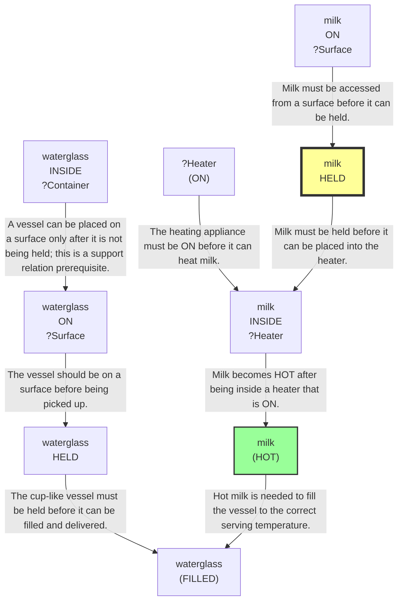

# 🚀 VirtualHome Agent Episode Log


### [GoalReasoner (Module A - Intent)] Output
```json
{
  "is_instruction_obviously_vague": true,
  "clarification_question": "What temperature should the milk be?",
  "target_object": "milk",
  "location_hint": null,
  "reasoning_chain": [
    {
      "question": "Why does the user want this object?",
      "answer": "To obtain a cup of milk."
    },
    {
      "question": "Why is that important?",
      "answer": "The user likely wants to drink or use the milk."
    },
    {
      "question": "What fundamental need does this fulfill?",
      "answer": "It helps satisfy thirst or provide nourishment."
    },
    {
      "question": "Are there any deeper psychological or physical motivations?",
      "answer": "The immediate motivation is likely to consume a beverage at a preferred temperature for comfort or enjoyment."
    }
  ],
  "deep_intent": "The user wants to consume a beverage for hydration or nourishment at a preferred temperature.",
  "acceptable_alternatives_properties": [
    {
      "priority": 1,
      "description": "Other drinkable dairy beverages, such as a similar milk-based drink at the requested temperature"
    },
    {
      "priority": 2,
      "description": "Other cold or warm beverages that can be poured into a cup, such as water, juice, or tea"
    },
    {
      "priority": 3,
      "description": "Ready-to-drink beverages with similar texture or nutritional role, such as flavored milk or a shake"
    },
    {
      "priority": 4,
      "description": "Any safe beverage that can meet the user's hydration need, even if it is not dairy-based"
    }
  ]
}
```

### [RoboStateMultiTaskController] Output
```json
{
  "action": "[ask] What temperature should the milk be?",
  "active_task_id": "task_1",
  "task_context": {
    "active_task_id": "task_1",
    "pending_task_ids": [],
    "satisfied_task_ids": []
  },
  "source": "goal_reasoner_clarification"
}
```
## Step 0
- **Action**: `[ask] What temperature should the milk be?`
- **Action Success**: `True`
- **Action Message**: Hot.
- **Active Task**: `task_1`
- **Decision Source**: `goal_reasoner_clarification`
- **Task Progress**: T5_G2_08_B1=pending
- **SDG Status**:
No SDG active.
- **Observed Items (159)**: wall(12), wall(13), wall(14), wall(15), wall(16), wall(17), wall(18), wall(19), wall(20), wall(21), floor(22), floor(23), floor(24), floor(25), floor(26)...


### [GoalReasoner (Module A - Intent)] Output
```json
{
  "is_instruction_obviously_vague": true,
  "clarification_question": "What exact temperature should the milk be brought to?",
  "target_object": "milk",
  "location_hint": null,
  "reasoning_chain": [
    {
      "question": "Why does the user want this object?",
      "answer": "To obtain milk that can be consumed or used as a hot drink."
    },
    {
      "question": "Why is that important?",
      "answer": "Because the user wants it heated to a suitable drinking state rather than left cold."
    },
    {
      "question": "What fundamental need does this fulfill?",
      "answer": "It fulfills the need for a warm beverage at a specified temperature."
    },
    {
      "question": "Are there any deeper psychological or physical motivations?",
      "answer": "Likely comfort, preference, or readiness for immediate consumption."
    }
  ],
  "deep_intent": "The user wants a warm beverage prepared at a specific temperature.",
  "acceptable_alternatives_properties": [
    {
      "priority": 1,
      "description": "Other warm ready-to-drink beverages, such as hot chocolate or warm tea, at the requested temperature"
    },
    {
      "priority": 2,
      "description": "Other milk-based drinks or warm dairy beverages with similar drinkability and temperature"
    },
    {
      "priority": 3,
      "description": "Warm non-dairy beverages that provide similar comfort and hydration, such as coffee or tea"
    },
    {
      "priority": 4,
      "description": "Any warm drink that can satisfy the need for a heated beverage"
    }
  ]
}
```

### [PerceptionFilter] Output
```json
{
  "reasoning": "The goal is to heat milk and have a filled drinking vessel. I must keep the target milk and the exact vessel waterglass, plus the heating appliances that can function as ?Heater (microwave, stove, coffeemaker) and the sink/faucet as practical support utilities for drink preparation. Since the SDG requires the vessel to be placed on a surface, I keep only the relevant surface options present for the vessel (kitchencounter, kitchentable).",
  "selected_classes": [
    "microwave",
    "character",
    "waterglass",
    "sink",
    "coffeemaker",
    "milk",
    "stove",
    "kitchentable",
    "faucet",
    "kitchencounter"
  ],
  "raw_class_count": 50
}
```

### [LLMExecutor] Output
```json
{
  "reasoning": "The instruction is now clarified as wanting hot milk. The SDG requires milk to be held, placed into a heater, and the heater turned on so the milk becomes HOT. In the current graph there are two milk instances: milk(176) is COLD, while milk(177) is already HOT. Since the final goal includes hot milk and the task only needs the active task satisfied, the best autonomous choice is to bind milk(177) as the target milk, but we still need to access it. Because it is on the kitchen table and close to the character, the next atomic step should be to walk to that milk before grabbing it.",
  "satisfied_nodes": [
    "N4"
  ],
  "current_node_focus": "N1",
  "mapped_variables": {
    "?Heater": "stove(163)",
    "?Surface": "kitchentable(131)"
  },
  "action": "[walk] <milk> (177)"
}
```

### [RoboStateMultiTaskController] Output
```json
{
  "action": "[walk] <milk> (177)",
  "active_task_id": "task_1",
  "task_context": {
    "active_task_id": "task_1",
    "pending_task_ids": [],
    "satisfied_task_ids": []
  },
  "source": "llm_executor"
}
```
## Step 1
- **Action**: `[walk] <milk> (177)`
- **Action Success**: `True`
- **Action Message**: {'0': {'message': 'Success'}}
- **Active Task**: `task_1`
- **Decision Source**: `llm_executor`
- **Task Progress**: T5_G2_08_B1=pending
- **SDG Status**:

- **Observed Items (25)**: waterglass(64), waterglass(71), waterglass(72), waterglass(79), waterglass(80), waterglass(87), waterglass(88), waterglass(100), kitchentable(131), kitchentable(135), kitchencounter(136) [CLOSED], kitchencounter(146) [CLOSED], sink(155), faucet(156) [OFF], stove(163) [OFF,CLOSED]...


### [PerceptionFilter] Output
```json
{
  "reasoning": "Reused cached class selection.",
  "selected_classes": [
    "microwave",
    "character",
    "waterglass",
    "sink",
    "coffeemaker",
    "milk",
    "stove",
    "kitchentable",
    "faucet",
    "kitchencounter"
  ],
  "raw_class_count": 50
}
```

### [LLMExecutor] Output
```json
{
  "reasoning": "The task is to heat milk to a warm/hot serving state. The current graph shows two milk objects on the kitchen table, and milk(177) already has the HOT state, matching the goal without needing further heating. The SDG ultimately requires milk to be held and then placed inside/on the heater, but because the user-facing ambiguity budget is exhausted and no ask is allowed, the best autonomous progress is to bind and secure the hot milk first. Since I just walked to milk in the previous step, the next atomic action should be to grab the hot milk(177).",
  "satisfied_nodes": [
    "N4"
  ],
  "current_node_focus": "N1",
  "mapped_variables": {
    "?Heater": "microwave(171)"
  },
  "action": "[grab] <milk> (177)"
}
```

### [RoboStateMultiTaskController] Output
```json
{
  "action": "[grab] <milk> (177)",
  "active_task_id": "task_1",
  "task_context": {
    "active_task_id": "task_1",
    "pending_task_ids": [],
    "satisfied_task_ids": []
  },
  "source": "llm_executor"
}
```
## Step 2
- **Action**: `[grab] <milk> (177)`
- **Action Success**: `True`
- **Action Message**: {'0': {'message': 'Success'}}
- **Active Task**: `task_1`
- **Decision Source**: `llm_executor`
- **Task Progress**: T5_G2_08_B1=done
- **SDG Status**:

- **Observed Items (25)**: waterglass(64), waterglass(71), waterglass(72), waterglass(79), waterglass(80), waterglass(87), waterglass(88), waterglass(100), kitchentable(131), kitchentable(135), kitchencounter(136) [CLOSED], kitchencounter(146) [CLOSED], sink(155), faucet(156) [OFF], stove(163) [OFF,CLOSED]...

