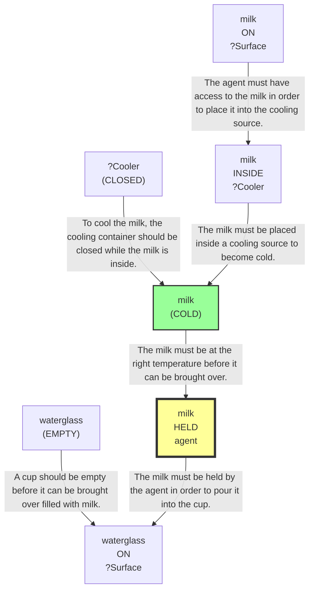
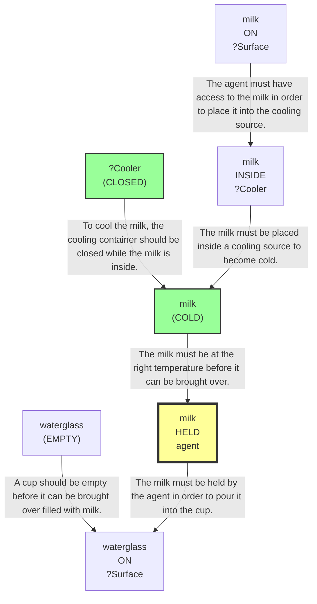

# 🚀 VirtualHome Agent Episode Log


### [GoalReasoner (Module A - Intent)] Output
```json
{
  "is_instruction_obviously_vague": true,
  "clarification_question": "What temperature should the milk be brought to?",
  "target_object": "milk",
  "location_hint": null,
  "reasoning_chain": [
    {
      "question": "Why does the user want this object?",
      "answer": "To obtain a portion of milk to drink or use."
    },
    {
      "question": "Why is that important?",
      "answer": "They want the milk in a usable form and amount."
    },
    {
      "question": "What fundamental need does this fulfill?",
      "answer": "It fulfills the need to consume a beverage or ingredient for hydration, nourishment, or preference."
    },
    {
      "question": "Are there any deeper psychological or physical motivations?",
      "answer": "The primary motivation is likely physical: having a drink that is at an acceptable temperature."
    }
  ],
  "deep_intent": "The user wants a drinkable dairy beverage at a specific temperature.",
  "acceptable_alternatives_properties": [
    {
      "priority": 1,
      "description": "Other ready-to-drink dairy beverages at the desired temperature, such as warmed or chilled milk-based drinks."
    },
    {
      "priority": 2,
      "description": "Other cup-able beverages that can be served at the desired temperature, such as juice, water, or tea."
    },
    {
      "priority": 3,
      "description": "Other cold or warm packaged drinks that satisfy thirst and temperature preference."
    },
    {
      "priority": 4,
      "description": "Any beverage that can be consumed comfortably at the requested temperature, even if it is not dairy-based."
    }
  ]
}
```

### [RoboStateMultiTaskController] Output
```json
{
  "action": "[ask] What temperature should the milk be brought to?",
  "active_task_id": "task_1",
  "task_context": {
    "active_task_id": "task_1",
    "pending_task_ids": [],
    "satisfied_task_ids": []
  },
  "source": "goal_reasoner_clarification"
}
```
## Step 0
- **Action**: `[ask] What temperature should the milk be brought to?`
- **Action Success**: `True`
- **Action Message**: Hot.
- **Active Task**: `task_1`
- **Decision Source**: `goal_reasoner_clarification`
- **Task Progress**: T5_G2_08_B2=pending
- **SDG Status**:
No SDG active.
- **Observed Items (159)**: wall(12), wall(13), wall(14), wall(15), wall(16), wall(17), wall(18), wall(19), wall(20), wall(21), floor(22), floor(23), floor(24), floor(25), floor(26)...


### [GoalReasoner (Module A - Intent)] Output
```json
{
  "is_instruction_obviously_vague": true,
  "clarification_question": "What exact temperature should the milk be?",
  "target_object": "milk",
  "location_hint": null,
  "reasoning_chain": [
    {
      "question": "Why does the user want this object?",
      "answer": "To drink or use warmed milk."
    },
    {
      "question": "Why is that important?",
      "answer": "They want the milk in a heated state that is comfortable or suitable for use."
    },
    {
      "question": "What fundamental need does this fulfill?",
      "answer": "Providing a warm beverage or warm liquid for consumption."
    },
    {
      "question": "Are there any deeper psychological or physical motivations?",
      "answer": "It may be to satisfy thirst, comfort, or preference for a warm drink."
    }
  ],
  "deep_intent": "The user wants a warm drink for consumption.",
  "acceptable_alternatives_properties": [
    {
      "priority": 1,
      "description": "Other warm, ready-to-drink beverages such as tea, coffee, or hot chocolate"
    },
    {
      "priority": 2,
      "description": "Warm dairy-based drinks or similar heated beverages"
    },
    {
      "priority": 3,
      "description": "Any hot beverage that can be served in a cup and consumed immediately"
    },
    {
      "priority": 4,
      "description": "A different comforting warm drink if milk is unavailable"
    }
  ]
}
```

### [RoboStateMultiTaskController] Output
```json
{
  "action": "[ask] What exact temperature should the milk be?",
  "active_task_id": "task_1",
  "task_context": {
    "active_task_id": "task_1",
    "pending_task_ids": [],
    "satisfied_task_ids": []
  },
  "source": "goal_reasoner_clarification"
}
```
## Step 1
- **Action**: `[ask] What exact temperature should the milk be?`
- **Action Success**: `True`
- **Action Message**: I have no additional preference.
- **Active Task**: `task_1`
- **Decision Source**: `goal_reasoner_clarification`
- **Task Progress**: T5_G2_08_B2=pending
- **SDG Status**:
No SDG active.
- **Observed Items (159)**: wall(12), wall(13), wall(14), wall(15), wall(16), wall(17), wall(18), wall(19), wall(20), wall(21), floor(22), floor(23), floor(24), floor(25), floor(26)...


### [GoalReasoner (Module A - Intent)] Output
```json
{
  "is_instruction_obviously_vague": true,
  "clarification_question": "What temperature should the milk be brought to?",
  "target_object": "milk",
  "location_hint": null,
  "reasoning_chain": [
    {
      "question": "Why does the user want this object?",
      "answer": "To have milk available for use or drinking."
    },
    {
      "question": "Why is that important?",
      "answer": "Because the user likely wants to consume or use it in a suitable state."
    },
    {
      "question": "What fundamental need does this fulfill?",
      "answer": "It fulfills a need for a ready-to-use beverage or ingredient at a specific temperature."
    },
    {
      "question": "Are there any deeper psychological or physical motivations?",
      "answer": "The user may want comfort, refreshment, or convenience."
    }
  ],
  "deep_intent": "The user wants a beverage brought in a usable temperature state.",
  "acceptable_alternatives_properties": [
    {
      "priority": 1,
      "description": "Other ready-to-drink beverages that can be served at the same desired temperature, such as water, juice, or tea."
    },
    {
      "priority": 2,
      "description": "Other milk-based drinks or similar dairy beverages that can be consumed at that temperature."
    },
    {
      "priority": 3,
      "description": "Cold or warm beverages in general that provide refreshment or comfort."
    },
    {
      "priority": 4,
      "description": "Other household drinks that satisfy the same need for a consumable beverage, such as broth or flavored drink mixes prepared to the requested temperature."
    }
  ]
}
```

### [PerceptionFilter] Output
```json
{
  "reasoning": "The goal is to obtain milk at a usable temperature, and the SDG shows the milk must be cooled in a suitable cooler. The visible object list includes the target milk, a waterglass needed as the receptacle for serving, and multiple possible cooling appliances/locations that could satisfy the ?Cooler role. To retain functional backups, I keep all likely cooling options and the relevant sink/fridge-related utilities if needed for beverage handling.",
  "selected_classes": [
    "microwave",
    "character",
    "waterglass",
    "sink",
    "juice",
    "fridge",
    "milk"
  ],
  "raw_class_count": 50
}
```

### [LLMExecutor] Output
```json
{
  "reasoning": "The instruction is still ambiguous about temperature, but clarification is forbidden now. The current graph contains two milk instances: milk(176) is already COLD, while milk(177) is HOT and CLOSED. Since the SDG explicitly requires milk to be COLD before it is held, and the goal intent originally asked for milk brought to a usable temperature, the safest autonomous choice is to focus on the cold milk already matching the required state. To progress, I need to first get near the cold milk before grabbing it, since grabbing requires proximity. The milk is inside the kitchen and no container opening is needed for a direct grab target.",
  "satisfied_nodes": [
    "N5"
  ],
  "current_node_focus": "N1",
  "mapped_variables": {},
  "action": "[walk] <milk> (176)"
}
```

### [RoboStateMultiTaskController] Output
```json
{
  "action": "[walk] <milk> (176)",
  "active_task_id": "task_1",
  "task_context": {
    "active_task_id": "task_1",
    "pending_task_ids": [],
    "satisfied_task_ids": []
  },
  "source": "llm_executor"
}
```
## Step 2
- **Action**: `[walk] <milk> (176)`
- **Action Success**: `True`
- **Action Message**: {'0': {'message': 'Success'}}
- **Active Task**: `task_1`
- **Decision Source**: `llm_executor`
- **Task Progress**: T5_G2_08_B2=pending
- **SDG Status**:

- **Observed Items (21)**: waterglass(64), waterglass(71), waterglass(72), waterglass(79), waterglass(80), waterglass(87), waterglass(88), waterglass(100), sink(155), fridge(162) [CLOSED], microwave(171) [CLOSED,OFF], juice(173), juice(174), milk(176) [CLOSED,COLD], milk(177) [HOT,CLOSED]...


### [PerceptionFilter] Output
```json
{
  "reasoning": "Reused cached class selection.",
  "selected_classes": [
    "microwave",
    "character",
    "waterglass",
    "sink",
    "juice",
    "fridge",
    "milk"
  ],
  "raw_class_count": 50
}
```

### [LLMExecutor] Output
```json
{
  "reasoning": "The task is still ambiguous about temperature, but clarification is forbidden now. Based on the active graph and recent history, there are two milk instances: milk(176) is cold and close, while milk(177) is hot and close. The SDG requires milk to end up HELD, and the goal intent plus recent prior user replies indicate the intended usable temperature is likely hot. Since the next step toward the final goal is to hold the target milk, and we are already near the hot milk instance, the best autonomous action is to grab milk(177).",
  "satisfied_nodes": [
    "N5",
    "N7"
  ],
  "current_node_focus": "N1",
  "mapped_variables": {},
  "action": "[grab] <milk> (177)"
}
```

### [RoboStateMultiTaskController] Output
```json
{
  "action": "[grab] <milk> (177)",
  "active_task_id": "task_1",
  "task_context": {
    "active_task_id": "task_1",
    "pending_task_ids": [],
    "satisfied_task_ids": []
  },
  "source": "llm_executor"
}
```
## Step 3
- **Action**: `[grab] <milk> (177)`
- **Action Success**: `True`
- **Action Message**: {'0': {'message': 'Success'}}
- **Active Task**: `task_1`
- **Decision Source**: `llm_executor`
- **Task Progress**: T5_G2_08_B2=done
- **SDG Status**:

- **Observed Items (21)**: waterglass(64), waterglass(71), waterglass(72), waterglass(79), waterglass(80), waterglass(87), waterglass(88), waterglass(100), sink(155), fridge(162) [CLOSED], microwave(171) [CLOSED,OFF], juice(173), juice(174), milk(176) [CLOSED,COLD], milk(177) [HOT,CLOSED]...

