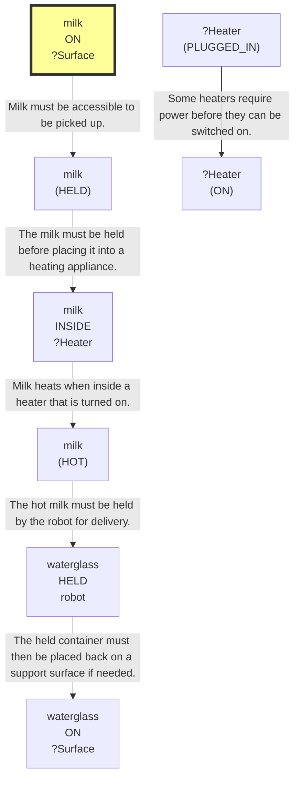
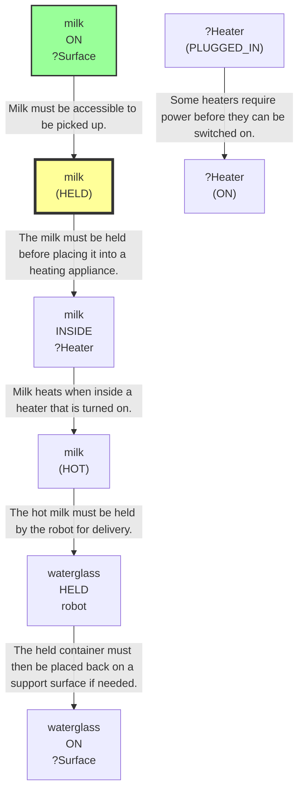

# 🚀 VirtualHome Agent Episode Log


### [GoalReasoner (Module A - Intent)] Output
```json
{
  "is_instruction_obviously_vague": true,
  "clarification_question": "What exact temperature should the milk be brought to?",
  "target_object": "milk",
  "location_hint": null,
  "reasoning_chain": [
    {
      "question": "Why does the user want this object?",
      "answer": "To have a cup of milk available."
    },
    {
      "question": "Why is that important?",
      "answer": "They likely want to drink it or use it as a beverage."
    },
    {
      "question": "What fundamental need does this fulfill?",
      "answer": "It fulfills the need to consume a drink, possibly for refreshment or nutrition."
    },
    {
      "question": "Are there any deeper psychological or physical motivations?",
      "answer": "The core motivation is likely to satisfy thirst or obtain a preferred drink at a specific temperature."
    }
  ],
  "deep_intent": "The user wants to obtain a drink at a desired temperature.",
  "acceptable_alternatives_properties": [
    {
      "priority": 1,
      "description": "Other drinkable dairy or non-dairy beverages that can be served in a cup at the requested temperature."
    },
    {
      "priority": 2,
      "description": "Similar ready-to-drink beverages such as water, juice, or coffee/tea if temperature preference can be met."
    },
    {
      "priority": 3,
      "description": "Any household beverage that can be poured into a cup and served hot, cold, or at room temperature as requested."
    },
    {
      "priority": 4,
      "description": "Other thirst-relieving drinks with a comparable serving form, even if they are not milk."
    }
  ]
}
```

### [RoboStateMultiTaskController] Output
```json
{
  "action": "[ask] What exact temperature should the milk be brought to?",
  "active_task_id": "task_1",
  "task_context": {
    "active_task_id": "task_1",
    "pending_task_ids": [],
    "satisfied_task_ids": []
  },
  "source": "goal_reasoner_clarification"
}
```
## Step 0
- **Action**: `[ask] What exact temperature should the milk be brought to?`
- **Action Success**: `True`
- **Action Message**: Hot.
- **Active Task**: `task_1`
- **Decision Source**: `goal_reasoner_clarification`
- **Task Progress**: T5_G2_08_B3=pending
- **SDG Status**:
No SDG active.
- **Observed Items (159)**: wall(12), wall(13), wall(14), wall(15), wall(16), wall(17), wall(18), wall(19), wall(20), wall(21), floor(22), floor(23), floor(24), floor(25), floor(26)...


### [GoalReasoner (Module A - Intent)] Output
```json
{
  "is_instruction_obviously_vague": false,
  "clarification_question": null,
  "target_object": "milk",
  "location_hint": null,
  "reasoning_chain": [
    {
      "question": "Why does the user want this object?",
      "answer": "To obtain milk in a cup at a specified hot temperature."
    },
    {
      "question": "Why is that important?",
      "answer": "Because the user likely wants to consume or use the milk in a warmed state."
    },
    {
      "question": "What fundamental need does this fulfill?",
      "answer": "It fulfills the need to have a drink or ingredient at a desired temperature."
    },
    {
      "question": "Are there any deeper psychological or physical motivations?",
      "answer": "The primary motivation is likely physical comfort, nourishment, or convenience in getting a warmed beverage."
    }
  ],
  "deep_intent": "The user wants a warmed drink for consumption or use.",
  "acceptable_alternatives_properties": [
    {
      "priority": 1,
      "description": "Other warm ready-to-drink beverages, such as tea, coffee, or hot chocolate"
    },
    {
      "priority": 2,
      "description": "Other milk-based warm drinks or warmed dairy beverages"
    },
    {
      "priority": 3,
      "description": "Warm packaged beverages or liquids that can be consumed at a similar temperature"
    },
    {
      "priority": 4,
      "description": "Other comforting hot drinks that satisfy the need for a warm beverage"
    }
  ]
}
```

### [PerceptionFilter] Output
```json
{
  "reasoning": "The goal is to heat milk and end with a held drinking container. The SDG requires the target milk, a heater to warm it, a power source for the heater if needed, and the waterglass as the container to hold/deliver the hot milk. No other objects are necessary.",
  "selected_classes": [
    "powersocket",
    "microwave",
    "character",
    "waterglass",
    "stove",
    "milk"
  ],
  "raw_class_count": 50
}
```

### [LLMExecutor] Output
```json
{
  "reasoning": "The SDG is for milk, and the current graph contains two milk instances. One is already HOT: milk(177). Since the goal intent is to obtain hot milk, the best first step is to move to the hot milk so it can be grabbed next. It is not yet held, and no heater interaction is needed if we can bind the already-hot instance to the milk target. Because grabbing requires proximity, the next atomic action must be to walk to milk(177).",
  "satisfied_nodes": [],
  "current_node_focus": "N1",
  "mapped_variables": {
    "?Heater": "microwave(171)",
    "?Surface": "waterglass(87)"
  },
  "action": "[walk] <milk> (177)"
}
```

### [RoboStateMultiTaskController] Output
```json
{
  "action": "[walk] <milk> (177)",
  "active_task_id": "task_1",
  "task_context": {
    "active_task_id": "task_1",
    "pending_task_ids": [],
    "satisfied_task_ids": []
  },
  "source": "llm_executor"
}
```
## Step 1
- **Action**: `[walk] <milk> (177)`
- **Action Success**: `True`
- **Action Message**: {'0': {'message': 'Success'}}
- **Active Task**: `task_1`
- **Decision Source**: `llm_executor`
- **Task Progress**: T5_G2_08_B3=pending
- **SDG Status**:

- **Observed Items (19)**: powersocket(57), waterglass(64), waterglass(71), waterglass(72), waterglass(79), waterglass(80), waterglass(87), waterglass(88), waterglass(100), stove(163) [OFF,CLOSED], microwave(171) [CLOSED,OFF], milk(176) [CLOSED,COLD], milk(177) [HOT,CLOSED], character(1), kitchen(11)...


### [PerceptionFilter] Output
```json
{
  "reasoning": "Reused cached class selection.",
  "selected_classes": [
    "powersocket",
    "microwave",
    "character",
    "waterglass",
    "stove",
    "milk"
  ],
  "raw_class_count": 50
}
```

### [LLMExecutor] Output
```json
{
  "reasoning": "Milk(177) is already close to the robot and is the best rebind for the target because it is the only milk currently marked HOT, which satisfies the final temperature goal. Since the SDG requires the milk to be HELD before it can be placed into a heater, the next atomic step is to grab it.",
  "satisfied_nodes": [
    "N1"
  ],
  "current_node_focus": "N2",
  "mapped_variables": {
    "?Surface": "character(1)"
  },
  "action": "[grab] <milk> (177)"
}
```

### [RoboStateMultiTaskController] Output
```json
{
  "action": "[grab] <milk> (177)",
  "active_task_id": "task_1",
  "task_context": {
    "active_task_id": "task_1",
    "pending_task_ids": [],
    "satisfied_task_ids": []
  },
  "source": "llm_executor"
}
```
## Step 2
- **Action**: `[grab] <milk> (177)`
- **Action Success**: `True`
- **Action Message**: {'0': {'message': 'Success'}}
- **Active Task**: `task_1`
- **Decision Source**: `llm_executor`
- **Task Progress**: T5_G2_08_B3=done
- **SDG Status**:

- **Observed Items (19)**: powersocket(57), waterglass(64), waterglass(71), waterglass(72), waterglass(79), waterglass(80), waterglass(87), waterglass(88), waterglass(100), stove(163) [OFF,CLOSED], microwave(171) [CLOSED,OFF], milk(176) [CLOSED,COLD], milk(177) [HOT,CLOSED], character(1), kitchen(11)...

