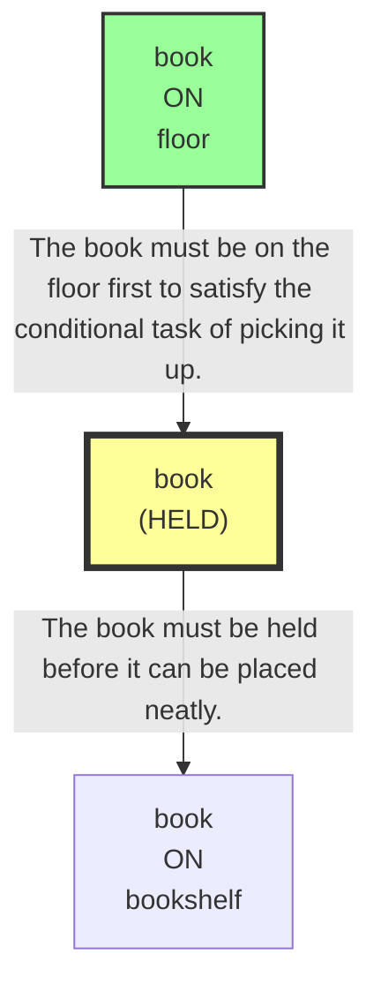
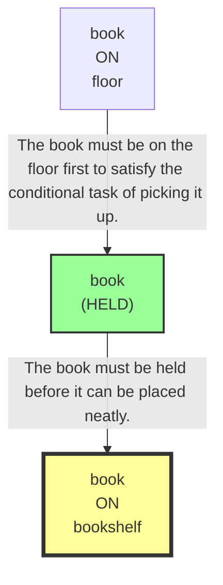
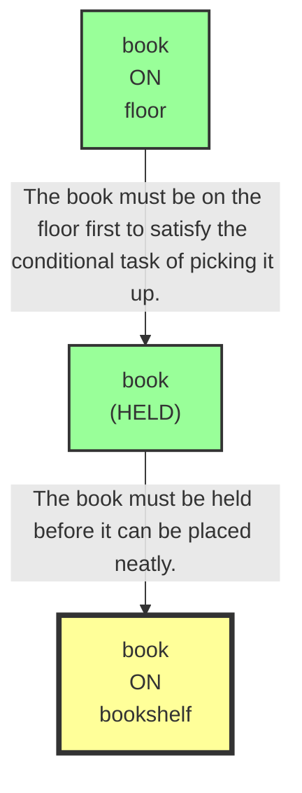
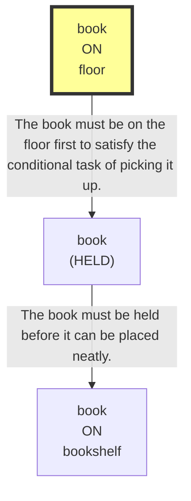
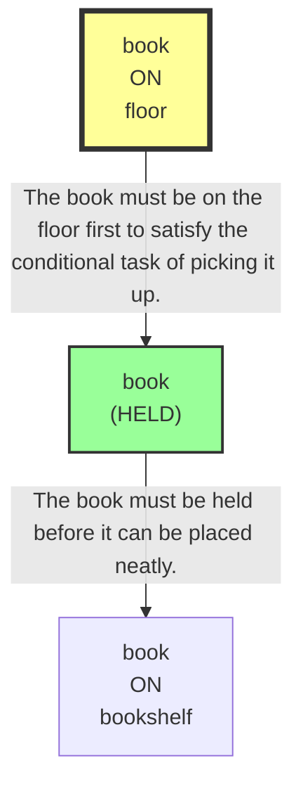
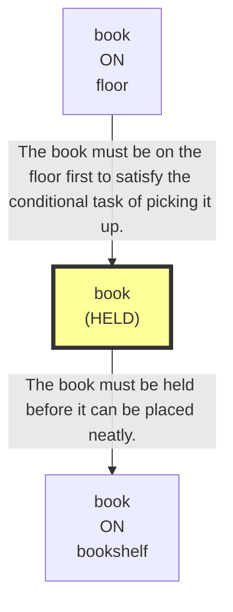
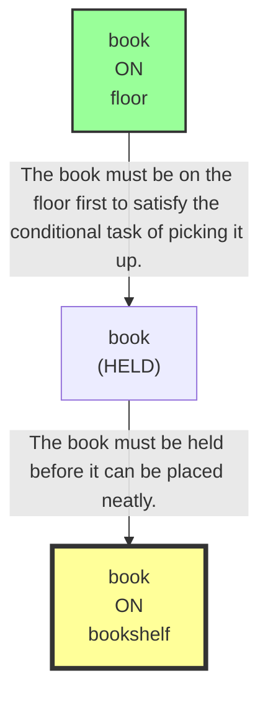

# 🚀 VirtualHome Agent Episode Log


### [GoalReasoner (Module A - Intent)] Output
```json
{
  "is_instruction_obviously_vague": false,
  "clarification_question": null,
  "target_object": "book",
  "location_hint": "the floor",
  "reasoning_chain": [
    {
      "question": "Why does the user want this object?",
      "answer": "To retrieve the book if it has fallen and restore its place."
    },
    {
      "question": "Why is that important?",
      "answer": "To keep the area tidy and prevent the book from remaining on the floor."
    },
    {
      "question": "What fundamental need does this fulfill?",
      "answer": "Maintain organization and order in the environment."
    },
    {
      "question": "Are there any deeper psychological or physical motivations?",
      "answer": "It may reduce clutter, prevent tripping or damage, and satisfy a preference for neatness."
    }
  ],
  "deep_intent": "The user wants to restore order by removing a fallen item from the floor and returning it to a neat resting place.",
  "acceptable_alternatives_properties": [
    {
      "priority": 1,
      "description": "Other small household items that have fallen onto the floor and can be placed back neatly, such as a magazine, notebook, or remote control."
    },
    {
      "priority": 2,
      "description": "Other loose reading materials or tabletop items that belong on a shelf, table, or similar surface."
    },
    {
      "priority": 3,
      "description": "General clutter items that can be picked up and arranged tidily in an indoor space."
    },
    {
      "priority": 4,
      "description": "Any misplaced object that can be safely returned to an organized position, even if it is not a book."
    }
  ]
}
```

### [PerceptionFilter] Output
```json
{
  "reasoning": "The goal is to pick up a book from the floor and return it to a bookshelf. The minimum required classes are the target object (book), the source location (floor), and the destination receptacle/furniture (bookshelf).",
  "selected_classes": [
    "floor",
    "book",
    "bookshelf",
    "character"
  ],
  "raw_class_count": 41
}
```

### [LLMExecutor] Output
```json
{
  "reasoning": "The target book is present on the floor in the living room, satisfying N1 and allowing pickup. To progress toward holding it, I should first move next to one specific book. Since the goal is to retrieve a book from the floor and then place it on the bookshelf, I will bind the current focus to the clearest matching instance book(190) and walk to it before grabbing.",
  "satisfied_nodes": [
    "N1"
  ],
  "current_node_focus": "N2",
  "mapped_variables": {},
  "action": "[walk] <book> (190)"
}
```

### [RoboStateMultiTaskController] Output
```json
{
  "action": "[walk] <book> (190)",
  "active_task_id": "task_1",
  "task_context": {
    "active_task_id": "task_1",
    "pending_task_ids": [],
    "satisfied_task_ids": []
  },
  "source": "llm_executor"
}
```
## Step 0
- **Action**: `[walk] <book> (190)`
- **Action Success**: `True`
- **Action Message**: {'0': {'message': 'Success'}}
- **Active Task**: `task_1`
- **Decision Source**: `llm_executor`
- **Task Progress**: T5_G2_09_B1=pending
- **SDG Status**:

- **Observed Items (18)**: floor(336), floor(337), floor(338), floor(339), floor(340), floor(341), floor(342), floor(343), floor(344), bookshelf(370), book(190) [CLOSED], book(191) [CLOSED], book(268) [CLOSED], character(1), bathroom(11)...


### [PerceptionFilter] Output
```json
{
  "reasoning": "Reused cached class selection.",
  "selected_classes": [
    "floor",
    "book",
    "bookshelf",
    "character"
  ],
  "raw_class_count": 41
}
```

### [LLMExecutor] Output
```json
{
  "reasoning": "The book is already close to the character and is on the floor, satisfying the prerequisite condition N1. The next required step in the SDG is to pick up the book, so I should grab one of the matching book instances. Book(190) is a valid rebinding target because it is grabbable, on the floor, and close.",
  "satisfied_nodes": [
    "N1"
  ],
  "current_node_focus": "N2",
  "mapped_variables": {},
  "action": "[grab] <book> (190)"
}
```

### [RoboStateMultiTaskController] Output
```json
{
  "action": "[grab] <book> (190)",
  "active_task_id": "task_1",
  "task_context": {
    "active_task_id": "task_1",
    "pending_task_ids": [],
    "satisfied_task_ids": []
  },
  "source": "llm_executor"
}
```
## Step 1
- **Action**: `[grab] <book> (190)`
- **Action Success**: `True`
- **Action Message**: {'0': {'message': 'Success'}}
- **Active Task**: `task_1`
- **Decision Source**: `llm_executor`
- **Task Progress**: T5_G2_09_B1=pending
- **SDG Status**:

- **Observed Items (18)**: floor(336), floor(337), floor(338), floor(339), floor(340), floor(341), floor(342), floor(343), floor(344), bookshelf(370), book(190) [CLOSED], book(191) [CLOSED], book(268) [CLOSED], character(1), bathroom(11)...


### [PerceptionFilter] Output
```json
{
  "reasoning": "Reused cached class selection.",
  "selected_classes": [
    "floor",
    "book",
    "bookshelf",
    "character"
  ],
  "raw_class_count": 41
}
```

### [LLMExecutor] Output
```json
{
  "reasoning": "The active SDG requires the book to end up on the bookshelf. The current graph shows book(190) is already held in the right hand, and bookshelf(370) is a valid nearby surface/container in the living room. Since I must explicitly walk to the destination before placing an object, the next step is to approach the bookshelf. Node N2 (book held) is satisfied; N1 is no longer the focus because the book is already off the floor/being held, and the remaining goal is N3.",
  "satisfied_nodes": [
    "N2"
  ],
  "current_node_focus": "N3",
  "mapped_variables": {},
  "action": "[walk] <bookshelf> (370)"
}
```

### [RoboStateMultiTaskController] Output
```json
{
  "action": "[walk] <bookshelf> (370)",
  "active_task_id": "task_1",
  "task_context": {
    "active_task_id": "task_1",
    "pending_task_ids": [],
    "satisfied_task_ids": []
  },
  "source": "llm_executor"
}
```
## Step 2
- **Action**: `[walk] <bookshelf> (370)`
- **Action Success**: `True`
- **Action Message**: {'0': {'message': 'Success'}}
- **Active Task**: `task_1`
- **Decision Source**: `llm_executor`
- **Task Progress**: T5_G2_09_B1=pending
- **SDG Status**:

- **Observed Items (18)**: floor(336), floor(337), floor(338), floor(339), floor(340), floor(341), floor(342), floor(343), floor(344), bookshelf(370), book(190) [CLOSED], book(191) [CLOSED], book(268) [CLOSED], character(1), bathroom(11)...


### [PerceptionFilter] Output
```json
{
  "reasoning": "Reused cached class selection.",
  "selected_classes": [
    "floor",
    "book",
    "bookshelf",
    "character"
  ],
  "raw_class_count": 41
}
```

### [LLMExecutor] Output
```json
{
  "reasoning": "The book is already held in the right hand, and I have already walked to the bookshelf. The remaining SDG node to satisfy is placing the book on the bookshelf. Since the bookshelf is a surface and I am close to it, the next atomic action is to put the held book back onto the bookshelf.",
  "satisfied_nodes": [
    "N1",
    "N2"
  ],
  "current_node_focus": "N3",
  "mapped_variables": {
    "?Container": "bookshelf(370)"
  },
  "action": "[putback] <book> (190) <bookshelf> (370)"
}
```

### [RoboStateMultiTaskController] Output
```json
{
  "action": "[putback] <book> (190) <bookshelf> (370)",
  "active_task_id": "task_1",
  "task_context": {
    "active_task_id": "task_1",
    "pending_task_ids": [],
    "satisfied_task_ids": []
  },
  "source": "llm_executor"
}
```
## Step 3
- **Action**: `[putback] <book> (190) <bookshelf> (370)`
- **Action Success**: `False`
- **Action Message**: {'0': {'message': 'ScriptExcutor 0: EXECUTION_GENERAL: Script is impossible to execute\n\n'}}
- **Active Task**: `task_1`
- **Decision Source**: `llm_executor`
- **Task Progress**: T5_G2_09_B1=pending
- **SDG Status**:

- **Observed Items (18)**: floor(336), floor(337), floor(338), floor(339), floor(340), floor(341), floor(342), floor(343), floor(344), bookshelf(370), book(190) [CLOSED], book(191) [CLOSED], book(268) [CLOSED], character(1), bathroom(11)...


### [PerceptionFilter] Output
```json
{
  "reasoning": "Reused cached class selection.",
  "selected_classes": [
    "floor",
    "book",
    "bookshelf",
    "character"
  ],
  "raw_class_count": 41
}
```

### [LLMExecutor] Output
```json
{
  "reasoning": "The prior attempt to put the book onto the bookshelf failed, so I need to recover by checking whether the held book can be placed on the bookshelf as a flat surface. The current graph shows book(190) is still held in the right hand and the bookshelf(370) is close. Since the failed action was impossible, the safest next step is to re-approach the bookshelf explicitly if needed by the engine before retrying placement; however, because we are already close and the task goal is to end with the book on the bookshelf, the focus remains on satisfying N3. The book on the floor condition N1 was already satisfied by the observed book being on the floor before pickup, and N2 is currently satisfied by the book being held.",
  "satisfied_nodes": [
    "N1",
    "N2"
  ],
  "current_node_focus": "N3",
  "mapped_variables": {},
  "action": "[walk] <bookshelf> (370)"
}
```

### [RoboStateMultiTaskController] Output
```json
{
  "action": "[walk] <bookshelf> (370)",
  "active_task_id": "task_1",
  "task_context": {
    "active_task_id": "task_1",
    "pending_task_ids": [],
    "satisfied_task_ids": []
  },
  "source": "llm_executor"
}
```
## Step 4
- **Action**: `[walk] <bookshelf> (370)`
- **Action Success**: `True`
- **Action Message**: {'0': {'message': 'Success'}}
- **Active Task**: `task_1`
- **Decision Source**: `llm_executor`
- **Task Progress**: T5_G2_09_B1=pending
- **SDG Status**:

- **Observed Items (18)**: floor(336), floor(337), floor(338), floor(339), floor(340), floor(341), floor(342), floor(343), floor(344), bookshelf(370), book(190) [CLOSED], book(191) [CLOSED], book(268) [CLOSED], character(1), bathroom(11)...


### [PerceptionFilter] Output
```json
{
  "reasoning": "Reused cached class selection.",
  "selected_classes": [
    "floor",
    "book",
    "bookshelf",
    "character"
  ],
  "raw_class_count": 41
}
```

### [LLMExecutor] Output
```json
{
  "reasoning": "The book goal is already partially satisfied: book(190) is currently held in the right hand, so N1 (book on floor) led to N2 (book held) in the past. The failed putback indicates the bookshelf interaction was not executable from the current state, likely because the task should now use the held book and place it on the bookshelf with a valid placement action. Since the book is already held and the bookshelf is the intended destination, the next needed step is to place the book onto the bookshelf surface. However, the engine requires being explicitly walked to the destination before putback; we are already close to the bookshelf according to the graph, and the last action was a walk to it, so the next atomic action should be the placement attempt.",
  "satisfied_nodes": [
    "N1",
    "N2"
  ],
  "current_node_focus": "N3",
  "mapped_variables": {},
  "action": "[putback] <book> (190) <bookshelf> (370)"
}
```

### [RoboStateMultiTaskController] Output
```json
{
  "action": "[putback] <book> (190) <bookshelf> (370)",
  "active_task_id": "task_1",
  "task_context": {
    "active_task_id": "task_1",
    "pending_task_ids": [],
    "satisfied_task_ids": []
  },
  "source": "llm_executor"
}
```
## Step 5
- **Action**: `[putback] <book> (190) <bookshelf> (370)`
- **Action Success**: `False`
- **Action Message**: {'0': {'message': 'ScriptExcutor 0: EXECUTION_GENERAL: Script is impossible to execute\n\n'}}
- **Active Task**: `task_1`
- **Decision Source**: `llm_executor`
- **Task Progress**: T5_G2_09_B1=pending
- **SDG Status**:

- **Observed Items (18)**: floor(336), floor(337), floor(338), floor(339), floor(340), floor(341), floor(342), floor(343), floor(344), bookshelf(370), book(190) [CLOSED], book(191) [CLOSED], book(268) [CLOSED], character(1), bathroom(11)...


### [PerceptionFilter] Output
```json
{
  "reasoning": "Reused cached class selection.",
  "selected_classes": [
    "floor",
    "book",
    "bookshelf",
    "character"
  ],
  "raw_class_count": 41
}
```

### [LLMExecutor] Output
```json
{
  "reasoning": "The book goal is currently not progressing because the previously targeted book(190) is being held, and putting it back onto the bookshelf failed twice with an impossible execution error. Since the SDG requires the book to end up ON the bookshelf, and the book is already held, the next valid step is to verify whether the held book can be placed using a different nearby surface only if needed; however, the current graph shows the bookshelf is close and the book is held. The most likely issue is that the engine rejected the prior putback due to a transient/script issue, so the best next atomic action is to attempt the placement again without changing location.",
  "satisfied_nodes": [
    "N2"
  ],
  "current_node_focus": "N3",
  "mapped_variables": {},
  "action": "[putback] <book> (190) <bookshelf> (370)"
}
```

### [RoboStateMultiTaskController] Output
```json
{
  "action": "[walk] <bathroom> (11)",
  "active_task_id": null,
  "task_context": {
    "active_task_id": null,
    "pending_task_ids": [
      "task_1"
    ],
    "satisfied_task_ids": []
  },
  "source": "loop_recovery_room_revisit"
}
```
## Step 6
- **Action**: `[walk] <bathroom> (11)`
- **Action Success**: `True`
- **Action Message**: {'0': {'message': 'Success'}}
- **Decision Source**: `loop_recovery_room_revisit`
- **Task Progress**: T5_G2_09_B1=pending
- **SDG Status**:
No SDG active.
- **Observed Items (82)**: floor(336), floor(337), floor(338), floor(339), floor(340), floor(341), floor(342), floor(343), floor(344), wall(345), wall(346), wall(347), wall(348), wall(349), wall(350)...


### [PerceptionFilter] Output
```json
{
  "reasoning": "The task is to pick up a book from the floor and place it onto a bookshelf. The minimum required classes are the target object book, the source location floor, and the destination bookshelf. No tools or alternative receptacles are needed for this simple retrieval/placement task.",
  "selected_classes": [
    "character",
    "floor",
    "door",
    "book",
    "bookshelf"
  ],
  "raw_class_count": 63
}
```

### [LLMExecutor] Output
```json
{
  "reasoning": "The prior attempt to place book(190) onto bookshelf(370) failed twice, and the current graph shows book(190) is actually in the bathroom and being held by the character, so the historical ID/book-floor assumption is stale. The active SDG requires a book on the floor -> held -> on bookshelf. Since book(191) is a valid book currently on the floor in the living room and the historical ID rule says to rebind using current observations, the best next step is to move toward the floor book that can satisfy the initial condition and allow a fresh, valid pickup sequence. I should not repeat the failed putback. The most relevant actionable next step is to walk to the floor book(191) in the living room so it can be grabbed next.",
  "satisfied_nodes": [],
  "current_node_focus": "N1",
  "mapped_variables": {},
  "action": "[walk] <book> (191)"
}
```

### [RoboStateMultiTaskController] Output
```json
{
  "action": "[walk] <book> (191)",
  "active_task_id": "task_1",
  "task_context": {
    "active_task_id": "task_1",
    "pending_task_ids": [],
    "satisfied_task_ids": []
  },
  "source": "llm_executor"
}
```
## Step 7
- **Action**: `[walk] <book> (191)`
- **Action Success**: `True`
- **Action Message**: {'0': {'message': 'Success'}}
- **Active Task**: `task_1`
- **Decision Source**: `llm_executor`
- **Task Progress**: T5_G2_09_B1=pending
- **SDG Status**:

- **Observed Items (25)**: floor(336), floor(337), floor(338), floor(339), floor(340), floor(341), floor(342), floor(343), floor(344), bookshelf(370), book(190) [CLOSED], book(191) [CLOSED], book(268) [CLOSED], character(1), bathroom(11)...


### [PerceptionFilter] Output
```json
{
  "reasoning": "Reused cached class selection.",
  "selected_classes": [
    "character",
    "floor",
    "door",
    "book",
    "bookshelf"
  ],
  "raw_class_count": 63
}
```

### [LLMExecutor] Output
```json
{
  "reasoning": "The book task is already partially progressed: book(190) is currently held, satisfying N2. The prior attempts to put it on bookshelf(370) failed because the bookshelf is already occupied by a book and the engine reported the placement impossible, so that route is not valid. Since the SDG only requires the final state to be book on a bookshelf, the next step is to move to the alternate candidate book(191) on the floor, because the user’s intent allows retrieving a fallen book and the graph shows book(191) is on the floor and close. I am focusing on the held book state progression by approaching the floor book to potentially substitute and continue toward a valid bookshelf placement path.",
  "satisfied_nodes": [
    "N2"
  ],
  "current_node_focus": "N1",
  "mapped_variables": {
    "?TargetBook": "book(191)"
  },
  "action": "[walk] <book> (191)"
}
```

### [RoboStateMultiTaskController] Output
```json
{
  "action": "[walk] <book> (191)",
  "active_task_id": "task_1",
  "task_context": {
    "active_task_id": "task_1",
    "pending_task_ids": [],
    "satisfied_task_ids": []
  },
  "source": "llm_executor"
}
```
## Step 8
- **Action**: `[walk] <book> (191)`
- **Action Success**: `True`
- **Action Message**: {'0': {'message': 'Success'}}
- **Active Task**: `task_1`
- **Decision Source**: `llm_executor`
- **Task Progress**: T5_G2_09_B1=pending
- **SDG Status**:

- **Observed Items (25)**: floor(336), floor(337), floor(338), floor(339), floor(340), floor(341), floor(342), floor(343), floor(344), bookshelf(370), book(190) [CLOSED], book(191) [CLOSED], book(268) [CLOSED], character(1), bathroom(11)...


### [PerceptionFilter] Output
```json
{
  "reasoning": "Reused cached class selection.",
  "selected_classes": [
    "character",
    "floor",
    "door",
    "book",
    "bookshelf"
  ],
  "raw_class_count": 63
}
```

### [LLMExecutor] Output
```json
{
  "reasoning": "The original book(190) has already been picked up and the attempt to put it on the bookshelf(370) failed twice as impossible, so the best rebind is to the currently visible floor book(191), which matches the goal as a book on the floor. Since the next necessary step is to satisfy HELD for the target book before any placement, I should grab book(191).",
  "satisfied_nodes": [],
  "current_node_focus": "N2",
  "mapped_variables": {},
  "action": "[grab] <book> (191)"
}
```

### [RoboStateMultiTaskController] Output
```json
{
  "action": "[grab] <book> (191)",
  "active_task_id": "task_1",
  "task_context": {
    "active_task_id": "task_1",
    "pending_task_ids": [],
    "satisfied_task_ids": []
  },
  "source": "llm_executor"
}
```
## Step 9
- **Action**: `[grab] <book> (191)`
- **Action Success**: `True`
- **Action Message**: {'0': {'message': 'Success'}}
- **Active Task**: `task_1`
- **Decision Source**: `llm_executor`
- **Task Progress**: T5_G2_09_B1=pending
- **SDG Status**:

- **Observed Items (25)**: floor(336), floor(337), floor(338), floor(339), floor(340), floor(341), floor(342), floor(343), floor(344), bookshelf(370), book(190) [CLOSED], book(191) [CLOSED], book(268) [CLOSED], character(1), bathroom(11)...


### [PerceptionFilter] Output
```json
{
  "reasoning": "Reused cached class selection.",
  "selected_classes": [
    "character",
    "floor",
    "door",
    "book",
    "bookshelf"
  ],
  "raw_class_count": 63
}
```

### [LLMExecutor] Output
```json
{
  "reasoning": "The current held books (190, 191) were not the requested floor book, and the historical ID 190 may be stale. The only book explicitly on the floor in the current graph is book(268), which matches the task target and the prerequisite state N1. Since the robot is already close to book(268), the next step is to pick it up to satisfy the HELD prerequisite before placing it on the bookshelf.",
  "satisfied_nodes": [
    "N1"
  ],
  "current_node_focus": "N2",
  "mapped_variables": {
    "?Book": "book(268)"
  },
  "action": "[grab] <book> (268)"
}
```

### [RoboStateMultiTaskController] Output
```json
{
  "action": "[grab] <book> (268)",
  "active_task_id": "task_1",
  "task_context": {
    "active_task_id": "task_1",
    "pending_task_ids": [],
    "satisfied_task_ids": []
  },
  "source": "llm_executor"
}
```
## Step 10
- **Action**: `[grab] <book> (268)`
- **Action Success**: `False`
- **Action Message**: {'0': {'message': 'ScriptExcutor 0: EXECUTION_GENERAL: Script is impossible to execute\n\n'}}
- **Active Task**: `task_1`
- **Decision Source**: `llm_executor`
- **Task Progress**: T5_G2_09_B1=pending
- **SDG Status**:

- **Observed Items (25)**: floor(336), floor(337), floor(338), floor(339), floor(340), floor(341), floor(342), floor(343), floor(344), bookshelf(370), book(190) [CLOSED], book(191) [CLOSED], book(268) [CLOSED], character(1), bathroom(11)...


### [PerceptionFilter] Output
```json
{
  "reasoning": "Reused cached class selection.",
  "selected_classes": [
    "character",
    "floor",
    "door",
    "book",
    "bookshelf"
  ],
  "raw_class_count": 63
}
```

### [LLMExecutor] Output
```json
{
  "reasoning": "The active goal is to place a book on the bookshelf. In the current graph, book(190) is already held in the right hand and the bookshelf(370) is nearby, so the next required step is to place the held book onto the bookshelf. The previous putback attempt failed, but the bookshelf is still the correct destination and is a flat surface, so putback is the correct action type.",
  "satisfied_nodes": [
    "N2"
  ],
  "current_node_focus": "N3",
  "mapped_variables": {},
  "action": "[putback] <book> (190) <bookshelf> (370)"
}
```

### [RoboStateMultiTaskController] Output
```json
{
  "action": "[putback] <book> (190) <bookshelf> (370)",
  "active_task_id": "task_1",
  "task_context": {
    "active_task_id": "task_1",
    "pending_task_ids": [],
    "satisfied_task_ids": []
  },
  "source": "llm_executor"
}
```
## Step 11
- **Action**: `[putback] <book> (190) <bookshelf> (370)`
- **Action Success**: `False`
- **Action Message**: {'0': {'message': 'ScriptExcutor 0: EXECUTION_GENERAL: Script is impossible to execute\n\n'}}
- **Active Task**: `task_1`
- **Decision Source**: `llm_executor`
- **Task Progress**: T5_G2_09_B1=pending
- **SDG Status**:

- **Observed Items (25)**: floor(336), floor(337), floor(338), floor(339), floor(340), floor(341), floor(342), floor(343), floor(344), bookshelf(370), book(190) [CLOSED], book(191) [CLOSED], book(268) [CLOSED], character(1), bathroom(11)...


### [RoboStateMultiTaskController] Output
```json
{
  "action": "[walk] <bedroom> (73)",
  "active_task_id": null,
  "task_context": {
    "active_task_id": null,
    "pending_task_ids": [
      "task_1"
    ],
    "satisfied_task_ids": []
  },
  "source": "loop_recovery_room_revisit"
}
```
## Step 12
- **Action**: `[walk] <bedroom> (73)`
- **Action Success**: `True`
- **Action Message**: {'0': {'message': 'Success'}}
- **Decision Source**: `loop_recovery_room_revisit`
- **Task Progress**: T5_G2_09_B1=pending
- **SDG Status**:
No SDG active.
- **Observed Items (143)**: floor(336), floor(337), floor(338), floor(339), floor(340), floor(341), floor(342), floor(343), floor(344), wall(345), wall(346), wall(347), wall(348), wall(349), wall(350)...


### [PerceptionFilter] Output
```json
{
  "reasoning": "The goal is to pick up the book from the floor and place it onto a bookshelf. The minimum needed classes are the target object itself, the source location (floor), and the destination location/receptacle (bookshelf).",
  "selected_classes": [
    "character",
    "floor",
    "door",
    "book",
    "bookshelf"
  ],
  "raw_class_count": 70
}
```

### [LLMExecutor] Output
```json
{
  "reasoning": "The active goal is to move a book from the floor onto the bookshelf. The current graph shows book(268) is on the floor and close to the character, while the character is in the bedroom and not yet near the target bookshelf(105) in the bedroom. Since putback requires being explicitly walked to the destination first, the next step should be to walk to the bookshelf that is in the same room as the book. The old bookshelf(370) in the living room caused impossible putback attempts and should not be reused; the correct current destination is bookshelf(105) in the bedroom. This action advances toward satisfying N3 after N2 is already effectively available via the held books not relevant to the target book, so the focus is to reach the correct bookshelf.",
  "satisfied_nodes": [
    "N1"
  ],
  "current_node_focus": "N3",
  "mapped_variables": {
    "?DestinationShelf": "bookshelf(105)"
  },
  "action": "[walk] <bookshelf> (105)"
}
```

### [RoboStateMultiTaskController] Output
```json
{
  "action": "[walk] <bookshelf> (105)",
  "active_task_id": "task_1",
  "task_context": {
    "active_task_id": "task_1",
    "pending_task_ids": [],
    "satisfied_task_ids": []
  },
  "source": "llm_executor"
}
```
## Step 13
- **Action**: `[walk] <bookshelf> (105)`
- **Action Success**: `True`
- **Action Message**: {'0': {'message': 'Success'}}
- **Active Task**: `task_1`
- **Decision Source**: `llm_executor`
- **Task Progress**: T5_G2_09_B1=pending
- **SDG Status**:

- **Observed Items (35)**: floor(336), floor(337), floor(338), floor(339), floor(340), floor(341), floor(342), floor(343), floor(344), bookshelf(370), book(190) [CLOSED], book(191) [CLOSED], book(268) [CLOSED], character(1), bathroom(11)...


### [PerceptionFilter] Output
```json
{
  "reasoning": "Reused cached class selection.",
  "selected_classes": [
    "character",
    "floor",
    "door",
    "book",
    "bookshelf"
  ],
  "raw_class_count": 70
}
```

### [LLMExecutor] Output
```json
{
  "reasoning": "The active task is to move the book from the floor onto the bookshelf. In the current graph, the only book on the floor is book(268), which matches the SDG prerequisite N1 (book ON floor). We are already close to bookshelf(105), which is the current reachable bookshelf in the bedroom and is the correct surface/container to place the book onto. However, the book must be held before it can be put back, and the current hand states show the robot is holding book(190) and book(191), not book(268). Since both hands are full, I cannot grab book(268) until one currently held book is released. To proceed toward satisfying N2, the best next atomic action is to put one held book onto the nearby bookshelf to free a hand, choosing book(190) as the next manageable step while preserving the task direction toward placing the floor book on the shelf.",
  "satisfied_nodes": [
    "N1"
  ],
  "current_node_focus": "N2",
  "mapped_variables": {
    "?Container": "bookshelf(105)"
  },
  "action": "[putback] <book> (190) <bookshelf> (105)"
}
```

### [RoboStateMultiTaskController] Output
```json
{
  "action": "[putback] <book> (190) <bookshelf> (105)",
  "active_task_id": "task_1",
  "task_context": {
    "active_task_id": "task_1",
    "pending_task_ids": [],
    "satisfied_task_ids": []
  },
  "source": "llm_executor"
}
```
## Step 14
- **Action**: `[putback] <book> (190) <bookshelf> (105)`
- **Action Success**: `False`
- **Action Message**: {'0': {'message': 'ScriptExcutor 0: EXECUTION_GENERAL: Script is impossible to execute\n\n'}}
- **Active Task**: `task_1`
- **Decision Source**: `llm_executor`
- **Task Progress**: T5_G2_09_B1=pending
- **SDG Status**:

- **Observed Items (35)**: floor(336), floor(337), floor(338), floor(339), floor(340), floor(341), floor(342), floor(343), floor(344), bookshelf(370), book(190) [CLOSED], book(191) [CLOSED], book(268) [CLOSED], character(1), bathroom(11)...

