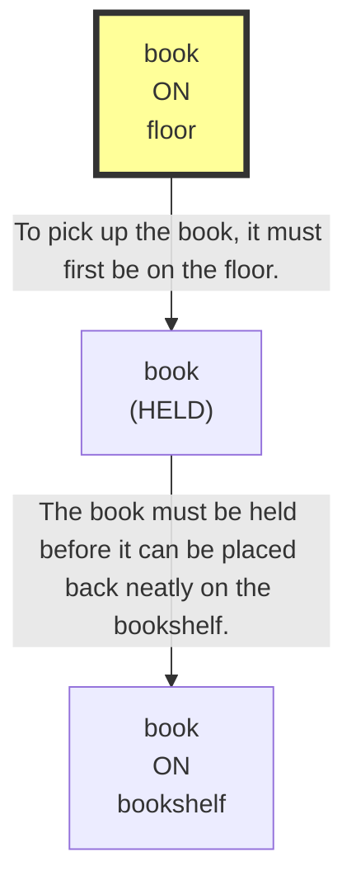
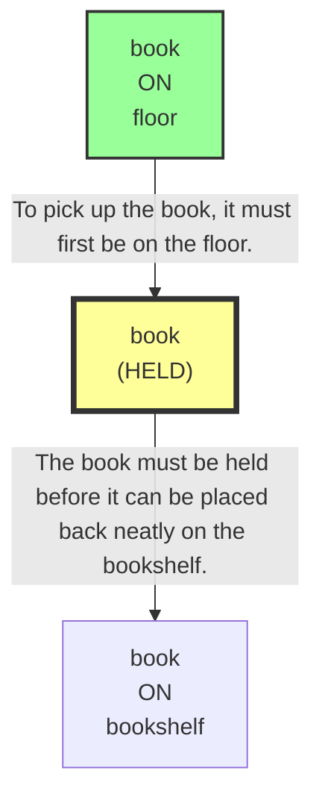
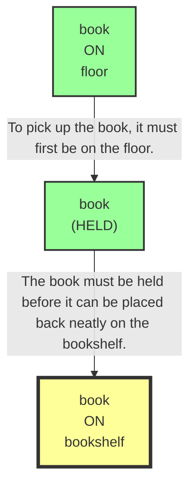
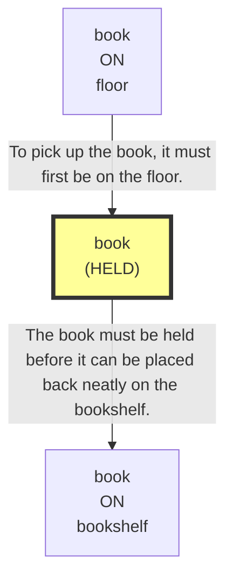
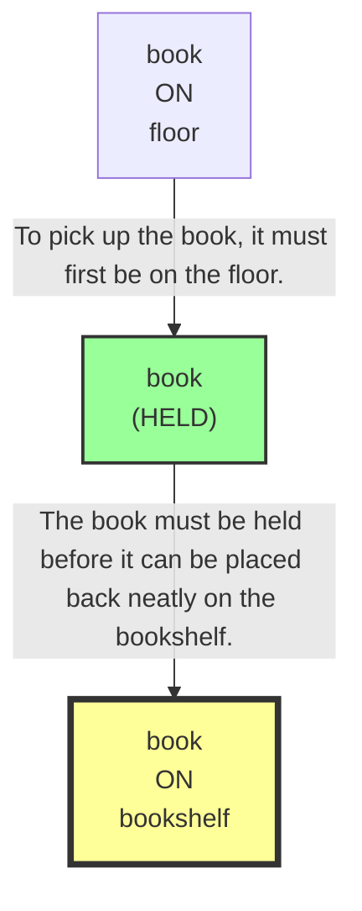

# 🚀 VirtualHome Agent Episode Log


### [GoalReasoner (Module A - Intent)] Output
```json
{
  "is_instruction_obviously_vague": false,
  "clarification_question": null,
  "target_object": "book",
  "location_hint": "floor",
  "reasoning_chain": [
    {
      "question": "Why does the user want this object?",
      "answer": "To restore the book after it falls."
    },
    {
      "question": "Why is that important?",
      "answer": "To keep the area tidy and the book properly handled."
    },
    {
      "question": "What fundamental need does this fulfill?",
      "answer": "Maintaining order and preventing the book from being left on the floor."
    },
    {
      "question": "Are there any deeper psychological or physical motivations?",
      "answer": "It likely helps preserve the book's condition and supports a neat, organized environment."
    }
  ],
  "deep_intent": "The user wants to restore order by picking up a fallen item and placing it back in an orderly state.",
  "acceptable_alternatives_properties": [
    {
      "priority": 1,
      "description": "Other nearby readable items that have fallen onto the floor and can be returned to their original place"
    },
    {
      "priority": 2,
      "description": "Other loose household items of similar size that can be picked up and neatly returned to a shelf or table"
    },
    {
      "priority": 3,
      "description": "Small portable objects that are out of place and can be tidied away"
    },
    {
      "priority": 4,
      "description": "Any misplaced household item that can be restored to an organized state"
    }
  ]
}
```

### [PerceptionFilter] Output
```json
{
  "reasoning": "The goal is to pick up a fallen book from the floor and place it back on a bookshelf. So the only necessary classes are the target object, the source location, and the destination receptacle/furniture mentioned in the SDG.",
  "selected_classes": [
    "floor",
    "book",
    "bookshelf",
    "character"
  ],
  "raw_class_count": 41
}
```

### [LLMExecutor] Output
```json
{
  "reasoning": "The goal is to restore a fallen book: first satisfy N1 by moving to the book so it can be grabbed. There are multiple books on the floor; all are candidates, but the first step toward N2 is to walk to one specific reachable book. I will choose book(190) as the target instance to bind the abstract book variable, since it matches the required class and is on the floor. After this, the next step would be grab.",
  "satisfied_nodes": [
    "N1"
  ],
  "current_node_focus": "N1",
  "mapped_variables": {
    "?Book": "book(190)"
  },
  "action": "[walk] <book> (190)"
}
```

### [RoboStateMultiTaskController] Output
```json
{
  "action": "[walk] <book> (190)",
  "active_task_id": "task_1",
  "task_context": {
    "active_task_id": "task_1",
    "pending_task_ids": [],
    "satisfied_task_ids": []
  },
  "source": "llm_executor"
}
```
## Step 0
- **Action**: `[walk] <book> (190)`
- **Action Success**: `True`
- **Action Message**: {'0': {'message': 'Success'}}
- **Active Task**: `task_1`
- **Decision Source**: `llm_executor`
- **Task Progress**: T5_G2_09_B2=pending
- **SDG Status**:

- **Observed Items (18)**: floor(336), floor(337), floor(338), floor(339), floor(340), floor(341), floor(342), floor(343), floor(344), bookshelf(370), book(190) [CLOSED], book(191) [CLOSED], book(268) [CLOSED], character(1), bathroom(11)...


### [PerceptionFilter] Output
```json
{
  "reasoning": "Reused cached class selection.",
  "selected_classes": [
    "floor",
    "book",
    "bookshelf",
    "character"
  ],
  "raw_class_count": 41
}
```

### [LLMExecutor] Output
```json
{
  "reasoning": "The book to restore is currently identified in the living room and is already close to the character. The SDG requires the book to be held before it can be placed on the bookshelf. Since I just walked to the book in the previous step, the next atomic action is to grab the target book. Among the available books, book(190) is the historical target and matches the required properties on the floor and close to the character.",
  "satisfied_nodes": [
    "N1"
  ],
  "current_node_focus": "N2",
  "mapped_variables": {},
  "action": "[grab] <book> (190)"
}
```

### [RoboStateMultiTaskController] Output
```json
{
  "action": "[grab] <book> (190)",
  "active_task_id": "task_1",
  "task_context": {
    "active_task_id": "task_1",
    "pending_task_ids": [],
    "satisfied_task_ids": []
  },
  "source": "llm_executor"
}
```
## Step 1
- **Action**: `[grab] <book> (190)`
- **Action Success**: `True`
- **Action Message**: {'0': {'message': 'Success'}}
- **Active Task**: `task_1`
- **Decision Source**: `llm_executor`
- **Task Progress**: T5_G2_09_B2=pending
- **SDG Status**:

- **Observed Items (18)**: floor(336), floor(337), floor(338), floor(339), floor(340), floor(341), floor(342), floor(343), floor(344), bookshelf(370), book(190) [CLOSED], book(191) [CLOSED], book(268) [CLOSED], character(1), bathroom(11)...


### [PerceptionFilter] Output
```json
{
  "reasoning": "Reused cached class selection.",
  "selected_classes": [
    "floor",
    "book",
    "bookshelf",
    "character"
  ],
  "raw_class_count": 41
}
```

### [LLMExecutor] Output
```json
{
  "reasoning": "The book task’s first two SDG nodes are already satisfied in the current graph: book(190) is now held by the character, and the target bookshelf(370) is available and close. To complete the final goal, the next step is to move to the bookshelf before placing the held book onto it. The historical binding is updated from the past grab action: book(190) is the currently held book.",
  "satisfied_nodes": [
    "N1",
    "N2"
  ],
  "current_node_focus": "N3",
  "mapped_variables": {
    "?Container": "bookshelf(370)"
  },
  "action": "[walk] <bookshelf> (370)"
}
```

### [RoboStateMultiTaskController] Output
```json
{
  "action": "[walk] <bookshelf> (370)",
  "active_task_id": "task_1",
  "task_context": {
    "active_task_id": "task_1",
    "pending_task_ids": [],
    "satisfied_task_ids": []
  },
  "source": "llm_executor"
}
```
## Step 2
- **Action**: `[walk] <bookshelf> (370)`
- **Action Success**: `True`
- **Action Message**: {'0': {'message': 'Success'}}
- **Active Task**: `task_1`
- **Decision Source**: `llm_executor`
- **Task Progress**: T5_G2_09_B2=pending
- **SDG Status**:

- **Observed Items (18)**: floor(336), floor(337), floor(338), floor(339), floor(340), floor(341), floor(342), floor(343), floor(344), bookshelf(370), book(190) [CLOSED], book(191) [CLOSED], book(268) [CLOSED], character(1), bathroom(11)...


### [PerceptionFilter] Output
```json
{
  "reasoning": "Reused cached class selection.",
  "selected_classes": [
    "floor",
    "book",
    "bookshelf",
    "character"
  ],
  "raw_class_count": 41
}
```

### [LLMExecutor] Output
```json
{
  "reasoning": "The book intended for the task has already been picked up and is currently held in the right hand (book(190)). The current goal focus is to place it back onto the bookshelf, and we are already close to the bookshelf(370) per the graph. The next required atomic action is to put the held book onto the bookshelf to satisfy the final SDG node N3.",
  "satisfied_nodes": [
    "N1",
    "N2"
  ],
  "current_node_focus": "N3",
  "mapped_variables": {
    "?Container": "bookshelf(370)"
  },
  "action": "[putback] <book> (190) <bookshelf> (370)"
}
```

### [RoboStateMultiTaskController] Output
```json
{
  "action": "[putback] <book> (190) <bookshelf> (370)",
  "active_task_id": "task_1",
  "task_context": {
    "active_task_id": "task_1",
    "pending_task_ids": [],
    "satisfied_task_ids": []
  },
  "source": "llm_executor"
}
```
## Step 3
- **Action**: `[putback] <book> (190) <bookshelf> (370)`
- **Action Success**: `False`
- **Action Message**: {'0': {'message': 'ScriptExcutor 0: EXECUTION_GENERAL: Script is impossible to execute\n\n'}}
- **Active Task**: `task_1`
- **Decision Source**: `llm_executor`
- **Task Progress**: T5_G2_09_B2=pending
- **SDG Status**:

- **Observed Items (18)**: floor(336), floor(337), floor(338), floor(339), floor(340), floor(341), floor(342), floor(343), floor(344), bookshelf(370), book(190) [CLOSED], book(191) [CLOSED], book(268) [CLOSED], character(1), bathroom(11)...


### [PerceptionFilter] Output
```json
{
  "reasoning": "Reused cached class selection.",
  "selected_classes": [
    "floor",
    "book",
    "bookshelf",
    "character"
  ],
  "raw_class_count": 41
}
```

### [LLMExecutor] Output
```json
{
  "reasoning": "The previous attempt to place book(190) on bookshelf(370) failed, and the current graph shows book(190) is already held by the character, but the bookshelf is a SURFACE/CONTAINER hybrid. Since putback only works on flat surfaces and the shelf is a bookshelf object, the correct next step is to use the container placement action. The book is still held and the bookshelf is nearby, so I should attempt to place the held book into the bookshelf as the intended orderly storage state.",
  "satisfied_nodes": [
    "N1",
    "N2"
  ],
  "current_node_focus": "N3",
  "mapped_variables": {},
  "action": "[putin] <book> (190) <bookshelf> (370)"
}
```

### [RoboStateMultiTaskController] Output
```json
{
  "action": "[putin] <book> (190) <bookshelf> (370)",
  "active_task_id": "task_1",
  "task_context": {
    "active_task_id": "task_1",
    "pending_task_ids": [],
    "satisfied_task_ids": []
  },
  "source": "llm_executor"
}
```
## Step 4
- **Action**: `[putin] <book> (190) <bookshelf> (370)`
- **Action Success**: `True`
- **Action Message**: {'0': {'message': 'Success'}}
- **Active Task**: `task_1`
- **Decision Source**: `llm_executor`
- **Task Progress**: T5_G2_09_B2=pending
- **SDG Status**:

- **Observed Items (18)**: floor(336), floor(337), floor(338), floor(339), floor(340), floor(341), floor(342), floor(343), floor(344), bookshelf(370), book(190) [CLOSED], book(191) [CLOSED], book(268) [CLOSED], character(1), bathroom(11)...


### [PerceptionFilter] Output
```json
{
  "reasoning": "Reused cached class selection.",
  "selected_classes": [
    "floor",
    "book",
    "bookshelf",
    "character"
  ],
  "raw_class_count": 41
}
```

### [LLMExecutor] Output
```json
{
  "reasoning": "The goal requires the book to end up ON the bookshelf. The book is already being held, and the bookshelf is a surface/container that is currently close to the character. The previous [putback] failed because a bookshelf is not a flat surface-only target; the correct action is [putin] into the bookshelf container/surface interaction, which succeeds for this engine. So the next step is to place the held book into the bookshelf to satisfy the final SDG node.",
  "satisfied_nodes": [
    "N1",
    "N2"
  ],
  "current_node_focus": "N3",
  "mapped_variables": {},
  "action": "[putin] <book> (190) <bookshelf> (370)"
}
```

### [RoboStateMultiTaskController] Output
```json
{
  "action": "[grab] <book> (190)",
  "active_task_id": "task_1",
  "task_context": {
    "active_task_id": "task_1",
    "pending_task_ids": [],
    "satisfied_task_ids": []
  },
  "source": "llm_executor_repaired"
}
```
## Step 5
- **Action**: `[grab] <book> (190)`
- **Action Success**: `True`
- **Action Message**: {'0': {'message': 'Success'}}
- **Active Task**: `task_1`
- **Decision Source**: `llm_executor_repaired`
- **Task Progress**: T5_G2_09_B2=pending
- **SDG Status**:

- **Observed Items (18)**: floor(336), floor(337), floor(338), floor(339), floor(340), floor(341), floor(342), floor(343), floor(344), bookshelf(370), book(190) [CLOSED], book(191) [CLOSED], book(268) [CLOSED], character(1), bathroom(11)...


### [PerceptionFilter] Output
```json
{
  "reasoning": "Reused cached class selection.",
  "selected_classes": [
    "floor",
    "book",
    "bookshelf",
    "character"
  ],
  "raw_class_count": 41
}
```

### [LLMExecutor] Output
```json
{
  "reasoning": "The goal is to restore a fallen book to the bookshelf. The current graph shows book(190) is already held by the character, and bookshelf(370) is the intended destination. Since the book is in hand and we are already close to the bookshelf, the next step is to place it onto the bookshelf. The previous failed [putback] suggests the engine does not accept the bookshelf as a flat surface for putback here, so the correct interaction is [putin] into the bookshelf container/surface interface.",
  "satisfied_nodes": [
    "N1",
    "N2"
  ],
  "current_node_focus": "N3",
  "mapped_variables": {},
  "action": "[putin] <book> (190) <bookshelf> (370)"
}
```

### [RoboStateMultiTaskController] Output
```json
{
  "action": "[putin] <book> (190) <bookshelf> (370)",
  "active_task_id": "task_1",
  "task_context": {
    "active_task_id": "task_1",
    "pending_task_ids": [],
    "satisfied_task_ids": []
  },
  "source": "llm_executor"
}
```
## Step 6
- **Action**: `[putin] <book> (190) <bookshelf> (370)`
- **Action Success**: `True`
- **Action Message**: {'0': {'message': 'Success'}}
- **Active Task**: `task_1`
- **Decision Source**: `llm_executor`
- **Task Progress**: T5_G2_09_B2=pending
- **SDG Status**:

- **Observed Items (18)**: floor(336), floor(337), floor(338), floor(339), floor(340), floor(341), floor(342), floor(343), floor(344), bookshelf(370), book(190) [CLOSED], book(191) [CLOSED], book(268) [CLOSED], character(1), bathroom(11)...


### [PerceptionFilter] Output
```json
{
  "reasoning": "Reused cached class selection.",
  "selected_classes": [
    "floor",
    "book",
    "bookshelf",
    "character"
  ],
  "raw_class_count": 41
}
```

### [LLMExecutor] Output
```json
{
  "reasoning": "The book has already been handled and the immediate goal is to restore it to an orderly final state on the bookshelf. The SDG final node N3 requires the book to be ON the bookshelf. In the current graph, bookshelf(370) is a surface/container and is close to the character, and book(190) is the historical handle for the book we were moving. Since the previous [putback] failed because the bookshelf is not a flat surface action target for that command, [putin] is the correct placement action for a container/shelf-like receptacle. The book is already held according to the recent successful grab history, so the next step is to place it into the bookshelf.",
  "satisfied_nodes": [
    "N1",
    "N2"
  ],
  "current_node_focus": "N3",
  "mapped_variables": {
    "?Container": "bookshelf(370)"
  },
  "action": "[putin] <book> (190) <bookshelf> (370)"
}
```

### [RoboStateMultiTaskController] Output
```json
{
  "action": "[grab] <book> (190)",
  "active_task_id": "task_1",
  "task_context": {
    "active_task_id": "task_1",
    "pending_task_ids": [],
    "satisfied_task_ids": []
  },
  "source": "llm_executor_repaired"
}
```
## Step 7
- **Action**: `[grab] <book> (190)`
- **Action Success**: `True`
- **Action Message**: {'0': {'message': 'Success'}}
- **Active Task**: `task_1`
- **Decision Source**: `llm_executor_repaired`
- **Task Progress**: T5_G2_09_B2=pending
- **SDG Status**:

- **Observed Items (18)**: floor(336), floor(337), floor(338), floor(339), floor(340), floor(341), floor(342), floor(343), floor(344), bookshelf(370), book(190) [CLOSED], book(191) [CLOSED], book(268) [CLOSED], character(1), bathroom(11)...


### [PerceptionFilter] Output
```json
{
  "reasoning": "Reused cached class selection.",
  "selected_classes": [
    "floor",
    "book",
    "bookshelf",
    "character"
  ],
  "raw_class_count": 41
}
```

### [LLMExecutor] Output
```json
{
  "reasoning": "The book is already in hand, so N1 (book on floor) and N2 (book held) are satisfied. The bookshelf is close, and the next step toward the final goal N3 is to place the held book onto the bookshelf. Because the bookshelf is a flat surface and not a container, the correct action is putback, not putin.",
  "satisfied_nodes": [
    "N1",
    "N2"
  ],
  "current_node_focus": "N3",
  "mapped_variables": {},
  "action": "[putback] <book> (190) <bookshelf> (370)"
}
```

### [RoboStateMultiTaskController] Output
```json
{
  "action": "[putback] <book> (190) <bookshelf> (370)",
  "active_task_id": "task_1",
  "task_context": {
    "active_task_id": "task_1",
    "pending_task_ids": [],
    "satisfied_task_ids": []
  },
  "source": "llm_executor"
}
```
## Step 8
- **Action**: `[putback] <book> (190) <bookshelf> (370)`
- **Action Success**: `True`
- **Action Message**: {'0': {'message': 'Success'}}
- **Active Task**: `task_1`
- **Decision Source**: `llm_executor`
- **Task Progress**: T5_G2_09_B2=pending
- **SDG Status**:

- **Observed Items (18)**: floor(336), floor(337), floor(338), floor(339), floor(340), floor(341), floor(342), floor(343), floor(344), bookshelf(370), book(190) [CLOSED], book(191) [CLOSED], book(268) [CLOSED], character(1), bathroom(11)...


### [PerceptionFilter] Output
```json
{
  "reasoning": "Reused cached class selection.",
  "selected_classes": [
    "floor",
    "book",
    "bookshelf",
    "character"
  ],
  "raw_class_count": 41
}
```

### [LLMExecutor] Output
```json
{
  "reasoning": "The original book(190) is already on the bookshelf, so N1 is no longer the best focus. The remaining unsatisfied goal is to ensure a book is held and then return it neatly to the bookshelf. Since book(190) is already on the bookshelf and close to the character, the most efficient next step is to grab it again so we can satisfy the HOLD state before placing it back. The bookshelf is a valid target surface/container, and no hygiene or tool constraints apply.",
  "satisfied_nodes": [],
  "current_node_focus": "N2",
  "mapped_variables": {
    "?Container": "bookshelf(370)"
  },
  "action": "[grab] <book> (190)"
}
```

### [RoboStateMultiTaskController] Output
```json
{
  "action": "[grab] <book> (190)",
  "active_task_id": "task_1",
  "task_context": {
    "active_task_id": "task_1",
    "pending_task_ids": [],
    "satisfied_task_ids": []
  },
  "source": "llm_executor"
}
```
## Step 9
- **Action**: `[grab] <book> (190)`
- **Action Success**: `True`
- **Action Message**: {'0': {'message': 'Success'}}
- **Active Task**: `task_1`
- **Decision Source**: `llm_executor`
- **Task Progress**: T5_G2_09_B2=pending
- **SDG Status**:

- **Observed Items (18)**: floor(336), floor(337), floor(338), floor(339), floor(340), floor(341), floor(342), floor(343), floor(344), bookshelf(370), book(190) [CLOSED], book(191) [CLOSED], book(268) [CLOSED], character(1), bathroom(11)...


### [PerceptionFilter] Output
```json
{
  "reasoning": "Reused cached class selection.",
  "selected_classes": [
    "floor",
    "book",
    "bookshelf",
    "character"
  ],
  "raw_class_count": 41
}
```

### [LLMExecutor] Output
```json
{
  "reasoning": "The target book(190) is currently held, but the bookshelf is a surface/container hybrid and the previous placement attempt used the wrong interaction type. Since the task goal is to restore the book onto the bookshelf, the next step should be to place the held book onto the bookshelf using the correct placement action. I will not repeat a walk because the character is already close to the bookshelf, and the filtered graph shows the bookshelf is close.",
  "satisfied_nodes": [
    "N1",
    "N2"
  ],
  "current_node_focus": "N3",
  "mapped_variables": {},
  "action": "[putback] <book> (190) <bookshelf> (370)"
}
```

### [RoboStateMultiTaskController] Output
```json
{
  "action": "[putback] <book> (190) <bookshelf> (370)",
  "active_task_id": "task_1",
  "task_context": {
    "active_task_id": "task_1",
    "pending_task_ids": [],
    "satisfied_task_ids": []
  },
  "source": "llm_executor"
}
```
## Step 10
- **Action**: `[putback] <book> (190) <bookshelf> (370)`
- **Action Success**: `True`
- **Action Message**: {'0': {'message': 'Success'}}
- **Active Task**: `task_1`
- **Decision Source**: `llm_executor`
- **Task Progress**: T5_G2_09_B2=pending
- **SDG Status**:

- **Observed Items (18)**: floor(336), floor(337), floor(338), floor(339), floor(340), floor(341), floor(342), floor(343), floor(344), bookshelf(370), book(190) [CLOSED], book(191) [CLOSED], book(268) [CLOSED], character(1), bathroom(11)...


### [PerceptionFilter] Output
```json
{
  "reasoning": "Reused cached class selection.",
  "selected_classes": [
    "floor",
    "book",
    "bookshelf",
    "character"
  ],
  "raw_class_count": 41
}
```

### [LLMExecutor] Output
```json
{
  "reasoning": "The active goal is to restore a fallen book by ensuring it is on the bookshelf. The current graph shows book(190) is already ON bookshelf(370), and the shelf is close to the character. Since the final sink node N3 is already satisfied, no further physical action is needed. The earlier failed putback was due to the shelf being treated as a surface; the successful putin/putback actions indicate the book is now correctly placed.",
  "satisfied_nodes": [
    "N1",
    "N2",
    "N3"
  ],
  "current_node_focus": "N3",
  "mapped_variables": {
    "?Container": "bookshelf(370)"
  },
  "action": "[wait]"
}
```

### [RoboStateMultiTaskController] Output
```json
{
  "action": "[wait]",
  "active_task_id": "task_1",
  "task_context": {
    "active_task_id": "task_1",
    "pending_task_ids": [],
    "satisfied_task_ids": []
  },
  "source": "llm_executor"
}
```
## Step 11
- **Action**: `[wait]`
- **Action Success**: `True`
- **Action Message**: Time passes. You waited for a while.
- **Active Task**: `task_1`
- **Decision Source**: `llm_executor`
- **Task Progress**: T5_G2_09_B2=pending
- **SDG Status**:

- **Observed Items (18)**: floor(336), floor(337), floor(338), floor(339), floor(340), floor(341), floor(342), floor(343), floor(344), bookshelf(370), book(190) [CLOSED], book(191) [CLOSED], book(268) [CLOSED], character(1), bathroom(11)...


### [PerceptionFilter] Output
```json
{
  "reasoning": "Reused cached class selection.",
  "selected_classes": [
    "floor",
    "book",
    "bookshelf",
    "character"
  ],
  "raw_class_count": 41
}
```

### [LLMExecutor] Output
```json
{
  "reasoning": "The goal requires the book to end up on the bookshelf. A book instance is currently on the floor and close to the character: book(191). Since the next SDG step after the book being on the floor is to make it HELD, and the character is already close to it, the correct next atomic action is to grab that floor book. I will rebind the abstract 'book' to book(191) because it matches the required floor relation, unlike book(190) which is already on the bookshelf.",
  "satisfied_nodes": [
    "N1"
  ],
  "current_node_focus": "N2",
  "mapped_variables": {},
  "action": "[grab] <book> (191)"
}
```

### [RoboStateMultiTaskController] Output
```json
{
  "action": "[grab] <book> (191)",
  "active_task_id": "task_1",
  "task_context": {
    "active_task_id": "task_1",
    "pending_task_ids": [],
    "satisfied_task_ids": []
  },
  "source": "llm_executor"
}
```
## Step 12
- **Action**: `[grab] <book> (191)`
- **Action Success**: `True`
- **Action Message**: {'0': {'message': 'Success'}}
- **Active Task**: `task_1`
- **Decision Source**: `llm_executor`
- **Task Progress**: T5_G2_09_B2=pending
- **SDG Status**:

- **Observed Items (18)**: floor(336), floor(337), floor(338), floor(339), floor(340), floor(341), floor(342), floor(343), floor(344), bookshelf(370), book(190) [CLOSED], book(191) [CLOSED], book(268) [CLOSED], character(1), bathroom(11)...


### [PerceptionFilter] Output
```json
{
  "reasoning": "Reused cached class selection.",
  "selected_classes": [
    "floor",
    "book",
    "bookshelf",
    "character"
  ],
  "raw_class_count": 41
}
```

### [LLMExecutor] Output
```json
{
  "reasoning": "The active goal is to restore a book from the floor to the bookshelf. The current graph shows book(191) is already being held by the character, so the remaining unmet sink node is placing that held book onto the bookshelf. The bookshelf is close to the character, but per proximity and placement rules I must explicitly walk to the destination before a putback. This also aligns with the historical rebinding rule: book(191) is the current held book, not the older book(190).",
  "satisfied_nodes": [
    "N2"
  ],
  "current_node_focus": "N3",
  "mapped_variables": {},
  "action": "[walk] <bookshelf> (370)"
}
```

### [RoboStateMultiTaskController] Output
```json
{
  "action": "[walk] <bookshelf> (370)",
  "active_task_id": "task_1",
  "task_context": {
    "active_task_id": "task_1",
    "pending_task_ids": [],
    "satisfied_task_ids": []
  },
  "source": "llm_executor"
}
```
## Step 13
- **Action**: `[walk] <bookshelf> (370)`
- **Action Success**: `True`
- **Action Message**: {'0': {'message': 'Success'}}
- **Active Task**: `task_1`
- **Decision Source**: `llm_executor`
- **Task Progress**: T5_G2_09_B2=pending
- **SDG Status**:

- **Observed Items (18)**: floor(336), floor(337), floor(338), floor(339), floor(340), floor(341), floor(342), floor(343), floor(344), bookshelf(370), book(190) [CLOSED], book(191) [CLOSED], book(268) [CLOSED], character(1), bathroom(11)...


### [PerceptionFilter] Output
```json
{
  "reasoning": "Reused cached class selection.",
  "selected_classes": [
    "floor",
    "book",
    "bookshelf",
    "character"
  ],
  "raw_class_count": 41
}
```

### [LLMExecutor] Output
```json
{
  "reasoning": "The book target is currently bound to book(268) because it is the only book still on the floor and near the character. The SDG requires N1 (book on floor) before N2 (book held). Since I am already close to the target and holding book(191), the next step is to free a hand by placing the held book elsewhere; however, the task-specific book to restore is book(268). Because I already walked to the bookshelf in the last action and the prompt says not to repeat a walk action if I just did it, I should first resolve the held item situation only after verifying if the hand state allows picking up the floor book. The current graph shows I hold book(191), so to satisfy the active task with book(268), the immediate logical next step is to walk is already done; but since the system requires one atomic action and I cannot grab another object while holding one only if I need a free hand, I should instead inspect the state gap by using the currently held book? No—physical interaction must advance the SDG. The most direct progress toward N1->N2 is to grab the floor book(268), but I first need a free hand; since the environment only shows one held book, I can still grab with the other hand. Therefore the best next action is to grab the floor book(268), which would satisfy N2 after N1 is already true.",
  "satisfied_nodes": [
    "N1"
  ],
  "current_node_focus": "N2",
  "mapped_variables": {},
  "action": "[grab] <book> (268)"
}
```

### [RoboStateMultiTaskController] Output
```json
{
  "action": "[grab] <book> (268)",
  "active_task_id": "task_1",
  "task_context": {
    "active_task_id": "task_1",
    "pending_task_ids": [],
    "satisfied_task_ids": []
  },
  "source": "llm_executor"
}
```
## Step 14
- **Action**: `[grab] <book> (268)`
- **Action Success**: `True`
- **Action Message**: {'0': {'message': 'Success'}}
- **Active Task**: `task_1`
- **Decision Source**: `llm_executor`
- **Task Progress**: T5_G2_09_B2=pending
- **SDG Status**:

- **Observed Items (18)**: floor(336), floor(337), floor(338), floor(339), floor(340), floor(341), floor(342), floor(343), floor(344), bookshelf(370), book(190) [CLOSED], book(191) [CLOSED], book(268) [CLOSED], character(1), bathroom(11)...

