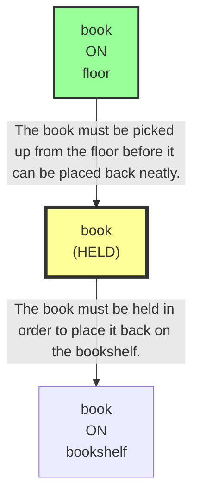
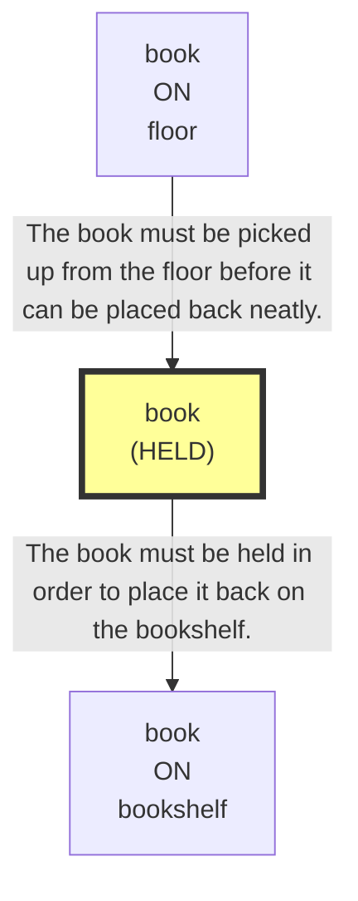
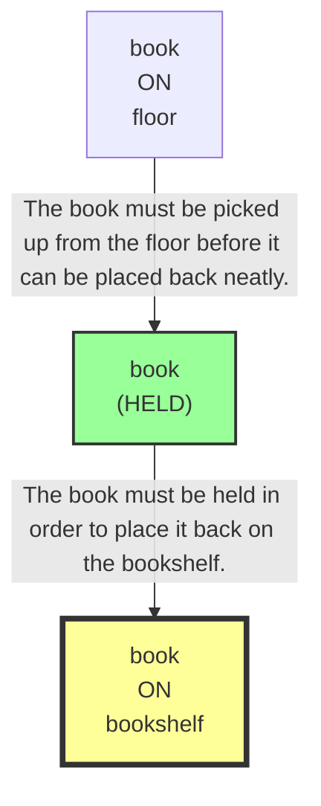
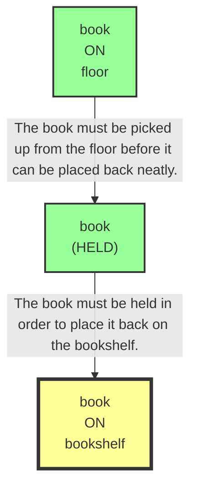
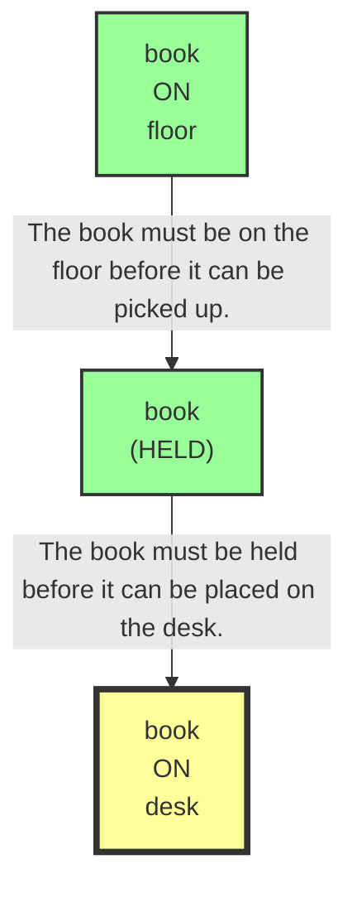
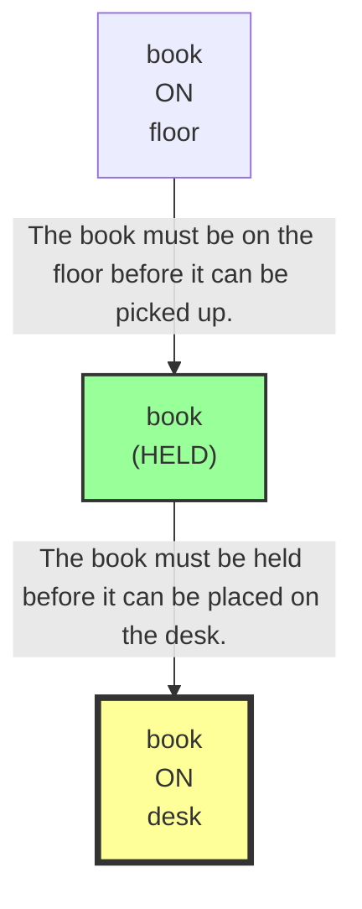
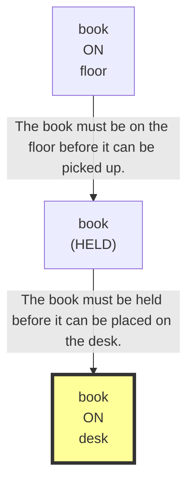

# 🚀 VirtualHome Agent Episode Log


### [GoalReasoner (Module A - Intent)] Output
```json
{
  "is_instruction_obviously_vague": false,
  "clarification_question": null,
  "target_object": "book",
  "location_hint": "floor",
  "reasoning_chain": [
    {
      "question": "Why does the user want this object?",
      "answer": "To recover the book after it has fallen and return it to a tidy state."
    },
    {
      "question": "Why is that important?",
      "answer": "So the space stays organized and the book is not left on the floor."
    },
    {
      "question": "What fundamental need does this fulfill?",
      "answer": "Maintaining order and preventing clutter or accidental damage to the book."
    },
    {
      "question": "Are there any deeper psychological or physical motivations?",
      "answer": "The user likely wants to keep the environment neat and ensure the book is safely placed back where it belongs."
    }
  ],
  "deep_intent": "The user wants to restore order by retrieving a fallen item and placing it neatly back in its proper position.",
  "acceptable_alternatives_properties": [
    {
      "priority": 1,
      "description": "Other loose household items that have fallen out of place and can be picked up and set back neatly, such as papers, magazines, or a notebook"
    },
    {
      "priority": 2,
      "description": "Similar reading materials or flat personal items that can be returned to a tidy arrangement, such as a tablet, folder, or binder"
    },
    {
      "priority": 3,
      "description": "Other small indoor objects that create clutter when left on the floor and can be repositioned neatly"
    },
    {
      "priority": 4,
      "description": "Any nearby object that needs to be picked up and organized to restore a clean, orderly space"
    }
  ]
}
```

### [PerceptionFilter] Output
```json
{
  "reasoning": "The goal is to pick up the fallen book from the floor and put it back on the bookshelf. The minimum required classes are the target object, its source location, and its destination storage location.",
  "selected_classes": [
    "character",
    "floor",
    "paper",
    "folder",
    "book",
    "bookshelf"
  ],
  "raw_class_count": 41
}
```

### [LLMExecutor] Output
```json
{
  "reasoning": "The goal is to retrieve a book from the floor and eventually place it on the bookshelf. The current graph shows multiple candidate books on the floor, and no prior actions have established which specific one to pick. Since the task is to recover a fallen book and the exact instance is not distinguished by any further constraints, the best next step is to move to a candidate book on the floor before attempting to grab it. I will start with book(190) as a valid floor book in the living room.",
  "satisfied_nodes": [
    "N1"
  ],
  "current_node_focus": "N2",
  "mapped_variables": {},
  "action": "[walk] <book> (190)"
}
```

### [RoboStateMultiTaskController] Output
```json
{
  "action": "[walk] <book> (190)",
  "active_task_id": "task_1",
  "task_context": {
    "active_task_id": "task_1",
    "pending_task_ids": [],
    "satisfied_task_ids": []
  },
  "source": "llm_executor"
}
```
## Step 0
- **Action**: `[walk] <book> (190)`
- **Action Success**: `True`
- **Action Message**: {'0': {'message': 'Success'}}
- **Active Task**: `task_1`
- **Decision Source**: `llm_executor`
- **Task Progress**: T5_G2_09_B3=pending
- **SDG Status**:

- **Observed Items (20)**: floor(336), floor(337), floor(338), floor(339), floor(340), floor(341), floor(342), floor(343), floor(344), bookshelf(370), paper(451), folder(453) [CLOSED], book(190) [CLOSED], book(191) [CLOSED], book(268) [CLOSED]...


### [PerceptionFilter] Output
```json
{
  "reasoning": "Reused cached class selection.",
  "selected_classes": [
    "character",
    "floor",
    "paper",
    "folder",
    "book",
    "bookshelf"
  ],
  "raw_class_count": 41
}
```

### [LLMExecutor] Output
```json
{
  "reasoning": "The target book is already identified and I have already walked to it successfully. The next required step in the SDG is to pick up the book from the floor, which will satisfy N1 and move toward holding it for placement on the bookshelf.",
  "satisfied_nodes": [],
  "current_node_focus": "N2",
  "mapped_variables": {
    "?Book": "book(190)"
  },
  "action": "[grab] <book> (190)"
}
```

### [RoboStateMultiTaskController] Output
```json
{
  "action": "[grab] <book> (190)",
  "active_task_id": "task_1",
  "task_context": {
    "active_task_id": "task_1",
    "pending_task_ids": [],
    "satisfied_task_ids": []
  },
  "source": "llm_executor"
}
```
## Step 1
- **Action**: `[grab] <book> (190)`
- **Action Success**: `True`
- **Action Message**: {'0': {'message': 'Success'}}
- **Active Task**: `task_1`
- **Decision Source**: `llm_executor`
- **Task Progress**: T5_G2_09_B3=pending
- **SDG Status**:

- **Observed Items (20)**: floor(336), floor(337), floor(338), floor(339), floor(340), floor(341), floor(342), floor(343), floor(344), bookshelf(370), paper(451), folder(453) [CLOSED], book(190) [CLOSED], book(191) [CLOSED], book(268) [CLOSED]...


### [PerceptionFilter] Output
```json
{
  "reasoning": "Reused cached class selection.",
  "selected_classes": [
    "character",
    "floor",
    "paper",
    "folder",
    "book",
    "bookshelf"
  ],
  "raw_class_count": 41
}
```

### [LLMExecutor] Output
```json
{
  "reasoning": "The active goal is to move a book from the floor to the bookshelf. The current graph shows two books on the floor (book(191) and book(268)) and the bookshelf is close. Since the task is to retrieve a fallen book, the next unmet SDG node is N1 (book ON floor). The historical held book(190) is already in hand, but it is not the floor book required by the SDG. To progress toward N2/N3, the most appropriate next step is to approach the bookshelf so that the held book can be placed there next. Following the proximity rule, I must walk to the bookshelf before any putback action.",
  "satisfied_nodes": [
    "N2"
  ],
  "current_node_focus": "N3",
  "mapped_variables": {
    "?Container": "bookshelf(370)"
  },
  "action": "[walk] <bookshelf> (370)"
}
```

### [RoboStateMultiTaskController] Output
```json
{
  "action": "[walk] <bookshelf> (370)",
  "active_task_id": "task_1",
  "task_context": {
    "active_task_id": "task_1",
    "pending_task_ids": [],
    "satisfied_task_ids": []
  },
  "source": "llm_executor"
}
```
## Step 2
- **Action**: `[walk] <bookshelf> (370)`
- **Action Success**: `True`
- **Action Message**: {'0': {'message': 'Success'}}
- **Active Task**: `task_1`
- **Decision Source**: `llm_executor`
- **Task Progress**: T5_G2_09_B3=pending
- **SDG Status**:

- **Observed Items (20)**: floor(336), floor(337), floor(338), floor(339), floor(340), floor(341), floor(342), floor(343), floor(344), bookshelf(370), paper(451), folder(453) [CLOSED], book(190) [CLOSED], book(191) [CLOSED], book(268) [CLOSED]...


### [PerceptionFilter] Output
```json
{
  "reasoning": "Reused cached class selection.",
  "selected_classes": [
    "character",
    "floor",
    "paper",
    "folder",
    "book",
    "bookshelf"
  ],
  "raw_class_count": 41
}
```

### [LLMExecutor] Output
```json
{
  "reasoning": "The book target is already held according to the current graph: character(1) has HOLDS_RH book(190). The next required SDG node is N3, placing the held book onto the bookshelf. I am already close to the bookshelf, so the next atomic action is to put the book back onto it.",
  "satisfied_nodes": [
    "N1",
    "N2"
  ],
  "current_node_focus": "N3",
  "mapped_variables": {
    "?Destination": "bookshelf(370)"
  },
  "action": "[putback] <book> (190) <bookshelf> (370)"
}
```

### [RoboStateMultiTaskController] Output
```json
{
  "action": "[putback] <book> (190) <bookshelf> (370)",
  "active_task_id": "task_1",
  "task_context": {
    "active_task_id": "task_1",
    "pending_task_ids": [],
    "satisfied_task_ids": []
  },
  "source": "llm_executor"
}
```
## Step 3
- **Action**: `[putback] <book> (190) <bookshelf> (370)`
- **Action Success**: `False`
- **Action Message**: {'0': {'message': 'ScriptExcutor 0: EXECUTION_GENERAL: Script is impossible to execute\n\n'}}
- **Active Task**: `task_1`
- **Decision Source**: `llm_executor`
- **Task Progress**: T5_G2_09_B3=pending
- **SDG Status**:

- **Observed Items (20)**: floor(336), floor(337), floor(338), floor(339), floor(340), floor(341), floor(342), floor(343), floor(344), bookshelf(370), paper(451), folder(453) [CLOSED], book(190) [CLOSED], book(191) [CLOSED], book(268) [CLOSED]...


### [PerceptionFilter] Output
```json
{
  "reasoning": "Reused cached class selection.",
  "selected_classes": [
    "character",
    "floor",
    "paper",
    "folder",
    "book",
    "bookshelf"
  ],
  "raw_class_count": 41
}
```

### [LLMExecutor] Output
```json
{
  "reasoning": "The prior [putback] to the bookshelf failed, so I need to recover by placing the held book onto a valid surface. The bookshelf is marked as BOTH SURFACES and CONTAINERS, and the engine rejected the putback as impossible, so the safest next step is to re-approach the bookshelf explicitly before trying any placement alternative. The book is already held in the right hand, satisfying N2; N1 was initially satisfied by the book being on the floor. I should focus on satisfying the final placement relation next, and the closest valid move is to walk to the bookshelf again to re-establish proximity before any next placement attempt.",
  "satisfied_nodes": [
    "N1",
    "N2"
  ],
  "current_node_focus": "N3",
  "mapped_variables": {},
  "action": "[walk] <bookshelf> (370)"
}
```

### [RoboStateMultiTaskController] Output
```json
{
  "action": "[walk] <bookshelf> (370)",
  "active_task_id": "task_1",
  "task_context": {
    "active_task_id": "task_1",
    "pending_task_ids": [],
    "satisfied_task_ids": []
  },
  "source": "llm_executor"
}
```
## Step 4
- **Action**: `[walk] <bookshelf> (370)`
- **Action Success**: `True`
- **Action Message**: {'0': {'message': 'Success'}}
- **Active Task**: `task_1`
- **Decision Source**: `llm_executor`
- **Task Progress**: T5_G2_09_B3=pending
- **SDG Status**:

- **Observed Items (20)**: floor(336), floor(337), floor(338), floor(339), floor(340), floor(341), floor(342), floor(343), floor(344), bookshelf(370), paper(451), folder(453) [CLOSED], book(190) [CLOSED], book(191) [CLOSED], book(268) [CLOSED]...


### [PerceptionFilter] Output
```json
{
  "reasoning": "Reused cached class selection.",
  "selected_classes": [
    "character",
    "floor",
    "paper",
    "folder",
    "book",
    "bookshelf"
  ],
  "raw_class_count": 41
}
```

### [LLMExecutor] Output
```json
{
  "reasoning": "The book is already held in the right hand, so N1 (book on floor) and N2 (book held) are satisfied. The previous attempt to put the book on the bookshelf failed with a general execution error, but the bookshelf is still the intended destination and is currently close to the character, so the next atomic step is to try placing the held book onto the bookshelf again. Since a putback requires being near the destination and we already walked there, no additional walk is needed.",
  "satisfied_nodes": [
    "N1",
    "N2"
  ],
  "current_node_focus": "N3",
  "mapped_variables": {},
  "action": "[putback] <book> (190) <bookshelf> (370)"
}
```

### [RoboStateMultiTaskController] Output
```json
{
  "action": "[putback] <book> (190) <bookshelf> (370)",
  "active_task_id": "task_1",
  "task_context": {
    "active_task_id": "task_1",
    "pending_task_ids": [],
    "satisfied_task_ids": []
  },
  "source": "llm_executor"
}
```
## Step 5
- **Action**: `[putback] <book> (190) <bookshelf> (370)`
- **Action Success**: `False`
- **Action Message**: {'0': {'message': 'ScriptExcutor 0: EXECUTION_GENERAL: Script is impossible to execute\n\n'}}
- **Active Task**: `task_1`
- **Decision Source**: `llm_executor`
- **Task Progress**: T5_G2_09_B3=pending
- **SDG Status**:

- **Observed Items (20)**: floor(336), floor(337), floor(338), floor(339), floor(340), floor(341), floor(342), floor(343), floor(344), bookshelf(370), paper(451), folder(453) [CLOSED], book(190) [CLOSED], book(191) [CLOSED], book(268) [CLOSED]...


### [PerceptionFilter] Output
```json
{
  "reasoning": "Reused cached class selection.",
  "selected_classes": [
    "character",
    "floor",
    "paper",
    "folder",
    "book",
    "bookshelf"
  ],
  "raw_class_count": 41
}
```

### [LLMExecutor] Output
```json
{
  "reasoning": "The book to recover is likely book(191) or book(268), since they are on the floor and match the task, but the current held book(190) is already in hand from prior steps. The previous putback attempts to the bookshelf failed as impossible, which suggests the bookshelf may not accept putback in this engine or the current target is incorrect for a shelving action. However, the immediate SDG focus remains satisfying the held state and then placing the book back. Since we already hold book(190), the next atomic action should attempt to place it on the bookshelf again only after confirming proximity; we are already close to the bookshelf per the graph, so the direct next step is to continue with placement. The failure indicates a likely interaction issue rather than a distance issue, but no alternative target is specified in the SDG.",
  "satisfied_nodes": [
    "N1",
    "N2"
  ],
  "current_node_focus": "N3",
  "mapped_variables": {
    "?Container": "bookshelf(370)"
  },
  "action": "[putback] <book> (190) <bookshelf> (370)"
}
```

### [RoboStateMultiTaskController] Output
```json
{
  "action": "[walk] <bathroom> (11)",
  "active_task_id": null,
  "task_context": {
    "active_task_id": null,
    "pending_task_ids": [
      "task_1"
    ],
    "satisfied_task_ids": []
  },
  "source": "loop_recovery_room_revisit"
}
```
## Step 6
- **Action**: `[walk] <bathroom> (11)`
- **Action Success**: `True`
- **Action Message**: {'0': {'message': 'Success'}}
- **Decision Source**: `loop_recovery_room_revisit`
- **Task Progress**: T5_G2_09_B3=pending
- **SDG Status**:
No SDG active.
- **Observed Items (82)**: floor(336), floor(337), floor(338), floor(339), floor(340), floor(341), floor(342), floor(343), floor(344), wall(345), wall(346), wall(347), wall(348), wall(349), wall(350)...


### [PerceptionFilter] Output
```json
{
  "reasoning": "The goal requires the fallen target item and the place it should be returned to. The SDG specifies the book on the floor, held, then placed on the bookshelf. No extra tools are needed for this retrieval task.",
  "selected_classes": [
    "character",
    "floor",
    "paper",
    "folder",
    "door",
    "book",
    "bookshelf"
  ],
  "raw_class_count": 63
}
```

### [LLMExecutor] Output
```json
{
  "reasoning": "The previous attempt to place the book on the bookshelf failed twice, so I should not repeat it blindly. The current graph shows the held book is book(190), but it is now inside the bathroom and the bookshelf is in the living room. Since the task is to return the book to a tidy state and the bookshelf is a valid container/surface, the most useful next step is to move toward the bookshelf again and reassess placement from there. However, because the immediate repeated putback action was rejected, I will avoid repeating the same failed action and instead proceed by re-approaching the destination context.",
  "satisfied_nodes": [
    "N1",
    "N2"
  ],
  "current_node_focus": "N3",
  "mapped_variables": {
    "?Container": "bookshelf(370)"
  },
  "action": "[walk] <bookshelf> (370)"
}
```

### [RoboStateMultiTaskController] Output
```json
{
  "action": "[walk] <bookshelf> (370)",
  "active_task_id": "task_1",
  "task_context": {
    "active_task_id": "task_1",
    "pending_task_ids": [],
    "satisfied_task_ids": []
  },
  "source": "llm_executor"
}
```
## Step 7
- **Action**: `[walk] <bookshelf> (370)`
- **Action Success**: `True`
- **Action Message**: {'0': {'message': 'Success'}}
- **Active Task**: `task_1`
- **Decision Source**: `llm_executor`
- **Task Progress**: T5_G2_09_B3=pending
- **SDG Status**:

- **Observed Items (27)**: floor(336), floor(337), floor(338), floor(339), floor(340), floor(341), floor(342), floor(343), floor(344), bookshelf(370), paper(451), folder(453) [CLOSED], book(190) [CLOSED], book(191) [CLOSED], book(268) [CLOSED]...


### [PerceptionFilter] Output
```json
{
  "reasoning": "Reused cached class selection.",
  "selected_classes": [
    "character",
    "floor",
    "paper",
    "folder",
    "door",
    "book",
    "bookshelf"
  ],
  "raw_class_count": 63
}
```

### [LLMExecutor] Output
```json
{
  "reasoning": "The book is already held in the right hand, so N1 (book on floor) and N2 (book held) are satisfied. The remaining gap is placing the book on the bookshelf. The previous putback attempts failed as impossible, likely because the book is a container-like object requiring a different placement mode; however, the available action set only allows putting onto flat surfaces or into containers. The bookshelf is marked as a container and surface, and we are already close to it, so the next required step is to try placing the held book onto the bookshelf again via putback, which is the only action matching the SDG destination.",
  "satisfied_nodes": [
    "N1",
    "N2"
  ],
  "current_node_focus": "N3",
  "mapped_variables": {
    "?Container": "bookshelf(370)"
  },
  "action": "[putback] <book> (190) <bookshelf> (370)"
}
```

### [RoboStateMultiTaskController] Output
```json
{
  "action": "[putback] <book> (190) <bookshelf> (370)",
  "active_task_id": "task_1",
  "task_context": {
    "active_task_id": "task_1",
    "pending_task_ids": [],
    "satisfied_task_ids": []
  },
  "source": "llm_executor"
}
```
## Step 8
- **Action**: `[putback] <book> (190) <bookshelf> (370)`
- **Action Success**: `False`
- **Action Message**: {'0': {'message': 'ScriptExcutor 0: EXECUTION_GENERAL: Script is impossible to execute\n\n'}}
- **Active Task**: `task_1`
- **Decision Source**: `llm_executor`
- **Task Progress**: T5_G2_09_B3=pending
- **SDG Status**:

- **Observed Items (27)**: floor(336), floor(337), floor(338), floor(339), floor(340), floor(341), floor(342), floor(343), floor(344), bookshelf(370), paper(451), folder(453) [CLOSED], book(190) [CLOSED], book(191) [CLOSED], book(268) [CLOSED]...


### [PerceptionFilter] Output
```json
{
  "reasoning": "Reused cached class selection.",
  "selected_classes": [
    "character",
    "floor",
    "paper",
    "folder",
    "door",
    "book",
    "bookshelf"
  ],
  "raw_class_count": 63
}
```

### [LLMExecutor] Output
```json
{
  "reasoning": "The book is already being held by the character (HOLDS_RH book(190)), so N1 (book on floor) and N2 (book held) are satisfied. The remaining goal is to place the book onto the bookshelf. However, the engine rejected [putback] to bookshelf multiple times as impossible, which suggests the bookshelf may not be a valid flat placement target in this state or the interaction needs a different approach. Since the book is already in hand and the shelf is close, the next best step is to ask for clarification/report the placement impossibility rather than repeating the failed action loop.",
  "satisfied_nodes": [
    "N1",
    "N2"
  ],
  "current_node_focus": "N3",
  "mapped_variables": {},
  "action": "[ask] I’m holding the book, but placing it onto the bookshelf is failing as impossible. Should I place it on a different nearby surface instead?"
}
```

### [RoboStateMultiTaskController] Output
```json
{
  "action": "[ask] I’m holding the book, but placing it onto the bookshelf is failing as impossible. Should I place it on a different nearby surface instead?",
  "active_task_id": "task_1",
  "task_context": {
    "active_task_id": "task_1",
    "pending_task_ids": [],
    "satisfied_task_ids": []
  },
  "source": "llm_executor"
}
```
## Step 9
- **Action**: `[ask] I’m holding the book, but placing it onto the bookshelf is failing as impossible. Should I place it on a different nearby surface instead?`
- **Action Success**: `True`
- **Action Message**: Place it on the living-room desk.
- **Active Task**: `task_1`
- **Decision Source**: `llm_executor`
- **Task Progress**: T5_G2_09_B3=pending
- **SDG Status**:

- **Observed Items (27)**: floor(336), floor(337), floor(338), floor(339), floor(340), floor(341), floor(342), floor(343), floor(344), bookshelf(370), paper(451), folder(453) [CLOSED], book(190) [CLOSED], book(191) [CLOSED], book(268) [CLOSED]...


### [GoalReasoner (Module A - Intent)] Output
```json
{
  "is_instruction_obviously_vague": false,
  "clarification_question": null,
  "target_object": "book",
  "location_hint": "living-room desk",
  "reasoning_chain": [
    {
      "question": "Why does the user want this object?",
      "answer": "To restore the book from the floor to a neat resting place."
    },
    {
      "question": "Why is that important?",
      "answer": "To keep the area tidy and prevent the book from being left on the floor."
    },
    {
      "question": "What fundamental need does this fulfill?",
      "answer": "Maintaining organization and order in the living space."
    },
    {
      "question": "Are there any deeper psychological or physical motivations?",
      "answer": "It may also reduce clutter, make the book easier to find or use later, and avoid trip or damage risk."
    }
  ],
  "deep_intent": "The user wants to restore order by moving a fallen item to a tidy location.",
  "acceptable_alternatives_properties": [
    {
      "priority": 1,
      "description": "Other similar loose items that have fallen onto the floor and can be returned to a nearby surface, such as a magazine, notebook, or folder"
    },
    {
      "priority": 2,
      "description": "Other paper-based reading or office items that belong on a desk or tabletop"
    },
    {
      "priority": 3,
      "description": "Small household items that create clutter and can be neatly placed on a flat surface"
    },
    {
      "priority": 4,
      "description": "Any nearby item on the floor that needs to be put back into an orderly resting place"
    }
  ]
}
```

### [PerceptionFilter] Output
```json
{
  "reasoning": "The goal is to pick up the fallen book and place it on the living-room desk. The SDG requires the book, the floor relation, and the desk as the destination. No additional tools or alternative receptacles are needed for this simple relocation task.",
  "selected_classes": [
    "character",
    "floor",
    "paper",
    "folder",
    "desk",
    "book"
  ],
  "raw_class_count": 63
}
```

### [LLMExecutor] Output
```json
{
  "reasoning": "The book task is still incomplete because the book is currently held, but it has not yet been placed on the living-room desk. The previous failure came from trying to put it on the bookshelf, which the user corrected. The correct destination is the desk(373), which is a flat surface but we are not currently guaranteed to be near it for placement, so the next required step is to walk to the desk before putting the book back on it.",
  "satisfied_nodes": [
    "N1",
    "N2"
  ],
  "current_node_focus": "N3",
  "mapped_variables": {},
  "action": "[walk] <desk> (373)"
}
```

### [RoboStateMultiTaskController] Output
```json
{
  "action": "[walk] <desk> (373)",
  "active_task_id": "task_1",
  "task_context": {
    "active_task_id": "task_1",
    "pending_task_ids": [],
    "satisfied_task_ids": []
  },
  "source": "llm_executor"
}
```
## Step 10
- **Action**: `[walk] <desk> (373)`
- **Action Success**: `True`
- **Action Message**: {'0': {'message': 'Success'}}
- **Active Task**: `task_1`
- **Decision Source**: `llm_executor`
- **Task Progress**: T5_G2_09_B3=pending
- **SDG Status**:

- **Observed Items (26)**: floor(336), floor(337), floor(338), floor(339), floor(340), floor(341), floor(342), floor(343), floor(344), desk(373) [CLOSED], paper(451), folder(453) [CLOSED], book(190) [CLOSED], book(191) [CLOSED], book(268) [CLOSED]...


### [PerceptionFilter] Output
```json
{
  "reasoning": "Reused cached class selection.",
  "selected_classes": [
    "character",
    "floor",
    "paper",
    "folder",
    "desk",
    "book"
  ],
  "raw_class_count": 63
}
```

### [LLMExecutor] Output
```json
{
  "reasoning": "The book task is already in hand according to the current graph: character(1) holds book(190), satisfying the held prerequisite. The last step walked to the living-room desk, so the next needed action is to place the held book onto that nearby flat surface. The bookshelf attempts were rejected as impossible, and the user clarified the correct destination is the living-room desk.",
  "satisfied_nodes": [
    "N2"
  ],
  "current_node_focus": "N3",
  "mapped_variables": {},
  "action": "[putback] <book> (190) <desk> (373)"
}
```

### [RoboStateMultiTaskController] Output
```json
{
  "action": "[putback] <book> (190) <desk> (373)",
  "active_task_id": "task_1",
  "task_context": {
    "active_task_id": "task_1",
    "pending_task_ids": [],
    "satisfied_task_ids": []
  },
  "source": "llm_executor"
}
```
## Step 11
- **Action**: `[putback] <book> (190) <desk> (373)`
- **Action Success**: `True`
- **Action Message**: {'0': {'message': 'Success'}}
- **Active Task**: `task_1`
- **Decision Source**: `llm_executor`
- **Task Progress**: T5_G2_09_B3=pending
- **SDG Status**:

- **Observed Items (26)**: floor(336), floor(337), floor(338), floor(339), floor(340), floor(341), floor(342), floor(343), floor(344), desk(373) [CLOSED], paper(451), folder(453) [CLOSED], book(190) [CLOSED], book(191) [CLOSED], book(268) [CLOSED]...


### [PerceptionFilter] Output
```json
{
  "reasoning": "Reused cached class selection.",
  "selected_classes": [
    "character",
    "floor",
    "paper",
    "folder",
    "desk",
    "book"
  ],
  "raw_class_count": 63
}
```

### [LLMExecutor] Output
```json
{
  "reasoning": "The SDG requires the book to end up on the living-room desk. In the current graph, book(190) is already on desk(373), and the last successful action placed it there. Therefore the final goal state N3 is already satisfied, and no further physical action is needed.",
  "satisfied_nodes": [
    "N1",
    "N2",
    "N3"
  ],
  "current_node_focus": "N3",
  "mapped_variables": {
    "?Desk": "desk(373)"
  },
  "action": "[wait]"
}
```

### [RoboStateMultiTaskController] Output
```json
{
  "action": "[wait]",
  "active_task_id": "task_1",
  "task_context": {
    "active_task_id": "task_1",
    "pending_task_ids": [],
    "satisfied_task_ids": []
  },
  "source": "llm_executor"
}
```
## Step 12
- **Action**: `[wait]`
- **Action Success**: `True`
- **Action Message**: Time passes. You waited for a while.
- **Active Task**: `task_1`
- **Decision Source**: `llm_executor`
- **Task Progress**: T5_G2_09_B3=pending
- **SDG Status**:

- **Observed Items (26)**: floor(336), floor(337), floor(338), floor(339), floor(340), floor(341), floor(342), floor(343), floor(344), desk(373) [CLOSED], paper(451), folder(453) [CLOSED], book(190) [CLOSED], book(191) [CLOSED], book(268) [CLOSED]...


### [PerceptionFilter] Output
```json
{
  "reasoning": "Reused cached class selection.",
  "selected_classes": [
    "character",
    "floor",
    "paper",
    "folder",
    "desk",
    "book"
  ],
  "raw_class_count": 63
}
```

### [LLMExecutor] Output
```json
{
  "reasoning": "The active task is to place the book on the living-room desk. The current graph shows book(190) is already on desk(373), which satisfies the final SDG node N3. Since the target end state is already achieved and no further physical action is needed, the safest next step is to wait for any graph update or task completion confirmation rather than risk disturbing the completed arrangement.",
  "satisfied_nodes": [
    "N3"
  ],
  "current_node_focus": "N3",
  "mapped_variables": {},
  "action": "[wait]"
}
```

### [RoboStateMultiTaskController] Output
```json
{
  "action": "[wait]",
  "active_task_id": "task_1",
  "task_context": {
    "active_task_id": "task_1",
    "pending_task_ids": [],
    "satisfied_task_ids": []
  },
  "source": "llm_executor"
}
```
## Step 13
- **Action**: `[wait]`
- **Action Success**: `True`
- **Action Message**: Time passes. You waited for a while.
- **Active Task**: `task_1`
- **Decision Source**: `llm_executor`
- **Task Progress**: T5_G2_09_B3=pending
- **SDG Status**:

- **Observed Items (26)**: floor(336), floor(337), floor(338), floor(339), floor(340), floor(341), floor(342), floor(343), floor(344), desk(373) [CLOSED], paper(451), folder(453) [CLOSED], book(190) [CLOSED], book(191) [CLOSED], book(268) [CLOSED]...


### [PerceptionFilter] Output
```json
{
  "reasoning": "Reused cached class selection.",
  "selected_classes": [
    "character",
    "floor",
    "paper",
    "folder",
    "desk",
    "book"
  ],
  "raw_class_count": 63
}
```

### [LLMExecutor] Output
```json
{
  "reasoning": "The active task is to move the book from the floor to the living-room desk. The current graph shows book(190) is already on the desk, which satisfies the final SDG node N3. Since the book is no longer on the floor in the current state, N1 is not satisfied now, but the goal state for the task has already been achieved with the book placed on the desk. No further physical action is needed.",
  "satisfied_nodes": [
    "N3"
  ],
  "current_node_focus": "N3",
  "mapped_variables": {},
  "action": "[wait]"
}
```

### [RoboStateMultiTaskController] Output
```json
{
  "action": "[wait]",
  "active_task_id": "task_1",
  "task_context": {
    "active_task_id": "task_1",
    "pending_task_ids": [],
    "satisfied_task_ids": []
  },
  "source": "llm_executor"
}
```
## Step 14
- **Action**: `[wait]`
- **Action Success**: `True`
- **Action Message**: Time passes. You waited for a while.
- **Active Task**: `task_1`
- **Decision Source**: `llm_executor`
- **Task Progress**: T5_G2_09_B3=pending
- **SDG Status**:

- **Observed Items (26)**: floor(336), floor(337), floor(338), floor(339), floor(340), floor(341), floor(342), floor(343), floor(344), desk(373) [CLOSED], paper(451), folder(453) [CLOSED], book(190) [CLOSED], book(191) [CLOSED], book(268) [CLOSED]...

