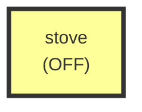

# 🚀 VirtualHome Agent Episode Log


### [GoalReasoner (Module A - Intent)] Output
```json
{
  "is_instruction_obviously_vague": true,
  "clarification_question": "What exact safe state should the stove be in?",
  "target_object": "stove",
  "location_hint": "kitchen",
  "reasoning_chain": [
    {
      "question": "Why does the user want this object?",
      "answer": "To ensure the stove is in a safe condition."
    },
    {
      "question": "Why is that important?",
      "answer": "To reduce the risk of fire, burns, or other hazards when no one is present."
    },
    {
      "question": "What fundamental need does this fulfill?",
      "answer": "Physical safety and hazard prevention in the home."
    },
    {
      "question": "Are there any deeper psychological or physical motivations?",
      "answer": "The user may want peace of mind that the kitchen is secure and no accidental heating or ignition can occur."
    }
  ],
  "deep_intent": "The user wants to prevent kitchen-related hazards by putting the stove into a safe state.",
  "acceptable_alternatives_properties": [
    {
      "priority": 1,
      "description": "Other cooking appliances that can be turned off or made safe, such as an oven or hot plate"
    },
    {
      "priority": 2,
      "description": "Nearby heat sources or ignition devices that should be switched off, unplugged, or left in a safe state"
    },
    {
      "priority": 3,
      "description": "Other household items that may pose an immediate fire risk and can be secured or disabled"
    },
    {
      "priority": 4,
      "description": "Any household hazard-prevention action that reduces the chance of accidental injury or fire"
    }
  ]
}
```

### [RoboStateMultiTaskController] Output
```json
{
  "action": "[ask] What exact safe state should the stove be in?",
  "active_task_id": "task_1",
  "task_context": {
    "active_task_id": "task_1",
    "pending_task_ids": [],
    "satisfied_task_ids": []
  },
  "source": "goal_reasoner_clarification"
}
```
## Step 0
- **Action**: `[ask] What exact safe state should the stove be in?`
- **Action Success**: `True`
- **Action Message**: Turn it off.
- **Active Task**: `task_1`
- **Decision Source**: `goal_reasoner_clarification`
- **Task Progress**: T5_G2_10_B1=pending
- **SDG Status**:
No SDG active.
- **Observed Items (112)**: floor(206), floor(207), floor(208), floor(209), floor(210), floor(211), wall(212), wall(213), wall(214), wall(215), wall(216), wall(217), ceiling(218), ceiling(219), ceiling(220)...


### [GoalReasoner (Module A - Intent)] Output
```json
{
  "is_instruction_obviously_vague": false,
  "clarification_question": null,
  "target_object": "stove",
  "location_hint": "kitchen",
  "reasoning_chain": [
    {
      "question": "Why does the user want this object?",
      "answer": "To have the stove in a safe state when the kitchen is unattended."
    },
    {
      "question": "Why is that important?",
      "answer": "To reduce the risk of fire, burns, or other hazards from an active stove."
    },
    {
      "question": "What fundamental need does this fulfill?",
      "answer": "It fulfills the need for household safety."
    },
    {
      "question": "Are there any deeper psychological or physical motivations?",
      "answer": "Yes: it helps ensure safety and peace of mind by preventing danger when nobody is present."
    }
  ],
  "deep_intent": "Maintain household safety by ensuring a cooking appliance is not left active when unattended.",
  "acceptable_alternatives_properties": [
    {
      "priority": 1,
      "description": "Other kitchen appliances or heat sources that may also need to be turned off when unattended, such as an oven or hotplate"
    },
    {
      "priority": 2,
      "description": "Other household devices that can create heat or fire risk and should be powered down for safety"
    },
    {
      "priority": 3,
      "description": "General safety checks for appliances in the kitchen to ensure nothing hazardous is left on"
    },
    {
      "priority": 4,
      "description": "No close cross-category substitute; the core need is specifically unattended heat-source safety"
    }
  ]
}
```

### [PerceptionFilter] Output
```json
{
  "reasoning": "The goal is to ensure the stove is OFF for kitchen safety. The only required target object is the stove; no additional tools or locations are strictly necessary because the SDG only specifies the stove state.",
  "selected_classes": [
    "stove",
    "plate",
    "character"
  ],
  "raw_class_count": 54
}
```

### [LLMExecutor] Output
```json
{
  "reasoning": "The active SDG has a single goal node: stove OFF. The current graph shows stove(311) is ON and in the kitchen. To satisfy the goal, I need to turn it off. Since switch controls require proximity, the immediate next atomic step is to walk to the stove before attempting [switchoff] on the following step.",
  "satisfied_nodes": [],
  "current_node_focus": "N1",
  "mapped_variables": {},
  "action": "[walk] <stove> (311)"
}
```

### [RoboStateMultiTaskController] Output
```json
{
  "action": "[walk] <stove> (311)",
  "active_task_id": "task_1",
  "task_context": {
    "active_task_id": "task_1",
    "pending_task_ids": [],
    "satisfied_task_ids": []
  },
  "source": "llm_executor"
}
```
## Step 1
- **Action**: `[walk] <stove> (311)`
- **Action Success**: `True`
- **Action Message**: {'0': {'message': 'Success'}}
- **Active Task**: `task_1`
- **Decision Source**: `llm_executor`
- **Task Progress**: T5_G2_10_B1=pending
- **SDG Status**:

- **Observed Items (10)**: plate(273), plate(277), plate(278), plate(285), stove(311) [ON,CLOSED], character(1), bathroom(11), bedroom(73), kitchen(205), livingroom(335)


### [PerceptionFilter] Output
```json
{
  "reasoning": "Reused cached class selection.",
  "selected_classes": [
    "stove",
    "plate",
    "character"
  ],
  "raw_class_count": 54
}
```

### [LLMExecutor] Output
```json
{
  "reasoning": "The SDG has a single goal node: stove must be OFF. The current graph shows stove(311) is ON and I am already close to it, so the next step is to switch it off. The stove has HAS_SWITCH, so [switchoff] is the correct atomic action.",
  "satisfied_nodes": [],
  "current_node_focus": "N1",
  "mapped_variables": {},
  "action": "[switchoff] <stove> (311)"
}
```

### [RoboStateMultiTaskController] Output
```json
{
  "action": "[switchoff] <stove> (311)",
  "active_task_id": "task_1",
  "task_context": {
    "active_task_id": "task_1",
    "pending_task_ids": [],
    "satisfied_task_ids": []
  },
  "source": "llm_executor"
}
```
## Step 2
- **Action**: `[switchoff] <stove> (311)`
- **Action Success**: `True`
- **Action Message**: Faked switch operation in Python layer (bypassed Unity failure)
- **Active Task**: `task_1`
- **Decision Source**: `llm_executor`
- **Task Progress**: T5_G2_10_B1=done
- **SDG Status**:

- **Observed Items (10)**: plate(273), plate(277), plate(278), plate(285), stove(311) [ON,CLOSED], character(1), bathroom(11), bedroom(73), kitchen(205), livingroom(335)

