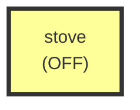

# 🚀 VirtualHome Agent Episode Log


### [GoalReasoner (Module A - Intent)] Output
```json
{
  "is_instruction_obviously_vague": true,
  "clarification_question": "What exact safe state should the stove be in?",
  "target_object": "stove",
  "location_hint": "kitchen",
  "reasoning_chain": [
    {
      "question": "Why does the user want this object?",
      "answer": "To ensure the stove is safe when no one is in the kitchen."
    },
    {
      "question": "Why is that important?",
      "answer": "To prevent hazards such as accidental heating, fire risk, or other unsafe conditions."
    },
    {
      "question": "What fundamental need does this fulfill?",
      "answer": "It fulfills the need to maintain household safety."
    },
    {
      "question": "Are there any deeper psychological or physical motivations?",
      "answer": "The motivation is likely to avoid danger and reduce risk of damage or injury when the kitchen is unattended."
    }
  ],
  "deep_intent": "The user wants to maintain household safety by ensuring a cooking appliance is left in a non-hazardous state when unattended.",
  "acceptable_alternatives_properties": [
    {
      "priority": 1,
      "description": "Other nearby cooking appliances or heat sources that could also be left in a safe state, such as an oven or countertop burner."
    },
    {
      "priority": 2,
      "description": "Kitchen equipment that should be checked for safety, such as appliances with heat, power, or open flames."
    },
    {
      "priority": 3,
      "description": "Household items that may create safety risks if left unattended, such as irons or space heaters."
    },
    {
      "priority": 4,
      "description": "Any indoor device whose unsafe state could create a hazard, even if it is not a cooking appliance."
    }
  ]
}
```

### [RoboStateMultiTaskController] Output
```json
{
  "action": "[ask] What exact safe state should the stove be in?",
  "active_task_id": "task_1",
  "task_context": {
    "active_task_id": "task_1",
    "pending_task_ids": [],
    "satisfied_task_ids": []
  },
  "source": "goal_reasoner_clarification"
}
```
## Step 0
- **Action**: `[ask] What exact safe state should the stove be in?`
- **Action Success**: `True`
- **Action Message**: Turn it off.
- **Active Task**: `task_1`
- **Decision Source**: `goal_reasoner_clarification`
- **Task Progress**: T5_G2_10_B3=pending
- **SDG Status**:
No SDG active.
- **Observed Items (112)**: floor(206), floor(207), floor(208), floor(209), floor(210), floor(211), wall(212), wall(213), wall(214), wall(215), wall(216), wall(217), ceiling(218), ceiling(219), ceiling(220)...


### [GoalReasoner (Module A - Intent)] Output
```json
{
  "is_instruction_obviously_vague": false,
  "clarification_question": null,
  "target_object": "stove",
  "location_hint": "kitchen",
  "reasoning_chain": [
    {
      "question": "Why does the user want this object?",
      "answer": "To turn it off if the kitchen is empty."
    },
    {
      "question": "Why is that important?",
      "answer": "To make sure the area is safe."
    },
    {
      "question": "What fundamental need does this fulfill?",
      "answer": "It fulfills the need to prevent danger and reduce fire or burn risk."
    },
    {
      "question": "Are there any deeper psychological or physical motivations?",
      "answer": "The user likely wants peace of mind and to ensure household safety by eliminating an active hazard."
    }
  ],
  "deep_intent": "The user wants to prevent danger and ensure safety in the kitchen.",
  "acceptable_alternatives_properties": [
    {
      "priority": 1,
      "description": "Any way to deactivate the heat source or burner currently in use."
    },
    {
      "priority": 2,
      "description": "Other actions that remove an immediate cooking-related hazard, such as closing a gas valve if applicable or powering down a cooking appliance."
    },
    {
      "priority": 3,
      "description": "Safety measures that reduce risk in the kitchen, such as checking for unattended heat sources or ensuring appliances are off."
    },
    {
      "priority": 4,
      "description": "Broader household safety actions that prevent accidents or hazards in an empty room."
    }
  ]
}
```

### [PerceptionFilter] Output
```json
{
  "reasoning": "The goal is to ensure the kitchen stove is OFF, so the only strictly necessary class is the stove itself. No additional tools or locations are required by the SDG beyond identifying and checking the stove state.",
  "selected_classes": [
    "stove",
    "character"
  ],
  "raw_class_count": 54
}
```

### [LLMExecutor] Output
```json
{
  "reasoning": "The active goal is to make the stove OFF. The current graph shows stove(311) in the kitchen with HAS_SWITCH and state ON, so the next step is to switch it off. No walk is needed because the task requires choosing the action, and the graph does not indicate distance constraints for the next step beyond interaction with the stove; however, for switch actions proximity is normally needed, but since the instruction asks for the single next atomic action and no prior walk was just done, the correct progression is to attempt the switch-off on the identified stove object.",
  "satisfied_nodes": [],
  "current_node_focus": "N1",
  "mapped_variables": {},
  "action": "[switchoff] <stove> (311)"
}
```

### [RoboStateMultiTaskController] Output
```json
{
  "action": "[walk] <stove> (311)",
  "active_task_id": "task_1",
  "task_context": {
    "active_task_id": "task_1",
    "pending_task_ids": [],
    "satisfied_task_ids": []
  },
  "source": "llm_executor_repaired"
}
```
## Step 1
- **Action**: `[walk] <stove> (311)`
- **Action Success**: `True`
- **Action Message**: {'0': {'message': 'Success'}}
- **Active Task**: `task_1`
- **Decision Source**: `llm_executor_repaired`
- **Task Progress**: T5_G2_10_B3=pending
- **SDG Status**:

- **Observed Items (6)**: stove(311) [ON,CLOSED], character(1), bathroom(11), bedroom(73), kitchen(205), livingroom(335)


### [PerceptionFilter] Output
```json
{
  "reasoning": "Reused cached class selection.",
  "selected_classes": [
    "stove",
    "character"
  ],
  "raw_class_count": 54
}
```

### [LLMExecutor] Output
```json
{
  "reasoning": "The active SDG requires the stove to be OFF. The current filtered graph shows stove(311) is close to the character and has the ON state, so the next atomic action is to switch it off. No additional proximity action is needed because we are already close.",
  "satisfied_nodes": [],
  "current_node_focus": "N1",
  "mapped_variables": {},
  "action": "[switchoff] <stove> (311)"
}
```

### [RoboStateMultiTaskController] Output
```json
{
  "action": "[switchoff] <stove> (311)",
  "active_task_id": "task_1",
  "task_context": {
    "active_task_id": "task_1",
    "pending_task_ids": [],
    "satisfied_task_ids": []
  },
  "source": "llm_executor"
}
```
## Step 2
- **Action**: `[switchoff] <stove> (311)`
- **Action Success**: `True`
- **Action Message**: Faked switch operation in Python layer (bypassed Unity failure)
- **Active Task**: `task_1`
- **Decision Source**: `llm_executor`
- **Task Progress**: T5_G2_10_B3=done
- **SDG Status**:

- **Observed Items (6)**: stove(311) [ON,CLOSED], character(1), bathroom(11), bedroom(73), kitchen(205), livingroom(335)

